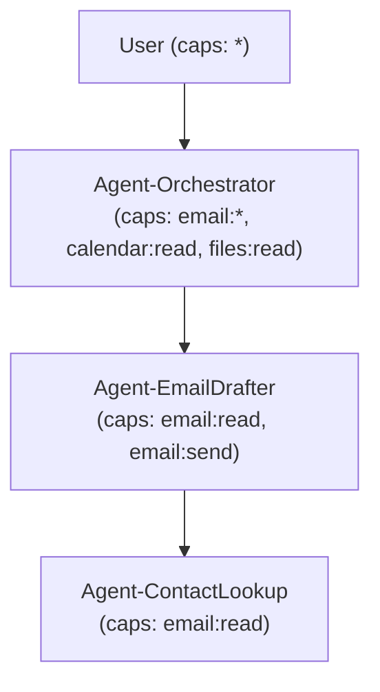
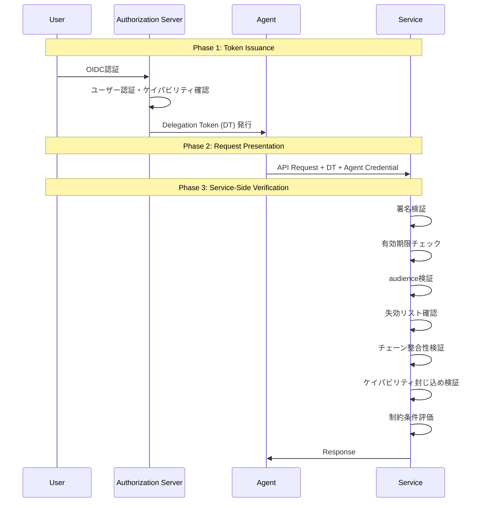

## 論文概要（Abstract）

本記事は [https://arxiv.org/abs/2501.10236](https://arxiv.org/abs/2501.10236) の解説記事です。

自律AIエージェントがユーザーの代理で外部サービスにアクセスする際、「このエージェントは誰の権限で何をしてよいのか」を暗号的に保証する仕組みが欠けている。本論文では、署名付きDelegation Token（DT）、階層的ケイパビリティモデル、形式的な認可ロジックからなるフレームワークを提案している。OAuth 2.0/OIDCの既存インフラと互換性を維持しつつ、エージェント固有のセマンティクス（ケイパビリティの必須減衰、デリゲーションチェーン検証、失効）を扱う点が特徴である。

この記事は [Zenn記事: Bedrock AgentCore Policyで社内申請ワークフローを自動化するマルチエージェント設計](https://zenn.dev/0h_n0/articles/6493dd54baab75) の深掘りです。

## 情報源

- **arXiv ID**: 2501.10236
- **URL**: [https://arxiv.org/abs/2501.10236](https://arxiv.org/abs/2501.10236)
- **著者**: Tobin South, Samuele Marro, et al.
- **発表年**: 2025年1月
- **分野**: Cryptography and Security (cs.CR), Artificial Intelligence (cs.AI)

## 背景と動機（Background & Motivation）

### エージェント時代の認可問題

マルチエージェントシステムにおいて、エージェントがユーザーの代理で外部APIを呼び出す場面が急速に増えている。Zenn記事で取り上げたBedrock AgentCoreのようなフレームワークでは、Policyベースのアクセス制御を提供しているが、エージェント間のデリゲーション（権限委譲）をどう暗号的に保証するかは依然として未解決の課題である。

### 従来手法の限界

著者らは、既存のアプローチには以下の問題があると指摘している。

1. **OAuth 2.0の限界**: OAuthはユーザーがアプリケーションに権限を委譲する設計であり、エージェントが別のエージェントに権限を再委譲するユースケースを想定していない
2. **ケイパビリティ管理の欠如**: 権限がチェーンの中で増幅（escalation）しないことを形式的に保証する仕組みがない
3. **アイデンティティの不明確さ**: エージェントが「誰として」行動しているのか、暗号的に検証可能な形で表現できない

これらの課題に対し、本論文は既存のOAuth 2.0/OIDCインフラを拡張する形で、エージェント固有の認可フレームワークを構築している。

## 主要な貢献（Key Contributions）

著者らの主要な貢献は以下の6点である。

- **形式モデルの定義**: principal（行為主体）、authority relationships（権限関係）、"acting on behalf of"（代理行為）のセマンティクスを形式的に定義
- **Delegation Token（DT）仕様**: アイデンティティ、ケイパビリティ、制約、デリゲーションチェーンを含む署名付き構造化クレデンシャルの設計
- **ケイパビリティ階層**: 必須減衰（mandatory attenuation）を伴う束（lattice）構造の定義
- **OAuth 2.0互換の認可プロトコル**: 3フェーズの認可プロトコル設計
- **形式証明**: Dolev-Yao脅威モデルのもとで4つのセキュリティ性質を証明
- **失効メカニズム**: 短寿命トークンとオプショナル失効リストの組み合わせ

## 技術的詳細（Technical Details）

### Delegation Token（DT）の設計

DTはJWT互換の署名付きJSON構造として設計されている。以下にペイロードの主要フィールドを示す。

```json
{
  "iss": "https://auth.example.com",
  "sub": "agent-orchestrator-001",
  "aud": "https://api.calendar.example.com",
  "iat": 1706140800,
  "exp": 1706144400,
  "jti": "dt-unique-id-12345",
  "capabilities": ["calendar:read", "calendar:write"],
  "constraints": {
    "max_events_per_day": 5,
    "allowed_calendars": ["work"]
  },
  "delegation_chain": [
    "sha256:abc123..."
  ],
  "agent_attestation": {
    "agent_id": "agent-orchestrator-001",
    "model": "claude-3",
    "runtime_hash": "sha256:def456..."
  },
  "purpose": "Schedule meeting on behalf of user"
}
```

著者らは署名アルゴリズムとしてRS256またはES256を推奨しており、トークンの有効期限はデフォルト最大1時間を推奨している。短寿命設計により、トークンが漏洩した場合の被害を時間的に限定する狙いがある。

### ケイパビリティ階層（Capability Hierarchy）

ケイパビリティは束（lattice）構造として組織化されている。著者らは以下の階層的命名規則を定義している。

- `*`（ワイルドカード）: 全ケイパビリティ。人間のプリンシパルのみが保持可能
- サービススコープ名前空間: `calendar:*`, `email:read`, `email:send`, `files:read:folder:X`
- コロン区切りの階層構造

フレームワークの核となる不変条件は **Attenuation Rule（減衰規則）** である。

$$
\forall \text{DT}_i \in \text{chain}: \text{caps}(\text{DT}_i) \subseteq \text{caps}(\text{DT}_{i-1})
$$

ここで、
- $\text{DT}_i$: デリゲーションチェーンの$i$番目のDelegation Token
- $\text{caps}(\text{DT}_i)$: $\text{DT}_i$に含まれるケイパビリティの集合
- $\subseteq$: 部分集合関係

この規則により、デリゲーションが進むたびにケイパビリティは狭まる一方であり、拡大（escalation）は構造的に不可能になる。

以下にデリゲーションチェーンの具体例を示す。



著者らはケイパビリティに対する3つの代数的操作を定義している。

- **intersect（交差）**: デリゲーション時に適用。親のケイパビリティと要求されたケイパビリティの共通部分を取る
- **union（和集合）**: デリゲーション時には禁止。ケイパビリティの拡大を防ぐため
- **check（検査）**: 認可時に適用。要求されたアクションがケイパビリティ集合に含まれるか判定

$$
\text{caps}_{\text{delegated}} = \text{caps}_{\text{parent}} \cap \text{caps}_{\text{requested}}
$$

Lemma 3.2において、intersection-onlyルールが任意のデリゲーション深さ$n$でケイパビリティ封じ込め（containment）を保証することが証明されている。

### 認可プロトコル（3フェーズ）

著者らは認可プロトコルを3つのフェーズに分割して設計している。



**Phase 1（Token Issuance）**: ユーザーがOIDCで認証し、Authorization Server（AS）がDTを発行する。このフェーズは既存のOAuth 2.0フローと互換性がある。

**Phase 2（Request Presentation）**: エージェントがDTと自身のクレデンシャル（agent attestation）をサービスに提示する。

**Phase 3（Service-Side Verification）**: サービス側で以下の検証を順次実行する。
1. DTの署名検証（RS256/ES256）
2. 有効期限（`exp`）の確認
3. audience（`aud`）が自サービスと一致するか
4. 失効リスト（CRL）の確認
5. デリゲーションチェーンの整合性（各DTのハッシュチェーン検証）
6. ケイパビリティ封じ込め（Attenuation Rule）の確認
7. 制約条件（`constraints`）の評価

## 実装のポイント（Implementation）

本論文は理論的フレームワークの提案であり、実装やプロトタイプは提供されていない。ただし、著者らの設計から、実装時に考慮すべきポイントを整理する。

### DTの生成と検証

DTはJWT互換であるため、既存のJWTライブラリ（PyJWT, jose等）を基盤として拡張できる。以下は、DTの検証ロジックの擬似実装である。

```python
from dataclasses import dataclass
from typing import Optional


@dataclass
class DelegationToken:
    """Delegation Token構造体

    Attributes:
        iss: 発行者のURL
        sub: デリゲートされたエージェントID
        aud: 対象サービスのURL
        capabilities: 許可されたケイパビリティのリスト
        constraints: 制約条件の辞書
        delegation_chain: 先行DTハッシュの順序配列
        exp: 有効期限（UNIXタイムスタンプ）
    """
    iss: str
    sub: str
    aud: str
    capabilities: list[str]
    constraints: dict
    delegation_chain: list[str]
    exp: int
    agent_attestation: Optional[dict] = None


def verify_capability_containment(
    parent_caps: set[str],
    child_caps: set[str],
) -> bool:
    """ケイパビリティ封じ込めの検証

    Args:
        parent_caps: 親DTのケイパビリティ集合
        child_caps: 子DTのケイパビリティ集合

    Returns:
        子が親の部分集合であればTrue
    """
    for cap in child_caps:
        if not _is_covered(cap, parent_caps):
            return False
    return True


def _is_covered(cap: str, parent_caps: set[str]) -> bool:
    """階層的ケイパビリティのカバレッジ判定

    Args:
        cap: チェック対象のケイパビリティ（例: "email:read"）
        parent_caps: 親のケイパビリティ集合

    Returns:
        親の集合にカバーされていればTrue
    """
    if cap in parent_caps:
        return True
    # ワイルドカードチェック: "email:*" は "email:read" をカバー
    parts = cap.split(":")
    for i in range(len(parts)):
        wildcard = ":".join(parts[:i + 1]) + ":*"
        if wildcard in parent_caps:
            return True
    if "*" in parent_caps:
        return True
    return False
```

### 実装上の注意点

1. **デリゲーションチェーンの検証コスト**: チェーンの深さに比例して検証時間が増加する。著者らはチェーンの最大深さに制限を設けることを推奨しているが、具体的な数値は示されていない
2. **失効リストの整合性**: 分散システムにおける失効リストの一貫性は未解決問題として残されている。短寿命トークン（推奨1時間以内）により、失効の必要性自体を低減する設計が採られている
3. **エージェントのstable identifier**: エージェントに安定したIDを付与する仕組みは前提として仮定されているが、その実現方法は論文の範囲外とされている

## 形式証明の結果（Formal Verification Results）

著者らはDolev-Yao脅威モデル（ネットワーク上の全通信を傍受・改ざんできる攻撃者を仮定）のもとで、以下の4つのセキュリティ性質を形式的に証明している。

### Theorem 4.1: Non-Forgery（偽造不可能性）

$$
\forall \text{DT}: \text{Valid}(\text{DT}) \Rightarrow \exists k \in \mathcal{K}_{\text{trusted}}: \text{Sign}(k, \text{DT})
$$

ここで、
- $\text{Valid}(\text{DT})$: DTが検証に通ること
- $\mathcal{K}_{\text{trusted}}$: 信頼された署名鍵の集合
- $\text{Sign}(k, \text{DT})$: 鍵$k$でDTが署名されていること

すなわち、攻撃者が署名鍵を持たない限り、有効なDTを偽造することはできない。

### Theorem 4.2: Capability Containment（ケイパビリティ封じ込め）

$$
\forall n \in \mathbb{N}, \forall \text{DT}_n: \text{caps}(\text{DT}_n) \subseteq \text{caps}(\text{DT}_0)
$$

ここで、
- $n$: デリゲーションチェーンの深さ
- $\text{DT}_0$: ルートのDT（ユーザーが最初に発行）
- $\text{DT}_n$: 深さ$n$のDT

デリゲーションチェーンがどれだけ深くなっても、最終的なエージェントのケイパビリティはユーザーの元のケイパビリティを超えない。これはAttenuation Ruleのintersection-onlyルールから直接導かれる。

### Theorem 4.3: Chain Integrity（チェーン整合性）

デリゲーションチェーンに対する以下の攻撃を検出可能であることが証明されている。

- **スプライス攻撃**: チェーンの途中にDTを挿入
- **並び替え攻撃**: チェーン内のDTの順序を変更
- **置換攻撃**: チェーン内のDTを別のDTに置換

各DTが先行DTのハッシュを`delegation_chain`フィールドに含む設計により、チェーンの任意の改ざんが検出される。

### Theorem 4.4: Revocation Completeness（失効完全性）

失効リスト（CRL）を確認するサービスにおいて、失効済みトークンの使用を防止できることが条件付きで証明されている。条件とは、サービスがCRLの最新版にアクセスできることであり、分散環境でのCRL伝搬遅延は保証の範囲外である。

## 実運用への応用（Practical Applications）

### Bedrock AgentCoreとの接続

Zenn記事で取り上げたBedrock AgentCoreのマルチエージェント設計は、Policy機能によるアクセス制御を提供している。本論文のDelegation Tokenフレームワークは、AgentCoreのPolicy層を補完する形で適用できる可能性がある。

具体的には、以下のような統合が考えられる。

1. **AgentCore Policyとの連携**: AgentCoreのPolicyで定義したアクション許可をDTのcapabilitiesフィールドにマッピングし、エージェント間の権限委譲を暗号的に保証する
2. **ワークフロー自動化への適用**: 社内申請ワークフローにおいて、承認エージェントが実行エージェントに権限を委譲する際、DTによりスコープの限定と監査証跡の確保が可能になる
3. **マルチエージェント間の信頼チェーン**: Orchestratorエージェントが専門エージェント（メール作成、スケジュール管理等）に権限を委譲する際、Attenuation Ruleにより権限の拡大を構造的に防止できる

### 課題と制約

著者ら自身が認めている通り、本論文にはいくつかの重要な制約がある。

- **実装なし**: プロトタイプや実験的評価が存在しないため、実運用でのパフォーマンス（レイテンシ、スループット）は不明
- **分散失効の一貫性**: マイクロサービス環境での失効リストの即座の伝搬は保証されない
- **動的ケイパビリティ拡張**: 実行時にエージェントが追加権限を要求するケースは対応していない
- **UX問題**: ユーザーがケイパビリティを正確に指定するためのインターフェース設計は未対処
- **プライバシー**: デリゲーションチェーンの内容がサービス側に露出するため、エージェント構成の機密性は守られない

## 関連研究（Related Work）

著者らは以下の関連技術との比較を行っている。

- **OAuth 2.0/OIDC**: 最も広く使われている認可フレームワークだが、エージェント間の再委譲やケイパビリティ減衰の概念がない。本論文はOAuth 2.0を拡張する形で設計されている
- **Macaroons**: Google発の分散認可トークン。caveats（制約条件）による減衰をサポートするが、構造化されたケイパビリティ階層やデリゲーションチェーンの形式検証は提供していない
- **SPIFFE/SPIRE**: サービスメッシュにおけるワークロードアイデンティティの標準。マシン間認証に特化しており、ケイパビリティモデルは含まない
- **W3C Verifiable Credentials / UCAN**: 分散型アイデンティティの標準。UCANは特にケイパビリティベースの認可を扱うが、AIエージェント固有のセマンティクス（attestation, purpose等）は含まない
- **Zanzibar**: Googleの関係ベースアクセス制御システム。大規模な権限管理に適するが、デリゲーションチェーンの暗号的検証は対象外

## まとめと今後の展望

本論文は、AIエージェントの認証委譲という新しい問題領域に対し、Delegation Token、ケイパビリティ階層、形式証明を組み合わせた理論的フレームワークを提示している。OAuth 2.0/OIDCとの互換性を維持しつつ、エージェント固有の要件（必須減衰、チェーン検証、失効）を扱える点が特徴である。

ただし、実装やプロトタイプが存在しないため、実運用での性能やUXについては今後の検証が必要である。著者らが認める通り、分散失効の一貫性、動的ケイパビリティ拡張、プライバシー保護など、未解決の課題も多い。

今後の研究方向としては、(1) プロトタイプ実装と性能評価、(2) 分散環境での失効リスト同期、(3) ケイパビリティ付与のUX設計、(4) デリゲーションチェーンのプライバシー保護（ゼロ知識証明の応用等）が挙げられる。Bedrock AgentCoreのようなプラットフォームとの統合検証も重要な次のステップである。

## 参考文献

- **arXiv**: [https://arxiv.org/abs/2501.10236](https://arxiv.org/abs/2501.10236)
- **Related Zenn article**: [https://zenn.dev/0h_n0/articles/6493dd54baab75](https://zenn.dev/0h_n0/articles/6493dd54baab75)
- **OAuth 2.0**: [RFC 6749](https://tools.ietf.org/html/rfc6749)
- **OpenID Connect**: [https://openid.net/connect/](https://openid.net/connect/)
- **Macaroons**: Birgisson, A. et al., "Macaroons: Cookies with Contextual Caveats for Decentralized Authorization in the Cloud," NDSS 2014
- **SPIFFE**: [https://spiffe.io/](https://spiffe.io/)
- **UCAN**: [https://ucan.xyz/](https://ucan.xyz/)
