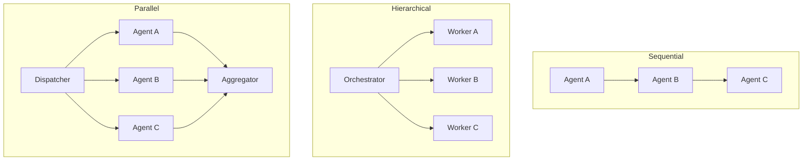
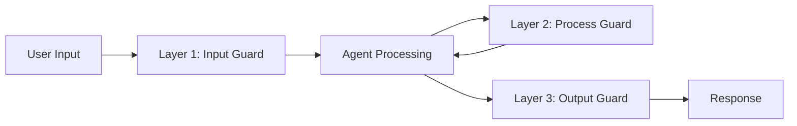

本記事は <https://arxiv.org/abs/2501.17822> の解説記事です。

## 論文概要（Abstract）

本論文は、エンタープライズ環境においてAIをチャットボットレベルの対話支援から、信頼性の高い業務自動化へと移行するためのマルチエージェントオーケストレーションフレームワークを提案している。著者らは、構造化されたオーケストレーションパターン（Sequential, Hierarchical, Parallel, Event-driven）、RBAC/ABACによるエージェント権限制御、3層ガードレールアーキテクチャ（Input, Process, Output）、リスクスコアベースのHuman-in-the-Loopプロトコルを体系化し、3つのエンタープライズパイロット（金融文書処理、ITサービスマネジメント、HRオンボーディング）で実証結果を報告している。

この記事は [Zenn記事: Bedrock AgentCore Policyで社内申請ワークフローを自動化するマルチエージェント設計](https://zenn.dev/0h_n0/articles/6493dd54baab75) の深掘りです。

## 情報源

- **arXiv ID**: 2501.17822
- **URL**: <https://arxiv.org/abs/2501.17822>
- **著者**: Sobhan Hemati et al.
- **発表年**: 2025
- **分野**: cs.AI（Artificial Intelligence）, cs.MA（Multiagent Systems）

## 背景と動機（Background & Motivation）

大規模言語モデル（LLM）を活用したAIエージェントは、カスタマーサポートやコード生成といったタスクで実用化が進んでいる。しかし、エンタープライズの業務ワークフロー自動化においては、単一エージェントでは対応が困難な複合的な課題が存在する。具体的には、複数部門にまたがる承認フロー、機密データへのアクセス制御、規制コンプライアンスの遵守、障害時のフォールバック対応などが挙げられる。

従来のマルチエージェントフレームワーク（LangGraph、AutoGen、CrewAI等）は、エージェント間の連携パターンを提供するものの、エンタープライズ固有の要件であるきめ細かなアクセス制御、多層的な安全性保証、段階的な人間介入メカニズムを統合的にカバーしていない。本論文は、これらの課題を解決するために、オーケストレーション・ガバナンス・安全性を一体化したフレームワークを提案している。

## 主要な貢献（Key Contributions）

- **貢献1**: マルチエージェントオーケストレーションパターンの体系的分類（Sequential, Hierarchical, Parallel, Event-driven）と各パターンの適用シナリオの整理
- **貢献2**: Input/Process/Outputの3層ガードレールアーキテクチャの設計と、各層での具体的な防御メカニズムの定義
- **貢献3**: RBAC（Role-Based Access Control）とABAC（Attribute-Based Access Control）を統合したエージェント権限モデルの提案
- **貢献4**: リスクスコアに基づく4段階のHuman-in-the-Loopオーバーサイトプロトコル（Tier 0-3）の設計
- **貢献5**: 金融文書処理、ITサービスマネジメント、HRオンボーディングの3つのエンタープライズパイロットでの定量的実証

## 技術的詳細（Technical Details）

### オーケストレーションパターン

著者らは、エンタープライズワークフローに適用可能な4つのオーケストレーションパターンを分類している。



**Sequential Pipeline**: エージェントが固定順序で処理を受け渡す。請求書処理やコンプライアンスチェックなど、各ステップの出力が次のステップの入力となる定型ワークフローに適している。障害時はパイプライン全体が停止するため、各ステージにリトライ機構とデッドレターキューを設けることが推奨されている。

**Hierarchical（Manager-Worker）**: オーケストレータエージェントがタスクをサブタスクに分解し、専門エージェントに委譲する。著者らはタスクレジャー（Task Ledger）を用いた状態管理を提案しており、各サブタスクの進捗、依存関係、完了状態をオーケストレータが集中管理する。Zenn記事で紹介されているBedrock AgentCore Policyの設計は、このパターンに近い。

**Parallel Fan-Out/Fan-In**: 独立なサブタスクを複数エージェントで並列実行し、結果を集約する。集約方式として、多数決投票（Majority Voting）と信頼度重み付き集約（Confidence-Weighted Aggregation）が提案されている。

**Event-Driven**: イベントストリーム駆動で動作する。監視、アラート処理、継続的な環境調整タスクに適しており、各エージェントがイベントをサブスクライブし、条件に合致した場合にアクションを実行する。

### RBAC/ABACによるエージェント権限制御

著者らは、RBAC（ロールベース）とABAC（属性ベース）を組み合わせたハイブリッドなアクセス制御モデルを提案している。

**RBAC層**では、エージェントにロール（`data-reader`、`approver`、`executor`等）を割り当て、OAuth 2.0/OIDCトークン経由で認証する。各ロールには許可されるアクション（読み取り、書き込み、承認、実行）のセットが紐づく。

**ABAC層**では、以下のコンテキスト属性に基づいて動的にアクセス可否を判定する。

$$
\text{Decision} = f(\text{role}, \text{dept}, \text{classification}, \text{time}, \text{region}, \text{sensitivity})
$$

ここで、
- $\text{role}$: RBACで割り当てられたエージェントのロール
- $\text{dept}$: リクエスト元の部署
- $\text{classification}$: データの機密分類レベル（public, internal, confidential, restricted）
- $\text{time}$: リクエストの時間帯
- $\text{region}$: 地理的リージョン
- $\text{sensitivity}$: タスクの感度スコア（0.0-1.0の連続値）

著者らの報告によると、ABACポリシー評価のレイテンシは平均15-40msであり、リアルタイムワークフローでの実用性が確認されている。

エンフォースメントポイントは以下の3箇所に設置される:
1. **アクション前チェック**: エージェントがツール呼び出しを行う前にポリシー評価
2. **エージェント間メッセージ検証**: エージェント間通信の内容と宛先を検証
3. **監査ログ**: 全ポリシー評価結果を不変ログとして記録

### 3層ガードレールアーキテクチャ

著者らは、マルチエージェントシステムの安全性を確保するために、Input/Process/Outputの3層からなるガードレールアーキテクチャを提案している。



**Layer 1（Input Guard）**:
- **プロンプトインジェクション検出**: 入力テキストを分類モデルで検査し、悪意あるプロンプト操作を検出
- **PII検出・削除**: 個人識別情報（氏名、住所、社会保障番号等）を正規表現とNERモデルで検出し、マスキングまたは削除
- **スキーマバリデーション**: 入力がAPIスキーマに適合しているか検証

**Layer 2（Process Guard）**:
- **ツール呼び出しホワイトリスト**: エージェントが呼び出せるツール・APIを事前定義のホワイトリストで制限
- **リソース消費制限**: トークン使用量、API呼び出し回数、実行時間の上限を設定
- **中間出力検証**: エージェント間で受け渡されるデータの整合性チェック
- **異常検出**: 通常と異なるパターン（急激なトークン消費増加等）をリアルタイム監視

**Layer 3（Output Guard）**:
- **事実整合性チェック**: 出力が入力データおよびナレッジベースと矛盾しないか検証
- **毒性フィルタリング**: 不適切・有害な出力をフィルタリング
- **出力スキーマ強制**: レスポンスが期待されるJSON/XMLスキーマに適合しているか検証

### Human-in-the-Loopオーバーサイトプロトコル

著者らは、タスクのリスクスコア$r \in [0, 1]$に基づいて4段階の人間介入レベルを定義している。

| Tier | リスクスコア $r$ | 動作 | ユースケース例 |
|------|-----------------|------|--------------|
| Tier 0 | $r < 0.3$ | 完全自動実行 | 定型的なデータ取得、ログ参照 |
| Tier 1 | $0.3 \leq r < 0.6$ | 実行後に人間へ通知 | 経費精算の自動承認（低額） |
| Tier 2 | $0.6 \leq r < 0.85$ | 実行前に人間の承認が必要 | 契約書の修正、高額決済 |
| Tier 3 | $r \geq 0.85$ | 人間に完全引き渡し | 法務判断、規制対応、例外処理 |

リスクスコアの算出には、タスクの金額影響度、データ機密レベル、規制要件、過去のエラー率などが考慮される。著者らは、このスコアモデルをエンタープライズごとにキャリブレーションする必要があると指摘している。

## 実装のポイント（Implementation）

本論文の設計をプロダクション環境に適用する際、以下の点に注意が必要である。

**ポリシーエンジンの設計**: ABACポリシーの評価は全エージェントアクションの前に実行されるため、レイテンシが累積する。著者らの報告では15-40msの評価時間であるが、複雑なポリシーチェーンやネストされた条件ではさらに増加する可能性がある。ポリシー評価結果のキャッシュ（同一コンテキストでの再評価回避）が有効な最適化手法となる。

**ガードレール層のパイプライン化**: 3層のガードレールを直列実行すると、各層の処理時間が加算される。Layer 1のPII検出とスキーマバリデーションは並列実行可能であり、Layer 3の事実整合性チェックは非同期で実行し、結果を後追いで検証するアプローチも検討に値する。

**タスクレジャーの永続化**: Hierarchicalパターンでは、オーケストレータの障害時にサブタスクの状態を復元できるよう、タスクレジャーを永続化ストア（DynamoDB、Redis等）に保存する必要がある。

**リスクスコアモデルの運用**: 著者らが指摘するように、リスクスコアモデルはエンタープライズの業務特性に応じたキャリブレーションが不可欠である。初期運用ではTier 2（承認必須）の閾値を低めに設定し、運用データの蓄積に伴い段階的に自動化率を引き上げるアプローチが現実的である。

## Production Deployment Guide

### AWS実装パターン（コスト最適化重視）

本論文のマルチエージェントオーケストレーションフレームワークをAWS上に構築する場合、トラフィック量に応じた3つの構成パターンが考えられる。

| 構成 | トラフィック | 主要サービス | 月額コスト概算 |
|------|------------|-------------|--------------|
| Small | ~100 req/日 | Lambda + Bedrock + Step Functions | $80-200 |
| Medium | ~1,000 req/日 | ECS Fargate + Bedrock + SQS | $400-900 |
| Large | 10,000+ req/日 | EKS + Spot + Bedrock Batch | $2,500-6,000 |

**Small構成（~100 req/日）**: AWS Step Functionsでオーケストレーションパターンを実装し、各エージェントをLambda関数として配置する。Sequential/Hierarchicalパターンの実装にStep Functionsのワークフロー定義が直接対応する。Bedrock（Claude/Nova）でLLM推論を実行し、DynamoDBにタスクレジャーを保存する。ガードレールにはBedrock Guardrailsを活用し、ABAC評価はLambda Authorizer内で実行する。月額内訳: Lambda $5-15、Step Functions $10-25、Bedrock $50-120、DynamoDB $10-30、その他 $5-10。

**Medium構成（~1,000 req/日）**: ECS Fargateでエージェントコンテナを常駐させ、SQSでイベント駆動パターンを実現する。並列Fan-Out/Fan-InパターンにはSQS + Lambdaを組み合わせる。ElastiCacheでポリシー評価結果をキャッシュし、レイテンシを削減する。月額内訳: ECS Fargate $100-250、Bedrock $200-400、SQS $5-15、ElastiCache $50-100、CloudWatch $20-50、その他 $25-85。

**Large構成（10,000+ req/日）**: EKS上にKarpenterでSpot Instancesを優先的に割り当て、コスト効率を最大化する。Bedrock Batch APIで大量推論のコストを50%削減する。Kafka（Amazon MSK）でEvent-drivenパターンを実装し、Prometheus + Grafanaでエージェント単位のメトリクスを可視化する。月額内訳: EKS $200-400、EC2 Spot $300-800、Bedrock Batch $1,000-2,500、MSK $400-800、監視 $100-200、その他 $500-1,300。

**コスト削減テクニック**: Spot Instancesをワーカーエージェント用ノードに使用することで最大90%削減。Bedrock Batch APIは非リアルタイムのバッチ処理で50%削減。Prompt Cachingの有効化で反復的なシステムプロンプトのコストを30-90%削減。

> **注意**: 上記コスト試算は2026年3月時点のAWS ap-northeast-1（東京）リージョン料金に基づく概算値です。実際のコストはトラフィックパターン、リージョン、バースト使用量により変動します。最新料金は[AWS料金計算ツール](https://calculator.aws/)で確認してください。

### Terraformインフラコード

**Small構成（Serverless）: Lambda + Step Functions + Bedrock**

```hcl
# --- Small構成: マルチエージェントオーケストレーション (Serverless) ---

terraform {
  required_version = ">= 1.9"
  required_providers {
    aws = {
      source  = "hashicorp/aws"
      version = "~> 5.80"
    }
  }
}

provider "aws" {
  region = "ap-northeast-1"
}

# DynamoDB: タスクレジャー（オンデマンド課金でコスト最適化）
resource "aws_dynamodb_table" "task_ledger" {
  name         = "agent-task-ledger"
  billing_mode = "PAY_PER_REQUEST"
  hash_key     = "task_id"
  range_key    = "agent_id"

  attribute {
    name = "task_id"
    type = "S"
  }
  attribute {
    name = "agent_id"
    type = "S"
  }

  server_side_encryption {
    enabled = true  # KMS暗号化
  }

  point_in_time_recovery {
    enabled = true
  }

  tags = {
    Project = "multi-agent-orchestration"
    Env     = "production"
  }
}

# IAMロール: Lambda用（最小権限）
resource "aws_iam_role" "agent_lambda_role" {
  name = "agent-lambda-execution-role"
  assume_role_policy = jsonencode({
    Version = "2012-10-17"
    Statement = [{
      Action = "sts:AssumeRole"
      Effect = "Allow"
      Principal = { Service = "lambda.amazonaws.com" }
    }]
  })
}

resource "aws_iam_role_policy" "agent_lambda_policy" {
  name = "agent-lambda-policy"
  role = aws_iam_role.agent_lambda_role.id
  policy = jsonencode({
    Version = "2012-10-17"
    Statement = [
      {
        Effect   = "Allow"
        Action   = ["bedrock:InvokeModel", "bedrock:ApplyGuardrail"]
        Resource = "arn:aws:bedrock:ap-northeast-1::foundation-model/*"
      },
      {
        Effect   = "Allow"
        Action   = ["dynamodb:GetItem", "dynamodb:PutItem", "dynamodb:UpdateItem", "dynamodb:Query"]
        Resource = aws_dynamodb_table.task_ledger.arn
      },
      {
        Effect   = "Allow"
        Action   = ["logs:CreateLogGroup", "logs:CreateLogStream", "logs:PutLogEvents"]
        Resource = "arn:aws:logs:*:*:*"
      }
    ]
  })
}

# Lambda: エージェント関数
resource "aws_lambda_function" "orchestrator_agent" {
  function_name = "orchestrator-agent"
  runtime       = "python3.13"
  handler       = "handler.lambda_handler"
  role          = aws_iam_role.agent_lambda_role.arn
  timeout       = 300
  memory_size   = 512  # Bedrock呼び出しに十分なメモリ

  filename         = "lambda/orchestrator.zip"
  source_code_hash = filebase64sha256("lambda/orchestrator.zip")

  environment {
    variables = {
      TASK_LEDGER_TABLE = aws_dynamodb_table.task_ledger.name
      GUARDRAIL_ID      = aws_bedrock_guardrail.agent_guardrail.guardrail_id
      RISK_THRESHOLD_T2 = "0.6"  # Tier 2承認閾値
    }
  }

  tracing_config {
    mode = "Active"  # X-Ray有効化
  }
}

# Bedrock Guardrail: 3層ガードレールのLayer 1/3
resource "aws_bedrock_guardrail" "agent_guardrail" {
  name                      = "agent-input-output-guard"
  blocked_input_messaging   = "入力が安全ポリシーに違反しています。"
  blocked_outputs_messaging = "出力が安全ポリシーに違反しています。"

  content_policy_config {
    filters_config {
      type            = "VIOLENCE"
      input_strength  = "HIGH"
      output_strength = "HIGH"
    }
  }

  sensitive_information_policy_config {
    pii_entities_config {
      type   = "EMAIL"
      action = "ANONYMIZE"
    }
    pii_entities_config {
      type   = "PHONE"
      action = "ANONYMIZE"
    }
  }
}

# CloudWatch アラーム: コスト監視
resource "aws_cloudwatch_metric_alarm" "bedrock_token_spike" {
  alarm_name          = "bedrock-token-usage-spike"
  comparison_operator = "GreaterThanThreshold"
  evaluation_periods  = 2
  metric_name         = "InputTokenCount"
  namespace           = "AWS/Bedrock"
  period              = 3600
  statistic           = "Sum"
  threshold           = 100000
  alarm_description   = "Bedrockトークン使用量が閾値超過"
  alarm_actions       = [aws_sns_topic.alerts.arn]
}

resource "aws_sns_topic" "alerts" {
  name = "agent-orchestration-alerts"
}
```

**Large構成（Container）: EKS + Karpenter + Spot**

```hcl
# --- Large構成: EKS + Karpenter (Spot優先) ---

module "eks" {
  source  = "terraform-aws-modules/eks/aws"
  version = "~> 20.31"

  cluster_name    = "agent-orchestration-cluster"
  cluster_version = "1.31"

  vpc_id     = module.vpc.vpc_id
  subnet_ids = module.vpc.private_subnets

  # Spot Instancesでコスト最大90%削減
  eks_managed_node_groups = {
    system = {
      instance_types = ["m7i.large"]
      min_size       = 2
      max_size       = 3
      desired_size   = 2
      capacity_type  = "ON_DEMAND"  # システムノードはオンデマンド
    }
  }

  cluster_endpoint_public_access = false  # プライベートアクセスのみ
}

# Karpenter: Spot優先の自動スケーリング
resource "kubectl_manifest" "karpenter_nodepool" {
  yaml_body = yamlencode({
    apiVersion = "karpenter.sh/v1"
    kind       = "NodePool"
    metadata   = { name = "agent-workers" }
    spec = {
      template = {
        spec = {
          requirements = [
            { key = "karpenter.sh/capacity-type", operator = "In", values = ["spot", "on-demand"] },
            { key = "node.kubernetes.io/instance-type", operator = "In",
              values = ["m7i.xlarge", "m7a.xlarge", "m6i.xlarge", "c7i.xlarge"] }
          ]
        }
      }
      limits   = { cpu = "160", memory = "640Gi" }
      disruption = {
        consolidationPolicy = "WhenEmptyOrUnderutilized"
        consolidateAfter    = "30s"
      }
    }
  })
}

# Secrets Manager: Bedrock設定
resource "aws_secretsmanager_secret" "bedrock_config" {
  name       = "agent-orchestration/bedrock-config"
  kms_key_id = aws_kms_key.agent_key.arn
}

# AWS Budgets: 月額予算アラート
resource "aws_budgets_budget" "agent_budget" {
  name         = "agent-orchestration-monthly"
  budget_type  = "COST"
  limit_amount = "5000"
  limit_unit   = "USD"
  time_unit    = "MONTHLY"

  notification {
    comparison_operator       = "GREATER_THAN"
    threshold                 = 80
    threshold_type            = "PERCENTAGE"
    notification_type         = "ACTUAL"
    subscriber_email_addresses = ["ops-team@example.com"]
  }
}

resource "aws_kms_key" "agent_key" {
  description             = "KMS key for agent orchestration encryption"
  deletion_window_in_days = 7
  enable_key_rotation     = true
}
```

### 運用・監視設定

**CloudWatch Logs Insights: ガードレールブロック分析**

```
fields @timestamp, agent_id, guardrail_layer, action, risk_score
| filter action = "BLOCKED"
| stats count(*) as block_count by guardrail_layer, bin(1h) as time_bucket
| sort time_bucket desc
```

**CloudWatch Logs Insights: ABACポリシー評価レイテンシ分析**

```
fields @timestamp, policy_eval_ms, agent_role, decision
| filter event_type = "ABAC_EVALUATION"
| stats avg(policy_eval_ms) as avg_latency,
        pctile(policy_eval_ms, 95) as p95_latency,
        pctile(policy_eval_ms, 99) as p99_latency
  by bin(1h)
```

**CloudWatch アラーム設定（Python）**:

```python
import boto3

cloudwatch = boto3.client("cloudwatch", region_name="ap-northeast-1")

def create_guardrail_block_alarm(sns_topic_arn: str) -> None:
    """ガードレールブロック率の異常検知アラームを作成する。

    Args:
        sns_topic_arn: 通知先SNSトピックのARN
    """
    cloudwatch.put_metric_alarm(
        AlarmName="guardrail-block-rate-high",
        MetricName="GuardrailBlockCount",
        Namespace="AgentOrchestration",
        Statistic="Sum",
        Period=3600,
        EvaluationPeriods=2,
        Threshold=50,
        ComparisonOperator="GreaterThanThreshold",
        AlarmDescription="ガードレールブロック数が1時間50件超過",
        AlarmActions=[sns_topic_arn],
    )
```

**X-Ray トレーシング設定（Python）**:

```python
from aws_xray_sdk.core import xray_recorder, patch_all
import boto3

# boto3の自動計装
patch_all()

xray_recorder.configure(service="agent-orchestrator")

def invoke_agent_with_tracing(
    agent_id: str,
    task: dict,
    risk_score: float,
) -> dict:
    """X-Rayトレーシング付きでエージェントを呼び出す。

    Args:
        agent_id: 呼び出し対象のエージェントID
        task: タスク定義（入力データ、パラメータ等）
        risk_score: 算出されたリスクスコア

    Returns:
        エージェントの実行結果
    """
    subsegment = xray_recorder.begin_subsegment(f"agent-{agent_id}")
    subsegment.put_annotation("agent_id", agent_id)
    subsegment.put_annotation("risk_tier", _classify_tier(risk_score))
    subsegment.put_metadata("task", task, "orchestration")

    try:
        result = _execute_agent(agent_id, task)
        subsegment.put_metadata("result_status", "success", "orchestration")
        return result
    except Exception as e:
        subsegment.add_exception(e, stack=True)
        raise
    finally:
        xray_recorder.end_subsegment()

def _classify_tier(risk_score: float) -> str:
    if risk_score < 0.3:
        return "tier0_auto"
    elif risk_score < 0.6:
        return "tier1_notify"
    elif risk_score < 0.85:
        return "tier2_approve"
    return "tier3_human"
```

**Cost Explorer 日次レポート（Python）**:

```python
import boto3
from datetime import datetime, timedelta

ce = boto3.client("ce", region_name="ap-northeast-1")
sns = boto3.client("sns", region_name="ap-northeast-1")

def daily_cost_report(sns_topic_arn: str, threshold_usd: float = 100.0) -> dict:
    """日次コストレポートを取得し、閾値超過時にSNS通知する。

    Args:
        sns_topic_arn: 通知先SNSトピックのARN
        threshold_usd: 日次コスト閾値（USD）

    Returns:
        サービス別コスト内訳
    """
    today = datetime.utcnow().strftime("%Y-%m-%d")
    yesterday = (datetime.utcnow() - timedelta(days=1)).strftime("%Y-%m-%d")

    response = ce.get_cost_and_usage(
        TimePeriod={"Start": yesterday, "End": today},
        Granularity="DAILY",
        Metrics=["UnblendedCost"],
        Filter={
            "Tags": {
                "Key": "Project",
                "Values": ["multi-agent-orchestration"],
            }
        },
        GroupBy=[{"Type": "DIMENSION", "Key": "SERVICE"}],
    )

    total = sum(
        float(g["Metrics"]["UnblendedCost"]["Amount"])
        for r in response["ResultsByTime"]
        for g in r["Groups"]
    )

    if total > threshold_usd:
        sns.publish(
            TopicArn=sns_topic_arn,
            Subject=f"Agent Orchestration cost alert: ${total:.2f}/day",
            Message=f"日次コストが閾値${threshold_usd}を超過: ${total:.2f}",
        )

    return {
        "date": yesterday,
        "total_usd": round(total, 2),
        "services": {
            g["Keys"][0]: float(g["Metrics"]["UnblendedCost"]["Amount"])
            for r in response["ResultsByTime"]
            for g in r["Groups"]
        },
    }
```

### コスト最適化チェックリスト

**アーキテクチャ選択**:
- [ ] トラフィック100 req/日以下: Serverless（Lambda + Step Functions）
- [ ] トラフィック100-5,000 req/日: Hybrid（ECS Fargate + SQS）
- [ ] トラフィック5,000 req/日超: Container（EKS + Karpenter）

**リソース最適化**:
- [ ] EC2/EKSワーカー: Spot Instances優先（最大90%削減）
- [ ] Reserved Instances: 1年コミットで最大72%削減
- [ ] Savings Plans: Compute Savings Plansで柔軟な割引
- [ ] Lambda: メモリサイズをPower Tuningで最適化
- [ ] ECS/EKS: アイドル時のスケールダウン（Karpenter consolidation）
- [ ] NAT Gateway: VPCエンドポイントで代替しコスト削減

**LLMコスト削減**:
- [ ] Bedrock Batch API: 非リアルタイム処理で50%削減
- [ ] Prompt Caching: システムプロンプトのキャッシュで30-90%削減
- [ ] モデル選択ロジック: リスクTier 0-1は軽量モデル、Tier 2-3は高精度モデル
- [ ] トークン数制限: 入出力の最大トークンを制限
- [ ] レスポンスストリーミング: 不要なトークン生成の早期停止

**監視・アラート**:
- [ ] AWS Budgets: 月額上限の80%/100%でアラート
- [ ] CloudWatch アラーム: ガードレールブロック率、ABACレイテンシ
- [ ] Cost Anomaly Detection: 異常コストの自動検知
- [ ] 日次コストレポート: サービス別コスト推移
- [ ] X-Ray: エージェント間のレイテンシ可視化

**リソース管理**:
- [ ] 未使用リソースの定期棚卸し（AWS Trusted Advisor）
- [ ] タグ戦略: Project/Env/Ownerの3軸タグ必須
- [ ] ログライフサイクル: CloudWatch Logsの保持期間設定（90日）
- [ ] 開発環境: 夜間・休日の自動停止（EventBridge Scheduler）
- [ ] S3ライフサイクル: 監査ログのIA/Glacier移行

## 実験結果（Results）

著者らは3つのエンタープライズパイロットで定量的な実証結果を報告している。

**Pilot 1: 金融文書処理（保険業界）**

保険請求書の処理ワークフローにSequential + Hierarchicalパターンを適用した結果、処理時間が4.2時間から18分に短縮されたと報告されている。人間介入なしでのタスク完了率は78%、Tier 2以上へのエスカレーション率は14%であった。ポリシー違反は2.1%検出されたが、すべてガードレールにより実行前にブロックされている。

**Pilot 2: ITサービスマネジメント（通信業界）**

Level 1サポートチケットの自動解決にHierarchicalパターンを適用した結果、自動解決率67%、平均解決時間が6.4時間から1.1時間に短縮されたと報告されている。偽陽性エスカレーション率は22%であり、著者らはリスクスコアモデルの精緻化による改善余地を指摘している。

**Pilot 3: HRオンボーディング（金融サービス業界）**

新入社員のオンボーディングプロセスにParallel Fan-Out/Fan-Inパターンを適用した結果、処理時間が5営業日から11時間に短縮されたと報告されている。コンプライアンス監査合格率は99.3%（手動ベースライン: 94.7%）で、ABACポリシー評価のレイテンシは平均28ms、p99で67msであった。

**全パイロットの集約結果**:

| 指標 | 値 |
|------|-----|
| 平均ワークフロー完了率（人間介入なし） | 73% |
| ガードレールブロック率 | 1.8% |
| 規制コンプライアンス違反 | 0件 |

著者らは、パイロットが3組織にとどまる点を自認しており、より大規模な実証が今後の課題であると述べている。

## 実運用への応用（Practical Applications）

本論文のフレームワークは、Zenn記事で解説されているBedrock AgentCore Policyを用いた社内申請ワークフローの自動化と直接的に対応する。具体的には、以下の適用が考えられる。

**社内申請ワークフロー**: 経費精算、購買申請、休暇申請といった社内申請を、Hierarchicalパターンで自動化する。オーケストレータが申請内容を分析し、金額・種別に応じて適切なエージェント（経理確認、上長承認、コンプライアンスチェック）に振り分ける。ABACポリシーにより、部署・役職・金額に応じた動的な承認ルートを実現できる。

**カスタマーサポート**: Pilot 2のITサービスマネジメントと同様のアプローチで、Level 1チケットの自動解決率67%は実務的に十分なインパクトがある。ただし、偽陽性エスカレーション率22%の改善が、ユーザー体験とオペレーションコストの両面で重要な課題となる。

**コンプライアンス監査**: Pilot 3で報告された99.3%のコンプライアンス監査合格率は、手動プロセス（94.7%）を上回っている。金融・医療・製造業など規制の厳しい業界での自動監査への適用可能性を示唆している。

## 関連研究（Related Work）

本論文は、以下のフレームワークおよび規制との関連で位置づけられる。**LangGraph**はグラフベースのエージェントオーケストレーションを提供するが、エンタープライズ向けのアクセス制御やガードレールは開発者が独自に実装する必要がある。**AutoGen**（Microsoft）は会話ベースのマルチエージェント協調を実現するが、本論文のような体系的なリスクベースの人間介入メカニズムは組み込まれていない。**CrewAI**はロールベースのエージェント協調に特化しているが、ABACレベルの動的アクセス制御は提供していない。規制面では、**NIST AI RMF**（AI Risk Management Framework）と**EU AI Act**のコンプライアンス要件を、ガードレールアーキテクチャの設計根拠として参照している。

## まとめと今後の展望

本論文は、エンタープライズ向けマルチエージェントオーケストレーションの設計パターン、アクセス制御、ガードレール、人間介入プロトコルを体系化し、3つのパイロットで実用性を定量的に示した。平均73%のワークフロー完了率と規制コンプライアンス違反0件という結果は、慎重な導入を前提としたエンタープライズAI自動化の実現可能性を示唆している。

今後の課題として、著者らはLLMの非決定性に起因するオーケストレーションパスの変動と監査困難性、敵対的プロンプトインジェクション攻撃への耐性、ABACポリシー記述の複雑性低減を挙げている。また、3組織のみのパイロット規模を拡大し、業界横断的な汎用性の検証が必要であると述べている。

## 参考文献

- **arXiv**: <https://arxiv.org/abs/2501.17822>
- **Related Zenn article**: [Bedrock AgentCore Policyで社内申請ワークフローを自動化するマルチエージェント設計](https://zenn.dev/0h_n0/articles/6493dd54baab75)
- **LangGraph**: <https://github.com/langchain-ai/langgraph>
- **AutoGen**: <https://github.com/microsoft/autogen>
- **CrewAI**: <https://github.com/crewAIInc/crewAI>
- **NIST AI RMF**: <https://www.nist.gov/artificial-intelligence/risk-management-framework>
