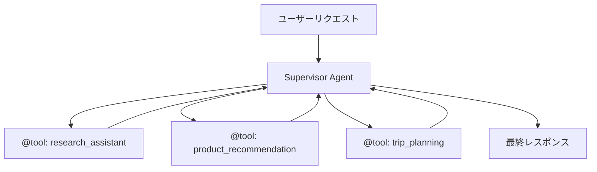
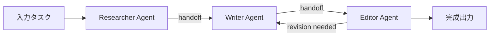
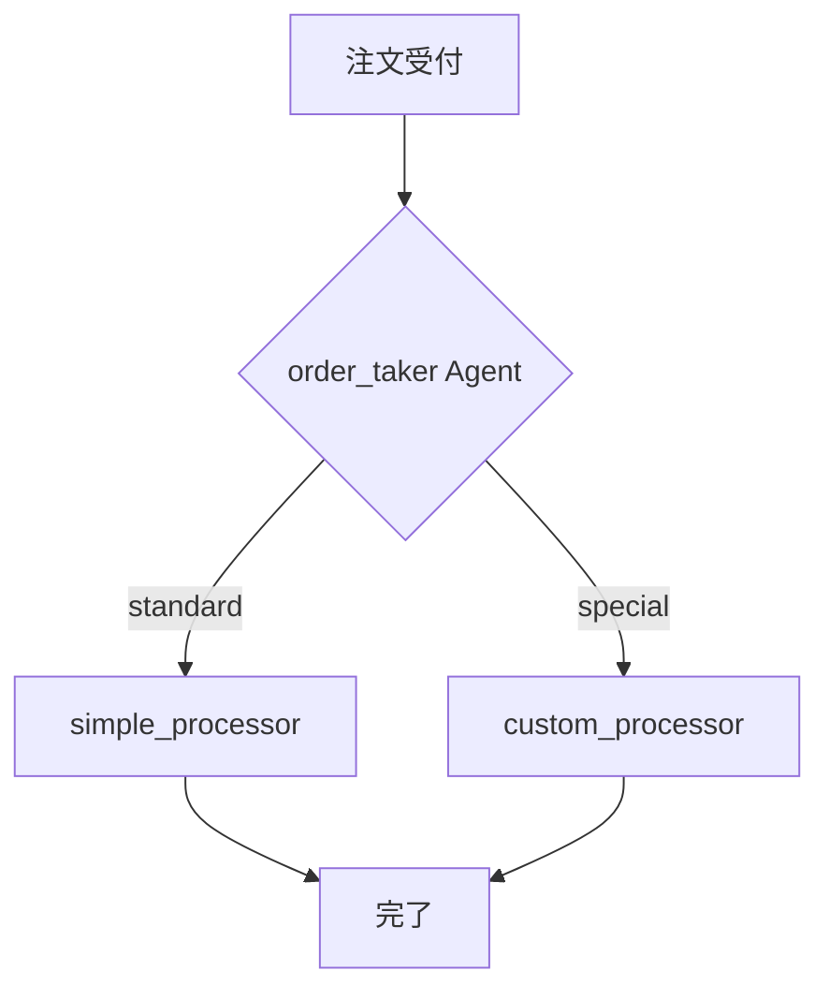
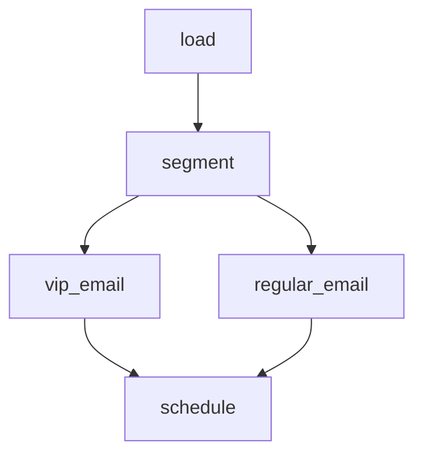

本記事は [Multi-Agent collaboration patterns with Strands Agents and Amazon Nova](https://aws.amazon.com/blogs/machine-learning/multi-agent-collaboration-patterns-with-strands-agents-and-amazon-nova/)（AWS Machine Learning Blog）の解説記事です。

## ブログ概要（Summary）

AWSが開発したオープンソースのPython SDK「Strands Agents」を用いたマルチエージェント協調パターンの解説ブログである。ブログでは、Amazon Novaモデルとの組み合わせによる4つの協調パターン（Agents as Tools、Swarms、Graphs、Workflows）が紹介されている。Strands Agents SDKは2025年5月にPreview公開され、GitHub 2,000+ stars、PyPI 150K+ downloadsを達成した後、2025年7月にバージョン1.0がリリースされている。本記事では各パターンの設計思想、適用場面、実装コードを詳細に解説する。

この記事は [Zenn記事: Bedrock AgentCore Policyで社内申請ワークフローを自動化するマルチエージェント設計](https://zenn.dev/0h_n0/articles/6493dd54baab75) の深掘りです。

## 情報源

- **種別**: 企業テックブログ（AWS Machine Learning Blog）
- **URL**: [https://aws.amazon.com/blogs/machine-learning/multi-agent-collaboration-patterns-with-strands-agents-and-amazon-nova/](https://aws.amazon.com/blogs/machine-learning/multi-agent-collaboration-patterns-with-strands-agents-and-amazon-nova/)
- **組織**: Amazon Web Services
- **関連**: Strands Agents 1.0（AWS Open Source Blog）

## 技術的背景（Technical Background）

単一のLLMエージェントでは、複雑なビジネスワークフローを処理する際に限界がある。たとえば社内申請ワークフローでは、申請内容の検証、ポリシーとの照合、承認判断、通知送信といった異なる専門性を持つタスクが連続する。これらを1つのエージェントに集約すると、システムプロンプトが肥大化し、推論精度の低下やデバッグの困難さにつながる。

マルチエージェント協調は、各エージェントに特定の責務を割り当て、協調させることでこの問題を解決するアプローチである。ブログでは、タスクの性質に応じて適切なパターンを選択することが重要であると述べられている。決定論的な処理フローが求められる場合と、動的な判断が必要な場合では、最適なパターンが異なるためである。

Strands Agents SDKは、この課題に対するAWSの回答として設計されており、モデル駆動型のアプローチを採用している。すなわち、LLM自体がツール選択やタスク分解を行い、開発者は各エージェントの責務とツールの定義に集中できる構造になっている。

## 実装アーキテクチャ（Architecture）

ブログでは4つのマルチエージェント協調パターンが紹介されている。以下に各パターンの設計思想、データフロー、実装コードを解説する。

### パターン1: Agents as Tools

Supervisorエージェントがサブエージェントを「ツール」として呼び出す階層的委譲パターンである。各サブエージェントは`@tool`デコレーターでラップされ、Supervisorのツールリストに登録される。Supervisorは自然言語の推論で、どのサブエージェントを呼び出すかを動的に判断する。



ブログでは以下のようなコード例が示されている。

```python
from strands import Agent, tool
from strands.models.bedrock import BedrockModel
from strands_tools import retrieve, http_request

nova_model = BedrockModel(
    model_id="amazon.nova-pro-v1:0",
    region_name="us-east-1"
)

RESEARCH_PROMPT = """
You are a specialized research assistant. Focus only on providing
factual, well-sourced information in response to research questions.
Always cite your sources when possible.
"""

@tool
def research_assistant(query: str) -> str:
    """Process and respond to research-related queries.

    Args:
        query: A research question requiring factual information

    Returns:
        A detailed research answer with citations
    """
    research_agent = Agent(
        model=nova_model,
        system_prompt=RESEARCH_PROMPT,
        tools=[retrieve, http_request],
    )
    response = research_agent(query)
    return str(response)
```

Supervisorエージェントは、複数のサブエージェント関数をツールとして受け取る。

```python
MAIN_SYSTEM_PROMPT = """
You are an assistant that routes queries to specialized agents:
- For research questions -> Use research_assistant tool
- For product recommendations -> Use product_recommendation_assistant tool
- For travel planning -> Use trip_planning_assistant tool
- For simple questions -> Answer directly

Always select the most appropriate tool based on user queries.
"""

orchestrator = Agent(
    model=nova_model,
    system_prompt=MAIN_SYSTEM_PROMPT,
    tools=[
        research_assistant,
        product_recommendation_assistant,
        trip_planning_assistant,
    ],
)
```

このパターンの利点は、関心の分離とモジュール性にある。各サブエージェントは独立して開発・テスト・交換が可能であり、Supervisorのシステムプロンプトに明確なルーティング規則を記述することで、LLMがDocstringに基づいて適切なサブエージェントを選択する。Zenn記事で取り上げられているBedrock AgentCoreのワークフロー設計でも、このパターンが基盤となっている。

### パターン2: Swarms

自律的なエージェントチームが共有メモリを通じて動的に協調するパターンである。全エージェントが同一の会話履歴にアクセスでき、各エージェントが自律的に次のエージェントへハンドオフを行う。



```python
from strands import Agent, Swarm

researcher = Agent(
    model=nova_model,
    system_prompt="Research the topic, then hand off to 'writer'",
    tools=[research_topic],
)

writer = Agent(
    model=nova_model,
    system_prompt="Write the draft, then hand off to 'editor'",
    tools=[write_draft],
)

editor = Agent(
    model=nova_model,
    system_prompt="Review and refine the draft. "
                  "If major revisions needed, hand off to 'writer'",
    tools=[review_draft],
)

swarm = Swarm()
swarm.add_agent("researcher", researcher)
swarm.add_agent("writer", writer)
swarm.add_agent("editor", editor)
swarm.set_entry_agent("researcher")

result = swarm("Create a blog post about AI multi-agent systems")
```

Swarmsパターンの特徴は非決定性にある。エージェント間のハンドオフ順序が固定されておらず、タスクの進捗に応じてエージェントが自律的に判断する。ブレインストーミングや複数の専門家が互いのアイデアを発展させるような協調タスクに適しているとブログでは紹介されている。

### パターン3: Graphs

明示的な有向グラフでエージェント間の依存関係と条件分岐を定義するパターンである。開発者がグラフ構造（ノードとエッジ）を定義し、LLMがグラフ内の分岐判断を行う。



```python
from strands import Agent, Graph

order_taker = Agent(
    model=nova_model,
    system_prompt="Route to 'simple_processor' for standard orders, "
                  "'custom_processor' for special requests",
    tools=[take_order],
)

graph = Graph()
graph.add_agent("order_taker", order_taker)
graph.add_agent("simple_processor", simple_processor)
graph.add_agent("custom_processor", custom_processor)
graph.add_edge("order_taker", "simple_processor")
graph.add_edge("order_taker", "custom_processor")

result = graph("I want a large pepperoni pizza")
```

Graphsパターンは「開発者がマップを定義し、LLMがパスを選択する」という設計思想を持つ。承認ゲート、品質チェック、ヒューマンインザループなどの特定ステップを必要とするプロセスに適している。Zenn記事で解説されている「検証、承認、通知」フローは、まさにこのパターンで実装するのに適した構造である。

### パターン4: Workflows

事前定義されたDAG（有向非巡回グラフ）でエージェント間の依存関係を記述し、可能な箇所を自動的に並列実行するパターンである。



```python
from strands import Agent, Workflow

workflow = Workflow()

workflow.add_task("load", load_agent)
workflow.add_task("segment", segment_agent)
workflow.add_task("vip_email", vip_email_agent)
workflow.add_task("regular_email", regular_email_agent)
workflow.add_task("schedule", schedule_agent)

workflow.add_dependency("segment", "load")
workflow.add_dependency("vip_email", "segment")
workflow.add_dependency("regular_email", "segment")
workflow.add_dependency("schedule", "vip_email")
workflow.add_dependency("schedule", "regular_email")

result = workflow("Create personalized email campaign")
```

Workflowsパターンの利点は、決定論的な実行と自動並列化である。上記の例では`vip_email`と`regular_email`が自動的に並列実行され、両方の完了を`schedule`が待機する。バッチ処理やETLパイプラインなど、再現性と効率性が求められるプロセスに適している。

### パターン選択の指針

ブログでは、以下の基準でパターンを選択することが推奨されている。

| 基準 | Agents as Tools | Swarms | Graphs | Workflows |
|------|----------------|--------|--------|-----------|
| 制御の所在 | Supervisor | 各Agent自律 | LLMが分岐判断 | DAG定義済み |
| 決定論性 | 中 | 低 | 中 | 高 |
| 並列実行 | Supervisor判断 | 動的 | グラフ依存 | 自動最適化 |
| 適用場面 | 専門家委譲 | 創造的協調 | 条件分岐 | パイプライン |

さらに、これらのパターンは組み合わせ可能であるとブログでは述べられている。Swarms内にGraphsを含めたり、Graphsの各ノードにAgents as Toolsパターンを適用したりすることで、複雑なシステムを構築できる。

## 共有状態管理

ブログでは、パターン間でデータを共有するための`invocation_state`メカニズムが紹介されている。これはLLMに直接露出させたくない設定情報（APIキー、データベース接続、セッションID等）を安全にツール間で受け渡す仕組みである。

```python
shared_state = {
    "user_id": "user123",
    "session_id": "sess456",
    "debug_mode": True,
    "database_connection": db_connection_object,
}

result = graph(
    "Analyze customer data",
    invocation_state=shared_state,
)
```

ツール側では`ToolContext`を通じて状態にアクセスする。

```python
from strands import tool
from strands.types.tools import ToolContext

@tool(context=True)
def query_customer_data(query: str, tool_context: ToolContext) -> str:
    """Execute customer data query with shared context.

    Args:
        query: SQL or natural language query for customer data

    Returns:
        Query results as formatted string
    """
    user_id = tool_context.invocation_state.get("user_id")
    db_conn = tool_context.invocation_state.get("database_connection")
    # Execute query with shared context
    results = db_conn.execute(query, user_id=user_id)
    return str(results)
```

この仕組みにより、認証情報やデータベース接続をプロンプトに含めることなく、セキュアにエージェント間で共有できる。

## パフォーマンス最適化（Performance）

ブログおよび関連ドキュメントでは、Amazon Novaモデルファミリーの使い分けによるコスト・レイテンシ最適化が紹介されている。

**Amazon Novaモデルの料金体系**（Bedrock On-Demand、2026年3月時点の公開情報）:

| モデル | 入力トークン単価 | 出力トークン単価 | 特性 |
|--------|-----------------|-----------------|------|
| Nova Micro | $0.035/1M tokens | $0.14/1M tokens | テキスト専用、低レイテンシ |
| Nova Lite | $0.06/1M tokens | $0.24/1M tokens | マルチモーダル、128K context |
| Nova Pro | $0.80/1M tokens | $3.20/1M tokens | 高精度、300K context |

Strands Agents SDKでは、エージェントごとに異なるモデルを指定できるため、タスクの複雑度に応じたモデル選択が可能である。たとえばSupervisorにはNova Proを、ルーティング判定のみを行うサブエージェントにはNova Microを割り当てることで、精度を維持しながらコストを削減できる。

```python
# コスト最適化: タスク複雑度に応じたモデル選択
router_model = BedrockModel(model_id="amazon.nova-micro-v1:0")
specialist_model = BedrockModel(model_id="amazon.nova-pro-v1:0")

router_agent = Agent(model=router_model, system_prompt="Route queries...")
specialist_agent = Agent(model=specialist_model, system_prompt="Analyze...")
```

また、Bedrock Batch APIを使用することで、On-Demand料金の50%でバッチ推論が可能である。Prompt Cachingを有効化すれば、繰り返し使用するシステムプロンプトのコストを30-90%削減できるとAWSの料金ページに記載されている。

## 運用での学び（Production Lessons）

ブログおよびStrands Agents 1.0のリリースブログから読み取れる運用上の知見を整理する。

**エラーハンドリングの重要性**: マルチエージェントシステムでは、1つのサブエージェントの障害がシステム全体に波及する可能性がある。Agents as Toolsパターンでは、`@tool`関数内でtry-exceptを適切に配置し、サブエージェントの障害をSupervisorに伝播させることが推奨される。

**セッション管理**: Strands 1.0ではセッションマネージャーによるリモートデータストアからのエージェント状態取得がサポートされている。DynamoDBやRedisをバックエンドとすることで、Lambda関数のようなステートレスな実行環境でもエージェントの対話履歴を維持できる。

**オブザーバビリティ**: AWS X-Rayとの統合により、エージェント間の呼び出しチェーンをトレースできる。各エージェントの推論時間、ツール呼び出し回数、トークン使用量を可視化することで、ボトルネックの特定とコスト最適化が可能になる。関連ブログ（Strands Agents SDK: A technical deep dive into agent architectures and observability）では、この観測可能性の詳細が解説されている。

**ガードレール**: Agent to Agent（A2A）プロトコルによるエージェント間通信では、各エージェントの責務範囲を明確に定義し、意図しないタスク委譲を防止するガードレールの設計が重要であるとされている。

## 学術研究との関連（Academic Connection）

マルチエージェント協調は、マルチエージェントシステム（MAS）の分野で長年研究されてきたテーマである。Strands Agentsの4パターンは、以下の学術的概念と対応関係にある。

- **Agents as Tools / Graphs**: 階層的タスク分解（Hierarchical Task Network, HTN）に相当する。エージェントが明示的な計画に基づいてサブタスクを委譲する構造は、古典的AIプランニングの流れを汲んでいる。
- **Swarms**: 分散協調システム（Distributed Cooperative Problem Solving）に近い。各エージェントが自律的に判断し、共有メモリを通じて間接的に協調する仕組みは、Blackboard Architectureの現代的な再解釈と見ることができる。
- **Workflows**: DAGベースのワークフローエンジン（Apache Airflow等）の概念をLLMエージェントに適用したものであり、ビジネスプロセスマネジメント（BPM）分野の知見が活かされている。

## Production Deployment Guide

Strands Agents SDKを用いたマルチエージェントシステムをAWS上にデプロイするための実践ガイドを示す。

### AWS実装パターン（コスト最適化重視）

**トラフィック量別の推奨構成**:

| 構成 | トラフィック | アーキテクチャ | 月額概算 |
|------|------------|--------------|---------|
| Small | ~100 req/日 | Lambda + Bedrock + DynamoDB | $80-200 |
| Medium | ~1,000 req/日 | ECS Fargate + Bedrock + ElastiCache | $400-1,000 |
| Large | 10,000+ req/日 | EKS + Spot + Bedrock Batch | $2,500-6,000 |

**Small構成（~100 req/日）**:
- Lambda: 各エージェントを個別のLambda関数として実装。メモリ512MB、タイムアウト300秒。月額$5-15
- Bedrock: Nova Micro（ルーティング）+ Nova Pro（専門処理）のハイブリッド。月額$50-150
- DynamoDB: セッション状態保存、On-Demandモード。月額$5-10
- CloudWatch: ログ・メトリクス。月額$10-20

**Medium構成（~1,000 req/日）**:
- ECS Fargate: 長時間実行のマルチエージェントワークフロー対応。vCPU 0.5, RAM 1GB x 2タスク。月額$50-100
- ElastiCache（Redis）: 高速セッション管理・共有状態。cache.t3.micro。月額$15-30
- Bedrock: Prompt Caching有効化で30-90%削減。月額$200-600
- Application Load Balancer: ヘルスチェック・ルーティング。月額$20-30

**Large構成（10,000+ req/日）**:
- EKS: Karpenter + Spot Instances（最大90%削減）。月額$500-1,500
- Bedrock Batch API: 非同期処理でOn-Demand比50%削減。月額$1,000-3,000
- ElastiCache（Redis Cluster）: 高可用性セッション管理。月額$100-300
- S3 + SQS: 非同期タスクキュー。月額$20-50

注意: 上記コスト試算は2026年3月時点のAWS ap-northeast-1（東京）リージョンの公開料金に基づく概算値である。実際のコストはトラフィックパターン、バースト使用量、リージョンにより変動する。最新料金は[AWS料金計算ツール](https://calculator.aws/)で確認することを推奨する。

**コスト削減テクニック**:
- Spot Instances活用: EKSワーカーノードで最大90%削減
- Reserved Instances: 1年コミットで最大72%削減
- Bedrock Batch API: 非同期処理可能なタスクで50%削減
- Prompt Caching: 繰り返し使用するシステムプロンプトで30-90%削減
- モデル選択ロジック: Nova Micro/Lite/Proをタスク複雑度で切り替え

### Terraformインフラコード

**Small構成（Serverless）**: Lambda + Bedrock + DynamoDB

```hcl
# Small構成: Strands Agents マルチエージェント Serverless
# Lambda + Bedrock + DynamoDB

terraform {
  required_version = ">= 1.9"
  required_providers {
    aws = {
      source  = "hashicorp/aws"
      version = "~> 5.80"
    }
  }
}

provider "aws" {
  region = "ap-northeast-1"
}

# DynamoDB: エージェントセッション状態保存
resource "aws_dynamodb_table" "agent_sessions" {
  name         = "strands-agent-sessions"
  billing_mode = "PAY_PER_REQUEST"  # On-Demand: 低トラフィック向けコスト最適

  hash_key  = "session_id"
  range_key = "timestamp"

  attribute {
    name = "session_id"
    type = "S"
  }

  attribute {
    name = "timestamp"
    type = "N"
  }

  ttl {
    attribute_name = "ttl"
    enabled        = true  # 24時間でセッション自動削除
  }

  server_side_encryption {
    enabled = true  # KMS暗号化
  }

  tags = {
    Project     = "strands-multi-agent"
    Environment = "production"
    CostCenter  = "ml-agents"
  }
}

# IAMロール: Lambda実行用（最小権限）
resource "aws_iam_role" "lambda_agent" {
  name = "strands-agent-lambda-role"

  assume_role_policy = jsonencode({
    Version = "2012-10-17"
    Statement = [{
      Action = "sts:AssumeRole"
      Effect = "Allow"
      Principal = { Service = "lambda.amazonaws.com" }
    }]
  })
}

resource "aws_iam_role_policy" "lambda_agent_policy" {
  name = "strands-agent-policy"
  role = aws_iam_role.lambda_agent.id

  policy = jsonencode({
    Version = "2012-10-17"
    Statement = [
      {
        Effect = "Allow"
        Action = [
          "bedrock:InvokeModel",
          "bedrock:InvokeModelWithResponseStream"
        ]
        Resource = [
          "arn:aws:bedrock:ap-northeast-1::foundation-model/amazon.nova-*",
          "arn:aws:bedrock:ap-northeast-1::foundation-model/anthropic.claude-*"
        ]
      },
      {
        Effect = "Allow"
        Action = [
          "dynamodb:GetItem",
          "dynamodb:PutItem",
          "dynamodb:UpdateItem",
          "dynamodb:Query"
        ]
        Resource = [aws_dynamodb_table.agent_sessions.arn]
      },
      {
        Effect = "Allow"
        Action = [
          "logs:CreateLogGroup",
          "logs:CreateLogStream",
          "logs:PutLogEvents"
        ]
        Resource = "arn:aws:logs:*:*:*"
      }
    ]
  })
}

# Lambda: Supervisorエージェント
resource "aws_lambda_function" "supervisor_agent" {
  function_name = "strands-supervisor-agent"
  runtime       = "python3.12"
  handler       = "handler.lambda_handler"
  role          = aws_iam_role.lambda_agent.arn
  timeout       = 300   # マルチエージェント処理は長時間化しやすい
  memory_size   = 512   # Strands SDK + 依存ライブラリ用

  filename         = "lambda_package.zip"
  source_code_hash = filebase64sha256("lambda_package.zip")

  environment {
    variables = {
      DYNAMODB_TABLE    = aws_dynamodb_table.agent_sessions.name
      ROUTER_MODEL_ID   = "amazon.nova-micro-v1:0"
      SPECIALIST_MODEL_ID = "amazon.nova-pro-v1:0"
    }
  }

  tracing_config {
    mode = "Active"  # X-Ray トレーシング有効化
  }

  tags = {
    Project     = "strands-multi-agent"
    Environment = "production"
  }
}

# CloudWatch アラーム: コスト異常検知
resource "aws_cloudwatch_metric_alarm" "lambda_duration" {
  alarm_name          = "strands-agent-high-duration"
  comparison_operator = "GreaterThanThreshold"
  evaluation_periods  = 3
  metric_name         = "Duration"
  namespace           = "AWS/Lambda"
  period              = 300
  statistic           = "Average"
  threshold           = 60000  # 60秒超過でアラート
  alarm_description   = "Agent processing time exceeds 60s average"

  dimensions = {
    FunctionName = aws_lambda_function.supervisor_agent.function_name
  }
}
```

**Large構成（Container）**: EKS + Karpenter + Spot Instances

```hcl
# Large構成: Strands Agents マルチエージェント Container
# EKS + Karpenter + Spot + Bedrock

module "eks" {
  source  = "terraform-aws-modules/eks/aws"
  version = "~> 20.31"

  cluster_name    = "strands-agents-cluster"
  cluster_version = "1.31"

  vpc_id     = module.vpc.vpc_id
  subnet_ids = module.vpc.private_subnets

  # コントロールプレーンのみ（ワーカーはKarpenter管理）
  cluster_endpoint_public_access = false

  tags = {
    Project     = "strands-multi-agent"
    Environment = "production"
    CostCenter  = "ml-agents"
  }
}

# Karpenter: Spot優先の自動スケーリング
resource "kubectl_manifest" "karpenter_nodepool" {
  yaml_body = yamlencode({
    apiVersion = "karpenter.sh/v1"
    kind       = "NodePool"
    metadata   = { name = "strands-agents" }
    spec = {
      template = {
        spec = {
          requirements = [
            {
              key      = "karpenter.sh/capacity-type"
              operator = "In"
              values   = ["spot", "on-demand"]  # Spot優先
            },
            {
              key      = "node.kubernetes.io/instance-type"
              operator = "In"
              values   = ["m6i.large", "m6i.xlarge", "m7i.large"]
            }
          ]
        }
      }
      limits = {
        cpu    = "100"
        memory = "400Gi"
      }
      disruption = {
        consolidationPolicy = "WhenEmptyOrUnderutilized"
        consolidateAfter    = "30s"  # アイドルノード早期回収
      }
    }
  })
}

# Secrets Manager: Bedrock設定
resource "aws_secretsmanager_secret" "bedrock_config" {
  name = "strands-agents/bedrock-config"
}

resource "aws_secretsmanager_secret_version" "bedrock_config" {
  secret_id = aws_secretsmanager_secret.bedrock_config.id
  secret_string = jsonencode({
    router_model_id     = "amazon.nova-micro-v1:0"
    specialist_model_id = "amazon.nova-pro-v1:0"
    batch_model_id      = "amazon.nova-pro-v1:0"
    region              = "ap-northeast-1"
  })
}

# AWS Budgets: 月額予算アラート
resource "aws_budgets_budget" "monthly" {
  name         = "strands-agents-monthly"
  budget_type  = "COST"
  limit_amount = "6000"
  limit_unit   = "USD"
  time_unit    = "MONTHLY"

  notification {
    comparison_operator       = "GREATER_THAN"
    threshold                 = 80
    threshold_type            = "PERCENTAGE"
    notification_type         = "ACTUAL"
    subscriber_email_addresses = ["ml-team@example.com"]
  }
}
```

### 運用・監視設定

**CloudWatch Logs Insights クエリ**: エージェント間のトークン使用量を監視する。

```
# 1時間あたりのBedrock トークン使用量（コスト異常検知）
fields @timestamp, @message
| filter @message like /inputTokens|outputTokens/
| stats sum(inputTokens) as total_input,
        sum(outputTokens) as total_output,
        count(*) as invocation_count
  by bin(1h)
| sort @timestamp desc
```

```
# エージェント別レイテンシ分析（P95, P99）
fields @timestamp, agent_name, duration_ms
| filter agent_name in ["supervisor", "researcher", "validator"]
| stats percentile(duration_ms, 95) as p95,
        percentile(duration_ms, 99) as p99,
        avg(duration_ms) as avg_ms
  by agent_name
```

**CloudWatch アラーム設定（Python）**:

```python
import boto3

cloudwatch = boto3.client("cloudwatch", region_name="ap-northeast-1")

def create_token_spike_alarm() -> None:
    """Bedrockトークン使用量スパイク検知アラームを作成する。"""
    cloudwatch.put_metric_alarm(
        AlarmName="strands-agent-token-spike",
        MetricName="OutputTokenCount",
        Namespace="AWS/Bedrock",
        Statistic="Sum",
        Period=3600,
        EvaluationPeriods=1,
        Threshold=500000,
        ComparisonOperator="GreaterThanThreshold",
        AlarmActions=["arn:aws:sns:ap-northeast-1:123456789012:ml-alerts"],
        Dimensions=[
            {"Name": "ModelId", "Value": "amazon.nova-pro-v1:0"},
        ],
    )
```

**X-Ray トレーシング設定（Python）**:

```python
from aws_xray_sdk.core import xray_recorder, patch_all

# boto3を含む全ライブラリを自動計装
patch_all()

@xray_recorder.capture("supervisor_agent_invoke")
def invoke_supervisor(request: dict) -> dict:
    """Supervisorエージェント呼び出しをX-Rayでトレースする。

    Args:
        request: ユーザーリクエスト辞書

    Returns:
        エージェントレスポンス辞書
    """
    subsegment = xray_recorder.current_subsegment()
    subsegment.put_annotation("agent_type", "supervisor")
    subsegment.put_metadata("request", request, "strands")

    result = orchestrator(request["query"])

    subsegment.put_annotation("token_count", result.token_usage.total)
    return {"response": str(result), "tokens": result.token_usage.total}
```

**Cost Explorer自動レポート（Python）**:

```python
import boto3
from datetime import datetime, timedelta

ce = boto3.client("ce", region_name="us-east-1")
sns = boto3.client("sns", region_name="ap-northeast-1")

def daily_cost_report() -> dict:
    """日次コストレポートを取得し、閾値超過時にSNS通知する。

    Returns:
        サービス別コスト辞書
    """
    end = datetime.utcnow().strftime("%Y-%m-%d")
    start = (datetime.utcnow() - timedelta(days=1)).strftime("%Y-%m-%d")

    response = ce.get_cost_and_usage(
        TimePeriod={"Start": start, "End": end},
        Granularity="DAILY",
        Metrics=["UnblendedCost"],
        Filter={
            "Tags": {
                "Key": "Project",
                "Values": ["strands-multi-agent"],
            }
        },
        GroupBy=[{"Type": "DIMENSION", "Key": "SERVICE"}],
    )

    costs = {}
    total = 0.0
    for group in response["ResultsByTime"][0]["Groups"]:
        service = group["Keys"][0]
        amount = float(group["Metrics"]["UnblendedCost"]["Amount"])
        costs[service] = amount
        total += amount

    if total > 100.0:
        sns.publish(
            TopicArn="arn:aws:sns:ap-northeast-1:123456789012:cost-alerts",
            Subject="Strands Agents daily cost alert",
            Message=f"Daily cost ${total:.2f} exceeds $100 threshold.\n"
                    f"Breakdown: {costs}",
        )

    return costs
```

### コスト最適化チェックリスト

**アーキテクチャ選択**:
- [ ] トラフィック量に基づき構成を選択（Small: Serverless / Medium: Hybrid / Large: Container）
- [ ] 非同期処理可能なタスクを特定しBatch APIに振り分け
- [ ] エージェント間通信のオーバーヘッドを測定

**リソース最適化**:
- [ ] EC2/EKS: Spot Instances優先（最大90%削減）
- [ ] Reserved Instances: 1年コミット検討（最大72%削減）
- [ ] Savings Plans: Compute Savings Plans検討
- [ ] Lambda: メモリサイズをPower Tuningで最適化
- [ ] ECS/EKS: Karpenterでアイドル時スケールダウン
- [ ] NAT Gateway: VPCエンドポイントで代替（Bedrock, DynamoDB, S3）

**LLMコスト削減**:
- [ ] Bedrock Batch API使用（50%削減）
- [ ] Prompt Caching有効化（30-90%削減）
- [ ] モデル選択ロジック実装（Nova Micro/Lite/Proを複雑度で切り替え）
- [ ] トークン数制限（max_tokens設定）
- [ ] 不要なコンテキスト除去（会話履歴の要約・刈り込み）

**監視・アラート**:
- [ ] AWS Budgets: 月額予算設定
- [ ] CloudWatch アラーム: トークンスパイク検知
- [ ] Cost Anomaly Detection有効化
- [ ] 日次コストレポート自動送信
- [ ] サービス別コスト内訳ダッシュボード作成

**リソース管理**:
- [ ] 未使用リソース定期削除（Lambda旧バージョン、未使用ENI）
- [ ] タグ戦略: Project / Environment / CostCenter 必須
- [ ] DynamoDB TTL: セッションデータの自動ライフサイクル管理
- [ ] 開発環境: 夜間・休日のEKSノード停止スケジュール
- [ ] CloudWatch Logs: 保持期間設定（30日 or 90日）

## まとめと実践への示唆

Strands Agents SDKが提供する4つのマルチエージェント協調パターンは、タスクの性質に応じた柔軟なシステム設計を可能にする。Agents as Toolsパターンは専門エージェントへの階層的委譲に、Swarmsは自律的な協調タスクに、Graphsは条件分岐を含むワークフローに、Workflowsは決定論的なパイプラインに、それぞれ適している。Zenn記事で解説されているBedrock AgentCoreのポリシー駆動ワークフローと組み合わせることで、ガバナンスを維持しながら柔軟なマルチエージェントシステムを構築できる。実運用においては、モデル選択ロジック（Nova Micro/Lite/Pro）によるコスト最適化と、X-Ray/CloudWatchによるオブザーバビリティの確保が成功の鍵となる。

## 参考文献

- **Blog URL**: [Multi-Agent collaboration patterns with Strands Agents and Amazon Nova](https://aws.amazon.com/blogs/machine-learning/multi-agent-collaboration-patterns-with-strands-agents-and-amazon-nova/)
- **Strands Agents 1.0**: [Introducing Strands Agents 1.0: Production-Ready Multi-Agent Orchestration Made Simple](https://aws.amazon.com/blogs/opensource/introducing-strands-agents-1-0-production-ready-multi-agent-orchestration-made-simple/)
- **Technical Deep Dive**: [Strands Agents SDK: A technical deep dive into agent architectures and observability](https://aws.amazon.com/blogs/machine-learning/strands-agents-sdk-a-technical-deep-dive-into-agent-architectures-and-observability/)
- **Strands Agents Documentation**: [https://strandsagents.com/](https://strandsagents.com/)
- **Amazon Nova Pricing**: [https://aws.amazon.com/nova/pricing/](https://aws.amazon.com/nova/pricing/)
- **Related Zenn article**: [Bedrock AgentCore Policyで社内申請ワークフローを自動化するマルチエージェント設計](https://zenn.dev/0h_n0/articles/6493dd54baab75)
