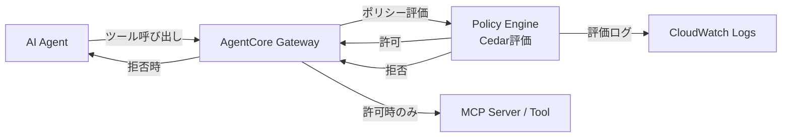

本記事は [Secure AI agents with Policy in Amazon Bedrock AgentCore](https://aws.amazon.com/blogs/machine-learning/secure-ai-agents-with-policy-in-amazon-bedrock-agentcore/)（AWS Machine Learning Blog）の解説記事です。

## ブログ概要（Summary）

Amazon Bedrock AgentCore Policyは、AIエージェントのツール呼び出しを**エージェントコードの外部**で制御するセキュリティ機構である。AWSが開発したオープンソースのポリシー言語Cedarを採用し、Principal-Action-Resource-Context（PARC）モデルに基づく宣言的なアクセス制御を提供する。AgentCore Gatewayがすべてのツール呼び出しをインターセプトし、Cedar ポリシーに基づいてリアルタイムで許可・拒否を判定する。2025年12月にPreview公開、2026年3月3日にGA（一般提供）となり、13のAWSリージョンで利用可能となった。

この記事は [Zenn記事: Bedrock AgentCore Policyで社内申請ワークフローを自動化するマルチエージェント設計](https://zenn.dev/0h_n0/articles/6493dd54baab75) の深掘りです。

## 情報源

- **種別**: 企業テックブログ（AWS Machine Learning Blog）
- **URL**: [https://aws.amazon.com/blogs/machine-learning/secure-ai-agents-with-policy-in-amazon-bedrock-agentcore/](https://aws.amazon.com/blogs/machine-learning/secure-ai-agents-with-policy-in-amazon-bedrock-agentcore/)
- **組織**: Amazon Web Services
- **GA発表日**: 2026年3月3日

## 技術的背景（Technical Background）

AIエージェントが業務システムのツールを自律的に呼び出す場面が増加するにつれ、従来のIAMポリシーやAPIキーベースの認証だけではエージェントの行動を十分に制御できないという課題が顕在化している。エージェントはLLMの推論結果に基づいてツールを選択するため、プロンプトインジェクションやハルシネーションによる意図しないツール呼び出しが発生するリスクがある。

この問題に対してAWSは、エージェントの推論ループの**外部**にポリシー評価レイヤーを配置するアプローチを採用した。ブログでは以下のように述べている。「Policy gives you control over the actions agents can take and are applied outside of the agent's reasoning loop, treating agents as autonomous actors whose decisions require verification before reaching tools, systems, or data」（ポリシーはエージェントの推論ループの外側で適用され、エージェントを自律的なアクターとして扱い、ツール・システム・データに到達する前にその判断の検証を行う）。

この設計思想は、従来のOSレベルのアクセス制御（DAC/MAC）における「プロセスを信頼しない」原則と類似しており、エージェントのコードにバグがあっても、外部ポリシーが安全弁として機能する構造を実現している。

## 実装アーキテクチャ（Architecture）

### Cedar言語とPARCモデル

AgentCore PolicyはAWSが開発したオープンソースのポリシー言語[Cedar](https://www.cedarpolicy.com/)を採用している。Cedarは**PARC（Principal-Action-Resource-Context）モデル**に基づく4つの要素でアクセス制御を定義する。

- **Principal**: 認証されたユーザーまたはエージェント（`AgentCore::OAuthUser`型）
- **Action**: 実行対象のツール呼び出し（Gateway内のツール定義から自動マッピング）
- **Resource**: アクセス対象のGatewayリソース（ARNで指定）
- **Context**: リクエストのパラメータや条件（金額、入力値など）

以下はCedarポリシーの具体例である。返金処理ツールの呼び出しを1000ドル未満に制限している。

```cedar
permit(
    principal,
    action == AgentCore::Action::"RefundTarget___process_refund",
    resource == AgentCore::Gateway::"{gateway_arn}"
) when {
    context.input.amount < 1000
};
```

関連するZenn記事では、社内申請ワークフローにおけるCedarポリシーの例として、Validator AgentにKnowledge Baseと人事DBの読み取りのみを許可するポリシーが紹介されている。

```cedar
permit(
    principal is AgentCore::OAuthUser,
    action in [
        AgentCore::Action::"WorkflowGateway__knowledge_base_lookup",
        AgentCore::Action::"WorkflowGateway__hr_db_read"
    ],
    resource == AgentCore::Gateway::"arn:aws:bedrock-agentcore:ap-northeast-1:123456789012:gateway/workflow"
) when {
    principal.hasTag("role") &&
    principal.getTag("role") == "validator"
};
```

このポリシーではOAuthトークンのカスタムクレーム（タグ）を利用して、エージェントの役割（`role`）に基づくロールベースのアクセス制御を実現している。

### Gatewayによるインターセプトアーキテクチャ

AgentCore Gatewayは、エージェントとツールの間に配置されるプロキシレイヤーとして機能する。すべてのツール呼び出しがGatewayを経由し、ポリシーエンジンによるリアルタイム評価を受ける。



Gatewayの作成時にはMCPプロトコルとカスタムJWT認証を指定し、ポリシーエンジンを関連付ける。

```python
import boto3

client = boto3.client('bedrock-agentcore-control')

response = client.create_gateway(
    name='workflow-gateway',
    protocolType='MCP',
    authorizerType='CUSTOM_JWT',
    authorizerConfiguration={
        'customJWTAuthorizer': {
            'allowedClients': ['agent-client-id'],
            'discoveryUrl': 'https://cognito-idp.ap-northeast-1.amazonaws.com/<user-pool-id>/.well-known/openid-configuration'
        }
    },
    roleArn='arn:aws:iam::123456789012:role/gateway-service-role',
    policyEngineConfiguration={
        'mode': 'ENFORCE',
        'arn': 'arn:aws:bedrock-agentcore:ap-northeast-1:123456789012:policy-engine/workflow_engine'
    }
)

print(f"Gateway URL: {response['gatewayUrl']}")
```

### ポリシーエンジンの構築

ポリシーエンジンは`create_policy_engine` APIで作成し、`create_policy` APIで個別のCedarポリシーを登録する。`validationMode`に`FAIL_ON_ANY_FINDINGS`を指定することで、スキーマに対する検証エラーがある場合にポリシー登録を拒否できる。

```python
import boto3

client = boto3.client('bedrock-agentcore-control')

# ポリシーエンジンの作成
engine = client.create_policy_engine(
    name='workflow-policy-engine',
    description='社内申請ワークフローのアクセス制御'
)
engine_id = engine['policyEngineId']

# Cedarポリシーの登録
cedar_statement = """
permit(
    principal is AgentCore::OAuthUser,
    action == AgentCore::Action::"WorkflowGateway__approval_db_write",
    resource == AgentCore::Gateway::"{gateway_arn}"
) when {
    principal.hasTag("role") &&
    principal.getTag("role") == "approver" &&
    context.input.amount < 500000
};
"""

policy = client.create_policy(
    policyEngineId=engine_id,
    name='approver_auto_approve_policy',
    validationMode='FAIL_ON_ANY_FINDINGS',
    description='50万円未満の自動承認を許可',
    definition={
        'cedar': {
            'statement': cedar_statement
        }
    }
)
```

ポリシーエンジンはGatewayのツール定義から**Cedarスキーマを自動生成**する。AWS公式ドキュメントによると、「The policy engine automatically generates a schema from the gateway's tool definitions, mapping each tool to an action and defining the expected input parameters」（ポリシーエンジンはGatewayのツール定義からスキーマを自動生成し、各ツールをアクションにマッピングし、期待される入力パラメータを定義する）。このスキーマにより、存在しないツール名やデータ型の不一致を含むポリシーを事前に検出できる。

### デフォルト拒否とforbid優先の原則

AgentCore Policyのポリシー評価は2つの原則に基づく。

1. **デフォルト拒否（Default Deny）**: 明示的な`permit`ポリシーがない限り、すべてのツール呼び出しは拒否される
2. **forbid優先（Forbid-Wins）**: `forbid`ポリシーが1つでも一致すれば、`permit`ポリシーの有無にかかわらず拒否される

この設計は、IAMポリシーの「明示的な拒否は常に許可に優先する」原則と一貫しており、AWSのセキュリティモデルに精通した開発者にとって直感的に理解しやすい。

```cedar
// 全エージェントに対して機密データツールを無条件拒否
forbid(
    principal,
    action == AgentCore::Action::"WorkflowGateway__confidential_data_export",
    resource
);
```

## パフォーマンス最適化（Performance）

### ポリシー評価のレイテンシ特性

AgentCore Policyのポリシー評価はGatewayのインターセプト処理に組み込まれており、ツール呼び出しのリクエストパス上で同期的に実行される。Cedarの評価エンジンは決定論的で線形時間の計算量を持つため、ポリシー数が増加しても評価時間の増加は緩やかである。

ブログでは「It integrates with AgentCore Gateway to intercept tool calls as they happen, processing requests while maintaining operational speed」（ツール呼び出しの発生時にインターセプトし、運用速度を維持しながらリクエストを処理する）と述べられている。具体的なレイテンシ数値はブログでは公開されていないが、Cedarエンジン自体はマイクロ秒オーダーの評価速度を持つことがCedarプロジェクトの公式ドキュメントで報告されている。

### 最適化のポイント

- **ポリシーの粒度設計**: 細かすぎるポリシー（ツール単位 x ユーザー単位）は管理コストが増大する。ロールベースでグルーピングし、OAuthタグで分類するアプローチが推奨される
- **スキーマ検証の活用**: `FAIL_ON_ANY_FINDINGS`モードを使うことで、デプロイ前にポリシーの整合性を検証し、ランタイムでの不要な評価を回避できる
- **自動推論（Automated Reasoning）の活用**: AWSのドキュメントによると、Policy in AgentCoreは自動推論を使用して「常に許可」や「常に拒否」となるポリシーを検出する。これにより、実質的に評価不要なポリシーを事前に特定し、ポリシーセットの品質を維持できる

## 運用での学び（Production Lessons）

### LOG_ONLY から ENFORCE への段階的移行

AgentCore Policyは2つのエンフォースメントモードを提供する。

| モード | 動作 | 用途 |
|--------|------|------|
| `LOG_ONLY` | ポリシー評価を実行しログに記録するが、拒否を強制しない | テスト・検証フェーズ |
| `ENFORCE` | ポリシー評価に基づいてツール呼び出しを許可または拒否する | 本番運用 |

AWS公式ドキュメントでは、「Test and validate policies in LOG_ONLY mode before enabling enforcement to avoid unintended denials or adversely affecting production traffic」（意図しない拒否や本番トラフィックへの悪影響を避けるため、エンフォースメント有効化の前にLOG_ONLYモードでポリシーのテストと検証を行うこと）と推奨されている。

段階的な移行手順は以下の通りである。

1. **LOG_ONLYモードでGatewayを作成**: すべてのツール呼び出しを通過させつつ、ポリシー評価結果をCloudWatch Logsに記録する
2. **ログ分析**: CloudWatch Logs InsightsでDeny判定の件数・パターンを分析し、意図しない拒否がないか確認する
3. **ポリシー調整**: 過度に制限的なポリシーや不足しているpermitポリシーを修正する
4. **ENFORCEモードへ切り替え**: `update_gateway`APIでモードを変更する

```python
client.update_gateway(
    gatewayIdentifier=gateway_id,
    policyEngineConfiguration={
        'mode': 'ENFORCE',
        'arn': policy_engine_arn
    }
)
```

### 自然言語からCedarポリシーへの変換

AgentCore Policyは、自然言語でポリシーを記述し、Cedarコードに自動変換する機能を提供する。ブログによると、「Policies can be created in two ways: authored directly as Cedar for fine-grained programmatic control or generated from plain English statements that are automatically formalized into Cedar」（ポリシーは2通りで作成できる。Cedarを直接記述する方法と、平易な英語の文をCedarに自動変換する方法である）。

この機能はセキュリティチームやコンプライアンスチームがエージェントコードを変更せずにポリシーを定義できる点で有用であるが、生成されたCedarポリシーは自動推論による検証を経て安全性が確認される。過度に許可的（常に許可）や過度に制限的（常に拒否）なポリシーが自動検出されるため、意図しないポリシーの混入リスクを低減できる。

### CloudWatch統合によるモニタリング

ポリシー評価の結果はCloudWatch Logsに自動的に記録される。`DenyDecisions`メトリクスを監視することで、拒否されたツール呼び出しのパターンを把握できる。

## 学術研究との関連（Academic Connection）

AgentCore PolicyのアプローチはABACの一般化であり、属性ベースのアクセス制御（Attribute-Based Access Control）に関する研究の流れを汲んでいる。特にCedarのPARCモデルは、NIST SP 800-162で定義されたABACフレームワークの概念を実装レベルに落とし込んだものと位置づけられる。

また、AIエージェントのセキュリティという観点では、「Guardrails」や「Constitutional AI」といったLLM出力の制御手法が研究されているが、AgentCore Policyはこれらとは異なり、**LLMの出力制御ではなくツール呼び出しの実行制御**に焦点を当てている。エージェントが何を考えるかではなく、何を実行できるかを制御するという設計は、従来のOSセキュリティにおけるサンドボックス機構と思想的に近い。

## Production Deployment Guide

### AWS実装パターン（コスト最適化重視）

AgentCore Policy + Gatewayを用いたマルチエージェントワークフローシステムのAWS構成を、トラフィック量別に示す。

**コスト試算の注意事項**: 以下は2026年3月時点のAWS ap-northeast-1（東京）リージョン料金に基づく概算値である。実際のコストはトラフィックパターン、リージョン、バースト使用量により変動する。最新料金は[AWS料金計算ツール](https://calculator.aws/)で確認を推奨する。

| 構成 | トラフィック | 主要サービス | 月額概算 |
|------|------------|-------------|---------|
| **Small** | ~100 req/日 | Lambda + Bedrock + AgentCore Gateway + DynamoDB | $80-200 |
| **Medium** | ~1,000 req/日 | ECS Fargate + Bedrock + AgentCore Gateway + Aurora Serverless | $400-900 |
| **Large** | 10,000+ req/日 | EKS + Spot Instances + Bedrock + AgentCore Gateway + Aurora | $2,500-6,000 |

**Small構成（~100 req/日）の内訳**:
- Lambda: $5-10/月（128MB, 平均3秒/呼び出し）
- Bedrock Claude Sonnet: $30-80/月（入出力トークン従量）
- AgentCore Gateway: 従量課金（Gatewayリクエスト数に比例）
- DynamoDB On-Demand: $5-15/月
- Cognito: $0（50,000 MAUまで無料）
- CloudWatch Logs: $5-10/月

**コスト削減テクニック**:
- Bedrock Batch APIの使用で最大50%削減（リアルタイム性が不要な承認判定のバッチ処理に適用）
- Prompt Caching有効化で30-90%削減（同一プロンプトプレフィックスの繰り返し呼び出しに有効）
- Lambda Power Tuning で最適メモリサイズを特定し、コスト対実行時間の効率化

### Terraformインフラコード

**Small構成（Serverless）: Lambda + Bedrock + AgentCore Gateway**

```hcl
# provider.tf
terraform {
  required_version = ">= 1.9"
  required_providers {
    aws = {
      source  = "hashicorp/aws"
      version = "~> 5.80"
    }
  }
}

provider "aws" {
  region = "ap-northeast-1"
}

# iam.tf - 最小権限のIAMロール
resource "aws_iam_role" "lambda_agent_role" {
  name = "agentcore-workflow-lambda-role"

  assume_role_policy = jsonencode({
    Version = "2012-10-17"
    Statement = [{
      Action    = "sts:AssumeRole"
      Effect    = "Allow"
      Principal = { Service = "lambda.amazonaws.com" }
    }]
  })
}

resource "aws_iam_role_policy" "lambda_bedrock_policy" {
  name = "bedrock-invoke-policy"
  role = aws_iam_role.lambda_agent_role.id

  policy = jsonencode({
    Version = "2012-10-17"
    Statement = [
      {
        Effect   = "Allow"
        Action   = ["bedrock:InvokeModel"]
        Resource = "arn:aws:bedrock:ap-northeast-1::foundation-model/anthropic.claude-sonnet-4-20250514"
      },
      {
        Effect   = "Allow"
        Action   = [
          "bedrock-agentcore:InvokeGateway",
          "bedrock-agentcore:GetGateway"
        ]
        Resource = "*"
      },
      {
        Effect   = "Allow"
        Action   = [
          "dynamodb:PutItem",
          "dynamodb:GetItem",
          "dynamodb:Query"
        ]
        Resource = aws_dynamodb_table.approval_records.arn
      },
      {
        Effect   = "Allow"
        Action   = [
          "logs:CreateLogGroup",
          "logs:CreateLogStream",
          "logs:PutLogEvents"
        ]
        Resource = "arn:aws:logs:ap-northeast-1:*:*"
      }
    ]
  })
}

# dynamodb.tf - 承認記録テーブル
resource "aws_dynamodb_table" "approval_records" {
  name         = "agentcore-approval-records"
  billing_mode = "PAY_PER_REQUEST"
  hash_key     = "request_id"
  range_key    = "created_at"

  attribute {
    name = "request_id"
    type = "S"
  }

  attribute {
    name = "created_at"
    type = "S"
  }

  server_side_encryption {
    enabled = true  # KMS暗号化
  }

  tags = {
    Project     = "agentcore-workflow"
    Environment = "production"
    CostCenter  = "ai-platform"
  }
}

# lambda.tf - エージェントワークフロー関数
resource "aws_lambda_function" "workflow_agent" {
  function_name = "agentcore-workflow-agent"
  runtime       = "python3.12"
  handler       = "handler.lambda_handler"
  role          = aws_iam_role.lambda_agent_role.arn
  timeout       = 120
  memory_size   = 512  # Power Tuningで最適化推奨

  filename         = "lambda_package.zip"
  source_code_hash = filebase64sha256("lambda_package.zip")

  environment {
    variables = {
      GATEWAY_URL       = "placeholder"  # AgentCore Gateway URL
      POLICY_ENGINE_ARN = "placeholder"  # Policy Engine ARN
      APPROVAL_TABLE    = aws_dynamodb_table.approval_records.name
    }
  }

  tags = {
    Project     = "agentcore-workflow"
    CostCenter  = "ai-platform"
  }
}

# cloudwatch.tf - コスト監視アラーム
resource "aws_cloudwatch_metric_alarm" "bedrock_cost_alarm" {
  alarm_name          = "agentcore-bedrock-token-spike"
  comparison_operator = "GreaterThanThreshold"
  evaluation_periods  = 1
  metric_name         = "InvocationCount"
  namespace           = "AWS/Bedrock"
  period              = 3600
  statistic           = "Sum"
  threshold           = 500
  alarm_description   = "Bedrockの1時間あたり呼び出し回数が500を超過"
  alarm_actions       = []  # SNS Topic ARNを設定

  tags = {
    Project = "agentcore-workflow"
  }
}
```

**Large構成（Container）: EKS + Karpenter + Spot Instances**

```hcl
# eks.tf - EKSクラスタ（コントロールプレーンのみ）
module "eks" {
  source  = "terraform-aws-modules/eks/aws"
  version = "~> 20.31"

  cluster_name    = "agentcore-workflow-cluster"
  cluster_version = "1.31"

  vpc_id     = module.vpc.vpc_id
  subnet_ids = module.vpc.private_subnets

  # Spot Instances活用で最大90%コスト削減
  eks_managed_node_groups = {
    spot_agents = {
      instance_types = ["m6i.large", "m6a.large", "m5.large"]
      capacity_type  = "SPOT"
      min_size       = 2
      max_size       = 10
      desired_size   = 3

      labels = {
        workload = "agent"
      }
    }
  }

  tags = {
    Project     = "agentcore-workflow"
    Environment = "production"
    CostCenter  = "ai-platform"
  }
}

# budgets.tf - AWS Budgets予算アラート
resource "aws_budgets_budget" "agentcore_monthly" {
  name         = "agentcore-workflow-monthly"
  budget_type  = "COST"
  limit_amount = "3000"
  limit_unit   = "USD"
  time_unit    = "MONTHLY"

  cost_filter {
    name   = "TagKeyValue"
    values = ["user:Project$agentcore-workflow"]
  }

  notification {
    comparison_operator       = "GREATER_THAN"
    threshold                 = 80
    threshold_type            = "PERCENTAGE"
    notification_type         = "FORECASTED"
    subscriber_email_addresses = ["platform-team@example.com"]
  }
}
```

### 運用・監視設定

**CloudWatch Logs Insights クエリ: ポリシー拒否の分析**

```
fields @timestamp, @message
| filter @message like /DenyDecision/
| stats count() as deny_count by bin(1h) as time_bucket
| sort time_bucket desc
| limit 24
```

**CloudWatch アラーム設定（Python）: ポリシー拒否のスパイク検知**

```python
import boto3

cloudwatch = boto3.client('cloudwatch')

cloudwatch.put_metric_alarm(
    AlarmName='agentcore-policy-deny-spike',
    ComparisonOperator='GreaterThanThreshold',
    EvaluationPeriods=1,
    MetricName='DenyDecisions',
    Namespace='AWS/BedrockAgentCore',
    Period=300,
    Statistic='Sum',
    Threshold=50.0,
    AlarmDescription='5分間でポリシー拒否が50件を超過。ポリシー設定の見直しまたは攻撃の可能性を調査',
    AlarmActions=['arn:aws:sns:ap-northeast-1:123456789012:platform-alerts'],
    Dimensions=[
        {
            'Name': 'GatewayId',
            'Value': 'workflow-gateway-id'
        }
    ]
)
```

**X-Ray トレーシング設定（Python）: エージェントワークフローの可観測性**

```python
from aws_xray_sdk.core import xray_recorder, patch_all

# boto3の自動計装
patch_all()

@xray_recorder.capture('agent_workflow')
def process_approval_request(request: dict) -> dict:
    """申請処理のワークフロー全体をトレースする。

    Args:
        request: 申請リクエスト辞書

    Returns:
        処理結果の辞書
    """
    subsegment = xray_recorder.current_subsegment()
    subsegment.put_annotation('request_type', request.get('category', 'unknown'))
    subsegment.put_metadata('request_detail', request, 'workflow')

    # Gateway経由のツール呼び出し（自動的にX-Rayサブセグメントが作成される）
    result = invoke_gateway_tool(
        gateway_url=GATEWAY_URL,
        tool_name='validate_application',
        arguments=request
    )
    return result
```

**Cost Explorer自動レポート（Python）: 日次コスト監視**

```python
import boto3
from datetime import datetime, timedelta

def get_daily_cost_report() -> dict:
    """AgentCoreワークフローの日次コストレポートを取得する。

    Returns:
        サービス別コストの辞書
    """
    ce = boto3.client('ce')
    today = datetime.utcnow().strftime('%Y-%m-%d')
    yesterday = (datetime.utcnow() - timedelta(days=1)).strftime('%Y-%m-%d')

    response = ce.get_cost_and_usage(
        TimePeriod={'Start': yesterday, 'End': today},
        Granularity='DAILY',
        Metrics=['UnblendedCost'],
        Filter={
            'Tags': {
                'Key': 'Project',
                'Values': ['agentcore-workflow']
            }
        },
        GroupBy=[{'Type': 'DIMENSION', 'Key': 'SERVICE'}]
    )

    costs = {}
    for group in response['ResultsByTime'][0]['Groups']:
        service = group['Keys'][0]
        amount = float(group['Metrics']['UnblendedCost']['Amount'])
        if amount > 0:
            costs[service] = amount

    total = sum(costs.values())
    if total > 100:
        # SNS通知: $100/日超過
        sns = boto3.client('sns')
        sns.publish(
            TopicArn='arn:aws:sns:ap-northeast-1:123456789012:cost-alerts',
            Subject=f'AgentCore Workflow 日次コスト超過: ${total:.2f}',
            Message=f'日次コスト合計: ${total:.2f}\n内訳: {costs}'
        )

    return costs
```

### コスト最適化チェックリスト

**アーキテクチャ選択**:
- [ ] トラフィック量に応じた構成を選択（~100 req/日: Serverless、~1,000 req/日: Hybrid、10,000+ req/日: Container）
- [ ] AgentCore Gatewayの配置リージョンをエージェントと同一にし、クロスリージョン通信コストを回避

**リソース最適化**:
- [ ] EC2/EKS: Spot Instancesを優先使用（最大90%削減）
- [ ] Reserved Instances: 1年コミットで最大72%削減
- [ ] Savings Plans: Compute Savings Plansの検討
- [ ] Lambda: Power Tuningで最適メモリサイズを特定
- [ ] ECS/EKS: 低負荷時のスケールダウン設定（Karpenter consolidation policy）

**LLMコスト削減**:
- [ ] Bedrock Batch APIの使用（非リアルタイム処理で50%削減）
- [ ] Prompt Caching有効化（同一プレフィックスの繰り返し呼び出しで30-90%削減）
- [ ] モデル選択ロジック（単純な検証はClaude Haiku、複雑な判定はClaude Sonnet）
- [ ] 入出力トークン数の上限設定（`max_tokens`パラメータ）

**監視・アラート**:
- [ ] AWS Budgets: 月次予算アラート設定（80%到達時に通知）
- [ ] CloudWatch アラーム: Bedrock呼び出し回数、ポリシー拒否数の監視
- [ ] Cost Anomaly Detection: 機械学習ベースのコスト異常検知を有効化
- [ ] 日次コストレポート: Cost Explorer APIによる自動レポート生成

**リソース管理**:
- [ ] 未使用のAgentCore Gateway・Policy Engineの削除
- [ ] タグ戦略: `Project`、`Environment`、`CostCenter`タグの徹底
- [ ] CloudWatch Logsのライフサイクルポリシー（30日保持 → S3 Glacier）
- [ ] 開発環境のAgentCore Gateway・EKSクラスタの夜間停止（CronJob or EventBridge）
- [ ] 不要なCloudWatch メトリクスストリームの停止

## まとめと実践への示唆

AgentCore Policyは、AIエージェントのツール呼び出しをエージェントコードの外部で制御するという設計思想に基づいており、セキュリティチームとエージェント開発チームの責務分離を実現する。Cedar言語のPARCモデルによる宣言的ポリシー定義、Gatewayによるリアルタイムインターセプト、LOG_ONLYからENFORCEへの段階的移行という3つの要素が、エンタープライズ環境でのAIエージェント導入における安全性と運用性のバランスを取る仕組みとして機能している。

関連するZenn記事で解説されている社内申請ワークフローのように、マルチエージェント構成で各エージェントの権限を最小化するユースケースにおいて、AgentCore Policyの価値は高い。

## 参考文献

- **Blog URL**: [Secure AI agents with Policy in Amazon Bedrock AgentCore](https://aws.amazon.com/blogs/machine-learning/secure-ai-agents-with-policy-in-amazon-bedrock-agentcore/)
- **GA Announcement**: [Policy in Amazon Bedrock AgentCore is now generally available](https://aws.amazon.com/about-aws/whats-new/2026/03/policy-amazon-bedrock-agentcore-generally-available/)
- **AWS Documentation**: [Policy in Amazon Bedrock AgentCore](https://docs.aws.amazon.com/bedrock-agentcore/latest/devguide/policy.html)
- **Core Concepts**: [Policy Core Concepts](https://docs.aws.amazon.com/bedrock-agentcore/latest/devguide/policy-core-concepts.html)
- **Getting Started**: [Getting started with Policy in AgentCore](https://docs.aws.amazon.com/bedrock-agentcore/latest/devguide/policy-getting-started.html)
- **Cedar Policy Language**: [https://www.cedarpolicy.com/](https://www.cedarpolicy.com/)
- **Related Zenn article**: [Bedrock AgentCore Policyで社内申請ワークフローを自動化するマルチエージェント設計](https://zenn.dev/0h_n0/articles/6493dd54baab75)
