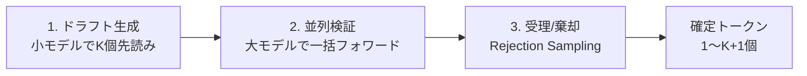

本記事は [Fast Inference from Transformers via Speculative Decoding (arXiv:2211.17192)](https://arxiv.org/abs/2211.17192) の解説記事です。

## 論文概要（Abstract）

本論文は、LLMの自己回帰推論を高速化する**Speculative Decoding**（投機的デコーディング）を提案している。小さなドラフトモデル（draft model）でK個のトークンを先読み生成し、大きなターゲットモデル（target model）で1回のフォワードパスで全K個を並列検証する。Modified Rejection Samplingにより、**出力分布がターゲットモデルと数学的に同一**であること（lossless性）が保証される。著者らはT5-XXLをターゲット、T5-Smallをドラフトとして評価し、最大2.5〜3.5倍の高速化を報告している。

この記事は [Zenn記事: Ollama・vLLM・SGLang徹底比較 2026年版オンプレLLM推論エンジン選定ガイド](https://zenn.dev/0h_n0/articles/a0c2ba86fb5850) の深掘りです。

## 情報源

- **arXiv ID**: 2211.17192
- **URL**: [https://arxiv.org/abs/2211.17192](https://arxiv.org/abs/2211.17192)
- **著者**: Yaniv Leviathan, Matan Kalman, Yossi Matias（Google Research）
- **発表年**: 2022（ICML 2023採択）
- **分野**: cs.LG, cs.CL

## 背景と動機（Background & Motivation）

LLMの自己回帰生成では、各トークンの生成に1回のフォワードパスが必要である。70Bパラメータモデルの場合、1フォワードパスで約140GBの重みをGPUメモリから読み出す必要があるが、実際の計算量（FLOP）は比較的小さい。つまり、自己回帰デコードは**メモリバウンド**な処理であり、GPUの計算能力が十分に活用されていない。

具体的には、バッチサイズ1でのデコードにおけるGPU利用率は以下のように見積もれる。

$$
\text{MBU} = \frac{\text{Arithmetic Intensity}}{\text{Peak AI}} = \frac{2 \cdot P}{B_{\text{mem}}}
$$

ここで、
- $\text{MBU}$: Model Bandwidth Utilization
- $P$: モデルパラメータ数
- $B_{\text{mem}}$: GPUメモリ帯域幅（例: A100で2TB/s）

70Bモデル、FP16で$P = 70 \times 10^9 \times 2 = 140$GB。A100の帯域幅2TB/sでは、1フォワードパスあたり$140/2000 = 70$ms。実際の計算FLOPは$2 \times 70 \times 10^9 \approx 140$GFLOP、A100のFP16ピーク312TFLOPsに対して$140/312000 \approx 0.045\%$しか使っていない。

**Speculative Decodingの着想**: 1フォワードパスで$K$個のトークンをまとめて検証すれば、メモリ帯域幅のコストを$K$トークンで按分でき、実効スループットが向上する。

## 主要な貢献（Key Contributions）

- **Speculative Decodingアルゴリズム**: ドラフトモデルでK個のトークンを投機生成し、ターゲットモデルで並列検証
- **Modified Rejection Sampling**: 出力分布をターゲットモデルと完全に一致させるサンプリング手法（lossless性の数学的証明）
- **期待生成トークン数の理論分析**: 受理率$\alpha$に基づく期待速度向上の定式化

## 技術的詳細（Technical Details）

### アルゴリズムの概要

Speculative Decodingは以下の3ステップで動作する。



**ステップ1: ドラフト生成**

小さなドラフトモデル$M_d$で$K$個のトークンを自己回帰的に生成する。

$$
\tilde{x}_{t+k} \sim q(\cdot \mid x_1, \ldots, x_t, \tilde{x}_{t+1}, \ldots, \tilde{x}_{t+k-1}) \quad k = 1, \ldots, K
$$

ここで$q$はドラフトモデルの確率分布。

**ステップ2: 並列検証**

ターゲットモデル$M_t$で、プレフィックス $[x_1, \ldots, x_t, \tilde{x}_{t+1}, \ldots, \tilde{x}_{t+K}]$ に対する1回のフォワードパスを実行する。これにより、$K+1$個の位置での確率分布$p(\cdot \mid \ldots)$が同時に得られる。

**ステップ3: Modified Rejection Sampling**

各ドラフトトークン$\tilde{x}_{t+k}$に対して、以下の受理判定を行う。

$$
\text{accept} \iff r < \min\left(1, \frac{p(\tilde{x}_{t+k} \mid x_{\leq t+k-1})}{q(\tilde{x}_{t+k} \mid x_{\leq t+k-1})}\right)
$$

ここで$r \sim \text{Uniform}(0, 1)$。

- **受理**: ターゲット分布$p$の方がドラフト分布$q$と同等以上の確率を割り当てている場合、そのトークンは確定
- **棄却**: ターゲット分布$p$の方が低い確率を割り当てている場合、確率$1 - p/q$で棄却

棄却が発生した位置では、修正分布からリサンプリングする。

$$
x_{t+k} \sim \text{norm}\left(\max\left(0, p(\cdot \mid x_{\leq t+k-1}) - q(\cdot \mid x_{\leq t+k-1})\right)\right)
$$

**lossless性の保証**: 著者らは、上記のRejection Samplingにより、最終的な出力トークン列の分布がターゲットモデル$M_t$からの直接サンプリングと**完全に一致**することを数学的に証明している（論文Theorem 1）。

### 期待生成トークン数の分析

1回のSpeculative Decodingラウンドで確定するトークン数の期待値は、受理率$\alpha$の関数として表される。

$$
\mathbb{E}[\text{accepted tokens}] = \frac{1 - \alpha^{K+1}}{1 - \alpha}
$$

ここで$\alpha = \mathbb{E}\left[\min\left(1, \frac{p(x)}{q(x)}\right)\right]$はトークンレベルの平均受理率。

**速度向上率の近似**:

ドラフトモデルの推論コストをターゲットの$c$倍（$c \ll 1$、通常$c \approx 0.05$〜$0.2$）とすると、速度向上率は

$$
\text{Speedup} \approx \frac{1 - \alpha^{K+1}}{(1 - \alpha)(K \cdot c + 1)}
$$

$K$を大きくするほど1ラウンドあたりの期待トークン数は増えるが、ドラフト生成コスト$K \cdot c$も増えるため、最適な$K$が存在する。

### 実装の詳細

```python
import torch
import torch.nn.functional as F
from typing import NamedTuple


class SpeculativeOutput(NamedTuple):
    """Speculative Decodingの1ラウンドの出力"""
    accepted_tokens: list[int]
    num_accepted: int


def speculative_decode(
    target_model: "LLMModel",
    draft_model: "LLMModel",
    prefix_ids: torch.Tensor,
    K: int = 5,
    temperature: float = 1.0,
) -> SpeculativeOutput:
    """Speculative Decodingの1ラウンド

    Args:
        target_model: ターゲットモデル（大きい）
        draft_model: ドラフトモデル（小さい）
        prefix_ids: これまでのトークン列 (seq_len,)
        K: 先読みトークン数
        temperature: サンプリング温度

    Returns:
        確定したトークン列と受理数
    """
    device = prefix_ids.device

    # Step 1: ドラフトモデルでK個のトークンを生成
    draft_tokens = []
    draft_probs = []
    current_ids = prefix_ids.clone()

    for _ in range(K):
        logits = draft_model(current_ids.unsqueeze(0))[:, -1, :]
        probs = F.softmax(logits / temperature, dim=-1).squeeze(0)
        token = torch.multinomial(probs, 1).item()
        draft_tokens.append(token)
        draft_probs.append(probs)
        current_ids = torch.cat([current_ids, torch.tensor([token], device=device)])

    # Step 2: ターゲットモデルで並列検証（1フォワードパス）
    verify_ids = torch.cat([
        prefix_ids,
        torch.tensor(draft_tokens, device=device)
    ]).unsqueeze(0)
    target_logits = target_model(verify_ids)  # (1, seq_len + K, vocab)

    # K+1個の位置の確率分布を取得
    target_probs_list = []
    for k in range(K + 1):
        pos = len(prefix_ids) - 1 + k
        probs = F.softmax(target_logits[0, pos, :] / temperature, dim=-1)
        target_probs_list.append(probs)

    # Step 3: Modified Rejection Sampling
    accepted_tokens = []

    for k in range(K):
        p = target_probs_list[k]  # ターゲット分布
        q = draft_probs[k]  # ドラフト分布
        token = draft_tokens[k]

        # 受理確率: min(1, p(token) / q(token))
        accept_prob = min(1.0, (p[token] / q[token]).item())

        if torch.rand(1).item() < accept_prob:
            accepted_tokens.append(token)
        else:
            # 棄却: 修正分布からリサンプリング
            adjusted = torch.clamp(p - q, min=0)
            adjusted = adjusted / adjusted.sum()
            new_token = torch.multinomial(adjusted, 1).item()
            accepted_tokens.append(new_token)
            break  # 棄却が発生したらラウンド終了
    else:
        # 全K個受理された場合、K+1番目のトークンを追加
        bonus_token = torch.multinomial(target_probs_list[K], 1).item()
        accepted_tokens.append(bonus_token)

    return SpeculativeOutput(
        accepted_tokens=accepted_tokens,
        num_accepted=len(accepted_tokens),
    )
```

## 実装のポイント（Implementation）

### ドラフトモデルの選択基準

ドラフトモデルの品質（受理率$\alpha$）が高速化率を直接決定する。

| ドラフトモデル | ターゲットモデル | 受理率$\alpha$ | 速度向上 |
|-------------|--------------|----------------|---------|
| T5-Small (60M) | T5-XXL (11B) | 0.5-0.7 | 2-3x |
| LLaMA-7B | LLaMA-70B | 0.6-0.8 | 2.5-3.5x |
| 1-layer head | LLaMA-7B (EAGLE) | 0.7-0.9 | 3-4x |

**選択の指針**:
- ターゲットとドラフトは**同じトークナイザー**を使う必要がある
- ドラフトモデルは**ターゲットの5〜20%のパラメータ数**が目安
- ドメイン特化のターゲットモデルには、同じドメインでファインチューニングしたドラフトが有効

### バッチサイズとの関係

Speculative Decodingは**バッチサイズ1（オンラインサービング、レイテンシ最適化）**で最も効果が大きい。

- バッチサイズ1: メモリバウンド → ドラフトの追加計算コストが小さく、並列検証の効果が大きい
- 大バッチサイズ: 計算バウンドに近づく → ドラフトの計算コストが相対的に大きくなり、効果が薄まる

そのため、vLLMやSGLangでSpeculative Decodingを有効にする場合、**レイテンシが重視される低並列環境**で特に効果的である。

### 最適な先読み数$K$の決定

$K$は受理率$\alpha$とドラフト/ターゲットのコスト比$c$に依存する。

$$
K^* = \arg\max_K \frac{1 - \alpha^{K+1}}{(1 - \alpha)(K \cdot c + 1)}
$$

一般的には$K = 4 \sim 8$が最適であると報告されている。$K$が大きすぎると後半のドラフトトークンの受理率が低下し、無駄な計算が増える。

## 実験結果（Results）

著者らはT5-XXL（11B）をターゲット、T5-Small（60M）をドラフトとして、複数のタスクで評価している。

**主要な結果**（論文Table 1より）:

| タスク | 受理率$\alpha$ | 速度向上 | K値 |
|--------|---------------|---------|-----|
| WMT En→Fr（翻訳） | 0.7-0.8 | **3.4x** | 5 |
| CNN/DailyMail（要約） | 0.5-0.6 | **2.5x** | 4 |
| XSum（要約） | 0.6-0.7 | **2.8x** | 5 |

翻訳タスクでは受理率が高く（ドラフトモデルの予測がターゲットと高い一致を示す）、最も大きな速度向上が得られている。

**重要な性質**: 著者らは出力テキストの品質が**完全にターゲットモデルと同一**であることを実験的にも確認している。BLEU、ROUGE等の自動評価指標においてSpeculative Decodingの有無で差は見られなかった。

## 実運用への応用（Practical Applications）

Zenn記事で紹介されているvLLM 0.17のSpeculative Decoding機能は、まさにこの論文のアイデアに基づいている。

**具体的な適用場面**:

1. **レイテンシ重視のチャットAPI**: ユーザー対話で応答時間の短縮が重要な場面。バッチサイズが小さく、Speculative Decodingの効果が最大になる
2. **コード生成**: コード生成はトークンの予測可能性が高く（構文的制約が強い）、ドラフトモデルの受理率が高くなりやすい
3. **ストリーミング応答**: 初回トークンまでの時間（TTFT）短縮よりも、トークン間レイテンシ（ITL）の改善に効果的

**制約と注意点**:

- 大バッチ処理（オフラインバッチ推論等）ではContinuous Batchingの方が効果的
- ドラフトモデルの追加GPU メモリ（ターゲットの5〜20%）が必要
- ドラフトモデルの学習・選定にコストがかかる

## 関連研究（Related Work）

- **Speculative Sampling (Chen et al., 2023)**: DeepMindによる独立した同時発見。同じRejection Samplingのアイデアだが、Top-k/Top-pサンプリングへの拡張を含む
- **Medusa (Cai et al., 2024)**: ドラフトモデルの代わりに、ターゲットモデルに複数の予測ヘッドを追加する手法。別モデルのロードが不要
- **EAGLE/EAGLE-2 (Li et al., 2024)**: 1層のAutoregressive Headをドラフトとして使用し、動的ドラフトツリーで効率を向上。vLLM/SGLang比で最大4.26倍のスピードアップを報告

## まとめと今後の展望

Speculative Decodingは、LLMの自己回帰推論がメモリバウンドであるという本質的な性質を利用し、「ドラフト生成 → 並列検証」のパイプラインで推論を高速化する手法である。出力分布を変えずに最大3.5倍の高速化を実現する点が実用上の大きな利点であり、vLLM・SGLang・TensorRT-LLMなどの主要フレームワークに統合されている。

後続研究（Medusa、EAGLE、EAGLE-2）はドラフトモデルのアーキテクチャを改善し、さらなる高速化を達成している。2026年時点ではEAGLE-3がSGLangに統合されるなど、Speculative Decodingはオンプレ推論エンジンの標準的な高速化手法として定着している。

## 参考文献

- **arXiv**: [https://arxiv.org/abs/2211.17192](https://arxiv.org/abs/2211.17192)
- **Related: EAGLE-2**: [https://arxiv.org/abs/2406.14066](https://arxiv.org/abs/2406.14066)
- **Related: Medusa**: [https://arxiv.org/abs/2401.07851](https://arxiv.org/abs/2401.07851)
- **Related Zenn article**: [https://zenn.dev/0h_n0/articles/a0c2ba86fb5850](https://zenn.dev/0h_n0/articles/a0c2ba86fb5850)

---

*本記事はAI（Claude Code）により自動生成されました。論文の内容を正確に伝えることを目指していますが、詳細は原論文をご参照ください。*
