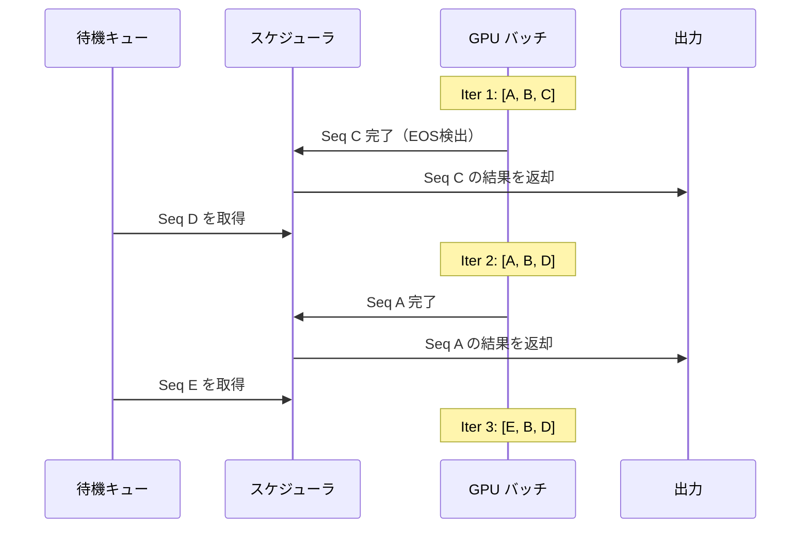

本記事は [Orca: A Distributed Serving System for Transformer-Based Generative Models](https://arxiv.org/abs/2309.01529) の解説記事です。

## 論文概要（Abstract）

本論文は、Transformerベースの生成モデルのサービングにおけるスケジューリング問題に対し、**Continuous Batching**（別名: iteration-level scheduling）を提案している。従来のStatic Batching（リクエストをバッチでまとめ、全シーケンスが完了するまでGPUを占有）に代わり、各トークン生成イテレーションごとにバッチを動的に再構成する。加えて、**Selective Batching**により、Attention以外の演算は一括バッチ処理しつつ、Attentionはシーケンスごとに個別処理する方式を導入している。著者らはFasterTransformer比で最大23.9倍のスループット改善を報告している。

この記事は [Zenn記事: Ollama・vLLM・SGLang徹底比較 2026年版オンプレLLM推論エンジン選定ガイド](https://zenn.dev/0h_n0/articles/a0c2ba86fb5850) の深掘りです。

## 情報源

- **arXiv ID**: 2309.01529
- **URL**: [https://arxiv.org/abs/2309.01529](https://arxiv.org/abs/2309.01529)
- **著者**: Gyeong-In Yu, Joo Seong Jeong, et al.（Seoul National University）
- **発表年**: 2022（OSDI 2022採択）
- **分野**: cs.DC, cs.LG

## 背景と動機（Background & Motivation）

LLMの推論は**自己回帰生成**（autoregressive generation）で行われる。各ステップで1トークンを生成し、それを入力に追加して次のトークンを生成する。この性質により、バッチ内の各シーケンスの生成完了タイミングがバラバラになる。

### Static Batchingの問題

従来のサービングシステム（FasterTransformer等）は**Static Batching**を採用していた。

```mermaid
gantt
    title Static Batching - GPU利用の非効率性
    dateFormat X
    axisFormat %s
    section Seq A
    生成中（20 tokens）: 0, 20
    section Seq B
    生成中（50 tokens）: 0, 50
    section Seq C
    生成中（10 tokens）: 0, 10
    待機（GPUアイドル）: 10, 50
```



Static Batchingでは、バッチ内の全シーケンスが生成を完了するまで、新しいリクエストをバッチに追加できない。上図のSeq C（10トークンで完了）は、Seq B（50トークン）の完了を待つ間、GPUリソースが無駄になっている。

この問題は「**GPU utilization gap**」と呼ばれ、著者らの分析では実運用環境においてGPU利用率が**30-50%程度**にとどまることが多いと報告されている。

### 課題の定式化

$N$個のリクエストがバッチ$\mathcal{B}$に含まれているとする。各リクエスト$i$の生成長を$L_i$とすると、Static Batchingの総計算ステップは

$$
T_{\text{static}} = N \cdot \max_{i \in \mathcal{B}} L_i
$$

一方、理想的なスケジューリングでは

$$
T_{\text{ideal}} = \sum_{i \in \mathcal{B}} L_i
$$

GPU利用率は

$$
\text{Utilization} = \frac{T_{\text{ideal}}}{T_{\text{static}}} = \frac{\sum L_i}{N \cdot \max L_i}
$$

生成長の分散が大きいほど$\text{Utilization}$は低下する。例えば、$L = [10, 50]$の2リクエストでは$\text{Utilization} = 60/100 = 60\%$。

## 主要な貢献（Key Contributions）

- **Continuous Batching（Iteration-Level Scheduling）**: 各イテレーションでバッチを動的に再構成し、完了シーケンスを即座に取り出し、新規リクエストを空きスロットに挿入
- **Selective Batching**: Attention演算とそれ以外の演算を分離し、異なるKV状態を持つシーケンスを同一バッチに混在可能にした
- **分散推論対応**: Tensor ParallelismとPipeline Parallelismを組み合わせた分散サービングアーキテクチャ

## 技術的詳細（Technical Details）

### Continuous Batching

Continuous Batchingの核心は、トークン生成の各イテレーションをスケジューリングの最小単位とする点にある。

**動作原理**:

1. 各イテレーション開始時にスケジューラがアクティブなリクエストを確認
2. 前のイテレーションで完了したシーケンスをバッチから取り出し
3. 待機キューから新規リクエストを空きスロットに挿入
4. 再構成されたバッチで1イテレーション（1トークン生成）を実行



**スループット改善の定量的理解**:

Continuous Batchingでは、各スロットが独立にシーケンスを処理できるため、GPU計算資源は常にバッチサイズ分のシーケンスで埋められる。理論上のスループットは

$$
\text{Throughput}_{\text{CB}} = \frac{B}{\bar{L} \cdot t_{\text{iter}}}
$$

ここで、
- $B$: 最大バッチサイズ
- $\bar{L}$: 平均生成長
- $t_{\text{iter}}$: 1イテレーションの所要時間

Static Batchingのスループットは

$$
\text{Throughput}_{\text{static}} = \frac{B}{L_{\max} \cdot t_{\text{iter}}}
$$

従って、スループット比は

$$
\frac{\text{Throughput}_{\text{CB}}}{\text{Throughput}_{\text{static}}} = \frac{L_{\max}}{\bar{L}}
$$

生成長の分散が大きいほど、Continuous Batchingの優位性が増す。

### Selective Batching

Transformerの各レイヤーは、Attention演算と非Attention演算（Linear、LayerNorm等）で構成される。

**問題**: Attention演算では各シーケンスのKVキャッシュ長が異なるため、単純なテンソルバッチ処理ができない。

**解決**: Selective Batchingでは以下のように演算を分離する。

```python
import torch
from typing import Optional

def selective_batching_forward(
    hidden_states: torch.Tensor,
    kv_caches: list[tuple[torch.Tensor, torch.Tensor]],
    seq_lens: list[int],
    layer: "TransformerLayer",
) -> torch.Tensor:
    """Selective Batchingによるレイヤー処理

    Args:
        hidden_states: (total_tokens, hidden_dim) - 全シーケンスの隠れ状態を連結
        kv_caches: シーケンスごとのKVキャッシュ
        seq_lens: 各シーケンスの現在長
        layer: Transformerレイヤー

    Returns:
        output: (total_tokens, hidden_dim)
    """
    batch_size = len(seq_lens)

    # 1. QKV Linear projection - 一括バッチ処理（全シーケンス同一演算）
    qkv = layer.qkv_proj(hidden_states)  # (total_tokens, 3 * hidden_dim)
    q, k, v = qkv.chunk(3, dim=-1)

    # 2. Attention - シーケンスごとに個別処理（KV長が異なるため）
    outputs = []
    token_offset = 0
    for i in range(batch_size):
        seq_q = q[token_offset:token_offset + 1]  # デコード時は1トークン
        cached_k, cached_v = kv_caches[i]

        # KVキャッシュに新しいK,Vを追加
        new_k = torch.cat([cached_k, k[token_offset:token_offset + 1]], dim=0)
        new_v = torch.cat([cached_v, v[token_offset:token_offset + 1]], dim=0)
        kv_caches[i] = (new_k, new_v)

        # Scaled dot-product attention
        scale = seq_q.shape[-1] ** -0.5
        scores = (seq_q @ new_k.T) * scale
        attn_weights = torch.softmax(scores, dim=-1)
        attn_out = attn_weights @ new_v
        outputs.append(attn_out)
        token_offset += 1

    attn_output = torch.cat(outputs, dim=0)

    # 3. Output projection + FFN - 一括バッチ処理
    output = layer.out_proj(attn_output)
    output = layer.ffn(output + hidden_states)  # Residual connection

    return output
```

このアプローチにより、Linear演算（計算バウンド）ではGPUのTensor Coreを効率的に使いつつ、Attention演算（メモリバウンド）ではシーケンスごとに異なるKV状態を正しく処理できる。

### Prefill vs Decode の分離

自己回帰生成には2つのフェーズがある。

| フェーズ | 処理内容 | 計算特性 |
|---------|---------|---------|
| **Prefill** | プロンプト全体のKVキャッシュを一括計算 | 計算バウンド（大量のGEMM） |
| **Decode** | 1トークンずつ生成 | メモリバウンド（KVキャッシュ読み出し） |

Orcaでは両フェーズを同一バッチに混在させることができるが、Prefillの計算コストが高いため、Prefillリクエストが入ると同一バッチ内のDecodeリクエストのレイテンシが悪化する「**Prefill interference**」問題が生じる。

この問題は後続研究のSarathi-Serve（2024）で**Chunked Prefill**として解決され、vLLM v0.4以降に実装されている。Chunked Prefillでは、Prefillを固定サイズのチャンクに分割し、Decodeリクエストと交互に実行することで干渉を緩和する。

## 実装のポイント（Implementation）

### スケジューラの設計

Continuous Batchingのスケジューラは以下の判断を各イテレーションで行う。

1. **Admission**: 待機キューからどのリクエストをバッチに追加するか
2. **Preemption**: メモリ不足時にどのリクエストを中断するか
3. **Completion**: EOS検出またはmax_tokens到達時のリクエスト完了処理

```python
from dataclasses import dataclass, field

@dataclass
class SchedulerOutput:
    """スケジューラの1イテレーション分の出力"""
    scheduled_seq_ids: list[int] = field(default_factory=list)
    preempted_seq_ids: list[int] = field(default_factory=list)
    completed_seq_ids: list[int] = field(default_factory=list)


class ContinuousBatchScheduler:
    """Continuous Batchingスケジューラの簡略実装"""

    def __init__(self, max_batch_size: int, max_gpu_blocks: int):
        self.max_batch_size = max_batch_size
        self.max_gpu_blocks = max_gpu_blocks
        self.running: list[int] = []
        self.waiting: list[int] = []

    def schedule(self) -> SchedulerOutput:
        """1イテレーション分のスケジューリング"""
        output = SchedulerOutput()

        # 1. 完了チェック
        for seq_id in list(self.running):
            if self._is_completed(seq_id):
                self.running.remove(seq_id)
                output.completed_seq_ids.append(seq_id)

        # 2. 新規リクエスト追加
        while self.waiting and len(self.running) < self.max_batch_size:
            if self._has_enough_memory():
                seq_id = self.waiting.pop(0)
                self.running.append(seq_id)
                output.scheduled_seq_ids.append(seq_id)
            else:
                break

        return output

    def _is_completed(self, seq_id: int) -> bool:
        """EOS検出またはmax_tokens到達を判定"""
        raise NotImplementedError

    def _has_enough_memory(self) -> bool:
        """GPUメモリに余裕があるか判定"""
        raise NotImplementedError
```

### バッチサイズの動的変動

Continuous Batchingではバッチサイズが各イテレーションで変動する。これにより以下の課題が生じる。

- **メモリ使用量の予測困難**: バッチサイズの上限を事前に設定する必要がある（vLLMではPagedAttentionにより柔軟に対応）
- **GPU計算効率の変動**: バッチサイズが小さいイテレーションではGPU利用率が低下する
- **レイテンシの非均一性**: バッチに長いPrefillリクエストが挿入されると、他のDecodeリクエストのレイテンシが急増する

## 実験結果（Results）

著者らはGPT-3（175B）相当のモデルをA100 8GPUクラスタで評価している。

**主要な結果**（論文Table 2より）:

| 比較対象 | ワークロード | スループット改善率 |
|---------|------------|----------------|
| FasterTransformer | 短文生成 | **最大23.9倍** |
| FasterTransformer | 長文生成 | **最大7.8倍** |
| NVIDIA Triton | 混合ワークロード | **最大3.4倍** |

改善率が特に大きいのは短文生成（生成長の分散が大きい）ワークロードで、Static Batchingの非効率さが最も顕著に現れるケースである。

**Normalized Latency（正規化レイテンシ）**: 著者らは「1トークンあたりのレイテンシ」を正規化指標として使用し、Continuous Batchingが高負荷時でも安定したレイテンシを維持することを示している。Static Batchingでは負荷増加時にレイテンシが急激に悪化する。

## 実運用への応用（Practical Applications）

Continuous Batchingは2026年時点で**全ての主要LLMサービングフレームワークに採用**されている。

| フレームワーク | Continuous Batching | 追加最適化 |
|-------------|-------------------|-----------|
| vLLM | ✅ | PagedAttention、Chunked Prefill |
| SGLang | ✅ | RadixAttention、Cache-Aware Scheduling |
| TGI | ✅ | （2025年12月にメンテナンスモード移行） |
| TensorRT-LLM | ✅ | In-Flight Batching（NVIDIA独自実装） |

Zenn記事で紹介されているvLLMの「Ollama比約19倍のスループット」は、主にContinuous Batching + PagedAttentionの組み合わせによるものである。Ollamaはリクエストを基本的にシーケンシャルに処理するため、Continuous Batchingの恩恵を受けられない。

**制約と注意点**:

- 単一リクエストのレイテンシはContinuous Batchingでも改善しない（スループットの改善技術）
- バッチサイズ1の場合、Continuous Batchingのオーバーヘッド（スケジューラの判断コスト）のみが追加される
- 超長シーケンスがバッチを占有する「Head-of-Line Blocking」問題は、Chunked Prefillで緩和可能

## 関連研究（Related Work）

- **PagedAttention (Kwon et al., SOSP 2023)**: Orcaの後継として、KVキャッシュのメモリ管理を改善。Continuous Batchingはスケジューリングの改善、PagedAttentionはメモリ管理の改善であり、両者は相補的
- **Sarathi-Serve (Agrawal et al., 2024)**: PrefillとDecodeの干渉問題を解決するChunked Prefillを提案。vLLM v0.4以降に実装済み
- **NVIDIA TensorRT-LLM**: NVIDIAによるContinuous Batchingの独自実装（In-Flight Batching）。GPUカーネルレベルの最適化を含む

## まとめと今後の展望

Orcaが提案したContinuous Batchingは、LLM推論サービングのスケジューリングにおける最も基本的な最適化手法であり、2026年時点で全ての主要フレームワークに採用されている。Static Batchingの「GPU utilization gap」を解消し、生成長の分散が大きいワークロードで最大23.9倍のスループット改善を実現したと報告されている。

後続研究であるPagedAttention（メモリ管理）、RadixAttention（キャッシュ再利用）、Chunked Prefill（Prefill干渉緩和）はいずれもContinuous Batchingを前提としており、Orcaはオンプレ推論エンジン全体のアーキテクチャ基盤となっている。

## 参考文献

- **arXiv**: [https://arxiv.org/abs/2309.01529](https://arxiv.org/abs/2309.01529)
- **Related: vLLM**: [https://github.com/vllm-project/vllm](https://github.com/vllm-project/vllm)
- **Related: SGLang**: [https://github.com/sgl-project/sglang](https://github.com/sgl-project/sglang)
- **Related Zenn article**: [https://zenn.dev/0h_n0/articles/a0c2ba86fb5850](https://zenn.dev/0h_n0/articles/a0c2ba86fb5850)

---

*本記事はAI（Claude Code）により自動生成されました。論文の内容を正確に伝えることを目指していますが、詳細は原論文をご参照ください。*
