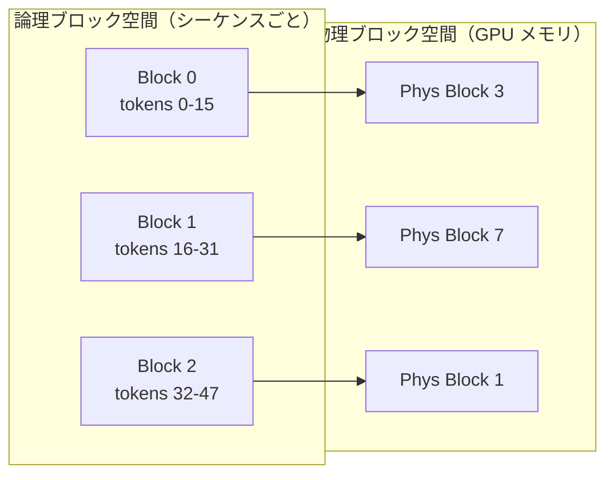

本記事は [Efficient Memory Management for Large Language Model Serving with PagedAttention (arXiv:2309.06180)](https://arxiv.org/abs/2309.06180) の解説記事です。

## 論文概要（Abstract）

本論文は、LLM推論サービングにおけるKVキャッシュのメモリ管理問題に対し、OSの仮想メモリ管理からインスパイアされた**PagedAttention**アルゴリズムを提案している。KVキャッシュを固定サイズのブロックに分割し、非連続な物理メモリに配置することで、従来手法で生じていたメモリフラグメンテーション（平均60〜80%の浪費）をほぼゼロに抑える。この手法を実装したvLLMシステムは、FasterTransformer比で最大22倍、Orca比で2.2倍のスループット改善を達成したと著者らは報告している。

この記事は [Zenn記事: Ollama・vLLM・SGLang徹底比較 2026年版オンプレLLM推論エンジン選定ガイド](https://zenn.dev/0h_n0/articles/a0c2ba86fb5850) の深掘りです。

## 情報源

- **arXiv ID**: 2309.06180
- **URL**: [https://arxiv.org/abs/2309.06180](https://arxiv.org/abs/2309.06180)
- **著者**: Woosuk Kwon, Zhuohan Li, Siyuan Zhuang, et al.（UC Berkeley）
- **発表年**: 2023（SOSP 2023採択）
- **分野**: cs.CL, cs.LG

## 背景と動機（Background & Motivation）

LLMの推論では、各リクエストに対してAttention計算に必要なKey-Value（KV）キャッシュがGPUメモリ上に保持される。例えば、LLaMA-13BモデルでBatch Size 1、シーケンス長2048の場合、KVキャッシュだけで約1.7GBのGPUメモリを消費する。

従来のLLMサービングシステムでは、リクエストの最大シーケンス長に合わせてKVキャッシュ用のメモリを**事前に連続領域として確保**していた。しかし、実際の生成シーケンス長は事前には分からないため、以下の3種類のメモリ浪費が発生していた。

1. **内部フラグメンテーション**: 事前確保した最大長分のメモリのうち、実際に使用されない末尾部分が無駄になる
2. **外部フラグメンテーション**: リクエストの追加・終了により、連続メモリ領域に使えない隙間が生じる
3. **予約の無駄**: 将来の生成に備えて確保しているが、まだ使われていないメモリ領域

著者らの分析によると、従来システムでは実際に使われているKVキャッシュメモリは確保されたメモリの**20.4〜38.2%**に過ぎず、残りは上記のフラグメンテーションにより浪費されていた（論文Section 3.2より）。

## 主要な貢献（Key Contributions）

- **PagedAttentionアルゴリズム**: KVキャッシュをOSのページングと同様に固定サイズブロックで管理し、非連続メモリ配置を可能にした
- **vLLMシステム**: PagedAttentionを実装した高スループットLLMサービングエンジン。Continuous Batchingと組み合わせて実用的な推論サーバを提供
- **Copy-on-Write機構**: ビームサーチやパラレルサンプリング時にKVキャッシュブロックを共有し、メモリ使用量を削減

## 技術的詳細（Technical Details）

### PagedAttentionのメモリ管理モデル

PagedAttentionの核心は、KVキャッシュの管理にOSの仮想メモリページングと同じ抽象化を導入する点にある。

**ブロック（Block）**: KVキャッシュを格納する固定サイズの単位。各ブロックは$B$個のトークン分のKeyベクトルとValueベクトルを保持する。

$$
\text{Block}_j = \{(K_i, V_i) \mid j \cdot B \leq i < (j+1) \cdot B\}
$$

ここで、
- $B$: ブロックサイズ（デフォルト16トークン）
- $K_i \in \mathbb{R}^{d}$: $i$番目のトークンのKeyベクトル
- $V_i \in \mathbb{R}^{d}$: $i$番目のトークンのValueベクトル
- $d$: Attentionヘッドの次元数

**ブロックテーブル（Block Table）**: 各シーケンスに対して、論理ブロック番号から物理ブロック番号への対応を記録するテーブル。OSのページテーブルに相当する。



この間接参照により、物理メモリ上でブロックが連続している必要がなくなり、外部フラグメンテーションが解消される。内部フラグメンテーションも最終ブロックの末尾にのみ発生するため、最大でも$B-1$トークン分に抑えられる。

### PagedAttentionのカーネル

従来のAttentionカーネルは、KVキャッシュが物理メモリ上で連続していることを前提としていた。PagedAttentionでは、ブロックテーブルを参照して非連続ブロックからKey/Valueを読み出す専用カーネルを実装している。

Attentionスコアの計算は以下のように変更される：

$$
A_i = \frac{q_i^T K_{\text{block}(i)}}{\sqrt{d}}
$$

$$
o = \sum_{j=0}^{N_{\text{blocks}}-1} \text{softmax}(A_j) \cdot V_{\text{block}(j)}
$$

ここで、
- $q_i$: 現在のQueryベクトル
- $K_{\text{block}(j)}$: ブロックテーブルで解決された物理ブロック$j$のKey行列
- $V_{\text{block}(j)}$: 同様に解決されたValue行列
- $N_{\text{blocks}}$: シーケンスに割り当てられたブロック数

```python
import torch

def paged_attention_forward(
    query: torch.Tensor,
    key_cache: torch.Tensor,
    value_cache: torch.Tensor,
    block_table: torch.Tensor,
    context_len: int,
    block_size: int = 16,
) -> torch.Tensor:
    """PagedAttentionの簡略化された実装

    Args:
        query: (num_heads, head_dim) - 現在のQueryベクトル
        key_cache: (num_blocks, block_size, num_heads, head_dim) - 物理ブロック
        value_cache: (num_blocks, block_size, num_heads, head_dim) - 物理ブロック
        block_table: (max_blocks,) - 論理→物理ブロック番号のマッピング
        context_len: 現在のシーケンス長
        block_size: ブロック内のトークン数

    Returns:
        output: (num_heads, head_dim) - Attention出力
    """
    num_heads, head_dim = query.shape
    scale = head_dim ** -0.5

    num_blocks = (context_len + block_size - 1) // block_size
    all_keys = []
    all_values = []

    for logical_idx in range(num_blocks):
        physical_idx = block_table[logical_idx].item()
        if logical_idx == num_blocks - 1:
            # 最終ブロックは途中まで使用
            tokens_in_block = context_len - logical_idx * block_size
            all_keys.append(key_cache[physical_idx, :tokens_in_block])
            all_values.append(value_cache[physical_idx, :tokens_in_block])
        else:
            all_keys.append(key_cache[physical_idx])
            all_values.append(value_cache[physical_idx])

    keys = torch.cat(all_keys, dim=0)      # (context_len, num_heads, head_dim)
    values = torch.cat(all_values, dim=0)

    # Scaled dot-product attention
    scores = torch.einsum("hd,thd->ht", query, keys) * scale
    weights = torch.softmax(scores, dim=-1)
    output = torch.einsum("ht,thd->hd", weights, values)

    return output
```

### Copy-on-Write（CoW）によるメモリ共有

ビームサーチやパラレルサンプリングでは、1つのプロンプトから複数のシーケンスが分岐する。従来手法では分岐時にKVキャッシュ全体をコピーしていたが、PagedAttentionではブロック単位のCoWを採用している。

分岐直後は全シーケンスが同じ物理ブロックを参照し、参照カウントを増やすだけでよい。あるシーケンスがそのブロックに書き込む必要が生じた時点で初めてコピーが行われる。

著者らの実験（論文Table 3より）によると、ビームサーチにおいてCoWにより**KVキャッシュのメモリ使用量を最大55%削減**できたと報告されている。

### Preemptionとスワッピング

リクエスト数が増加し、GPUメモリが不足した場合のPreemption（割り込み）機構として、以下の2つの戦略が実装されている。

1. **Swapping**: 実行中のシーケンスのKVキャッシュブロックをCPUメモリに退避し、GPUメモリを解放する
2. **Recomputation**: KVキャッシュを破棄し、そのシーケンスが再スケジュールされた際にプロンプトから再計算する

著者らは、KVキャッシュサイズが小さい場合はRecomputation、大きい場合はSwappingが効率的であると述べている。

## 実装のポイント（Implementation）

### ブロックサイズの選択

著者らの実験（論文Figure 9より）では、ブロックサイズ$B=16$が最適とされている。

- $B$が小さすぎる（例: 1）場合: ブロックテーブルのオーバーヘッドが増加し、カーネルの分岐処理が増える
- $B$が大きすぎる（例: 256）場合: 内部フラグメンテーションが増大し、メモリ効率が低下
- $B=16$: メモリ効率とカーネル性能のバランスが取れる

### gpu-memory-utilization パラメータ

vLLMでは`--gpu-memory-utilization`パラメータでKVキャッシュに使うGPUメモリの割合を制御する。

```bash
# 推奨設定: 0.85-0.90
vllm serve meta-llama/Llama-3.1-8B-Instruct \
    --gpu-memory-utilization 0.9

# OOM発生時は下げる
vllm serve meta-llama/Llama-3.1-8B-Instruct \
    --gpu-memory-utilization 0.85
```

この値を高く設定するほどバッチサイズを大きくでき、スループットが向上するが、0.95以上ではモデル重みやアクティベーションのための余裕がなくなりOOMが発生しやすくなる。

### Flash Attentionとの関係

PagedAttentionカーネルはFlash Attentionの設計思想（タイリングによるHBMアクセス削減）を継承しつつ、非連続ブロックへのアクセスを追加している。vLLM v0.4以降ではFlashInferバックエンドが統合され、PagedAttentionとFlash Attentionの利点を組み合わせた実装が利用可能になっている。

## Production Deployment Guide

### AWS実装パターン（コスト最適化重視）

PagedAttentionベースのvLLMサーバをAWSにデプロイする場合の構成を、トラフィック量別に整理する。

**トラフィック量別の推奨構成**:

| 規模 | 月間リクエスト | 推奨構成 | 月額コスト | 主要サービス |
|------|--------------|---------|-----------|------------|
| **Small** | ~3,000 (100/日) | Serverless | $50-150 | Lambda + Bedrock + DynamoDB |
| **Medium** | ~30,000 (1,000/日) | Hybrid | $500-1,200 | ECS Fargate(GPU) + ElastiCache |
| **Large** | 300,000+ (10,000/日) | Container | $3,000-8,000 | EKS + Karpenter + GPU Spot |

**Small構成の詳細** (月額$50-150):
- **Lambda**: イベント駆動のリクエストルーティング ($20/月)
- **Bedrock**: Claude 3.5 Haiku、Prompt Caching有効 ($80/月)
- **DynamoDB**: On-Demand、プロンプトキャッシュ保存 ($10/月)

**Medium構成の詳細** (月額$500-1,200):
- **ECS Fargate**: vLLMコンテナ、g5.xlarge相当 ($400/月)
- **ElastiCache Redis**: cache.t3.micro、レスポンスキャッシュ ($15/月)
- **ALB**: Application Load Balancer ($20/月)
- **Bedrock**: 高負荷時のフォールバック ($300/月)

**Large構成の詳細** (月額$3,000-8,000):
- **EKS**: コントロールプレーン ($72/月)
- **EC2 Spot**: g5.xlarge × 2-4台 (平均$800/月、Spot割引60-70%)
- **Karpenter**: GPU Auto Scaling（追加コストなし）
- **S3**: モデルウェイト・KVキャッシュスナップショット保存 ($20/月)

**コスト試算の注意事項**: 上記は2026年3月時点のAWS ap-northeast-1（東京）リージョン料金に基づく概算値です。実際のコストはトラフィックパターンやバースト使用量により変動します。最新料金は [AWS料金計算ツール](https://calculator.aws/) で確認してください。

### Terraformインフラコード

**Small構成 (Serverless): Lambda + Bedrock + DynamoDB**

```hcl
module "vpc" {
  source  = "terraform-aws-modules/vpc/aws"
  version = "~> 5.0"

  name = "vllm-vpc"
  cidr = "10.0.0.0/16"
  azs  = ["ap-northeast-1a", "ap-northeast-1c"]
  private_subnets = ["10.0.1.0/24", "10.0.2.0/24"]

  enable_nat_gateway   = false
  enable_dns_hostnames = true
}

resource "aws_iam_role" "lambda_bedrock" {
  name = "lambda-bedrock-role"
  assume_role_policy = jsonencode({
    Version = "2012-10-17"
    Statement = [{
      Action    = "sts:AssumeRole"
      Effect    = "Allow"
      Principal = { Service = "lambda.amazonaws.com" }
    }]
  })
}

resource "aws_iam_role_policy" "bedrock_invoke" {
  role = aws_iam_role.lambda_bedrock.id
  policy = jsonencode({
    Version = "2012-10-17"
    Statement = [{
      Effect   = "Allow"
      Action   = ["bedrock:InvokeModel", "bedrock:InvokeModelWithResponseStream"]
      Resource = "arn:aws:bedrock:ap-northeast-1::foundation-model/anthropic.claude-3-5-haiku*"
    }]
  })
}

resource "aws_lambda_function" "llm_handler" {
  filename      = "lambda.zip"
  function_name = "vllm-bedrock-handler"
  role          = aws_iam_role.lambda_bedrock.arn
  handler       = "index.handler"
  runtime       = "python3.12"
  timeout       = 60
  memory_size   = 1024
  environment {
    variables = {
      BEDROCK_MODEL_ID    = "anthropic.claude-3-5-haiku-20241022-v1:0"
      DYNAMODB_TABLE      = aws_dynamodb_table.cache.name
      ENABLE_PROMPT_CACHE = "true"
    }
  }
}

resource "aws_dynamodb_table" "cache" {
  name         = "vllm-prompt-cache"
  billing_mode = "PAY_PER_REQUEST"
  hash_key     = "prompt_hash"
  attribute {
    name = "prompt_hash"
    type = "S"
  }
  ttl {
    attribute_name = "expire_at"
    enabled        = true
  }
}
```

**Large構成 (Container): EKS + Karpenter + Spot Instances**

```hcl
module "eks" {
  source  = "terraform-aws-modules/eks/aws"
  version = "~> 20.0"

  cluster_name    = "vllm-inference"
  cluster_version = "1.31"
  vpc_id          = module.vpc.vpc_id
  subnet_ids      = module.vpc.private_subnets

  cluster_endpoint_public_access = true
  enable_cluster_creator_admin_permissions = true
}

resource "kubectl_manifest" "karpenter_nodepool" {
  yaml_body = <<-YAML
    apiVersion: karpenter.sh/v1
    kind: NodePool
    metadata:
      name: gpu-spot
    spec:
      template:
        spec:
          requirements:
            - key: karpenter.sh/capacity-type
              operator: In
              values: ["spot"]
            - key: node.kubernetes.io/instance-type
              operator: In
              values: ["g5.xlarge", "g5.2xlarge"]
          limits:
            cpu: "32"
            memory: "128Gi"
            nvidia.com/gpu: "4"
      disruption:
        consolidationPolicy: WhenEmptyOrUnderutilized
        consolidateAfter: 30s
  YAML
}

resource "aws_budgets_budget" "vllm_monthly" {
  name         = "vllm-monthly-budget"
  budget_type  = "COST"
  limit_amount = "8000"
  limit_unit   = "USD"
  time_unit    = "MONTHLY"
  notification {
    comparison_operator       = "GREATER_THAN"
    threshold                 = 80
    threshold_type            = "PERCENTAGE"
    notification_type         = "ACTUAL"
    subscriber_email_addresses = ["ops@example.com"]
  }
}
```

### セキュリティベストプラクティス

- **IAMロール**: 最小権限の原則。Bedrock InvokeModelのみ許可、リソースARNでモデルを限定
- **ネットワーク**: EKSはprivateサブネットに配置、パブリックアクセスはVPN/Direct Connect経由
- **シークレット**: HuggingFace TokenはSecrets Manager経由、環境変数ハードコード禁止
- **暗号化**: S3/DynamoDBはKMS暗号化、転送中はTLS 1.2以上

### 運用・監視設定

```python
import boto3

cloudwatch = boto3.client('cloudwatch')

# vLLM KVキャッシュ使用率アラート
cloudwatch.put_metric_alarm(
    AlarmName='vllm-kvcache-usage-high',
    ComparisonOperator='GreaterThanThreshold',
    EvaluationPeriods=2,
    MetricName='GPUCacheUsagePercent',
    Namespace='Custom/vLLM',
    Period=300,
    Statistic='Average',
    Threshold=90.0,
    AlarmDescription='vLLM KVキャッシュ使用率90%超過',
    AlarmActions=['arn:aws:sns:ap-northeast-1:123456789:vllm-alerts'],
)
```

### コスト最適化チェックリスト

- [ ] ~100 req/日 → Lambda + Bedrock (Serverless) - $50-150/月
- [ ] ~1000 req/日 → ECS Fargate GPU - $500-1,200/月
- [ ] 10000+ req/日 → EKS + Spot Instances - $3,000-8,000/月
- [ ] EC2 Spot Instances優先（最大70%削減）
- [ ] Reserved Instances: 1年コミットで最大72%削減
- [ ] Lambda: メモリサイズ最適化（CloudWatch Insights分析）
- [ ] EKS: Karpenterでアイドルタイム自動スケールダウン
- [ ] Bedrock Batch API: 50%割引（非リアルタイム処理）
- [ ] Prompt Caching: 30-90%削減（システムプロンプト固定）
- [ ] max_tokens設定で過剰生成防止
- [ ] AWS Budgets: 月額予算設定（80%で警告）
- [ ] CloudWatch アラーム: KVキャッシュ使用率監視
- [ ] Cost Anomaly Detection: 自動異常検知
- [ ] 日次コストレポート: SNS/Slackへ自動送信
- [ ] 未使用リソース削除: Lambda Insights活用
- [ ] タグ戦略: 環境別・プロジェクト別でコスト可視化
- [ ] S3ライフサイクル: 古いモデルスナップショット自動削除（90日）
- [ ] 開発環境EKSノード: 夜間スケールダウン
- [ ] gpu-memory-utilization最適化: 0.85-0.9推奨
- [ ] ブロックサイズ調整: ワークロードに応じて最適化

## 実験結果（Results）

著者らは、OPT-13B、OPT-66B、OPT-175B、LLaMA-13Bの各モデルで、ChatBot Arena、Code Generation、Summarizationの3種類のワークロードを用いてベンチマークを実施している。

**主要な結果**（論文Table 2、Figure 8より）:

| 比較対象 | ワークロード | スループット改善率 |
|---------|------------|----------------|
| FasterTransformer | ChatBot Arena | 最大22倍 |
| Orca | ChatBot Arena | 最大2.2倍 |
| FasterTransformer | Code Generation | 最大14倍 |

特にChatBot Arenaワークロード（リクエスト長が多様）では、PagedAttentionのメモリ効率化によるバッチサイズ増大効果が顕著であったと報告されている。

**メモリ効率の改善**（論文Section 6.2より）:
- KVキャッシュのメモリ浪費率: 従来手法60-80% → PagedAttention **4%未満**
- ビームサーチ時のCoW適用: メモリ使用量**最大55%削減**

**ブロックサイズの感度分析**（論文Figure 9より）:
- ブロックサイズ1: カーネルオーバーヘッドにより性能低下
- ブロックサイズ16: 最適（メモリ効率と性能のバランス）
- ブロックサイズ256: 内部フラグメンテーションにより効率低下

## 実運用への応用（Practical Applications）

PagedAttentionは2023年の提案以来、vLLMの中核として急速に普及した。Zenn記事で紹介されているように、2026年時点でvLLMは**本番LLMサービングのデファクトスタンダード**の一つとなっている。

**具体的な適用場面**:

1. **高並列APIサーバ**: 同時接続数が5以上の環境では、PagedAttentionによるメモリ効率化がスループットに直結する。Zenn記事で報告されているOllama比約19倍のスループット差は、主にこのメモリ管理の違いに起因する
2. **マルチテナントサービス**: 異なるユーザーのリクエストが異なるシーケンス長を持つ環境で、フラグメンテーション削減の効果が大きい
3. **ビームサーチを用いた生成**: コード生成や翻訳など、品質向上のためにビームサーチを使う場合、CoWによるメモリ共有が有効

**制約と注意点**:

- ブロック単位の非連続メモリアクセスは、連続メモリアクセスと比較してカーネルレベルでのオーバーヘッドが生じる。ただし、このオーバーヘッドはメモリ効率化によるバッチサイズ増大効果に比べて小さい
- 全リクエストが同一長（例: 固定長のembedding生成）の場合、フラグメンテーションが問題にならないため、PagedAttentionの恩恵は限定的

## 関連研究（Related Work）

- **Orca (Yu et al., OSDI 2022)**: Continuous Batchingの原典。イテレーションレベルのスケジューリングにより、vLLMのスケジューラの基盤となった。ただし、KVキャッシュのメモリ管理は連続確保方式のため、PagedAttentionで改善された
- **FlashAttention (Dao et al., 2022)**: HBMアクセスを最小化するAttentionカーネル。PagedAttentionはFlashAttentionのタイリング戦略を継承しつつ、非連続ブロックアクセスに拡張している
- **vAttention (Prabhu et al., 2024)**: PagedAttentionのカーネル複雑化の問題に対し、OSレベルの仮想メモリ（demand paging）を活用してカスタムカーネルなしでページング効果を実現する手法。プリフィル処理でPagedAttention比最大3.92倍の高速化を報告している

## まとめと今後の展望

PagedAttentionは、LLM推論サービングにおけるKVキャッシュのメモリ管理問題を、OSの仮想メモリ管理のアナロジーで解決した。メモリ浪費率を60-80%から4%未満に削減し、結果としてスループットを最大22倍改善したと報告されている。

vLLMはPagedAttentionを基盤として2026年時点でも活発に開発が続いており、FP8推論やSpeculative Decodingの統合など、継続的な改善が行われている。一方で、vAttentionのようなPagedAttentionの限界を指摘する研究も登場しており、KVキャッシュのメモリ管理はLLMサービング分野で引き続き活発な研究テーマである。

## 参考文献

- **arXiv**: [https://arxiv.org/abs/2309.06180](https://arxiv.org/abs/2309.06180)
- **Code**: [https://github.com/vllm-project/vllm](https://github.com/vllm-project/vllm)
- **Related Zenn article**: [https://zenn.dev/0h_n0/articles/a0c2ba86fb5850](https://zenn.dev/0h_n0/articles/a0c2ba86fb5850)

---

*本記事はAI（Claude Code）により自動生成されました。論文の内容を正確に伝えることを目指していますが、詳細は原論文をご参照ください。*
