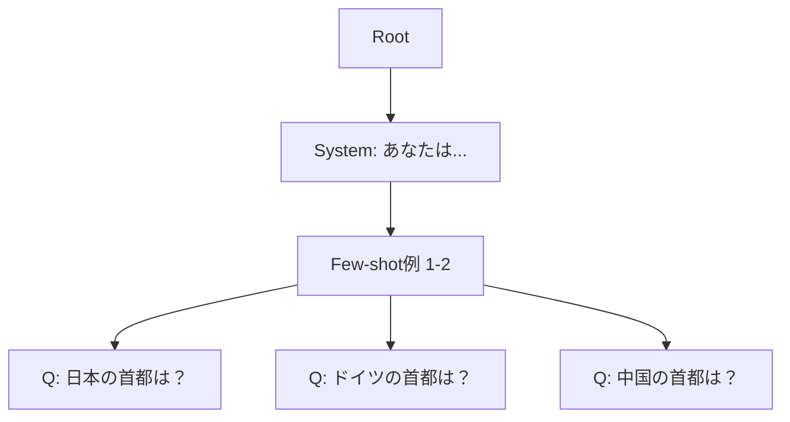

本記事は [Efficiently Programming Large Language Models using SGLang (arXiv:2312.07910)](https://arxiv.org/abs/2312.07910) の解説記事です。

## 論文概要（Abstract）

本論文は、LLMの呼び出しを効率的にプログラミングするためのフロントエンドDSL（SGLang言語）と、バックエンドのKVキャッシュ再利用最適化（**RadixAttention**）を提案している。RadixAttentionはRadix Tree（基数木）を用いて、リクエスト間で共有されるプレフィックス部分のKVキャッシュを自動的に検出・再利用する。著者らは、Few-shot QAワークロードでvLLM比最大5.1倍、マルチターン会話で1.1倍のスループット向上を報告している。

この記事は [Zenn記事: Ollama・vLLM・SGLang徹底比較 2026年版オンプレLLM推論エンジン選定ガイド](https://zenn.dev/0h_n0/articles/a0c2ba86fb5850) の深掘りです。

## 情報源

- **arXiv ID**: 2312.07910
- **URL**: [https://arxiv.org/abs/2312.07910](https://arxiv.org/abs/2312.07910)
- **著者**: Lianmin Zheng, Liangsheng Yin, Zhiqiang Xie, et al.（UC Berkeley）
- **発表年**: 2023
- **分野**: cs.CL, cs.AI

## 背景と動機（Background & Motivation）

LLMを用いた複雑なアプリケーション（マルチターン会話、RAG、Tree-of-Thought推論、構造化出力生成など）では、単一のAPI呼び出しでは完結せず、複数のLLM呼び出しを組み合わせたプログラムが必要になる。この際、以下の2つの問題が生じていた。

**プログラミングの非効率性**: 既存のLLMフレームワーク（LangChain、Guidance等）では、複雑な制御フロー（分岐、ループ、制約付き生成）の記述が冗長で、バッチ処理の最適化をユーザーが手動で行う必要があった。

**KVキャッシュの再利用不足**: マルチターン会話では同じシステムプロンプト、Few-shot学習では同じ例示文が繰り返し使用されるが、従来のサービングシステム（vLLM含む）ではリクエスト完了時にKVキャッシュを破棄していた。これにより、共有可能なプレフィックスの計算が毎回繰り返されていた。

著者らの分析によると、Few-shot QAタスクでは入力トークンの約90%がすべてのリクエストで共通しており、この冗長な計算を排除できれば大幅な高速化が見込める。

## 主要な貢献（Key Contributions）

- **SGLang言語**: LLMの呼び出し・分岐・ループ・構造化出力を宣言的に記述できるPython組み込みDSL
- **RadixAttention**: Radix Tree（LRU eviction付き）を用いたKVキャッシュの自動プレフィックス共有・再利用機構
- **Cache-Aware Scheduling**: KVキャッシュのヒット率を最大化するリクエストスケジューリング

## 技術的詳細（Technical Details）

### SGLangフロントエンド: プログラマブルLLM呼び出し

SGLangはPythonの関数デコレータとして実装されるDSLで、以下の基本プリミティブを提供する。

```python
import sglang as sgl

@sgl.function
def few_shot_qa(s, question: str):
    """Few-shot QA: 共有プレフィックスのKVキャッシュが自動再利用される"""
    # システムプロンプト（全リクエストで共通）
    s += sgl.system("あなたは正確な回答を心がけるアシスタントです。")

    # Few-shot例（全リクエストで共通 → RadixAttentionでキャッシュ再利用）
    s += sgl.user("日本の首都は？")
    s += sgl.assistant("東京です。")
    s += sgl.user("フランスの首都は？")
    s += sgl.assistant("パリです。")

    # 実際の質問（リクエストごとに異なる）
    s += sgl.user(question)
    s += sgl.assistant(sgl.gen("answer", max_tokens=256))
```

SGLangの言語プリミティブには以下がある。

| プリミティブ | 機能 | 用途 |
|------------|------|------|
| `sgl.gen()` | テキスト生成 | 回答生成、コード生成 |
| `sgl.select()` | 選択肢から選択 | 分類、Yes/No判定 |
| `sgl.fork()` | 並列分岐 | Tree-of-Thought、並列生成 |
| `sgl.image()` | 画像入力 | マルチモーダル推論 |
| `sgl.regex()` | 正規表現制約 | 構造化出力（JSON等） |

### RadixAttention: KVキャッシュのプレフィックス再利用

RadixAttentionの核心は、KVキャッシュの管理にRadix Tree（基数木、別名Patricia Trie）を使用する点にある。

**Radix Tree**: トークン列をキーとし、対応するKVキャッシュブロックへの参照を値とする木構造。共通プレフィックスを持つ複数のキーが木のノードを共有するため、メモリ効率が高い。



上図において、「System prompt + Few-shot例」のKVキャッシュは一度計算されれば、後続の全リクエストで再利用される。各リクエストは「質問」部分のみを新規に計算すればよい。

**プレフィックスマッチングアルゴリズム**:

新規リクエスト到着時、RadixAttentionは以下のステップでKVキャッシュの再利用を判定する。

$$
\text{match\_length} = \text{LCP}(T_{\text{new}}, T_{\text{cached}})
$$

ここで、
- $T_{\text{new}}$: 新規リクエストのトークン列
- $T_{\text{cached}}$: Radix Tree内に存在するトークン列
- $\text{LCP}$: 最長共通プレフィックス（Longest Common Prefix）

マッチした長さ分のKVキャッシュは再計算不要となり、残りの部分のみプリフィル処理が実行される。

```python
from typing import Optional

class RadixTreeNode:
    """Radix Treeのノード"""

    def __init__(self):
        self.children: dict[int, "RadixTreeNode"] = {}  # token_id -> child
        self.kv_cache_ref: Optional[int] = None  # 物理ブロック参照
        self.token_ids: list[int] = []  # このノードが保持するトークン列
        self.ref_count: int = 0  # 参照カウント（LRU eviction用）
        self.last_access_time: float = 0.0


class RadixAttentionCache:
    """RadixAttentionのKVキャッシュ管理"""

    def __init__(self, max_cache_blocks: int):
        self.root = RadixTreeNode()
        self.max_cache_blocks = max_cache_blocks
        self.used_blocks = 0

    def match_prefix(self, token_ids: list[int]) -> int:
        """新規トークン列のプレフィックスマッチ

        Args:
            token_ids: 新規リクエストのトークン列

        Returns:
            マッチしたトークン数（この分のKVキャッシュは再利用可能）
        """
        node = self.root
        matched = 0

        for token_id in token_ids:
            if token_id in node.children:
                child = node.children[token_id]
                # ノード内のトークン列との比較
                node_tokens = child.token_ids
                for i, t in enumerate(node_tokens):
                    if matched + i >= len(token_ids):
                        break
                    if token_ids[matched + i] != t:
                        break
                    matched += 1
                else:
                    matched += len(node_tokens)
                node = child
            else:
                break

        return matched

    def insert(self, token_ids: list[int], kv_blocks: list[int]) -> None:
        """トークン列とKVキャッシュブロックをRadix Treeに挿入"""
        node = self.root
        pos = 0

        # 既存ノードとのプレフィックスマッチ
        matched = self.match_prefix(token_ids)
        pos = matched

        # 新規部分をノードとして挿入
        if pos < len(token_ids):
            new_node = RadixTreeNode()
            new_node.token_ids = token_ids[pos:]
            new_node.kv_cache_ref = kv_blocks[pos // 16]  # ブロック単位
            node.children[token_ids[pos]] = new_node
```

### Cache-Aware Scheduling

RadixAttentionの効果を最大化するため、SGLangはKVキャッシュのヒット率を考慮したスケジューリングを行う。

リクエストキュー内の各リクエストに対し、Radix Treeとのプレフィックスマッチ長を計算し、マッチ長が長いリクエストを優先的にスケジュールする。これにより、キャッシュにすでに存在するプレフィックスを持つリクエストが先に処理され、キャッシュヒット率が向上する。

著者らは、この戦略がFirst-Come-First-Served（FCFS）スケジューリングと比較して、Few-shotワークロードで約30%のスループット向上をもたらすと報告している（論文Section 5.2より）。

## 実装のポイント（Implementation）

### LRU Evictionポリシー

Radix TreeのKVキャッシュは無限に保持できないため、GPUメモリが不足した場合にLRU（Least Recently Used）方式でevictionが行われる。

- **参照カウント**: 各ノードは参照カウントを保持し、アクティブなリクエストが参照中のノードはeviction対象から除外される
- **アクセス時刻**: 参照カウントが0のノードのうち、最も古いアクセス時刻のノードから削除される
- **EvictionはKVキャッシュブロック単位**: ノード削除時に対応するKVキャッシュブロックが解放される

### RadixAttentionが有効なワークロードの判別

RadixAttentionの効果はプレフィックス共有率に強く依存する。

| ワークロード | プレフィックス共有率 | 期待効果 |
|------------|-------------------|---------|
| Few-shot QA（固定例示） | 90%以上 | 最大5倍 |
| マルチターン会話（共通system prompt） | 10-30% | 1.1-1.5倍 |
| RAG（共通ドキュメントプール） | 30-70% | 2-3倍 |
| Tree-of-Thought推論 | 50-80% | 3-4倍 |
| 完全ユニークプロンプト | 0% | 効果なし |

### vLLMとの実装上の違い

SGLangとvLLMの主要な実装差異を整理する。

| 項目 | vLLM (PagedAttention) | SGLang (RadixAttention) |
|------|---------------------|----------------------|
| KVキャッシュ管理 | ブロックテーブル（1次元） | Radix Tree（木構造） |
| リクエスト間共有 | なし（各リクエスト独立） | 自動プレフィックス共有 |
| キャッシュEviction | リクエスト完了時に即時解放 | LRU方式で遅延解放 |
| スケジューリング | FCFS | Cache-Aware |
| メモリオーバーヘッド | ブロックテーブルのみ | Radix Tree + メタデータ |

## Production Deployment Guide

### AWS実装パターン（コスト最適化重視）

SGLangサーバをAWSにデプロイする場合の構成。RadixAttentionの効果を最大化するため、プレフィックス共有が多いワークロードでは特にGPUメモリが重要となる。

| 規模 | 月間リクエスト | 推奨構成 | 月額コスト | 主要サービス |
|------|--------------|---------|-----------|------------|
| **Small** | ~3,000 (100/日) | Serverless | $50-150 | Lambda + Bedrock + DynamoDB |
| **Medium** | ~30,000 (1,000/日) | Hybrid | $500-1,200 | ECS Fargate(GPU) + ElastiCache |
| **Large** | 300,000+ (10,000/日) | Container | $3,000-8,000 | EKS + Karpenter + GPU Spot |

**Medium構成の詳細** (月額$500-1,200):
- **ECS Fargate**: SGLangコンテナ、g5.xlarge（24GB VRAM）× 1 ($400/月)
- **ElastiCache Redis**: cache.t3.micro、セッション管理 ($15/月)
- **ALB**: ヘルスチェック + ルーティング ($20/月)
- **CloudWatch**: メトリクス収集 ($10/月)

RadixAttentionのキャッシュ効果を最大化するため、同一system promptを使うリクエストを同一サーバに**Sticky Session**でルーティングすることが重要。

**コスト試算の注意事項**: 上記は2026年3月時点のAWS ap-northeast-1（東京）リージョン料金に基づく概算値です。最新料金は [AWS料金計算ツール](https://calculator.aws/) で確認してください。

### Terraformインフラコード

**Small構成 (Serverless)**

```hcl
module "vpc" {
  source  = "terraform-aws-modules/vpc/aws"
  version = "~> 5.0"

  name = "sglang-vpc"
  cidr = "10.0.0.0/16"
  azs  = ["ap-northeast-1a", "ap-northeast-1c"]
  private_subnets = ["10.0.1.0/24", "10.0.2.0/24"]
  enable_nat_gateway   = false
  enable_dns_hostnames = true
}

resource "aws_iam_role" "lambda_role" {
  name = "sglang-lambda-role"
  assume_role_policy = jsonencode({
    Version = "2012-10-17"
    Statement = [{
      Action    = "sts:AssumeRole"
      Effect    = "Allow"
      Principal = { Service = "lambda.amazonaws.com" }
    }]
  })
}

resource "aws_lambda_function" "sglang_handler" {
  filename      = "lambda.zip"
  function_name = "sglang-bedrock-handler"
  role          = aws_iam_role.lambda_role.arn
  handler       = "index.handler"
  runtime       = "python3.12"
  timeout       = 60
  memory_size   = 1024
  environment {
    variables = {
      BEDROCK_MODEL_ID = "anthropic.claude-3-5-haiku-20241022-v1:0"
      CACHE_TABLE      = aws_dynamodb_table.cache.name
    }
  }
}

resource "aws_dynamodb_table" "cache" {
  name         = "sglang-prefix-cache"
  billing_mode = "PAY_PER_REQUEST"
  hash_key     = "prefix_hash"
  attribute {
    name = "prefix_hash"
    type = "S"
  }
  ttl {
    attribute_name = "expire_at"
    enabled        = true
  }
}
```

**Large構成 (Container): EKS + Sticky Session**

```hcl
module "eks" {
  source  = "terraform-aws-modules/eks/aws"
  version = "~> 20.0"

  cluster_name    = "sglang-inference"
  cluster_version = "1.31"
  vpc_id          = module.vpc.vpc_id
  subnet_ids      = module.vpc.private_subnets
  cluster_endpoint_public_access = true
  enable_cluster_creator_admin_permissions = true
}

resource "kubectl_manifest" "karpenter_nodepool" {
  yaml_body = <<-YAML
    apiVersion: karpenter.sh/v1
    kind: NodePool
    metadata:
      name: sglang-gpu-spot
    spec:
      template:
        spec:
          requirements:
            - key: karpenter.sh/capacity-type
              operator: In
              values: ["spot"]
            - key: node.kubernetes.io/instance-type
              operator: In
              values: ["g5.xlarge", "g5.2xlarge"]
          limits:
            cpu: "32"
            memory: "128Gi"
            nvidia.com/gpu: "4"
      disruption:
        consolidationPolicy: WhenEmptyOrUnderutilized
        consolidateAfter: 60s
  YAML
}

# RadixAttention効果最大化: Sticky Sessionでキャッシュヒット率向上
resource "kubectl_manifest" "sglang_ingress" {
  yaml_body = <<-YAML
    apiVersion: networking.k8s.io/v1
    kind: Ingress
    metadata:
      name: sglang-ingress
      annotations:
        alb.ingress.kubernetes.io/target-group-attributes: stickiness.enabled=true,stickiness.lb_cookie.duration_seconds=3600
    spec:
      rules:
        - host: sglang.example.com
          http:
            paths:
              - path: /v1
                pathType: Prefix
                backend:
                  service:
                    name: sglang-service
                    port:
                      number: 30000
  YAML
}
```

### 運用・監視設定

```python
import boto3

cloudwatch = boto3.client('cloudwatch')

# RadixAttention キャッシュヒット率監視
cloudwatch.put_metric_alarm(
    AlarmName='sglang-cache-hit-rate-low',
    ComparisonOperator='LessThanThreshold',
    EvaluationPeriods=3,
    MetricName='RadixCacheHitRate',
    Namespace='Custom/SGLang',
    Period=300,
    Statistic='Average',
    Threshold=50.0,
    AlarmDescription='SGLang RadixAttentionキャッシュヒット率50%未満',
    AlarmActions=['arn:aws:sns:ap-northeast-1:123456789:sglang-alerts'],
)
```

### コスト最適化チェックリスト

- [ ] ~100 req/日 → Lambda + Bedrock (Serverless) - $50-150/月
- [ ] ~1000 req/日 → ECS Fargate GPU - $500-1,200/月
- [ ] 10000+ req/日 → EKS + Spot Instances - $3,000-8,000/月
- [ ] Sticky Session有効化（RadixAttentionキャッシュヒット率向上）
- [ ] EC2 Spot Instances優先（最大70%削減）
- [ ] EKS: Karpenterでアイドルタイム自動スケールダウン
- [ ] Bedrock Batch API: 50%割引（非リアルタイム処理）
- [ ] Prompt Caching: 30-90%削減（システムプロンプト固定）
- [ ] max_tokens設定で過剰生成防止
- [ ] AWS Budgets: 月額予算設定（80%で警告）
- [ ] CloudWatch: キャッシュヒット率、スループット監視
- [ ] Cost Anomaly Detection: 自動異常検知
- [ ] 日次コストレポート: SNS/Slackへ自動送信
- [ ] タグ戦略: 環境別・プロジェクト別でコスト可視化
- [ ] S3ライフサイクル: モデルスナップショット自動削除
- [ ] 開発環境: 夜間スケールダウン
- [ ] GPUメモリ: 24GB以上でRadixAttentionキャッシュ容量確保
- [ ] system promptの統一: キャッシュ再利用率最大化
- [ ] Few-shotプロンプトの標準化: プレフィックス共有率向上
- [ ] バッチリクエストの並べ替え: 共通プレフィックスのリクエストをまとめる

## 実験結果（Results）

著者らは、LLaMA-7B、LLaMA-70B、Mistral-7Bの各モデルで、A10G/A100 GPUを用いてベンチマークを実施している。

**主要な結果**（論文Figure 7、Table 1より）:

| ワークロード | モデル | vLLM比スループット | 理由 |
|------------|--------|------------------|------|
| Few-shot QA | LLaMA-7B | **5.1倍** | プレフィックス共有率90%以上 |
| Tree-of-Thought | LLaMA-7B | **3.5倍** | 分岐構造でのキャッシュ共有 |
| JSON decode | Mistral-7B | **10倍以上** | 構造化出力の効率的生成 |
| Chatbot | LLaMA-7B | **1.1倍** | プレフィックス共有率が低い |
| Tool use | LLaMA-70B | **1.67倍** | 中程度のプレフィックス共有 |

特にFew-shot QAワークロードでは、入力の約90%が共通プレフィックス（system prompt + 例示文）であるため、RadixAttentionによるKVキャッシュ再利用の効果が顕著であったと報告されている。

一方、Chatbotワークロードでは共通プレフィックスがシステムプロンプトのみ（全体の10-30%）のため、スループット向上は1.1倍にとどまっている。

## 実運用への応用（Practical Applications）

Zenn記事で述べられているように、SGLangは**マルチターン会話や共有プレフィックスが多いワークロード**で特に強みを発揮する。

**具体的な適用場面**:

1. **RAGパイプライン**: 同一ドキュメントプールを参照する複数クエリで、検索結果のプレフィックスが共有される場面
2. **Few-shot分類サービス**: 固定の例示文を用いた分類APIで、例示部分のKVキャッシュが全リクエストで共有される
3. **マルチエージェントシステム**: 複数のエージェントが同一コンテキストから分岐する場面（Tree-of-Thought等）

**制約と注意点**:

- プロンプトが毎回完全に異なるバッチ処理では、RadixAttentionの恩恵はほぼゼロ。この場合はvLLMのPagedAttentionで十分
- Radix Treeのメモリオーバーヘッドは、キャッシュエントリ数に比例して増加する
- 2026年3月時点で、SGLangはvLLMと比べてエコシステムの成熟度が発展途上であり、ドキュメントや事例が限られている

## 関連研究（Related Work）

- **PagedAttention (Kwon et al., SOSP 2023)**: vLLMの中核アルゴリズム。KVキャッシュのメモリ管理をページング方式で効率化したが、リクエスト間のプレフィックス共有は行わない。RadixAttentionはPagedAttentionの上にプレフィックス共有レイヤーを追加したものと位置づけられる
- **Orca (Yu et al., OSDI 2022)**: Continuous Batchingの原典。SGLangもこのスケジューリング方式を基盤としている
- **Prompt Cache (Gim et al., 2023)**: プロンプトのKVキャッシュを事前計算・保存する手法。RadixAttentionは実行時に動的にキャッシュを管理する点で異なる

## まとめと今後の展望

SGLangは、LLMプログラミングのフロントエンド（DSL）とバックエンド（RadixAttention）の両面で革新を提案している。特にRadixAttentionは、プレフィックス共有が多いワークロードにおいて大幅なスループット向上をもたらし、Zenn記事で紹介されているH100でのvLLM比29%高速化の一因となっている。

2026年時点では、vLLMもAutomatic Prefix Caching機能を実装しており、両者の機能的な差は縮まりつつある。ただし、SGLangのRadix Treeベースの管理はよりきめ細かいキャッシュ制御を可能にしており、Cache-Aware Schedulingとの組み合わせでプレフィックス共有が多いワークロードでは依然として優位性を持っている。

## 参考文献

- **arXiv**: [https://arxiv.org/abs/2312.07910](https://arxiv.org/abs/2312.07910)
- **Code**: [https://github.com/sgl-project/sglang](https://github.com/sgl-project/sglang)
- **Related Zenn article**: [https://zenn.dev/0h_n0/articles/a0c2ba86fb5850](https://zenn.dev/0h_n0/articles/a0c2ba86fb5850)

---

*本記事はAI（Claude Code）により自動生成されました。論文の内容を正確に伝えることを目指していますが、詳細は原論文をご参照ください。*
