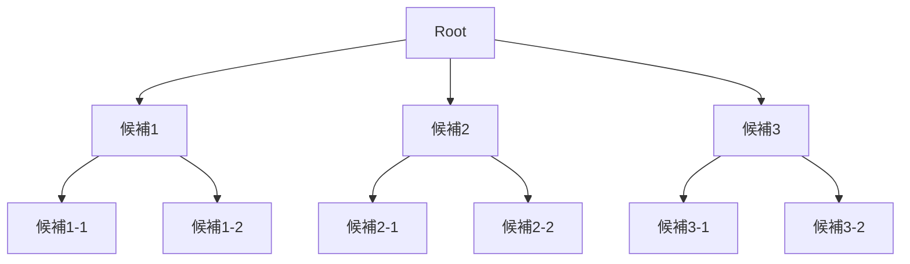
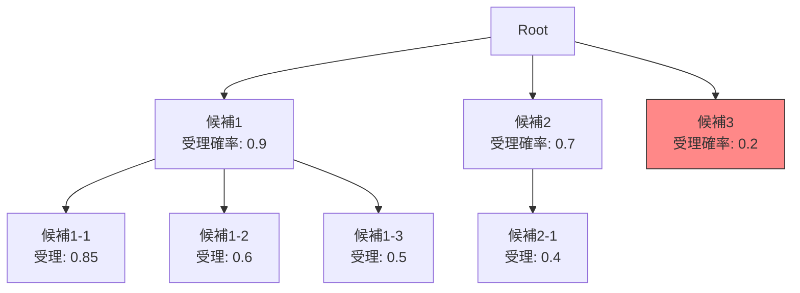

本記事は [EAGLE-2: Faster Inference of Language Models with Dynamic Draft Trees (arXiv:2406.14066)](https://arxiv.org/abs/2406.14066) の解説記事です。

## 論文概要（Abstract）

本論文は、Speculative Decodingの改良手法**EAGLE-2**を提案している。先行手法EAGLE-1（1層のAutoregressive Headをドラフトとして使用）の固定ドラフトツリー構造を改善し、**コンテキスト適応型の動的ドラフトツリー**を導入している。各ドラフトトークンの受理確率をオンラインで推定し、受理されにくいノードの展開を早期停止することで効率を向上させる。著者らは、EAGLE-1比で約20%の追加高速化、自己回帰デコーディング比で最大4.26倍のスピードアップを報告している。出力分布はターゲットモデルと同一（lossless）であることが保証される。

この記事は [Zenn記事: Ollama・vLLM・SGLang徹底比較 2026年版オンプレLLM推論エンジン選定ガイド](https://zenn.dev/0h_n0/articles/a0c2ba86fb5850) の深掘りです。

## 情報源

- **arXiv ID**: 2406.14066
- **URL**: [https://arxiv.org/abs/2406.14066](https://arxiv.org/abs/2406.14066)
- **著者**: Yuhui Li, Fangyun Wei, Chao Zhang, Hongyang Zhang（Peking University, Microsoft Research）
- **発表年**: 2024（ICML 2024採択）
- **分野**: cs.CL, cs.LG

## 背景と動機（Background & Motivation）

Speculative Decoding（Leviathan et al., 2022）は「ドラフト生成 → 並列検証」のパイプラインでLLM推論を高速化するが、元の手法では**線形チェーン**（K個のトークンを直列に先読み）のみを扱う。EAGLE-1はこれを**ツリー構造**に拡張し、1つの位置から複数の候補トークンを分岐させることで、1ラウンドあたりのトークン候補数を増やした。

しかし、EAGLE-1のドラフトツリーは**固定構造**（事前に決めた分岐パターン）であり、以下の問題があった。

1. **すべてのコンテキストで同じツリー構造**: 受理確率が高いコンテキスト（例: 構文的に予測しやすい部分）でも低いコンテキスト（例: 自由文生成）でも同じ分岐数を使用
2. **不要なドラフトの計算**: 受理される見込みが低いノードにも計算資源が割り当てられる
3. **ツリー構造のハイパーパラメータ調整**: 最適な分岐パターンをタスクごとに探索する必要がある

### EAGLE-2の着想

「ドラフトトークンの受理確率をオンラインで推定できれば、受理されにくいノードの展開を打ち切り、計算資源を有望なノードに集中できる」

## 主要な貢献（Key Contributions）

- **動的ドラフトツリー**: コンテキストに応じてドラフトツリーの形状を適応的に変化させる機構
- **受理確率のオンライン推定**: ドラフトヘッドの出力確率に基づき、各ノードの受理確率を高速に推定
- **ドラフト予算の最適配分**: 固定の計算予算内で、受理期待値が最大となるようにツリーを構築

## 技術的詳細（Technical Details）

### EAGLEドラフトヘッドのアーキテクチャ

EAGLE（EAGLE-1/2共通）のドラフトは、ターゲットモデルに1層のAutoregressive Headを追加する構造である。

$$
h_{\text{draft}}^{(t+1)} = \text{Transformer\_Layer}(h_{\text{target}}^{(t)}, e(x_t))
$$

$$
p_{\text{draft}}(x_{t+1}) = \text{softmax}(\text{LM\_Head}(h_{\text{draft}}^{(t+1)}))
$$

ここで、
- $h_{\text{target}}^{(t)}$: ターゲットモデルの最終層の隠れ状態
- $e(x_t)$: トークン$x_t$のembedding
- $\text{Transformer\_Layer}$: 1層のTransformer（パラメータ数はターゲットの1〜2%）
- $\text{LM\_Head}$: ターゲットモデルと共有（追加パラメータなし）

**ドラフトヘッドの学習**: ターゲットモデルのフォワードパス時に得られる隠れ状態$h_{\text{target}}^{(t)}$を入力として、次トークンの予測を学習する。ターゲットモデルの重みは固定（frozen）。

### 固定ツリー vs 動的ツリー

**EAGLE-1（固定ツリー）**:



固定ツリーでは、各深さで同じ分岐数を使用する。受理率が低いノード（例: 候補3-1、3-2）にも計算資源が使われる。

**EAGLE-2（動的ツリー）**:



動的ツリーでは、受理確率が低いノード（候補3: 0.2）の展開を打ち切り、受理確率が高いノード（候補1: 0.9）により多くの分岐を割り当てる。

### 受理確率のオンライン推定

各ドラフトトークン$\tilde{x}$の受理確率は、ドラフト分布$q$とターゲット分布$p$の関係で決まる。

$$
\Pr[\text{accept } \tilde{x}] = \min\left(1, \frac{p(\tilde{x})}{q(\tilde{x})}\right)
$$

ターゲット分布$p$は検証前には不明だが、著者らは以下の近似を提案している。

**近似**: ドラフトヘッドの出力確率$q(\tilde{x})$が高いトークンは、ターゲットモデルでも高い確率を持つ傾向がある。そこで、ドラフトの**Top-1確率（confidence score）**を受理確率の代理指標として使用する。

$$
\hat{\alpha}(\tilde{x}) \approx f(q(\tilde{x}))
$$

ここで$f$はドラフトconfidenceから受理確率への単調増加マッピング。著者らの実験（論文Section 4.2より）では、この近似が実際の受理確率と高い相関（Spearman $\rho > 0.85$）を示すことを確認している。

### 動的ツリー構築アルゴリズム

固定の計算予算（ドラフトフォワードパス数の上限$B$）内で、受理トークン数の期待値を最大化するツリーを構築する。

```python
import heapq
from dataclasses import dataclass, field

@dataclass(order=True)
class TreeNode:
    """ドラフトツリーのノード（優先度付きキュー用）"""
    priority: float  # 受理確率の負値（heapqはmin-heap）
    token_id: int = field(compare=False)
    depth: int = field(compare=False)
    parent_acceptance: float = field(compare=False)  # 親までの累積受理確率


def build_dynamic_draft_tree(
    draft_head: "EAGLEHead",
    hidden_state: "torch.Tensor",
    budget: int = 60,
    max_depth: int = 6,
    top_k: int = 10,
) -> list[TreeNode]:
    """動的ドラフトツリーの構築

    Args:
        draft_head: EAGLEドラフトヘッド
        hidden_state: ターゲットモデルの隠れ状態
        budget: 最大ドラフトフォワードパス数
        max_depth: ツリーの最大深さ
        top_k: 各ノードの展開候補数

    Returns:
        構築されたドラフトツリーのノード一覧
    """
    tree_nodes: list[TreeNode] = []
    # 優先度キュー: 受理確率が高いノードを優先展開
    pq: list[TreeNode] = []

    # Root: ドラフトヘッドの初回推論
    logits = draft_head.forward(hidden_state)
    probs = logits.softmax(dim=-1)
    top_k_probs, top_k_ids = probs.topk(top_k)

    for i in range(top_k):
        confidence = top_k_probs[i].item()
        node = TreeNode(
            priority=-confidence,  # heapq用（大きい方が優先）
            token_id=top_k_ids[i].item(),
            depth=1,
            parent_acceptance=1.0,
        )
        heapq.heappush(pq, node)

    # 予算内でツリーを展開
    used_budget = 0
    while pq and used_budget < budget:
        node = heapq.heappop(pq)
        acceptance = -node.priority * node.parent_acceptance

        # 受理確率が低すぎるノードは打ち切り
        if acceptance < 0.1:
            continue

        tree_nodes.append(node)
        used_budget += 1

        # 子ノードの展開（深さ制限内）
        if node.depth < max_depth:
            child_logits = draft_head.forward_with_token(node.token_id)
            child_probs = child_logits.softmax(dim=-1)
            child_top_k_probs, child_top_k_ids = child_probs.topk(min(top_k, 5))

            for j in range(len(child_top_k_ids)):
                child_confidence = child_top_k_probs[j].item()
                child_node = TreeNode(
                    priority=-child_confidence,
                    token_id=child_top_k_ids[j].item(),
                    depth=node.depth + 1,
                    parent_acceptance=acceptance,
                )
                heapq.heappush(pq, child_node)

    return tree_nodes
```

**計算オーバーヘッド**: 著者らの実測（論文Section 5.3より）によると、動的ツリー構築のオーバーヘッドは1ms未満であり、推論全体のレイテンシに対して無視できるレベルであると報告されている。

## 実装のポイント（Implementation）

### ドラフトヘッドの学習

EAGLEドラフトヘッドは、ターゲットモデルの推論時に得られる隠れ状態を使って学習する。

```python
# ドラフトヘッドの学習ループ（簡略版）
import torch
import torch.nn as nn


class EAGLEHead(nn.Module):
    """EAGLE Autoregressive Draft Head"""

    def __init__(self, hidden_dim: int, vocab_size: int, num_heads: int = 8):
        super().__init__()
        self.fc_input = nn.Linear(hidden_dim * 2, hidden_dim)
        self.transformer_layer = nn.TransformerEncoderLayer(
            d_model=hidden_dim,
            nhead=num_heads,
            dim_feedforward=hidden_dim * 4,
            batch_first=True,
        )
        # LM Headはターゲットモデルと共有（パラメータ追加なし）
        self.lm_head: nn.Linear  # ターゲットから参照

    def forward(
        self,
        target_hidden: torch.Tensor,
        token_embedding: torch.Tensor,
    ) -> torch.Tensor:
        """ドラフトヘッドのフォワードパス

        Args:
            target_hidden: ターゲットの隠れ状態 (batch, seq_len, hidden_dim)
            token_embedding: トークンembedding (batch, seq_len, hidden_dim)

        Returns:
            logits: (batch, seq_len, vocab_size)
        """
        # ターゲット隠れ状態とembeddingを結合
        combined = torch.cat([target_hidden, token_embedding], dim=-1)
        h = self.fc_input(combined)
        h = self.transformer_layer(h)
        logits = self.lm_head(h)
        return logits
```

**学習コスト**: 著者らによると、ドラフトヘッドの学習はLLaMA-3-8Bで約2〜4時間（A100 1GPU）で完了する。ターゲットモデルの重みは固定（frozen）のため、フルファインチューニングと比較してコストは極めて低い。

### vLLM/SGLangとの統合

EAGLE-2はvLLMおよびSGLangに統合可能であり、公式リポジトリ（SafeAILab/EAGLE）で事前学習済みドラフトヘッド重みが公開されている。

```bash
# vLLMでEAGLE-2を有効にする例
vllm serve meta-llama/Llama-3.1-8B-Instruct \
    --speculative-model EAGLE/LLaMA3-Instruct-8B-EAGLE2 \
    --speculative-draft-tensor-parallel-size 1 \
    --num-speculative-tokens 5
```

### バッチサイズとの関係

EAGLE-2もSpeculative Decodingの共通限界として、大バッチサイズでは効果が薄まる。著者らの実験はバッチサイズ1を中心に報告されている。

| バッチサイズ | 期待速度向上 | 理由 |
|------------|------------|------|
| 1 | 3-4.3x | メモリバウンド、ドラフトコスト小 |
| 4 | 2-3x | 部分的にコンピューティングバウンド |
| 16+ | 1.2-1.5x | コンピューティングバウンド、ドラフトコスト大 |

## 実験結果（Results）

著者らはVicuna-7B、LLaMA3-8B-Instruct、LLaMA3-70B-Instruct、Qwen2-72B-Instructで、A100 80GB（1〜4GPU）を用いて評価している。

**主要な結果**（論文Table 1より）:

| モデル | ベンチマーク | 自己回帰比スピードアップ | EAGLE-1比 |
|--------|-----------|---------------------|---------|
| LLaMA3-8B-Instruct | MT-Bench | **3.05x** | +17% |
| LLaMA3-8B-Instruct | HumanEval | **4.26x** | +24% |
| LLaMA3-8B-Instruct | GSM8K | **3.65x** | +21% |
| LLaMA3-70B-Instruct | MT-Bench | **3.12x** | +15% |
| Qwen2-72B-Instruct | MT-Bench | **3.08x** | +18% |

特にHumanEval（コード生成）で最も高い速度向上（4.26倍）が得られている。コード生成はトークンの予測可能性が高く（構文制約が強い）、ドラフトの受理率が高くなるためと著者らは分析している。

**Lossless性の確認**: MT-Bench、HumanEval、GSM8Kのすべてのベンチマークにおいて、EAGLE-2の出力品質は自己回帰デコーディングと完全に一致することが確認されている（論文Section 5.1より）。

**動的ツリーの効果分析**（論文Table 3より）:
- 動的ツリーは固定ツリーと比較して、同じ計算予算でより多くのトークンが受理される
- 受理確率が高いコンテキストではツリーを深く展開し、低いコンテキストでは浅く保つことで、計算資源を効率的に配分

## 実運用への応用（Practical Applications）

Zenn記事で紹介されているvLLM 0.17のSpeculative Decoding機能は、EAGLEシリーズの統合により実用的な速度向上を提供している。

**具体的な適用場面**:

1. **コード生成API**: HumanEvalで4.26倍の高速化が報告されており、コードアシスタント系のサービスに適する
2. **チャットボット**: MT-Benchで3.05倍の高速化。ユーザー対話のレイテンシ改善に直結
3. **数学推論**: GSM8Kで3.65倍。数式を含む回答生成で効果的

**EAGLE-3への発展**: 2025年後半にはEAGLE-3が発表され、SGLangに統合されている。EAGLE-3はドラフトヘッドのアーキテクチャをさらに改良し、ターゲットモデルの中間層の隠れ状態を活用することで追加の高速化を実現している。

**制約と注意点**:

- ドラフトヘッドの学習が必要（モデルごとに2-4時間、A100 1GPU）
- 事前学習済みドラフトヘッド重みが公開されているモデルは限定的（LLaMA3、Vicuna、Qwen2等）
- カスタムファインチューニングしたモデルでは、ドラフトヘッドの再学習が必要

## 関連研究（Related Work）

- **Speculative Decoding (Leviathan et al., ICML 2023)**: 投機的デコーディングの原典。線形チェーンでのドラフト生成。EAGLE-2はこれをツリー構造かつ動的に拡張
- **Medusa (Cai et al., 2024)**: ターゲットモデルに複数の独立した予測ヘッドを追加。自己回帰的なドラフトヘッドではないため、トークン間の依存関係を捉えられない制約がある。EAGLE-2はAutoregressive Headにより依存関係を保持
- **SpecInfer (Miao et al., 2024)**: 複数の小さなドラフトモデルを並列に使用してツリーを構築。EAGLE-2は1つのドラフトヘッド（1〜2%のパラメータ追加）で同等以上の性能を実現

## まとめと今後の展望

EAGLE-2は、Speculative Decodingの実用性を大きく向上させた手法である。動的ドラフトツリーにより、コンテキストに応じた計算資源の最適配分を実現し、EAGLE-1比で約20%、自己回帰比で最大4.26倍のスピードアップを達成したと報告されている。

2026年時点では後継のEAGLE-3がSGLangに統合されるなど、EAGLEシリーズはSpeculative Decodingの主要な実装として広く採用されている。ドラフトヘッドの学習コストが低い（ターゲットの1〜2%パラメータ、2〜4時間で学習完了）ため、カスタムモデルへの適用も比較的容易である。

## 参考文献

- **arXiv**: [https://arxiv.org/abs/2406.14066](https://arxiv.org/abs/2406.14066)
- **Code**: [https://github.com/SafeAILab/EAGLE](https://github.com/SafeAILab/EAGLE)
- **Related: Speculative Decoding原典**: [https://arxiv.org/abs/2211.17192](https://arxiv.org/abs/2211.17192)
- **Related: Medusa**: [https://arxiv.org/abs/2401.07851](https://arxiv.org/abs/2401.07851)
- **Related Zenn article**: [https://zenn.dev/0h_n0/articles/a0c2ba86fb5850](https://zenn.dev/0h_n0/articles/a0c2ba86fb5850)

---

*本記事はAI（Claude Code）により自動生成されました。論文の内容を正確に伝えることを目指していますが、詳細は原論文をご参照ください。*
