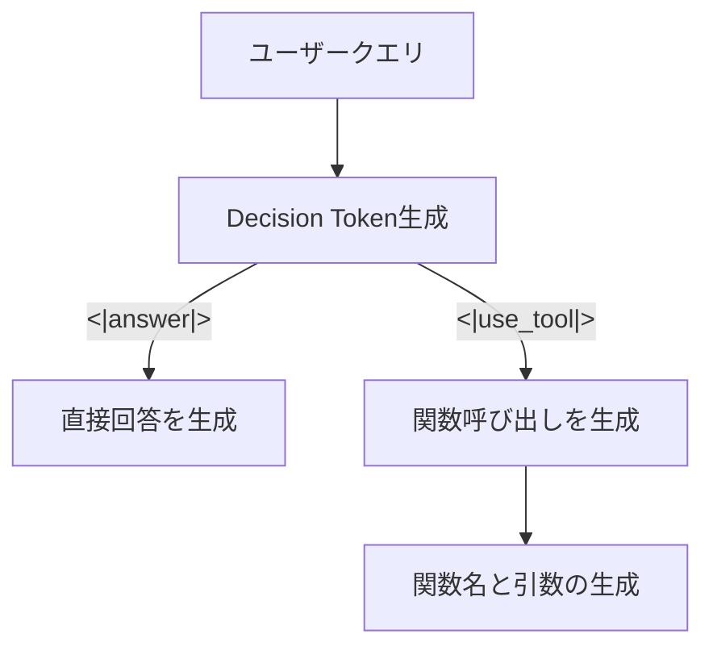

## 論文概要（Abstract）

本論文は、LLMのFunction Calling能力をゼロショットで強化するための複合的戦略を提案している。具体的には、（1）関数定義のプロンプトフォーマット戦略、（2）Function CallingデータとInstruction Followingデータのブレンド、（3）**Decision Token**と呼ばれる新規の条件分岐トークン、（4）Chain-of-Thought推論の適用、（5）多言語対応のための翻訳パイプラインの5つのアプローチを検証している。著者らの報告によると、Decision Tokenと合成データの組み合わせにより、関連性検出（Relevance Detection）が49.58%から65.42%へ改善された。

この記事は [Zenn記事: Anthropic Python SDKでClaude APIを実践活用する実装ガイド](https://zenn.dev/0h_n0/articles/f1f840e7205f2b) の深掘りです。

## 情報源

- **会議名**: NAACL 2025（Nations of the Americas Chapter of the Association for Computational Linguistics）
- **年**: 2025
- **URL**: [https://arxiv.org/abs/2412.01130](https://arxiv.org/abs/2412.01130)
- **著者**: Yi-Chang Chen, Po-Chun Hsu, Chan-Jan Hsu, Da-shan Shiu
- **ACL Anthology**: [https://aclanthology.org/2025.naacl-industry.9/](https://aclanthology.org/2025.naacl-industry.9/)

## カンファレンス情報

**NAACLについて**: NAACLはACL（Association for Computational Linguistics）の北米支部会議であり、自然言語処理分野の主要カンファレンスの一つである。Industry Trackは実用的な技術応用に焦点を当てたトラックであり、産業界での適用可能性が評価基準に含まれる。

## 技術的詳細（Technical Details）

### 問題設定

LLMのFunction Calling（ツール呼び出し）において、以下の3つの課題が存在する。

1. **関数選択の精度**: 多数の候補関数からの適切な選択
2. **関連性判定**: 関数呼び出しが必要かどうかの判断（Relevance Detection）
3. **多言語対応**: 英語以外の言語でのFunction Calling性能の低下

### ベースモデルと学習設定

著者らはBreeze-7B（Mistral-7Bの派生モデル）をベースモデルとして使用している。

**LoRAファインチューニング設定**:
- 学習率: $1 \times 10^{-4}$
- バッチサイズ: 48
- エポック数: 3
- LoRAランク $r$: 16
- LoRAスケーリング $\alpha$: 32

### アプローチ1: プロンプトフォーマット戦略

関数定義をプロンプトに統合する2つのフォーマットを検証している。

**方式A: 専用ロール（Dedicated Role）**

関数定義を独立したロールとして配置する方式。`<|functions|>`のような専用ロールトークンを使用する。

**方式B: システムロール埋め込み（System Role Embedding）**

関数定義をシステムプロンプト内に埋め込む方式。既存のシステムメッセージ構造を活用する。

**実験結果**（論文Table 1より）:

| フォーマット | AST Summary | Relevance Detection | MT-Bench |
|------------|-------------|---------------------|----------|
| 専用ロール | 85.25% | 49.58% | 5.57 |
| システムロール | 85.94% | 39.58% | 5.29 |

著者らの報告によると、専用ロール方式はRelevance Detectionで約10ptの優位性を示しているが、AST Summary（関数呼び出しの構文的正確性）ではほぼ同等である。

### アプローチ2: データブレンド

Function Calling専用データ（FC-110k）とInstruction Following データ（IF-110k）をブレンドする効果を検証している。

**使用データセット**:
- **FC-110k**: APIGen + glaive-function-calling-v2から110,000サンプル
- **IF-110k**: Open ORCAから110,000サンプル（Instruction Following用）
- **NF-1k**: 合成的な非Function Callデータ1,000サンプル

著者らの主要な知見として、Instruction FollowingデータはFunction Calling精度とRelevance Detection の**両方**を改善すると報告している。これは、汎用的な指示追従能力がFunction Callingの文脈理解に寄与するためと解釈されている。

### アプローチ3: Decision Token（本論文の核心的貢献）

Decision Tokenは、モデルが関数呼び出しの必要性を判断するための二値分類メカニズムである。



**実装**: 特殊トークン `<|answer|>` と `<|use_tool|>` をモデルの語彙に追加し、応答生成の最初のステップで二値分類を実行する。`<|use_tool|>` が選択された場合のみ関数呼び出しを生成し、`<|answer|>` が選択された場合はテキスト応答を直接生成する。

**実験結果**（論文Table 2より、合成データNF-1kとの組み合わせ）:

| 構成 | AST Summary | Relevance Detection |
|------|-------------|---------------------|
| ベースライン（専用ロール） | 85.25% | 49.58% |
| Decision Token + NF-1k（専用ロール） | 82.56% | **60.00%** |
| Decision Token + NF-1k（システムロール） | 83.44% | **65.42%** |

Decision Tokenの導入により、Relevance Detectionが49.58%から65.42%へ**+15.84pt**改善された（システムロール方式）。一方、AST Summaryは85.25%から83.44%へ微減（-1.81pt）しており、著者らはこのトレードオフを認めている。

### アプローチ4: Chain-of-Thought推論

Function Callingタスクへの推論ステップ追加の効果を検証している。

**結果**（論文より）: CoT推論を導入した場合のAST Summaryは84.44%であり、ベースライン（85.25%）からわずかに低下した。著者らは「BFCL（Berkeley Function-Calling Leaderboard）の問題はFunction Callingのために推論を必要としない可能性がある」と考察している。

### アプローチ5: 多言語翻訳パイプライン

英語以外の言語（特に繁体字中国語）でのFunction Calling対応のため、専用の翻訳パイプラインを提案している。

**データ構成**:
- **TC-19k**: 18,000件の繁体字中国語インスタンス + 200件の非Function Callデータ

**実験結果**（論文Table 3より）:

| 構成 | AST（専用ロール） | AST（システムロール） |
|------|------------------|---------------------|
| ベースライン | 52.37% | 50.81% |
| + TC-19k | **61.56%** | **58.56%** |
| 改善幅 | +9.19pt | +7.75pt |

著者らの報告によると、翻訳パイプラインにより繁体字中国語でのFunction Calling精度が約9pt改善された。

## 実装のポイント（Implementation）

### Decision Tokenの実装方法

Claude APIの`tool_choice`パラメータとの対比で理解する。

```python
# Claude APIでの関連性判定（tool_choiceによる制御）
message = client.messages.create(
    model="claude-sonnet-4-6",
    max_tokens=1024,
    tools=tools,
    tool_choice={"type": "auto"},  # Claudeが判断
    messages=[{"role": "user", "content": query}],
)

# 本論文のDecision Tokenアプローチ（概念的な実装）
class DecisionTokenModel:
    """Decision Tokenによる関数呼び出し判定モデル"""

    ANSWER_TOKEN = "<|answer|>"
    USE_TOOL_TOKEN = "<|use_tool|>"

    def generate(self, query: str, functions: list[dict]) -> str:
        """クエリに対して直接回答 or 関数呼び出しを判定

        Args:
            query: ユーザークエリ
            functions: 利用可能な関数定義リスト

        Returns:
            回答テキストまたは関数呼び出しJSON
        """
        prompt = self._format_prompt(query, functions)
        decision_token = self.model.generate_next_token(prompt)

        if decision_token == self.USE_TOOL_TOKEN:
            return self._generate_function_call(prompt)
        else:
            return self._generate_direct_answer(prompt)
```

### Zenn記事のTool Useとの関連

Zenn記事で紹介した`strict: true`オプションは、本論文のAST Summary（構文的正確性）の評価と直接関連する。`strict: true`はスキーマ準拠を保証するため、関数呼び出しの構文エラーを排除できる。一方、本論文のDecision Token は「そもそも関数呼び出しが必要かどうか」の判定に焦点を当てており、`tool_choice: auto`に対応する補完的な技術である。

## 実験結果（Results）

### ベンチマーク

評価には**Berkeley Function-Calling Leaderboard（BFCL）** が使用されている。BFCLは900のテストケースを含み、4つの複雑度レベルで構成される。

| レベル | 説明 |
|--------|------|
| Simple | 単一関数、必須引数のみ |
| Multiple | 複数候補からの関数選択 |
| Parallel | 複数関数の並列呼び出し |
| Parallel Multiple | 複数候補かつ並列呼び出し |

### 主要な知見（著者らの分析）

1. **Instruction FollowingデータがFunction Callingを改善する**: 汎用的な指示追従能力は関数呼び出しの文脈理解に寄与する
2. **Decision Tokenは Relevance Detectionに効果的**: +15.84ptの改善だが、AST精度とのトレードオフが存在する
3. **CoTはBFCLには不要**: Function Callingタスクの多くは推論ステップを必要としない
4. **多言語対応は翻訳パイプラインで実現可能**: 約9ptの改善を繁体字中国語で達成

## 実運用への応用（Practical Applications）

本論文の知見をClaude APIの実運用に適用する際のポイントを整理する。

1. **Relevance Detectionの重要性**: 関数呼び出しが不要なクエリでツールを誤って呼び出すと、レイテンシとコストが増加する。Claude APIの`tool_choice: auto`はこの判定を内部で行うが、精度を監視し必要に応じて`tool_choice: none`と`tool_choice: any`を使い分けるべきである

2. **プロンプトフォーマットの影響**: 関数定義の配置方法がFunction Calling精度に影響する。Claude APIではツール定義はAPIパラメータとして渡されるが、カスタムツールの説明文の品質が精度を左右する

3. **データブレンドの示唆**: ファインチューニングベースのアプローチにおいて、Function Calling専用データだけでなく汎用Instruction Followingデータの混合が有効。これはClaude APIのような事前学習済みモデルでは内部的に対応済みと考えられる

## 関連研究（Related Work）

- **Toolformer** (Schick et al., 2023): 自己教師ありでツール利用を学習。本論文はファインチューニングベースで関数呼び出しのフォーマットと判定に焦点を当てている
- **Gorilla** (Patil et al., 2023): APIドキュメントを活用したLLMファインチューニング。本論文はプロンプトフォーマットの体系的比較を提供
- **ToolBench** (Qin et al., 2024): 大規模ツール利用ベンチマーク。本論文はBFCLベンチマークを使用

## まとめ

本論文は、LLMのFunction Calling能力を強化するための5つのアプローチを体系的に比較検証した研究である。特にDecision Tokenは、関数呼び出しの必要性判定という実用上重要な課題に対するシンプルかつ効果的な解決策を提示している。Zenn記事で紹介したClaude APIの`tool_choice`パラメータは、この判定をAPI側で抽象化したものと位置づけられる。

## 参考文献

- **Conference URL**: [https://aclanthology.org/2025.naacl-industry.9/](https://aclanthology.org/2025.naacl-industry.9/)
- **arXiv**: [https://arxiv.org/abs/2412.01130](https://arxiv.org/abs/2412.01130)
- **BFCL Benchmark**: Berkeley Function-Calling Leaderboard
- **Related Paper**: Schick et al., "Toolformer," NeurIPS 2023
- **Related Zenn article**: [https://zenn.dev/0h_n0/articles/f1f840e7205f2b](https://zenn.dev/0h_n0/articles/f1f840e7205f2b)

---

:::message
この記事はAI（Claude Code）により自動生成されました。内容の正確性については情報源を基に検証していますが、最新情報は原論文をご確認ください。
:::
