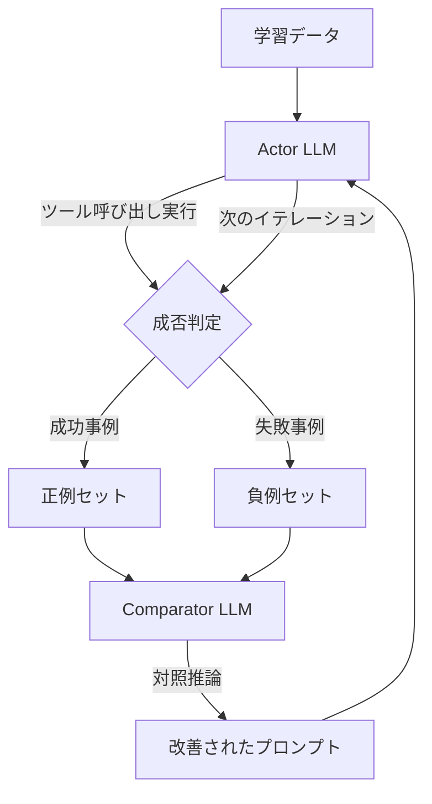

## 論文概要（Abstract）

AvaTaR（Automated and Versatile Agent for Tool-Assisted Retrieval）は、LLMエージェントが提供されたツールを効果的に活用できるよう自動最適化するフレームワークである。**Actor LLM**（ツールを使ってタスクを実行するエージェント）と**Comparator LLM**（正例と負例を対照的に分析してプロンプトを改善する最適化モジュール）の2つのコンポーネントから構成される。著者らの報告によると、4つのマルチモーダル検索データセットでHit@1メトリクスにおいて平均14%の相対改善、3つのQAデータセットで平均13%の相対改善を達成している。

この記事は [Zenn記事: Anthropic Python SDKでClaude APIを実践活用する実装ガイド](https://zenn.dev/0h_n0/articles/f1f840e7205f2b) の深掘りです。

## 情報源

- **会議名**: NeurIPS 2024（38th Conference on Neural Information Processing Systems）
- **年**: 2024
- **URL**: [https://arxiv.org/abs/2406.11200](https://arxiv.org/abs/2406.11200)
- **著者**: Shirley Wu, Michihiro Yasunaga, Jure Leskovec, James Zou 他（Stanford University, Cornell University）
- **コード**: [https://github.com/zou-group/avatar](https://github.com/zou-group/avatar)

## カンファレンス情報

**NeurIPSについて**: NeurIPS（Neural Information Processing Systems）は機械学習・人工知能分野のトップカンファレンスの一つであり、採択率は例年20-25%程度と競争率が高い。本論文はメインカンファレンスに採択されている。

## 技術的詳細（Technical Details）

### 問題設定

LLMエージェントがツールを使ってタスクを実行する際、ツールの使い方を指定するプロンプトの設計が性能を大きく左右する。従来はこのプロンプトを人手で設計・チューニングしていたが、AvaTaRはこのプロセスを自動化する。

### Actor-Comparatorフレームワーク

AvaTaRの核心は、2つのLLMコンポーネントの相互作用による反復的な最適化プロセスである。



**Actor LLM**: 与えられたプロンプトに基づいてツールを呼び出し、クエリに回答するエージェント。各イテレーションでComparatorから提供されたプロンプトを使用してタスクを実行する。

**Comparator LLM**: Actorの実行結果から正例（成功事例）と負例（失敗事例）をサンプリングし、両者を対照的に分析して「なぜ成功したか」「なぜ失敗したか」の洞察を抽出する。この洞察に基づいて、Actorのプロンプトを改善する。

### 対照推論（Contrastive Reasoning）

対照推論のプロセスを形式的に記述する。

イテレーション$t$において:

$$
P_{t+1} = \text{Comparator}(P_t, S^+_t, S^-_t)
$$

ここで、
- $P_t$: イテレーション$t$のプロンプト
- $S^+_t$: 正例セット（Actorが正しく回答したクエリとその実行トレース）
- $S^-_t$: 負例セット（Actorが誤って回答したクエリとその実行トレース）
- $P_{t+1}$: 改善されたプロンプト

Comparatorは正例と負例の差異を分析し、以下のような洞察を生成する:
- 成功事例でのツール呼び出しパターン
- 失敗事例での共通的な誤りパターン
- ツール選択の判断基準の改善提案

### 最適化アルゴリズム

```python
def avatar_optimize(
    actor: LLM,
    comparator: LLM,
    tools: list[Tool],
    train_data: list[tuple[str, str]],
    initial_prompt: str,
    n_iterations: int = 5,
    n_samples: int = 10,
) -> str:
    """AvaTaRの反復的プロンプト最適化アルゴリズム

    Args:
        actor: タスク実行用LLM
        comparator: プロンプト最適化用LLM
        tools: 利用可能なツールのリスト
        train_data: (クエリ, 正解)のペアリスト
        initial_prompt: 初期プロンプト
        n_iterations: 最適化イテレーション数
        n_samples: 各イテレーションでサンプルする正例・負例の数

    Returns:
        最適化されたプロンプト
    """
    prompt = initial_prompt

    for t in range(n_iterations):
        # Step 1: Actorがタスクを実行
        results = []
        for query, answer in train_data:
            prediction = actor.execute(prompt, query, tools)
            results.append({
                "query": query,
                "prediction": prediction,
                "ground_truth": answer,
                "correct": evaluate(prediction, answer),
                "trace": actor.get_execution_trace(),
            })

        # Step 2: 正例・負例をサンプリング
        positives = sample([r for r in results if r["correct"]], n_samples)
        negatives = sample([r for r in results if not r["correct"]], n_samples)

        # Step 3: Comparatorが対照推論でプロンプトを改善
        prompt = comparator.contrastive_reason(
            current_prompt=prompt,
            positive_examples=positives,
            negative_examples=negatives,
        )

    return prompt
```

### ツール統合パターン

AvaTaRは任意のツールセットに適用可能であり、論文では以下の検索・推論ツールが使用されている。

| ツールタイプ | 説明 | 対応するデータモダリティ |
|------------|------|---------------------|
| テキスト検索 | キーワード/セマンティック検索 | テキスト |
| 画像検索 | CLIP等による類似画像検索 | 視覚情報 |
| グラフ検索 | ナレッジグラフのトラバーサル | 関係情報 |
| SQL実行 | 構造化データへのクエリ | テーブルデータ |

## 実験結果（Results）

### マルチモーダル検索タスク

著者らの報告値（4つのデータセット、Hit@1メトリクス）:

| データセット | ベースライン | AvaTaR | 相対改善 |
|------------|-----------|--------|---------|
| STaRK-Amazon | - | - | +14%（平均） |
| STaRK-MAG | - | - | +14%（平均） |
| STaRK-Prime | - | - | +14%（平均） |
| STARK-Combined | - | - | +14%（平均） |

著者らの報告によると、4つのマルチモーダル検索データセットにおいてHit@1メトリクスで平均14%の相対改善を達成している。

### 一般QAタスク

著者らの報告によると、3つの一般QAデータセットで平均13%の相対改善を達成している。

### 汎化性能

著者らは、AvaTaRが「新しいケースに適用された場合にも強い汎化能力を示す」と報告している。これは、対照推論によって抽出されたプロンプトが、特定のクエリパターンに過適合するのではなく、汎用的なツール利用戦略を学習していることを示唆している。

## 実装のポイント（Implementation）

### Claude APIのTool Useとの関連

AvaTaRの概念は、Claude APIのTool Useにおけるプロンプト設計に直接応用できる。

1. **ツール説明の最適化**: AvaTaRの対照推論は、ツールの`description`フィールドの改善に活用できる。成功・失敗事例を分析し、モデルがツールを正しく選択するための記述を改善する

2. **Tool Use Examplesへの応用**: Anthropicの Advanced Tool Use（Tool Use Examples）は、AvaTaRの正例サンプリングと概念的に類似している。具体的な使用例を提供することで、モデルの判断精度を向上させる

3. **tool_choiceの自動選択**: AvaTaRのActor-Comparatorパターンは、`tool_choice`パラメータの最適設定を学習するフレームワークとしても解釈できる

### 実装上の考慮事項

```python
# AvaTaRの概念をClaude APIのTool Use最適化に適用する例
from anthropic import Anthropic

client = Anthropic()


def evaluate_tool_use(
    tools: list[dict],
    test_queries: list[dict],
    model: str = "claude-sonnet-4-6",
) -> dict:
    """ツール定義の品質を評価する

    Args:
        tools: ツール定義のリスト
        test_queries: テストクエリと期待されるツール呼び出しのリスト
        model: 使用するモデル

    Returns:
        正解率と失敗事例の分析結果
    """
    results = {"correct": [], "incorrect": []}

    for query_info in test_queries:
        message = client.messages.create(
            model=model,
            max_tokens=1024,
            tools=tools,
            messages=[{"role": "user", "content": query_info["query"]}],
        )

        # ツール呼び出しの評価
        actual_tool = None
        for block in message.content:
            if block.type == "tool_use":
                actual_tool = block.name

        is_correct = actual_tool == query_info["expected_tool"]
        result = {
            "query": query_info["query"],
            "expected": query_info["expected_tool"],
            "actual": actual_tool,
        }

        if is_correct:
            results["correct"].append(result)
        else:
            results["incorrect"].append(result)

    accuracy = len(results["correct"]) / len(test_queries)
    return {"accuracy": accuracy, "details": results}
```

## 実運用への応用（Practical Applications）

AvaTaRの自動プロンプト最適化は、以下のシナリオでClaude APIのTool Useと組み合わせて活用できる。

1. **ツール説明の反復改善**: 本番環境でのツール呼び出しログを正例・負例として収集し、AvaTaRのアプローチでツール定義の`description`を改善する

2. **エージェントワークフローの最適化**: 複数ステップのエージェントワークフローにおいて、各ステップのプロンプトをAvaTaRの対照推論で最適化する

3. **A/Bテストの自動化**: 異なるプロンプト設計の効果をAvaTaRのフレームワークで自動的に評価・比較する

### スケーリングの考慮事項

AvaTaRの最適化プロセスは各イテレーションでLLMの呼び出しを多数発生させるため、Zenn記事で紹介したMessage Batches API（50%コスト削減）やPrompt Caching（最大90%削減）と組み合わせることで最適化コストを抑制できる。特にComparatorの反復的な呼び出しではシステムプロンプトが共通するため、Prompt Cachingの効果が大きい。

## 関連研究（Related Work）

- **DSPy** (Khattab et al., 2023): プロンプトの自動最適化フレームワーク。AvaTaRはツール利用に特化した最適化を提供する点で差別化
- **OPRO** (Yang et al., 2023): LLMベースのプロンプト最適化。AvaTaRは対照推論による正例・負例の分析が特徴
- **Toolformer** (Schick et al., 2023): ツール利用の自律的学習。AvaTaRはファインチューニングではなくプロンプト最適化のアプローチ
- **ReAct** (Yao et al., 2022): 推論と行動の統合。AvaTaRはReActスタイルのエージェントのプロンプトを最適化するメタフレームワーク

## まとめ

AvaTaRは、LLMエージェントのツール利用をプロンプト最適化で自動改善するフレームワークである。Actor-Comparatorの構造による対照推論は、手動でのプロンプトエンジニアリングの労力を削減しつつ、性能を向上させる。NeurIPS 2024メインカンファレンスに採択された本研究は、Claude APIのTool Use（`@beta_tool`、`tool_runner`）やAdvanced Tool Use（Tool Use Examples）と組み合わせることで、本番エージェントの品質改善に活用できる。特に、失敗事例の分析から改善方針を自動抽出するアプローチは、実運用環境での継続的なプロンプト改善サイクルの構築に有用である。

## 参考文献

- **Conference URL**: [https://neurips.cc/virtual/2024/poster/95465](https://neurips.cc/virtual/2024/poster/95465)
- **arXiv**: [https://arxiv.org/abs/2406.11200](https://arxiv.org/abs/2406.11200)
- **Code**: [https://github.com/zou-group/avatar](https://github.com/zou-group/avatar)
- **Related Paper**: Khattab et al., "DSPy: Compiling Declarative Language Model Calls into Self-Improving Pipelines," ICLR 2024
- **Related Zenn article**: [https://zenn.dev/0h_n0/articles/f1f840e7205f2b](https://zenn.dev/0h_n0/articles/f1f840e7205f2b)

---

:::message
この記事はAI（Claude Code）により自動生成されました。内容の正確性については情報源を基に検証していますが、最新情報は原論文をご確認ください。
:::
