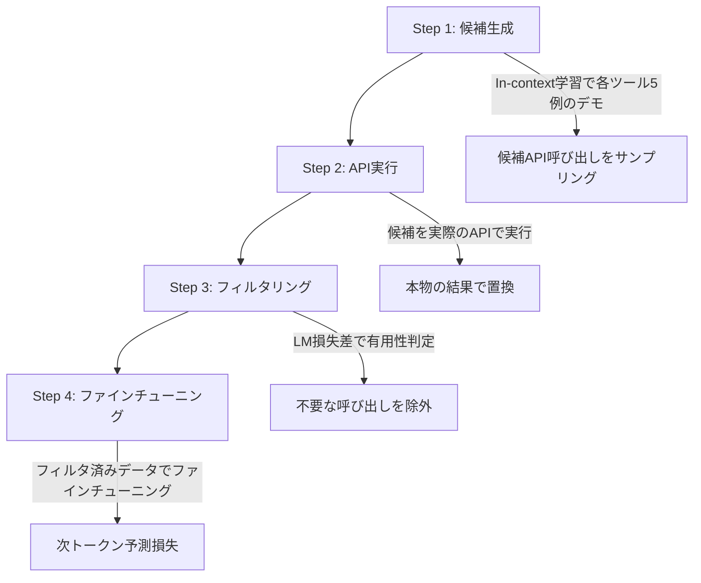

## 論文概要（Abstract）

言語モデル（LM）はゼロショット設定で高い能力を示すが、算術計算や事実検索、時間的推論といった基本タスクでは依然として課題がある。Toolformerは、LMがAPI呼び出しを自律的に学習する手法であり、自己教師あり方式でいつ・どのツールを・どの引数で呼び出すかを判断できるモデルを構築する。著者らの報告によると、6.7BパラメータのToolformerがGPT-3（175B）を複数のゼロショットタスクで上回る結果を示している。

この記事は [Zenn記事: Anthropic Python SDKでClaude APIを実践活用する実装ガイド](https://zenn.dev/0h_n0/articles/f1f840e7205f2b) の深掘りです。

## 情報源

- **arXiv ID**: 2302.04761
- **URL**: [https://arxiv.org/abs/2302.04761](https://arxiv.org/abs/2302.04761)
- **著者**: Timo Schick, Jane Dwivedi-Yu, Roberto Dessi, Roberta Raileanu, Maria Lomeli, Luke Zettlemoyer, Nicola Cancedda, Thomas Scialom（Meta AI Research）
- **発表年**: 2023（NeurIPS 2023採択）
- **分野**: cs.CL, cs.AI

## 背景と動機（Background & Motivation）

大規模言語モデルはテキスト生成や質問応答において高い性能を示すが、外部情報の検索や数値計算といったタスクではパラメータに格納された知識だけでは不十分である。従来のツール利用LMアプローチ（WebGPT、ReAct等）は大量の人手アノテーションや特定タスクへの特化が必要であり、汎用性に欠けていた。

Toolformerの動機は、**人手アノテーションなしで**LMがツール利用を学習できる汎用的なフレームワークの構築にある。著者らは、少数のデモンストレーション（各ツール5例程度）のみで、モデル自身がツール呼び出しの有用性を判断し、学習データを自己生成する手法を提案している。

## 主要な貢献（Key Contributions）

- **貢献1**: 自己教師ありAPI呼び出しデータ生成パイプライン（人手アノテーション不要）
- **貢献2**: LM損失差に基づくフィルタリング機構（有用な呼び出しのみを選択的に学習）
- **貢献3**: 6.7Bパラメータで175B GPT-3を複数のゼロショットタスクで上回る規模効率の実証
- **貢献4**: ツール利用とコア言語モデリング性能のトレードオフなしの両立

## 技術的詳細（Technical Details）

### ツール呼び出しの表現形式

Toolformerはツール呼び出しをテキスト中に特殊トークンでインラインに埋め込む。

```
The population of Toronto is [QA("population of Toronto")] → 2,794,356.
```

形式: `[API_NAME(input)] → result`

推論時にはモデルが `[` トークンを生成した時点でAPI呼び出しをトリガーし、結果をコンテキストに挿入して生成を続行する。

### データ生成パイプライン（4ステップ）

Toolformerの核心は以下の4ステップで構成される自己教師ありデータ生成パイプラインである。



**Step 1: 候補の生成**

大規模テキストコーパス（CCNet）の各文について、in-context学習で各ツール5例のデモンストレーションを用いてGPT-J（6.7B）で候補API呼び出しをサンプリングする。モデルはテキスト中のどの位置にどのAPIをどの引数で呼び出すかを生成する。

**Step 2: APIの実行**

Step 1で生成した候補を実際のAPIで実行し、本物の結果で置換する。Calculator（計算機）はローカルPython eval、Wikipedia SearchはBM25検索、翻訳は外部APIを使用する。

**Step 3: フィルタリング（LM損失差による有用性判定）**

この段階が本手法の核心である。API呼び出しが「有用かどうか」をLM損失で自動判定する。

3つのバリアントを比較する:

$$
L(e_i) = -\sum_{j=i}^{n} \log p_\theta(t_j | t_1, \ldots, t_{j-1})
$$

ここで、
- $e_i$: テキスト中の位置$i$以降の後続トークン列
- $p_\theta$: 言語モデルの予測確率
- $t_j$: $j$番目のトークン

フィルタリング条件:

$$
\min(L(e_i \mid \epsilon), L(e_i)) - L(e_i \mid c(a_i, r_i)) > \tau
$$

ここで、
- $L(e_i \mid \epsilon)$: 空の結果（API呼び出しなし）での損失
- $L(e_i)$: 元テキストでの損失
- $L(e_i \mid c(a_i, r_i))$: API呼び出し$a_i$と結果$r_i$を含めた場合の損失
- $\tau$: フィルタリング閾値（論文ではτ = 1.0を推奨）

直感的には、API呼び出しの結果をコンテキストに含めたときに後続トークンの予測が改善されるかを測定している。改善幅が閾値を超えた場合のみ「有用な呼び出し」として学習データに採用される。

**Step 4: ファインチューニング**

フィルタリング済みデータでGPT-J（6.7B）を通常の次トークン予測損失でファインチューニングする。各ツールのデータは独立に生成され、全ツール分をマージして1回のファインチューニングを行う。

### サポートするツール

論文では以下の5種類のツールが検証されている。

| ツール名 | 説明 | 入力形式 | ユースケース |
|---------|------|---------|------------|
| Calculator | 数式計算（Python eval） | 数式文字列 | 算術演算、数値推論 |
| Wikipedia Search | BM25によるWikipedia検索 | クエリ文字列 | 事実確認、知識補完 |
| Machine Translator | 英語への翻訳 | "言語,テキスト" | 多言語処理 |
| Calendar | 現在日付の取得 | なし（空引数） | 時間的推論 |
| QA System | 質問応答システム | 質問文字列 | 複雑な質問への回答 |

### アルゴリズム

推論時のデコードアルゴリズムを以下に示す。

```python
def toolformer_decode(
    model: LanguageModel,
    prompt: str,
    tools: dict[str, callable],
    max_tokens: int = 512,
) -> str:
    """Toolformer推論時のデコードアルゴリズム

    Args:
        model: ファインチューニング済みLM
        prompt: 入力プロンプト
        tools: ツール名→呼び出し関数のマッピング
        max_tokens: 最大生成トークン数

    Returns:
        ツール呼び出し結果を含む生成テキスト
    """
    output_tokens: list[str] = []

    for _ in range(max_tokens):
        next_token = model.generate_next(prompt + "".join(output_tokens))

        if next_token == "[":
            # API呼び出しの開始を検出
            api_call = model.generate_until("]", include_delimiter=False)
            api_name, api_input = parse_api_call(api_call)

            # APIを実行
            result = tools[api_name](api_input)

            # 結果をコンテキストに挿入
            output_tokens.append(f"[{api_call}] → {result}")
        elif next_token == "<EOS>":
            break
        else:
            output_tokens.append(next_token)

    return "".join(output_tokens)
```

## 実装のポイント（Implementation）

実際にToolformerを再現実装する際の注意点を整理する。

1. **`[` トークンのデコード中断**: 標準的なデコーダは連続的にトークンを生成するが、Toolformerでは `[` の検出時にデコードを一時停止し、API呼び出しを実行する必要がある。Hugging Faceの`generate()`関数をカスタマイズするか、独自のデコードループを実装する

2. **フィルタリング閾値τの調整**: 論文ではτ = 1.0を推奨しているが、ツールやドメインによって最適値が異なる。著者らの報告では、データ量が各ツール約5,000〜50,000例で効果が出るとされている

3. **安全性の懸念**: Calculator（Python eval）やPython Interpreterを使用する場合、任意コード実行のリスクがある。サンドボックス環境での実行が必須

4. **コード公開状況**: 論文時点では公式実装は非公開だったが、コミュニティ実装が存在する（LangChain等でのインスパイア実装）

## 実験結果（Results）

論文Table 1の結果（ゼロショット、著者らの報告値）を以下に示す。

### 算術・数学タスク

| タスク | GPT-J (6.7B, ツールなし) | GPT-3 (175B, ツールなし) | Toolformer (6.7B) |
|--------|--------------------------|--------------------------|-------------------|
| ASDiv | 7.0 | 14.0 | **40.4** |
| SVAMP | 6.0 | 10.0 | **29.4** |
| MAWPS | 19.8 | 29.9 | **44.0** |

### 事実確認・QAタスク

| タスク | GPT-J (6.7B) | GPT-3 (175B) | Toolformer (6.7B) |
|--------|-------------|-------------|-------------------|
| TriviaQA | 11.4 | 14.6 | **22.7** |
| WebQS | 4.7 | 6.5 | **10.0** |

注目すべきは、6.7Bパラメータの Toolformer が175BパラメータのGPT-3を上回っている点である。これは約26倍のパラメータ差を覆す結果であり、著者らはツール利用がモデルサイズの増大に代わる効率的なスケーリング手段であると主張している。

### 言語モデリング性能への影響

著者らの報告によると、Toolformerはツール利用タスクの性能を向上させながら、コアな言語モデリング性能（パープレキシティ）を維持またはわずかに改善するとされている。これは一般的なタスク特化ファインチューニングでは見られない特性であり、自己教師ありデータ生成が汎用性を損なわないことを示唆している。

## 実運用への応用（Practical Applications）

Toolformerの概念は、Zenn記事で紹介したClaude APIのTool Useの理論的基盤として位置づけられる。具体的な関連を以下に整理する。

1. **ツール呼び出しの判断**: Toolformerの「いつツールを使うか」の自律的判断は、Claude APIの`tool_choice: auto`に対応する
2. **スキーマ準拠**: Toolformerの特殊トークンによる構造化出力は、Claude APIの`strict: true`による出力制約の先駆けである
3. **複数ツールの組み合わせ**: 論文の制約として「連鎖的ツール利用の未サポート」が挙げられているが、Claude APIのtool_runnerは複数ツールの逐次呼び出しをサポートしている

### スケーリングの観点

Toolformerは5ツール以内での検証であり、ツール数のスケーリングは未検証である。一方、Anthropicの Advanced Tool Use（Tool Search Tool）は数千のツールを動的に管理する産業規模の解決策を提供している。

## 関連研究（Related Work）

- **WebGPT** (Nakano et al., 2021): Web検索を統合したLMだが、人手アノテーションによる強化学習が必要。Toolformerはアノテーション不要で汎用性が高い
- **ReAct** (Yao et al., 2022): 推論と行動を交互に行うフレームワーク。Toolformerがファインチューニングベースなのに対し、ReActはプロンプトベース
- **TALM** (Parisi et al., 2022): Tool Augmented Language Models。Toolformerと類似の動機だが、フィルタリング機構の精度で差が出る

## まとめと今後の展望

Toolformerは、LMが人手介入なしでツール利用を学習できることを実証した基盤的な研究である。6.7BパラメータのモデルがGPT-3（175B）を上回る結果は、ツール利用が計算コストの効率化に寄与しうることを示している。

今後の研究方向としては、（1）連鎖的ツール利用（Chain-of-Tools）のサポート、（2）ツール数のスケーリング、（3）リアルタイムAPIとの安全な統合が挙げられる。これらの課題は、現在のClaude API（tool_runner、Tool Search Tool）やLangChainのエージェントフレームワークで部分的に解決されている。

## 参考文献

- **arXiv**: [https://arxiv.org/abs/2302.04761](https://arxiv.org/abs/2302.04761)
- **Related Work**: Yao et al., "ReAct: Synergizing Reasoning and Acting in Language Models," ICLR 2023
- **Related Work**: Nakano et al., "WebGPT: Browser-assisted question-answering with human feedback," 2021
- **Related Zenn article**: [https://zenn.dev/0h_n0/articles/f1f840e7205f2b](https://zenn.dev/0h_n0/articles/f1f840e7205f2b)

---

:::message
この記事はAI（Claude Code）により自動生成されました。内容の正確性については情報源を基に検証していますが、最新情報は原論文をご確認ください。
:::
