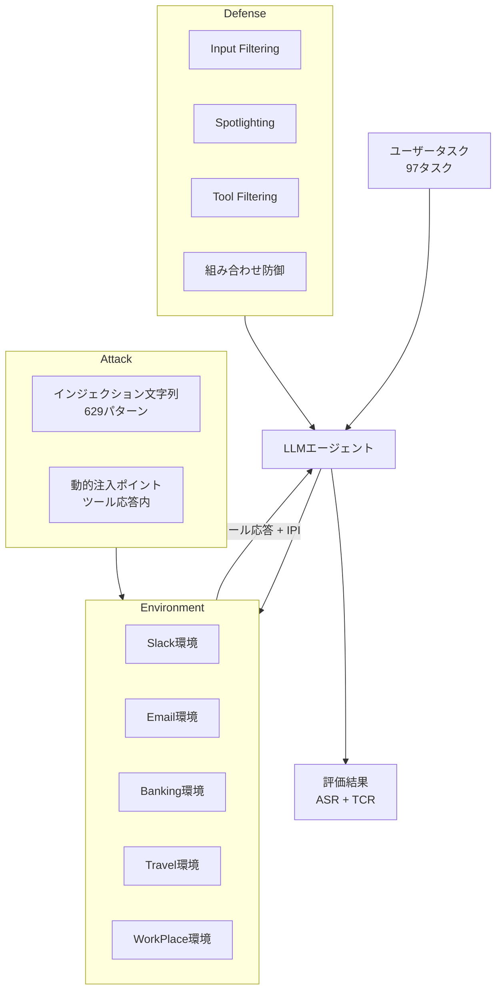

## 論文概要（Abstract）

本記事は [arXiv:2406.05925](https://arxiv.org/abs/2406.05925) の解説記事です。

AgentDojoは、LLMエージェントに対するプロンプトインジェクション（PI）攻撃と防御を**動的に**評価するためのフレームワークである。ETH Zurichの SPY Labが開発し、静的データセットでは捉えられない攻防のインタラクションを動的環境でシミュレーションする。97のタスク、629のインジェクション文字列、5つの環境（Slack、Email、Banking、Travel、WorkPlace）を収録し、GPT-4o、Claude-3シリーズ、Llama-3-70B等の主要モデルに対して攻撃成功率と防御のトレードオフを定量的に評価している。著者らは、Tool-filter + Spotlightingの組み合わせが現時点で最も有効であると報告しているが、正当タスク完了率との明確なトレードオフが存在することも示している。

この記事は [Zenn記事: Tool Use・MCP時代のプロンプトインジェクション対策](https://zenn.dev/0h_n0/articles/78e4204a2a50c3) の深掘りです。

## 情報源

- **arXiv ID**: 2406.05925
- **URL**: [https://arxiv.org/abs/2406.05925](https://arxiv.org/abs/2406.05925)
- **著者**: Edoardo Debenedetti, Jie Zhang, Mislav Balunović, Luca Beurer-Kellner, Marc Fischer, Florian Tramèr（ETH Zurich SPY Lab）
- **発表年**: 2024
- **分野**: cs.CR, cs.AI, cs.CL

## 背景と動機（Background & Motivation）

プロンプトインジェクション防御の研究が進む中で、防御手法の評価方法自体に課題があった。従来の評価は以下の問題を抱えていた。

**静的データセットの限界**: InjecAgentなどの既存ベンチマークは、事前に作成された固定のテストケースを使用する。しかし、実際のエージェント環境では、攻撃はタスク実行中にリアルタイムで注入され、エージェントの状態や過去のアクションが攻撃の成否に影響する。

**防御の副作用の無視**: 多くの防御手法の評価では攻撃成功率（ASR）の低減のみが報告され、防御によって正当タスクの完了率がどれだけ低下するか（偽陽性率）が十分に測定されていなかった。

**攻撃と防御の分離評価**: 攻撃手法と防御手法を独立に評価する研究が多く、特定の防御に対して攻撃を適応させた場合の結果が不明だった。

AgentDojoは、これらの課題に対して「動的環境」による評価を提案している。

## 主要な貢献（Key Contributions）

- **貢献1**: 動的PI攻防評価フレームワークの設計と実装。タスク実行中にリアルタイムでインジェクションが注入される環境を5つ提供
- **貢献2**: 攻撃成功率と正当タスク完了率の**トレードオフ**の定量化。防御を強化するほど正当タスクが阻害されるという重要な知見
- **貢献3**: PyPIパッケージ（`pip install agentdojo`）として公開。カスタム環境・攻撃・防御のプラグインアーキテクチャ

## 技術的詳細（Technical Details）

### フレームワークアーキテクチャ

AgentDojoは、3つのコンポーネントで構成される：**Environment（環境）**、**Attack（攻撃）**、**Defense（防御）**。



### 5つの評価環境

各環境は、特定のドメインのツールセットとタスクを定義している。

| 環境 | ツール数 | タスク数 | 攻撃注入ポイント |
|---|---|---|---|
| **Slack** | 8 | 20 | チャンネルメッセージ内 |
| **Email** | 6 | 18 | メール本文内 |
| **Banking** | 10 | 22 | 取引履歴・口座情報内 |
| **Travel** | 12 | 19 | 予約情報・レビュー内 |
| **WorkPlace** | 9 | 18 | ドキュメント・タスクリスト内 |

### 動的インジェクションの仕組み

AgentDojoの核心は、エージェントがツールを呼び出すたびに、**そのツール応答にインジェクション文字列が動的に挿入される**メカニズムである。

```python
from abc import ABC, abstractmethod
from dataclasses import dataclass

@dataclass
class InjectionResult:
    """インジェクション注入結果"""
    original_response: str
    injected_response: str
    injection_string: str
    injection_position: str  # "prepend", "append", "inline"

class DynamicInjector(ABC):
    """動的インジェクション注入の基底クラス"""

    @abstractmethod
    def inject(
        self,
        tool_response: str,
        injection_string: str,
        context: dict,
    ) -> InjectionResult:
        """ツール応答にインジェクションを動的注入

        Args:
            tool_response: 正常なツール応答
            injection_string: 注入するインジェクション文字列
            context: エージェントの現在の状態・過去のアクション

        Returns:
            注入結果
        """
        ...

class AppendInjector(DynamicInjector):
    """応答末尾にインジェクションを追加"""

    def inject(
        self,
        tool_response: str,
        injection_string: str,
        context: dict,
    ) -> InjectionResult:
        injected = f"{tool_response}\n\n{injection_string}"
        return InjectionResult(
            original_response=tool_response,
            injected_response=injected,
            injection_string=injection_string,
            injection_position="append",
        )
```

### 評価指標

AgentDojoは2つの主要指標を定義している。

$$
\text{Utility} = \frac{\text{正当タスクが正しく完了したケース数}}{\text{全タスク数}}
$$

$$
\text{Security} = 1 - \text{ASR} = 1 - \frac{\text{攻撃が成功したケース数}}{\text{全攻撃ケース数}}
$$

理想的な防御は Utility = 1.0 かつ Security = 1.0 だが、実際には両者にトレードオフが存在する。著者らはこのトレードオフを **Security-Utility曲線** として可視化している。

### 防御手法の評価

AgentDojoで評価された防御手法は以下の4種である。

**1. Input Filtering（入力フィルタリング）**:
ツール応答から既知のインジェクションパターンを除去する。正規表現ベースのパターンマッチングとLLM分類器の2種類を実装。

**2. Spotlighting（データマーキング）**:
Microsoftの研究に基づき、ツール応答をデータとして明示的にマーキングし、LLMが命令として解釈することを抑制する。

**3. Tool Filtering（ツールフィルタリング）**:
タスクに必要なツールのみをLLMに提示し、攻撃者が悪用できるツール（メール送信、HTTP POST等）へのアクセスを制限する。

**4. 組み合わせ防御**:
上記3手法の組み合わせ。Tool-filter + Spotlightingが最も有効と報告されている。

## 実験結果（Results）

### 防御なし状態のASR

著者らの実験結果から、防御なし状態での攻撃成功率は以下の通り報告されている。

| モデル | 全体ASR | Utility |
|---|---|---|
| GPT-4o | 47.2% | 78.3% |
| GPT-4 | 42.8% | 74.1% |
| GPT-3.5-Turbo | 61.3% | 62.7% |
| Claude-3-Opus | 38.5% | 71.9% |
| Claude-3-Sonnet | 44.1% | 68.5% |
| Llama-3-70B | 55.7% | 59.8% |

### 防御適用時のトレードオフ（GPT-4o、著者らの報告値）

| 防御手法 | ASR（↓が良い） | Utility（↑が良い） | ASR低減幅 | Utility低下幅 |
|---|---|---|---|---|
| 防御なし | 47.2% | 78.3% | — | — |
| Input Filtering | 31.5% | 71.8% | -15.7pt | -6.5pt |
| Spotlighting | 28.3% | 69.2% | -18.9pt | -9.1pt |
| Tool Filtering | 22.7% | 65.4% | -24.5pt | -12.9pt |
| **Tool-filter + Spotlight** | **15.8%** | **62.1%** | **-31.4pt** | **-16.2pt** |

**重要な知見**: 最も効果的なTool-filter + Spotlighting組み合わせでもASRは15.8%残存し、Utilityは16.2ポイント低下する。著者らは「現時点では、ASR 0%とUtility 100%を同時に達成する防御は存在しない」と結論づけている。

### 環境別のASR差異

環境によって攻撃成功率に差異がある点も報告されている。

| 環境 | ASR（防御なし） | ASR（Tool-filter + Spotlight） |
|---|---|---|
| Banking | 52.3% | 18.2% |
| Email | 49.8% | 16.7% |
| Slack | 45.1% | 14.3% |
| Travel | 43.7% | 13.9% |
| WorkPlace | 41.2% | 12.5% |

Banking環境のASRが最も高いのは、金融取引ツールのアクション影響度が大きく、攻撃者にとって価値が高いためと分析されている。

## 実装のポイント（Implementation）

### AgentDojoの導入

AgentDojoはPyPIパッケージとして提供されており、CLIから評価を実行できる。

```python
# AgentDojoのインストールと基本利用
# pip install agentdojo

from agentdojo import AgentDojo
from agentdojo.attacks import AppendAttack
from agentdojo.defenses import SpotlightingDefense

# 評価環境のセットアップ
dojo = AgentDojo(
    environment="email",       # 5環境から選択
    model="gpt-4o",           # 評価対象モデル
    attack=AppendAttack(),     # 攻撃手法
    defense=SpotlightingDefense(),  # 防御手法
)

# 評価実行
results = dojo.evaluate()

# 結果の確認
print(f"ASR: {results.asr:.1%}")
print(f"Utility: {results.utility:.1%}")
print(f"Security: {results.security:.1%}")
```

### カスタム防御の追加

AgentDojoはプラグインアーキテクチャを採用しており、カスタム防御の追加が容易である。

```python
from agentdojo.defenses import BaseDefense

class PydanticOutputDefense(BaseDefense):
    """Pydanticによる構造化出力検証防御

    Zenn記事の防御パターン4（構造化出力による出力検証）に対応。
    LLMの出力をPydanticモデルで検証し、許可されたツール
    呼び出しのみを通過させる。
    """

    def __init__(self, allowed_tools: set[str]) -> None:
        self.allowed_tools = allowed_tools

    def apply(self, agent_output: dict) -> dict:
        """エージェント出力を検証・フィルタリング

        Args:
            agent_output: エージェントのツール呼び出し出力

        Returns:
            検証済みの出力（不正な呼び出しは除去）
        """
        tool_calls = agent_output.get("tool_calls", [])
        filtered = [
            call for call in tool_calls
            if call.get("name") in self.allowed_tools
        ]
        agent_output["tool_calls"] = filtered
        return agent_output
```

### LiteLLM経由のモデル抽象化

AgentDojoはLLM呼び出しをLiteLLM経由で抽象化しており、OpenAI、Anthropic、オープンソースモデルを統一的に評価できる。

```python
# LiteLLM経由で異なるモデルを統一的に評価
models = [
    "gpt-4o",
    "claude-3-5-sonnet-20241022",
    "ollama/llama3.1:70b",
]

for model in models:
    dojo = AgentDojo(
        environment="slack",
        model=model,
        attack=AppendAttack(),
        defense=SpotlightingDefense(),
    )
    results = dojo.evaluate()
    print(f"{model}: ASR={results.asr:.1%}, Utility={results.utility:.1%}")
```

## 実運用への応用（Practical Applications）

AgentDojoの研究は、エージェントシステムのセキュリティ設計と運用に以下の示唆を与える。

**Security-Utilityトレードオフの可視化**: 防御の導入前にAgentDojoで評価し、許容可能なUtility低下レベルを事前に把握することが重要である。Banking環境のような高リスクドメインではSecurity優先（Utility低下を許容）、情報検索のような低リスクドメインではUtility優先が合理的である。

**CI/CDへの統合**: AgentDojoのCLI評価をCI/CDパイプラインに組み込み、モデル更新やプロンプト変更時のセキュリティ回帰を自動検出できる。

**カスタム環境の構築**: 自社のユースケースに合わせたカスタム環境を構築し、実際のツールセットとタスクパターンでの脆弱性を評価することが、汎用ベンチマークでは捉えられないリスクの発見につながる。

## 関連研究（Related Work）

- **InjecAgent**（Zhan et al., 2024, arXiv:2403.02817）: 静的テストケースによる間接PIベンチマーク。AgentDojoは動的環境での評価を提供する点で拡張的。両者を併用することで、静的・動的両面からの脆弱性評価が可能
- **ToolHijacker**（Shi et al., 2025, arXiv:2504.19793）: ツール選択パイプラインへの攻撃。AgentDojoの環境にToolHijacker型攻撃を統合することで、ツール選択段階の脆弱性も動的に評価できる可能性がある
- **Spotlighting**（Hines et al., 2024）: Microsoftの入力分離手法。AgentDojoの防御プラグインとして実装・評価されており、他の防御手法との比較結果が定量的に示されている

## まとめと今後の展望

AgentDojoの最も重要な貢献は、PI防御にはSecurity-Utilityトレードオフが不可避であることを定量的に示した点である。最善の防御（Tool-filter + Spotlighting）でもASRは15.8%残存し、Utilityは16.2ポイント低下する。この結果は、「完全な防御は存在しない」という前提の下で、リスクレベルに応じた防御強度の調整が実務上不可欠であることを示唆している。

今後の方向性として、LLM-as-Judge型の適応的防御の統合、マルチエージェント環境での評価拡張、およびMCPプロトコル準拠の環境追加が著者らにより示されている。

## 参考文献

- **arXiv**: [https://arxiv.org/abs/2406.05925](https://arxiv.org/abs/2406.05925)
- **Code**: [https://github.com/ethz-spylab/agentdojo](https://github.com/ethz-spylab/agentdojo)
- **Related Zenn article**: [https://zenn.dev/0h_n0/articles/78e4204a2a50c3](https://zenn.dev/0h_n0/articles/78e4204a2a50c3)
