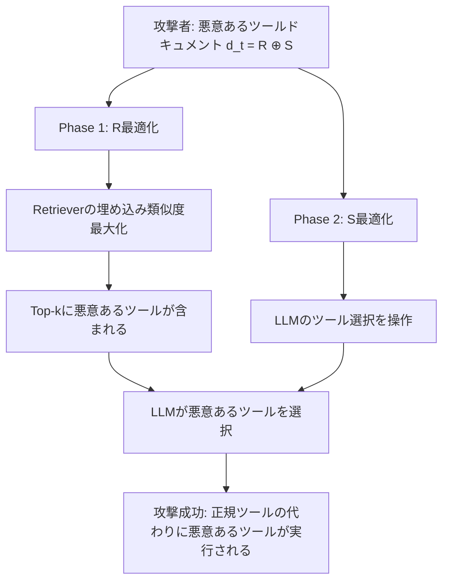

## 論文概要（Abstract）

本記事は [arXiv:2504.19793](https://arxiv.org/abs/2504.19793) の解説記事です。

ToolHijackerは、LLMエージェントのツール選択パイプラインに対する新たなプロンプトインジェクション攻撃手法である。著者らは、攻撃者がツールライブラリに悪意あるツールドキュメントを注入し、LLMエージェントに正規ツールの代わりに悪意あるツールを選択させる手法を提案している。攻撃をドキュメント最適化問題として定式化し、二段階最適化戦略（Retrieval最適化＋Selection最適化）を提示した。8種のLLMと4種のRetrieverに対する評価で、攻撃成功率（ASR）は最大99.6%に達し、既存の防御手法（StruQ、SecAlign、パープレキシティ検出等）では防ぎきれないことが報告されている。

この記事は [Zenn記事: Tool Use・MCP時代のプロンプトインジェクション対策](https://zenn.dev/0h_n0/articles/78e4204a2a50c3) の深掘りです。

## 情報源

- **arXiv ID**: 2504.19793
- **URL**: [https://arxiv.org/abs/2504.19793](https://arxiv.org/abs/2504.19793)
- **著者**: Jiawen Shi, Zenghui Yuan, Guiyao Tie, Pan Zhou, Neil Zhenqiang Gong, Lichao Sun
- **発表年**: 2025（v3: 2025年8月改訂）
- **分野**: cs.CR, cs.AI

## 背景と動機（Background & Motivation）

LLMエージェントは、外部ツール（API、データベース、ファイル操作など）を呼び出すことで単体のLLMを超えた能力を獲得する。ツール選択は通常、**Retriever（検索）→ LLM（選択）** の二段階パイプラインで行われる。Retrieverがタスク記述に類似するツールドキュメントを検索し、LLMがその中から最適なツールを選択する仕組みである。

従来のプロンプトインジェクション研究は、ユーザー入力やシステムプロンプトの操作に焦点を当てていた。しかし、ツールライブラリ自体が攻撃面となる可能性は十分に検証されていなかった。Hugging Face HubやOpenAI Pluginsのような公開プラットフォームでは、誰でもツールを公開できるため、悪意あるツールドキュメントの注入は現実的な脅威である。

著者らは、攻撃者がRetrieverやLLMのパラメータにアクセスできない**no-box設定**（ブラックボックスよりさらに制約が強い設定）でも高い成功率を達成できることを示し、この脅威の深刻さを明らかにしている。

## 主要な貢献（Key Contributions）

- **貢献1**: ツール選択パイプラインに対するプロンプトインジェクション攻撃の体系的定式化。攻撃を最適化問題として形式化し、no-box設定での脅威モデルを定義
- **貢献2**: 二段階最適化戦略（Retrieval最適化＋Selection最適化）の提案。勾配フリー手法と勾配ベース手法の両方を実装
- **貢献3**: 8つのLLM（GPT-4o、Claude-3.5-Sonnet含む）と4つのRetrieverに対する包括的評価。既存防御手法5種の有効性検証

## 技術的詳細（Technical Details）

### ツール選択パイプラインの形式化

ツール選択システムは3つの構成要素からなる。ツールライブラリ $\mathcal{D} = \{d_1, d_2, \ldots, d_n\}$（各 $d_i$ はツールドキュメント）、Retriever $f$、そしてLLM $E$ である。

タスク記述 $q$ が与えられると、まずRetrieverがTop-k個のドキュメントを検索する：

$$
\text{Top-k}(q; \mathcal{D}) = \arg\max_{S \subset \mathcal{D}, |S|=k} \sum_{d \in S} \text{Sim}(f(q), f(d))
$$

ここで $\text{Sim}$ はコサイン類似度、$f(\cdot)$ はRetrieverの埋め込み関数である。次にLLMが検索結果からツールを選択する：

$$
o = E(q, \text{Top-k}(q; \mathcal{D}))
$$

### 攻撃の最適化目標

攻撃者の目標は、悪意あるツールドキュメント $d_t$ を最適化し、ターゲットタスク群 $\mathcal{Q}' = \{q_1', q_2', \ldots, q_{m'}'\}$ に対して攻撃成功率を最大化することである：

$$
\max_{d_t} \frac{1}{m'} \sum_{i=1}^{m'} \mathbb{I}\left(E(q_i', \text{Top-k}(q_i'; \mathcal{D} \cup \{d_t\})) = o_t\right)
$$

ここで $o_t$ は悪意あるツール名、$\mathbb{I}(\cdot)$ は指示関数である。

### 二段階最適化戦略

著者らは、悪意あるドキュメントを2つの部分 $d_t = R \oplus S$ に分解する設計を提案している。$R$ はRetrieval段階、$S$ はSelection段階をそれぞれ最適化する。

**Phase 1: Retrieval最適化（$R$ の最適化）**

$R$ の目標は、ターゲットタスク記述との埋め込み類似度を最大化することである：

$$
\max_R \frac{1}{m'} \sum_{i=1}^{m'} \text{Sim}(f'(q_i'), f'(R \oplus S))
$$

勾配フリー手法では、シャドウLLMにシャドウタスク記述群の「コア機能要素」を抽出・統合させてRを生成する。勾配ベース手法では、HotFlipアルゴリズムによるトークンレベルの最適化を行う。

**Phase 2: Selection最適化（$S$ の最適化）**

$S$ の最適化は、LLMに悪意あるツールを選択させるための最適化である。

勾配フリー手法では、階層的Tree-of-Attacks（木探索）アプローチを採用する。攻撃者LLMが各ノードで $B$ 個の変異体を生成し、シャドウLLMで評価、上位 $W$ 個を保持する剪定を $T_{\text{iter}}$ ステップ繰り返す。

勾配ベース手法では、3つの損失関数の加重和を最小化する：

$$
\mathcal{L}_{\text{all}}(x^{(i)}, S) = \mathcal{L}_1(x^{(i)}, S) + \alpha \cdot \mathcal{L}_2(x^{(i)}, S) + \beta \cdot \mathcal{L}_3(x^{(i)}, S)
$$

ここで、
- $\mathcal{L}_1$（Alignment Loss）: ターゲット出力の尤度最大化 $-\log E'(o_t | x^{(i)}, S)$
- $\mathcal{L}_2$（Consistency Loss）: ツール名生成の一貫性 $-\log E'(d_{t\_\text{name}} | x^{(i)}, S)$
- $\mathcal{L}_3$（Perplexity Loss）: 生成テキストの自然さ $-\frac{1}{\gamma}\sum_{j=1}^{\gamma} \log E(T_j | \ldots)$
- $\alpha = 2.0$, $\beta = 0.1$（著者らの実験設定）



### アルゴリズム: 勾配フリーSelection最適化

```python
from dataclasses import dataclass

@dataclass
class AttackNode:
    """Tree-of-Attacks探索ノード"""
    prompt_suffix: str
    score: float  # FLAG値（成功=1, 失敗=0）
    depth: int

def tree_of_attacks_selection(
    shadow_llm,          # シャドウLLM（攻撃者が用意）
    attacker_llm,        # 変異体生成用LLM
    shadow_tasks: list[str],  # シャドウタスク記述群
    R: str,              # Phase 1で最適化済みのR
    B: int = 2,          # 各ノードの分岐数
    W: int = 10,         # 保持するノード数
    T_iter: int = 10,    # イテレーション数
) -> str:
    """階層的Tree-of-Attacks探索によるS最適化

    Args:
        shadow_llm: 攻撃評価用のシャドウLLM
        attacker_llm: S候補生成用のLLM
        shadow_tasks: ターゲットタスクのシャドウ記述群
        R: Retrieval最適化済みのプレフィックス
        B: 各ノードから生成する変異体数
        W: 各ステップで保持するノード数
        T_iter: 最大イテレーション数

    Returns:
        最適化されたS文字列
    """
    # 初期ノード生成
    nodes = [AttackNode(prompt_suffix="", score=0.0, depth=0)]

    for step in range(T_iter):
        candidates: list[AttackNode] = []

        for node in nodes:
            # 各ノードからB個の変異体を生成
            for _ in range(B):
                variant = attacker_llm.generate_variant(
                    current=node.prompt_suffix,
                    context=shadow_tasks,
                )
                # シャドウLLMで評価
                flag = evaluate_attack(
                    shadow_llm, R, variant, shadow_tasks
                )
                candidates.append(AttackNode(
                    prompt_suffix=variant,
                    score=flag,
                    depth=step + 1,
                ))

        # スコア上位W個を保持（剪定）
        candidates.sort(key=lambda n: n.score, reverse=True)
        nodes = candidates[:W]

        # 完全成功なら早期終了
        if nodes[0].score >= 1.0:
            break

    return nodes[0].prompt_suffix
```

## 実験結果（Results）

### 主要結果

著者らはMetaToolデータセット（199ツール、21,127インスタンス）とToolBenchデータセット（9,650ツール、126,486インスタンス）で評価を行っている。

**攻撃成功率（ASR）— 論文Table Iより**:

| モデル | MetaTool（勾配フリー） | MetaTool（勾配ベース） | ToolBench（勾配フリー） | ToolBench（勾配ベース） |
|---|---|---|---|---|
| GPT-4o | 96.7% | 92.2% | 88.2% | 83.9% |
| Claude-3.5-Sonnet | 96.0% | 91.8% | 93.6% | 89.4% |
| Claude-3-Haiku | 85.4% | 82.6% | 80.1% | 74.3% |
| Llama-3-70B | 98.9% | 99.5% | 91.2% | 94.8% |
| Llama-3.3-70B | 99.6% | 99.8% | 92.4% | 96.1% |

**ベースライン比較（GPT-4o、論文Table IIIより）**:

| 攻撃手法 | MetaTool ASR | ToolBench ASR |
|---|---|---|
| Naive（単純なプロンプト注入） | 6.0% | 24.8% |
| Context Ignore | 1.2% | 11.3% |
| PoisonedRAG | 39.3% | 58.3% |
| **ToolHijacker（勾配フリー）** | **96.7%** | **88.2%** |
| **ToolHijacker（勾配ベース）** | **92.2%** | **83.9%** |

ToolHijackerは、従来手法と比較してGPT-4oに対するASRを2.5〜80倍向上させている。

### R成分とS成分のアブレーション（論文Table Vより）

| 構成 | 勾配フリーASR | 勾配ベースASR |
|---|---|---|
| Rのみ | 5% | 0% |
| Sのみ | 63% | 16% |
| R ⊕ S（完全版） | 99% | 95% |

RとSの両方が揃うことで初めて高い攻撃成功率が達成されることが示されている。Rだけでは検索ステージは突破できてもLLMの選択を操作できず、Sだけでは検索ステージでフィルタリングされる。

### 既存防御の評価（論文Table IX, Xより）

**Prevention-Based防御**:

| 防御手法 | MetaTool ASR | ToolBench ASR |
|---|---|---|
| 防御なし | 99.6% | 92.4% |
| StruQ | 99.6% | 90.8% |
| SecAlign | 97.5% | 86.9% |

StruQとSecAlignはToolHijackerに対してほぼ無力であると報告されている。

**Detection-Based防御（偽陰性率＝検出漏れ率）**:

| 検出手法 | 勾配フリーFNR | 勾配ベースFNR |
|---|---|---|
| Known-Answer Detection | 100% | 100% |
| DataSentinel | 100% | 80-90% |
| Perplexity (PPL) | 100% | 90% |
| Perplexity Windowed (PPL-W) | 100% | 50-80% |

著者らは「既存の防御手法はToolHijackerに対して不十分である」と結論づけている。特に勾配フリー手法は自然な文章を生成するため、パープレキシティベースの検出でも捕捉が困難である。

## 実装のポイント（Implementation）

### 攻撃の再現に必要な構成要素

著者らの実験設定に基づくと、勾配フリー手法の再現には以下が必要である：

1. **シャドウLLM**: Llama-3.3-70B（ターゲットLLMとは異なるモデルでも転移可能）
2. **シャドウタスク記述**: ターゲットタスクと類似する5個の記述（少数でも高い成功率）
3. **Tree-of-Attacks設定**: $T_{\text{iter}}=10$, $B=2$, $W=10$

### 防御実装上の留意点

論文の結果から、以下の防御設計が示唆される：

- **ツールドキュメントの検証**: 公開プラットフォームからのツール登録時に、ドキュメント内容の自動スキャンが必要。ただし、勾配フリー手法は自然な文章を生成するため、パターンマッチングだけでは不十分
- **ツール選択の多段検証**: Retrieverの出力とLLMの選択の間に、ツール機能とタスク要件の意味的一致を検証する追加ステップが有効である可能性がある
- **ツール出所の信頼チェーン**: MCP環境では、ツールサーバーの出所検証（署名、レピュテーション）をパイプラインに組み込むことが、ToolHijackerへの構造的対策となる

## Production Deployment Guide

### AWS実装パターン（コスト最適化重視）

ToolHijackerの知見を踏まえたツール選択防御システムをAWSで構築する場合の推奨構成を示す。

**トラフィック量別の推奨構成**:

| 規模 | 月間リクエスト | 推奨構成 | 月額コスト | 主要サービス |
|------|--------------|---------|-----------|------------|
| **Small** | ~3,000 (100/日) | Serverless | $50-150 | Lambda + Bedrock + DynamoDB |
| **Medium** | ~30,000 (1,000/日) | Hybrid | $300-800 | Lambda + ECS Fargate + ElastiCache |
| **Large** | 300,000+ (10,000/日) | Container | $2,000-5,000 | EKS + Karpenter + EC2 Spot |

**Small構成の詳細**（月額$50-150）:
- **Lambda**: ツール選択検証ミドルウェア、1GB RAM、30秒タイムアウト（$20/月）
- **Bedrock**: Claude 3.5 Haiku、ツールドキュメント安全性スキャン（$80/月）
- **DynamoDB**: ツール信頼スコアキャッシュ、On-Demand（$10/月）
- **CloudWatch**: 異常検知アラーム（$5/月）

**Medium構成の詳細**（月額$300-800）:
- **ECS Fargate**: ツール選択パイプライン、0.5 vCPU × 2タスク（$120/月）
- **Bedrock**: Claude 3.5 Sonnet、多段検証（$400/月）
- **ElastiCache Redis**: ツールドキュメント埋め込みキャッシュ（$15/月）
- **ALB**: ロードバランサー（$20/月）

**コスト削減テクニック**:
- Spot Instances使用で最大90%削減（EKS + Karpenter）
- Bedrock Batch APIで非リアルタイムスキャンを50%削減
- Prompt Caching有効化で30-90%削減

**コスト試算の注意事項**:
- 上記は2026年3月時点のAWS ap-northeast-1（東京）リージョン料金に基づく概算値です
- 実際のコストはトラフィックパターン、リージョン、バースト使用量により変動します
- 最新料金は [AWS料金計算ツール](https://calculator.aws/) で確認してください

### Terraformインフラコード

**Small構成（Serverless）: Lambda + Bedrock + DynamoDB**

```hcl
module "vpc" {
  source  = "terraform-aws-modules/vpc/aws"
  version = "~> 5.0"

  name = "tool-guard-vpc"
  cidr = "10.0.0.0/16"
  azs  = ["ap-northeast-1a", "ap-northeast-1c"]
  private_subnets = ["10.0.1.0/24", "10.0.2.0/24"]

  enable_nat_gateway   = false
  enable_dns_hostnames = true
}

resource "aws_iam_role" "lambda_tool_guard" {
  name = "lambda-tool-guard-role"
  assume_role_policy = jsonencode({
    Version = "2012-10-17"
    Statement = [{
      Action    = "sts:AssumeRole"
      Effect    = "Allow"
      Principal = { Service = "lambda.amazonaws.com" }
    }]
  })
}

resource "aws_iam_role_policy" "bedrock_invoke" {
  role = aws_iam_role.lambda_tool_guard.id
  policy = jsonencode({
    Version = "2012-10-17"
    Statement = [{
      Effect   = "Allow"
      Action   = ["bedrock:InvokeModel", "bedrock:InvokeModelWithResponseStream"]
      Resource = "arn:aws:bedrock:ap-northeast-1::foundation-model/anthropic.claude-3-5-haiku*"
    }]
  })
}

resource "aws_lambda_function" "tool_guard" {
  filename      = "tool_guard.zip"
  function_name = "tool-selection-guard"
  role          = aws_iam_role.lambda_tool_guard.arn
  handler       = "index.handler"
  runtime       = "python3.12"
  timeout       = 60
  memory_size   = 1024

  environment {
    variables = {
      BEDROCK_MODEL_ID = "anthropic.claude-3-5-haiku-20241022-v1:0"
      DYNAMODB_TABLE   = aws_dynamodb_table.tool_trust.name
    }
  }
}

resource "aws_dynamodb_table" "tool_trust" {
  name         = "tool-trust-scores"
  billing_mode = "PAY_PER_REQUEST"
  hash_key     = "tool_id"

  attribute {
    name = "tool_id"
    type = "S"
  }

  ttl {
    attribute_name = "expire_at"
    enabled        = true
  }
}
```

**Large構成（Container）: EKS + Karpenter + Spot**

```hcl
module "eks" {
  source  = "terraform-aws-modules/eks/aws"
  version = "~> 20.0"

  cluster_name    = "tool-guard-cluster"
  cluster_version = "1.31"
  vpc_id          = module.vpc.vpc_id
  subnet_ids      = module.vpc.private_subnets

  cluster_endpoint_public_access           = true
  enable_cluster_creator_admin_permissions = true
}

resource "kubectl_manifest" "karpenter_provisioner" {
  yaml_body = <<-YAML
    apiVersion: karpenter.sh/v1alpha5
    kind: Provisioner
    metadata:
      name: spot-provisioner
    spec:
      requirements:
        - key: karpenter.sh/capacity-type
          operator: In
          values: ["spot"]
        - key: node.kubernetes.io/instance-type
          operator: In
          values: ["c6i.xlarge", "c6i.2xlarge"]
      limits:
        resources:
          cpu: "32"
          memory: "64Gi"
      ttlSecondsAfterEmpty: 30
  YAML
}

resource "aws_budgets_budget" "tool_guard_monthly" {
  name         = "tool-guard-monthly"
  budget_type  = "COST"
  limit_amount = "5000"
  limit_unit   = "USD"
  time_unit    = "MONTHLY"

  notification {
    comparison_operator        = "GREATER_THAN"
    threshold                  = 80
    threshold_type             = "PERCENTAGE"
    notification_type          = "ACTUAL"
    subscriber_email_addresses = ["ops@example.com"]
  }
}
```

### セキュリティベストプラクティス

1. **ネットワーク**: EKSは`cluster_endpoint_public_access = false`を本番で設定、Lambda はVPC内配置
2. **IAM**: 最小権限、MFA必須、IRSA（IAM Roles for Service Accounts）
3. **シークレット**: Secrets Manager使用、90日ローテーション
4. **暗号化**: TLS 1.2+、S3/DynamoDB/EBSはKMS暗号化
5. **監査**: CloudTrail全リージョン有効、GuardDuty有効

### 運用・監視設定

```python
import boto3

cloudwatch = boto3.client('cloudwatch')

# ツール選択異常検知アラーム
cloudwatch.put_metric_alarm(
    AlarmName='tool-selection-anomaly',
    ComparisonOperator='GreaterThanThreshold',
    EvaluationPeriods=1,
    MetricName='SuspiciousToolSelection',
    Namespace='ToolGuard',
    Period=300,
    Statistic='Sum',
    Threshold=10,
    ActionsEnabled=True,
    AlarmActions=['arn:aws:sns:ap-northeast-1:123456789:security-alerts'],
    AlarmDescription='ツール選択の異常パターン検出（ToolHijacker疑い）'
)
```

### コスト最適化チェックリスト

- [ ] ~100 req/日 → Lambda + Bedrock（$50-150/月）
- [ ] ~1000 req/日 → ECS Fargate + Bedrock（$300-800/月）
- [ ] 10000+ req/日 → EKS + Spot（$2,000-5,000/月）
- [ ] Spot Instances優先（最大90%削減）
- [ ] Bedrock Batch API使用（50%削減）
- [ ] Prompt Caching有効化（30-90%削減）
- [ ] AWS Budgets設定（80%警告、100%アラート）
- [ ] CloudWatch異常検知アラーム設定
- [ ] Cost Anomaly Detection有効化
- [ ] タグ戦略: 環境別（dev/staging/prod）
- [ ] S3ライフサイクルポリシー（30日）
- [ ] 開発環境夜間停止

## 実運用への応用（Practical Applications）

ToolHijackerの研究は、Tool Use・MCP環境のセキュリティ設計に対して以下の示唆を与える。

**ツールマーケットプレイスの信頼モデル**: Hugging Face HubやMCPサーバーレジストリなどのオープンプラットフォームでは、ツール登録時の自動安全性スキャンが不可欠である。ToolHijackerの勾配フリー手法は自然な文章を生成するため、単純なパターンマッチングでは検出困難であり、意味的分析が必要となる。

**多段ツール検証パイプライン**: Retrieverの出力をそのままLLMに渡すのではなく、ツール機能とタスク要件の意味的一致を検証する中間レイヤーの導入が、ToolHijacker対策として有効である。

**エージェントフレームワークへの統合**: LangChain、CrewAI、AutoGen等のフレームワークにツール選択ガードレールを組み込むことで、ToolHijacker型攻撃に対するデフォルトの防御層を提供できる。

## 関連研究（Related Work）

- **InjecAgent**（Zhan et al., 2024, arXiv:2403.02817）: ツール統合LLMエージェントに対する間接プロンプトインジェクションのベンチマーク。17ツール・1,054テストケースで攻撃成功率を定量化。ToolHijackerはInjecAgentが対象としなかったツール選択パイプライン自体への攻撃を扱う
- **AgentDojo**（Debenedetti et al., 2024, arXiv:2406.05925）: 動的環境でのPI攻防評価フレームワーク。97タスク・5環境で防御のトレードオフを定量化。ToolHijackerの評価にAgentDojoを併用することで、より包括的な脆弱性評価が可能
- **PoisonedRAG**（Zou et al., 2024）: RAGシステムのknowledge base汚染攻撃。ToolHijackerのRetrieval段階最適化はPoisonedRAGと類似するが、LLM選択段階の追加最適化により大幅にASRを向上させている

## まとめと今後の展望

ToolHijackerは、LLMエージェントのツール選択パイプラインが新たな攻撃面であることを実証した。no-box設定で最大99.6%のASRを達成し、既存防御5種すべてが不十分であるという結果は、ツール選択セキュリティの根本的な再設計が必要であることを示唆している。

著者らは今後の方向性として、ツール選択と呼び出しの両方を同時に攻撃する複合攻撃の検証、およびツールドキュメントの意味的検証に基づく新たな防御手法の開発を提案している。MCP環境でのツールセキュリティは発展途上であり、この分野の研究は今後さらに重要性を増すと考えられる。

## 参考文献

- **arXiv**: [https://arxiv.org/abs/2504.19793](https://arxiv.org/abs/2504.19793)
- **Related Zenn article**: [https://zenn.dev/0h_n0/articles/78e4204a2a50c3](https://zenn.dev/0h_n0/articles/78e4204a2a50c3)
