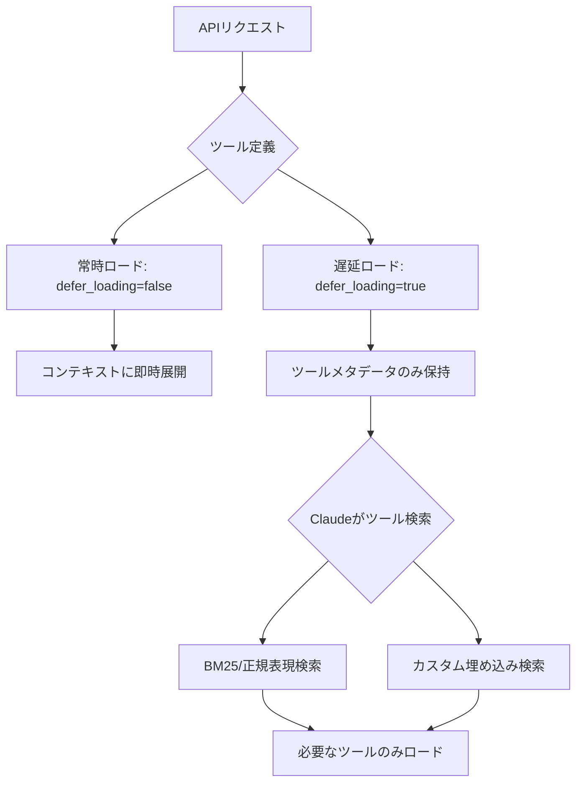
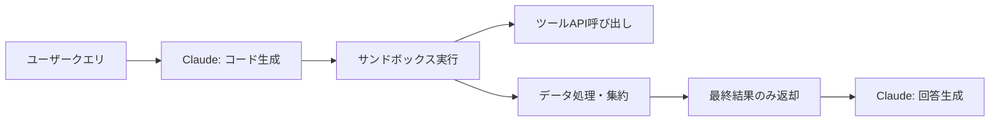

本記事は [Anthropic Engineering Blog: Introducing advanced tool use on the Claude Developer Platform](https://www.anthropic.com/engineering/advanced-tool-use)（2025年11月24日公開）の解説記事です。

## ブログ概要（Summary）

Anthropicは2025年11月にClaude Developer Platformへ3つのAdvanced Tool Use機能をベータリリースした。（1）**Tool Search Tool**: 大量のツール定義を動的に検索し、必要なツールだけをコンテキストにロードする仕組み。（2）**Programmatic Tool Calling（PTC）**: Claudeがツール呼び出しを個別に行う代わりにPythonコードを生成し、サンドボックス環境で一括実行する方式。（3）**Tool Use Examples**: JSON Schemaだけでは表現できないツールの使用パターンを具体例で提示する機能。これらの機能により、トークン使用量の85%削減やツール呼び出し精度の向上が報告されている。

この記事は [Zenn記事: Anthropic Python SDKでClaude APIを実践活用する実装ガイド](https://zenn.dev/0h_n0/articles/f1f840e7205f2b) の深掘りです。

## 情報源

- **種別**: 企業テックブログ（Anthropic Engineering Blog）
- **URL**: [https://www.anthropic.com/engineering/advanced-tool-use](https://www.anthropic.com/engineering/advanced-tool-use)
- **組織**: Anthropic（Claude Developer Platform チーム）
- **発表日**: 2025年11月24日
- **著者**: Bin Wu（リード）、Adam Jones、Artur Renault、Henry Tay、Jake Noble、Noah Picard、Sam Jiang

## 技術的背景（Technical Background）

LLMのTool Use（Function Calling）は、モデルが外部のAPIや関数を呼び出す機能であり、LLM単体では対応できない計算・検索・データ操作等のタスクを委譲する仕組みである。Zenn記事では`@beta_tool`デコレータやtool_runnerを用いた基本的なTool Useの実装を紹介しているが、本番環境ではスケーラビリティに関する3つの課題が生じる。

1. **コンテキスト枯渇**: 多数のMCPサーバー（10サーバー以上、50ツール以上）を接続すると、ツール定義だけで数万トークンを消費し、実際のタスクに使えるコンテキストが不足する
2. **中間結果の肥大化**: 複数ステップのワークフローでツールの戻り値がコンテキストに蓄積され、不要な情報がモデルの判断を阻害する
3. **パラメータ誤り**: JSON Schemaによる型定義だけでは、オプションパラメータの組み合わせや命名規則といった使用パターンを十分に伝えられない

これらの課題は、ブログの著者らによると「MCPエコシステムの急成長に伴い顕在化した」ものであり、2025年時点で10,000以上のアクティブなMCPサーバーが存在する環境で特に深刻だとされている。

## 実装アーキテクチャ（Architecture）

### Tool Search Tool: 動的ツール発見

Tool Search Toolは、すべてのツール定義をAPIに渡しつつ、`defer_loading: true`を指定して初期ロードを遅延させる仕組みである。



**トークン効率の改善**: ブログの報告によると、5つのMCPサーバー（GitHub: 35ツール約26Kトークン、Slack: 11ツール約21Kトークン、Sentry: 5ツール約3Kトークン、Grafana: 5ツール約3Kトークン、Splunk: 2ツール約2Kトークン）の構成において、従来の全ツールロードでは約55Kトークンを消費するのに対し、Tool Search Toolでは約8.7Kトークンに削減された。これはコンテキストウィンドウの**85%の節約**に相当する。

**精度改善**: ブログの報告値では、以下の改善が確認されている。

| モデル | Tool Search なし | Tool Search あり | 改善幅 |
|--------|-----------------|-----------------|--------|
| Opus 4 | 49.0% | 74.0% | +25.0pt |
| Opus 4.5 | 79.5% | 88.1% | +8.6pt |

実装においては、使用頻度の高い3-5個のツールは`defer_loading: false`で常時ロードし、残りを遅延ロードにすることが推奨されている。また、Prompt Cachingとの互換性があり、遅延ツールは初期キャッシュから除外される。

### Programmatic Tool Calling（PTC）: コード生成によるツール実行

PTCはClaudeがツール呼び出しを個別のAPIリクエストとして発行する代わりに、Pythonコードを生成してサンドボックス環境（Code Execution）で実行する方式である。



**従来方式との比較**: ブログでは「Q3の旅費予算を超過したメンバーは誰か」というタスクの例が紹介されている。

| 項目 | 従来方式 | PTC方式 |
|------|---------|---------|
| API往復 | 20+回（各メンバーの経費取得） | 1回（コード実行） |
| コンテキスト消費 | 50KB+（2,000+経費明細） | 1KB（超過者2-3名の結果のみ） |
| 推論パス | 19+パス | 1パス |
| トークン使用量 | 43,588トークン（平均） | 27,297トークン（平均） |
| 削減率 | - | **37%削減** |

ブログによると、PTCでは`asyncio`による並列実行がサポートされ、独立した操作を同時に処理できる。実装時には`code_execution_20250825`ツールタイプを追加し、対象ツールに`allowed_callers: ["code_execution_20250825"]`を設定する。

**ベンチマーク結果**（ブログ記載値）:
- 内部知識検索タスク: 25.6% → 28.5%（+2.9pt）
- GIAベンチマーク: 46.5% → 51.2%（+4.7pt）

### Tool Use Examples: 使用パターンの明示

JSON Schemaは型・必須フィールド・許容値の定義には有効だが、ブログの著者らは「いつオプションパラメータを含めるべきか、どの組み合わせが妥当か、APIがどんな規則を期待しているか」を表現できないと指摘している。Tool Use Examplesは具体的な入出力の例を提供することで、この問題を解決する。

**精度への影響**: ブログの報告によると、内部テストにおいて複雑なパラメータ処理の精度が72%から90%へ改善された（+18pt）。

**ベストプラクティス**:
- 現実的なデータを使用（実際の都市名、妥当な価格等）
- バリエーションを示す: 最小、部分的、完全な指定パターン
- ツールあたり1-5例に絞る
- 曖昧さのある領域にのみ焦点を当てる

## パフォーマンス最適化（Performance）

### トークン効率の総合比較

ブログの報告値を統合すると、3つの機能を組み合わせた場合のトークン削減効果は以下の通りである。

| 機能 | 削減対象 | 削減率（ブログ報告値） |
|------|---------|---------------------|
| Tool Search Tool | ツール定義のコンテキスト消費 | 85%削減 |
| PTC | 中間結果のコンテキスト消費 | 37%削減（平均） |
| Tool Use Examples | パラメータ誤りによるリトライ | 精度72%→90% |

### レイテンシへの影響

PTCにおいては、各API往復に推論パス（数百ミリ秒〜数秒）が必要であった従来方式に対し、1回のコード実行ブロックで処理を完結させることで、レイテンシを大幅に削減できるとブログは説明している。ただし、コード生成と実行のオーバーヘッドが存在するため、単純なツール呼び出し（1-2回）ではPTCのメリットは限定的である。

### 実運用事例

ブログでは「Claude for Excel」がPTCを使用して「数千行のスプレッドシートをモデルのコンテキストウィンドウに過負荷をかけることなく読み書きしている」事例が紹介されている。

## 運用での学び（Production Lessons）

### 段階的な導入戦略

ブログの著者らは、3つの機能を同時に導入するのではなく、最大のボトルネックから段階的に適用することを推奨している。

| ボトルネック | 推奨機能 | 適用条件 |
|-------------|---------|---------|
| コンテキスト枯渇 | Tool Search Tool | ツール10個以上、10Kトークン以上 |
| 中間結果の肥大化 | PTC | 多段階ワークフロー、大規模データ集約 |
| パラメータ誤り | Tool Use Examples | 複雑なネスト構造、オプションパラメータ |

### API利用上の注意点

ブログ記載の制約事項を整理する。

1. **ベータヘッダー必須**: `betas=["advanced-tool-use-2025-11-20"]`の指定が必要
2. **推奨モデル**: `claude-sonnet-4-5-20250929`（ブログ記載の推奨値）
3. **PTCの制約**: 冪等でない操作（削除、更新等）はPTCに含めるべきではない。ブログでは「opt-in only idempotent, parallelizable operations」と明記されている
4. **Tool Search の検索品質**: ツール名と説明文が明確で記述的であることが必要。曖昧な名前は検索精度を低下させる

### 障害リスクと対策

PTCではサンドボックス環境でコードが実行されるため、外部API呼び出しの失敗はコード内でのエラーハンドリングに依存する。ブログでは「ツールの戻り値フォーマットを明確にドキュメント化すること」が強調されている。これにより、生成されたコードでのパース失敗を防止できる。

## 学術研究との関連（Academic Connection）

ブログでは、この取り組みが「Chris Gorgolewski、Daniel Jiang、Jeremy Fox、Mike Lambertによる基礎研究の上に構築されている」と記載されている。また、インスピレーション源として「Joel PobarのLLMVM、CloudflareのCode Mode、Code Execution as MCP」が挙げられている。

学術的な文脈では、Toolformer（Schick et al., 2023）が提示した「LMが自律的にツール利用を学習する」というパラダイムの実用化・スケーリングの試みとして位置づけられる。Toolformerが5つのツールを自己教師ありで学習するアプローチだったのに対し、Anthropicの手法は数千のツールをMCPプロトコル経由で動的に管理する産業規模のソリューションである。

## まとめと実践への示唆

Anthropicの3つのAdvanced Tool Use機能は、LLMベースのエージェントが多数のツールを効率的に利用するための実用的な解決策を提供している。Zenn記事で紹介した基本的なTool Use（`@beta_tool`、`tool_runner`）は少数のツールでの利用には十分だが、本番環境で10以上のツールやMCPサーバーを扱う場合には、本ブログで紹介された機能の導入を検討すべきである。

特にPTCは、Zenn記事のMessage Batches API（コスト50%削減）やPrompt Caching（最大90%削減）と組み合わせることで、さらなるコスト最適化が可能である。ただし、PTCはベータ機能であり、API仕様の変更が想定されるため、本番導入時はバージョン固定とフォールバック設計が推奨される。

## Production Deployment Guide

### AWS実装パターン（コスト最適化重視）

本ブログで紹介されたAdvanced Tool Use機能をAWS上でデプロイする際の構成を、トラフィック量別に整理する。

**トラフィック量別の推奨構成**:

| 規模 | 月間リクエスト | 推奨構成 | 月額コスト概算 | 主要サービス |
|------|--------------|---------|-------------|------------|
| **Small** | ~3,000 (100/日) | Serverless | $50-150 | Lambda + Bedrock + DynamoDB |
| **Medium** | ~30,000 (1,000/日) | Hybrid | $300-800 | Lambda + ECS Fargate + ElastiCache |
| **Large** | 300,000+ (10,000/日) | Container | $2,000-5,000 | EKS + Karpenter + EC2 Spot |

**Small構成の詳細**（月額$50-150）:
- **Lambda**: 1GB RAM、60秒タイムアウト（$20/月）
- **Bedrock**: Claude 3.5 Haiku、Prompt Caching有効（$80/月）
- **DynamoDB**: On-Demand、ツール定義キャッシュ用（$10/月）
- **CloudWatch**: 基本監視（$5/月）
- **API Gateway**: REST API（$5/月）

**コスト削減テクニック**:
- Spot Instances使用で最大90%削減（EKS + Karpenter）
- Bedrock Batch API使用で50%削減（非リアルタイム処理）
- Prompt Caching有効化で30-90%削減（ツール定義の共通部分キャッシュ）
- Tool Search ToolによるPrompt Cachingとの併用で、遅延ツールをキャッシュから除外しキャッシュヒット率を向上

**コスト試算の注意事項**: 上記は2026年3月時点のAWS ap-northeast-1（東京）リージョン料金に基づく概算値です。実際のコストはトラフィックパターン、リージョン、バースト使用量により変動します。最新料金は [AWS料金計算ツール](https://calculator.aws/) で確認してください。

### Terraformインフラコード

**Small構成 (Serverless): Lambda + Bedrock + DynamoDB**

```hcl
module "vpc" {
  source  = "terraform-aws-modules/vpc/aws"
  version = "~> 5.0"

  name = "tool-use-vpc"
  cidr = "10.0.0.0/16"
  azs  = ["ap-northeast-1a", "ap-northeast-1c"]
  private_subnets = ["10.0.1.0/24", "10.0.2.0/24"]

  enable_nat_gateway   = false
  enable_dns_hostnames = true
}

resource "aws_iam_role" "lambda_bedrock" {
  name = "lambda-bedrock-tool-use-role"

  assume_role_policy = jsonencode({
    Version = "2012-10-17"
    Statement = [{
      Action    = "sts:AssumeRole"
      Effect    = "Allow"
      Principal = { Service = "lambda.amazonaws.com" }
    }]
  })
}

resource "aws_iam_role_policy" "bedrock_invoke" {
  role = aws_iam_role.lambda_bedrock.id
  policy = jsonencode({
    Version = "2012-10-17"
    Statement = [{
      Effect   = "Allow"
      Action   = ["bedrock:InvokeModel", "bedrock:InvokeModelWithResponseStream"]
      Resource = "arn:aws:bedrock:ap-northeast-1::foundation-model/anthropic.claude-*"
    }]
  })
}

resource "aws_lambda_function" "tool_use_handler" {
  filename      = "lambda.zip"
  function_name = "advanced-tool-use-handler"
  role          = aws_iam_role.lambda_bedrock.arn
  handler       = "index.handler"
  runtime       = "python3.12"
  timeout       = 60
  memory_size   = 1024

  environment {
    variables = {
      BEDROCK_MODEL_ID    = "anthropic.claude-3-5-haiku-20241022-v1:0"
      DYNAMODB_TABLE      = aws_dynamodb_table.tool_cache.name
      ENABLE_TOOL_SEARCH  = "true"
    }
  }
}

resource "aws_dynamodb_table" "tool_cache" {
  name         = "tool-definition-cache"
  billing_mode = "PAY_PER_REQUEST"
  hash_key     = "tool_name"

  attribute {
    name = "tool_name"
    type = "S"
  }

  ttl {
    attribute_name = "expire_at"
    enabled        = true
  }
}

resource "aws_cloudwatch_metric_alarm" "lambda_cost" {
  alarm_name          = "tool-use-lambda-cost-spike"
  comparison_operator = "GreaterThanThreshold"
  evaluation_periods  = 1
  metric_name         = "Duration"
  namespace           = "AWS/Lambda"
  period              = 3600
  statistic           = "Sum"
  threshold           = 100000
  alarm_description   = "Lambda実行時間異常（コスト急増の可能性）"

  dimensions = {
    FunctionName = aws_lambda_function.tool_use_handler.function_name
  }
}
```

**Large構成 (Container): EKS + Karpenter + Spot Instances**

```hcl
module "eks" {
  source  = "terraform-aws-modules/eks/aws"
  version = "~> 20.0"

  cluster_name    = "tool-use-cluster"
  cluster_version = "1.31"
  vpc_id          = module.vpc.vpc_id
  subnet_ids      = module.vpc.private_subnets

  cluster_endpoint_public_access = true
  enable_cluster_creator_admin_permissions = true
}

resource "kubectl_manifest" "karpenter_provisioner" {
  yaml_body = <<-YAML
    apiVersion: karpenter.sh/v1alpha5
    kind: Provisioner
    metadata:
      name: spot-provisioner
    spec:
      requirements:
        - key: karpenter.sh/capacity-type
          operator: In
          values: ["spot"]
        - key: node.kubernetes.io/instance-type
          operator: In
          values: ["m7i.xlarge", "m7i.2xlarge"]
      limits:
        resources:
          cpu: "32"
          memory: "128Gi"
      ttlSecondsAfterEmpty: 30
  YAML
}

resource "aws_budgets_budget" "tool_use_monthly" {
  name         = "tool-use-monthly-budget"
  budget_type  = "COST"
  limit_amount = "5000"
  limit_unit   = "USD"
  time_unit    = "MONTHLY"

  notification {
    comparison_operator        = "GREATER_THAN"
    threshold                  = 80
    threshold_type             = "PERCENTAGE"
    notification_type          = "ACTUAL"
    subscriber_email_addresses = ["ops@example.com"]
  }
}
```

### セキュリティベストプラクティス

1. **ネットワーク**: EKSは`cluster_endpoint_public_access = false`推奨（VPN経由）
2. **IAM**: 最小権限、Bedrockモデルを限定指定
3. **シークレット**: Secrets Manager使用、環境変数ハードコード禁止
4. **暗号化**: S3/DynamoDB/EBS全てKMS暗号化
5. **監査**: CloudTrail/Config有効化

### 運用・監視設定

```python
import boto3

cloudwatch = boto3.client('cloudwatch')

cloudwatch.put_metric_alarm(
    AlarmName='bedrock-token-spike',
    ComparisonOperator='GreaterThanThreshold',
    EvaluationPeriods=1,
    MetricName='TokenUsage',
    Namespace='AWS/Bedrock',
    Period=3600,
    Statistic='Sum',
    Threshold=500000,
    ActionsEnabled=True,
    AlarmActions=['arn:aws:sns:ap-northeast-1:123456789:cost-alerts'],
    AlarmDescription='Bedrockトークン使用量異常'
)
```

### コスト最適化チェックリスト

- [ ] ~100 req/日 → Lambda + Bedrock (Serverless) - $50-150/月
- [ ] ~1000 req/日 → ECS Fargate + Bedrock (Hybrid) - $300-800/月
- [ ] 10000+ req/日 → EKS + Spot Instances (Container) - $2,000-5,000/月
- [ ] EC2: Spot Instances優先（最大90%削減）
- [ ] Bedrock Batch API: 50%割引
- [ ] Prompt Caching: 30-90%削減
- [ ] Tool Search Tool: コンテキスト85%削減でPrompt Cachingとの相乗効果
- [ ] Lambda: メモリサイズ最適化
- [ ] ECS/EKS: アイドルタイムのスケールダウン
- [ ] AWS Budgets: 月額予算設定（80%警告、100%アラート）
- [ ] CloudWatch アラーム: トークン使用量スパイク検知
- [ ] Cost Anomaly Detection: 自動異常検知
- [ ] 日次コストレポート: SNS/Slackへ自動送信
- [ ] 未使用リソース削除: Trusted Advisor活用
- [ ] タグ戦略: 環境別（dev/staging/prod）でコスト可視化
- [ ] ライフサイクルポリシー: S3古いキャッシュ自動削除（30日）
- [ ] 開発環境は夜間停止
- [ ] Reserved Instances: 1年コミットで72%削減（安定負荷）
- [ ] Savings Plans: Compute Savings Plans検討
- [ ] PTC活用によるAPI往復削減でBedrock課金を抑制

## 参考文献

- **Blog URL**: [https://www.anthropic.com/engineering/advanced-tool-use](https://www.anthropic.com/engineering/advanced-tool-use)
- **Claude API Tool Use Docs**: [https://platform.claude.com/docs/en/agents-and-tools/tool-use/overview](https://platform.claude.com/docs/en/agents-and-tools/tool-use/overview)
- **Related Paper**: Schick et al., "Toolformer: Language Models Can Teach Themselves to Use Tools," NeurIPS 2023, [arXiv:2302.04761](https://arxiv.org/abs/2302.04761)
- **Related Zenn article**: [https://zenn.dev/0h_n0/articles/f1f840e7205f2b](https://zenn.dev/0h_n0/articles/f1f840e7205f2b)

---

:::message
この記事はAI（Claude Code）により自動生成されました。内容の正確性については情報源を基に検証していますが、最新の仕様は公式ドキュメントをご確認ください。
:::
