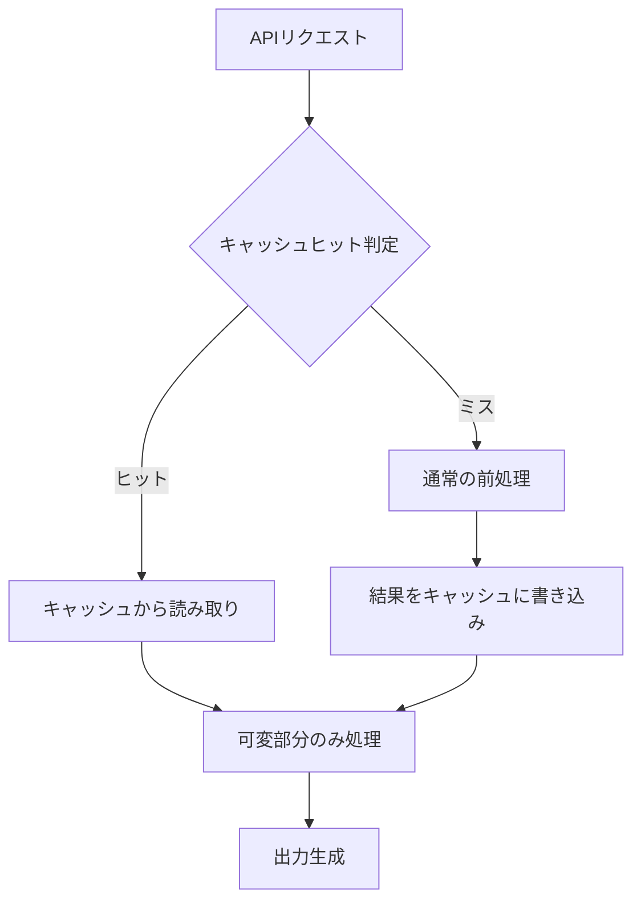

本記事は [Anthropic Blog: Prompt caching with Claude](https://www.anthropic.com/news/prompt-caching)（2024年8月14日公開、2024年12月17日GA）の解説記事です。

## ブログ概要（Summary）

AnthropicはClaude APIにPrompt Caching機能を導入し、APIリクエスト間で共通するプロンプト部分をサーバー側でキャッシュして再利用する仕組みを提供している。公式ブログによると、長いプロンプトで**最大90%のコスト削減**と**最大85%のレイテンシ削減**が報告されている。2024年8月にベータ版として公開され、2024年12月17日にGeneral Availability（GA）となった。5分間のTTL（標準）と1時間のTTL（拡張）の2つのキャッシュ寿命オプションが提供されている。

この記事は [Zenn記事: Anthropic Python SDKでClaude APIを実践活用する実装ガイド](https://zenn.dev/0h_n0/articles/f1f840e7205f2b) の深掘りです。

## 情報源

- **種別**: 企業テックブログ（Anthropic公式ブログ）
- **URL**: [https://www.anthropic.com/news/prompt-caching](https://www.anthropic.com/news/prompt-caching)
- **組織**: Anthropic
- **発表日**: 2024年8月14日（初公開）、2024年12月17日（GA）

## 技術的背景（Technical Background）

LLM APIにおいてプロンプトの処理コストは入力トークン数に比例する。システムプロンプト、ドキュメントのコンテキスト、Few-shot examples等の共通部分は、リクエストごとに再処理されるため、会話型アプリケーションや大規模ドキュメント処理では冗長な計算コストが発生する。

Zenn記事ではPrompt Cachingの基本的な使い方（`cache_control`パラメータ）を紹介しているが、本記事ではキャッシュの料金体系、ヒット条件、ユースケース別のパフォーマンス数値を深掘りする。

### なぜPrompt Cachingが必要か

通常のClaude API呼び出しでは、入力トークンは毎回モデルの前処理パイプライン（トークナイズ、埋め込み、Attention計算）を通過する。同じシステムプロンプトを含む100回のAPI呼び出しでは、そのプロンプト部分の処理が100回繰り返される。Prompt Cachingはこの冗長処理を排除し、初回の処理結果をサーバー側に保持して後続リクエストで再利用する。



## 実装アーキテクチャ（Architecture）

### キャッシュヒットの条件

公式ドキュメントによると、キャッシュのヒット判定は**バイト単位の完全なプレフィックス一致**で行われる。以下の条件をすべて満たす必要がある。

1. **プレフィックス一致**: リクエストの先頭からキャッシュブレークポイントまでのコンテンツが完全に一致すること
2. **モデル一致**: 同一モデルへのリクエストであること
3. **TTL内**: キャッシュの有効期限内であること

**重要な制約**: キャッシュはリクエストの先頭から連続するブロックに対して適用される。Zenn記事でも注意点として記載した通り、途中のブロックだけをキャッシュすることはできない。プロンプトの微小な変更でもキャッシュミスになるため、動的に変わる部分はキャッシュ対象ブロックの**後方**に配置する設計が必要である。

### 2つのTTLオプション

公式ブログおよびドキュメントによると、2つのTTLオプションが提供されている。

| TTL | キャッシュ書き込みコスト | キャッシュ読み取りコスト | 有効期間 | 用途 |
|-----|---------------------|---------------------|---------|------|
| 5分（標準） | 基本入力料金の1.25倍 | 基本入力料金の0.1倍 | 5分間 | 会話、短期タスク |
| 1時間（拡張） | 基本入力料金の2.0倍 | 基本入力料金の0.1倍 | 1時間 | エージェントワークフロー |

公式ブログでは、1時間TTLは「5分TTLの12倍の改善」であり、「長時間実行されるエージェントワークフローのコスト削減に効果的」と記載されている。

### 損益分岐点の分析

5分TTLの場合のコスト構造を数式で表現する。

通常の2回リクエストのコスト:

$$
C_{\text{normal}} = 2 \times P_{\text{input}} \times T_{\text{cached}}
$$

キャッシュ利用時の2回リクエストのコスト:

$$
C_{\text{cached}} = 1.25 \times P_{\text{input}} \times T_{\text{cached}} + 0.1 \times P_{\text{input}} \times T_{\text{cached}}
$$

$$
C_{\text{cached}} = 1.35 \times P_{\text{input}} \times T_{\text{cached}}
$$

ここで、
- $P_{\text{input}}$: モデルの基本入力料金（$/MTok）
- $T_{\text{cached}}$: キャッシュ対象のトークン数

したがって、$C_{\text{cached}} < C_{\text{normal}}$ より、**1回のキャッシュ読み取りで元が取れる**（$1.35 < 2.0$）。Zenn記事のコスト分析と一致する。

1時間TTLの場合:

$$
C_{\text{cached\_1h}} = 2.0 \times P_{\text{input}} \times T_{\text{cached}} + 0.1 \times P_{\text{input}} \times T_{\text{cached}} = 2.1 \times P_{\text{input}} \times T_{\text{cached}}
$$

1時間TTLでは**2回のキャッシュ読み取りで元が取れる**（書き込み2.0倍 + 読み取り2回×0.1倍 = 2.2倍 < 通常3回分の3.0倍）。

## パフォーマンス最適化（Performance）

### ユースケース別ベンチマーク

公式ブログの報告値を整理する。

| ユースケース | キャッシュなしレイテンシ | キャッシュありレイテンシ | レイテンシ削減 | コスト削減 |
|------------|---------------------|---------------------|-------------|----------|
| 書籍との対話（100Kトークン） | 11.5秒 | 2.4秒 | **79%** | **90%** |
| Many-shot prompting（10Kトークン） | 1.6秒 | 1.1秒 | **31%** | **86%** |
| マルチターン会話（10ターン） | 約10秒 | 約2.5秒 | **75%** | **53%** |

注目すべきは、100Kトークンの書籍コンテキストで90%のコスト削減が報告されている点である。これは、大量のドキュメントをシステムプロンプトに含めるRAGパイプラインにおいて特に有効である。

### モデル別料金体系

公式ブログおよび価格ページの記載値に基づく（5分TTL）。

| モデル | 基本入力 | キャッシュ書き込み | キャッシュ読み取り | 出力 |
|--------|---------|-----------------|-----------------|------|
| Claude 3.5 Sonnet | $3.00/MTok | $3.75/MTok | $0.30/MTok | $15.00/MTok |
| Claude 3 Opus | $15.00/MTok | $18.75/MTok | $1.50/MTok | $75.00/MTok |
| Claude 3 Haiku | $0.25/MTok | $0.30/MTok | $0.03/MTok | $1.25/MTok |

**コスト削減の具体例**: Claude 3.5 Sonnetで10Kトークンのシステムプロンプトを100回のリクエストで使用する場合。

- キャッシュなし: $3.00 × 10K × 100 / 1M = **$3.00**
- キャッシュあり: $3.75 × 10K / 1M + $0.30 × 10K × 99 / 1M = $0.0375 + $0.297 = **$0.33**（約89%削減）

## 運用での学び（Production Lessons）

### 主要ユースケースと設計パターン

公式ブログで紹介されている6つのユースケースを、Zenn記事の内容と関連付けて整理する。

1. **会話型エージェント**: Zenn記事のTool Useと組み合わせ、システムプロンプト+ツール定義をキャッシュ
2. **コーディングアシスタント**: リポジトリのコンテキストをキャッシュし、質問ごとの処理を軽量化
3. **大規模ドキュメント処理**: 書籍・論文の全文をキャッシュし、繰り返し参照
4. **詳細な指示セット**: Zenn記事のMessage Batches APIとの併用。バッチ処理でも共通プロンプトをキャッシュ可能
5. **エージェント型検索・ツール利用**: 複数回のツール呼び出しラウンドで共通部分をキャッシュ
6. **ナレッジベース統合**: ドキュメント、ポッドキャスト書き起こし等の埋め込み

### よくある誤りと対策

Zenn記事のFAQセクションでも触れている「キャッシュがヒットしない」問題について、より詳細な原因と対策を整理する。

| 原因 | 症状 | 対策 |
|------|------|------|
| プロンプトの微小変更 | `cache_read_input_tokens`が常に0 | 動的部分をキャッシュブレークポイントの後方に配置 |
| TTL切れ | 間欠的にキャッシュミス | 1時間TTLの使用、リクエスト間隔の調整 |
| モデル変更 | バージョンアップ時にキャッシュ無効化 | モデルIDをバージョン固定 |
| 最小トークン閾値未満 | 短いプロンプトでキャッシュ不発 | キャッシュ対象は十分な長さ（1024トークン以上推奨）を確保 |

### `usage`プロパティによるキャッシュ効果の計測

```python
from anthropic import Anthropic

client = Anthropic()

message = client.messages.create(
    model="claude-sonnet-4-6",
    max_tokens=1024,
    cache_control={"type": "ephemeral"},
    system="大規模なシステムプロンプト...",
    messages=[{"role": "user", "content": "質問"}],
)

usage = message.usage
print(f"入力トークン: {usage.input_tokens}")

if hasattr(usage, "cache_creation_input_tokens"):
    print(f"キャッシュ書き込み: {usage.cache_creation_input_tokens}")
if hasattr(usage, "cache_read_input_tokens"):
    print(f"キャッシュ読み取り: {usage.cache_read_input_tokens}")

# キャッシュヒット率の計算
cache_read = getattr(usage, "cache_read_input_tokens", 0)
total_input = usage.input_tokens + cache_read
hit_rate = cache_read / total_input if total_input > 0 else 0
print(f"キャッシュヒット率: {hit_rate:.1%}")
```

## 学術研究との関連（Academic Connection）

Prompt Cachingの概念は、分散システムにおけるキャッシュ戦略（LRU、TTLベース）と深い関連がある。LLM推論の文脈では、KVキャッシュ（Key-Value Cache）の管理がPrompt Cachingの基盤技術として位置づけられる。

vLLM（Kwon et al., 2023, "Efficient Memory Management for Large Language Model Serving with PagedAttention"）で提案されたPagedAttentionは、KVキャッシュをページ単位で管理し、メモリ効率を改善した。AnthropicのPrompt Cachingは、このKVキャッシュ管理をAPI層に抽象化し、開発者がキャッシュの内部構造を意識せずに利用できるようにしたものと解釈できる。

また、OpenAIも2024年10月にPrompt Caching機能をリリースしており、1024トークン以上のプレフィックスで自動キャッシュが有効になる。両社のアプローチの違いとして、AnthropicはTTLの明示的な選択（5分/1時間）を提供するのに対し、OpenAIは自動キャッシュ方式を採用している。

## まとめと実践への示唆

Prompt Cachingは、Claude APIのコスト最適化において即効性の高い機能の一つである。Zenn記事で紹介したMessage Batches API（50%コスト削減）と組み合わせることで、バッチ処理での共通プロンプト部分もキャッシュされ、さらなるコスト削減が可能になる。

実践的な推奨事項として、以下の3点を挙げる。

1. **システムプロンプトの固定化**: 動的部分を分離し、キャッシュ可能な部分を最大化する
2. **`usage`プロパティの監視**: 本番環境ではキャッシュヒット率を継続的に監視し、ミスが多い場合はプロンプト構造を見直す
3. **TTLの適切な選択**: 短期タスク（チャット）は5分TTL、長期タスク（エージェント）は1時間TTL

## Production Deployment Guide

### AWS実装パターン（コスト最適化重視）

Prompt Cachingを活用するAWS構成を、トラフィック量別に整理する。

**トラフィック量別の推奨構成**:

| 規模 | 月間リクエスト | 推奨構成 | 月額コスト概算 | 主要サービス |
|------|--------------|---------|-------------|------------|
| **Small** | ~3,000 (100/日) | Serverless | $50-150 | Lambda + Bedrock + DynamoDB |
| **Medium** | ~30,000 (1,000/日) | Hybrid | $300-800 | Lambda + ECS Fargate + ElastiCache |
| **Large** | 300,000+ (10,000/日) | Container | $2,000-5,000 | EKS + Karpenter + EC2 Spot |

**Prompt Caching特有の設計ポイント**:
- **ElastiCache Redis**: プロンプトテンプレートとキャッシュ状態の管理（Medium/Large構成）
- **DynamoDB**: キャッシュヒット率の時系列メトリクス保存
- **CloudWatch Custom Metrics**: `cache_read_input_tokens`と`cache_creation_input_tokens`の監視

**コスト削減テクニック**:
- Prompt Caching有効化で30-90%入力トークンコスト削減
- Message Batches API併用で更に50%削減
- Spot Instances使用で最大90%削減（EKS + Karpenter）

**コスト試算の注意事項**: 上記は2026年3月時点のAWS ap-northeast-1（東京）リージョン料金に基づく概算値です。最新料金は [AWS料金計算ツール](https://calculator.aws/) で確認してください。

### Terraformインフラコード

**Small構成 (Serverless): Lambda + Bedrock + DynamoDB**

```hcl
module "vpc" {
  source  = "terraform-aws-modules/vpc/aws"
  version = "~> 5.0"

  name = "prompt-cache-vpc"
  cidr = "10.0.0.0/16"
  azs  = ["ap-northeast-1a", "ap-northeast-1c"]
  private_subnets = ["10.0.1.0/24", "10.0.2.0/24"]

  enable_nat_gateway   = false
  enable_dns_hostnames = true
}

resource "aws_iam_role" "lambda_bedrock" {
  name = "lambda-prompt-cache-role"
  assume_role_policy = jsonencode({
    Version = "2012-10-17"
    Statement = [{
      Action    = "sts:AssumeRole"
      Effect    = "Allow"
      Principal = { Service = "lambda.amazonaws.com" }
    }]
  })
}

resource "aws_iam_role_policy" "bedrock_invoke" {
  role = aws_iam_role.lambda_bedrock.id
  policy = jsonencode({
    Version = "2012-10-17"
    Statement = [{
      Effect   = "Allow"
      Action   = ["bedrock:InvokeModel", "bedrock:InvokeModelWithResponseStream"]
      Resource = "arn:aws:bedrock:ap-northeast-1::foundation-model/anthropic.claude-*"
    }]
  })
}

resource "aws_lambda_function" "prompt_cache_handler" {
  filename      = "lambda.zip"
  function_name = "prompt-cache-handler"
  role          = aws_iam_role.lambda_bedrock.arn
  handler       = "index.handler"
  runtime       = "python3.12"
  timeout       = 60
  memory_size   = 1024

  environment {
    variables = {
      BEDROCK_MODEL_ID     = "anthropic.claude-3-5-haiku-20241022-v1:0"
      DYNAMODB_TABLE       = aws_dynamodb_table.cache_metrics.name
      ENABLE_PROMPT_CACHE  = "true"
      CACHE_TTL            = "ephemeral"
    }
  }
}

resource "aws_dynamodb_table" "cache_metrics" {
  name         = "prompt-cache-metrics"
  billing_mode = "PAY_PER_REQUEST"
  hash_key     = "request_id"
  range_key    = "timestamp"

  attribute {
    name = "request_id"
    type = "S"
  }
  attribute {
    name = "timestamp"
    type = "N"
  }

  ttl {
    attribute_name = "expire_at"
    enabled        = true
  }
}
```

### 運用・監視設定

```python
import boto3

cloudwatch = boto3.client('cloudwatch')

cloudwatch.put_metric_alarm(
    AlarmName='prompt-cache-miss-rate-high',
    ComparisonOperator='LessThanThreshold',
    EvaluationPeriods=3,
    MetricName='CacheHitRate',
    Namespace='Custom/PromptCache',
    Period=300,
    Statistic='Average',
    Threshold=0.5,
    AlarmDescription='Prompt Cacheヒット率低下 - プロンプト構造の見直しが必要'
)

cloudwatch.put_metric_alarm(
    AlarmName='bedrock-token-cost-spike',
    ComparisonOperator='GreaterThanThreshold',
    EvaluationPeriods=1,
    MetricName='TokenUsage',
    Namespace='AWS/Bedrock',
    Period=3600,
    Statistic='Sum',
    Threshold=500000,
    AlarmDescription='Bedrockトークン使用量異常'
)
```

### コスト最適化チェックリスト

- [ ] ~100 req/日 → Lambda + Bedrock (Serverless) - $50-150/月
- [ ] ~1000 req/日 → ECS Fargate + Bedrock (Hybrid) - $300-800/月
- [ ] 10000+ req/日 → EKS + Spot Instances (Container) - $2,000-5,000/月
- [ ] Prompt Caching有効化（5分 or 1時間TTL選択）
- [ ] キャッシュヒット率50%以上を目標に設定
- [ ] 動的部分をキャッシュブレークポイント後方に配置
- [ ] Message Batches API併用で50%追加削減
- [ ] Bedrock Batch API使用で50%割引
- [ ] Spot Instances優先（最大90%削減）
- [ ] Reserved Instances: 1年コミットで72%削減
- [ ] AWS Budgets: 月額予算設定（80%警告）
- [ ] CloudWatch: キャッシュヒット率の継続監視
- [ ] Cost Anomaly Detection: 自動異常検知
- [ ] 日次コストレポート: SNS/Slackへ自動送信
- [ ] 未使用リソース削除: Trusted Advisor活用
- [ ] タグ戦略: 環境別コスト可視化
- [ ] ライフサイクルポリシー: 30日でキャッシュメトリクス削除
- [ ] 開発環境は夜間停止
- [ ] Lambda メモリサイズ最適化
- [ ] `usage`プロパティの構造化ログ記録

## 参考文献

- **Blog URL**: [https://www.anthropic.com/news/prompt-caching](https://www.anthropic.com/news/prompt-caching)
- **Prompt Caching Docs**: [https://platform.claude.com/docs/en/build-with-claude/prompt-caching](https://platform.claude.com/docs/en/build-with-claude/prompt-caching)
- **Claude API Pricing**: [https://platform.claude.com/docs/en/about-claude/pricing](https://platform.claude.com/docs/en/about-claude/pricing)
- **Related Paper**: Kwon et al., "Efficient Memory Management for Large Language Model Serving with PagedAttention," SOSP 2023, [arXiv:2309.06180](https://arxiv.org/abs/2309.06180)
- **Related Zenn article**: [https://zenn.dev/0h_n0/articles/f1f840e7205f2b](https://zenn.dev/0h_n0/articles/f1f840e7205f2b)

---

:::message
この記事はAI（Claude Code）により自動生成されました。内容の正確性については情報源を基に検証していますが、最新の仕様は公式ドキュメントをご確認ください。
:::
