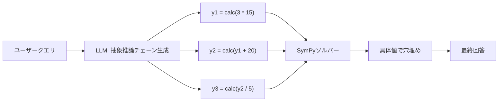

本記事は [Efficient Tool Use with Chain-of-Abstraction Reasoning](https://arxiv.org/abs/2401.17464) の解説記事です。

## 論文概要（Abstract）

Chain-of-Abstraction（CoA）は、LLMがツールを用いた多段階推論を効率的に行うための手法である。著者らは、LLMにまず**抽象的なプレースホルダを含む推論チェーン**を生成させ、その後でドメインツールを呼び出して具体的な知識を埋め込む2段階アプローチを提案している。数学的推論とWikipedia QAの両ドメインにおいて、従来のChain-of-Thought（CoT）やツール拡張ベースラインと比較して平均約6%の絶対精度改善と約1.4倍の推論速度向上を報告している。

この記事は [Zenn記事: AIエージェントのツール設計原則：LLMが正しく使えるAPIを作る7つの実践パターン](https://zenn.dev/0h_n0/articles/653751ba4303f7) の深掘りです。

## 情報源

- **arXiv ID**: 2401.17464
- **URL**: [https://arxiv.org/abs/2401.17464](https://arxiv.org/abs/2401.17464)
- **著者**: Silin Gao, Jane Dwivedi-Yu, Ping Yu, Xiaoqing Ellen Tan, Ramakanth Pasunuru et al.（Meta AI Research, EPFL）
- **発表年**: 2024（COLING 2025に採択）
- **分野**: cs.CL（Computation and Language）

## 背景と動機（Background & Motivation）

LLMが外部ツール（計算機、検索エンジン等）を呼び出す際、従来手法には2つの根本的な問題がある。第一に、**推論と知識検索が直列化される**ため、ツール応答を待つ間にLLMの推論が停止する。第二に、ツール呼び出しの結果がコンテキストに挿入されることで、**知識の変化（ドメインシフト）に対する汎化性が低下**する。

Toolformerのような既存手法では、推論の各ステップでツールを逐次呼び出すため、$n$ステップの推論に$n$回のAPI待ちが発生する。これはレイテンシの増大だけでなく、モデルが特定のツール応答パターンに過学習するリスクも生む。

著者らはこの課題に対し、「推論の構造」と「具体的な知識」を分離するアプローチを提案している。

## 主要な貢献（Key Contributions）

- **貢献1**: 推論チェーンに抽象プレースホルダを導入し、ツール呼び出しと推論生成を分離するChain-of-Abstraction（CoA）手法の提案
- **貢献2**: 数学的推論（GSM8K, ASDiv, SVAMP, MAWPS）とWikipedia QA（HotpotQA, WebQuestions, NaturalQuestions, TriviaQA）の2ドメインでの広範な実験
- **貢献3**: ツール呼び出しの並列化による推論速度の改善（約1.4倍）と、分布外データに対する汎化性の向上

## 技術的詳細（Technical Details）

### Chain-of-Abstractionのアーキテクチャ

CoAの核心は、推論を2段階に分離することにある。



**Stage 1: 抽象推論チェーンの生成**

LLMは質問に対して、具体的な計算結果や検索結果の代わりに、プレースホルダ変数（$y_1, y_2, y_3, \ldots$）を含む推論チェーンを出力する。

**Stage 2: ツールによる具体化（Reification）**

各プレースホルダに対応するツール呼び出しを実行し、具体的な値で置換する。この段階では**複数のツール呼び出しを並列実行**できるため、逐次呼び出しに比べて大幅な速度改善が得られる。

### 訓練データ構築パイプライン

著者らは以下の手順で訓練データを構築している。

1. 既存QAデータセット（GSM8K, HotpotQA）のゴールド回答を取得
2. LLaMA-70Bを用いて、回答を抽象チェーンに書き換え
3. 知識操作に対応するスパンを特定し、プレースホルダで置換
4. ドメインツールで正しさを検証
5. 検証に通過したトレースのみを保持

検証成功率は、数学ドメインで約76.6%、Wiki QAドメインで約15.9%と報告されている。Wiki QAの成功率が低い理由は、WikiSearch + NERの組み合わせによる複雑性にあると著者らは説明している。

### 損失関数

CoAの訓練は標準的な言語モデリング損失を使用する。

$$
\mathcal{L}(\theta) = -\sum_{t=1}^{T} \log p_\theta(x_t \mid x_{<t})
$$

ここで、
- $\theta$: LLMのパラメータ
- $x_t$: 時刻$t$のトークン（抽象プレースホルダを含む）
- $T$: シーケンス長

重要な点は、訓練時に**ツール実行結果ではなく抽象プレースホルダを予測する**よう学習することである。これにより、モデルは特定の知識値ではなく推論パターンを学習する。

### ドメインツールの実装

**数学ドメイン**: SymPyベースの方程式ソルバーを使用。CoAトレースからラベルされた式を抽出し、連立方程式として解く。

```python
from sympy import symbols, solve, sympify
from typing import dict

def math_tool(equation_str: str) -> dict[str, float]:
    """CoAの数学プレースホルダを具体値に変換する。

    Args:
        equation_str: SymPy形式の方程式文字列

    Returns:
        変数名から値へのマッピング
    """
    variables = symbols(extract_variables(equation_str))
    equations = parse_equations(equation_str)
    solution = solve(equations, variables)
    return {str(var): float(val) for var, val in solution.items()}
```

**Wiki QAドメイン**: BM25リトリーバー + Sentence-BERT再ランキング + SpaCy NERの組み合わせ。KILTベンチマークのWikipediaダンプからTop-10記事を検索し、6つのエンティティクラス（person, group, location, culture, date, numeral）で名前付きエンティティを抽出する。

## 実験結果（Results）

### 数学的推論

著者らは以下のベンチマークで評価を行っている。

| モデル (7B) | GSM8K | ASDiv | SVAMP | MAWPS | 平均 |
|------------|-------|-------|-------|-------|------|
| CoT-FSP | 24.03% | 40.61% | 35.20% | 54.85% | 38.67% |
| CoT-FT | 35.41% | 51.29% | 44.30% | 70.32% | 50.33% |
| Toolformer | 23.65% | 39.30% | 30.70% | 54.24% | 36.97% |
| **CoA** | **38.29%** | **55.04%** | **47.50%** | **72.42%** | **53.31%** |

（論文Table 1より、LLaMA-2-Chat-7Bでの結果）

分布内テスト（GSM8K, ASDiv）だけでなく、分布外テスト（SVAMP, MAWPS）でも一貫した改善が見られる。特にSVAMPでは CoT-FTに対して+3.2%の改善を示している。

### 推論ステップ数別の改善幅

著者らは推論ステップ数別の分析も行っている（論文Table 5より）。

| 推論ステップ数 | CoA vs CoT-FT 改善幅 |
|--------------|---------------------|
| ≤2ステップ | +0.3% |
| 3ステップ | +1.8% |
| 4ステップ | +6.7% |
| 5ステップ | +6.3% |
| >5ステップ | +4.3% |

推論が長くなるほどCoAの優位性が顕著になる。これは、抽象化によって長い推論チェーンでの誤差蓄積が軽減されるためと著者らは分析している。

### Wikipedia QA

| モデル (7B) | HotpotQA (Bridge) | HotpotQA (Comparison) | WebQuestions | NQ | TriviaQA |
|------------|-------------------|----------------------|-------------|-----|----------|
| CoT-FT | 20.13% | 32.28% | 18.95% | 13.65% | 51.78% |
| FireAct | 23.06% | 38.80% | 21.06% | 12.22% | 37.64% |
| **CoA** | **25.78%** | **37.90%** | **21.06%** | **15.15%** | **52.20%** |

（論文Table 2より）

### 推論速度の比較

論文Figure 4より、推論速度の改善は以下の通りと報告されている。

- **数学推論**: CoAはToolformerの約1.47倍高速
- **Wiki QA**: CoAは約1.33倍高速

この速度改善は、CoAがツール呼び出しを推論チェーン生成後にまとめて（場合によっては並列に）実行できるためである。

### 人間評価（GSM8K 200サンプル）

著者らは200サンプルの人間評価も実施している。

| エラータイプ | CoA | CoT-FT | CoT-FSP |
|------------|-----|--------|---------|
| 算術エラー | 0.0% | 25.2% | 17.3% |
| 推論エラー | 60.4% | 67.8% | 70.3% |

CoAでは外部ツール（SymPy）が算術を担当するため、算術エラーが完全に排除されている点が特筆される。

## 実装のポイント（Implementation）

### 訓練時の注意点

- **データバランス**: ASDiv（単一ステップ問題が多い）を除外すると、単純な問題での性能が著しく低下する。推論ステップ数のバランスが重要
- **学習率**: 7Bモデルでは$2 \times 10^{-5}$、70Bモデルでは$1 \times 10^{-5}$
- **総訓練ステップ**: 約400ステップ（有効訓練データ約2,000 QA）

### Self-Consistencyデコーディング

著者らはmajority votingによるSelf-Consistencyデコーディング（16サンプル）も検証している。

- CoA: 40.79%
- CoT-FT: 39.12%
- Toolformer: 35.25%

Self-Consistency下でも CoAの優位性は維持される。

### 実装上のハマりポイント

1. **抽象プレースホルダの一貫性**: $y_1$が$y_2$より先に定義される保証がない場合、ツール実行の依存関係が壊れる。著者らは出現順にソートするヒューリスティックを使用
2. **Wiki QAのデータ構築**: 検証成功率が15.9%と低いため、大量の候補が必要。LLaMA-70Bでの書き換え→検証パイプラインのコストが高い
3. **2段階推論の統合**: Stage 1の出力をパースしてツール呼び出しに変換する部分は、形式的な文法が必要

## 実運用への応用（Practical Applications）

CoAの設計思想は、Zenn記事で紹介されている**ツール設計原則**と密接に関連する。

### エージェントシステムでの活用

CoAの「推論と知識検索の分離」は、実際のAIエージェント開発に以下の示唆を与える。

1. **レイテンシ削減**: 複数のAPI呼び出しを並列化することで、逐次呼び出しに比べて大幅にレスポンスタイムを短縮できる
2. **ドメインシフト耐性**: 抽象的な推論パターンを学習するため、ツールのバージョン変更やAPI仕様の変更に対して頑健
3. **ツール設計の原則1（単一責務）との親和性**: CoAでは各ツール呼び出しが明確に分離されるため、ツール側も単一責務で設計するのが自然

### スケーリング戦略

- **ツール数の増加**: CoAの抽象化により、ツールの追加・変更が推論品質に影響しにくい
- **マルチドメイン展開**: 数学とQAの2ドメインで有効性が確認されており、他ドメインへの拡張が期待される

## アブレーションスタディ（Ablation Studies）

### ツールなしCoAの性能

著者らはCoAからツール実行を除去した「CoA（no Tool）」の実験も行っている。興味深いことに、ツールなしでもすべてのベースラインを上回るゼロショット汎化性能を示している。これは抽象チェーン計画そのものが、ツール利用とは独立に推論能力を向上させていることを意味する。

ただし完全なCoA（ツールあり）と比較すると全データセットで性能は低下しており、ツール実行と抽象化の両方が性能向上に寄与していることが確認されている。

### 訓練データのバランス影響

単一ステップ問題が多いASDiv サンプルを訓練データから除外すると、単一ステップデータセットでの性能が著しく劣化する。著者らは、推論ステップ長のバランスが取れた訓練データが頑健性に不可欠であると結論づけている。

### 70Bモデルでの結果

より大規模な LLaMA-2-Chat-70B での結果も報告されている（論文Table 1より）。

| モデル (70B) | GSM8K | ASDiv | SVAMP | MAWPS |
|-------------|-------|-------|-------|-------|
| CoT-FT | 60.50% | 70.53% | 63.20% | 83.66% |
| **CoA** | **62.32%** | **72.89%** | **65.80%** | **84.69%** |

70Bスケールでも一貫した改善が見られるが、7Bモデルと比較すると改善幅は縮小する傾向がある。これはベースモデルの能力が高いほど、抽象化の追加効果が相対的に小さくなることを示唆している。

## Zenn記事のツール設計原則との関連

CoAの知見は、Zenn記事で紹介されている7つの設計原則と以下のように対応する。

| CoAの設計思想 | 対応するZenn記事の原則 | 関連性 |
|-------------|-------------------|--------|
| 推論と知識検索の分離 | 原則1: 単一責務（Atomic Action） | 各ツール呼び出しが1つの知識操作に対応 |
| 抽象プレースホルダの命名 | 原則2: 一貫した命名規則 | $y_1, y_2, \ldots$の一貫した変数命名 |
| ツール呼び出し仕様の明確化 | 原則3: 簡潔で構造化された説明文 | ツールの入出力仕様が明確 |
| SymPy方程式パーサー | 原則4: 強い型付けとenum活用 | 方程式形式の厳密な型制約 |
| フラットなツール入力 | 原則5: パラメータの最小化とフラット化 | ツール入力は方程式文字列のみ |
| 検証失敗のフィードバック | 原則6: エラーの透過的伝達 | 検証不合格トレースの明示的な除外 |
| 依存変数の順序制約 | 原則7: 依存関係の明示 | $y_2$が$y_1$に依存する場合の順序保証 |

この対応関係は、CoAの成功が単にアルゴリズムの工夫だけでなく、**ツールインターフェースの設計品質**にも支えられていることを示している。

## 関連研究（Related Work）

- **Toolformer**（Schick et al., 2024）: LLMにツール呼び出しを自己教師あり学習で獲得させる手法。CoAとは異なり、推論チェーン内にツール呼び出しを直接埋め込む
- **FireAct**（Chen et al., 2023）: GPT-4から蒸留したReActトラジェクトリで微調整する手法。HotpotQAに特化した設計
- **ReAct**（Yao et al., 2023）: 推論と行動を交互に行うフレームワーク。CoAが推論を一括生成するのに対し、ReActは各ステップで推論→行動→観察のサイクルを繰り返す

## まとめと今後の展望

CoAは「推論構造の学習」と「知識検索の実行」を分離することで、ツール利用の効率性と汎化性を同時に改善する手法である。著者らの実験では、数学推論で平均約3%、Wiki QAで平均約2-5%の精度改善と、約1.4倍の推論速度向上が報告されている。

今後の研究方向として、（1）より多くのドメインへの適用、（2）抽象化の粒度の自動調整、（3）大規模ツールライブラリとの統合が挙げられる。特にAnthropicのTool Search Toolのような動的ツール発見と組み合わせることで、CoAの実用性がさらに高まることが期待される。

## 参考文献

- **arXiv**: [https://arxiv.org/abs/2401.17464](https://arxiv.org/abs/2401.17464)
- **ACL Anthology**: [https://aclanthology.org/2025.coling-main.185/](https://aclanthology.org/2025.coling-main.185/)
- **Related Zenn article**: [https://zenn.dev/0h_n0/articles/653751ba4303f7](https://zenn.dev/0h_n0/articles/653751ba4303f7)
