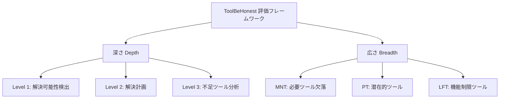
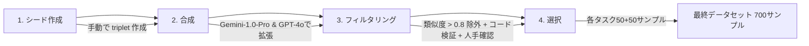

本記事は [ToolBeHonest: A Multi-level Hallucination Diagnostic Benchmark for Tool-Augmented Large Language Models](https://arxiv.org/abs/2406.20015) の解説記事です。

## 論文概要（Abstract）

ToolBeHonestは、ツール拡張LLMにおける**幻覚（Hallucination）問題を多層的に診断する**ベンチマークである。著者らは、既存のツール使用ベンチマークが「正しくツールを呼べるか」のみを評価していた点を指摘し、**深さ（Depth）と広さ（Breadth）の2次元**で幻覚を体系的に分類・評価するフレームワークを構築している。7つのサブタスク・700のベースサンプルからなるベンチマークで14モデルを評価した結果、最高スコアのGemini-1.5-Proでも45.3/100にとどまり、ツール使用における幻覚問題の深刻さを定量的に示している。本論文はEMNLP 2024に採択されている。

この記事は [Zenn記事: AIエージェントのツール設計原則：LLMが正しく使えるAPIを作る7つの実践パターン](https://zenn.dev/0h_n0/articles/653751ba4303f7) の深掘りです。

## 情報源

- **arXiv ID**: 2406.20015
- **URL**: [https://arxiv.org/abs/2406.20015](https://arxiv.org/abs/2406.20015)
- **著者**: Yuxiang Zhang et al.（12名、複数機関）
- **発表年**: 2024（EMNLP 2024に採択）
- **分野**: cs.CL, cs.AI

## 背景と動機（Background & Motivation）

ツール拡張LLMは実世界のアプリケーションに急速に統合されているが、その信頼性を評価するベンチマークには重大な盲点がある。既存のベンチマーク（API-Bank、ToolBench、BFCL等）は主に**ツール呼び出しの正確性**を評価しているが、以下の問題を見落としている。

1. **解決可能性の判断**: タスクが与えられたツールセットで本当に解決可能かを判断できるか
2. **幻覚の多様性**: 存在しないツールの呼び出し、誤ったツール選択、解決不能タスクへの誤った回答など、幻覚には複数の種類がある
3. **ツールセットの制約**: 実運用では必要なツールが常に利用可能とは限らない

著者らはこの問題を「ツール使用LLMの幻覚は、単一の指標では捉えきれない多次元的な現象である」と定式化し、深さと広さの2軸で体系的に評価するアプローチを提案している。

## 主要な貢献（Key Contributions）

- **貢献1**: 深さ（3レベル）と広さ（3シナリオ）の2次元評価フレームワークの提案
- **貢献2**: 7サブタスク・700ベースサンプルからなる高品質ベンチマークの構築
- **貢献3**: 14モデルの体系的評価による幻覚パターンの定量的分析
- **貢献4**: 5種類の幻覚エラータイプの分類と、モデル種別（プロプライエタリ vs オープンウェイト）による傾向の差異を明示

## 技術的詳細（Technical Details）

### 2次元評価フレームワーク

ToolBeHonestの核心は、ツール使用における幻覚を**深さ（Depth）**と**広さ（Breadth）**の2軸で診断する点にある。



### 深さ（Depth）: 3レベルの診断

#### Level 1: 解決可能性検出（Solvability Detection）

タスクが与えられたツールセットで解決可能かどうかの二値分類を行う。評価指標はExact Match（EM）である。

$$\text{EM} = \mathbb{1}(\hat{y} = y)$$

ここで$\hat{y}$はモデルの予測（solvable/unsolvable）、$y$は正解ラベルである。この段階で失敗するモデルは、**解決不能なタスクに対して虚偽の回答を生成する**リスクを持つ。

#### Level 2: 解決計画（Solution Planning）

モデルがリクエストをサブゴールに分解し、適切なツール呼び出しシーケンスを計画する能力を評価する。解決不能なサブステップには特殊な`UnsolvableQuery`ツールの呼び出しが期待される。

評価指標はProgress Rate（PR）で、予測シーケンスと正解シーケンスの最初の不一致までの一致率として定義される。

$$\text{PR} = \frac{\sum_{i=1}^{\min(k-1, |G|)} \mathbb{1}(p_i = g_i)}{|G|}$$

ここで$k$は予測列$P$と正解列$G$の最初の不一致位置、$|G|$は正解シーケンスの長さである。

#### Level 3: 不足ツール分析（Missing-Tool Analysis）

Level 2の計画に加え、解決不能なサブゴールに対して**不足しているツールの機能を自然言語で記述する**能力を評価する。評価指標はProgress Rate（PR）に加え、Matching Score（MS）を用いる。

$$\text{MS}_{\text{sub-goal}} = \begin{cases} 1.0 & \text{if matched} \\ \cos(\mathbf{e}_{\text{pred}}, \mathbf{e}_{\text{gold}}) & \text{otherwise} \end{cases}$$

ここで$\mathbf{e}_{\text{pred}}$と$\mathbf{e}_{\text{gold}}$はall-MiniLM-L6-v2による埋め込みベクトルである。不足ツールの機能を正確に言語化できるかどうかは、エージェントが**自身の能力の限界を認識し伝達する能力**を測定する。

### 広さ（Breadth）: 3つの幻覚誘発シナリオ

#### MNT（Missing Necessary Tools）: 必要ツール欠落

正解ツールセットからランダムにツールを除去し、モデルがツール不足を検出できるかを評価する。3つのサブタスクを含む。

| サブタスク | 説明 |
|-----------|------|
| 単一ステップ | 1回のツール呼び出しで完結するタスク |
| 複数ステップ（非反復） | 異なるツールを順次呼び出すタスク |
| 複数ステップ（反復） | 同一ツールを繰り返し呼び出すタスク |

#### PT（Potential Tools）: 潜在的ツール

正解ツールを除去し、代わりに環境コンテキスト（OS操作やWeb操作）を追加することで、**提供されていないツールの使用を誘発**するシナリオである。

| サブタスク | 説明 |
|-----------|------|
| OS環境 | システムコマンド（rm、ufw等）の使用を誘発 |
| Web環境 | JavaScript、SQLインジェクション等の使用を誘発 |

このシナリオは実運用で特に危険であり、Zenn記事の原則6（エラー透過）と原則3（スキーマ駆動バリデーション）が防御策として機能する場面に直接対応する。

#### LFT（Limited Functionality Tools）: 機能制限ツール

ツール自体は存在するが、クエリやツールに制約を追加することで機能を制限するシナリオである。

| サブタスク | 説明 |
|-----------|------|
| 反復タスク | 各ステップで異なる機能が必要なタスク |
| 最適ツール選択 | 厳密な要件でツール選択を制約するタスク |

### データセット構築方法論

著者らは4段階のプロセスでデータセットを構築している。



1. **シード作成**: 各サブタスクについて（クエリ、ツールセット、解法）のトリプレットを手動作成
2. **合成**: Gemini-1.0-ProとGPT-4oでプロンプトテンプレートを用いて拡張
3. **フィルタリング**: 意味的類似度0.8超のサンプルを除外、Pythonコードによるタスク要件検証、人手レビュー
4. **選択**: 各サブタスクにつき解決可能50＋解決不能50の計100サンプルを選択

最終的に700のベースサンプル（7タスク × 100サンプル）が構築され、3難易度レベルへの拡張で1,050サンプルとなる。

### 5種類の幻覚エラータイプ

著者らの分析により、ツール使用における幻覚は以下の5カテゴリに分類される。

| エラータイプ | 説明 | 主な発生モデル |
|------------|------|--------------|
| 存在しないツール | 提供リストにないツールを予測 | オープンウェイトモデル（LFTシナリオ） |
| 誤ったツール選択 | タスクに不適切なツールを使用 | 全モデル共通 |
| 解決可能性の幻覚 | 解決不能タスクを解決可能と誤判断 | 全モデル（特にLevel 3） |
| UnsolvableQueryインデックス誤り | 解決不能は検出するが、該当サブタスクの特定を誤る | プロプライエタリモデル |
| ツール推論の誤り | ツールシーケンスの順序を誤る | プロプライエタリモデル |

特に「解決可能性の幻覚」は最も頻発するエラーであり、Level 3タスクで顕著であると著者らは報告している。

## 実験結果（Results）

### モデル別総合スコア

著者らの報告による14モデルの評価結果を以下に示す（100点満点）。

#### プロプライエタリモデル

| モデル | 総合スコア |
|--------|----------|
| Gemini-1.5-Pro | **45.3** |
| GPT-4o | 37.0 |
| GPT-4-Turbo | 35.9 |
| GPT-4-1106 | 32.5 |
| GPT-4-0613 | 31.7 |
| Gemini-1.0-Pro | 20.6 |
| GPT-3.5-Turbo | 13.4 |

#### オープンウェイトモデル

| モデル | 総合スコア |
|--------|----------|
| Llama-3-70B | **14.6** |
| Mistral-7B | 10.1 |
| Llama-3-8B | 8.1 |
| Llama-2-70B | 7.9 |
| Llama-2-7B | 6.5 |
| Mixtral-8x7B | 4.8 |
| Llama-2-13B | 3.7 |

最高スコアのGemini-1.5-Proでも45.3であり、ツール使用における幻覚問題が未解決であることを示している。

### 解決可能タスク vs 解決不能タスクの性能差

著者らの分析で最も重要な知見は、**解決可能タスクと解決不能タスクの性能差**である。

Level 1（解決可能性検出）において、プロプライエタリモデルは解決可能タスクで88.7%のEM精度を達成する一方、解決不能タスクでは20.6%にとどまる。この非対称性は、LLMが**「できない」と判断することが根本的に苦手**であることを示唆している。

### プロプライエタリ vs オープンウェイトの性能比

著者らによると、オープンウェイトモデルは解決不能タスクにおいてプロプライエタリモデルの**39.4%の性能**しか達成できていない。一方、解決可能タスクでは91.1%の相対性能を達成しており、性能差は主に「解決不能の検出」に集中している。

### パラメータ数と性能の非相関

著者らは「モデルパラメータが大きければ性能が高いとは限らない」と報告している。具体例として、Llama-3-8B（8Bパラメータ）がLlama-2-70B（70Bパラメータ）を上回っている（8.1 vs 7.9）。Llama-3は15Tトークン・8kコンテキストで学習されているのに対し、Llama-2は2Tトークン・4kコンテキストであり、**学習データの質とコンテキスト長が性能を決定する**ことが示されている。

### 応答長と性能の相関

著者らは応答長と性能の関係にモデルタイプ間で逆の相関を発見している。

- **オープンウェイトモデル**: 応答が長いほど性能が低下する（負の相関）
- **プロプライエタリモデル**: 応答が長いほど性能が向上する（正の相関）

この差異は、オープンウェイトモデルが冗長な応答で幻覚を増幅させる傾向があるのに対し、プロプライエタリモデルは推論の連鎖を長く展開することで正確性を向上させていることを示唆している。

## 実装のポイント（Implementation）

### 幻覚検出のための評価パイプライン

ToolBeHonestの評価パイプラインは、3レベルの段階的評価を自動化している。

```python
from dataclasses import dataclass
from sentence_transformers import SentenceTransformer


@dataclass
class EvalResult:
    """各レベルの評価結果。"""
    level1_em: float        # Exact Match for solvability
    level2_pr: float        # Progress Rate for planning
    level3_pr: float        # Progress Rate for missing-tool
    level3_ms: float        # Matching Score for tool description


def compute_progress_rate(
    predicted: list[str],
    ground_truth: list[str],
) -> float:
    """Progress Rateを計算する。

    Args:
        predicted: 予測されたツール呼び出しシーケンス
        ground_truth: 正解のツール呼び出しシーケンス

    Returns:
        最初の不一致までの一致率
    """
    if not ground_truth:
        return 0.0
    matches = 0
    for pred, gold in zip(predicted, ground_truth):
        if pred != gold:
            break
        matches += 1
    return matches / len(ground_truth)


def compute_matching_score(
    pred_desc: str,
    gold_desc: str,
    model: SentenceTransformer,
) -> float:
    """不足ツール記述のMatching Scoreを計算する。

    Args:
        pred_desc: モデルが生成した不足ツールの機能記述
        gold_desc: 正解の不足ツール機能記述
        model: 埋め込みモデル（all-MiniLM-L6-v2）

    Returns:
        コサイン類似度スコア
    """
    embeddings = model.encode([pred_desc, gold_desc])
    cos_sim = (
        (embeddings[0] @ embeddings[1])
        / (
            (embeddings[0] @ embeddings[0]) ** 0.5
            * (embeddings[1] @ embeddings[1]) ** 0.5
        )
    )
    return float(cos_sim)
```

### ツール設計原則との対応

ToolBeHonestの知見は、Zenn記事のツール設計原則と以下のように対応する。

| ToolBeHonest の知見 | 対応するZenn記事の原則 |
|-------------------|---------------------|
| 存在しないツールの呼び出し | 原則3: スキーマ駆動バリデーション（利用可能ツールの明示） |
| 解決可能性の幻覚 | 原則6: エラー透過（「できない」ことを明確に伝える設計） |
| PTシナリオでの環境ツール誤用 | 原則2: 最小権限の原則（不要な操作を禁止） |
| ツール推論の誤り | 原則1: 単一責務（各ツールの責務を明確化） |
| 不足ツールの記述能力 | 原則5: セマンティック命名（ツール名と機能の一致） |

## 実運用への応用（Practical Applications）

### エージェントの信頼性評価フレームワーク

ToolBeHonestの2次元評価フレームワークは、プロダクション環境でのエージェント品質保証に応用できる。

1. **デプロイ前テスト**: 新しいモデルやツールセットをデプロイする前に、MNT・PT・LFTの3シナリオでの幻覚率を計測
2. **解決可能性ガードレール**: Level 1の解決可能性検出をエージェントのフロントに配置し、解決不能タスクへの幻覚応答を防止
3. **ツールセット設計のフィードバック**: どのツール構成で幻覚が増加するかを分析し、ツールセットの最適化に活用

### 解決可能性検出の実装パターン

著者らの知見に基づき、エージェントに解決可能性チェックを組み込む実装パターンを示す。

```python
from dataclasses import dataclass


@dataclass
class SolvabilityCheck:
    """タスクの解決可能性チェック結果。"""
    is_solvable: bool
    missing_tools: list[str]
    confidence: float
    reasoning: str


def check_solvability(
    task: str,
    available_tools: list[dict],
) -> SolvabilityCheck:
    """タスクの解決可能性を事前チェックする。

    ToolBeHonestの知見: LLMは解決不能タスクの検出が
    解決可能タスクの処理より大幅に困難（88.7% vs 20.6%）。
    明示的なチェックステップが必要。

    Args:
        task: ユーザーからのタスク記述
        available_tools: 利用可能なツールのスキーマリスト

    Returns:
        解決可能性チェックの結果
    """
    # 1. タスクを必要な機能に分解
    required_capabilities = decompose_task(task)

    # 2. 各機能に対応するツールの有無を確認
    missing = []
    for cap in required_capabilities:
        if not any(tool_matches(tool, cap) for tool in available_tools):
            missing.append(cap)

    # 3. 解決可能性を判定
    is_solvable = len(missing) == 0
    confidence = 1.0 - len(missing) / max(len(required_capabilities), 1)

    return SolvabilityCheck(
        is_solvable=is_solvable,
        missing_tools=missing,
        confidence=confidence,
        reasoning=f"{len(required_capabilities)}機能中{len(missing)}件が不足",
    )
```

### 幻覚モニタリングダッシュボード

プロダクション環境では、ToolBeHonestの5種類のエラー分類に基づいたモニタリングが有効である。

```python
from collections import Counter
from enum import Enum


class HallucinationType(Enum):
    """ToolBeHonestの5種類の幻覚エラー分類。"""
    NON_EXISTENT_TOOL = "non_existent_tool"
    WRONG_TOOL = "wrong_tool"
    SOLVABILITY_HALLUCINATION = "solvability_hallucination"
    WRONG_UNSOLVABLE_INDEX = "wrong_unsolvable_index"
    WRONG_TOOL_REASONING = "wrong_tool_reasoning"


def aggregate_hallucination_metrics(
    errors: list[HallucinationType],
) -> dict[str, float]:
    """幻覚エラーの集計メトリクスを計算する。

    Args:
        errors: 検出された幻覚エラーのリスト

    Returns:
        エラータイプ別の発生率
    """
    if not errors:
        return {t.value: 0.0 for t in HallucinationType}

    counts = Counter(e.value for e in errors)
    total = len(errors)
    return {t.value: counts.get(t.value, 0) / total for t in HallucinationType}
```

## 関連研究（Related Work）

- **API-Bank**（Li et al., 2023）: APIの呼び出し正確性を評価。ToolBeHonestは幻覚の多次元的診断を追加
- **ToolBench**（Qin et al., 2023）: 16,000+ APIでのツール使用を評価。スケールは大きいが幻覚の体系的分析は含まない
- **BFCL**（Patil et al., 2023）: Function Callingの精度ベンチマーク。ToolBeHonestは解決不能タスクの検出を追加
- **ToolACE**（Liu et al., 2024）: 高品質学習データの自動生成。ToolBeHonestの知見はToolACEのデータ設計指針として活用可能
- **Chain-of-Abstraction**（Gao et al., 2024）: 推論とツール呼び出しの分離。ToolBeHonestのLevel 2評価で計画能力を診断可能

## まとめと今後の展望

ToolBeHonestは、ツール拡張LLMの幻覚問題を**深さ3レベル × 広さ3シナリオ**で体系的に診断する初のベンチマークである。著者らの実験により、最高性能のGemini-1.5-Proでも45.3/100にとどまること、解決可能タスクと解決不能タスクの性能差が大きいこと（88.7% vs 20.6%）、パラメータ数より学習データの質が重要であることが示されている。

Zenn記事のツール設計原則との関連では、ToolBeHonestの知見は**ツール設計がLLMの幻覚を抑制する鍵**であることを裏付けている。特に、スキーマ駆動バリデーション（原則3）とエラー透過（原則6）は、解決可能性の幻覚と存在しないツールの呼び出しという2大エラーに対する直接的な防御策となる。今後は（1）より多くのモデルファミリーでの検証、（2）幻覚を低減するツール設計ガイドラインの策定、（3）マルチターン対話での幻覚診断の拡張、が重要な研究方向となる。

## 参考文献

- **arXiv**: [https://arxiv.org/abs/2406.20015](https://arxiv.org/abs/2406.20015)
- **Related Zenn article**: [https://zenn.dev/0h_n0/articles/653751ba4303f7](https://zenn.dev/0h_n0/articles/653751ba4303f7)
