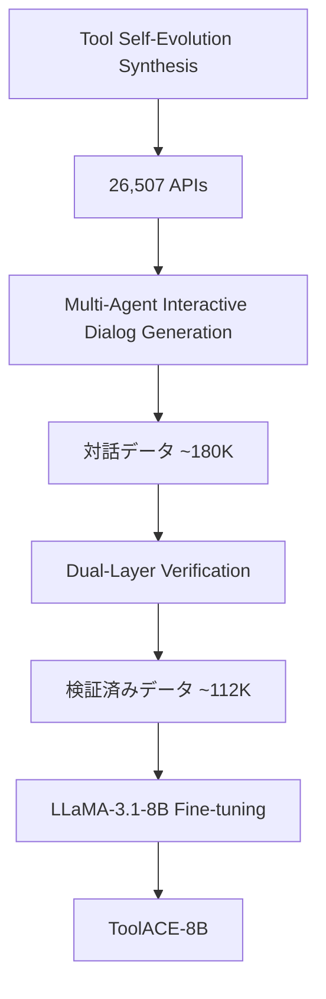

本記事は [ToolACE: Winning the Points of LLM Function Calling](https://arxiv.org/abs/2409.00920) の解説記事です。

## 論文概要（Abstract）

ToolACEは、LLMのFunction Calling能力を向上させるための高品質な訓練データを自動生成するパイプラインである。著者らは、（1）自己進化的合成プロセスによる26,507個の多様なAPI定義の構築、（2）複数エージェントの対話による現実的な対話データ生成、（3）ルールベースとモデルベースの二層検証による品質保証、の3つの技術を組み合わせている。生成データで微調整したToolACE-8B（LLaMA-3.1-8Bベース）は、Berkeley Function-Calling Leaderboard（BFCL）v1で91.41%、v2で85.77%の全体精度を達成し、GPT-4やClaude-3.5-Sonnetを上回る1位を獲得したと著者らは報告している。

この記事は [Zenn記事: AIエージェントのツール設計原則：LLMが正しく使えるAPIを作る7つの実践パターン](https://zenn.dev/0h_n0/articles/653751ba4303f7) の深掘りです。

## 情報源

- **arXiv ID**: 2409.00920
- **URL**: [https://arxiv.org/abs/2409.00920](https://arxiv.org/abs/2409.00920)
- **著者**: Weiwen Liu, Xu Huang, Xingshan Zeng et al.
- **発表年**: 2024
- **分野**: cs.CL, cs.AI

## 背景と動機（Background & Motivation）

LLMのFunction Calling（ツール呼び出し）能力は、AIエージェントの実用性を決定する中核的要素である。しかし、高品質な訓練データの不足が主要なボトルネックとなっている。

既存のデータセットには以下の問題がある。

1. **APIの多様性不足**: ToolLLMは16,464 API / 49ドメインに限定されており、実世界の多様なAPIをカバーできない
2. **対話パターンの単調さ**: 単一ターン・単一ツール呼び出しが大半で、並列呼び出しや依存呼び出しが不足
3. **品質保証の欠如**: 生成データのハルシネーションやパラメータ不整合が検証されていない

著者らはこれらの課題を、API定義の自動合成→対話データの多エージェント生成→二層検証、という3段階パイプラインで解決している。

## 主要な貢献（Key Contributions）

- **貢献1**: 自己進化的API合成（TSS）による26,507個のAPI定義を30ドメイン・390サブドメインにわたって自動生成
- **貢献2**: 形式化された思考プロセスを持つ多エージェント対話生成（MAI）で、単一/並列/依存/非ツール使用の4モードのデータを生成
- **貢献3**: ルールベース+モデルベースの二層検証（DLV）で、最終通過率62%の厳格な品質管理を実現
- **貢献4**: 8BパラメータモデルがBFCL v1/v2で1位を達成し、GPT-4やClaude-3.5-Sonnetを上回る性能を報告

## 技術的詳細（Technical Details）

### アーキテクチャ全体像



### Stage 1: Tool Self-Evolution Synthesis（TSS）

TSSは3つの進化段階を持つ。

**Speciation（種分化）**: 事前学習データからドメイン階層を抽出する。30のプライマリドメイン → 390の粗粒度サブドメイン → 3,398の細粒度ドメイン → 約100,000の機能、という**APIコンテキストツリー**を構築する。

**Adaption（適応）**: サブツリーノードのサンプリングにより複雑度レベルを割り当てる。多くのドメインノードをカバーするAPIは複雑、単一機能に焦点を当てるAPIは単純と分類される。

**Evolution（進化）**: LLMエージェントを用いてAPIを反復的に合成する。多様性指標（新機能やパラメータの追加）を適用し、APIサンプルバッファを用いた継続的改善を行う。

最終的に**26,507個のAPI**が390ドメインにわたって生成される。

### Stage 2: Multi-Agent Interactive Dialog Generation（MAI）

3つのLLMエージェントが対話を生成する。

| エージェント | 役割 | 主な処理 |
|------------|------|---------|
| **User Agent** | クエリ生成 | Multi-mode prompting、類似度ガイド付き複雑化 |
| **Assistant Agent** | ツール選択・呼び出し | 形式化思考（Formalized Thinking）、Self-Consistency |
| **Tool Agent** | API実行シミュレーション | 仮想的な実行結果の生成 |

**形式化された思考プロセス（Formalized Thinking）**は、Function Calling特有の推論構造を定義する。

1. ユーザークエリの評価
2. ツール要件の評価
3. 必須パラメータの充足確認

著者らの報告によると、形式化思考を導入したデータの最終通過率は61.8%であり、導入しない場合の49.8%と比較して約12ポイントの改善を示している。

**Multi-Mode Prompting**による対話モードの分布は以下の通り。

| モード | 割合 | 説明 |
|-------|------|------|
| Single | 53% | 単一ツール・単一ターン |
| Parallel | 23% | 複数ツールの並列呼び出し |
| Dependent | 14% | ツール間に依存関係 |
| Non-tool | 10% | ツール不使用の対話 |

### Stage 3: Dual-Layer Verification（DLV）

**ルール検証層**: API定義の明確性、呼び出しの実行可能性、対話の正確性、サンプルの一貫性の4側面を正規表現とStructuralチェックで検証する。通過率は約68%。

**モデル検証層**: ハルシネーション検出、一貫性検証、ツール応答整合性、応答品質の各サブクエリに分解して検証する。通過率は約91%。

最終的な通過率は$0.68 \times 0.91 \approx 0.62$（約62%）となる。

### 訓練設定

| パラメータ | 値 |
|-----------|-----|
| ベースモデル | LLaMA-3.1-8B-Instruct |
| 手法 | LoRA (rank=16, alpha=32) |
| 学習率 | $10^{-4}$ |
| バッチサイズ | 48 |
| エポック数 | 3 |
| ウォームアップ比率 | 0.1 |
| スケジューラ | Cosine |
| 訓練データ | 約180,000サンプル |

## 実験結果（Results）

### BFCL v1での結果

著者らは以下の結果を報告している（論文Table 3より）。

| モデル | Overall | AST Simple | AST Multiple | AST Parallel | Exec Simple | Relevance |
|--------|---------|-----------|-------------|-------------|------------|-----------|
| **ToolACE-8B** | **91.41%** | 89.09% | 95.50% | 92.50% | 90.00% | 89.17% |
| Claude-3.5-Sonnet | 90.53% | - | - | - | - | - |
| GPT-4-1106 | 88.53% | - | - | - | - | - |
| Functionary-v3.1 | 88.88% | - | - | - | - | - |

8Bパラメータのモデルが、Claude-3.5-SonnetやGPT-4を上回る点が特筆される。

### BFCL v2での結果

BFCL v2ではより厳格な評価基準が適用されるが、著者らの報告ではToolACE-8Bは85.77%の全体精度で1位を維持している。

### 既存データセットとの比較

| 特性 | ToolACE | ToolLLM | xLAM-7b | Functionary |
|------|---------|---------|---------|-------------|
| API数 | 26,507 | 16,464 | 3,673 | n/a |
| ドメイン数 | 390 | 49 | 21 | n/a |
| ネストパラメータ | ✓ | ✗ | ✗ | ✗ |
| 並列呼び出し | ✓ | ✗ | ✓ | ✓ |
| 依存呼び出し | ✓ | ✓ | ✗ | ✗ |
| フォーマット多様性 | JSON/YAML/XML/MD | JSONのみ | JSONのみ | JSONのみ |

### アブレーションスタディ

**検証層の効果**（論文Table 6より）: 二層検証を使用した場合のAST精度は、ルールのみ検証やノー検証と比較して有意に高い。

**複雑度の影響**: 中程度の複雑度のサブセットが最も性能が高く、過度に単純または困難なデータは性能を低下させる。これは「最近接発達領域（Zone of Proximal Development）」の理論と一致する。

**多様性の影響**: API多様性と精度には明確な相関があり、30クラスタの高多様性訓練データは6クラスタの低多様性データを大幅に上回る。

### 汎用能力の保持

ToolACE-8Bは、MMLU、HumanEval、GSM8Kでの汎用的な性能を「無視できるレベル」でしか低下させないと報告されている。Function Calling能力と汎用能力のトレードオフが最小限に抑えられている。

## 実装のポイント（Implementation）

### APIプール構築の実践的考慮点

1. **ドメイン階層の設計**: 30プライマリドメインの選定が最終的なAPI多様性に直結する。事前学習コーパスの分布に基づくボトムアップアプローチが有効
2. **複雑度のバランス**: 単純すぎるAPIと複雑すぎるAPIの比率が訓練効果を左右する。中程度の複雑度を中心にサンプリングすることが推奨される
3. **フォーマット汎化**: JSON以外のYAML、XML、Markdownフォーマットへの変換により、特定フォーマットへの過学習を防止

### 二層検証の実装

```python
from dataclasses import dataclass
from typing import Literal

@dataclass
class VerificationResult:
    """二層検証の結果を格納する。

    Attributes:
        rule_passed: ルール検証の通過有無
        model_passed: モデル検証の通過有無
        rule_details: ルール検証の詳細結果
        model_details: モデル検証の詳細結果
    """
    rule_passed: bool
    model_passed: bool
    rule_details: dict[str, bool]
    model_details: dict[str, float]

    @property
    def final_passed(self) -> bool:
        return self.rule_passed and self.model_passed

def rule_verification(sample: dict) -> tuple[bool, dict[str, bool]]:
    """ルールベース検証: API明確性、呼び出し実行可能性、対話正確性、一貫性。"""
    checks = {
        "api_clarity": check_api_definition(sample["tools"]),
        "call_executability": check_function_call(sample["calls"]),
        "dialog_correctness": check_dialog_flow(sample["messages"]),
        "sample_consistency": check_consistency(sample),
    }
    return all(checks.values()), checks

def model_verification(sample: dict, verifier_llm) -> tuple[bool, dict[str, float]]:
    """モデルベース検証: ハルシネーション、一貫性、応答整合性、品質。"""
    scores = {
        "hallucination": verifier_llm.check_hallucination(sample),
        "consistency": verifier_llm.check_consistency(sample),
        "tool_alignment": verifier_llm.check_tool_response(sample),
        "quality": verifier_llm.check_response_quality(sample),
    }
    threshold = 0.7
    passed = all(s >= threshold for s in scores.values())
    return passed, scores
```

## 実運用への応用（Practical Applications）

### Zenn記事のツール設計原則との関連

ToolACEのデータ生成パイプラインは、Zenn記事の7つの設計原則を**自動的に訓練データに反映する仕組み**と解釈できる。

- **原則1（単一責務）**: TSSの種分化段階で、APIを細粒度ドメインに分解することで単一責務を実現
- **原則2（一貫命名）**: APIコンテキストツリーの階層構造が命名の一貫性を保証
- **原則4（強い型付け）**: パラメータの型多様性（integer, boolean, float, array, dictionary）を意図的にバランスさせている
- **原則6（エラー透過）**: 二層検証で不整合データを除外することで、エラーパターンの学習を防止

### プロダクションでの活用指針

1. **カスタムAPIプール**: 自社のAPI定義をTSS手法で拡張し、ドメイン固有の訓練データを生成できる
2. **品質ゲート**: 二層検証のアーキテクチャは、自社の訓練データパイプラインにも適用可能
3. **LoRA微調整**: 8Bモデル + LoRA (rank=16) という軽量な設定で、GPT-4レベルのFunction Calling性能を実現できる可能性がある

## 関連研究（Related Work）

- **ToolLLM**（Qin et al., 2023）: 16,000+ Real-world APIに対応する最初の大規模ツール学習フレームワーク。ToolACEはAPI多様性とデータ品質の両面で改善
- **xLAM**（Zhang et al., 2024）: 大規模Action Modelファミリー。3,673 APIと比較的少ないAPI数だが、並列呼び出しをサポート
- **APIGen**（Liu et al., 2024）: API検証可能なデータセット生成。ToolACEの二層検証はAPIGenのアプローチを拡張

## まとめと今後の展望

ToolACEは、高品質なFunction Calling訓練データを自動生成するパイプラインとして、3つの技術革新を提示している。（1）自己進化的API合成で26,507個の多様なAPIを構築、（2）形式化思考を持つ多エージェント対話生成で現実的なデータを作成、（3）二層検証で62%の厳格な品質管理を実現。結果として、8BパラメータモデルがBFCLで1位を達成している。

Zenn記事で紹介されているツール設計原則は、まさにこのようなデータ生成パイプラインにおいて**APIの品質を体系的に保証する基盤**となる。ツール設計の品質が訓練データの品質を決定し、最終的なエージェントの性能を左右するという連鎖構造が、ToolACEの成功から読み取れる。

## 参考文献

- **arXiv**: [https://arxiv.org/abs/2409.00920](https://arxiv.org/abs/2409.00920)
- **Dataset**: [https://huggingface.co/datasets/Team-ACE/ToolACE](https://huggingface.co/datasets/Team-ACE/ToolACE)
- **Related Zenn article**: [https://zenn.dev/0h_n0/articles/653751ba4303f7](https://zenn.dev/0h_n0/articles/653751ba4303f7)
