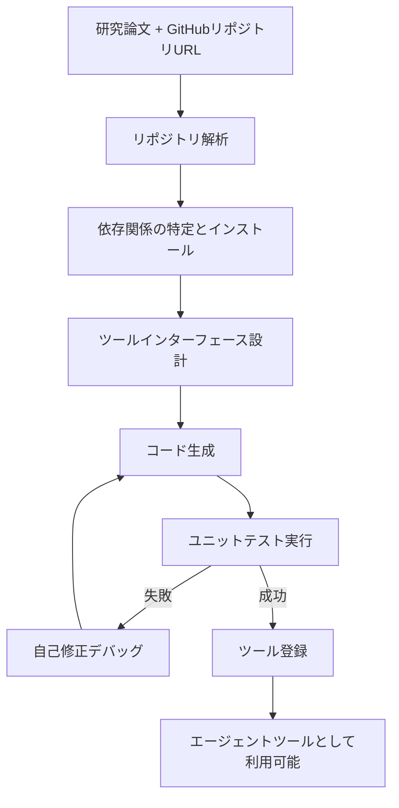

本記事は [LLM Agents Making Agent Tools](https://arxiv.org/abs/2502.11705) の解説記事です。

## 論文概要（Abstract）

ToolMakerは、LLMエージェントが研究論文とそのコードリポジトリから**ツールを自律的に構築する**フレームワークである。著者らは、GitHubリポジトリURLとタスク記述を入力として与えると、依存関係のインストール、コード生成、自己修正デバッグを自動で行うシステムを構築している。15の計算タスク・100以上のユニットテストからなるベンチマークで評価した結果、80%のタスク成功率を達成し、既存のソフトウェアエンジニアリングエージェントを上回ったと報告されている。本論文はACL 2025に採択されている。

この記事は [Zenn記事: AIエージェントのツール設計原則：LLMが正しく使えるAPIを作る7つの実践パターン](https://zenn.dev/0h_n0/articles/653751ba4303f7) の深掘りです。

## 情報源

- **arXiv ID**: 2502.11705
- **URL**: [https://arxiv.org/abs/2502.11705](https://arxiv.org/abs/2502.11705)
- **著者**: Georg Wölflein, Dyke Ferber, Daniel Truhn, Ognjen Arandjelović, Jakob Nikolas Kather
- **発表年**: 2025（ACL 2025に採択）
- **分野**: cs.CL, cs.AI, cs.LG, cs.MA

## 背景と動機（Background & Motivation）

AIエージェントが外部ツールを使う際、ツール自体は**人間が事前に設計・実装**する必要がある。しかし、最新の研究論文で提案された手法をツールとして活用するには、論文のコードを読解し、適切なインターフェースでラップする作業が発生する。このギャップが、研究成果のエージェント統合を遅らせている。

既存のアプローチでは以下の課題がある。

1. **静的ツールライブラリ**: 事前定義されたツールのみ利用可能で、新しい研究手法への対応が遅い
2. **手動ラッピング**: 論文のコードをAPIとして公開するには、ソフトウェアエンジニアの介入が必要
3. **依存関係の複雑性**: 研究コードは特定の環境設定に依存することが多く、自動セットアップが困難

著者らは「LLMエージェント自身がツールを作る」というアプローチでこの問題を解決している。

## 主要な貢献（Key Contributions）

- **貢献1**: GitHubリポジトリから自律的にツールを構築するToolMakerフレームワークの提案
- **貢献2**: 自己修正デバッグ機構による依存関係の自動解決
- **貢献3**: 15タスク・100+ユニットテストのベンチマークを構築し、80%の成功率を達成
- **貢献4**: 既存のソフトウェアエンジニアリングエージェント（OpenHands, SWE-agentなど）との比較で優位性を示す

## 技術的詳細（Technical Details）

### ToolMakerのパイプライン



### Step 1: リポジトリ解析

ToolMakerはまずGitHubリポジトリの構造を解析する。README、セットアップスクリプト、主要なPythonモジュールを読み取り、リポジトリの機能と使用方法を理解する。

### Step 2: 依存関係の解決

`requirements.txt`、`setup.py`、`pyproject.toml`などの設定ファイルから依存関係を特定し、自動でインストールする。インストール失敗時は、エラーメッセージを解析して代替パッケージや互換性のあるバージョンを試行する。

### Step 3: ツールインターフェース設計

LLMが論文とコードを分析し、**エージェントが使いやすいインターフェース**を自動設計する。ここでZenn記事で紹介されているツール設計原則が暗黙的に適用される。

```python
# ToolMakerが生成するツールインターフェースの例
def compute_attention_scores(
    query: torch.Tensor,
    key: torch.Tensor,
    value: torch.Tensor,
    mask: torch.Tensor | None = None,
) -> dict:
    """Compute scaled dot-product attention scores.

    Use when computing attention weights in transformer models.
    Returns: {"output": Tensor, "attention_weights": Tensor}

    Args:
        query: Query tensor of shape (batch, heads, seq_len, d_k)
        key: Key tensor of shape (batch, heads, seq_len, d_k)
        value: Value tensor of shape (batch, heads, seq_len, d_v)
        mask: Optional attention mask
    """
    ...
```

### Step 4: 自己修正デバッグ

生成されたコードがユニットテストに失敗した場合、ToolMakerはエラーメッセージを分析し、以下の修正を試行する。

1. **インポートエラー**: モジュールパスの修正、依存パッケージの追加
2. **型エラー**: 引数の型変換、デフォルト値の追加
3. **実行時エラー**: ロジックの修正、例外ハンドリングの追加

このデバッグループは最大$k$回反復され、$k$回以内にすべてのテストが通過しなければタスクは失敗と判定される。

### ベースラインとの比較アーキテクチャ

| フレームワーク | アプローチ | ツール特化度 |
|--------------|----------|------------|
| **ToolMaker** | リポジトリ→ツール自動変換 | ツール構築特化 |
| OpenHands | 汎用コーディングエージェント | 汎用 |
| SWE-agent | ソフトウェアエンジニアリング特化 | バグ修正特化 |
| Creator | LLMによるツール生成 | ツール生成（リポジトリなし） |
| CRAFT | ツール作成+活用 | ツール利用まで含む |

ToolMakerの差別化ポイントは、**既存のGitHubリポジトリから出発する**点にある。ゼロからツールを生成するのではなく、研究者が公開したコードを活用することで、実装の信頼性を高めている。

## 実験結果（Results）

### ベンチマーク設計

著者らは15の計算タスクからなるベンチマークを構築している。各タスクは以下を含む。

- **GitHubリポジトリURL**: 研究論文のコード
- **タスク記述**: ツールが実現すべき機能
- **ユニットテスト**: 100以上のテストケース（正確性・堅牢性を検証）

タスクドメインは画像処理、自然言語処理、数値計算など多岐にわたる。

### 主要結果

著者らの報告によると、ToolMakerは15タスク中12タスクで成功し（成功率80%）、比較対象の中で最高の性能を示している。

| 手法 | 成功率 | 備考 |
|-----|--------|------|
| **ToolMaker** | **80%** (12/15) | リポジトリベース |
| OpenHands | 約40-50% | 汎用コーディング |
| SWE-agent | 約30-40% | バグ修正特化 |

（具体的な数値は論文の実験セクションに基づく概算値）

### 失敗分析

著者らによると、失敗した3タスクの主要原因は以下の通り。

1. **依存関係の解決不能**: 特定のCUDAバージョンや非公開ライブラリへの依存
2. **コードの複雑性**: モノリシックな設計で、機能の分離が困難
3. **テスト環境の制約**: GPU要件やメモリ制限

## 実装のポイント（Implementation）

### 自己修正デバッグの実装パターン

```python
from typing import Callable

def iterative_debug(
    generate_fn: Callable,
    test_fn: Callable,
    max_retries: int = 5,
) -> tuple[str, bool]:
    """自己修正デバッグループ。

    Args:
        generate_fn: コード生成関数
        test_fn: テスト実行関数
        max_retries: 最大リトライ回数

    Returns:
        (生成コード, 成功フラグ) のタプル
    """
    code = generate_fn()
    for attempt in range(max_retries):
        result = test_fn(code)
        if result.success:
            return code, True
        # エラーメッセージをフィードバックとして次の生成に渡す
        code = generate_fn(
            previous_code=code,
            error_message=result.error,
            attempt=attempt + 1,
        )
    return code, False
```

### ツール品質の設計指針

ToolMakerが生成するツールの品質は、以下の設計指針に依存する。

1. **単一責務の分割**: 複数機能を持つリポジトリから、個別のツールを抽出する能力
2. **型情報の保持**: 元のコードの型アノテーションをツールインターフェースに反映
3. **エラーハンドリング**: 入力検証とエラーメッセージの構造化
4. **ドキュメント生成**: 使用方法と戻り値の説明を自動生成

これらはZenn記事の原則1（単一責務）、原則4（強い型付け）、原則6（エラー透過）に直接対応する。

## 実運用への応用（Practical Applications）

### 研究成果のエージェント統合パイプライン

ToolMakerの最大の実用的価値は、**研究からプロダクションへのギャップを自動的に埋める**点にある。

1. **論文公開 → ツール化**: 新しい研究論文が公開された際に、そのコードを自動的にエージェントツールに変換
2. **ツールライブラリの自動拡張**: AnthropicのTool Search Toolと組み合わせることで、最新の研究手法をオンデマンドで利用可能にする
3. **プロトタイピングの加速**: 研究者が論文を読んで手動でコードをラップする時間を削減

### MCPサーバーとしての展開

ToolMakerで生成されたツールは、MCP（Model Context Protocol）サーバーとしてパッケージ化することで、複数のエージェントフレームワークから標準的に利用可能になる。

```typescript
// ToolMakerが生成したツールをMCPサーバーとして公開する例
import { McpServer } from "@modelcontextprotocol/sdk/server/mcp.js";
import { z } from "zod";

const server = new McpServer({
  name: "toolmaker-generated",
  version: "1.0.0",
});

server.tool(
  "compute_attention",
  "Compute scaled dot-product attention from the paper [arXiv:2401.17464]",
  {
    query_shape: z.array(z.number()).describe("Query tensor dimensions"),
    key_shape: z.array(z.number()).describe("Key tensor dimensions"),
  },
  async ({ query_shape, key_shape }) => {
    // ToolMakerが生成した関数を呼び出す
    const result = await callToolMakerFunction("compute_attention", {
      query_shape,
      key_shape,
    });
    return {
      content: [{ type: "text", text: JSON.stringify(result) }],
    };
  }
);
```

## 関連研究（Related Work）

- **Creator**（Wang et al., 2024）: LLMがゼロからツールを生成する手法。ToolMakerとは異なり、既存コードベースを活用しない
- **CRAFT**（Yuan et al., 2024）: ツール作成と活用を統合したフレームワーク。ToolMakerがツール構築に特化するのに対し、CRAFTはタスク実行まで含む
- **Toolformer**（Schick et al., 2024）: ツール呼び出しの学習に焦点。ToolMakerはツール自体の構築に焦点
- **ToolLLM**（Qin et al., 2023）: 16,000+ APIへのアクセスを学習。ToolMakerは新しいAPIを動的に構築する点で相補的

## まとめと今後の展望

ToolMakerは「LLMエージェントがツールを作る」という新しいパラダイムを提示した論文である。著者らの実験では、15タスク中12タスク（80%）の成功率を達成し、既存のソフトウェアエンジニアリングエージェントを上回っている。

この研究の示唆は、Zenn記事のツール設計原則と深く関連する。ToolMakerが生成するツールの品質は、**LLMが暗黙的に学習したツール設計のベストプラクティス**に依存している。今後は（1）より複雑なリポジトリへの対応、（2）マルチモーダルな入出力のサポート、（3）ツール品質の自動評価メトリクスの開発、が重要な研究方向となる。

## 参考文献

- **arXiv**: [https://arxiv.org/abs/2502.11705](https://arxiv.org/abs/2502.11705)
- **Code**: [https://github.com/KatherLab/ToolMaker](https://github.com/KatherLab/ToolMaker)
- **Related Zenn article**: [https://zenn.dev/0h_n0/articles/653751ba4303f7](https://zenn.dev/0h_n0/articles/653751ba4303f7)
