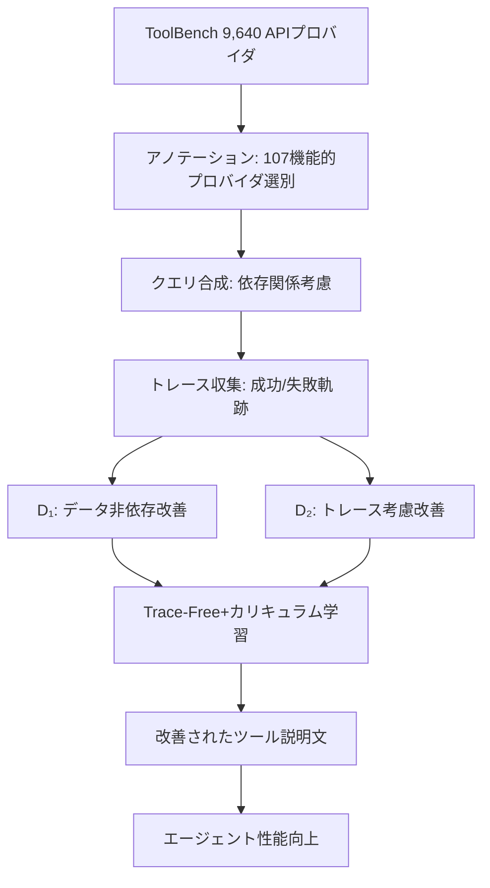

本記事は [Learning to Rewrite Tool Descriptions for Reliable LLM-Agent Tool Use](https://arxiv.org/abs/2602.20426) の解説記事です。

## 論文概要（Abstract）

LLMベースのエージェントは、ツールの説明文（description）に大きく依存してツール選択を行う。しかし既存のツール説明文は人間向けに書かれており、LLMが正しく解釈できないケースが多い。著者らは、ツール説明文を自動的に書き換えることでエージェントの信頼性を向上させる**Trace-Free+**フレームワークを提案している。カリキュラム学習により、実行トレースが利用可能な環境で学習した知識を、トレースなしのデプロイ環境に転移する。StableToolBenchで+2.3%のサブタスクレベル改善、RestBenchのクロスドメイン評価でTMDBデータセットにおいて+9.9%の改善を達成したと報告されている。

この記事は [Zenn記事: AIエージェントのツール設計原則：LLMが正しく使えるAPIを作る7つの実践パターン](https://zenn.dev/0h_n0/articles/653751ba4303f7) の深掘りです。

## 情報源

- **arXiv ID**: 2602.20426
- **URL**: [https://arxiv.org/abs/2602.20426](https://arxiv.org/abs/2602.20426)
- **著者**: Ruocheng Guo, Kaiwen Dong, Xiang Gao, Kamalika Das
- **発表年**: 2026
- **分野**: cs.AI

## 背景と動機（Background & Motivation）

Zenn記事で紹介されている「原則3: 簡潔で構造化された説明文」は、ツール設計において最も重要な原則の一つである。しかし現実には、**ツール説明文の品質がエージェントの性能を大きく左右する**にもかかわらず、説明文の改善は手動作業に依存している。

著者らは以下の問題を指摘している。

1. **情報の欠落**: ツール説明文に必要なパラメータの制約条件が記載されていない
2. **曖昧な引数セマンティクス**: パラメータ名だけでは用途が判断できない
3. **未文書化の使用制約**: 特定の引数の組み合わせが必要だが説明されていない

例えば、Composio社の事例（Zenn記事で紹介）では、Firecrawl APIの`format`パラメータを`json`に設定した場合に`jsonOptions`パラメータが必須であることが説明文に記載されておらず、エージェントが繰り返し失敗していた。この種の問題を**自動的に検出・修正する**のがTrace-Free+の目的である。

## 主要な貢献（Key Contributions）

- **貢献1**: 実行トレースからツール説明文を自動改善するTrace-Free+カリキュラム学習フレームワークの提案
- **貢献2**: 9,640 APIプロバイダから107の機能的プロバイダを選別し、高品質なツール説明文データセットを構築
- **貢献3**: StableToolBenchとRestBenchでのIn-domain/Cross-domain評価で一貫した改善を実証
- **貢献4**: 100以上の候補ツールを持つ大規模環境でもロバストな性能を実現

## 技術的詳細（Technical Details）

### Trace-Free+のアーキテクチャ



### 2段階の説明文改善

著者らは説明文の改善を2段階に分けている。

**$D_1$（データ非依存改善）**: 一般的なガイドラインを適用する。

- パラメータの型制約の明記
- 必須/任意パラメータの明確化
- 戻り値の型情報追加
- 使用コンテキストの記述

**$D_2$（トレース考慮改善）**: 実行トレースから抽出した行動制約を反映する。

- 実際のAPI呼び出しパターンから推測される制約条件
- 失敗トレースから学習したエラー回避ルール
- RIMRULEアルゴリズムで抽出された暗黙的な使用規則

### カリキュラム学習戦略

3つのモデルバリアントが訓練される。

$$
\text{Trace-Free+} = \alpha(t) \cdot \mathcal{L}_{\text{trace-based}} + (1 - \alpha(t)) \cdot \mathcal{L}_{\text{trace-free}}
$$

ここで、
- $\alpha(t)$: 時刻$t$におけるトレースベース例の混合比率
- $\mathcal{L}_{\text{trace-based}}$: 実行トレースを使用した説明文改善の損失
- $\mathcal{L}_{\text{trace-free}}$: トレースなしでの説明文改善の損失

訓練初期は$\alpha(t) \approx 1$（トレースベース主体）で開始し、徐々に$\alpha(t) \to 0$（トレースフリー主体）に遷移する。これにより、モデルは実行トレースから学んだ効果的な説明文パターンを、トレースなしの環境でも再現できるようになる。

### データ構築パイプライン

**Seed Tool Annotation**: ToolBenchの9,640 APIプロバイダから、エージェント的アノテーション（自己反省と行動-観察ループ）を用いて107の機能的プロバイダを選別している。

**依存関係考慮クエリ合成**: API呼び出し履歴を分析し、API間の依存関係を強制する多段階クエリを生成する。独立した呼び出しではなく、前段のAPI出力が後段の入力となる現実的なシナリオを構築している。

**トレース収集**: 合成クエリに対して実行トレースを生成し、成功・失敗の両方の軌跡をキャプチャする。

### Teacher-Forcing評価

著者らは、ツール説明文の品質を正確に測定するために**Teacher-Forcing評価**を導入している。これは、エージェントの実行中にコンテキストが破壊される影響を排除し、「エージェント性能の差異はツール説明文の差異のみに帰属する」ことを保証する評価手法である。

3つの評価粒度が使用される。

- **Subtask-Level (SL)**: ツール選択の正しさ + 実行の成功
- **Query-Level (QL)**: 全サブタスクの成功が必要
- **Tool-Level**: 選択頻度に関わらず各ツールを平等に評価するF1スコア

## 実験結果（Results）

### StableToolBench（In-Domain）

著者らの報告による結果は以下の通り（論文Table 1相当）。

| 手法 | Overall SL | Overall QL |
|------|-----------|-----------|
| $D_0$（オリジナル） | 67.3% | 48.0% |
| $D_1$（一般改善） | 66.5% | 49.4% |
| EasyTool | 63.5% | - |
| Trace-Free | 67.8% | 51.6% |
| **Trace-Free+** | **70.1%** | **54.0%** |

Trace-Free+は$D_0$に対して+2.8% SL、+6.0% QLの改善を達成している。

### RestBench（Cross-Domain）

StableToolBenchのみで訓練した後、TMDBとSpotifyデータセットでクロスドメイン評価を行っている。

| データセット | 手法 | SL | QL |
|------------|------|-----|-----|
| TMDB | $D_0$ | 69.8% | 49.5% |
| TMDB | $D_1$ | 78.2% | 58.0% |
| TMDB | **Trace-Free+** | **88.1%** | **74.9%** |
| Spotify | $D_0$ | 57.1% | 34.9% |
| Spotify | $D_1$ | 65.1% | 45.7% |
| Spotify | **Trace-Free+** | **68.1%** | **49.3%** |

特にTMDBでは$D_1$と比較して+9.9% SLという大幅な改善を示しており、訓練ドメイン外への汎化能力が高いことが確認されている。

### 大規模ツール環境でのスケーラビリティ

著者らはStableToolBenchのクエリに100以上の候補ツールを追加した評価も行っている。Trace-Free+は他の手法と比較して**最もロバストな性能**を維持し、候補ツール数の増加による性能低下が最小限に抑えられていると報告されている。

この結果は、Zenn記事で紹介されているAnthropicのTool Search Tool（数百ツールでの効率的管理）の必要性を裏付けるものでもある。

### Trace-Based設定での結果

実行トレースが利用可能な場合の比較も行われている。

| 手法 | Overall SL | Overall QL |
|------|-----------|-----------|
| DRAFT | 68.1% | 50.0% |
| Play2Prompt | 69.8% | 52.5% |
| $D_2$ | 69.5% | 52.5% |
| **Trace-Based** | **70.3%** | **54.6%** |

Trace-Basedは既存手法を上回り、「単一ターンのツール実行のみ」で既存の複雑なマルチターンプロセスを超える性能を実現している。

## 実装のポイント（Implementation）

### 説明文改善の具体例

**改善前（$D_0$）**:

```json
{
  "name": "search_products",
  "description": "Search for products in the catalog."
}
```

**改善後（Trace-Free+）**:

```json
{
  "name": "search_products",
  "description": "Search for products in the catalog by keyword or category. Use when the user asks about available products or wants to find specific items. If category is specified, only products in that category are returned. Returns: {\"products\": [{\"id\": str, \"name\": str, \"price\": float}], \"total\": int}. Note: query must be non-empty; returns max 50 results per call."
}
```

改善のポイント:
1. **使用コンテキスト**（Use when...）の追加
2. **パラメータ制約**（category指定時の挙動）の明記
3. **戻り値の型情報**の追加
4. **暗黙的制約**（query非空、最大50件）の文書化

### ツール説明文品質チェックリスト

著者らの研究から導出される、実践的な品質チェックリスト:

1. **What**: ツールが何をするかが1文で明確か
2. **When**: いつ使うべきかのコンテキストが記述されているか
3. **Returns**: 戻り値の構造と型が明記されているか
4. **Constraints**: パラメータの制約（必須/任意、値の範囲、依存関係）が記載されているか
5. **Errors**: 典型的なエラーケースと対処法が記述されているか

## 実運用への応用（Practical Applications）

### Zenn記事の原則3「簡潔で構造化された説明文」の自動化

本論文の最大の実用的価値は、Zenn記事の**原則3を自動的に実現する仕組み**を提供している点にある。

従来のワークフロー:
1. 開発者がAPI説明文を手動で作成
2. エージェントがツール選択に失敗
3. 開発者がエラーログを分析
4. 説明文を手動修正
5. 1-4を繰り返し

Trace-Free+のワークフロー:
1. 開発者が基本的なAPI説明文を作成
2. Trace-Free+が実行トレースから自動改善
3. 改善された説明文をデプロイ

### 継続的改善パイプライン

Composio社が推奨する「継続的改善戦略」（匿名化プロダクションエラーの監視→自動テスト→反復改善）を、Trace-Free+のフレームワークで自動化できる可能性がある。

```python
from dataclasses import dataclass

@dataclass
class ToolDescriptionOptimizer:
    """ツール説明文の継続的改善パイプライン。

    Attributes:
        model: Trace-Free+モデル
        trace_collector: 実行トレース収集器
    """
    model: object
    trace_collector: object

    def optimize_batch(
        self,
        tool_descriptions: list[dict],
        traces: list[dict] | None = None,
    ) -> list[dict]:
        """バッチでツール説明文を最適化する。

        Args:
            tool_descriptions: 改善対象のツール説明文リスト
            traces: 実行トレース（利用可能な場合）

        Returns:
            改善されたツール説明文リスト
        """
        if traces:
            return self.model.trace_based_rewrite(tool_descriptions, traces)
        return self.model.trace_free_rewrite(tool_descriptions)
```

## 関連研究（Related Work）

- **EasyTool**（Yuan et al., 2024）: プロンプトベースのツール説明文改善。Trace-Free+はEasyToolのSL 63.5%を70.1%に改善
- **DRAFT**（Wang et al., 2024）: 反復的ワークフローでツール説明文を改善。Trace-Freeのフレームワークはより単純なパイプラインで同等以上の性能
- **Play2Prompt**（Liang et al., 2024）: ゼロショット最適化でSL 69.8%。Trace-Basedは70.3%でこれを上回る
- **Composio Field Guide**（Sharma, 2025）: 手動でのツール設計ベストプラクティス。Trace-Free+はこの知見を自動化

## まとめと今後の展望

Trace-Free+は、ツール説明文の品質を自動的に向上させるカリキュラム学習フレームワークである。StableToolBenchで+2.8%、RestBench TMDBで+18.3%（$D_0$比）の改善を達成している。

この研究は、Zenn記事のツール設計原則（特に原則3「簡潔で構造化された説明文」）を**自動化する実現可能なアプローチ**を示している。ツール設計の品質がエージェント性能の鍵であるという本質は変わらないが、その品質向上プロセスを自動化できる可能性が示されたことは重要な進展である。

今後の課題として、（1）RESTful API以外のツールタイプへの拡張、（2）パラメータスキーマの自動修正、（3）Teacher-Forcing評価を超えたEnd-to-End評価手法の開発が挙げられる。

## 参考文献

- **arXiv**: [https://arxiv.org/abs/2602.20426](https://arxiv.org/abs/2602.20426)
- **Related Zenn article**: [https://zenn.dev/0h_n0/articles/653751ba4303f7](https://zenn.dev/0h_n0/articles/653751ba4303f7)
