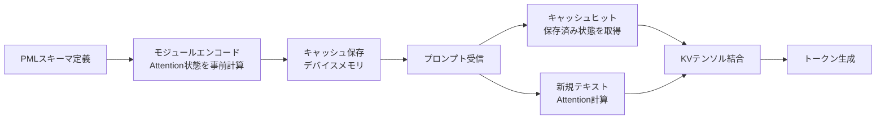

本記事は [arXiv:2311.04934](https://arxiv.org/abs/2311.04934)（Gim et al., MLSys 2024）の解説記事です。

## 論文概要（Abstract）

LLM推論のレイテンシはプロンプト長に大きく依存する。著者らは**Prompt Cache**を提案し、頻出するテキストセグメント（システムメッセージ、プロンプトテンプレート、ドキュメント等）のAttention状態を事前計算・保存し、プロンプト間で再利用する手法を示している。**Prompt Markup Language（PML）**というスキーマを用いてモジュール構造を定義し、GPUベースの推論で最大10倍、CPUベースで最大60倍のレイテンシ削減を達成したと報告されている。出力品質はベースラインと同等であり、モデルの修正は不要である。

この記事は [Zenn記事: LLM会話スレッド管理の本番設計 Redis・PostgreSQL・3大APIパターン比較](https://zenn.dev/0h_n0/articles/d741db8cb57195) の深掘りです。

## 情報源

- **会議名**: MLSys 2024（Conference on Machine Learning and Systems）
- **年**: 2024
- **URL**: [https://arxiv.org/abs/2311.04934](https://arxiv.org/abs/2311.04934)
- **著者**: In Gim, Guojun Chen, Seung-seob Lee, Nikhil Sarda, Anurag Khandelwal, Lin Zhong

## カンファレンス情報

**MLSys**は機械学習とシステムの交差点に位置するトップカンファレンスであり、推論効率化、分散学習、モデルサービングなどの実装レベルの研究が採択される。本論文はLLM推論の実用的な最適化手法として採択された。

## 技術的詳細（Technical Details）

### 背景: KV Cacheの仕組み

Transformerベースの自己回帰的トークン生成では、各トークンの生成時にこれまでの全トークンのAttention状態（Key-Value pairs）を再計算する必要がある。KV Cacheはこの再計算を防ぐためにAttention状態を保存する標準的な手法であるが、**同一プロンプト内**でのみ再利用可能であり、**異なるプロンプト間**では再利用できない。

Prompt Cacheはこの制約を克服し、**プロンプト間で**Attention状態を再利用する。

### Prompt Markup Language（PML）

著者らはPrompt Markup Language（PML）というマークアップ言語を導入し、再利用可能なテキストセグメントを「プロンプトモジュール」として定義している。

```xml
<!-- スキーマ定義 -->
<schema name="customer_support">
  <module name="system_prompt">
    あなたはカスタマーサポートAIです。丁寧に対応してください。
  </module>
  <module name="product_catalog">
    <!-- 製品情報（数千トークン） -->
  </module>
  <union name="language">
    <module name="ja">日本語で回答してください。</module>
    <module name="en">Please respond in English.</module>
  </union>
</schema>

<!-- 実際のプロンプト -->
<prompt schema="customer_support">
  <import module="system_prompt"/>
  <import module="product_catalog"/>
  <import module="ja"/>
  <!-- ユーザーの質問（ここだけ新規計算） -->
  この製品の返品手続きを教えてください。
</prompt>
```

**PMLの主要機能**:
- **`<module>`**: 再利用可能なテキストセグメント
- **`<union>`**: 相互排他的なモジュールのグループ（同一位置IDを共有）
- **`<param>`**: ランタイムで差し替え可能なパラメータ
- **ネスト**: モジュール内にモジュールを含む階層構造

### Attention状態のキャッシュと再利用



**位置ID割り当て**: 各モジュールにはスキーマ内の絶対位置に基づいてposition IDが割り当てられる。著者らの重要な発見として、LLMは不連続なposition IDでも**相対的な位置関係が保持されていれば**正しく動作することが実証されている。

**Scaffolding機能**: 意味的に依存するモジュール群を「scaffold」として一括エンコードし、モジュール間のAttention spanを共有できる。メモリ使用量は増加するが、出力の一貫性が向上する。

### 数式: レイテンシの理論分析

KV Cacheの計算コストはシーケンス長 $n$ に対して二次的に増加する。

$$
T_{\text{KVCache}}(n) = O(n^2 \cdot d)
$$

ここで $d$ はモデルの隠れ次元。一方、Prompt Cacheのメモリコピーオーバーヘッドは線形である。

$$
T_{\text{PromptCache}}(n) = O(n \cdot d)
$$

この差は $n$ が大きくなるほど顕著になり、3,000トークン以上のプロンプトで特に効果的であると著者らは報告している。

## 実験結果（Results）

### GPUでのレイテンシ改善

RTX 4090, A40, A100でLlama2 7Bモデルを使用した評価結果が報告されている。

- **CPUメモリ保存**: 1.5x-3x削減
- **GPUメモリ保存**: 5x-10x削減

### CPU推論でのレイテンシ改善

- **Intel i9-13900K (DDR5)**: 最大70x削減
- **AMD Ryzen 9 7950X (DDR4)**: 最大20x削減

CPU推論ではAttention計算のレイテンシが元々高いため、Prompt Cacheの効果がより顕著になると著者らは分析している。

### 具体的なTTFT（Time-To-First-Token）削減例

RTX 4090 + Llama 7B、3,000トークンのコンテキスト:
- **ベースライン**: 900ms
- **Prompt Cache適用後**: 90ms（25トークン分の生成時間に相当）

### メモリオーバーヘッド（論文Table 2より）

| モデル | 1トークンあたりのメモリ | 1Kトークンの場合 |
|--------|---------------------|-----------------|
| Llama 7B | 0.50 MB/token | ~500 MB |
| Llama 13B | 0.78 MB/token | ~780 MB |
| Llama 70B | 2.5 MB/token | ~2.5 GB |
| Falcon 180B | 4.53 MB/token | ~4.5 GB |

### 出力品質（論文Table 1より）

LongBenchデータセット8種類（Narrative QA, Wiki Multi-Hop QA等）での評価において、Prompt Cacheの出力品質はベースラインと同等（大半のメトリクスで差が2.5ポイント以内）であると報告されている。モデルのパラメータを一切変更しないため、品質劣化は原理的に最小限に抑えられる。

### モデルサイズとの関係

7Bから13Bへのスケールアップ時（3Kトークン）:
- **KV Cacheのレイテンシ増加**: +220ms
- **Prompt Cacheのレイテンシ増加**: +30ms

モデルサイズが大きくなるほどPrompt Cacheの優位性が増すと著者らは報告している。

## 実装のポイント（Implementation）

### 位置エンコーディングの適応

著者らはLLMの位置エンコーディング方式ごとに以下の適応を行っている。

| 位置エンコーディング | 適応方法 |
|-------------------|---------|
| **Embedding Table** | 変更なし |
| **RoPE** | position IDのルックアップテーブルで回転行列を索引 |
| **ALiBi** | position IDのルックアップテーブルで静的バイアス行列を調整 |

### プロトタイプ実装

- **コード量**: Python 3,000行（HuggingFace Transformers統合）
- **LLMごとの修正**: 位置エンコーディング対応で約20行

### 本番環境での適用パターン

Zenn記事で解説したAnthropicのprompt cachingは、本論文のアプローチと同じKV Cacheの再利用原理に基づいている。ただし、Anthropicの実装はAPIレベルで自動的に動作するのに対し、本論文はPMLによる明示的なモジュール定義が特徴である。

```python
# 本論文のアプローチ（明示的モジュール定義）
schema = PromptSchema(
    modules={
        "system": "あなたはAIアシスタントです...",
        "user_profile": get_user_profile(user_id),
        "recent_context": get_recent_messages(session_id),
    }
)
# システムプロンプトとユーザープロファイルはキャッシュから取得
# recent_contextのみ新規計算

# Anthropic APIのアプローチ（自動キャッシュ）
response = client.messages.create(
    model="claude-sonnet-4-6-20250218",
    system=[{
        "type": "text",
        "text": system_prompt,
        "cache_control": {"type": "ephemeral"},
    }],
    messages=messages,
)
```

**制約**: Prompt Cacheのメモリオーバーヘッドは無視できない（Llama 70Bで1Kトークンあたり2.5GB）。本番環境では、キャッシュするモジュールの選定とメモリ予算の管理が重要である。

## 実運用への応用（Practical Applications）

### 会話管理との統合

Zenn記事のRedis + PostgreSQLアーキテクチャにPrompt Cacheを統合する場合:

1. **システムプロンプト**: Prompt Cacheのモジュールとして定義し、全リクエストで再利用
2. **ユーザープロファイル**: テナントごとのモジュールとして定義
3. **会話履歴**: スライディングウィンドウの「保持部分」をモジュールとしてキャッシュ

### コスト削減効果

Zenn記事で解説したAnthropicのprompt cachingでは、キャッシュヒット時に入力コストが90%削減される。本論文のPrompt Cacheは、自前ホスティング環境（vLLM, TGI等）で同等の効果を得るための技術的基盤を提供している。

## Anthropic・OpenAIの商用Prompt Cachingとの比較

本論文のPrompt Cacheと、Zenn記事で解説した商用APIのprompt cachingの違いを整理する。

| 観点 | Prompt Cache（本論文） | Anthropic Prompt Caching | OpenAI Prompt Caching |
|------|---------------------|------------------------|---------------------|
| **モジュール定義** | PMLで明示的に指定 | cache_controlで指定 | 自動（プレフィックス一致） |
| **キャッシュ粒度** | 任意のテキストセグメント | プロンプトプレフィックス | プロンプトプレフィックス |
| **位置の柔軟性** | 非連続位置IDをサポート | プレフィックスのみ | プレフィックスのみ |
| **TTL** | サーバーメモリに永続 | 5分（デフォルト）/1時間 | 自動管理 |
| **コスト削減** | TTFT 90%削減（GPU） | 入力コスト90%削減 | 入力コスト50%削減 |
| **デプロイ環境** | セルフホスティング | Anthropic API | OpenAI API |

本論文の主要な優位性は**非プレフィックスのモジュール**をキャッシュできる点にある。商用APIのキャッシュは原則としてプロンプトの先頭からの連続一致が必要だが、Prompt CacheのPMLを使えば、プロンプト内の任意の位置にあるモジュール（例: ユーザープロファイル、製品カタログ）を個別にキャッシュできる。

## 関連研究（Related Work）

- **vLLM PagedAttention**（Kwon et al., 2023）: バッチ内でのKV Cacheのページング。Prompt Cacheはプロンプト間の再利用に焦点
- **RadixAttention**（Zheng et al., 2024）: 共通プレフィックスのKV Cache共有。Prompt Cacheはプレフィックスに限定されないモジュラー構造を提供
- **Anthropic Prompt Caching**: APIレベルの自動キャッシュ。本論文はPMLによる明示的制御を提供

## 会話管理でのPrompt Cacheの適用シナリオ

Zenn記事のアーキテクチャにPrompt Cacheを適用する具体的なシナリオを整理する。

### シナリオ1: マルチテナントSaaSのシステムプロンプトキャッシュ

テナントごとに異なるシステムプロンプトを使用するSaaSでは、各テナントのシステムプロンプトをPrompt Cacheのモジュールとして登録する。テナントAのリクエストではテナントAのモジュールをキャッシュから取得し、新規部分（ユーザーメッセージ）のみAttention計算を行う。

### シナリオ2: FAQ対応チャットボットのドキュメントキャッシュ

FAQ文書やマニュアルをモジュールとしてキャッシュする。3,000トークンのFAQ文書をキャッシュすることで、TTFT（Time-To-First-Token）が900msから90msに短縮される（論文のLlama 7B + RTX 4090での実測値）。

### シナリオ3: 会話履歴のスナップショットキャッシュ

Compaction後の要約テキストをモジュールとしてキャッシュする。要約は一定期間変更されないため、キャッシュヒット率が高くなる。ただし、要約が更新されるとキャッシュの無効化が必要になる点に注意が必要である。

## まとめと今後の展望

著者らは、PMLによるモジュラー構造の定義とAttention状態の事前計算・再利用により、GPUで最大10倍、CPUで最大60倍のレイテンシ削減を達成した。本手法はモデルの修正が不要であり、出力品質を維持したまま推論効率を改善できる。Zenn記事で解説したprompt cachingの理論的基盤として、KV Cache再利用の仕組みとそのトレードオフ（メモリオーバーヘッド vs レイテンシ削減）を理解するための重要な研究である。

## 参考文献

- **Conference URL**: [https://arxiv.org/abs/2311.04934](https://arxiv.org/abs/2311.04934)
- **Related Zenn article**: [https://zenn.dev/0h_n0/articles/d741db8cb57195](https://zenn.dev/0h_n0/articles/d741db8cb57195)

---

:::message
本記事はAI（Claude Code）により自動生成されました。論文の内容を正確に伝えることを目的としていますが、解釈に誤りがある可能性があります。原論文もあわせてご確認ください。
:::
