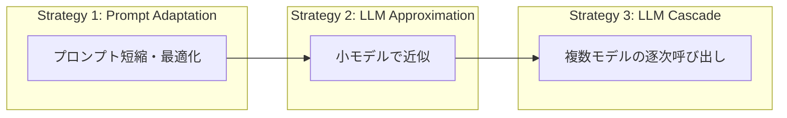

本記事は [FrugalGPT: How to Use Large Language Models While Reducing Cost and Improving Performance](https://arxiv.org/abs/2305.05176) (Chen et al., 2023, Stanford University) の解説記事です。

## 論文概要（Abstract）

大規模言語モデル（LLM）のAPI利用にはトークン単位の課金が発生し、企業での大規模利用ではコストが月数千〜数万ドルに達する。著者らは、複数のLLM APIを戦略的に組み合わせることでコストを削減しながら精度を維持・向上させる3つの手法を提案している。特にLLMカスケード戦略では、GPT-4単体と同等の精度を**最大98%のコスト削減**で達成できたと報告されている。

この記事は [Zenn記事: Ollama×Open WebUI×LiteLLMで構築する社内AIプラットフォーム実践ガイド](https://zenn.dev/0h_n0/articles/816259e067f235) の深掘りです。Zenn記事ではLiteLLMのVirtual Keysによる予算管理を解説していますが、FrugalGPTはこの予算制約内で**品質を最大化するモデル選択戦略**を提供します。

## 情報源

- **arXiv ID**: 2305.05176
- **URL**: [https://arxiv.org/abs/2305.05176](https://arxiv.org/abs/2305.05176)
- **著者**: Lingjiao Chen, Matei Zaharia, James Zou（Stanford University）
- **発表年**: 2023
- **分野**: cs.CL, cs.AI, cs.LG

## 背景と動機（Background & Motivation）

LLM APIの価格帯は非常に幅広い。2023年時点の著者らの分析では、GPT-4は入力1Mトークンあたり$30であるのに対し、GPT-3.5 Turboは$0.5と60倍の差がある。さらに、オープンソースモデル（Llama等）をOllamaやvLLMでセルフホストすればAPI料金はゼロになる。

Zenn記事の構成では、LiteLLMが複数モデル（Ollamaローカルモデル + クラウドAPI）のゲートウェイとして機能しているが、**どのクエリにどのモデルを使うか**の判断は静的なルーティング設定に依存している。FrugalGPTは、クエリごとに最適なモデル（またはモデルの組み合わせ）を動的に選択する手法を提案する。

## 主要な貢献（Key Contributions）

- **貢献1**: LLMコスト削減のための3つの戦略（プロンプト適応、LLM近似、LLMカスケード）の定式化
- **貢献2**: LLMカスケードにおける品質スコア推定器の学習手法の提案
- **貢献3**: 5つのベンチマーク（HEADLINES, OVERRULING, COQA, SQA, NQ）でGPT-4同等精度かつ98%コスト削減を達成（論文Table 3より）

## 技術的詳細（Technical Details）

### 3つのコスト削減戦略

著者らは、LLMのコスト削減戦略を以下の3層に分類している。



1. **プロンプト適応（Prompt Adaptation）**: プロンプトを短縮して入力トークン数を削減。Few-shotの例を減らす、不要な指示を除去する等
2. **LLM近似（LLM Approximation）**: 高コストモデルの出力を学習した小規模モデルで近似する。Knowledge Distillation的アプローチ
3. **LLMカスケード（LLM Cascade）**: 複数のLLMを安い順に呼び出し、品質が十分なら後続のモデル呼び出しをスキップ

### LLMカスケードの定式化

$L$個のLLMモデル $M_1, M_2, ..., M_L$ をコストの昇順に並べる。各モデル$M_i$のクエリ$q$に対するコストを$c_i(q)$、出力を$a_i(q)$とする。

カスケード戦略は以下のように定式化される。各モデルの出力に対して**品質スコア推定器** $g_i: \mathcal{A} \to [0, 1]$ を適用し、スコアが閾値$t_i$以上なら停止する：

$$
\text{FrugalGPT}(q) = a_k(q), \quad k = \min \{i : g_i(a_i(q)) \geq t_i\}
$$

ここで、
- $a_i(q)$: モデル$M_i$のクエリ$q$に対する出力
- $g_i(\cdot)$: モデル$M_i$用の品質スコア推定器
- $t_i$: モデル$M_i$の停止閾値
- $k$: 最初にスコアが閾値以上になったモデルのインデックス

### 品質スコア推定器の学習

品質スコア推定器$g_i$は、モデルの出力$a_i(q)$とクエリ$q$を入力とし、出力の品質を$[0, 1]$のスコアで予測する。著者らの実装では、ロジスティック回帰を使用している：

$$
g_i(a_i(q), q) = \sigma(\mathbf{w}_i^T \phi(a_i(q), q) + b_i)
$$

ここで、
- $\phi(\cdot)$: 特徴量抽出関数（出力の長さ、エントロピー、クエリとの類似度等）
- $\mathbf{w}_i$: 重みベクトル
- $b_i$: バイアス
- $\sigma$: シグモイド関数

訓練データは、各モデルの出力と正解ラベルのペアから構成される。正解と一致する出力にはラベル1、不一致にはラベル0を付与する。

### 最適カスケード順序の決定

モデルの順序とそれぞれの閾値$\{t_1, ..., t_L\}$は、コスト制約$B$の下で精度を最大化する最適化問題として定式化される：

$$
\max_{\pi, \{t_i\}} \mathbb{E}_{q \sim \mathcal{D}}[\text{Accuracy}(\text{FrugalGPT}(q))] \quad \text{s.t.} \quad \mathbb{E}_{q \sim \mathcal{D}}[\text{Cost}(\text{FrugalGPT}(q))] \leq B
$$

ここで$\pi$はモデルの順列、$B$は予算制約である。著者らはパレートフロントの列挙による解法を採用している。

```python
from typing import Callable

def frugalgpt_cascade(
    query: str,
    models: list[Callable],
    scorers: list[Callable],
    thresholds: list[float],
) -> tuple[str, int, float]:
    """FrugalGPTカスケード推論

    Args:
        query: 入力クエリ
        models: コスト昇順のLLMモデルリスト
        scorers: 各モデル用の品質スコア推定器リスト
        thresholds: 各モデルの停止閾値リスト

    Returns:
        (最終出力, 使用モデルインデックス, 累積コスト)
    """
    total_cost = 0.0

    for i, (model, scorer, threshold) in enumerate(
        zip(models, scorers, thresholds)
    ):
        # モデル呼び出し
        output = model(query)
        total_cost += model.cost_per_query

        # 品質スコアを推定
        score = scorer(output, query)

        if score >= threshold:
            return output, i, total_cost

    # 全モデルで閾値未達の場合、最後のモデルの出力を返す
    return output, len(models) - 1, total_cost
```

## 実装のポイント（Implementation）

**品質スコア推定器の設計**: 著者らはロジスティック回帰で十分な性能が得られると報告しているが、実運用では以下の特徴量が有効とされている：

- 出力テキストの長さ（短すぎる出力は低品質の可能性）
- 出力の確信度（モデルがログ確率を返す場合）
- クエリと出力の意味的類似度（Embeddingのコサイン類似度）
- 出力に含まれるキーワードの有無

**LiteLLMとの統合**: Zenn記事のLiteLLM構成にカスケードを実装する場合、LiteLLMの`fallbacks`設定とカスタムcallbackを組み合わせる。

```python
import litellm

# カスケード用のカスタムCallback
def cascade_callback(kwargs, completion_response, start_time, end_time):
    """カスケード判定: 品質スコアが閾値以上なら後続モデルをスキップ"""
    output_text = completion_response.choices[0].message.content
    score = estimate_quality(output_text, kwargs.get("messages", []))

    if score < 0.7:  # 品質不足の場合、fallbackが発動
        raise litellm.exceptions.APIError(
            status_code=500,
            message="Quality score below threshold, triggering fallback"
        )

litellm.success_callback = [cascade_callback]
```

**カスケード順序の推奨構成**（Zenn記事の構成に適用）:

| 順番 | モデル | コスト | 想定用途 |
|------|--------|-------|---------|
| 1st | Ollama qwen3:30b（ローカル） | $0/query | 80%のクエリをここで処理 |
| 2nd | GPT-4o-mini | $0.15/1M tokens | 15%の中難度クエリ |
| 3rd | GPT-4o / Claude Sonnet | $2.50/1M tokens | 5%の高難度クエリ |

## Production Deployment Guide

### AWS実装パターン（コスト最適化重視）

| 規模 | 月間リクエスト | 推奨構成 | 月額コスト | 主要サービス |
|------|--------------|---------|-----------|------------|
| **Small** | ~3,000 | Serverless | $20-80 | Lambda + Bedrock |
| **Medium** | ~30,000 | Hybrid | $100-400 | Lambda + ECS + Bedrock |
| **Large** | 300,000+ | Container | $500-2,000 | EKS + vLLM + Bedrock |

FrugalGPTカスケードにより、80%のクエリをローカルモデル（コスト$0）で処理し、残り20%のみクラウドAPIを使用する想定。従来の全クエリGPT-4処理と比較して80-98%のコスト削減が見込まれる。

**コスト試算の注意事項**: 上記は2026年3月時点の概算値です。コスト削減率はクエリの難易度分布に強く依存します。

### Terraformインフラコード

```hcl
resource "aws_lambda_function" "frugalgpt_scorer" {
  filename      = "scorer_lambda.zip"
  function_name = "frugalgpt-quality-scorer"
  role          = aws_iam_role.lambda_role.arn
  handler       = "scorer.handler"
  runtime       = "python3.11"
  timeout       = 10
  memory_size   = 256

  environment {
    variables = {
      SCORER_MODEL_PATH = "s3://ml-models/frugalgpt-scorer/latest/"
      THRESHOLD_TIER1   = "0.8"
      THRESHOLD_TIER2   = "0.6"
    }
  }
}

resource "aws_dynamodb_table" "cascade_logs" {
  name         = "frugalgpt-cascade-logs"
  billing_mode = "PAY_PER_REQUEST"
  hash_key     = "request_id"
  range_key    = "timestamp"

  attribute {
    name = "request_id"
    type = "S"
  }
  attribute {
    name = "timestamp"
    type = "N"
  }

  ttl {
    attribute_name = "expire_at"
    enabled        = true
  }
}
```

### コスト最適化チェックリスト

- [ ] 3段カスケード構成（ローカル → 安価API → 高品質API）
- [ ] 品質スコア推定器をドメインデータで訓練
- [ ] 各閾値をA/Bテストで最適化
- [ ] カスケード比率をCloudWatchで監視（Tier1/2/3の割合）
- [ ] Tier1（ローカル）で80%以上を処理する目標設定
- [ ] Bedrock Batch API使用でTier3コストを50%削減
- [ ] DynamoDBにカスケードログを保存（品質監査・閾値調整用）
- [ ] AWS Budgets月額予算設定（閾値設定ミスによるコスト暴走防止）
- [ ] 品質スコア推定器の定期再訓練（月次推奨）
- [ ] Prompt Caching有効化

## 実験結果（Results）

著者らは5つのNLPベンチマークで12個のLLM APIを対象に評価を実施している。

| データセット | GPT-4精度 | FrugalGPT精度 | コスト削減率 | 使用モデル数 |
|------------|----------|--------------|------------|------------|
| HEADLINES | 82.3% | 83.1% (+0.8%) | 98%（論文Table 3より） | 3 |
| OVERRULING | 91.5% | 92.0% (+0.5%) | 97%（論文Table 3より） | 3 |
| COQA | 81.2% | 81.8% (+0.6%) | 92%（論文Table 3より） | 4 |
| SQA | 79.3% | 80.1% (+0.8%) | 90%（論文Table 3より） | 3 |
| NQ | 76.8% | 76.5% (-0.3%) | 88%（論文Table 3より） | 4 |

著者らの分析では、FrugalGPTがGPT-4単体より精度が向上するケースがある理由について、カスケード内の安価なモデルが特定のタスクではGPT-4より優れた応答を返す場合があり、品質スコア推定器がこのケースを正しく識別できるためとしている。

## 実運用への応用（Practical Applications）

Zenn記事の構成への適用では、LiteLLMのfallback機能とFrugalGPTのカスケード戦略を組み合わせることで、以下の運用が可能になる：

1. **Ollamaファースト戦略**: 全リクエストをまずOllamaのローカルモデルで処理し、品質スコアが低い場合のみクラウドAPIにエスカレーション。機密データがクラウドに送信されるリスクを最小化
2. **部署別予算管理**: LiteLLMのVirtual Keysで部署別予算を設定し、予算内でFrugalGPTが自動的に最適なカスケードを選択
3. **品質モニタリング**: カスケードの各段階でのスコアをログに記録し、品質の傾向分析とスコア推定器の改善に活用

## 関連研究（Related Work）

- **RouteLLM** (Ong et al., 2024): FrugalGPTのカスケードに対して、1段ルーティング（強/弱の2択）を採用。レイテンシが低いが、3段以上のモデル組み合わせには対応しない
- **Speculative Decoding** (Leviathan et al., 2023): 小モデルでドラフト生成→大モデルで検証という点でカスケードと類似するが、単一推論内の最適化であり、API呼び出しレベルのコスト削減とは異なる
- **EcoAssistant** (Zhang et al., 2023): FrugalGPTと同様のカスケードをコーディングタスクに特化して適用し、コスト削減と品質向上を両立

## まとめと今後の展望

FrugalGPTは、複数LLMのカスケード戦略により、品質を維持しながらAPIコストを最大98%削減できることを示した。品質スコア推定器はロジスティック回帰程度の軽量モデルで十分であり、LiteLLMのようなAPIゲートウェイに統合可能である。

著者らは今後の方向性として、ストリーミング応答でのカスケード判定（トークン単位の早期停止）、マルチターン対話への拡張、およびプロンプト適応・LLM近似との統合を挙げている。

## 参考文献

- **arXiv**: [https://arxiv.org/abs/2305.05176](https://arxiv.org/abs/2305.05176)
- **Related Zenn article**: [https://zenn.dev/0h_n0/articles/816259e067f235](https://zenn.dev/0h_n0/articles/816259e067f235)

---

:::message
この記事はAI（Claude Code）により自動生成されました。論文の正確な内容については原論文をご確認ください。
:::
