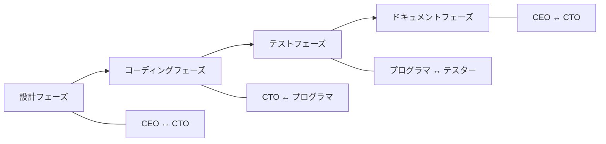

本記事は [ChatDev: Communicative Agents for Software Development](https://arxiv.org/abs/2307.07924) の解説記事です。

## 論文概要（Abstract）

ChatDevは、LLM駆動の複数エージェントが役割分担してソフトウェア開発の全フェーズ（設計→コーディング→テスト→ドキュメント作成）を自動化するフレームワークです。著者らは「チャットチェーン」と呼ぶ対話形式のワークフローを設計し、各エージェントにCEO・CTO・プログラマ・テスターなどの役割を割り当てます。70のソフトウェア生成タスクでの実験で、GPT-3.5-turbo使用時に平均7分未満・1ドル未満で完全なソフトウェアシステムを生成できたと著者らは報告しています。

この記事は [Zenn記事: Claude CodeでAI拡張開発を実現する6層アーキテクチャ実践ガイド](https://zenn.dev/0h_n0/articles/aa25c4b338d464) の深掘りです。

## 情報源

- **arXiv ID**: 2307.07924
- **URL**: [https://arxiv.org/abs/2307.07924](https://arxiv.org/abs/2307.07924)
- **著者**: Chen Qian, Xin Cong, Wei Liu, Cheng Yang, Weize Chen, Yusheng Su, Yufan Deng, Jiahao Li, Juyuan Xu, Dahai Li, Zhiyuan Liu, Maosong Sun（清華大学 NLP Lab）
- **発表年**: 2023
- **分野**: cs.SE, cs.AI, cs.MA

## 背景と動機（Background & Motivation）

従来のLLMベースコード生成は、単一モデルが単一プロンプトからコードを出力するアプローチが主流でした。しかし、実際のソフトウェア開発は要件分析→設計→実装→テスト→デプロイという複数フェーズにわたる協調作業です。

著者らは、この協調プロセスをLLMエージェント間の「対話」としてモデル化するアプローチを提案しました。各エージェントは特定の役割（ペルソナ）を持ち、フェーズごとにペアで対話を行うことでタスクを遂行します。この設計は、ソフトウェアエンジニアリングの実際の組織構造（役割分担と対話）を模倣しています。

ソフトウェア開発における「ウォーターフォール」モデルの各段階をLLMエージェント間の対話チェーンとして実装するという発想は、Claude CodeのAgent Teams（Layer 5）が「チームメイト同士の直接通信」を可能にする設計と直接対応しています。

## 主要な貢献（Key Contributions）

- **チャットチェーン（Chat Chain）**: ソフトウェア開発プロセスを、フェーズごとの対話セッションの連鎖としてモデル化
- **役割ベースのエージェント設計**: CEO、CTO、プログラマ、アートデザイナー、テスターなどの明示的な役割割り当て
- **思考的指示（Inception Prompting）**: 各エージェントの役割と責務を明確に指示するプロンプト手法。ハルシネーションの抑制に寄与
- **経験共有機構**: エージェント間で過去の経験（短期記憶）を共有する仕組み

## 技術的詳細（Technical Details）

### チャットチェーンアーキテクチャ

ChatDevの中核は「チャットチェーン」です。ソフトウェア開発プロセスを4つのフェーズに分割し、各フェーズを担当するエージェントのペアが対話を行います。



各フェーズの対話は以下の形式で進行します。

**設計フェーズ（CEO ↔ CTO）**:
CEOがユーザーの要件をCTOに伝え、CTOが技術的な設計（使用する言語、フレームワーク、モジュール構成）を提案します。数ターンの対話でアーキテクチャが決定されます。

**コーディングフェーズ（CTO ↔ プログラマ）**:
CTOが設計仕様を基にプログラマに指示し、プログラマがコードを生成します。CTOはコードレビューを行い、フィードバックを返します。

**テストフェーズ（プログラマ ↔ テスター）**:
テスターが生成されたコードに対してテストケースを設計・実行し、バグを報告します。プログラマはバグ修正を行います。このループはテストが通過するまで繰り返されます。

**ドキュメントフェーズ（CEO ↔ CTO）**:
最終的な環境仕様書（requirements.txt）とユーザーマニュアルを生成します。

### 思考的指示（Inception Prompting）

各エージェントには「思考的指示」と呼ばれるプロンプトが与えられます。これは以下の構造を持ちます。

$$
P_{\text{role}} = \{r, d, c, f\}
$$

ここで、
- $r$: 役割名（例: "CTO"）
- $d$: 役割の説明（例: "あなたはソフトウェア企業のCTOです。技術的な意思決定を行います"）
- $c$: コミュニケーションプロトコル（対話の終了条件、出力フォーマット）
- $f$: 制約条件（例: "幻覚を避けるため、確実でないことは述べない"）

この思考的指示が重要なのは、LLMが「役割」を持つことでハルシネーションが抑制されるためです。著者らは論文Section 3.2で、思考的指示なしの場合と比較してハルシネーション率が低減したと報告しています。

### エージェント間の対話プロトコル

各対話セッションは以下のアルゴリズムに従います。

```python
def chat_session(
    agent_a: Agent,
    agent_b: Agent,
    task: str,
    max_turns: int = 10
) -> str:
    """2つのエージェント間の対話セッション

    Args:
        agent_a: 指示を出すエージェント（例: CTO）
        agent_b: 指示を実行するエージェント（例: プログラマ）
        task: このセッションのタスク記述
        max_turns: 最大対話ターン数

    Returns:
        セッションの最終成果物（コード、設計書など）
    """
    context = initialize_context(task)

    for turn in range(max_turns):
        # Agent A が指示・フィードバックを生成
        instruction = agent_a.generate(
            role=agent_a.role_prompt,
            context=context,
            message_type="instruction"
        )

        # Agent B が指示に基づいて作業を実行
        response = agent_b.generate(
            role=agent_b.role_prompt,
            context=context + instruction,
            message_type="response"
        )

        context.append(instruction, response)

        # 終了条件チェック
        if is_task_complete(response):
            break

    return extract_artifact(context)
```

### 経験共有メカニズム

ChatDevでは、各フェーズの成果物が次のフェーズに引き継がれます。これは「短期記憶」として機能します。

$$
M_{\text{phase}_i} = \{A_{i-1}, C_{i-1}, F_{i-1}\}
$$

ここで、
- $A_{i-1}$: 前フェーズの成果物（コード、設計書など）
- $C_{i-1}$: 前フェーズの対話履歴のサマリー
- $F_{i-1}$: 前フェーズのフィードバック（レビューコメントなど）

この仕組みにより、テストフェーズのエージェントは設計フェーズでの決定事項を参照でき、コンテキストの一貫性が保たれます。

## 実装のポイント（Implementation）

**LLMバックエンド**: GPT-3.5-turbo（主）とGPT-4（一部の実験）を使用。OpenAI APIを経由。各エージェントは独立したAPIコールとして実装されています。

**プロンプトテンプレートの管理**: 各役割のプロンプトはテンプレートとして管理され、タスク固有の情報（ユーザー要件、前フェーズの成果物）が動的に挿入されます。

**テストの自動実行**: テストフェーズでは、生成されたコードが実際に実行され、エラーがあればスタックトレースがテスターエージェントにフィードバックされます。

**コスト管理**: 著者らによると、GPT-3.5-turboの場合、1つのソフトウェアシステム生成に平均$0.2-$1.0のコストがかかります（論文Table 3より）。これはフェーズ数とターン数に比例します。

## 実験結果（Results）

### 生成性能

著者らが論文Table 3で報告している主要な結果です。

| 指標 | GPT-3.5-turbo | GPT-4 |
|---|---|---|
| 平均生成時間 | 409.84秒 | 1,023.12秒 |
| 平均コスト | $0.88 | $7.12 |
| 平均ファイル数 | 7.87 | 10.41 |
| 平均コード行数 | 131.61 | 226.57 |
| テスト通過率 | 86.66% | 92.31% |

### 定性的評価

著者らは70のソフトウェア生成タスク（テトリス、ToDoアプリ、電卓、チャットボットなど）で評価しています。主な発見は以下の通りです。

- **設計の一貫性**: チャットチェーン方式では、設計とコードの整合性が維持される。単一プロンプト方式では、設計の詳細が実装に反映されないケースが多かった
- **バグ修正能力**: テストフェーズの対話ループにより、初回生成時のバグの約50%が自動修正された
- **ハルシネーション抑制**: 思考的指示により、存在しないライブラリやAPIへの参照が減少した

### 他のマルチエージェントフレームワークとの比較

| フレームワーク | エージェント数 | フェーズ構造 | テスト統合 |
|---|---|---|---|
| ChatDev | 5-8 | ウォーターフォール | 有 |
| MetaGPT | 5 | SOPベース | 有 |
| AgileCoder | 4-6 | スクラム/スプリント | 有 |

## ChatDevの進化: ChatDev 2.0とExperiential Co-Learning

ChatDevは初版論文の後も進化を続けています。著者らの後続研究（arXiv: 2312.17025）では「Experiential Co-Learning」という拡張が提案されました。

**Experiential Co-Learning**では、過去のソフトウェア生成タスクからの経験（成功パターンと失敗パターン）をエージェントの長期記憶として蓄積します。これにより、類似タスクに対して過去の経験を活用した効率的な開発が可能になります。

$$
P_{\text{experience}}(a \mid s, M_{\text{long}}) = \frac{\exp(f(s, a, M_{\text{long}}))}{\sum_{a'} \exp(f(s, a', M_{\text{long}}))}
$$

ここで、
- $s$: 現在の状態（タスク記述 + 対話履歴）
- $a$: エージェントが生成するアクション
- $M_{\text{long}}$: 長期記憶に蓄積された過去の経験
- $f$: 経験と現在の状態の関連度を計算するスコア関数

この長期記憶の導入により、ChatDevのテスト通過率はGPT-3.5-turboで86.66%から90.1%に改善されたと著者らの後続研究で報告されています。

Claude Codeにおいては、CLAUDE.md（Layer 1）がプロジェクト固有の「知識」を蓄積する仕組みに相当し、Skills（Layer 3）が特定ワークフローの「経験」をオンデマンドで供給する仕組みに対応しています。ChatDevの経験共有はセッションをまたいだ学習であり、Claude Codeのメモリシステム（`~/.claude/`以下に保存される自動メモリ）と類似した発展方向です。

## 実運用への応用（Practical Applications）

ChatDevの設計はClaude CodeのAgent Teams（Layer 5）と直接対応しています。

**チャットチェーン ↔ Agent Teamsの共有タスクリスト**: ChatDevのフェーズ分割は、Agent Teamsのチームリードがタスクを分配し、チームメイトが実行する構造と類似しています。

**役割ベースのプロンプト ↔ エージェント定義ファイル**: ChatDevの思考的指示は、Claude Codeの`.claude/agents/`ディレクトリに配置するエージェント定義ファイルと同じ目的を果たしています。

**対話のターン制限 ↔ コンテキスト管理**: ChatDevの各セッションにおけるターン制限は、Claude Codeのコンテキストウィンドウ管理と同じ制約から来ています。対話が長くなるとLLMの性能が低下するためです。

**制約と課題**: ChatDevは比較的単純なソフトウェア（単一ファイルまたは数ファイル）の生成に限定されています。大規模なプロジェクト（数百ファイル）への適用は検証されていません。また、GPT-4使用時の$7.12/システムというコストは、頻繁な利用には高額です。Claude CodeのAgent Teamsにおいても、Anthropic公式ドキュメントが「トークンコストがチームサイズに比例する」と注意喚起しています。

## 関連研究（Related Work）

- **MetaGPT** (Hong et al., 2023): SOPベースのマルチエージェントSEフレームワーク。ChatDevとの違いは、MetaGPTがUML図や設計ドキュメントなどの「中間成果物」を明示的に生成する点
- **AutoGen** (Wu et al., 2023): Microsoftによる汎用マルチエージェント会話フレームワーク。SE特化ではないが、エージェント間の対話プロトコルの設計に影響を与えている
- **CAMEL** (Li et al., 2023): 2エージェントのロールプレイ対話フレームワーク。ChatDevの対話セッション設計に影響を与えた先行研究

## まとめと今後の展望

ChatDevは、マルチエージェントによるソフトウェア開発の可能性を実証した重要な研究です。役割ベースのエージェント設計、チャットチェーンによるフェーズ管理、思考的指示によるハルシネーション抑制は、2026年のAIコーディングツール（Claude Code Agent Teams含む）の設計に影響を与えています。

ただし、生成されるソフトウェアの規模や品質には制約があり、現時点では実務レベルのプロダクション開発を完全に自動化するには至っていません。Claude CodeのAgent Teamsが推奨チームサイズを3-5名に限定し、ルーティンタスクには単一セッションを推奨しているのは、こうした制約を踏まえた実用的な判断です。

## 参考文献

- **arXiv**: [https://arxiv.org/abs/2307.07924](https://arxiv.org/abs/2307.07924)
- **Code**: [https://github.com/OpenBMB/ChatDev](https://github.com/OpenBMB/ChatDev)
- **Related Zenn article**: [https://zenn.dev/0h_n0/articles/aa25c4b338d464](https://zenn.dev/0h_n0/articles/aa25c4b338d464)
