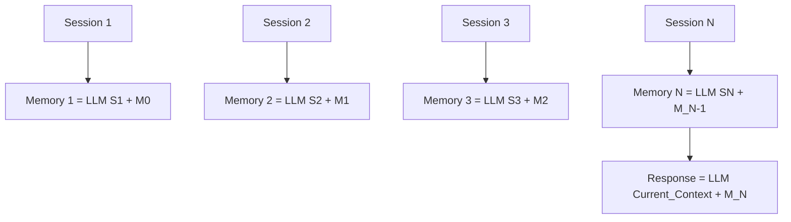

本記事は [arXiv:2308.15022](https://arxiv.org/abs/2308.15022)（Wang et al., 2023、Neurocomputing採録）の解説記事です。

## 論文概要（Abstract）

LLMは動的な対話を生成できるが、長期にわたる会話の一貫性を維持することが困難である。著者らは**再帰的要約（Recursive Summarization）**手法を提案し、LLMに小さな対話コンテキストを段階的に記憶させ、前のメモリと後続のコンテキストから再帰的に新しいメモリを生成するアプローチを示している。Multi-Session Chat（MSC）およびCarecallデータセットでの評価において、一貫性（Consistency）と応答品質の改善が報告されている。

この記事は [Zenn記事: LLM会話スレッド管理の本番設計 Redis・PostgreSQL・3大APIパターン比較](https://zenn.dev/0h_n0/articles/d741db8cb57195) の深掘りです。

## 情報源

- **arXiv ID**: 2308.15022
- **URL**: [https://arxiv.org/abs/2308.15022](https://arxiv.org/abs/2308.15022)
- **著者**: Qingyue Wang, Yanhe Fu, Yanan Cao, Shuai Wang, Zhiliang Tian, Liang Ding
- **発表年**: 2023（2025年v4改訂、Neurocomputing採録）
- **分野**: cs.CL, cs.AI

## 背景と動機（Background & Motivation）

LLMベースのチャットボットでは、会話が長くなるにつれてコンテキストウィンドウの制約やトークンコストの増加が問題となる。Zenn記事では、この課題に対して**スライディングウィンドウ**、**LLM要約圧縮**、**トークンバジェット制御**の3つのCompaction戦略を解説した。

本論文は、このうち「LLM要約圧縮」戦略を深掘りし、**セッションを跨ぐ長期対話**においても一貫した応答を生成するための再帰的要約手法を提案している。従来のretrieval-basedアプローチ（BM25やDPRで過去の発話を検索する方式）との比較も行われている。

## 主要な貢献（Key Contributions）

- **貢献1**: セッション単位で再帰的にメモリを更新する手法の提案。前のメモリと新しいセッションから新しいメモリを生成する
- **貢献2**: MSCとCarecallの2つのデータセットで、既存手法（MemoryBank、MemoChat、BM25、DPR）を上回る性能を達成
- **貢献3**: 長期コンテキストLLM（GPT-3.5-16k, GPT-4o）やretrieval手法（BM25, DPR）との**相補性**を実証

## 技術的詳細（Technical Details）

### 手法の全体像



### 数式定義

著者らは応答生成を以下の確率分布として定式化している（論文Eq. 1より）。

$$
P(r_t | C_t, S) = P(r_t | C_t, M_N) \times P(M_N | S)
$$

ここで、
- $r_t$: 現在のターンの応答
- $C_t$: 現在の対話コンテキスト
- $S = \{S_1, S_2, \ldots, S_N\}$: 過去のセッション集合
- $M_N$: N回のセッション後の累積メモリ

$P(M_N | S)$ は再帰的に展開される:

$$
P(M_N | S) = \prod_{i=1}^{N} P(M_i | S_i, M_{i-1})
$$

### メモリ更新（Memory Iteration）

各セッション $S_i$ の後、メモリは以下のように更新される（論文Eq. 2より）。

$$
M_i = \text{LLM}(S_i, M_{i-1}, P_m)
$$

ここで $P_m$ はメモリ更新用のプロンプトテンプレート。$M_0 = \text{"none"}$（初期状態）。

### 応答生成（Response Generation）

最新のメモリ $M_N$ と現在のコンテキスト $C_t$ から応答を生成する（論文Eq. 3より）。

$$
r_t = \text{LLM}(C_t, M_N, P_r)
$$

ここで $P_r$ は応答生成用のプロンプトテンプレート。

### アルゴリズム（論文Algorithm 1より）

```python
def recursive_summarize_and_respond(
    dialogue: dict,
    llm,
    prompt_memory: str,
    prompt_response: str,
) -> str:
    """再帰的要約による長期対話メモリ

    Args:
        dialogue: {"sessions": [S1, ..., SN], "current": C_t}
        llm: LLMモデル（ChatGPT等）
        prompt_memory: メモリ更新用プロンプト
        prompt_response: 応答生成用プロンプト

    Returns:
        応答文字列
    """
    sessions = dialogue["sessions"]
    current_context = dialogue["current"]

    # Step 1: メモリ初期化
    memory = "none"

    # Step 2: 各セッションで再帰的にメモリを更新
    for session in sessions:
        memory = llm(
            session=session,
            previous_memory=memory,
            prompt=prompt_memory,
        )

    # Step 3: 最新メモリ + 現在コンテキストから応答生成
    response = llm(
        context=current_context,
        memory=memory,
        prompt=prompt_response,
    )
    return response
```

### プロンプト設計の詳細

著者らのメモリ更新プロンプトは4つのコンポーネントから構成されている。

1. **タスク定義**: ロール定義と入出力仕様
2. **タスク説明**: 4ステップの処理手順
3. **メモリ制約**: 更新ごとに最大20文まで
4. **入力**: 前のメモリ + セッションコンテキスト

応答生成プロンプトは5ステップの抽出・活用プロセスとして設計されている。

## 実験結果（Results）

### 主要結果（論文Table、Session 5での比較）

| 手法 | MSC F1 | MSC BertScore | Carecall F1 |
|------|--------|-------------|-------------|
| ChatGPT（ベースライン） | 19.41 | 86.13 | 13.69 |
| ChatGPT + BM25 (k=3) | 19.56 | 85.82 | 12.64 |
| ChatGPT + DPR (k=3) | 20.23 | 86.04 | 12.21 |
| ChatGPT + MemoChat | 18.93 | 85.99 | 11.19 |
| ChatGPT + MemoryBank | 20.28 | 86.12 | 13.15 |
| **ChatGPT + Rsum（提案手法）** | **20.48** | **86.89** | **14.02** |

著者らによると、提案手法はMSCデータセットのF1スコアでベースラインから+1.07ポイント、MemoryBankから+0.20ポイントの改善を達成している。

### GPT-4による評価（論文より）

| 手法 | Engagingness | Coherence | Consistency | 平均 |
|------|-------------|-----------|-------------|------|
| ChatGPT + Rsum | 78.92 | 83.56 | 84.76 | 82.41 |
| ChatGPT + MemoryBank | 74.68 | 80.92 | 84.56 | 80.05 |
| ChatGPT + MemoChat | 72.32 | 77.36 | 78.96 | 76.21 |
| ChatGPT | 75.48 | 75.00 | 75.48 | 75.32 |

一貫性（Consistency）スコアで84.76を達成し、ベースラインの75.48から+9.28ポイントの改善が報告されている。

### Retrieval手法・長期コンテキストLLMとの相補性（論文より）

本手法の重要な特性として、既存の検索手法や長期コンテキストLLMと**組み合わせ可能**であることが報告されている。

| 手法 | F1 | Coherence | Consistency |
|------|-----|-----------|-------------|
| ChatGPT + BM25 | 20.91 | 75.44 | 76.88 |
| ChatGPT + BM25 + Rsum | **21.81** | **84.44** | **90.68** |
| GPT-4o | 20.35 | 87.70 | 82.00 |
| GPT-4o + Rsum | **21.02** | **91.12** | **93.29** |

GPT-4oにRsumを組み合わせることで、Consistency が82.00 → 93.29に改善されたと報告されている。これは、コンテキストウィンドウの拡大だけでは長期対話の一貫性を十分に確保できないことを示唆している。

### メモリ品質分析

著者らが100対話をサンプリングして分析した結果、生成されたメモリのエラー率は以下のとおりである。

- **事実の捏造**: 2.7%
- **関係の誤認**: 3.2%
- **詳細の欠落**: 3.9%
- **合計エラー率**: <10%

エラー率が10%未満であり、下流の対話タスクに対して許容範囲内であると著者らは報告している。

### Ablation Study

| 構成 | BertScore | F1 |
|------|----------|-----|
| 提案手法（Rsum） | 86.89 | 20.48 |
| メモリなし | 85.40 | 18.94 |
| ゴールドメモリ（人手要約） | 85.93 | 20.46 |

注目すべきは、LLMが生成したメモリ（F1: 20.48）が人手で作成したゴールドメモリ（F1: 20.46）をわずかに上回っている点である。著者らはこれを「LLM生成メモリのほうが一貫性と長期依存関係のモデリングに優れている」ためと分析している。

## 実装のポイント（Implementation）

### Zenn記事のCompaction戦略との対応

本論文の手法は、Zenn記事で解説した「LLM要約圧縮」戦略の**セッション横断版**として位置づけられる。

```python
async def recursive_memory_compaction(
    sessions: list[list[dict]],
    current_context: list[dict],
    model: str = "gpt-4o-mini",
    max_memory_sentences: int = 20,
) -> list[dict]:
    """再帰的メモリ圧縮（論文手法のプロダクション実装例）

    Args:
        sessions: 過去のセッション履歴のリスト
        current_context: 現在のセッションのメッセージ
        model: 要約に使用するモデル
        max_memory_sentences: メモリの最大文数

    Returns:
        最適化されたメッセージリスト
    """
    memory = "なし"

    for session in sessions:
        session_text = format_session(session)
        memory = await generate_memory_update(
            previous_memory=memory,
            session_text=session_text,
            model=model,
            max_sentences=max_memory_sentences,
        )

    # メモリ + 現在のコンテキストで応答用メッセージを構成
    return [
        {"role": "system", "content": f"過去の会話メモリ:\n{memory}"},
        *current_context,
    ]
```

**制約・注意点**:
- 各セッション終了時にLLM呼び出しが1回発生するため、リアルタイム性が求められる場面ではバッチ処理が必要
- メモリ更新の温度は0（deterministic）が推奨される（論文の設定に準拠）
- 20文の上限はMSCデータセットに最適化された値であり、ユースケースに応じて調整が必要

## 実運用への応用（Practical Applications）

### Redisとの組み合わせ

Zenn記事のRedis + PostgreSQLハイブリッド構成に本論文の手法を統合する場合:

1. **Redis**: アクティブセッションの短期メモリ（直近メッセージ）を保持
2. **PostgreSQL**: セッション終了時に再帰的要約メモリを保存
3. **セッション復元時**: PostgreSQLから最新メモリを取得し、Redisのセッションに注入

この構成により、セッション横断の一貫性を維持しつつ、各セッション内のレイテンシをRedisのサブミリ秒レベルに保つことができる。

### コスト分析

gpt-4o-miniを要約モデルとして使用する場合（Zenn記事の推奨に一致）:
- メモリ更新1回: 約500-1000トークン入力 → $0.000075-$0.00015
- 10セッション分の累積更新: 約$0.001未満
- メイン応答生成のコストと比較して1/100以下

## 関連研究（Related Work）

- **MemoryBank**（Zhong et al., 2024）: Ebbinghaus忘却曲線に基づくメモリ減衰モデル。本論文は再帰的要約で上回る
- **MemoChat**（Lu et al., 2023）: 構造化メモ取りによる長期対話。手動のメモ構造設計が必要
- **MemGPT**（Packer et al., 2023）: OSのページング機構に着想を得たLLMメモリ管理

## まとめと今後の展望

著者らは、再帰的要約によりLLMの長期対話メモリを実現し、MSCベンチマークで既存手法を上回る性能を達成した。本手法はretrieval手法や長期コンテキストLLMと相補的であり、組み合わせることでさらなる改善が得られる。Zenn記事のCompaction戦略（特にLLM要約圧縮）の理論的裏付けとなる研究であり、セッション横断の一貫性維持に有効なアプローチである。

## 参考文献

- **arXiv**: [https://arxiv.org/abs/2308.15022](https://arxiv.org/abs/2308.15022)
- **Code**: [GitHub](https://github.com/nicoleqiyun/Rsum)（著者リポジトリ）
- **Related Zenn article**: [https://zenn.dev/0h_n0/articles/d741db8cb57195](https://zenn.dev/0h_n0/articles/d741db8cb57195)

---

:::message
本記事はAI（Claude Code）により自動生成されました。論文の内容を正確に伝えることを目的としていますが、解釈に誤りがある可能性があります。原論文もあわせてご確認ください。
:::
