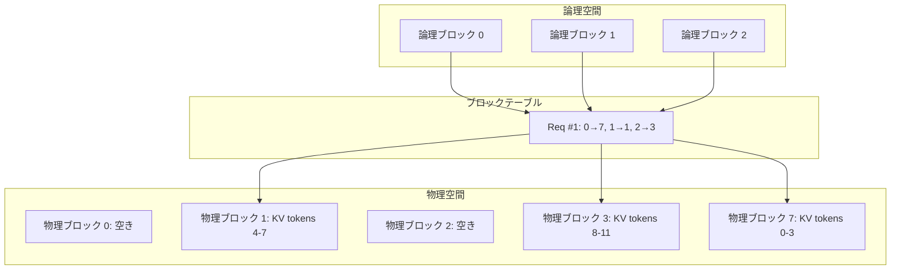

本記事は [Efficient Memory Management for Large Language Model Serving with PagedAttention](https://arxiv.org/abs/2309.06180) (Kwon et al., 2023) の解説記事です。

## 論文概要（Abstract）

LLMサービングにおいて、KV（Key-Value）キャッシュのメモリ管理がスループットの主要なボトルネックとなっている。著者らは、OSの仮想メモリ管理に着想を得た**PagedAttention**を提案し、KVキャッシュを固定サイズのブロック（ページ）に分割して非連続な物理メモリ上に配置する手法を実現した。この手法を実装したvLLMシステムは、既存のLLMサービングシステムと比較してスループットを2〜24倍向上させたと報告されている。

この記事は [Zenn記事: Ollama×Open WebUI×LiteLLMで構築する社内AIプラットフォーム実践ガイド](https://zenn.dev/0h_n0/articles/816259e067f235) の深掘りです。Zenn記事ではOllamaをLLM推論バックエンドとして使用していますが、50ユーザー以上の大規模環境ではvLLMへの移行が推奨されています。本記事では、vLLMの中核技術であるPagedAttentionの仕組みを技術的に解説します。

## 情報源

- **arXiv ID**: 2309.06180
- **URL**: [https://arxiv.org/abs/2309.06180](https://arxiv.org/abs/2309.06180)
- **著者**: Woosuk Kwon, Zhuohan Li, Siyuan Zhuang, Ying Sheng et al.（UC Berkeley）
- **発表年**: 2023
- **分野**: cs.CL, cs.LG
- **発表会議**: SOSP 2023（ACM Symposium on Operating Systems Principles）

## 背景と動機（Background & Motivation）

LLMの推論（inference）は、Transformer のSelf-Attention計算において過去のトークンのKey・Valueベクトルを保持する**KVキャッシュ**を必要とする。このKVキャッシュは、リクエストごとにモデルの層数×ヘッド数×次元数のメモリを消費し、生成トークン数に比例して動的に増大する。

著者らの分析（論文Section 2）によると、既存のLLMサービングシステム（Hugging Face Transformers、FasterTransformer等）では、KVキャッシュに対して**事前に最大系列長分のメモリを連続領域で確保**するため、以下の3つの問題が生じていた。

1. **内部フラグメンテーション**: 実際の生成長が最大長より短い場合、確保したメモリの大部分が無駄になる
2. **外部フラグメンテーション**: リクエストの開始・終了によるメモリの断片化
3. **メモリ共有の困難**: ビームサーチやパラレルサンプリングで同一プレフィックスのKVキャッシュを共有できない

著者らの測定では、既存システムにおいてKVキャッシュの**メモリ利用効率は20.4%〜38.2%**に留まっていた（論文Table 3より）。

## 主要な貢献（Key Contributions）

- **貢献1**: OSの仮想メモリ管理をKVキャッシュに適用した**PagedAttention**アルゴリズムの提案
- **貢献2**: PagedAttentionを基盤とした高スループットLLMサービングシステム**vLLM**の実装
- **貢献3**: Copy-on-Write機構によるKVキャッシュの効率的な共有（ビームサーチ、パラレルサンプリング対応）

## 技術的詳細（Technical Details）

### PagedAttentionアルゴリズム

従来のSelf-Attentionでは、KVキャッシュは連続したメモリ領域に格納される必要があった。PagedAttentionはこの制約を取り除き、KVキャッシュを**固定サイズのブロック**に分割する。

標準的なSelf-Attentionの計算は以下の通りである：

$$
\text{Attention}(Q, K, V) = \text{softmax}\left(\frac{QK^T}{\sqrt{d_k}}\right)V
$$

ここで、
- $Q \in \mathbb{R}^{1 \times d_k}$: 現在のトークンのQueryベクトル
- $K \in \mathbb{R}^{n \times d_k}$: 過去$n$トークンのKeyベクトル（KVキャッシュ）
- $V \in \mathbb{R}^{n \times d_v}$: 過去$n$トークンのValueベクトル（KVキャッシュ）
- $d_k$: Keyの次元数

PagedAttentionでは、KVキャッシュを$B$トークン単位のブロックに分割する。ブロック$j$に含まれるKey・Valueは$K_j \in \mathbb{R}^{B \times d_k}$、$V_j \in \mathbb{R}^{B \times d_v}$とする。Attentionの計算は以下のようにブロック単位で実行される（論文Equation 1に相当）：

$$
A_j = \frac{\exp(q K_j^T / \sqrt{d_k})}{\sum_{i=1}^{\lceil n/B \rceil} \sum_{k=1}^{B} \exp(q K_{i,k}^T / \sqrt{d_k})}
$$

$$
o = \sum_{j=1}^{\lceil n/B \rceil} A_j V_j
$$

ここで、
- $q \in \mathbb{R}^{1 \times d_k}$: 現在のトークンのQuery
- $A_j \in \mathbb{R}^{1 \times B}$: ブロック$j$に対するAttention重み
- $o \in \mathbb{R}^{1 \times d_v}$: 出力ベクトル

各ブロックは物理メモリ上で非連続に配置でき、**ブロックテーブル**（OSのページテーブルに相当）を通じて論理ブロック番号から物理メモリアドレスへのマッピングを管理する。

### メモリ管理アーキテクチャ



vLLMのメモリマネージャは以下の3つのコンポーネントで構成される：

1. **ブロックアロケータ**: 物理ブロックの割り当て・解放を管理（フリーリスト方式）
2. **ブロックテーブル**: リクエストごとの論理→物理ブロックのマッピング
3. **スケジューラ**: リクエストの優先順位に基づくメモリ割り当て判断

### Copy-on-Write によるKVキャッシュ共有

ビームサーチやパラレルサンプリングでは、複数のシーケンスが共通のプレフィックスを持つ。PagedAttentionでは、OSのCopy-on-Write（CoW）機構を適用し、共通プレフィックスのブロックを複数シーケンスで共有する。分岐が発生した場合のみブロックをコピーする。

```python
def copy_on_write(block_table: dict, seq_id: int, block_idx: int) -> int:
    """Copy-on-Write: ブロックの参照カウントが1より大きい場合にコピーを作成

    Args:
        block_table: シーケンスのブロックテーブル
        seq_id: シーケンスID
        block_idx: 書き込み対象の論理ブロックインデックス

    Returns:
        新しい物理ブロック番号
    """
    physical_block = block_table[seq_id][block_idx]
    if physical_block.ref_count > 1:
        new_block = allocate_physical_block()
        copy_block_data(physical_block, new_block)
        physical_block.ref_count -= 1
        block_table[seq_id][block_idx] = new_block
        return new_block.id
    return physical_block.id
```

著者らの測定によると、この共有機構によりビームサーチ（beam width=4）でのメモリ使用量が最大55%削減されたと報告されている（論文Section 5.3より）。

## 実装のポイント（Implementation）

vLLMの実装における主要な設計判断：

**Continuous Batching**: イテレーションレベルのスケジューリングを採用し、リクエスト単位ではなくトークン生成ステップ単位でバッチを再構成する。これにより、あるリクエストが終了した時点で即座に新しいリクエストをバッチに追加でき、GPUの利用率が向上する。

**ブロックサイズの選択**: ブロックサイズ$B$はメモリ効率とカーネル実行効率のトレードオフがある。著者らの実験では$B=16$が推奨されている。小さすぎるとブロックテーブルのオーバーヘッドが増加し、大きすぎると内部フラグメンテーションが発生する。

**Preemption戦略**: GPUメモリが不足した場合、低優先度リクエストのKVキャッシュをCPUメモリにスワップアウトし、GPUメモリを確保する。リクエストの再スケジュール時にスワップインする。

**主要なハイパーパラメータ**:

| パラメータ | デフォルト値 | 説明 |
|-----------|-------------|------|
| `gpu_memory_utilization` | 0.9 | GPU VRAM のうちKVキャッシュに使用する割合 |
| `max_num_seqs` | 256 | 同時処理する最大シーケンス数 |
| `block_size` | 16 | 1ブロックあたりのトークン数 |
| `tensor_parallel_size` | 1 | テンソル並列のGPU数 |
| `enable_chunked_prefill` | false | Chunked Prefill有効化（長文対応） |

```python
from vllm import LLM, SamplingParams

# vLLMサーバーの起動例（OpenAI互換API）
# コマンド: vllm serve meta-llama/Llama-3.3-70B \
#   --tensor-parallel-size 2 \
#   --gpu-memory-utilization 0.85 \
#   --enable-chunked-prefill \
#   --max-num-seqs 128

# Pythonクライアントからの利用
llm = LLM(
    model="meta-llama/Llama-3.3-70B",
    tensor_parallel_size=2,
    gpu_memory_utilization=0.85,
    enable_chunked_prefill=True,
)

sampling_params = SamplingParams(
    temperature=0.7,
    top_p=0.9,
    max_tokens=1024,
)

outputs = llm.generate(["社内AIプラットフォームの構築方法を説明してください"], sampling_params)
for output in outputs:
    print(output.outputs[0].text)
```

## Production Deployment Guide

### AWS実装パターン（コスト最適化重視）

**トラフィック量別の推奨構成**:

| 規模 | 月間リクエスト | 推奨構成 | 月額コスト | 主要サービス |
|------|--------------|---------|-----------|------------|
| **Small** | ~3,000 (100/日) | Serverless | $50-150 | Lambda + Bedrock + DynamoDB |
| **Medium** | ~30,000 (1,000/日) | Hybrid | $300-800 | Lambda + ECS Fargate + ElastiCache |
| **Large** | 300,000+ (10,000/日) | Container | $2,000-5,000 | EKS + Karpenter + EC2 Spot |

**Small構成の詳細** (月額$50-150): Lambda 1GB RAM、Bedrock Claude 3.5 Haiku（Prompt Caching有効）、DynamoDB On-Demand、CloudWatch基本監視。

**Medium構成の詳細** (月額$300-800): ECS Fargate 0.5 vCPU × 2タスクでvLLMコンテナを実行、ElastiCache Redisで推論結果キャッシュ、ALBでリクエスト分散。

**Large構成の詳細** (月額$2,000-5,000): EKS + Karpenter、g5.xlarge Spot Instances（最大90%削減）、vLLMのtensor_parallel対応でマルチGPU推論。

**コスト試算の注意事項**: 上記は2026年3月時点のAWS ap-northeast-1（東京）リージョン料金に基づく概算値です。実際のコストはトラフィックパターンやバースト使用量により変動します。最新料金は [AWS料金計算ツール](https://calculator.aws/) で確認してください。

### Terraformインフラコード

**Large構成 (Container): EKS + vLLM + Spot Instances**

```hcl
module "eks" {
  source  = "terraform-aws-modules/eks/aws"
  version = "~> 20.0"

  cluster_name    = "vllm-serving-cluster"
  cluster_version = "1.31"

  vpc_id     = module.vpc.vpc_id
  subnet_ids = module.vpc.private_subnets

  cluster_endpoint_public_access = true
  enable_cluster_creator_admin_permissions = true
}

resource "kubectl_manifest" "karpenter_provisioner" {
  yaml_body = <<-YAML
    apiVersion: karpenter.sh/v1alpha5
    kind: Provisioner
    metadata:
      name: vllm-gpu-spot
    spec:
      requirements:
        - key: karpenter.sh/capacity-type
          operator: In
          values: ["spot"]
        - key: node.kubernetes.io/instance-type
          operator: In
          values: ["g5.xlarge", "g5.2xlarge"]
      limits:
        resources:
          cpu: "32"
          memory: "128Gi"
          nvidia.com/gpu: "4"
      ttlSecondsAfterEmpty: 30
  YAML
}

resource "aws_budgets_budget" "vllm_monthly" {
  name         = "vllm-monthly-budget"
  budget_type  = "COST"
  limit_amount = "5000"
  limit_unit   = "USD"
  time_unit    = "MONTHLY"

  notification {
    comparison_operator        = "GREATER_THAN"
    threshold                  = 80
    threshold_type             = "PERCENTAGE"
    notification_type          = "ACTUAL"
    subscriber_email_addresses = ["ops@example.com"]
  }
}
```

### 運用・監視設定

```python
import boto3

cloudwatch = boto3.client('cloudwatch')

# vLLM推論レイテンシアラート
cloudwatch.put_metric_alarm(
    AlarmName='vllm-latency-p99',
    ComparisonOperator='GreaterThanThreshold',
    EvaluationPeriods=2,
    MetricName='InferenceLatencyP99',
    Namespace='Custom/vLLM',
    Period=300,
    Statistic='Average',
    Threshold=30000,
    AlarmDescription='vLLM P99レイテンシが30秒超過'
)
```

### コスト最適化チェックリスト

- [ ] ~100 req/日 → Lambda + Bedrock (Serverless) - $50-150/月
- [ ] ~1000 req/日 → ECS Fargate + vLLM (Hybrid) - $300-800/月
- [ ] 10000+ req/日 → EKS + Spot Instances (Container) - $2,000-5,000/月
- [ ] EC2 Spot Instances優先（最大90%削減）
- [ ] `gpu_memory_utilization`最適化（0.85-0.95の範囲で調整）
- [ ] `enable_chunked_prefill`有効化（長文RAG対応）
- [ ] Continuous Batchingで同時リクエスト数を最大化
- [ ] KVキャッシュ共有でビームサーチのメモリ削減
- [ ] AWS Budgets月額予算設定
- [ ] CloudWatchでGPU利用率・推論レイテンシ監視

## 実験結果（Results）

著者らは、OPT-13B、OPT-175B、LLaMA-13Bの3モデルでA100（40GB/80GB）GPUを用いた評価を実施している。

| モデル | GPU | 比較対象 | vLLMのスループット向上倍率 |
|--------|-----|---------|------------------------|
| OPT-13B | A100-40GB | HF Transformers | 14.7〜24.3倍（論文Table 1より） |
| OPT-13B | A100-40GB | FasterTransformer | 2.2〜3.5倍（論文Table 1より） |
| OPT-175B | A100-80GB×8 | FasterTransformer | 1.7〜2.7倍（論文Table 1より） |
| LLaMA-13B | A100-40GB | HF Transformers | 最大22倍（論文Figure 12より） |

著者らの分析では、スループット向上の主因はKVキャッシュのメモリ利用効率の改善であり、従来の20〜38%から**ほぼ100%**（最終ブロックの内部フラグメンテーションのみ）に向上したとされている。

ビームサーチ（beam width=4）ではCopy-on-Writeによるメモリ共有効果が大きく、メモリ使用量の55%削減が報告されている（論文Section 5.3より）。

## 実運用への応用（Practical Applications）

Zenn記事の構成（Ollama + Open WebUI + LiteLLM）において、vLLMは以下の場面で活用できる：

**Ollamaからの移行パス**: Zenn記事で指摘されている「同時50ユーザー以上でOllamaのスループットが不足する」問題に対して、vLLMはContinuous BatchingとPagedAttentionにより同時多数リクエストの処理能力を向上させる。vLLMはOpenAI互換APIを提供するため、LiteLLMの設定変更のみで移行可能である。

```yaml
# LiteLLM設定：OllamaからvLLMへの移行
model_list:
  - model_name: "llama3.3"
    litellm_params:
      model: "openai/llama3.3"
      api_base: "http://vllm-server:8000/v1"  # vLLMのOpenAI互換API
      api_key: "dummy"  # vLLMはデフォルトで認証不要
```

**スケーリング戦略**: vLLMのtensor_parallel_sizeでマルチGPU推論に対応し、Karpenter等のオートスケーラーと組み合わせることでGPU利用率を最適化できる。

## 関連研究（Related Work）

- **Orca** (Yu et al., 2022): Continuous Batching（イテレーションレベルスケジューリング）を提案。vLLMはこのスケジューリング方式を採用している
- **FlashAttention** (Dao et al., 2022): Attention計算のメモリI/O最適化。PagedAttentionとは相補的であり、vLLMはFlashAttentionカーネルをブロック対応に拡張して使用している
- **Sarathi-Serve** (Agrawal et al., 2024): Chunked Prefillにより長文プロンプトのprefillフェーズをチャンク分割し、decode処理との並行実行を実現。vLLM v0.4以降に統合されている

## まとめと今後の展望

vLLMのPagedAttentionは、OSの仮想メモリ管理をLLMサービングに適用するという着想により、KVキャッシュのメモリ効率を大幅に改善した。スループット向上（最大24倍）、メモリ共有（CoW）、そしてOpenAI互換APIの提供により、社内AIプラットフォームの推論バックエンドとして有力な選択肢である。

今後の課題として、著者らは長文コンテキスト（128K+トークン）でのKVキャッシュの扱いや、prefill/decode分離アーキテクチャ（Mooncake等）との統合を挙げている。

## 参考文献

- **arXiv**: [https://arxiv.org/abs/2309.06180](https://arxiv.org/abs/2309.06180)
- **Code**: [https://github.com/vllm-project/vllm](https://github.com/vllm-project/vllm) (Apache 2.0)
- **Related Zenn article**: [https://zenn.dev/0h_n0/articles/816259e067f235](https://zenn.dev/0h_n0/articles/816259e067f235)

---

:::message
この記事はAI（Claude Code）により自動生成されました。論文の正確な内容については原論文をご確認ください。
:::
