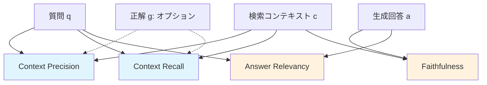

本記事は [RAGAS: Automated Evaluation of Retrieval Augmented Generation](https://arxiv.org/abs/2312.10997) (Es et al., 2023) の解説記事です。

## 論文概要（Abstract）

Retrieval Augmented Generation（RAG）システムの品質評価は、検索コンポーネントと生成コンポーネントの両方を考慮する必要があり、従来の手法では人手での評価が必要だった。著者らは、**参照回答なし（reference-free）**でRAGの品質を自動評価するフレームワーク**RAGAS**を提案している。Faithfulness（忠実性）、Answer Relevancy（回答関連性）、Context Precision（コンテキスト精度）、Context Recall（コンテキスト再現率）の4指標を定義し、人間評価との相関が高いことを示している。

この記事は [Zenn記事: Ollama×Open WebUI×LiteLLMで構築する社内AIプラットフォーム実践ガイド](https://zenn.dev/0h_n0/articles/816259e067f235) の深掘りです。Zenn記事ではOpen WebUIのRAG機能でナレッジベースを構築していますが、RAGASを導入することで**RAGの回答品質を定量的にモニタリング**できるようになります。

## 情報源

- **arXiv ID**: 2312.10997
- **URL**: [https://arxiv.org/abs/2312.10997](https://arxiv.org/abs/2312.10997)
- **著者**: Shahul Es, Jithin James, Luis Espinosa-Anke, Steven Schockaert
- **発表年**: 2023
- **分野**: cs.CL
- **コード**: [https://github.com/explodinggradients/ragas](https://github.com/explodinggradients/ragas) (Apache 2.0)

## 背景と動機（Background & Motivation）

RAGシステムは「検索」と「生成」の2段階で構成されるが、各段階のエラーが最終出力に影響する。検索段階では無関係なドキュメントが返される可能性があり、生成段階ではハルシネーション（検索結果にない情報の捏造）が発生しうる。

従来のRAG評価手法には以下の問題があった：

1. **人手評価のコスト**: 各回答に対する人間の品質判定は時間とコストがかかる
2. **参照回答の不在**: 新しいドキュメントに対する正解回答を事前に用意することは困難
3. **部分的な評価**: BLEUやROUGEは生成品質のみを測定し、検索品質を考慮しない

Zenn記事のOpen WebUI RAG構成では、ナレッジベースにアップロードしたドキュメントの品質やChunk Size設定が回答品質に影響するが、その**品質を客観的に測定する手段**がない。RAGASはこの課題を解決する。

## 主要な貢献（Key Contributions）

- **貢献1**: 参照回答不要（reference-free）のRAG評価フレームワークの提案
- **貢献2**: 検索品質と生成品質を分離した4つの評価指標の定義
- **貢献3**: 人間評価との相関分析（Faithfulness: r=0.82、Answer Relevancy: r=0.74）の報告（論文Table 4より）

## 技術的詳細（Technical Details）

### RAGASの4つの評価指標

RAGASは、RAGシステムの入出力を以下の4つの観点で評価する。



#### 1. Faithfulness（忠実性）

生成回答が検索コンテキストの情報に忠実かどうかを測定する。ハルシネーションの検出に直結する指標である。

**測定手順**:
1. LLMを使って回答$a$から**主張（claims）**のリストを抽出する
2. 各主張がコンテキスト$c$から裏付けられるかをLLMで判定する

$$
\text{Faithfulness} = \frac{|\{s \in S(a) : s \text{ is supported by } c\}|}{|S(a)|}
$$

ここで、
- $S(a)$: 回答$a$から抽出された主張の集合
- $c$: 検索コンテキスト

例えば、回答が3つの主張を含み、そのうち2つがコンテキストから裏付けられる場合、Faithfulness = 2/3 ≈ 0.67 となる。

#### 2. Answer Relevancy（回答関連性）

生成回答が質問に対して適切かどうかを測定する。

**測定手順**:
1. 回答$a$から、逆に**質問を生成**する（$n$回繰り返し）
2. 生成された質問と元の質問のEmbedding類似度を計算する

$$
\text{Answer Relevancy} = \frac{1}{n} \sum_{i=1}^{n} \text{sim}(E(q), E(\hat{q}_i))
$$

ここで、
- $E(\cdot)$: テキストのEmbeddingベクトル
- $\hat{q}_i$: 回答から生成された$i$番目の質問
- $\text{sim}(\cdot, \cdot)$: コサイン類似度
- $n$: 生成する質問数（デフォルト3）

#### 3. Context Precision（コンテキスト精度）

検索されたコンテキストのうち、回答に有用なものがどれだけ上位にランクされているかを測定する。

$$
\text{Context Precision} = \frac{1}{K} \sum_{k=1}^{K} \frac{\text{relevant items in top } k}{k} \times v_k
$$

ここで$v_k = 1$はランク$k$のコンテキストが関連している場合、$K$はコンテキスト数である。

#### 4. Context Recall（コンテキスト再現率）

正解に含まれる情報がコンテキスト内にどれだけ存在するかを測定する。この指標のみ参照回答（Ground Truth）が必要である。

$$
\text{Context Recall} = \frac{|\{s \in S(g) : s \text{ can be attributed to } c\}|}{|S(g)|}
$$

ここで$S(g)$は正解$g$から抽出された主張の集合。

### 評価パイプラインの実装

```python
from ragas import evaluate
from ragas.metrics import (
    faithfulness,
    answer_relevancy,
    context_precision,
    context_recall,
)
from datasets import Dataset

def evaluate_rag_pipeline(
    questions: list[str],
    answers: list[str],
    contexts: list[list[str]],
    ground_truths: list[str] | None = None,
) -> dict[str, float]:
    """RAGパイプラインの品質を評価する

    Args:
        questions: 質問リスト
        answers: RAGシステムの回答リスト
        contexts: 各質問に対する検索コンテキストのリスト
        ground_truths: 正解リスト（Context Recall計算用、オプション）

    Returns:
        各指標のスコア辞書
    """
    data = {
        "question": questions,
        "answer": answers,
        "contexts": contexts,
    }

    metrics = [faithfulness, answer_relevancy, context_precision]

    if ground_truths is not None:
        data["ground_truth"] = ground_truths
        metrics.append(context_recall)

    dataset = Dataset.from_dict(data)

    result = evaluate(
        dataset=dataset,
        metrics=metrics,
    )

    return {
        "faithfulness": result["faithfulness"],
        "answer_relevancy": result["answer_relevancy"],
        "context_precision": result["context_precision"],
        "context_recall": result.get("context_recall"),
    }


# 使用例: Open WebUI RAGの品質評価
if __name__ == "__main__":
    scores = evaluate_rag_pipeline(
        questions=["社内のリモートワーク規定は？"],
        answers=["リモートワークは週3日まで可能で、事前に上長の承認が必要です。"],
        contexts=[["リモートワーク規定: 週3日まで勤務可能。事前申請が必要。"]],
        ground_truths=["週3日まで、事前申請と上長承認が必要"],
    )

    for metric, score in scores.items():
        print(f"{metric}: {score:.3f}")
```

## 実装のポイント（Implementation）

**Open WebUI RAGとの統合パターン**:

Zenn記事のOpen WebUI構成では、ナレッジベースの品質評価にRAGASを組み込むことが可能である。

```python
import requests

def fetch_openwebui_rag_response(
    query: str,
    collection_name: str,
    api_base: str = "http://localhost:3000",
    token: str = "",
) -> tuple[str, list[str]]:
    """Open WebUIのRAGから回答とコンテキストを取得

    Args:
        query: 質問
        collection_name: ナレッジベース名
        api_base: Open WebUI APIベースURL
        token: 認証トークン

    Returns:
        (回答テキスト, 検索コンテキストのリスト)
    """
    headers = {"Authorization": f"Bearer {token}"}

    response = requests.post(
        f"{api_base}/api/chat/completions",
        headers=headers,
        json={
            "model": "qwen3-30b",
            "messages": [{"role": "user", "content": f"#{collection_name} {query}"}],
        },
        timeout=120,
    )

    result = response.json()
    answer = result["choices"][0]["message"]["content"]
    contexts = [doc["content"] for doc in result.get("citations", [])]

    return answer, contexts
```

**品質閾値の推奨値**:

| 指標 | 推奨閾値 | 説明 |
|------|---------|------|
| Faithfulness | ≥ 0.8 | 0.8未満はハルシネーションのリスク |
| Answer Relevancy | ≥ 0.7 | 0.7未満は質問への回答が不十分 |
| Context Precision | ≥ 0.6 | 0.6未満はChunk設定の見直しが必要 |
| Context Recall | ≥ 0.7 | 0.7未満はドキュメント不足の可能性 |

**CI/CDへの組み込み**: RAGASをGitHub Actionsに統合し、ナレッジベースの更新時に自動品質チェックを実行するパターンが推奨される。品質スコアが閾値以下の場合、マージをブロックする。

**評価LLMの選択**: RAGASの評価精度は評価に使用するLLMに依存する。著者らはGPT-4を推奨しているが、コスト制約がある場合はGPT-4o-miniやローカルモデルも使用可能（精度は低下する）。

## Production Deployment Guide

### AWS実装パターン（コスト最適化重視）

| 規模 | 評価頻度 | 推奨構成 | 月額コスト | 主要サービス |
|------|---------|---------|-----------|------------|
| **Small** | 日次100件 | Serverless | $30-80 | Lambda + Bedrock |
| **Medium** | 日次1,000件 | Hybrid | $150-400 | Step Functions + Bedrock |
| **Large** | リアルタイム | Container | $500-1,500 | ECS + Bedrock Batch |

RAGAS評価のコストは主に評価LLM（ジャッジ）のAPI呼び出しに依存する。1件あたり4指標×3〜5回のLLM呼び出しが必要で、GPT-4使用時は約$0.05/件、Bedrock Claude Haiku使用時は約$0.005/件の評価コストとなる。

**コスト試算の注意事項**: 上記は2026年3月時点の概算値です。評価LLMの選択によりコストが大きく変動します。

### Terraformインフラコード

```hcl
resource "aws_sfn_state_machine" "ragas_evaluation" {
  name     = "ragas-evaluation-pipeline"
  role_arn = aws_iam_role.step_functions_role.arn

  definition = jsonencode({
    StartAt = "FetchRAGResponses"
    States = {
      FetchRAGResponses = {
        Type     = "Task"
        Resource = aws_lambda_function.fetch_responses.arn
        Next     = "EvaluateWithRAGAS"
      }
      EvaluateWithRAGAS = {
        Type     = "Task"
        Resource = aws_lambda_function.ragas_evaluator.arn
        Next     = "StoreResults"
      }
      StoreResults = {
        Type     = "Task"
        Resource = aws_lambda_function.store_results.arn
        End      = true
      }
    }
  })
}

resource "aws_cloudwatch_metric_alarm" "faithfulness_low" {
  alarm_name          = "ragas-faithfulness-below-threshold"
  comparison_operator = "LessThanThreshold"
  evaluation_periods  = 1
  metric_name         = "FaithfulnessScore"
  namespace           = "Custom/RAGAS"
  period              = 86400
  statistic           = "Average"
  threshold           = 0.8
  alarm_description   = "RAG Faithfulnessスコアが0.8未満（ハルシネーションリスク）"
}
```

### コスト最適化チェックリスト

- [ ] 評価LLMにBedrock Claude Haiku使用（GPT-4比で90%コスト削減）
- [ ] バッチ評価でBedrock Batch API活用（50%割引）
- [ ] サンプリング評価（全件ではなく10-20%を抽出評価）
- [ ] Step Functionsで評価パイプラインをオーケストレーション
- [ ] DynamoDBに評価結果を保存（トレンド分析用）
- [ ] CloudWatchでFaithfulness/Answer Relevancyを監視
- [ ] 閾値アラート設定（Faithfulness < 0.8で通知）
- [ ] GitHub Actions連携でナレッジベース更新時に自動評価
- [ ] 評価結果ダッシュボード（Grafana/QuickSight）
- [ ] 月次品質レポート自動生成

## 実験結果（Results）

著者らはWikiEval、ExpertQAの2データセットと合成データセットで評価を実施している。

| 指標 | 人間評価との相関（Spearman） | 評価データセット |
|------|--------------------------|----------------|
| Faithfulness | r = 0.82（論文Table 4より） | WikiEval |
| Answer Relevancy | r = 0.74（論文Table 4より） | WikiEval |
| Context Precision | r = 0.69（論文Table 4より） | ExpertQA |
| Context Recall | r = 0.71（論文Table 4より） | ExpertQA |

著者らの分析では、FaithfulnessがAnswer Relevancyより高い相関を示す理由として、忠実性の判定（コンテキストに含まれる情報か否か）は比較的二値的であり、LLMによる判定が容易であるのに対し、回答の関連性は主観的な要素が大きいためとしている。

## 実運用への応用（Practical Applications）

Zenn記事のOpen WebUI RAG構成への適用：

1. **ナレッジベース品質ゲート**: ドキュメントアップロード後にRAGASで品質チェックを実行し、Chunk Size/Overlap設定の最適化判断に活用
2. **継続的品質モニタリング**: 定期的にテスト質問セットでRAGASを実行し、ナレッジベースの品質劣化を検知
3. **RAG設定の最適化**: Context PrecisionとContext Recallの値からChunk Size（推奨: 1000〜1500）とTop K（推奨: 5〜10）の調整方針を判断

## 関連研究（Related Work）

- **ARES** (Saad-Falcon et al., 2023): RAGASと同様のLLMベースRAG評価だが、少量のラベル付きデータで評価器を訓練する半教師あり手法を採用
- **TruLens** (Ribeiro et al., 2023): RAGASの評価指標と類似した指標（Groundedness、Relevance）を提供するライブラリ。RAGASとの主な違いはUI/ダッシュボードの統合
- **DeepEval** (Confident AI, 2024): RAGASの指標に加え、G-Eval、Hallucination Score等の追加指標を提供。企業向け機能（チーム管理、CI/CD統合）が充実

## まとめと今後の展望

RAGASは、参照回答なしでRAGシステムの品質を4つの指標で自動評価するフレームワークである。特にFaithfulness（忠実性）は人間評価との相関が0.82と高く、ハルシネーション検知に有効である。

Open WebUIのRAG機能と組み合わせることで、ナレッジベースの品質を定量的にモニタリングし、Chunk設定や検索パラメータの最適化に活用できる。CI/CDへの統合により、ドキュメント更新時の品質自動チェックも実現可能である。

## 参考文献

- **arXiv**: [https://arxiv.org/abs/2312.10997](https://arxiv.org/abs/2312.10997)
- **Code**: [https://github.com/explodinggradients/ragas](https://github.com/explodinggradients/ragas) (Apache 2.0)
- **Related Zenn article**: [https://zenn.dev/0h_n0/articles/816259e067f235](https://zenn.dev/0h_n0/articles/816259e067f235)

---

:::message
この記事はAI（Claude Code）により自動生成されました。論文の正確な内容については原論文をご確認ください。
:::
