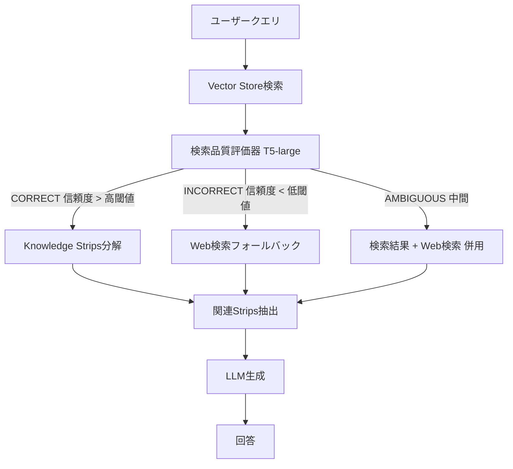

本記事は [Corrective Retrieval Augmented Generation](https://arxiv.org/abs/2401.00368)（Yan et al., 2024）の解説記事です。

## 論文概要（Abstract）

本論文は、RAGシステムにおける検索結果の品質問題に対処するCorrective Retrieval Augmented Generation（CRAG）フレームワークを提案している。著者らは、軽量な検索品質評価器（T5-large）を導入して検索結果の関連度を3段階（CORRECT / INCORRECT / AMBIGUOUS）で判定し、品質が不十分な場合にWeb検索へフォールバックする機構を実装している。さらに、検索文書を文単位の「knowledge strips」に分解して関連部分のみを抽出するノイズ除去機構を組み合わせることで、PopQAで標準RAG比+12〜16%、敵対的ノイズ環境での性能劣化を18%から4%に抑制したと報告している。CRAGはプラグアンドプレイ設計であり、既存のRAGシステムに追加可能である。

この記事は [Zenn記事: Semantic Kernel v1.41 Plugin設計とVector Store RAGパイプライン構築](https://zenn.dev/0h_n0/articles/5c20849a93d5a5) の深掘りです。Zenn記事ではPlugin設計における「エラーを文字列で返す」パターンを推奨しているが、CRAGはその上流で「検索結果自体の品質をどう保証するか」という問題への解答を提供する。

## 情報源

- **arXiv ID**: 2401.00368
- **URL**: [https://arxiv.org/abs/2401.00368](https://arxiv.org/abs/2401.00368)
- **著者**: Shi-Qi Yan, Jia-Chen Gu, Yun Zhu, Zhen-Hua Ling et al.
- **発表年**: 2024
- **分野**: cs.CL, cs.AI

## 背景と動機（Background & Motivation）

標準的なRAGシステムは、検索結果が関連性の高い文書を含んでいることを暗黙に仮定している。しかし実運用では、ドメイン外のクエリ、曖昧な表現、知識ベースのカバレッジ不足により、検索が失敗するケースが頻繁に発生する。著者らは、検索結果が無関係な場合、RAGなし（LLMのみ）の性能を下回る「検索汚染」問題が起こりうると指摘している。

この問題は、Semantic KernelでRAGプラグインを構築する際にも直面する。`create_search_function`で自動生成されたプラグインは検索結果をそのままLLMに渡すため、検索品質の保証は開発者の責任となる。CRAGは、この検索品質保証をシステマティックに行うフレームワークである。

## 主要な貢献（Key Contributions）

著者らが主張する主要な貢献は以下の通りである：

- **3段階の検索品質評価**: T5-largeベースの軽量評価器で検索結果をCORRECT/INCORRECT/AMBIGUOUSに分類し、それぞれ異なる処理パスを適用
- **Knowledge Strips分解**: 検索文書を文単位に分解し、関連度スコアリング→フィルタリング→再結合によりノイズを除去
- **Web検索フォールバック**: 検索が失敗した場合にWeb検索APIに自動切り替えし、知識ベースの限界を補完
- **プラグアンドプレイ設計**: 既存のRAGシステムに外付けで追加可能。Self-RAGとの組み合わせで追加+4〜7%の改善

## 技術的詳細（Technical Details）

### CRAGのアーキテクチャ



### 検索品質評価器

著者らは、T5-large（約770Mパラメータ）をMS MARCO、Natural Questions、TriviaQAの関連度判定データでファインチューニングしている。評価器は検索されたパッセージとクエリのペアに対してスカラー信頼度スコアを出力する。

$$
s = f_\theta(q, d)
$$

ここで、$q$はクエリ、$d$は検索文書、$f_\theta$はT5-largeベースの評価器、$s \in [0, 1]$は信頼度スコアである。

3段階の判定は以下の閾値で行われる：

$$
\text{action}(s) = \begin{cases}
\text{CORRECT} & \text{if } s > \tau_{\text{high}} \\
\text{INCORRECT} & \text{if } s < \tau_{\text{low}} \\
\text{AMBIGUOUS} & \text{otherwise}
\end{cases}
$$

$\tau_{\text{high}}$と$\tau_{\text{low}}$はハイパーパラメータであり、ドメインごとのキャリブレーションが必要と著者らは述べている。

### Knowledge Strips分解アルゴリズム

検索結果がCORRECTと判定された場合でも、文書全体が関連しているわけではない。著者らは以下のアルゴリズムで文書内のノイズを除去する。

```python
from dataclasses import dataclass


@dataclass
class KnowledgeStrip:
    """文書から抽出した知識の最小単位"""
    text: str
    relevance_score: float
    source_doc_id: str


def decompose_and_filter(
    query: str,
    documents: list[str],
    evaluator,
    threshold: float = 0.5,
) -> list[KnowledgeStrip]:
    """文書をKnowledge Stripsに分解し、関連部分のみを抽出する

    Args:
        query: ユーザークエリ
        documents: 検索された文書リスト
        evaluator: 関連度評価モデル
        threshold: 関連度の閾値

    Returns:
        関連度の高いKnowledge Stripsのリスト
    """
    strips: list[KnowledgeStrip] = []
    for doc_id, doc in enumerate(documents):
        sentences = doc.split(". ")
        for sentence in sentences:
            if len(sentence.strip()) < 10:
                continue
            score = evaluator.score(query, sentence)
            if score >= threshold:
                strips.append(KnowledgeStrip(
                    text=sentence.strip(),
                    relevance_score=score,
                    source_doc_id=f"doc-{doc_id}",
                ))
    strips.sort(key=lambda s: s.relevance_score, reverse=True)
    return strips


def recompose_context(strips: list[KnowledgeStrip], max_tokens: int = 1024) -> str:
    """関連Stripsを再結合してLLM入力コンテキストを構成する

    Args:
        strips: フィルタリング済みのKnowledge Strips
        max_tokens: コンテキストの最大トークン数

    Returns:
        再結合されたコンテキスト文字列
    """
    context_parts: list[str] = []
    current_tokens = 0
    for strip in strips:
        strip_tokens = len(strip.text.split())
        if current_tokens + strip_tokens > max_tokens:
            break
        context_parts.append(strip.text)
        current_tokens += strip_tokens
    return ". ".join(context_parts)
```

### Web検索フォールバック

検索結果がINCORRECTと判定された場合、著者らはWeb検索API（Google/Bing）を呼び出して外部知識を取得する。Web検索結果にも同様のKnowledge Strips分解を適用してノイズを除去した上で、LLMに渡す。

AMBIGUOUSの場合は、Vector Store検索結果とWeb検索結果の両方からKnowledge Stripsを抽出し、併合する。

## 実装のポイント（Implementation）

Semantic KernelのPlugin機構でCRAGを実装する場合の設計指針を以下に示す。

1. **評価器Plugin**: `@kernel_function`で検索品質評価を行うPluginを実装し、検索プラグインの出力をパイプラインで処理する。ただし、T5-largeの推論は100〜200ms程度のレイテンシを追加する
2. **フォールバック設計**: Semantic Kernelの`FunctionChoiceBehavior.Auto()`を使用すると、LLMが検索結果の品質を判断して追加検索を要求するパターンも可能。ただし、CRAGの明示的な評価器と比較してコストが高く、判断の一貫性に課題がある
3. **Knowledge Strips Pluginの分離**: 文書分解・フィルタリングは独立したPluginとして実装し、検索プラグインと組み合わせる。Zenn記事で解説されているPlugin単一責任原則に従う
4. **閾値のキャリブレーション**: $\tau_{\text{high}}$と$\tau_{\text{low}}$はドメインごとに調整が必要。著者らは開発セットでの検証を推奨している

## Production Deployment Guide

### AWS実装パターン（コスト最適化重視）

CRAGの3段階パイプライン（検索 → 評価 → フォールバック/生成）をAWSで構築する場合の構成を示す。

**トラフィック量別の推奨構成**:

| 規模 | 月間リクエスト | 推奨構成 | 月額コスト | 主要サービス |
|------|--------------|---------|-----------|------------|
| **Small** | ~3,000 (100/日) | Serverless | $100-250 | Lambda + Bedrock + OpenSearch Serverless |
| **Medium** | ~30,000 (1,000/日) | Hybrid | $600-1,500 | ECS Fargate(T5評価器) + Bedrock + OpenSearch |
| **Large** | 300,000+ (10,000/日) | Container | $4,000-8,000 | EKS + SageMaker(T5) + OpenSearch |

**Small構成の詳細**（月額$100-250）:
- **Lambda**: 検索+評価パイプライン、2GB RAM（$30/月）
- **Bedrock**: Claude 3.5 Haiku（生成用、$100/月）
- **OpenSearch Serverless**: Vector Store（$50/月）
- **Lambda (Web検索)**: フォールバック用、外部API呼び出し（$20/月）
- **SQS**: フォールバック非同期処理（$5/月）

**Medium構成の詳細**（月額$600-1,500）:
- **ECS Fargate**: T5-large評価器、4vCPU/8GB（$200/月）
- **Bedrock**: Claude 3.5 Sonnet（$600/月）
- **OpenSearch**: r6g.large × 2ノード（$300/月）
- **ElastiCache**: 評価スコアキャッシュ（$50/月）

**コスト削減テクニック**:
- T5-large評価器をONNX形式に変換し、CPU推論でGPUコストを回避
- 評価スコアキャッシュ（ElastiCache）で同一クエリ・文書ペアの再評価を防止
- Web検索フォールバック率の監視（25〜30%が目安、これを大きく超える場合は知識ベースの更新を検討）
- Bedrock Batch APIで非リアルタイム処理を50%削減

**コスト試算の注意事項**: 上記は2026年3月時点のAWS ap-northeast-1（東京）リージョン料金に基づく概算値です。Web検索APIの外部コスト（Google Custom Search: $5/1000クエリ）は別途必要です。最新料金は [AWS料金計算ツール](https://calculator.aws/) で確認してください。

### Terraformインフラコード

**Small構成（Serverless）: Lambda + Bedrock + OpenSearch Serverless**

```hcl
# --- Lambda: CRAG評価パイプライン ---
resource "aws_lambda_function" "crag_evaluator" {
  filename      = "crag_evaluator.zip"
  function_name = "crag-retrieval-evaluator"
  role          = aws_iam_role.lambda_crag.arn
  handler       = "index.handler"
  runtime       = "python3.12"
  timeout       = 120
  memory_size   = 2048

  environment {
    variables = {
      OPENSEARCH_ENDPOINT = aws_opensearchserverless_collection.rag_store.collection_endpoint
      BEDROCK_MODEL_ID    = "anthropic.claude-3-5-haiku-20241022-v1:0"
      EVALUATOR_MODEL     = "t5-large-crag-evaluator"
      TAU_HIGH            = "0.7"
      TAU_LOW             = "0.3"
      ENABLE_WEB_FALLBACK = "true"
    }
  }
}

# --- Lambda: Web検索フォールバック ---
resource "aws_lambda_function" "web_fallback" {
  filename      = "web_fallback.zip"
  function_name = "crag-web-search-fallback"
  role          = aws_iam_role.lambda_crag.arn
  handler       = "index.handler"
  runtime       = "python3.12"
  timeout       = 30
  memory_size   = 512

  environment {
    variables = {
      SEARCH_API_KEY_SECRET = aws_secretsmanager_secret.search_api.arn
      MAX_RESULTS           = "5"
    }
  }
}

# --- Secrets Manager（Web検索APIキー） ---
resource "aws_secretsmanager_secret" "search_api" {
  name = "crag-web-search-api-key"
}

# --- IAMロール ---
resource "aws_iam_role" "lambda_crag" {
  name = "lambda-crag-pipeline-role"
  assume_role_policy = jsonencode({
    Version = "2012-10-17"
    Statement = [{
      Action    = "sts:AssumeRole"
      Effect    = "Allow"
      Principal = { Service = "lambda.amazonaws.com" }
    }]
  })
}

resource "aws_iam_role_policy" "crag_permissions" {
  role = aws_iam_role.lambda_crag.id
  policy = jsonencode({
    Version = "2012-10-17"
    Statement = [
      {
        Effect   = "Allow"
        Action   = ["bedrock:InvokeModel"]
        Resource = "arn:aws:bedrock:ap-northeast-1::foundation-model/anthropic.claude-3-5-haiku*"
      },
      {
        Effect   = "Allow"
        Action   = ["secretsmanager:GetSecretValue"]
        Resource = aws_secretsmanager_secret.search_api.arn
      },
      {
        Effect   = "Allow"
        Action   = ["aoss:APIAccessAll"]
        Resource = aws_opensearchserverless_collection.rag_store.arn
      }
    ]
  })
}

# --- CloudWatchアラーム（フォールバック率監視） ---
resource "aws_cloudwatch_metric_alarm" "fallback_rate" {
  alarm_name          = "crag-web-fallback-rate-high"
  comparison_operator = "GreaterThanThreshold"
  evaluation_periods  = 3
  metric_name         = "WebFallbackRate"
  namespace           = "CRAG/Pipeline"
  period              = 3600
  statistic           = "Average"
  threshold           = 0.4
  alarm_description   = "Web検索フォールバック率が40%を超過（知識ベース更新が必要）"
}
```

### 運用・監視設定

**CloudWatch Logs Insightsクエリ**:

```sql
-- 評価判定の分布（CORRECT/INCORRECT/AMBIGUOUS）
fields @timestamp, evaluation_result, confidence_score
| stats count(*) as cnt by evaluation_result
| sort cnt desc

-- Web検索フォールバック率の時系列推移
fields @timestamp, evaluation_result
| stats sum(case when evaluation_result = 'INCORRECT' then 1 else 0 end) / count(*) * 100 as fallback_pct by bin(1h)
```

**CloudWatchアラーム（Python）**:

```python
import boto3

cloudwatch = boto3.client('cloudwatch')

cloudwatch.put_metric_alarm(
    AlarmName='crag-evaluator-latency',
    ComparisonOperator='GreaterThanThreshold',
    EvaluationPeriods=2,
    MetricName='EvaluatorDuration',
    Namespace='CRAG/Pipeline',
    Period=300,
    Statistic='p95',
    Threshold=300,
    AlarmDescription='T5評価器のP95レイテンシが300msを超過',
    AlarmActions=['arn:aws:sns:ap-northeast-1:123456789:crag-alerts'],
)
```

### コスト最適化チェックリスト

**アーキテクチャ選択**:
- [ ] ~100 req/日 → Lambda + ONNX T5評価器（$100-250/月）
- [ ] ~1,000 req/日 → ECS Fargate + GPU T5評価器（$600-1,500/月）
- [ ] 10,000+ req/日 → EKS + SageMaker T5エンドポイント（$4,000-8,000/月）

**CRAG固有の最適化**:
- [ ] T5評価器をONNX変換しCPU推論（GPUコスト回避）
- [ ] 評価スコアキャッシュ（同一クエリ・文書ペアの再評価防止）
- [ ] Web検索フォールバック率の監視と知識ベース更新
- [ ] 閾値（$\tau_{\text{high}}$, $\tau_{\text{low}}$）のドメイン別キャリブレーション
- [ ] Knowledge Strips処理のバッチ化

**監視・アラート**:
- [ ] 評価判定分布の監視（CORRECT/INCORRECT/AMBIGUOUS比率）
- [ ] フォールバック率アラート（40%超過で知識ベース更新検討）
- [ ] 評価器レイテンシ監視（P95 < 300ms目標）
- [ ] Web検索APIコスト監視
- [ ] AWS Budgets月額予算設定

## 実験結果（Results）

著者らが報告した主要な実験結果を以下に示す（論文Tables 1-3より）。

| システム | PopQA (Acc) | TriviaQA (EM) | Biography (FactScore) |
|---------|-------------|---------------|----------------------|
| LLMのみ（検索なし） | 29.1 | 55.8 | 52.3 |
| 標準RAG | 50.5 | 63.2 | 65.4 |
| Self-RAG | 54.9 | 65.8 | 72.1 |
| **CRAG** | **63.2** | **67.4** | **69.8** |
| **CRAG + Self-RAG** | **66.1** | **69.2** | **74.3** |

敵対的ノイズ環境（検索結果に意図的にノイズ文書を混入）での結果：

| 条件 | 標準RAGの劣化率 | CRAGの劣化率 |
|------|----------------|-------------|
| 10%ノイズ混入 | -5.2% | -1.1% |
| 30%ノイズ混入 | -12.4% | -2.8% |
| 50%ノイズ混入 | -18.0% | **-4.0%** |

著者らの報告によると、Knowledge Stripsフィルタリングを除外すると性能が6〜8%低下し、Web検索フォールバックのみの除外では3〜5%の低下が観測されている。

## 実運用への応用（Practical Applications）

Semantic KernelのPlugin設計において、CRAGの知見は以下のように適用できる。

**Pluginレベルの品質保証**: Zenn記事で解説されている「エラーを文字列で返す」パターンと組み合わせることで、検索Pluginが「結果の信頼度が低い」という情報をLLMに伝え、LLMが追加検索やWeb検索フォールバックを判断する設計が可能になる。

**フィルタ機構との統合**: Semantic Kernelの`function_invocation_filter`でCRAGの評価ロジックを実装し、検索Plugin呼び出し後のフィルタとしてKnowledge Strips分解を自動適用する設計が考えられる。

**知識ベースのカバレッジ監視**: Web検索フォールバック率を継続的に監視することで、Vector Storeの知識ベースが陳腐化しているタイミングを検知し、データ投入の更新サイクルを最適化できる。

## 関連研究（Related Work）

- **Self-RAG**（Asai et al., 2023）: LLM自身が検索の必要性と検索結果の利用方法を特殊トークンで制御する。CRAGは外部評価器を使用するため、既存RAGシステムへの後付けが容易
- **FLARE**（Jiang et al., 2023）: 生成中に不確実な箇所で動的に追加検索を行う。CRAGは検索前の品質判定に重点を置く
- **REPLUG**（Shi et al., 2023）: 検索結果を確率的に重み付けしてLLMに渡す。CRAGのknowledge strips分解はより細粒度のノイズ除去を行う

## まとめと今後の展望

CRAGは、RAGシステムの検索品質問題に対して「検索品質評価 + Knowledge Strips分解 + Web検索フォールバック」の3つの機構を組み合わせた実用的なフレームワークである。プラグアンドプレイ設計により既存システムへの追加が容易であり、Self-RAGとの組み合わせで追加の改善も確認されている。

Semantic Kernelでの実装においては、検索Plugin → 評価Plugin → フォールバックPluginのパイプライン構成で実現可能であり、Zenn記事のエラーハンドリングパターンとも整合する。ただし、著者ら自身が指摘しているように、Web検索フォールバックが25〜30%のクエリで発動する場合のAPIコスト増大、および評価器のドメイン別キャリブレーションの必要性には注意が必要である。

## 参考文献

- **arXiv**: [https://arxiv.org/abs/2401.00368](https://arxiv.org/abs/2401.00368)
- **Related Zenn article**: [https://zenn.dev/0h_n0/articles/5c20849a93d5a5](https://zenn.dev/0h_n0/articles/5c20849a93d5a5)
- **Self-RAG**: [https://arxiv.org/abs/2310.11511](https://arxiv.org/abs/2310.11511)
