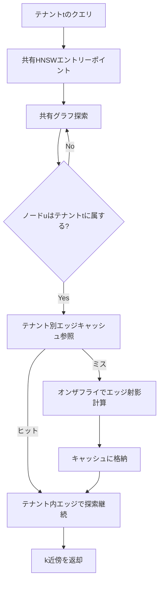

本記事は [arXiv:2401.07119 Curator: Efficient Indexing for Multi-Tenant Vector Databases](https://arxiv.org/abs/2401.07119)（2024年1月公開）の解説記事です。

## 論文概要（Abstract）

Curatorは、マルチテナント・ベクトルデータベースにおけるインデキシングの品質と効率のトレードオフを解決するアプローチを提案している。著者らは、テナントごとに独立したインデックスを持つ方式（高品質だが高コスト）と、全テナント共有の単一インデックスを使う方式（低コストだが低品質）の中間を実現するため、共有グラフ構造とテナント別エッジキャッシュの遅延実体化（Lazy Materialization）を組み合わせた設計を導入している。論文の評価では、インデックスストレージの最大10倍削減、構築コストの最大2倍削減を品質劣化なしに達成し、メモリ超過時には最大7倍のスループット向上を記録したと報告されている。

この記事は [Zenn記事: ベクトルDB運用コスト最適化：Turbopuffer・LanceDB・pgvectorscale比較](https://zenn.dev/0h_n0/articles/7306026ebdfe23) の深掘りです。

## 情報源

- **arXiv ID**: 2401.07119
- **URL**: [https://arxiv.org/abs/2401.07119](https://arxiv.org/abs/2401.07119)
- **著者**: Mihail Dumitrescu, Mingyu Gao
- **発表年**: 2024
- **分野**: cs.DB, cs.AI, cs.IR

## 背景と動機（Background & Motivation）

マルチテナント・ベクトルデータベースは、SaaSアプリケーション（RAGパイプライン、レコメンドエンジン等）において多数のテナント（顧客）を同一クラスタ上でサービスする。クエリはテナントIDに紐づいており、そのテナントのデータサブセット内からANN（近似最近傍）を返す必要がある。

従来のアプローチには以下の問題があった:

- **テナント別インデックス**: テナントごとに独立したHNSWインデックスを維持する。検索品質は高いが、ストレージオーバーヘッドが$M \times |V|$に比例して大きく、全テナントのインデックスを事前構築するコストも高い
- **共有インデックス＋ポストフィルタリング**: 全データで単一のHNSWインデックスを構築し、クエリ結果をテナントIDでフィルタする。ストレージ効率は高いが、グリーディ探索がテナント外のノードに「スタック」するため検索品質が著しく劣化する

著者らは、テナントが全体の$n/N$の割合のデータを持つ場合、ポストフィルタリングで同等のリコールを維持するには$\text{ef\_search} \approx \frac{N}{n} \times k$が必要になると分析している。テナントが全体の1%しか占めない場合、$\text{ef\_search}$は$k$の100倍必要になるため実用的ではない。

## 主要な貢献（Key Contributions）

- **共有グラフ＋テナント別エッジキャッシュ**: 全テナント共有のHNSWグラフを基盤とし、テナント固有のエッジ情報のみを差分として保持する設計により、ストレージを最大10倍削減
- **エッジ射影（Edge Projection）**: クロステナントエッジをテナント内最近傍に張り替えるアルゴリズムの提案
- **遅延実体化（Lazy Materialization）**: テナント別グラフキャッシュをクエリ到着時に初めて構築し、非アクティブテナントにはゼロコスト
- **LRUキャッシュ立ち退き**: メモリ制約下でのストレージとレイテンシのトレードオフ制御

## 技術的詳細（Technical Details）

### アーキテクチャ概要



### エッジ射影アルゴリズム

共有グラフのエッジ$(u, v)$において、$u$がテナント$t$に属し$v$が属さない場合、Curatorは$v$をテナント$t$内の最近傍に置き換える「射影」を行う。

$$
\text{project}_t(u, v) = \begin{cases}
(u, v) & \text{if } v \in V_t \\
(u, \text{NN}_t(v)) & \text{if } v \notin V_t \text{ and } \text{NN}_t(v) \text{ exists} \\
\emptyset & \text{otherwise}
\end{cases}
$$

ここで、
- $V_t$: テナント$t$のベクトル集合
- $\text{NN}_t(v)$: $v$の共有グラフ上の近傍のうちテナント$t$に属する最近傍
- $\emptyset$: テナント内の近傍が見つからない場合、エッジを削除

```python
def edge_projection(
    shared_graph: dict[int, list[int]],
    node_u: int,
    node_v: int,
    tenant_id: str,
    tenant_membership: dict[int, str],
    vectors: dict[int, list[float]],
) -> int | None:
    """共有グラフのエッジをテナント内に射影する

    Args:
        shared_graph: ノードID → 近傍ノードIDリスト
        node_u: 起点ノード（テナントtに属する）
        node_v: 終点ノード（テナントtに属さない可能性）
        tenant_id: 対象テナントID
        tenant_membership: ノードID → テナントIDのマッピング
        vectors: ノードID → ベクトル

    Returns:
        射影先のノードID、見つからない場合はNone
    """
    # vがテナントtに属する場合はそのまま返す
    if tenant_membership.get(node_v) == tenant_id:
        return node_v

    # vの近傍からテナントtに属するノードを探索
    neighbors_of_v = shared_graph.get(node_v, [])
    in_tenant_neighbors = [
        n for n in neighbors_of_v
        if tenant_membership.get(n) == tenant_id
    ]

    if not in_tenant_neighbors:
        return None  # テナント内の近傍なし → エッジ削除

    # 最近傍を返す（uとの距離が近い順）
    vec_u = vectors[node_u]
    best = min(
        in_tenant_neighbors,
        key=lambda n: cosine_distance(vec_u, vectors[n]),
    )
    return best
```

### 遅延実体化（Lazy Materialization）

Curatorの遅延実体化は以下のように動作する:

1. **初回クエリ**: テナント$t$のキャッシュが空の場合、クエリ探索中に必要なエッジ射影をオンザフライで計算し、結果をキャッシュに格納
2. **後続クエリ**: キャッシュからエッジ情報を取得し、高速に探索
3. **キャッシュエビクション**: LRUポリシーでメモリ不足時にエビクト。エビクトされたエントリは次のクエリで再計算

この設計により、非アクティブなテナント（クエリが来ないテナント）にはストレージコストがゼロになる。

### ストレージコストの分析

テナント別インデックスの場合、全テナントのストレージは$M \times |V|$（$M$: ノードあたりのエッジ数、$|V|$: 総ベクトル数）に比例する。Curatorの場合:

$$
S_{\text{Curator}} = S_{\text{shared}} + \sum_{t \in T_{\text{active}}} S_{\text{cache}}(t)
$$

ここで、
- $S_{\text{shared}} = M \times |V|$: 共有グラフのストレージ（テナント別インデックス1つ分と同等）
- $S_{\text{cache}}(t)$: テナント$t$のエッジキャッシュ（共有グラフのサブセット、差分のみ）
- $T_{\text{active}}$: アクティブなテナントの集合

多数のテナントが存在し一部のみがアクティブな場合、$|T_{\text{active}}| \ll |T|$となるため、ストレージが大幅に削減される。

## 実験結果（Results）

### ベンチマーク設定

著者らは以下のデータセットで評価を行っている:

| データセット | ベクトル数 | 次元 | 距離関数 |
|------------|----------|------|---------|
| SIFT1M | 1M | 128 | Euclidean |
| Deep1M | 1M | 96 | Cosine |
| Text2Image1M | 1M | 200 | Cosine |
| OpenAI-Ada | - | 1536 | Cosine |

テナント分布はZipf分布（べき乗則）で、テナントサイズは数十〜数万ベクトルの範囲。

### 主要結果（論文より）

| 指標 | Curator vs テナント別インデックス | 条件 |
|------|-------------------------------|------|
| インデックスストレージ | **最大10倍削減** | リコール同等 |
| 構築コスト | **最大2倍削減** | 全テナント分 |
| Recall@10 | 差1-2%以内 | 全データセット |
| スループット（ディスク超過時） | **最大7倍向上** | ホットテナントが一部 |

ポストフィルタリングとの比較では、テナントが全体の1%のデータを持つ場合、同等のリコールを達成するためにCuratorは遥かに少ないef_searchで済むことが確認されている。

### アブレーション結果

- **共有グラフのみ（テナント別キャッシュなし）**: リコールが大幅に低下（ポストフィルタリングと同等）
- **テナント別キャッシュのみ（共有グラフなし）**: リコールはテナント別インデックスと同等だがストレージ削減効果なし
- **Eager vs Lazy実体化**: 非アクティブテナントが多い場合、Lazyがストレージで大幅に優位

## 実装のポイント（Implementation）

### 実装時の注意点

1. **キャッシュウォームアップ**: 新規テナントの初回クエリは遅い（エッジ射影のオンザフライ計算）。頻繁にアクセスされるテナントはプロアクティブにウォームアップすることを推奨
2. **極小テナント**: 100ベクトル未満のテナントでは共有グラフが有用なテナント内エッジをほとんど提供できず、検索品質が劣化する
3. **書き込みヘビーなワークロード**: 頻繁な挿入・削除はキャッシュ無効化を引き起こし、遅延実体化の恩恵が減少する
4. **HNSW階層対応**: 各HNSWレイヤーにテナント別エッジキャッシュを保持する必要がある

### Zenn記事のマルチテナント設計パターンとの対応

Zenn記事では3つのマルチテナント分離パターン（名前空間分離、メタデータフィルタリング、コレクション分離）を紹介しているが、Curatorはこれらのいずれとも異なる第4のアプローチである。

| パターン | 検索品質 | ストレージ | 適用DB |
|---------|--------|----------|--------|
| 名前空間分離 | 高 | 中 | Turbopuffer, Pinecone |
| メタデータフィルタリング | 中 | 低 | pgvector, Qdrant |
| コレクション分離 | 高 | 高 | Weaviate, Milvus |
| **Curator** | **高** | **低** | **研究提案（未実装）** |

Curatorのアプローチは、名前空間分離の検索品質とメタデータフィルタリングのストレージ効率を両立させる可能性を示している。

## 実運用への応用（Practical Applications）

### 適用が有効な場面

- **SaaS型RAGサービス**: 数千〜数万テナントを持ち、テナントサイズがべき乗則分布するケース
- **メモリ制約環境**: フルのテナント別インデックスがRAMに収まらない場合
- **読み取りヘビーなワークロード**: クエリ >> 挿入・削除のワークロード

### コスト削減効果の試算

Zenn記事のコスト見積もりスクリプトと組み合わせると、Curatorのストレージ10倍削減は以下のように効果を発揮する:

- **10Mベクトル × 768次元 × 100テナント**: テナント別インデックスでは約29GB × 100 = 2.9TB必要だが、Curatorでは約290GBで同等の品質を達成可能（論文の主張に基づく）

## 関連研究（Related Work）

- **HNSW (Malkov & Yashunin, TPAMI 2018)**: Curatorの基盤となるグラフベースANNインデックス
- **ACORN (Patel et al., 2023, arXiv:2309.04859)**: 汎用的なフィルタ付きANN検索。Curatorはマルチテナント特化だが、ACORNはより一般的なプレディケートに対応
- **DiskANN (Jayaram Subramanya et al., NeurIPS 2019)**: ディスクベースの大規模ANN。Curatorのディスク超過時の比較対象
- **FAISS (Johnson et al., 2017)**: Facebook AI Similarity Search。プロダクション環境で広く使用

## まとめと今後の展望

Curatorは、マルチテナント・ベクトルDBにおいて「品質を維持しつつストレージを削減する」という実用的な課題に対して、共有グラフと遅延実体化という明確な設計原理で解決策を示した研究である。著者らの報告によれば、ストレージ最大10倍削減・構築コスト2倍削減・ディスク超過時スループット7倍向上を達成している。

現時点では研究段階であり、商用ベクトルDBへの組み込みは確認されていないが、Turbopufferの名前空間分離やQdrantのPayloadインデックスなど、既存システムのマルチテナント設計を改善するヒントを提供する論文である。

## 参考文献

- **arXiv**: [https://arxiv.org/abs/2401.07119](https://arxiv.org/abs/2401.07119)
- **HNSW原論文**: [https://arxiv.org/abs/1603.09320](https://arxiv.org/abs/1603.09320)
- **Related Zenn article**: [https://zenn.dev/0h_n0/articles/7306026ebdfe23](https://zenn.dev/0h_n0/articles/7306026ebdfe23)
