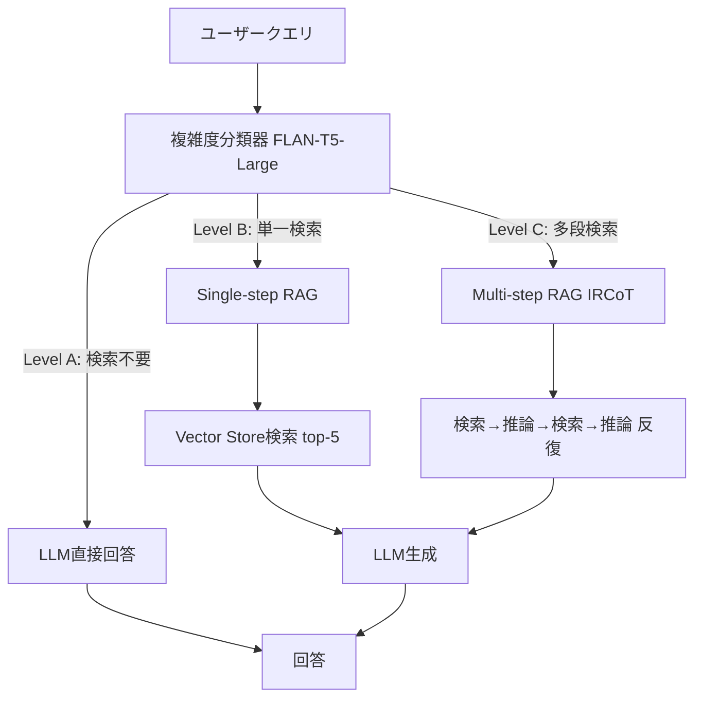

本記事は [Adaptive-RAG: Learning to Adapt Retrieval-Augmented LLMs through Question Complexity](https://arxiv.org/abs/2403.05313)（Jeong et al., 2024）の解説記事です。

## 論文概要（Abstract）

本論文は、クエリの複雑度に応じてRAGの検索戦略を動的に切り替えるAdaptive-RAGフレームワークを提案している。著者らは、小型分類器（FLAN-T5-Large、約750Mパラメータ）でクエリを「検索不要（A）」「単一検索（B）」「多段検索（C）」の3段階に分類し、各段階に最適な処理パスを適用する。実験ではSelf-RAG比で+2〜4%、標準RAG比で+5〜8%の精度改善を達成しつつ、推論コストを30〜40%削減したと報告されている。分類器の学習データはLLMが自動生成するため、人手アノテーションは不要である。

この記事は [Zenn記事: Semantic Kernel v1.41 Plugin設計とVector Store RAGパイプライン構築](https://zenn.dev/0h_n0/articles/5c20849a93d5a5) の深掘りです。Zenn記事ではPlugin設計のDescription記述やFunction Callingによる自動呼び出しを扱っているが、Adaptive-RAGは「いつ・どのレベルの検索を呼び出すべきか」という判断をシステマティックに行うフレームワークである。

## 情報源

- **arXiv ID**: 2403.05313
- **URL**: [https://arxiv.org/abs/2403.05313](https://arxiv.org/abs/2403.05313)
- **著者**: Soyeong Jeong, Jinheon Baek, Sukmin Cho, Sung Ju Hwang, Jong C. Park
- **発表年**: 2024
- **分野**: cs.CL, cs.AI

## 背景と動機（Background & Motivation）

RAGシステムでは、すべてのクエリに対して同一の検索パイプラインを適用するのが一般的である。しかし、「日本の首都は？」のような単純なクエリと「Transformerアーキテクチャの各コンポーネントがBERTとGPTでどう異なるか比較せよ」のような複雑なクエリでは、必要な検索の深さが大きく異なる。

著者らは、固定的な検索戦略には2つの問題があると指摘している。第一に、単純なクエリに対する不要な検索がレイテンシとAPIコストを増大させる。第二に、複雑なクエリに対する単一検索では情報が不足し、回答品質が低下する。Adaptive-RAGはこの問題を、クエリ複雑度に基づく動的ルーティングで解決する。

## 主要な貢献（Key Contributions）

著者らが主張する主要な貢献は以下の通りである：

- **3段階クエリ分類**: FLAN-T5-Largeベースの分類器で検索不要/単一検索/多段検索を判定し、処理パスを動的に切り替え
- **自動学習データ生成**: LLMが各カテゴリのクエリ例を自動生成するため、人手アノテーション不要
- **コスト・性能の同時最適化**: 精度改善（+2〜8%）とコスト削減（30〜40%）を両立

## 技術的詳細（Technical Details）

### Adaptive-RAGのアーキテクチャ



### クエリ複雑度分類

分類器はFLAN-T5-Large（約750Mパラメータ）をファインチューニングしたものである。入力はクエリ文字列、出力は3クラスの確率分布である。

$$
p(c \mid q) = \text{softmax}(W \cdot h_{\text{T5}}(q) + b)
$$

ここで、$q$はクエリ、$h_{\text{T5}}(q)$はFLAN-T5のエンコーダ出力、$W$と$b$は分類ヘッドのパラメータ、$c \in \{A, B, C\}$は複雑度レベルである。

各レベルの定義：

| レベル | 説明 | 処理パス | 例 |
|--------|------|---------|-----|
| **A**: 検索不要 | LLMの内部知識で回答可能 | LLM直接回答 | 「Pythonのリスト内包表記の構文は？」 |
| **B**: 単一検索 | 1回のVector Store検索で解決 | 標準RAG | 「Semantic Kernelの最新バージョンは？」 |
| **C**: 多段検索 | 複数回の検索と推論の反復が必要 | IRCoT | 「SK v1.41のPlugin設計変更がRAG性能に与える影響は？」 |

### 学習データの自動生成

著者らは、人手アノテーションを回避するために、LLMを使用して各カテゴリの学習データを自動生成する手法を採用している。

```python
from dataclasses import dataclass


@dataclass
class QueryClassificationExample:
    """分類器学習データの1例"""
    query: str
    complexity_level: str  # "A", "B", or "C"
    reasoning: str


def generate_training_data(
    llm,
    seed_queries: list[str],
    target_level: str,
    num_examples: int = 500,
) -> list[QueryClassificationExample]:
    """LLMを使用して分類器の学習データを自動生成する

    Args:
        llm: 生成用LLM
        seed_queries: シードクエリ（各レベル10件程度）
        target_level: 生成するクエリのレベル ("A"/"B"/"C")
        num_examples: 生成する例の数

    Returns:
        学習データのリスト
    """
    level_descriptions = {
        "A": "LLMの内部知識だけで正確に回答できる単純な質問",
        "B": "1回の文書検索で必要な情報が得られる質問",
        "C": "複数の文書を横断的に参照し、推論を重ねる必要がある複合的な質問",
    }
    prompt = f"""以下の例を参考に、レベル{target_level}の質問を{num_examples}件生成してください。
レベル{target_level}の定義: {level_descriptions[target_level]}

例: {seed_queries[:5]}"""

    responses = llm.generate(prompt, n=num_examples)
    return [
        QueryClassificationExample(
            query=r, complexity_level=target_level, reasoning="auto-generated",
        )
        for r in responses
    ]
```

論文の実験では、各カテゴリ約500例（計1,500例）の学習データをGPT-4で生成し、FLAN-T5-Largeをファインチューニングしている。著者らの報告によると、分類精度は72〜78%であるが、誤分類のコストは非対称的であり、BをCに誤分類した場合はコスト増のみ（品質低下なし）、CをBに誤分類した場合は品質低下のリスクがある。

### 多段検索: IRCoT（Interleaved Retrieval with Chain-of-Thought）

レベルCのクエリには、IRCoT（Trivedi et al., 2023）を適用する。IRCoTは検索と推論（Chain-of-Thought）を交互に実行する手法であり、以下のように動作する。

$$
\text{answer} = \text{IRCoT}(q, K, T) = \bigcirc_{t=1}^{T} \left[ \text{LLM}(q, R_t, \text{CoT}_{t-1}) \right]
$$

ここで、$q$はクエリ、$K$は知識ベース、$T$は最大反復回数、$R_t$は$t$回目の検索結果、$\text{CoT}_{t-1}$は$t-1$回目までの推論結果、$\bigcirc$は推論ステップの合成を表す。

各反復では：
1. 前回の推論結果から次の検索クエリを生成
2. Vector Storeから関連文書を検索（top-5）
3. 検索結果と前回の推論を組み合わせて次の推論ステップを実行
4. 回答が完成するまで反復（最大$T$回）

## 実装のポイント（Implementation）

Semantic KernelのPlugin機構でAdaptive-RAGを実装する際の設計指針を以下に示す。

1. **分類器のデプロイ**: FLAN-T5-Largeは量子化（INT8）すればCPU上でも10〜50msで推論可能。Lambdaで十分に動作する
2. **Semantic Kernelとの統合**: `FunctionChoiceBehavior.Auto()`はLLM自身に関数選択を委ねるが、Adaptive-RAGは外部分類器で事前に判定する。両者を組み合わせ、分類器の判定をLLMへのシステムプロンプトに含める設計が考えられる
3. **Plugin設計への示唆**: 検索Pluginを「単純検索」と「多段検索」の2つに分離し、Description欄に使い分けの基準を明記することで、LLMのFunction Calling判断を補助できる
4. **IRCoTの制約**: 多段検索は2〜4回の反復が必要であり、レイテンシは単一検索の3〜5倍になる。タイムアウト設定に注意が必要

## Production Deployment Guide

### AWS実装パターン（コスト最適化重視）

Adaptive-RAGの3段階ルーティングをAWSで構築する場合の構成を示す。

**トラフィック量別の推奨構成**:

| 規模 | 月間リクエスト | 推奨構成 | 月額コスト | 主要サービス |
|------|--------------|---------|-----------|------------|
| **Small** | ~3,000 (100/日) | Serverless | $60-180 | Lambda(分類器) + Bedrock + OpenSearch |
| **Medium** | ~30,000 (1,000/日) | Hybrid | $400-1,000 | Lambda(分類器) + ECS(IRCoT) + Bedrock |
| **Large** | 300,000+ (10,000/日) | Container | $2,500-6,000 | EKS + SageMaker(分類器) + Bedrock |

**Small構成の詳細**（月額$60-180）:
- **Lambda (分類器)**: FLAN-T5-Large INT8、1GB RAM（$15/月）
- **Lambda (RAG)**: 単一検索パイプライン（$20/月）
- **Bedrock**: Claude 3.5 Haiku（$80/月）
- **OpenSearch Serverless**: Vector Store（$50/月）

**Adaptive-RAG固有のコスト削減効果**:
著者らの実験によると、分類器による検索スキップ（レベルA）と検索戦略最適化（レベルB/C）により、全クエリに多段検索を適用する場合と比較して推論コストを30〜40%削減できる。

**コスト試算の注意事項**: 上記は2026年3月時点のAWS ap-northeast-1（東京）リージョン料金に基づく概算値です。FLAN-T5-Largeの量子化モデルはHugging Faceから取得可能です。最新料金は [AWS料金計算ツール](https://calculator.aws/) で確認してください。

### Terraformインフラコード

**Small構成: Lambda分類器 + Bedrock + OpenSearch**

```hcl
# --- Lambda: クエリ複雑度分類器 ---
resource "aws_lambda_function" "query_classifier" {
  filename      = "classifier.zip"
  function_name = "adaptive-rag-classifier"
  role          = aws_iam_role.lambda_adaptive.arn
  handler       = "index.classify"
  runtime       = "python3.12"
  timeout       = 30
  memory_size   = 1024

  environment {
    variables = {
      MODEL_PATH      = "/opt/flan-t5-large-int8"
      LEVEL_A_ACTION  = "direct_llm"
      LEVEL_B_ACTION  = "single_search"
      LEVEL_C_ACTION  = "multi_step_ircot"
    }
  }

  layers = [aws_lambda_layer_version.classifier_model.arn]
}

# --- Lambda Layer: FLAN-T5-Large INT8モデル ---
resource "aws_lambda_layer_version" "classifier_model" {
  filename            = "flan-t5-large-int8-layer.zip"
  layer_name          = "flan-t5-large-int8"
  compatible_runtimes = ["python3.12"]
}

# --- Step Functions: 3段階ルーティング ---
resource "aws_sfn_state_machine" "adaptive_rag" {
  name     = "adaptive-rag-pipeline"
  role_arn = aws_iam_role.sfn_role.arn

  definition = jsonencode({
    StartAt = "ClassifyQuery"
    States = {
      ClassifyQuery = {
        Type     = "Task"
        Resource = aws_lambda_function.query_classifier.arn
        Next     = "RouteByComplexity"
      }
      RouteByComplexity = {
        Type = "Choice"
        Choices = [
          {
            Variable     = "$.complexity_level"
            StringEquals = "A"
            Next         = "DirectLLM"
          },
          {
            Variable     = "$.complexity_level"
            StringEquals = "B"
            Next         = "SingleSearchRAG"
          },
          {
            Variable     = "$.complexity_level"
            StringEquals = "C"
            Next         = "MultiStepIRCoT"
          }
        ]
        Default = "SingleSearchRAG"
      }
      DirectLLM = {
        Type     = "Task"
        Resource = "arn:aws:lambda:ap-northeast-1:*:function:bedrock-direct"
        End      = true
      }
      SingleSearchRAG = {
        Type     = "Task"
        Resource = "arn:aws:lambda:ap-northeast-1:*:function:rag-single-search"
        End      = true
      }
      MultiStepIRCoT = {
        Type     = "Task"
        Resource = "arn:aws:lambda:ap-northeast-1:*:function:rag-ircot"
        End      = true
      }
    }
  })
}

# --- CloudWatch: 分類結果の分布監視 ---
resource "aws_cloudwatch_metric_alarm" "level_c_spike" {
  alarm_name          = "adaptive-rag-level-c-spike"
  comparison_operator = "GreaterThanThreshold"
  evaluation_periods  = 3
  metric_name         = "LevelCQueryRate"
  namespace           = "AdaptiveRAG/Pipeline"
  period              = 3600
  statistic           = "Average"
  threshold           = 0.3
  alarm_description   = "多段検索(Level C)クエリが30%を超過（コスト増加リスク）"
}
```

### 運用・監視設定

**CloudWatch Logs Insightsクエリ**:

```sql
-- クエリ複雑度レベルの分布
fields @timestamp, complexity_level
| stats count(*) as cnt by complexity_level
| sort complexity_level asc

-- レベル別のレイテンシ比較
fields @timestamp, complexity_level, total_duration_ms
| stats avg(total_duration_ms) as avg_ms, pct(total_duration_ms, 95) as p95_ms by complexity_level
```

**CloudWatchアラーム（Python）**:

```python
import boto3

cloudwatch = boto3.client('cloudwatch')

cloudwatch.put_metric_alarm(
    AlarmName='adaptive-rag-ircot-timeout',
    ComparisonOperator='GreaterThanThreshold',
    EvaluationPeriods=2,
    MetricName='IRCoTDuration',
    Namespace='AdaptiveRAG/Pipeline',
    Period=300,
    Statistic='p95',
    Threshold=15000,
    AlarmDescription='IRCoT多段検索のP95レイテンシが15秒を超過',
    AlarmActions=['arn:aws:sns:ap-northeast-1:123456789:adaptive-rag-alerts'],
)
```

### コスト最適化チェックリスト

**アーキテクチャ選択**:
- [ ] ~100 req/日 → Lambda分類器 + Lambda RAG（$60-180/月）
- [ ] ~1,000 req/日 → Lambda分類器 + ECS IRCoT（$400-1,000/月）
- [ ] 10,000+ req/日 → SageMaker分類器 + EKS（$2,500-6,000/月）

**Adaptive-RAG固有の最適化**:
- [ ] FLAN-T5-Large INT8量子化でCPU推論（GPU不要）
- [ ] Level A（検索不要）クエリのスキップで検索API呼び出し削減
- [ ] Level B/Cの比率監視とIRCoT反復回数制限
- [ ] 分類結果キャッシュ（同一パターンのクエリ）
- [ ] Step Functionsでルーティングロジックを宣言的に管理

**監視・アラート**:
- [ ] 複雑度レベル分布の監視（A/B/C比率の推移）
- [ ] Level Cスパイクアラート（30%超過でコスト増加警告）
- [ ] IRCoTタイムアウト監視（P95 < 15秒目標）
- [ ] 分類精度の定期評価（サンプリングベース）
- [ ] AWS Budgets月額予算設定

## 実験結果（Results）

著者らが報告した主要な実験結果を以下に示す。

**単一ホップQA**（論文Table 1より）:

| システム | SQuAD (EM) | TriviaQA (EM) | NQ (EM) |
|---------|------------|---------------|---------|
| LLMのみ | 38.2 | 55.8 | 29.3 |
| 標準RAG | 52.1 | 63.2 | 46.3 |
| Self-RAG | 55.3 | 65.8 | 49.1 |
| **Adaptive-RAG** | **57.8** | **68.1** | **51.4** |

**多段ホップQA**（論文Table 2より）:

| システム | HotpotQA (F1) | 2WikiMultiHopQA (F1) | MuSiQue (F1) |
|---------|--------------|---------------------|--------------|
| 標準RAG | 34.2 | 31.5 | 18.7 |
| Self-RAG | 42.1 | 37.8 | 23.4 |
| **Adaptive-RAG** | **45.3** | **40.6** | **26.1** |

**コスト削減効果**（論文Section 5.3より）:

| 測定項目 | 全クエリIRCoT | Adaptive-RAG | 削減率 |
|---------|-------------|-------------|--------|
| 平均検索回数/クエリ | 3.2回 | 1.8回 | -44% |
| 平均LLM呼び出し回数/クエリ | 3.2回 | 2.1回 | -34% |
| 平均レイテンシ | 8.5秒 | 4.9秒 | -42% |

著者らの報告によると、分類精度は72〜78%であるが、BをCに誤分類した場合はコスト増のみで品質低下は生じず、CをAに誤分類した場合のみ品質低下のリスクがある（発生率は約5%）。

## 実運用への応用（Practical Applications）

Semantic KernelでAdaptive-RAGの考え方を適用する場合、以下のアプローチが考えられる。

**Plugin Descriptionによる暗黙的ルーティング**: `FunctionChoiceBehavior.Auto()`を使用し、検索Pluginに「複雑な技術的質問や最新情報が必要な場合に使用」と記述することで、LLMが検索の要否を判断する。ただし、LLM自身の判断は一貫性に欠ける場合がある。

**明示的な分類器Pluginの追加**: 分類器をSemantic Kernel Pluginとして実装し、クエリ受信時に最初に呼び出す設計。分類結果に基づいて、LLMのシステムプロンプトに「このクエリには検索不要です」「多段検索が必要です」といった指示を動的に注入する。

**フィルタ機構との統合**: `auto_function_invocation`フィルタで検索Plugin呼び出し前にクエリ複雑度を評価し、Level Aの場合は検索をスキップする設計が可能。

## 関連研究（Related Work）

- **Self-RAG**（Asai et al., 2023）: LLM自身が検索判断をする手法。Adaptive-RAGは外部分類器を使用するため、判断の一貫性とコストが改善される
- **CRAG**（Yan et al., 2024）: 検索後の品質評価でフォールバックする。Adaptive-RAGは検索前に戦略を決定するため、不要な検索を回避できる
- **IRCoT**（Trivedi et al., 2023）: 検索とChain-of-Thought推論を交互に実行する多段検索手法。Adaptive-RAGはLevel Cのクエリにのみこれを適用する

## まとめと今後の展望

Adaptive-RAGは、クエリの複雑度に応じてRAGの検索戦略を動的に切り替えることで、精度改善とコスト削減を両立するフレームワークである。FLAN-T5-Largeベースの分類器は軽量で、学習データもLLMが自動生成するため、導入コストが低い。

Semantic KernelのPlugin設計において、本論文の知見は「すべてのクエリに同じ検索Pluginを適用するのではなく、クエリの性質に応じて呼び出すPluginを変える」という設計判断の根拠を提供する。ただし、著者ら自身が指摘しているように、分類器の学習にはドメイン固有のQAデータが必要であり、完全にゼロショットの新規ドメインでは分類精度が低下する可能性がある。

## 参考文献

- **arXiv**: [https://arxiv.org/abs/2403.05313](https://arxiv.org/abs/2403.05313)
- **Code**: [https://github.com/starsuzi/Adaptive-RAG](https://github.com/starsuzi/Adaptive-RAG)
- **Related Zenn article**: [https://zenn.dev/0h_n0/articles/5c20849a93d5a5](https://zenn.dev/0h_n0/articles/5c20849a93d5a5)
- **IRCoT**: [https://arxiv.org/abs/2212.10509](https://arxiv.org/abs/2212.10509)
