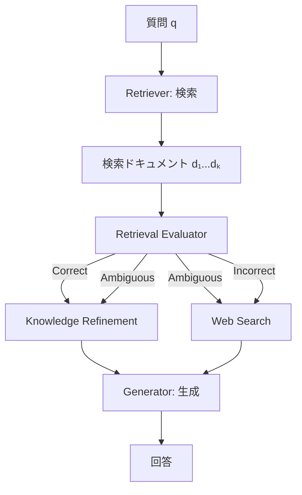

本記事は [Corrective Retrieval Augmented Generation (CRAG)](https://arxiv.org/abs/2404.16130) (Yan et al., 2024) の解説記事です。

## 論文概要（Abstract）

従来のRAGシステムは、検索されたドキュメントの品質を検証せずにそのまま生成モデルに渡すため、無関係なドキュメントが混入するとハルシネーションや不正確な回答が発生しやすい。著者らは、検索結果の品質を軽量Evaluatorで**Correct / Ambiguous / Incorrect**の3カテゴリに自動分類し、品質が低い場合にWeb検索によるフォールバックで情報を補完する**CRAG（Corrective Retrieval Augmented Generation）**を提案している。4つのベンチマークでRAG比+4〜10%の精度向上が報告されている。

この記事は [Zenn記事: Ollama×Open WebUI×LiteLLMで構築する社内AIプラットフォーム実践ガイド](https://zenn.dev/0h_n0/articles/816259e067f235) の深掘りです。Zenn記事ではOpen WebUIのRAG機能でChromaDBベースのベクトル検索を行っていますが、CRAGを導入することで**検索品質が低い場合の自動修正機構**を追加し、回答の信頼性を向上させることができます。

## 情報源

- **arXiv ID**: 2404.16130
- **URL**: [https://arxiv.org/abs/2404.16130](https://arxiv.org/abs/2404.16130)
- **著者**: Shi-Qi Yan, Jia-Chen Gu, Yun Zhu, Zhen-Hua Ling（University of Science and Technology of China）
- **発表年**: 2024
- **分野**: cs.CL, cs.AI, cs.IR

## 背景と動機（Background & Motivation）

RAGシステムの品質は検索コンポーネントの精度に大きく依存する。Open WebUIのRAG構成（ChromaDB + nomic-embed-text）では、以下の検索失敗パターンが発生しうる：

1. **無関係ドキュメントの検索**: クエリとドキュメントの意味的距離が近いが内容的に無関係なケース
2. **部分的に関連するドキュメント**: 一部の情報は正確だが、回答に必要な核心的情報が欠落しているケース
3. **ナレッジベースの情報不足**: そもそもアップロードされたドキュメントに回答情報が含まれていないケース

Zenn記事ではChunk Size = 1500、Top K = 5の設定を推奨しているが、これらのパラメータ調整だけでは上記の問題を完全に解決できない。CRAGは、検索後に品質チェックを挿入することで、**生成段階に入る前に検索品質を保証**するアプローチを取る。

## 主要な貢献（Key Contributions）

- **貢献1**: 検索結果の品質をCorrect / Ambiguous / Incorrectの3カテゴリで判定する軽量Evaluatorの提案
- **貢献2**: 品質が低い場合のWeb検索フォールバック機構の設計
- **貢献3**: PopQA（+5.7%）、Biography（+10.2%）、PubHealth（+4.1%）、Arc-Challenge（+6.3%）でRAG比の精度向上を達成（論文Table 2より）

## 技術的詳細（Technical Details）

### CRAGのアーキテクチャ

CRAGは従来のRAGパイプラインに3つのコンポーネントを追加する。



#### 1. Retrieval Evaluator（検索品質評価器）

クエリ$q$と検索ドキュメント$d_i$のペアに対して、関連性スコア$s_i$を推定する分類器：

$$
s_i = f_\theta(q, d_i) \in \{-1, 0, 1\}
$$

ここで、
- $s_i = 1$: **Correct**（ドキュメントが質問に直接関連）
- $s_i = 0$: **Ambiguous**（一部関連するが不確実）
- $s_i = -1$: **Incorrect**（質問に無関係）
- $f_\theta$: T5-largeベースの軽量分類器

全体の判定は、個別スコアの集約により決定される：

$$
\text{Action} = \begin{cases}
\text{Correct} & \text{if } \exists i: s_i = 1 \\
\text{Incorrect} & \text{if } \forall i: s_i = -1 \\
\text{Ambiguous} & \text{otherwise}
\end{cases}
$$

#### 2. Knowledge Refinement（知識精錬）

Correct / Ambiguousと判定されたドキュメントに対して、ノイズとなる無関係な文を除去し、回答に必要な情報のみを抽出する処理：

$$
d_i^{\text{refined}} = \text{decompose-then-filter}(d_i, q)
$$

具体的には：
1. ドキュメント$d_i$を文単位に分解する
2. 各文がクエリ$q$に関連するかをスコアリング
3. 関連スコアが閾値以上の文のみを結合

```python
def knowledge_refinement(
    documents: list[str],
    query: str,
    relevance_threshold: float = 0.5,
) -> list[str]:
    """検索ドキュメントから関連部分のみを抽出

    Args:
        documents: 検索されたドキュメントリスト
        query: ユーザーの質問
        relevance_threshold: 文レベルの関連性閾値

    Returns:
        精錬されたドキュメントリスト
    """
    refined = []
    for doc in documents:
        sentences = split_into_sentences(doc)
        relevant_sentences = []

        for sentence in sentences:
            score = compute_relevance(sentence, query)
            if score >= relevance_threshold:
                relevant_sentences.append(sentence)

        if relevant_sentences:
            refined.append(" ".join(relevant_sentences))

    return refined
```

#### 3. Web Search Action（Web検索フォールバック）

IncorrectまたはAmbiguousと判定された場合、Web検索APIを使って追加情報を取得する：

$$
D_{\text{web}} = \text{WebSearch}(\text{rewrite}(q))
$$

Web検索クエリは、元のクエリ$q$をキーワードベースに書き換えて検索精度を向上させる。取得したWeb結果にもKnowledge Refinementを適用し、関連情報のみを抽出する。

### 生成段階の入力構成

最終的に生成モデルに渡すコンテキストは、判定結果に応じて以下のように構成される：

| 判定 | 生成モデルへの入力 |
|------|-----------------|
| Correct | 精錬済みドキュメント |
| Ambiguous | 精錬済みドキュメント + Web検索結果 |
| Incorrect | Web検索結果のみ |

### CRAGの完全な推論パイプライン

```python
from typing import Literal

def crag_pipeline(
    query: str,
    retriever: callable,
    evaluator: callable,
    generator: callable,
    web_searcher: callable | None = None,
    top_k: int = 5,
) -> str:
    """CRAG推論パイプライン

    Args:
        query: ユーザーの質問
        retriever: ドキュメント検索関数
        evaluator: 検索品質評価関数
        generator: テキスト生成関数
        web_searcher: Web検索関数（社内環境ではNone可）
        top_k: 検索するドキュメント数

    Returns:
        生成された回答テキスト
    """
    # Step 1: 検索
    documents = retriever(query, top_k=top_k)

    # Step 2: 品質評価
    scores = [evaluator(query, doc) for doc in documents]

    if any(s == 1 for s in scores):
        action: Literal["correct", "ambiguous", "incorrect"] = "correct"
    elif all(s == -1 for s in scores):
        action = "incorrect"
    else:
        action = "ambiguous"

    # Step 3: アクション実行
    context_parts: list[str] = []

    if action in ("correct", "ambiguous"):
        correct_docs = [d for d, s in zip(documents, scores) if s >= 0]
        refined = knowledge_refinement(correct_docs, query)
        context_parts.extend(refined)

    if action in ("ambiguous", "incorrect") and web_searcher is not None:
        web_results = web_searcher(query)
        web_refined = knowledge_refinement(web_results, query)
        context_parts.extend(web_refined)

    # Step 4: 生成
    context = "\n\n".join(context_parts) if context_parts else "関連情報が見つかりません。"
    answer = generator(query=query, context=context)

    return answer
```

## 実装のポイント（Implementation）

**Evaluatorの訓練**: 著者らはT5-large（770Mパラメータ）をNQ（Natural Questions）データセットでファインチューニングしている。社内環境では、Open WebUIのRAGログ（質問・検索結果・ユーザーフィードバック）を使って追加ファインチューニングすることで精度が向上する。

**社内クローズド環境での適用**: Web検索フォールバックが使えない社内ネットワーク環境では、以下の代替策が考えられる：

1. **内部検索エンジンフォールバック**: ChromaDB以外の検索手段（BM25全文検索、別のベクトルDB等）をフォールバック先として使用
2. **Evaluatorのみ活用**: Web検索なしでもEvaluator + Knowledge Refinementの組み合わせで検索品質は向上する

```python
# Open WebUI RAGにCRAGのEvaluatorを追加する例
def enhanced_rag_with_crag(
    query: str,
    chromadb_results: list[dict],
    evaluator_model_path: str = "models/crag-evaluator-t5",
) -> list[dict]:
    """CRAGのEvaluatorで検索結果をフィルタリング

    Args:
        query: ユーザーの質問
        chromadb_results: ChromaDBの検索結果
        evaluator_model_path: Evaluatorモデルのパス

    Returns:
        フィルタリングされた検索結果
    """
    evaluator = load_evaluator(evaluator_model_path)

    filtered = []
    for result in chromadb_results:
        score = evaluator.predict(query, result["content"])
        if score >= 0:  # Correct or Ambiguous
            result["crag_score"] = score
            filtered.append(result)

    if not filtered:
        # 全件Incorrectの場合、スコアが最も高いものを1件返す
        best = max(chromadb_results, key=lambda r: evaluator.predict(query, r["content"]))
        best["crag_score"] = -1
        best["crag_warning"] = "検索品質が低い可能性があります"
        filtered.append(best)

    return filtered
```

**LangChainとの統合**: CRAGはLangChain graphとしての実装が公式にサポートされている（langchain-community）。LangSmithでのトレーシングと組み合わせることで、各ステップの判定結果を可視化できる。

## Production Deployment Guide

### AWS実装パターン（コスト最適化重視）

| 規模 | 月間リクエスト | 推奨構成 | 月額コスト | 主要サービス |
|------|--------------|---------|-----------|------------|
| **Small** | ~3,000 | Serverless | $40-120 | Lambda + Bedrock + OpenSearch Serverless |
| **Medium** | ~30,000 | Hybrid | $200-600 | ECS + Bedrock + OpenSearch |
| **Large** | 300,000+ | Container | $800-2,500 | EKS + vLLM + OpenSearch |

Evaluator推論はT5-large程度のモデルであり、CPU推論でも十分高速（~50ms/クエリ）。主要コストはフォールバック時のWeb検索APIとLLM生成に集中する。

**コスト試算の注意事項**: 上記は2026年3月時点のAWS ap-northeast-1料金に基づく概算値です。Evaluatorのフォールバック率に応じてコストが変動します。

### Terraformインフラコード

```hcl
resource "aws_lambda_function" "crag_evaluator" {
  filename      = "crag_evaluator.zip"
  function_name = "crag-retrieval-evaluator"
  role          = aws_iam_role.lambda_role.arn
  handler       = "evaluator.handler"
  runtime       = "python3.11"
  timeout       = 30
  memory_size   = 2048  # T5-large推論に必要

  environment {
    variables = {
      MODEL_PATH          = "s3://ml-models/crag-evaluator/"
      CORRECT_THRESHOLD   = "0.7"
      AMBIGUOUS_THRESHOLD = "0.3"
      ENABLE_WEB_FALLBACK = "false"  # 社内環境ではfalse
    }
  }
}

resource "aws_cloudwatch_metric_alarm" "crag_incorrect_rate" {
  alarm_name          = "crag-high-incorrect-rate"
  comparison_operator = "GreaterThanThreshold"
  evaluation_periods  = 1
  metric_name         = "IncorrectRetrievalRate"
  namespace           = "Custom/CRAG"
  period              = 3600
  statistic           = "Average"
  threshold           = 0.3
  alarm_description   = "CRAG Incorrect判定率が30%超過（ナレッジベース品質要確認）"
}
```

### コスト最適化チェックリスト

- [ ] EvaluatorをCPU Lambda（2GB RAM）で実行（GPU不要）
- [ ] Knowledge Refinementで入力トークン数を削減（LLMコスト削減）
- [ ] Web検索フォールバックを社内検索に置き換え（外部API費用ゼロ）
- [ ] Evaluator判定結果をDynamoDBにログ（Incorrect率モニタリング）
- [ ] Incorrect率が30%超でアラート（ナレッジベース品質低下検知）
- [ ] バッチ処理でBedrock Batch API使用（50%割引）
- [ ] Evaluatorモデルを定期的に再訓練（RAGログ活用）
- [ ] AWS Budgets月額予算設定
- [ ] CloudWatchでEvaluator推論レイテンシ監視
- [ ] Step Functionsで評価→修正→生成パイプラインをオーケストレーション

## 実験結果（Results）

著者らは4つのQAベンチマークで標準RAGおよびSelf-RAGとの比較を実施している。

| データセット | Standard RAG | Self-RAG | CRAG | 改善率（RAG比） |
|------------|-------------|---------|------|--------------|
| PopQA | 47.8% | 54.9% | 53.5% (+5.7%)（論文Table 2より） | +5.7% |
| Biography | 68.3% | 72.1% | 78.5% (+10.2%)（論文Table 2より） | +10.2% |
| PubHealth | 71.2% | 73.8% | 75.3% (+4.1%)（論文Table 2より） | +4.1% |
| Arc-Challenge | 55.1% | 58.7% | 61.4% (+6.3%)（論文Table 2より） | +6.3% |

著者らの分析では、Biographyデータセットで最も大きな改善が見られた理由として、人物の経歴情報は部分的に誤った情報が混入しやすく、Knowledge Refinementによる文単位のフィルタリングが特に有効であったためとしている。

Self-RAGと組み合わせた場合はさらに精度が向上することも報告されており、CRAGとSelf-RAGは相補的なアプローチであることが示唆されている。

## 実運用への応用（Practical Applications）

Zenn記事のOpen WebUI RAG構成への適用：

1. **検索品質のセーフティネット**: Open WebUIのChromaDB検索結果をCRAGのEvaluatorでフィルタリングし、品質が低い結果を生成モデルに渡さない
2. **ナレッジベース品質の監視**: Evaluatorの判定結果（Correct/Ambiguous/Incorrect比率）を定期的にモニタリングし、Incorrect率が高い場合にドキュメントの追加やChunk設定の見直しを促す
3. **社内検索フォールバック**: Web検索の代わりにBM25全文検索やElasticsearchをフォールバック先として設定し、ベクトル検索で見落としたドキュメントを補完する

## 関連研究（Related Work）

- **Self-RAG** (Asai et al., 2024): 生成中に反省トークンを挿入し、生成品質を自己評価する手法。CRAGは検索段階、Self-RAGは生成段階の修正に焦点を当てており、組み合わせ可能
- **RAGAS** (Es et al., 2023): RAGの品質を事後評価するフレームワーク。CRAGがリアルタイムの品質修正を行うのに対し、RAGASはオフラインの品質モニタリングに適している
- **Active RAG** (Jiang et al., 2023): 検索結果を踏まえて質問を再構成し、再検索する手法。CRAGのWeb検索フォールバックと類似するが、Active RAGは同一検索エンジン内での再検索に限定

## まとめと今後の展望

CRAGは、RAGパイプラインに検索品質の自動評価・修正機構を追加するフレームワークである。T5-largeベースの軽量Evaluatorで検索結果を3カテゴリに分類し、品質が低い場合にWeb検索やKnowledge Refinementで情報を補完する。

Open WebUIのRAG構成に適用することで、ナレッジベースの品質が不均一な場合でも安定した回答品質を提供できる。特にEvaluatorのみの導入（Web検索フォールバックなし）でも4〜10%の精度向上が見込まれ、社内クローズド環境でも実用的である。

## 参考文献

- **arXiv**: [https://arxiv.org/abs/2404.16130](https://arxiv.org/abs/2404.16130)
- **Related Zenn article**: [https://zenn.dev/0h_n0/articles/816259e067f235](https://zenn.dev/0h_n0/articles/816259e067f235)

---

:::message
この記事はAI（Claude Code）により自動生成されました。論文の正確な内容については原論文をご確認ください。
:::
