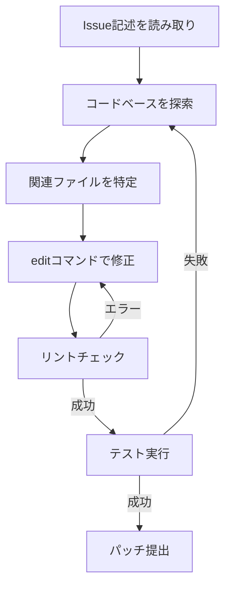

本記事は [SWE-agent: Agent-Computer Interfaces Enable Automated Software Engineering](https://arxiv.org/abs/2405.15793) の解説記事です。

## 論文概要（Abstract）

SWE-agentは、LLM（大規模言語モデル）がコンピュータと対話するためのAgent-Computer Interface（ACI）を体系的に設計し、GitHubの実際のIssue解決タスクにおいて当時の最先端性能を達成したシステムです。著者らは、LLM向けに最適化されたファイル閲覧・編集・検索コマンドを設計することで、SWE-benchにおいて12.47%の解決率を報告しています（GPT-4使用時）。従来のシェルやエディタをそのまま使うアプローチでは3.97%に留まっていたことと比較して、インターフェース設計の重要性を実証した研究です。

この記事は [Zenn記事: Claude CodeでAI拡張開発を実現する6層アーキテクチャ実践ガイド](https://zenn.dev/0h_n0/articles/aa25c4b338d464) の深掘りです。

## 情報源

- **arXiv ID**: 2405.15793
- **URL**: [https://arxiv.org/abs/2405.15793](https://arxiv.org/abs/2405.15793)
- **著者**: John Yang, Carlos E. Jimenez, Alexander Wettig, Kilian Lieret, Shunyu Yao, Karthik Narasimhan, Ofir Press（プリンストン大学, スタンフォード大学）
- **発表年**: 2024
- **分野**: cs.SE, cs.AI, cs.CL

## 背景と動機（Background & Motivation）

ソフトウェアエンジニアリング（SE）タスク——特にGitHub Issueの解決——は、コードベースのナビゲーション、対象を絞った編集、テスト実行の組み合わせを要求します。2024年以前のLLMベースのアプローチは、既存のBashシェルやエディタインターフェースをそのまま使用していました。

著者らはこのアプローチの根本的な問題を指摘しています。Bashシェルはもともと人間のプログラマが対話的に操作することを前提に設計されており、LLMエージェントにとっては不要な情報が多く含まれ、操作も冗長になります。たとえば、ファイルの特定行を編集するためにBashで `sed` コマンドを構築すると、正規表現のエスケープやアドレス指定で容易にエラーが発生します。

このギャップを埋めるために、著者らは**ACI（Agent-Computer Interface）**という概念を提唱しました。HCI（Human-Computer Interface）が人間向けに最適化されるように、ACIはLLM向けに最適化されたインターフェースです。

## 主要な貢献（Key Contributions）

- **ACI概念の提唱**: LLMエージェント向けのインターフェース設計原則を体系化し、HCIとの対比で位置づけた
- **SWE-agentシステム**: ACIを具体化したシステムの実装と公開（MIT License）
- **SWE-benchでの性能実証**: GPT-4を用いてSWE-bench Full上で12.47%の解決率を達成（論文Table 1より、従来の最先端3.97%から大幅に改善）
- **ACI設計指針の明文化**: エラー防止、フィードバック設計、環境状態の可視性に関する設計原則をまとめた

## 技術的詳細（Technical Details）

### Agent-Computer Interface（ACI）の設計原則

著者らが論文で示したACI設計の3つの原則は以下の通りです。

**原則1: アクションは簡潔で理解しやすくせよ**

LLMが生成するアクション（コマンド）は、短く、曖昧性がなく、エラーを起こしにくいものにすべきです。従来のBashコマンド（`sed`, `awk`等）はLLMにとって構文エラーの温床でした。

**原則2: フィードバックは情報豊富かつ簡潔にせよ**

コマンド実行後の出力は、LLMが次のアクションを決定するのに十分な情報を含みつつ、コンテキストウィンドウを圧迫しない量に抑えるべきです。

**原則3: 環境の状態を常に可視化せよ**

LLMが「今どのファイルの何行目を見ているか」を常に把握できるようにすべきです。人間がIDEのサイドバーやステータスバーで把握する情報に相当します。

### SWE-agentのコマンド設計

SWE-agentが提供する主要コマンドは以下の通りです。

| コマンド | 機能 | Bash相当 |
|---|---|---|
| `open <file> [<line>]` | ファイルを開き、指定行付近を表示（100行窓） | `less +<line> <file>` |
| `scroll_down` / `scroll_up` | 表示窓を移動 | PgDown/PgUp |
| `goto <line>` | 特定行へジャンプ | `:n` in vim |
| `search_file <pattern> [<file>]` | ファイル内検索 | `grep -n <pattern> <file>` |
| `search_dir <pattern> [<dir>]` | ディレクトリ内検索 | `grep -rn <pattern> <dir>` |
| `find_file <name> [<dir>]` | ファイル名検索 | `find <dir> -name <name>` |
| `edit <start>:<end> <content>` | 行範囲の内容を置換 | `sed` |
| `create <file>` | 新規ファイル作成 | `touch <file>` |

特に `edit` コマンドの設計は重要です。従来の `sed` コマンドでは正規表現のエスケープが必要で、LLMが頻繁にエラーを起こしていました。SWE-agentの `edit` は行番号指定で内容を直接置換する簡潔なインターフェースを提供します。

### エラー防止メカニズム

SWE-agentのACIにはリント機能が組み込まれています。`edit` コマンド実行後、変更されたファイルに対して自動的に構文チェックが実行され、構文エラーが検出された場合は編集が**ロールバック**されます。

```python
def edit_file(file_path: str, start_line: int, end_line: int, new_content: str) -> str:
    """SWE-agentのeditコマンドの簡略化した実装イメージ

    Args:
        file_path: 編集対象ファイルのパス
        start_line: 編集開始行（1-indexed）
        end_line: 編集終了行（inclusive）
        new_content: 置換する内容

    Returns:
        編集結果のメッセージ（成功時は更新後の該当行を表示）
    """
    # 1. 現在の内容を保存（ロールバック用）
    backup = read_file(file_path)

    # 2. 行範囲を置換
    lines = backup.split('\n')
    lines[start_line-1:end_line] = new_content.split('\n')
    write_file(file_path, '\n'.join(lines))

    # 3. 構文チェック（リント）
    lint_result = run_linter(file_path)
    if lint_result.has_errors:
        # エラー時はロールバック
        write_file(file_path, backup)
        return f"Edit failed: {lint_result.errors}. File restored."

    # 4. 成功時は更新後の内容を表示
    return format_file_view(file_path, start_line)
```

このリント統合は、Claude Codeの**Hooks（Layer 2）のPostToolUse**で実装されている自動リントと同じ設計思想です。Zenn記事で解説されている「Hooksは決定論的に実行される」という性質は、SWE-agentのリント統合と共通する設計原則に基づいています。

### エージェントのループ構造

SWE-agentの推論ループは以下の形式です。



各ステップでLLMは思考プロセス（thought）とアクション（action）を交互に出力します。これはReAct（Reasoning + Acting）フレームワークに基づいています。

$$
a_t = \pi_\theta(o_{1:t}, a_{1:t-1})
$$

ここで、
- $a_t$: 時刻$t$でのアクション（コマンド）
- $o_{1:t}$: 時刻1から$t$までの観測（コマンド出力）
- $\pi_\theta$: LLMの方策（パラメータ$\theta$）

エージェントは最大25ターンのインタラクションが許可され、各ターンでthought→action→observationの3組を生成します。

## 実装のポイント（Implementation）

SWE-agentの実装で注目すべき点は以下の通りです。

**Docker環境でのサンドボックス実行**: 各タスクは独立したDockerコンテナ内で実行されます。これにより、エージェントのアクション（ファイル編集、コマンド実行）が他のタスクや環境に影響を与えません。Claude CodeのHooks（Layer 2）で言及されている「セキュリティ」の考え方と共通します。

**コンテキストウィンドウの管理**: ファイル閲覧は100行の「窓」に制限されています。これは、ファイル全体を読み込むとコンテキストウィンドウが急速に埋まるためです。Claude CodeのZenn記事で強調されている「コンテキストウィンドウの管理が最も重要な制約」という指摘と一致します。

**検索結果のフォーマット**: `search_file`や`search_dir`の出力はファイル名・行番号・マッチ内容を簡潔にフォーマットします。LLMが次のアクション（`open`や`edit`）を決定しやすい形式です。

**リポジトリマップ**: リポジトリ全体の構造を簡潔に表示する機能があります。これにより、LLMは「どのファイルが存在するか」をコンテキストに入れた上で探索を開始できます。

## 実験結果（Results）

### SWE-benchでの性能

著者らが論文Table 1で報告している主要な結果は以下の通りです。

| モデル | アプローチ | SWE-bench Full | SWE-bench Lite |
|---|---|---|---|
| Claude 3 Opus | RAG (非エージェント) | 3.97% | 4.33% |
| GPT-4 | RAG (非エージェント) | 1.74% | 0.67% |
| GPT-4 | SWE-agent (Shell) | 8.33% | - |
| GPT-4 | SWE-agent (ACI) | **12.47%** | **18.00%** |
| Claude 3 Opus | SWE-agent (ACI) | 6.67% | - |

**注目すべき比較**: 同じGPT-4でも、Shellインターフェース（8.33%）とACI（12.47%）では4.14ポイントの差があります。著者らはこの差がインターフェース設計の効果であると主張しています。

### ACIデザイン要素のアブレーション

著者らは論文Table 2でACI設計要素の寄与を分析しています。

| 設計要素 | 解決率への影響 |
|---|---|
| エディタ（edit → shell） | -4.1% |
| ファイルビューア（100行窓 → 全体表示） | -2.3% |
| 検索コマンド（専用 → grep） | -1.8% |
| リント統合（有 → 無） | -3.2% |

リント統合の寄与が最も大きく（-3.2%）、次いでエディタ設計（-4.1%）という結果です。これは「LLMは構文エラーの自己修正が苦手」という知見を裏付けています。

### エラーパターンの分析

著者らの分析（論文Figure 5より）では、エージェントの失敗原因の内訳は以下の通りです。

- **ファイル特定の失敗**: 全失敗の約40%。エージェントが修正すべきファイルを見つけられなかった
- **修正の不完全**: 約30%。正しいファイルを見つけたが、修正が不十分
- **テスト失敗**: 約20%。修正は行われたが、テストが通らない
- **その他**: 約10%。タイムアウト、環境エラーなど

## 実運用への応用（Practical Applications）

SWE-agentの設計原則は、Claude Codeの6層アーキテクチャと密接に対応しています。

**Layer 1（CLAUDE.md）との対応**: SWE-agentのシステムプロンプトは、エージェントに利用可能なコマンド一覧と使い方を伝えます。CLAUDE.mdがプロジェクト固有のルールやコマンドを伝える役割と同じです。

**Layer 2（Hooks）との対応**: SWE-agentのリント統合は、HooksのPostToolUseで自動リントを実行するパターンと同一です。「確実に実行される品質ゲート」という設計思想が共通しています。

**Layer 4（Subagents）との対応**: SWE-agentは単一エージェントですが、ファイル探索とコード編集を分離した設計は、Subagentsに調査を委譲するパターンの単純化版と見なせます。

**コンテキスト効率**: SWE-agentの100行窓やリポジトリマップは、コンテキストウィンドウの効率的利用を目的としています。Claude Codeの`/clear`やSubagentsへの委譲と同じ課題に対する解決策です。

**スケーリングの制約**: SWE-agentはPythonリポジトリのみを対象としており、TypeScript/JavaScript、Go、Rustなどの他言語への拡張は別途の検証が必要です。また、モノレポなど大規模リポジトリでの性能は報告されていません。

## 関連研究（Related Work）

- **SWE-bench** (Jimenez et al., 2024): SWE-agentの評価に使用されたベンチマーク。GitHub Issueの解決タスクを2294問収録
- **ReAct** (Yao et al., 2023): SWE-agentが採用する推論+行動のフレームワーク。LLMにthought→action→observationのループを実行させる
- **Reflexion** (Shinn et al., 2023): エージェントが過去の失敗から学習するフレームワーク。SWE-agentは明示的なReflexionは使用していないが、リント統合によるエラーフィードバックが類似の機能を果たしている

## まとめと今後の展望

SWE-agentは、LLMエージェント向けのインターフェース設計（ACI）が性能に与える影響の大きさを実証した重要な論文です。同じLLM（GPT-4）でもインターフェース設計だけで解決率が4ポイント以上改善するという結果は、「モデルの能力向上」だけでなく「ツール設計の最適化」がエージェント性能の鍵であることを示しています。

2026年現在、SWE-bench VerifiedでのSOTA（Claude Opus 4.6による80.8%）はSWE-agentの当時の性能を大きく上回っていますが、ACI設計の原則——簡潔なアクション、情報豊富なフィードバック、状態の可視化——は依然として有効な設計指針です。Claude Codeの6層アーキテクチャは、これらの原則をさらに発展させた実装と位置づけられます。

## 参考文献

- **arXiv**: [https://arxiv.org/abs/2405.15793](https://arxiv.org/abs/2405.15793)
- **Code**: [https://github.com/princeton-nlp/SWE-agent](https://github.com/princeton-nlp/SWE-agent)
- **Related Zenn article**: [https://zenn.dev/0h_n0/articles/aa25c4b338d464](https://zenn.dev/0h_n0/articles/aa25c4b338d464)
