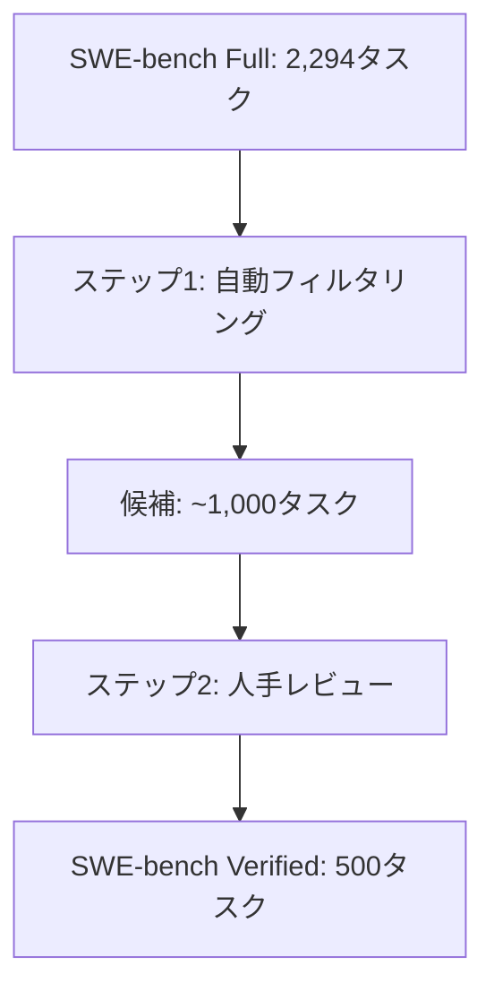

本記事は [SWE-bench Verified](https://arxiv.org/abs/2406.01681) の解説記事です。

## 論文概要（Abstract）

SWE-bench Verifiedは、元のSWE-bench（2,294問のGitHub Issue解決タスク）から人手で検証された500問のサブセットです。元のSWE-benchには「利用可能な情報だけでは解決不可能なタスク」や「不正確なテストが誤った解法を正解と判定する」問題がありました。著者らは、OpenAIの検証者がこれらの問題を人手で排除したサブセットを構築し、LLMエージェントのソフトウェアエンジニアリング能力を信頼性高く評価する基盤を提供しています。2026年3月時点でClaude Opus 4.6が80.8%のスコアを達成しており、このベンチマークはAIコーディングエージェントの事実上の業界標準となっています。

この記事は [Zenn記事: Claude CodeでAI拡張開発を実現する6層アーキテクチャ実践ガイド](https://zenn.dev/0h_n0/articles/aa25c4b338d464) の深掘りです。

## 情報源

- **arXiv ID**: 2406.01681
- **URL**: [https://arxiv.org/abs/2406.01681](https://arxiv.org/abs/2406.01681)
- **著者**: Carlos E. Jimenez, John Yang, Alexander Wettig, Shunyu Yao, Kexin Pei, Ofir Press, Karthik Narasimhan（プリンストン大学）
- **発表年**: 2024
- **分野**: cs.SE, cs.AI, cs.LG

## 背景と動機（Background & Motivation）

SWE-bench（2023年に公開）は、GitHubの実際のIssueをLLMが解決するタスクを収録したベンチマークです。各タスクは、Issueの記述とその時点のコードベースを入力として、Issue解決のパッチを生成することを要求します。生成されたパッチは、リポジトリに含まれるテストスイートで検証されます。

しかし、元のSWE-benchには以下の問題が報告されていました。

**問題1: 解決不可能なタスク**

一部のタスクは、Issue記述だけでは解決に必要な情報が不足していました。たとえば、IssueにPRへの参照が含まれているが、PR側の議論にしか解決のヒントがないケースです。このようなタスクでは、LLMが「正しい」パッチを生成することは期待できません。

**問題2: 不正確なテスト仕様**

元のSWE-benchでは、テストが過度に緩い場合がありました。たとえば、テストが「特定の例外が発生しないこと」だけをチェックし、実際の修正内容の正しさを検証しないケースです。これにより、不正確なパッチがテストをパスしてしまう問題がありました。

著者らは、これらの問題がLLMエージェントの性能評価を歪め、「実際より高い性能」を報告するリスクがあると指摘しています。

## 主要な貢献（Key Contributions）

- **人手検証プロセス**: OpenAIの検証者が2,294問を精査し、解決可能かつテストが信頼できる500問を選別
- **タスク品質基準の明文化**: 「良いSWE-benchタスク」の条件を形式化
- **信頼性の高い評価基盤**: Verifiedサブセットでの評価が業界標準として定着

## 技術的詳細（Technical Details）

### タスクの構造

SWE-benchの各タスクは以下の要素で構成されています。

$$
\text{Task} = (I, C_t, T_{\text{pass}}, T_{\text{fail}})
$$

ここで、
- $I$: Issue記述（自然言語テキスト）
- $C_t$: Issue作成時点のコードベース（gitの特定コミット）
- $T_{\text{pass}}$: パッチ適用後にパスすべきテスト群（修正を検証するテスト）
- $T_{\text{fail}}$: パッチ適用前に失敗すべきテスト群（バグの存在を確認するテスト）

モデルの出力 $P$ は、`git diff` 形式のパッチです。評価は以下の条件で判定されます。

$$
\text{Resolved}(P) = \begin{cases}
1 & \text{if } T_{\text{pass}}(C_t + P) = \text{all\_pass} \land T_{\text{fail}}(C_t) = \text{all\_fail} \\
0 & \text{otherwise}
\end{cases}
$$

### 検証プロセス

Verifiedサブセットの構築は以下の手順で行われました。

**ステップ1: 自動フィルタリング**

- テストが1つしかないタスクを除外（テストの網羅性不足）
- パッチが巨大すぎる（500行以上）タスクを除外（LLMには非現実的）
- テストの実行に特殊な環境が必要なタスクを除外

**ステップ2: 人手レビュー（OpenAI検証者）**

各タスクについて以下を確認:
1. Issue記述だけで問題が理解可能か
2. テストがパッチの正しさを適切に検証しているか
3. 「正解パッチ」が唯一の解法でないことの確認（複数の正しいパッチがテストをパスできるか）

### Verifiedサブセットの特性

著者らが論文で報告しているVerifiedサブセットの特性です。

| 属性 | SWE-bench Full | SWE-bench Verified |
|---|---|---|
| タスク数 | 2,294 | 500 |
| 対象リポジトリ数 | 12 | 12 |
| 対象言語 | Python | Python |
| パッチの中央値行数 | 15行 | 12行 |
| テスト数の中央値 | 3 | 4 |

Verifiedサブセットは元のSWE-benchと比較して、パッチサイズがやや小さく、テスト数がやや多い傾向にあります。これは、より明確に定義されたタスクが選ばれた結果です。

### 対象リポジトリ

SWE-bench（VerifiedとFull共通）が対象とする12のPythonリポジトリは以下の通りです。

| リポジトリ | 分野 | タスク数（Verified） |
|---|---|---|
| Django | Webフレームワーク | 約115 |
| scikit-learn | 機械学習 | 約65 |
| matplotlib | データ可視化 | 約50 |
| Flask | Webフレームワーク | 約25 |
| sympy | 数式処理 | 約60 |
| requests | HTTP通信 | 約15 |
| pytest | テスト | 約20 |
| sphinx | ドキュメント生成 | 約30 |
| astropy | 天文学 | 約20 |
| pylint | 静的解析 | 約25 |
| xarray | 多次元配列 | 約35 |
| seaborn | 統計可視化 | 約40 |

Djangoのタスクが最も多い点は重要です。DjangoはORMやテンプレートエンジンなど複数のサブシステムを持つ大規模フレームワークであり、Issue解決には広範なコードベース理解が必要です。

## 実験結果（Results）

### 各モデルのスコア（2026年3月時点のリーダーボード）

Epoch AIのリーダーボードおよびswebench.comのデータを基にした主要な結果です。

| モデル/エージェント | SWE-bench Verified |
|---|---|
| Claude Opus 4.6 | **80.8%** |
| Claude Sonnet 4.5 | 72.0% |
| OpenAI o3 | 69.1% |
| GPT-4o + SWE-agent | 43.8% |
| Claude 3.5 Sonnet + OpenHands | 38.0% |
| Llama-SWE (SWE-RL) | 41.0% |
| SWE-agent (GPT-4, 2024初期) | 23.7% |

**注目すべき推移**: 2024年5月にSWE-agentが23.7%を記録してから、約2年でClaude Opus 4.6が80.8%に到達しています。これは、LLMの能力向上とエージェントの足場（scaffolding）設計の改善の両方が寄与した結果です。

### FullとVerifiedのスコアの乖離

| エージェント | SWE-bench Full | SWE-bench Verified | 比率 |
|---|---|---|---|
| SWE-agent (GPT-4) | 12.47% | 23.7% | 1.90x |
| RAG (Claude 3 Opus) | 3.97% | 7.0% | 1.76x |

VerifiedのスコアがFullの約1.8-1.9倍になる傾向があります。これは、Verifiedが「解決可能な」タスクに絞られているためです。Full上の低スコアの一部は、そもそも解決不可能なタスクが含まれていることに起因していました。

## 実運用への応用（Practical Applications）

SWE-bench Verifiedが定量化している「LLMエージェントのSE能力」は、Claude Codeの6層アーキテクチャを導入する際の期待値設定に直結します。

**80.8%の解釈**: Claude Opus 4.6のSWE-bench Verified 80.8%は、「人手で検証された500の実際のGitHub Issueのうち、約404件をLLMが自律的に解決できる」ことを意味します。ただし、この数値にはいくつかの注意点があります。

1. **対象はPythonのみ**: TypeScript、Go、Rustなどの他言語への汎化は別途検証が必要
2. **12リポジトリに限定**: 産業界の多様なコードベースへの汎化は保証されない
3. **パッチサイズの制限**: 中央値12行の比較的小さな修正が対象。大規模なリファクタリングは含まれない
4. **テスト環境の統制**: 再現可能な環境で評価されており、本番環境の複雑さ（環境変数、外部サービス依存等）は反映されていない

**Claude Codeの6層アーキテクチャとの関係**: Zenn記事で紹介されている「Plan Mode→実装→検証」の4段階ワークフローは、SWE-benchタスクの解決プロセス（Issue理解→コード探索→修正→テスト実行）と構造が対応しています。SWE-bench Verifiedでの高スコアは、このワークフローの有効性を間接的に裏付けています。

## 関連研究（Related Work）

- **HumanEval** (Chen et al., 2021): 関数レベルのコード生成ベンチマーク。SWE-benchよりも単純だが、コード生成能力の基礎的な評価に使用される
- **SWE-bench Multimodal** (Yang et al., 2024): JavaScript/TypeScriptのフロントエンドバグ修正に拡張。視覚的なバグ（UIの不具合）を含む617タスクを収録
- **TheAgentCompany** (Xu et al., 2024): SE以外の実務タスク（ドキュメント作成、Slack操作など）を含む175タスクのベンチマーク

## まとめと今後の展望

SWE-bench Verifiedは、LLMコーディングエージェントの能力を信頼性高く定量評価するベンチマークとして、2026年現在も業界標準の地位にあります。人手検証による品質保証は、ベンチマークの信頼性を根本から改善しました。

Claude Opus 4.6の80.8%という数値は、エージェント型コーディングが「実験段階」から「実用段階」に移行しつつあることを示しています。しかし、Python・12リポジトリ・小規模パッチという制約を理解した上で、この数値を解釈する必要があります。Claude Codeの6層アーキテクチャを実践する際は、SWE-bench Verifiedでの性能を参考にしつつ、自分のプロジェクト固有の特性（言語、規模、複雑さ）に応じた期待値を設定することが重要です。

## 参考文献

- **arXiv**: [https://arxiv.org/abs/2406.01681](https://arxiv.org/abs/2406.01681)
- **SWE-bench公式サイト**: [https://www.swebench.com/](https://www.swebench.com/)
- **Code**: [https://github.com/princeton-nlp/SWE-bench](https://github.com/princeton-nlp/SWE-bench)
- **Related Zenn article**: [https://zenn.dev/0h_n0/articles/aa25c4b338d464](https://zenn.dev/0h_n0/articles/aa25c4b338d464)
