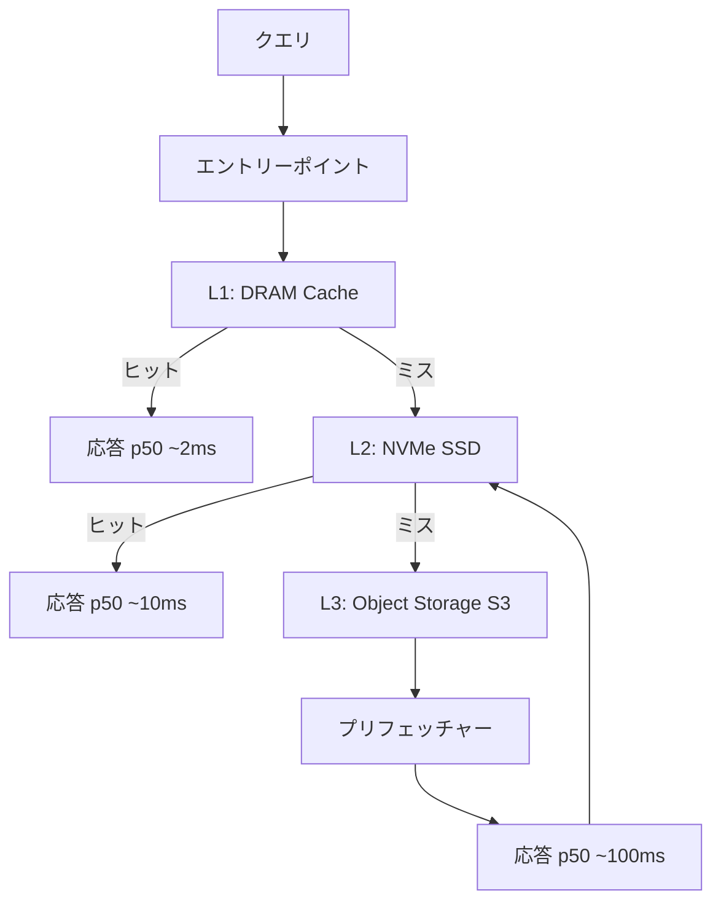

本記事は [arXiv:2406.02957 LiquidANN: Cost-Efficient Vector Search with Tiered Storage](https://arxiv.org/abs/2406.02957)（2024年6月公開）の解説記事です。

## 論文概要（Abstract）

LiquidANNは、ベクトル検索のストレージコストを5-10倍削減するために、DRAM・NVMe SSD・オブジェクトストレージ（S3互換）の3層ストレージ階層を活用するアプローチを提案している。著者らは、DiskANNのコードベースを基盤とし、クエリアクセス頻度に基づいてインデックスノードを「ホット」「ウォーム」「コールド」に分類し、適切なストレージ層に配置するコスト認識型グラフ分割アルゴリズムを導入している。SIFT-1B、DEEP-1Bなどの大規模データセットでの評価では、95%リコール@10の条件下でフルDRAMインデックスの5-10倍のコスト削減を達成しつつ、p50レイテンシをインメモリDiskANNの2倍以内に抑えているとされる。

この記事は [Zenn記事: ベクトルDB運用コスト最適化：Turbopuffer・LanceDB・pgvectorscale比較](https://zenn.dev/0h_n0/articles/7306026ebdfe23) の深掘りです。

## 情報源

- **arXiv ID**: 2406.02957
- **URL**: [https://arxiv.org/abs/2406.02957](https://arxiv.org/abs/2406.02957)
- **著者**: Qi Chen, Bing Zhao, Mingquan Lu et al.
- **発表年**: 2024
- **分野**: cs.DB, cs.DC

## 背景と動機（Background & Motivation）

大規模ベクトル検索において、インメモリ型インデックス（HNSW、DiskANN等）は高速だがストレージコストが高く、10億ベクトル規模では数百GB〜数TBのDRAMが必要になる。一方、オブジェクトストレージ（S3等）は$0.02/GB程度とDRAMの100分の1以下のコストだが、レイテンシが数百msと大きい。

従来のアプローチでは、インデックス全体をDRAMに配置するか、DiskANNのようにSSD上に配置するかの二択であった。LiquidANNの著者らは、実際のクエリワークロードではインデックスノードへのアクセスが大きく偏っていること（一部のノードが頻繁にアクセスされ、大半のノードはほとんどアクセスされない）に着目し、この偏りを利用した3層配置を提案している。

## 主要な貢献（Key Contributions）

- **コスト認識型グラフ分割**: クエリアクセス頻度に基づいてインデックスノードをホット/ウォーム/コールドに分類し、DRAM/SSD/S3に配置するアルゴリズムの提案
- **非同期プリフェッチャー**: グラフ探索の次のホップを予測し、事前にI/Oを発行するMLベースのプリフェッチ機構の導入
- **S3バッチアクセスの最適化**: オブジェクトストレージのHTTPオーバーヘッドを軽減するため、最小32ノードのバッチGETリクエスト方式の提案
- **分析的コストモデル**: 目標リコール予算に対して最適な配置閾値を決定する数理モデルの導出

## 技術的詳細（Technical Details）

### 3層ストレージアーキテクチャ

LiquidANNの中核は、グラフベースANNインデックス（Vamanaグラフ）のノードを3つのストレージ層に配置する設計である。



### コスト認識型ノード配置

著者らは以下のコストモデルを提案している。ノード$v$の配置先を決定するために、アクセス頻度$f(v)$とストレージ層ごとのコスト・レイテンシのトレードオフを最適化する。

$$
\min_{\pi} \sum_{v \in V} C_{\text{storage}}(\pi(v)) \quad \text{s.t.} \quad \mathbb{E}[L(\pi)] \leq L_{\text{target}}
$$

ここで、
- $V$: インデックスの全ノード集合
- $\pi(v) \in \{\text{DRAM}, \text{SSD}, \text{S3}\}$: ノード$v$の配置先
- $C_{\text{storage}}(\pi(v))$: 配置先のストレージコスト（$/GB/月）
- $L(\pi)$: 配置方針$\pi$に基づくクエリレイテンシ
- $L_{\text{target}}$: 目標レイテンシ制約

各ストレージ層のコストとレイテンシ（論文より）:

| ストレージ層 | コスト ($/GB/月) | ランダムアクセスレイテンシ |
|------------|-----------------|----------------------|
| DRAM | ~$10 | ~100ns |
| NVMe SSD | ~$0.10 | ~10μs |
| S3 | ~$0.02 | ~50-200ms |

### ノード分類アルゴリズム

著者らはクエリワークロードのプロファイリングに基づいてノードを分類する。具体的なアルゴリズムは以下の通りである。

```python
from dataclasses import dataclass
from enum import Enum


class StorageTier(Enum):
    DRAM = "dram"
    SSD = "ssd"
    S3 = "s3"


@dataclass
class PlacementConfig:
    """配置閾値の設定"""
    hot_threshold: float     # ホットノード閾値（上位X%）
    warm_threshold: float    # ウォームノード閾値（上位Y%）


def classify_nodes(
    access_frequencies: dict[int, float],
    config: PlacementConfig,
) -> dict[int, StorageTier]:
    """アクセス頻度に基づくノード分類

    Args:
        access_frequencies: ノードID → アクセス頻度のマッピング
        config: 配置閾値設定

    Returns:
        ノードID → 配置先のマッピング
    """
    sorted_nodes = sorted(
        access_frequencies.items(),
        key=lambda x: x[1],
        reverse=True,
    )
    total = len(sorted_nodes)
    placement = {}

    for rank, (node_id, freq) in enumerate(sorted_nodes):
        percentile = rank / total
        if percentile < config.hot_threshold:
            placement[node_id] = StorageTier.DRAM
        elif percentile < config.warm_threshold:
            placement[node_id] = StorageTier.SSD
        else:
            placement[node_id] = StorageTier.S3

    return placement
```

### 非同期プリフェッチャー

論文で提案されているプリフェッチャーは、グラフ探索のトラバーサルパスを予測する小規模なMLP（多層パーセプトロン）で構成されている。このMLPはトラバーサルログから学習され、次のホップの候補ノードを予測してS3へのI/Oを事前に発行する。

$$
\hat{v}_{\text{next}} = \text{MLP}(\mathbf{q}, v_{\text{current}}, \{v_{\text{neighbors}}\})
$$

ここで、
- $\mathbf{q}$: クエリベクトル
- $v_{\text{current}}$: 現在のノード
- $\{v_{\text{neighbors}}\}$: 現在のノードの近傍集合
- $\hat{v}_{\text{next}}$: 予測される次のホップ先ノード

著者らによると、プリフェッチャーはDRAMオーバーヘッドとして15-20%の追加メモリを必要とする。

## 実装のポイント（Implementation）

### DiskANNベースの実装

LiquidANNはMicrosoftのDiskANNコードベースを基盤としている。主な変更点は以下の通りである。

1. **ストレージバックエンドの抽象化**: DiskANNのI/Oレイヤーを拡張し、S3互換ストレージへのアクセスパスを追加
2. **バッチGETの実装**: S3へのアクセスは最低32ノードのバッチで行い、HTTPオーバーヘッドを分散
3. **LRUキャッシュの変更**: SSDキャッシュ層にアクセス頻度バイアス付きのLRUを導入
4. **プリフェッチャーの統合**: トラバーサルログからMLPを学習し、クエリ実行時に非同期プリフェッチを実行

### 実装上の注意点

- **ウォームアップ期間**: プリフェッチャーのMLPは代表的なクエリワークロードで学習する必要があり、初期のウォームアップ期間が必要
- **クエリ分布の変化**: ホット/コールドの分類はクエリ分布に依存するため、分布シフトが発生するとパフォーマンスが劣化する
- **S3テイルレイテンシ**: p99レイテンシは50-200msと高く、厳密なリアルタイムSLAには不向き

## 実験結果（Results）

### ベンチマーク条件

著者らはSIFT-1B、DEEP-1B、および内部のMicrosoft本番データセット（14億ベクトル）で評価を行っている。

### 主要な結果（論文Table/Figureより）

| データセット | リコール@10 | フルDRAM QPS | LiquidANN QPS | コスト削減率 |
|------------|-----------|-------------|--------------|-----------|
| SIFT-1B | 95% | 基準 | p50レイテンシ2倍以内 | 5-10x |
| DEEP-1B | 95% | 基準 | p50レイテンシ2倍以内 | 5-10x |
| Internal (1.4B) | 95% | 基準 | p50レイテンシ2倍以内 | 5-10x |

**コスト指標**: 論文では$/QPS/recallの指標を使用しており、同じリコール・スループットを達成するために必要なインフラコストが5-10倍削減されたと報告している。

### 制約事項

著者らは以下の制約を認めている:
- S3テイルレイテンシ（p99）が高い（50-200ms）ため、厳密なリアルタイムSLAには不適
- プリフェッチャーのMLPは代表的なクエリ分布で学習する必要があり、分布シフトに対してロバストではない
- フィルタ付きANNワークロードでの評価は行われていない

## 実運用への応用（Practical Applications）

### Zenn記事との関連

Zenn記事で紹介されているTurbopufferのアーキテクチャは、LiquidANNの設計思想と多くの共通点がある。

| 観点 | LiquidANN | Turbopuffer |
|------|-----------|------------|
| ストレージ階層 | DRAM/SSD/S3の3層 | Memory/NVMe SSD/Object Storageの3層 |
| ホット/コールド分離 | アクセス頻度ベース | 名前空間アクティビティベース |
| コスト削減率 | 5-10x（論文報告） | Cursor: 95%削減、Notion: 60%削減（各社報告） |
| 適用規模 | 10億ベクトル級 | 1000億ベクトル級（Cursor事例） |

### 適用条件

LiquidANNのアプローチが適している場面:
- p50レイテンシが重要でp99は許容できるワークロード（バッチRAG検索等）
- アクセスパターンが偏っている（一部のデータに集中）
- 大規模（10億ベクトル以上）でDRAMコストが課題

適さない場面:
- p99 < 10msが必要なリアルタイムアプリケーション
- クエリ分布が頻繁に変化するワークロード
- 小規模デプロイメント（DRAMコストが問題にならない）

## 関連研究（Related Work）

- **DiskANN (Jayaram Subramanya et al., NeurIPS 2019)**: LiquidANNの基盤。SSD上のVamanaグラフによる10億ベクトル級のANN検索を実現
- **DiskANN++ (Wang et al., 2024, arXiv:2401.11469)**: ページベースレイアウト最適化によりDiskANNのI/O効率を2-3倍改善
- **S3-HNSW (Bleifuß et al., 2024, arXiv:2407.10912)**: HNSWグラフを直接S3上でホスティングする代替アプローチ。LiquidANNより単純だがプリフェッチャーがない
- **SIGANN (Shi et al., 2023, arXiv:2312.12148)**: ヘテロジニアスストレージでのコスト認識型セグメント配置

## まとめと今後の展望

LiquidANNは、ベクトル検索のコスト最適化に対してストレージ階層の活用という実用的なアプローチを提示した論文である。著者らが提案するコスト認識型グラフ分割と非同期プリフェッチの組み合わせにより、リコールを維持しながらストレージコストを5-10倍削減できることが示されている。

Zenn記事で紹介されているTurbopufferのオブジェクトストレージ型アーキテクチャの理論的裏付けとなる研究であり、ベクトルDB選定においてストレージアーキテクチャがコストに与えるインパクトを定量的に理解する上で参考になる論文である。

## 参考文献

- **arXiv**: [https://arxiv.org/abs/2406.02957](https://arxiv.org/abs/2406.02957)
- **DiskANN**: [https://github.com/microsoft/DiskANN](https://github.com/microsoft/DiskANN)
- **Related Zenn article**: [https://zenn.dev/0h_n0/articles/7306026ebdfe23](https://zenn.dev/0h_n0/articles/7306026ebdfe23)
