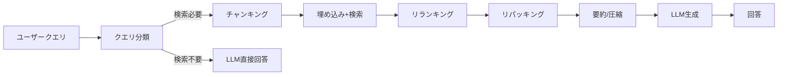

本記事は [Searching for Best Practices in Retrieval-Augmented Generation](https://arxiv.org/abs/2407.01219)（Wang et al., 2024）の解説記事です。

## 論文概要（Abstract）

本論文は、Retrieval-Augmented Generation（RAG）パイプラインを構成する6つのモジュール（クエリ分類、チャンキング、埋め込みモデル、検索手法、リランキング、コンテキスト再配置）について、複数の戦略を体系的に比較評価した実証研究である。著者らは木構造探索フレームワークを導入し、全組み合わせの網羅的探索を回避しつつ、NQ・TriviaQA・HotpotQAなど複数のQAベンチマークで最適な構成を特定したと報告している。Naive RAGからの改善幅はNQで+13 EMポイント、HotpotQAで+13 F1ポイントに達する。

この記事は [Zenn記事: Semantic Kernel v1.41 Plugin設計とVector Store RAGパイプライン構築](https://zenn.dev/0h_n0/articles/5c20849a93d5a5) の深掘りです。Zenn記事ではSemantic KernelのPlugin機構とVector Store統合を扱っているが、本論文はその基盤となる「RAGパイプラインの各構成要素をどう選択すべきか」という設計判断の根拠を提供する。

## 情報源

- **arXiv ID**: 2407.01219
- **URL**: [https://arxiv.org/abs/2407.01219](https://arxiv.org/abs/2407.01219)
- **著者**: Xiaohua Wang, Zhenghua Wang, Tao Guo et al.（Fudan University, Tsinghua University）
- **発表年**: 2024
- **分野**: cs.CL, cs.IR

## 背景と動機（Background & Motivation）

RAGはLLMの幻覚を軽減し最新情報を統合する手法として広く採用されているが、パイプラインを構成する個々のモジュール（チャンキング戦略、埋め込みモデル、検索手法など）にはそれぞれ複数の選択肢が存在する。著者らは、これらの構成要素の選択がRAG全体の性能に与える影響が十分に理解されていないと指摘している。

従来の研究は個別のモジュール改善（例: より良い埋め込みモデルの開発）に集中しており、モジュール間の相互作用を考慮した最適組み合わせの探索は行われていなかった。本論文は、この問題に対して木構造探索フレームワークを導入し、実用的なベストプラクティスの特定を試みた研究である。

## 主要な貢献（Key Contributions）

著者らが主張する主要な貢献は以下の通りである：

- **体系的な比較フレームワーク**: RAGパイプラインを6つのモジュールに分解し、各モジュールの複数戦略を統一的なベンチマークで比較
- **木構造探索**: 全組み合わせのグリッドサーチを回避するビーム探索型のフレームワークを導入し、効率的に最適構成を特定
- **実用的な推奨構成**: コスト・品質のトレードオフを考慮した、プラクティショナー向けのベストプラクティスを具体的に提示

## 技術的詳細（Technical Details）

### RAGパイプラインのモジュール分解

著者らはRAGパイプラインを以下の6モジュールに分解し、各モジュールで複数の戦略を比較している。



### モジュール1: クエリ分類

すべてのクエリがRAGの恩恵を受けるわけではない。著者らは分類器を用いて、外部知識が必要なクエリのみ検索を実行する戦略を評価している。論文の実験では、この分類によりAPI呼び出しコストを25〜40%削減できたと報告されている。

### モジュール2: チャンキング戦略

| 戦略 | NQ EM | HotpotQA F1 |
|------|-------|-------------|
| 固定128トークン | 42.1 | 38.4 |
| 固定256トークン | 46.3 | 42.1 |
| 固定512トークン | 44.8 | 40.7 |
| 文ベース | 45.2 | 41.3 |
| セマンティック | 45.9 | 41.8 |
| **Small-to-big（256→親チャンク）** | **48.1** | **44.6** |

（論文Table 2より）

Small-to-big チャンキングは、256トークンの子チャンクで検索精度を確保し、LLMには親チャンク（段落全体）を渡すことでコンテキストの豊富さを維持する手法である。固定サイズチャンキングに対して一貫した改善が確認されている。

### モジュール3: 埋め込みモデル

| モデル | NQ Recall@5 | TriviaQA Recall@5 |
|--------|-------------|-------------------|
| BM25（ベースライン） | 62.3 | 71.4 |
| text-embedding-ada-002 | 74.2 | 80.1 |
| bge-large-en-v1.5 | 76.8 | 82.3 |
| UAE-Large-V1 | 77.4 | 83.0 |
| E5-mistral-7b-instruct | **79.6** | **85.2** |

（論文Table 1より）

E5-mistral-7b-instructが最高性能を達成するが、7Bパラメータモデルのため推論コストが高い。コスト・品質のバランスではbge-large-en-v1.5が推奨されている。

### モジュール4: 検索手法

著者らは3つの検索パラダイムを比較している。

$$
\text{RRF}(d) = \sum_{r \in R} \frac{1}{k + \text{rank}_r(d)}
$$

ここで、$d$はドキュメント、$R$は検索結果セットの集合、$\text{rank}_r(d)$は検索結果$r$における$d$の順位、$k$は定数（通常60）である。

| 手法 | NQ EM | HotpotQA F1 |
|------|-------|-------------|
| BM25のみ | 38.4 | 34.2 |
| Dense（bge-large） | 46.3 | 42.1 |
| **Hybrid（BM25 + bge-large, RRF）** | **48.9** | **44.8** |
| HyDE + Dense | 47.1 | 43.4 |

（論文Table 2より）

ハイブリッド検索（BM25 + Dense + Reciprocal Rank Fusion）が単体手法を一貫して上回っている。これはSemantic Kernelの`search_type="keyword_hybrid"`に相当する構成である。

### モジュール5: リランキング

初回検索のtop-50候補をリランカーで再スコアリングし、top-5をLLMに渡す構成が評価されている。

| リランカー | NQ EM | HotpotQA F1 |
|-----------|-------|-------------|
| なし（top-5 dense） | 46.3 | 42.1 |
| MonoT5 | 48.2 | 44.0 |
| bge-reranker-large | 49.1 | 45.3 |
| RankGPT（GPT-4） | **51.4** | **47.8** |

（論文Table 2より）

bge-reranker-largeがオープンソースでは最良の結果を示している。RankGPTはGPT-4を使用するためコストが高いが、最高の品質を達成する。

### モジュール6: コンテキスト再配置（リパッキング）

LLMはコンテキスト窓の中間部分の情報を見落とす傾向がある（Lost in the Middle問題、Liu et al., 2023）。著者らは3つの配置戦略を比較している。

| 戦略 | NQ EM | HotpotQA F1 |
|------|-------|-------------|
| オリジナル順（スコア降順） | 49.1 | 45.3 |
| 逆順 | 49.8 | 45.9 |
| **Sides（先頭+末尾に高関連度）** | **50.6** | **46.7** |

（論文Table 2より）

### 最終推奨構成

著者らが特定した最適構成は以下の通りである。

| コンポーネント | 推奨 |
|-------------|------|
| クエリ分類 | 分類器で検索要否を判定 |
| チャンキング | Small-to-big（256トークン子→段落親） |
| 埋め込み | bge-large-en-v1.5（バランス型） |
| 検索 | ハイブリッド（Dense + BM25, RRF融合） |
| top-k | 検索top-50 → リランクtop-5 |
| リランキング | bge-reranker-large |
| リパッキング | Sides配置 |
| 圧縮 | Recomp（長文チャンク時） |

## アルゴリズム

以下はSmall-to-bigチャンキングとハイブリッド検索を組み合わせた実装の擬似コードである。

```python
from dataclasses import dataclass


@dataclass
class Chunk:
    """検索用チャンクとその親チャンクの関係を保持"""
    child_text: str      # 256トークン（検索用）
    parent_text: str     # 段落全体（LLM入力用）
    doc_id: str
    chunk_id: int


def small_to_big_chunking(
    document: str, child_size: int = 256, overlap: int = 32,
) -> list[Chunk]:
    """Small-to-big方式でドキュメントをチャンク分割する

    Args:
        document: 入力ドキュメント全文
        child_size: 子チャンクのトークン数
        overlap: チャンク間のオーバーラップトークン数

    Returns:
        親チャンクと子チャンクのペアリスト
    """
    paragraphs = document.split("\n\n")
    chunks: list[Chunk] = []
    for para_idx, paragraph in enumerate(paragraphs):
        tokens = paragraph.split()
        for i in range(0, len(tokens), child_size - overlap):
            child_tokens = tokens[i : i + child_size]
            chunks.append(Chunk(
                child_text=" ".join(child_tokens),
                parent_text=paragraph,
                doc_id=f"doc-{para_idx}",
                chunk_id=len(chunks),
            ))
    return chunks


def hybrid_search_rrf(
    query_embedding: list[float],
    query_text: str,
    dense_results: list[tuple[str, float]],
    sparse_results: list[tuple[str, float]],
    k: int = 60,
    top_n: int = 50,
) -> list[str]:
    """Reciprocal Rank Fusionによるハイブリッド検索

    Args:
        query_embedding: クエリの埋め込みベクトル
        query_text: クエリテキスト（BM25用）
        dense_results: Dense検索結果（doc_id, score）
        sparse_results: BM25検索結果（doc_id, score）
        k: RRF定数（デフォルト60）
        top_n: 返却する上位件数

    Returns:
        融合後の上位ドキュメントIDリスト
    """
    rrf_scores: dict[str, float] = {}
    for rank, (doc_id, _) in enumerate(dense_results):
        rrf_scores[doc_id] = rrf_scores.get(doc_id, 0) + 1.0 / (k + rank + 1)
    for rank, (doc_id, _) in enumerate(sparse_results):
        rrf_scores[doc_id] = rrf_scores.get(doc_id, 0) + 1.0 / (k + rank + 1)
    sorted_docs = sorted(rrf_scores.items(), key=lambda x: x[1], reverse=True)
    return [doc_id for doc_id, _ in sorted_docs[:top_n]]
```

## 実装のポイント（Implementation）

この論文の知見をSemantic KernelベースのRAGパイプラインに適用する際の注意点を以下に示す。

1. **チャンクサイズの選定**: Semantic Kernelの`VectorStoreField`では`is_full_text_indexed=True`でBM25検索も有効化できる。子チャンク（256トークン）を検索用、親チャンクをデータフィールドとして保持する設計が有効
2. **ハイブリッド検索の活用**: `create_search_function`の`search_type="keyword_hybrid"`はまさに本論文が推奨するBM25+Dense融合に対応する
3. **リランカーの追加**: Semantic Kernel v1.41時点では組み込みリランカーはないため、bge-reranker-largeを別途呼び出すPlugin実装が必要
4. **top-50→top-5パイプライン**: 検索時にtop=50で取得し、リランキング後にtop-5に絞り込む二段構成が推奨される

## 実験結果（Results）

著者らは最終的なエンドツーエンド比較として以下の結果を報告している（論文Table 2より）。

| システム | NQ EM | HotpotQA F1 | TriviaQA EM |
|---------|-------|-------------|-------------|
| LLMのみ（検索なし） | 29.3 | 27.8 | 52.4 |
| Naive RAG（BM25 + リランクなし） | 38.4 | 34.2 | 58.1 |
| **最適構成（本論文）** | **52.0** | **47.8** | **71.3** |

Naive RAGから最適構成への改善は、NQで+13.6 EMポイント、HotpotQAで+13.6 F1ポイントである。この改善の内訳として、チャンキング改善が約+2ポイント、ハイブリッド検索が約+3ポイント、リランキングが約+3ポイント、リパッキングが約+1.5ポイント、圧縮が約+1.5ポイントと、各モジュールが段階的に寄与していることが確認されている。

## 実運用への応用（Practical Applications）

Semantic Kernelの`create_search_function`でRAGプラグインを自動生成する際、本論文の知見は以下のように適用できる。

**検索パイプラインの段階的改善**: InMemoryコネクタで基本構成を動作確認した後、Qdrant等の本番コネクタに切り替え、ハイブリッド検索→リランキング→リパッキングの順に段階的に追加する。本論文の結果から、各段階で+2〜3ポイントの改善が期待できる。

**コスト最適化**: クエリ分類（検索要否判定）の導入により、不要な検索・埋め込みAPI呼び出しを25〜40%削減できる。Semantic KernelのPlugin設計では、`@kernel_function`のDescriptionにクエリ種別の判断基準を記述することで、LLM側で検索の要否を判定させることも可能である。

**レイテンシ管理**: 論文の推奨構成ではリランキングがボトルネックになりうる。クロスエンコーダー（bge-reranker-large）のレイテンシは50件のリランクで100〜300ms程度であり、リアルタイム要件が厳しい場合はtop-kの削減（50→20）やモデルの軽量化を検討する必要がある。

## Production Deployment Guide

### AWS実装パターン（コスト最適化重視）

本論文の推奨RAGパイプライン（ハイブリッド検索 + リランキング + LLM生成）をAWS上で構築する場合の構成を示す。

**トラフィック量別の推奨構成**:

| 規模 | 月間リクエスト | 推奨構成 | 月額コスト | 主要サービス |
|------|--------------|---------|-----------|------------|
| **Small** | ~3,000 (100/日) | Serverless | $80-200 | Lambda + Bedrock + OpenSearch Serverless |
| **Medium** | ~30,000 (1,000/日) | Hybrid | $500-1,200 | ECS Fargate + OpenSearch + ElastiCache |
| **Large** | 300,000+ (10,000/日) | Container | $3,000-7,000 | EKS + OpenSearch + GPU reranker |

**Small構成の詳細**（月額$80-200）:
- **Lambda**: 1GB RAM, 60秒タイムアウト（$25/月）
- **Bedrock**: Claude 3.5 Haiku, Prompt Caching有効（$100/月）
- **OpenSearch Serverless**: ベクトル検索+BM25ハイブリッド（$50/月）
- **S3**: ドキュメント格納（$5/月）

**Medium構成の詳細**（月額$500-1,200）:
- **ECS Fargate**: bge-reranker-large推論用, 2vCPU/4GB（$150/月）
- **OpenSearch**: r6g.large.search × 2ノード（$300/月）
- **Bedrock**: Claude 3.5 Sonnet（$500/月）
- **ElastiCache Redis**: 埋め込みキャッシュ用（$50/月）

**コスト削減テクニック**:
- Bedrock Batch APIで非リアルタイム処理を50%削減
- OpenSearch Serverlessの自動スケールでアイドル時コストを最小化
- 埋め込みキャッシュ（ElastiCache）で同一クエリの再計算を防止
- クエリ分類によるAPI呼び出し25〜40%削減（論文の知見を直接適用）

**コスト試算の注意事項**: 上記は2026年3月時点のAWS ap-northeast-1（東京）リージョン料金に基づく概算値です。実際のコストはトラフィックパターン、リージョン、バースト使用量により変動します。最新料金は [AWS料金計算ツール](https://calculator.aws/) で確認してください。

### Terraformインフラコード

**Small構成（Serverless）: Lambda + Bedrock + OpenSearch Serverless**

```hcl
# --- OpenSearch Serverless（ハイブリッド検索） ---
resource "aws_opensearchserverless_collection" "rag_knowledge" {
  name = "rag-knowledge-base"
  type = "VECTORSEARCH"
}

resource "aws_opensearchserverless_security_policy" "encryption" {
  name = "rag-encryption"
  type = "encryption"
  policy = jsonencode({
    Rules = [{
      ResourceType = "collection"
      Resource      = ["collection/rag-knowledge-base"]
    }]
    AWSOwnedKey = true
  })
}

# --- IAMロール（最小権限） ---
resource "aws_iam_role" "lambda_rag" {
  name = "lambda-rag-pipeline-role"
  assume_role_policy = jsonencode({
    Version = "2012-10-17"
    Statement = [{
      Action = "sts:AssumeRole"
      Effect = "Allow"
      Principal = { Service = "lambda.amazonaws.com" }
    }]
  })
}

resource "aws_iam_role_policy" "rag_permissions" {
  role = aws_iam_role.lambda_rag.id
  policy = jsonencode({
    Version = "2012-10-17"
    Statement = [
      {
        Effect   = "Allow"
        Action   = ["bedrock:InvokeModel", "bedrock:InvokeModelWithResponseStream"]
        Resource = "arn:aws:bedrock:ap-northeast-1::foundation-model/anthropic.claude-3-5-haiku*"
      },
      {
        Effect   = "Allow"
        Action   = ["aoss:APIAccessAll"]
        Resource = aws_opensearchserverless_collection.rag_knowledge.arn
      }
    ]
  })
}

# --- Lambda関数 ---
resource "aws_lambda_function" "rag_handler" {
  filename      = "lambda.zip"
  function_name = "rag-hybrid-search-handler"
  role          = aws_iam_role.lambda_rag.arn
  handler       = "index.handler"
  runtime       = "python3.12"
  timeout       = 60
  memory_size   = 1024
  environment {
    variables = {
      OPENSEARCH_ENDPOINT = aws_opensearchserverless_collection.rag_knowledge.collection_endpoint
      BEDROCK_MODEL_ID    = "anthropic.claude-3-5-haiku-20241022-v1:0"
      SEARCH_TYPE         = "hybrid"
      RERANK_TOP_K        = "5"
      RETRIEVE_TOP_K      = "50"
    }
  }
}

# --- CloudWatchアラーム ---
resource "aws_cloudwatch_metric_alarm" "lambda_duration" {
  alarm_name          = "rag-lambda-duration-spike"
  comparison_operator = "GreaterThanThreshold"
  evaluation_periods  = 2
  metric_name         = "Duration"
  namespace           = "AWS/Lambda"
  period              = 300
  statistic           = "Average"
  threshold           = 30000
  alarm_description   = "RAGパイプラインのレイテンシ異常検知"
  dimensions = {
    FunctionName = aws_lambda_function.rag_handler.function_name
  }
}
```

**Large構成（Container）: EKS + OpenSearch + GPU Reranker**

```hcl
module "eks" {
  source          = "terraform-aws-modules/eks/aws"
  version         = "~> 20.0"
  cluster_name    = "rag-pipeline-cluster"
  cluster_version = "1.31"
  vpc_id          = module.vpc.vpc_id
  subnet_ids      = module.vpc.private_subnets
  cluster_endpoint_public_access = true
  enable_cluster_creator_admin_permissions = true
}

resource "kubectl_manifest" "karpenter_rag" {
  yaml_body = <<-YAML
    apiVersion: karpenter.sh/v1alpha5
    kind: Provisioner
    metadata:
      name: rag-reranker-gpu
    spec:
      requirements:
        - key: karpenter.sh/capacity-type
          operator: In
          values: ["spot"]
        - key: node.kubernetes.io/instance-type
          operator: In
          values: ["g5.xlarge", "g5.2xlarge"]
      limits:
        resources:
          cpu: "16"
          memory: "64Gi"
      ttlSecondsAfterEmpty: 60
  YAML
}

resource "aws_budgets_budget" "rag_monthly" {
  name         = "rag-pipeline-monthly"
  budget_type  = "COST"
  limit_amount = "7000"
  limit_unit   = "USD"
  time_unit    = "MONTHLY"
  notification {
    comparison_operator        = "GREATER_THAN"
    threshold                  = 80
    threshold_type             = "PERCENTAGE"
    notification_type          = "ACTUAL"
    subscriber_email_addresses = ["ops@example.com"]
  }
}
```

### 運用・監視設定

**CloudWatch Logs Insightsクエリ**:

```sql
-- RAGパイプライン各段階のレイテンシ分析
fields @timestamp, stage, duration_ms
| stats avg(duration_ms) as avg_ms, pct(duration_ms, 95) as p95_ms, pct(duration_ms, 99) as p99_ms by stage
| sort p95_ms desc

-- リランキング段階のボトルネック検出
fields @timestamp, rerank_duration_ms, rerank_input_count
| filter stage = "rerank"
| stats avg(rerank_duration_ms) as avg_rerank, max(rerank_duration_ms) as max_rerank by bin(5m)
```

**CloudWatchアラーム（Python）**:

```python
import boto3

cloudwatch = boto3.client('cloudwatch')

cloudwatch.put_metric_alarm(
    AlarmName='rag-rerank-latency-spike',
    ComparisonOperator='GreaterThanThreshold',
    EvaluationPeriods=2,
    MetricName='RerankDuration',
    Namespace='RAG/Pipeline',
    Period=300,
    Statistic='p95',
    Threshold=500,
    AlarmDescription='リランキングP95レイテンシが500msを超過',
    AlarmActions=['arn:aws:sns:ap-northeast-1:123456789:rag-alerts'],
)
```

**X-Rayトレーシング**:

```python
from aws_xray_sdk.core import xray_recorder, patch_all

patch_all()

@xray_recorder.capture('rag_pipeline')
def rag_query(query: str) -> str:
    xray_recorder.put_annotation('search_type', 'hybrid')

    with xray_recorder.in_subsegment('embedding'):
        embedding = embed(query)

    with xray_recorder.in_subsegment('hybrid_search'):
        candidates = hybrid_search(embedding, query, top_k=50)
        xray_recorder.put_metadata('candidate_count', len(candidates))

    with xray_recorder.in_subsegment('reranking'):
        top_docs = rerank(query, candidates, top_k=5)

    with xray_recorder.in_subsegment('generation'):
        answer = generate(query, top_docs)

    return answer
```

### コスト最適化チェックリスト

**アーキテクチャ選択**:
- [ ] ~100 req/日 → Lambda + OpenSearch Serverless（$80-200/月）
- [ ] ~1,000 req/日 → ECS Fargate + OpenSearch（$500-1,200/月）
- [ ] 10,000+ req/日 → EKS + GPU reranker（$3,000-7,000/月）

**リソース最適化**:
- [ ] OpenSearch Serverless: 自動スケールで低トラフィック時のコスト削減
- [ ] GPU reranker: Spot Instances活用で最大90%削減
- [ ] Lambda: メモリサイズ最適化（CloudWatch Insights分析）
- [ ] 埋め込みキャッシュ: 同一クエリの再計算防止
- [ ] リランカー: バッチ推論でスループット向上

**RAG固有の最適化**:
- [ ] クエリ分類: 検索不要なクエリをスキップ（25〜40%コスト削減）
- [ ] top-k調整: top-50→top-20でリランク負荷を60%削減
- [ ] チャンクサイズ: 256トークンで検索精度と処理量のバランス確保
- [ ] Prompt Caching: システムプロンプト固定で30〜90%削減
- [ ] Bedrock Batch API: 非リアルタイム処理で50%削減

**監視・アラート**:
- [ ] AWS Budgets: 月額予算設定（80%で警告）
- [ ] CloudWatch: パイプライン各段階のレイテンシ監視
- [ ] Cost Anomaly Detection: 自動異常検知
- [ ] 日次コストレポート: SNS/Slackへ自動送信

**リソース管理**:
- [ ] 未使用インデックス削除
- [ ] タグ戦略: 環境別コスト可視化
- [ ] OpenSearchスナップショット: 自動ライフサイクル管理
- [ ] 開発環境: 夜間のOpenSearchインスタンス停止

## 関連研究（Related Work）

- **Self-RAG**（Asai et al., 2023）: LLMが検索の必要性を自己判断する手法。本論文のクエリ分類モジュールと関連するが、Self-RAGはLLM内部で判断するのに対し、本論文は外部分類器を使用する
- **RAPTOR**（Sarthi et al., 2024）: ドキュメントの階層的要約による多段検索。本論文のSmall-to-bigチャンキングと補完的な関係にある
- **Lost in the Middle**（Liu et al., 2023）: LLMがコンテキスト中間部を見落とす現象の分析。本論文のリパッキング戦略（Sides配置）の理論的根拠を提供する

## まとめと今後の展望

本論文は、RAGパイプラインの各構成要素を体系的に比較し、Small-to-bigチャンキング + ハイブリッド検索（RRF）+ bge-reranker-large + Sides配置という具体的な推奨構成を示した。Naive RAGから最適構成への改善幅はNQで+13 EMポイントに達し、各モジュールが段階的に寄与していることが定量的に示されている。

Semantic KernelでRAGパイプラインを構築する際は、`create_search_function`の`search_type`にハイブリッド検索を指定し、リランキングPluginを追加することで、本論文の推奨構成に近い実装が可能である。ただし、著者ら自身が指摘しているように、これらの結果は英語QAベンチマーク中心であり、日本語や専門ドメインでは追加の検証が必要である。

## 参考文献

- **arXiv**: [https://arxiv.org/abs/2407.01219](https://arxiv.org/abs/2407.01219)
- **Related Zenn article**: [https://zenn.dev/0h_n0/articles/5c20849a93d5a5](https://zenn.dev/0h_n0/articles/5c20849a93d5a5)
- **bge-large-en-v1.5**: [https://huggingface.co/BAAI/bge-large-en-v1.5](https://huggingface.co/BAAI/bge-large-en-v1.5)
- **bge-reranker-large**: [https://huggingface.co/BAAI/bge-reranker-large](https://huggingface.co/BAAI/bge-reranker-large)
