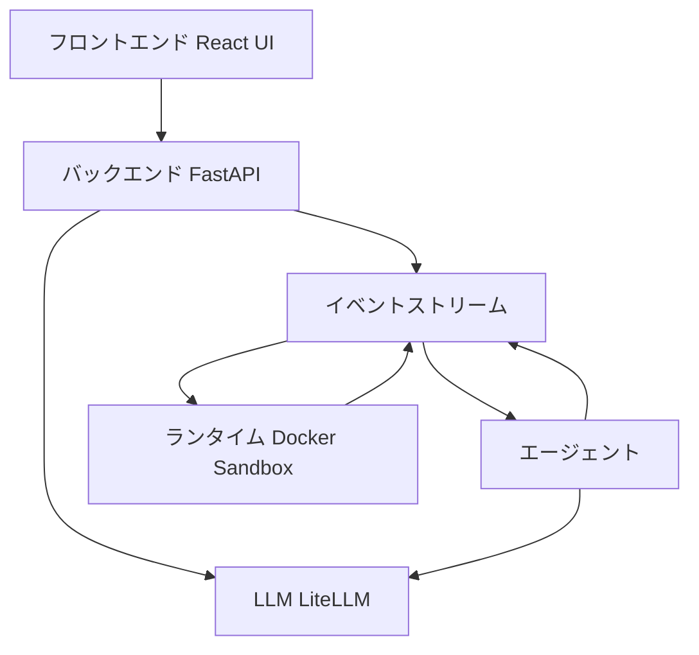

本記事は [OpenHands: An Open Platform for AI Software Agents](https://arxiv.org/abs/2407.16741) の解説記事です。

## 論文概要（Abstract）

OpenHands（旧OpenDevin）は、AIソフトウェアエージェントの開発・研究・評価を統一するオープンソースプラットフォームです。著者らは、人間の開発者と同等の操作——コード記述、ターミナル実行、Webブラウジング、API呼び出し——を可能にするエージェント基盤を提供しています。Dockerベースのサンドボックス環境、対話型UI、ヘッドレスモード、マルチエージェントフレームワークを備え、SWE-bench VerifiedでClaude 3.5 Sonnet使用時に38%の解決率を達成したと報告されています（2024年時点）。GitHub Star 40,000以上を獲得し、AIコーディングエージェント分野で最も活発なOSSプロジェクトの一つです。

この記事は [Zenn記事: Claude CodeでAI拡張開発を実現する6層アーキテクチャ実践ガイド](https://zenn.dev/0h_n0/articles/aa25c4b338d464) の深掘りです。

## 情報源

- **arXiv ID**: 2407.16741
- **URL**: [https://arxiv.org/abs/2407.16741](https://arxiv.org/abs/2407.16741)
- **著者**: Xingyao Wang, Boxuan Li, Yufan Song, Frank F. Xu et al.（イリノイ大学アーバナシャンペーン校, カーネギーメロン大学 他）
- **発表年**: 2024（2025年に大幅更新）
- **分野**: cs.SE, cs.AI, cs.CL

## 背景と動機（Background & Motivation）

2024年以降、LLMベースのコーディングエージェント研究は急速に進展しましたが、各研究グループが独自のフレームワークで実装・評価を行っており、再現性や比較可能性に課題がありました。

著者らはこの問題に対し、以下の3つの要件を満たす統一プラットフォームの必要性を指摘しています。

1. **安全なコード実行環境**: エージェントが生成したコードを安全に実行できるサンドボックス
2. **統一されたエージェントインターフェース**: 異なるエージェント実装を共通のAPIで抽象化
3. **再現可能な評価基盤**: SWE-benchなどのベンチマークを標準化された環境で実行

この動機は、Claude Codeがターミナルエージェントとしてファイル操作・コマンド実行・テスト実行を一体化している設計思想と共通しています。

## 主要な貢献（Key Contributions）

- **統一プラットフォーム**: エージェント開発・評価・デプロイを一つのフレームワークで提供
- **Dockerサンドボックス**: 安全なコード実行環境をコンテナベースで実現
- **CodeActエージェント**: 実行可能なPythonコードをアクション空間として使用するエージェント実装
- **イベントストリームアーキテクチャ**: エージェント・環境・UIの通信を統一するメッセージングシステム
- **包括的なベンチマーク統合**: SWE-bench、HumanEval、GPQA等の評価タスクを標準化

## 技術的詳細（Technical Details）

### アーキテクチャ概要

OpenHandsのアーキテクチャは3つの主要コンポーネントから構成されています。



**フロントエンド**: React + TypeScriptで実装されたWeb UI。エージェントの動作をリアルタイムで可視化し、人間が介入するためのインターフェースを提供します。

**バックエンド**: FastAPIで実装されたサーバー。イベントの管理、LLMの呼び出し、Dockerコンテナの管理を行います。

**イベントストリーム**: すべての通信はイベントとして統一管理されます。

### イベントストリームアーキテクチャ

OpenHandsの中核はイベントストリームです。エージェントのアクション、環境の観測、ユーザーの介入がすべて統一されたイベントとして管理されます。

```python
from dataclasses import dataclass
from enum import Enum

class EventType(Enum):
    """OpenHandsのイベント型"""
    ACTION = "action"           # エージェントのアクション
    OBSERVATION = "observation" # 環境からの観測
    MESSAGE = "message"         # ユーザーメッセージ

@dataclass
class Action:
    """エージェントが実行するアクション

    Attributes:
        action_type: アクションの種類（run, edit, browse等）
        args: アクション固有の引数
        thought: エージェントの思考プロセス
    """
    action_type: str
    args: dict
    thought: str = ""

@dataclass
class Observation:
    """環境から返される観測

    Attributes:
        obs_type: 観測の種類（command_output, file_content等）
        content: 観測の内容
        exit_code: コマンド実行時の終了コード
    """
    obs_type: str
    content: str
    exit_code: int = 0
```

イベントストリームの設計は、Claude Codeの**Hooks（Layer 2）のライフサイクルイベント**と類似しています。Claude Codeが24のライフサイクルイベント（PreToolUse、PostToolUse等）を定義しているように、OpenHandsもアクションと観測をイベントとして統一管理しています。

### CodeActエージェント

OpenHandsのデフォルトエージェント実装であるCodeActは、LLMが生成するアクションを**実行可能なPythonコード**として表現します。従来のJSONベースのアクション定義と比較して、以下の利点があります。

1. **表現力の高さ**: Pythonの制御構造（ループ、条件分岐）を直接使用可能
2. **LLMとの親和性**: LLMはPythonコードの生成に長けている
3. **拡張性**: 新しいアクションをPython関数として追加可能

CodeActのアクション空間は以下の関数で構成されます。

| 関数 | 機能 | Claude Code対応 |
|---|---|---|
| `run(command)` | シェルコマンド実行 | Bashツール |
| `edit(file, start, end, content)` | ファイル編集 | Editツール |
| `read(file)` | ファイル読み取り | Readツール |
| `browse(url)` | Webページ閲覧 | WebFetchツール |
| `search(pattern, path)` | コード検索 | Grepツール |

この対応関係は偶然ではありません。LLMベースのコーディングエージェントが必要とする基本操作は、どのプラットフォームでも共通しており、「ファイル読み取り」「ファイル編集」「コマンド実行」「検索」が4つの柱です。

### Dockerサンドボックス

OpenHandsは各エージェントセッションを独立したDockerコンテナ内で実行します。

$$
\text{Security} = \text{Isolation}(\text{filesystem}) \cap \text{Isolation}(\text{network}) \cap \text{Isolation}(\text{process})
$$

- **ファイルシステム分離**: エージェントはコンテナ内のファイルシステムのみにアクセス可能。ホストのファイルには直接アクセスできない
- **ネットワーク分離**: デフォルトではインターネットアクセスが制限される（設定で変更可能）
- **プロセス分離**: エージェントが起動するプロセスはコンテナ内に閉じ込められる

この設計は、Claude Codeの**サンドボックス機構**と同じ課題——「エージェントに自律的なコード実行を許可しつつ、セキュリティを確保する」——に対する解決策です。Anthropicの公式ブログ「making Claude Code more secure and autonomous」では、ファイルシステムとネットワークの制御を自動で行うサンドボックスアーキテクチャが紹介されており、OpenHandsのDockerベースのアプローチと設計思想を共有しています。

## 実装のポイント（Implementation）

**LLM統合（LiteLLM）**: OpenHandsはLiteLLMライブラリを介して100以上のLLMプロバイダーに対応しています。GPT-4、Claude 3.5 Sonnet、Llama 3、Geminiなどを統一インターフェースで切り替え可能です。

**状態管理**: 各セッションの状態（ファイルの変更履歴、コマンドの実行結果）はイベントストリームに記録されます。これによりセッションの再現が可能です。

**マルチエージェント対応**: OpenHandsはDelegateActionを通じてサブエージェントを起動する機構を持っています。メインエージェントが特定のタスクをサブエージェントに委譲し、結果を受け取ることができます。Claude Codeの**Subagents（Layer 4）**と同じ設計パターンです。

## 実験結果（Results）

### SWE-benchでの性能

著者らおよびコミュニティが報告している主要な結果です。

| エージェント | LLM | SWE-bench Verified |
|---|---|---|
| OpenHands-CodeAct | Claude 3.5 Sonnet | 38.0% |
| OpenHands-CodeAct | GPT-4o | 28.4% |
| OpenHands-CodeAct | Llama 3.1 70B | 15.2% |
| SWE-agent | GPT-4 | 23.7% |

OpenHands-CodeActがClaude 3.5 Sonnet使用時にSWE-agentを上回っている点は、**エージェントの「足場」（scaffolding）の設計がLLMの能力を引き出す重要な要素**であることを示しています。

### 他のベンチマーク

| ベンチマーク | スコア | 説明 |
|---|---|---|
| HumanEval | 85.4% | コード生成能力 |
| GPQA Diamond | 47.3% | 汎用質問応答 |
| WebArena | 22.1% | Web操作タスク |

## 実運用への応用（Practical Applications）

OpenHandsの設計は、Claude Codeの6層アーキテクチャの複数の層に対応しています。

**イベントストリーム ↔ Hooksシステム**: OpenHandsのイベントベースアーキテクチャは、Claude CodeのHooksが特定のライフサイクルイベント（PreToolUse、PostToolUse等）にフックする設計と構造が類似しています。

**CodeActのアクション空間 ↔ Claude Codeのツール**: CodeActの`run`、`edit`、`read`、`browse`、`search`は、Claude CodeのBash、Edit、Read、WebFetch、Grepツールと1対1で対応しています。

**Dockerサンドボックス ↔ Claude Codeのサンドボックス**: 両者ともにファイルシステムとネットワークの分離を通じて安全なコード実行を実現しています。

**DelegateAction ↔ Subagents**: OpenHandsのタスク委譲メカニズムは、Claude CodeのSubagents（Layer 4）と同じ設計パターンです。

**スケーラビリティの制約**: OpenHandsは単一Dockerホスト上で動作するため、複数エージェントの同時実行にはホストのリソース（CPU、メモリ）が制約となります。大規模なマルチエージェント構成には、Kubernetes等のオーケストレーション層が別途必要です。

## 関連研究（Related Work）

- **SWE-agent** (Yang et al., 2024): ACIの設計にフォーカスしたエージェント。OpenHandsとは補完関係にあり、SWE-agentをOpenHands上で動作させることも可能
- **Aider** (Gauthier, 2024): gitベースのAIペアプログラミングツール。OpenHandsよりもシンプルなインターフェースで、ファイル編集に特化
- **Devon** (2024): OpenHandsと同様のOSSエージェントプラットフォーム。OpenHandsの方がコミュニティ規模が大きい

## まとめと今後の展望

OpenHandsは、AIソフトウェアエージェントの研究・開発・評価を統一するプラットフォームとして、2026年現在でも活発に開発が続いています。イベントストリーム、Dockerサンドボックス、CodeActエージェントという3つの設計は、Claude Codeを含む現代のAIコーディングツールの設計に影響を与えています。

GitHub Star 40,000以上、月間SDKダウンロード数の急成長は、AIコーディングエージェントへの産業界の関心の高さを示しています。Claude Codeの6層アーキテクチャを理解する上で、OpenHandsのアーキテクチャを比較対象として参照することで、各設計判断の意図をより深く理解できます。

## 参考文献

- **arXiv**: [https://arxiv.org/abs/2407.16741](https://arxiv.org/abs/2407.16741)
- **Code**: [https://github.com/All-Hands-AI/OpenHands](https://github.com/All-Hands-AI/OpenHands)
- **Related Zenn article**: [https://zenn.dev/0h_n0/articles/aa25c4b338d464](https://zenn.dev/0h_n0/articles/aa25c4b338d464)
