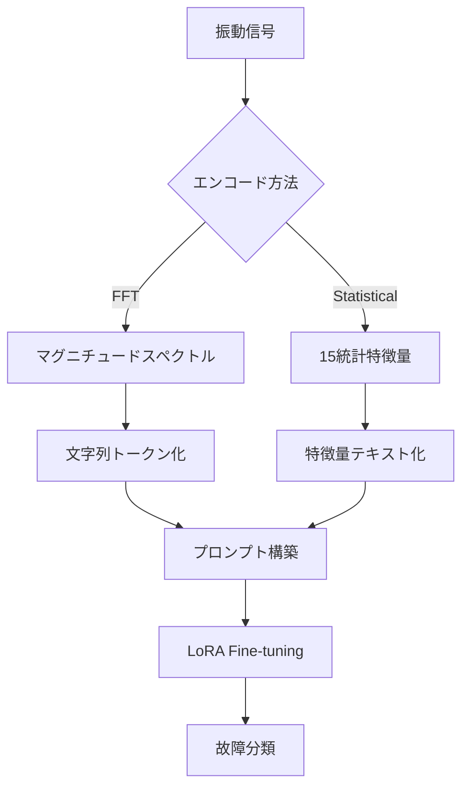

本記事は [FD-LLM: Large Language Model for Fault Diagnosis of Machines](https://arxiv.org/abs/2412.01218)（Qaid et al., 2024）の解説記事です。

## 論文概要（Abstract）

本論文は、産業機械の振動センサーデータからの故障診断にLLMを適用するフレームワーク「FD-LLM」を提案した研究である。著者らは、振動信号をFFT（高速フーリエ変換）に基づくスペクトル表現と統計的特徴量の2つの方法でエンコードし、LoRAによるfine-tuningでLLMを故障分類タスクに適応させた。CWRUベアリングデータセットにおいて、Llama3-instructがFFTデータで99.8%の精度を達成し、従来のCNN手法（WDCNN: 99.28%）を上回ったと報告している。

この記事は [Zenn記事: Microsoft Agent Frameworkで故障診断マルチエージェントを構築し診断精度を向上させる](https://zenn.dev/0h_n0/articles/c52d51ec4c11b9) の深掘りです。Zenn記事ではin-context learningベースの故障診断を扱っているが、本論文はfine-tuningベースのアプローチとして、データ前処理手法の知見が共通する。

## 情報源

- **arXiv ID**: 2412.01218
- **URL**: [https://arxiv.org/abs/2412.01218](https://arxiv.org/abs/2412.01218)
- **著者**: Hamzah A.A.M. Qaid, Bo Zhang, Dan Li, See-Kiong Ng, Wei Li（China University of Mining and Technology, Sun Yat-Sen University, National University of Singapore）
- **発表年**: 2024
- **分野**: cs.AI, cs.LG

## 背景と動機（Background & Motivation）

産業機械の故障診断では、振動センサーから取得した時系列データの解析が標準的手法となっている。従来はCNNやRNNベースの深層学習モデルが用いられてきたが、これらのモデルは故障タイプごとのラベル付きデータが大量に必要であり、運転条件（負荷、回転速度）の変化や機械部品の違いに対する汎化性能が課題であった。

LLMは大規模コーパスでの事前学習により広範な知識を獲得しているが、数値時系列データの直接入力には適していない。著者らは、振動データを適切にエンコードしてLLMに入力可能な形式に変換することで、LLMの言語理解能力を故障診断に活用できると仮説を立てた。

## 主要な貢献（Key Contributions）

著者らが主張する主要な貢献は以下の通りである：

- **2種類のデータエンコード手法の提案**: FFTベースのスペクトル表現と統計的特徴量抽出の両方を体系的に評価
- **LoRAによる効率的なfine-tuning**: 重みの全更新ではなく低ランク分解による効率的な適応を実現
- **運転条件横断の汎化性能を実証**: 異なる負荷条件でも高い精度を維持することを示した
- **機械仕様のプロンプト統合**: 設備情報（負荷、回転速度）をプロンプトに含めることで、統計データの性能を11-20ポイント改善

## 技術的詳細（Technical Details）

### データ前処理: FFTベース手法

振動信号 $x(t)$ を長さ $K$ のウィンドウでセグメント化し、各セグメントにFFTを適用する：

$$
X(f) = \sum_{n=0}^{N-1} x(n) e^{-j2\pi fn/N}
$$

ここで、
- $x(n)$: 時刻 $n$ の振動信号値
- $X(f)$: 周波数 $f$ のスペクトル成分
- $N$: セグメント長

FFTマグニチュードスペクトルを正規化し、文字列トークンに変換してLLMに入力する。

### データ前処理: 統計的特徴量

時間領域と周波数領域から計15種類の特徴量を抽出する：

**時間領域（10指標）**:
- 平均値、RMS（二乗平均平方根）、標準偏差、クレストファクタ
- 歪度、形状係数、尖度、ピークtoピーク、エネルギー係数、インパルス係数

**周波数領域（5指標）**:
- ピーク周波数、ピークtoピーク周波数、スペクトル尖度、スペクトル帯域幅、スペクトル歪度



### LoRA Fine-tuning

重み更新を低ランク分解で近似する：

$$
W' = W + \Delta W = W + AB^T
$$

ここで、
- $W \in \mathbb{R}^{H \times H}$: 元の重み行列（凍結）
- $A \in \mathbb{R}^{H \times R}$, $B \in \mathbb{R}^{H \times R}$: 学習対象の低ランク行列
- $R \ll H$: ランク（$R=8$ が典型的）

これにより、全パラメータの更新に比べて学習パラメータ数を大幅に削減しつつ、タスク固有の適応が可能となる。

### プロンプト構成

プロンプトは3要素で構成される：

```
Instruction: 「以下のベアリングデータから故障タイプを分類してください。
              設備: {equipment_type}, 負荷: {load_hp}HP, 回転速度: {rpm}RPM」
Input:       「[エンコードされた振動データ]」
Output:      「{故障タイプラベル}」
```

## 実験結果（Results）

### CWRUデータセット

Case Western Reserve University（CWRU）ベアリングデータセットを使用。電食加工により内輪、外輪、転動体に0.007/0.014/0.021インチの欠陥を人為的に作成。サンプリングレート12KHz、0-3HP負荷、1730-1797RPM。

### FFTデータでの故障診断精度（論文Table結果より）

| モデル | Accuracy | F1スコア |
|--------|----------|---------|
| **Llama3-instruct** | **0.998** | **0.998** |
| Llama3 | 0.997 | 0.997 |
| WDCNN (CNN) | 0.993 | 0.991 |
| Qwen1.5-7B | 0.762 | 0.756 |

Llama3-instructがWDCNN（1D CNN）を上回り、99.8%の精度を達成した。一方、Qwen1.5-7Bは76.2%と大幅に低い精度であり、著者らはこれをLlama3の事前学習における数値トークン化の違いに起因すると分析している。

### 統計データでの故障診断精度

| モデル | Accuracy | F1スコア |
|--------|----------|---------|
| SVM | 0.974 | 0.974 |
| Llama3-instruct | 0.952 | 0.952 |
| Llama3 | 0.948 | 0.940 |

統計データではSVMが最高精度を達成し、LLMは若干下回った。ただし、機械仕様なしでは74.67%であったのに対し、プロンプトに負荷と回転速度を含めることで94.80%まで改善しており（+20ポイント）、コンテキスト情報の統合が重要であることが示された。

### 運転条件横断の汎化性能（論文Table結果より）

| 訓練条件 → テスト条件 | Llama3-instruct | WDCNN |
|---------------------|-----------------|-------|
| 0HP → 0HP (同条件) | 1.000 | 0.999 |
| 0HP → 1HP (異条件) | 0.998 | 0.927 |
| 0HP → 2HP (異条件) | 0.965 | 0.912 |
| 0HP → 3HP (異条件) | 0.965 | 0.848 |

LLMは異なる運転条件への汎化性能が高く、特に負荷差が大きい場合（0HP→3HP）でWDCNNより11.7ポイント高い精度を維持した。

### 機械部品間の汎化（Drive End → Fan End）

全モデルで精度が大幅に低下し、Llama3-instructでもFan Endへの転移で52.9%まで低下した。著者らは「異なる機械部品間の汎化は依然として未解決の課題」と指摘している。

## 実装のポイント（Implementation）

- **モデル選択**: Llama3系列が数値データ処理で優位。Qwenは数値トークン化の違いにより精度が低い
- **FFT vs 統計データ**: FFTデータの方が高精度だが、トークン数が多い。コスト制約がある場合は統計データ+機械仕様が現実的
- **機械仕様の統合**: 負荷、回転速度などの運転条件をプロンプトに含めることで統計データの精度が約20ポイント改善
- **Zenn記事との対応**: Zenn記事の`compute_sensor_stats`関数は本論文の統計的特徴量抽出の簡易版。15指標ではなく、min/max/mean/std/median/percentile/trendの7指標を使用しているが、同様のアプローチ

## 実運用への応用（Practical Applications）

本論文のfine-tuningアプローチとZenn記事のin-context learningアプローチは、以下のように使い分けが可能：

| 観点 | FD-LLM (fine-tuning) | Zenn記事 (in-context) |
|------|-------------------|--------------------|
| 精度 | 高い（99.8%） | 中程度（F1: 0.84） |
| データ要件 | ラベル付きデータが必要 | SOPと閾値のみ |
| 汎化性能 | 学習済み条件で高い | 柔軟だがLLM依存 |
| コスト | 初期学習コスト高い | 推論時コストが高い |
| 適用場面 | 繰り返し同じ設備の診断 | 多様な設備の診断 |

実運用では、高頻度で同じ設備を監視する場合はfine-tuning、多種多様な設備に対応する場合はin-context learningが適している。ハイブリッド構成（fine-tuningモデルで1次スクリーニング → マルチエージェントで詳細診断）も有効である。

## 関連研究（Related Work）

- **WDCNN**（Zhang et al., 2017）: 1D CNNベースの故障診断手法。本論文のベースライン。CNNと異なりLLMは運転条件変化への汎化性能が高い
- **Exploring LLM-based Frameworks for Fault Diagnosis**（Lee et al., 2025）: in-context learningベースの故障診断。本論文とはアプローチ（fine-tuning vs in-context）が異なるが、データ前処理の重要性は共通
- **Transformer-based Bearing Fault Diagnosis**（各種, 2023-2024）: Transformerアーキテクチャの振動データ直接入力。本論文はLLMの事前学習知識を活用する点で差別化

## まとめと今後の展望

FD-LLMは、振動データのFFT変換とLoRA fine-tuningを組み合わせることで、従来のCNN手法を上回る故障診断精度を実現した。特に運転条件横断の汎化性能は実運用において重要な利点である。一方、機械部品間の汎化は未解決の課題であり、著者らはChain-of-Thoughtプロンプティングやprocess-supervised reward modelによる推論能力の強化を今後の方向性として示している。

## 参考文献

- **arXiv**: [https://arxiv.org/abs/2412.01218](https://arxiv.org/abs/2412.01218)
- **Journal**: Advanced Engineering Informatics, Vol. 65 (2025)
- **Related Zenn article**: [https://zenn.dev/0h_n0/articles/c52d51ec4c11b9](https://zenn.dev/0h_n0/articles/c52d51ec4c11b9)
