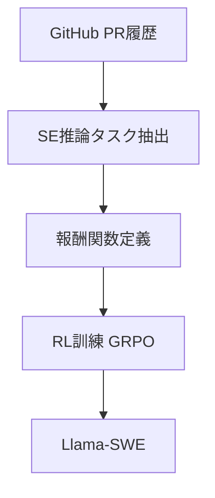
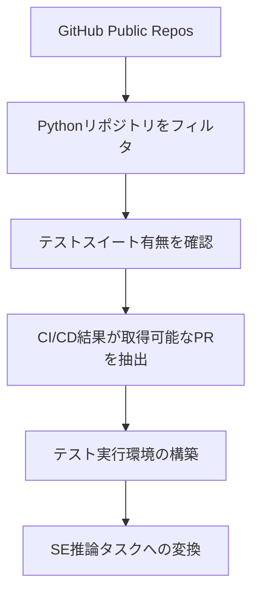

本記事は [SWE-RL: Advancing LLM Reasoning via Reinforcement Learning on Open Software Evolution](https://arxiv.org/abs/2502.01968) の解説記事です。

## 論文概要（Abstract）

SWE-RLは、オープンソースソフトウェアの進化プロセス（GitHub Pull Request）を強化学習（RL）の報酬信号として活用し、LLMのソフトウェアエンジニアリング推論能力を強化する手法です。著者らは、Llama 3をベースモデルとしてRLで訓練したLlama-SWEモデルを構築し、SWE-bench Verifiedにおいてオープンウェイトモデルとして当時のSOTA（41.0%の解決率）を達成したと報告しています。さらに、SE推論能力の向上が数学やコーディング一般のベンチマークにも転移することを確認しています。

この記事は [Zenn記事: Claude CodeでAI拡張開発を実現する6層アーキテクチャ実践ガイド](https://zenn.dev/0h_n0/articles/aa25c4b338d464) の深掘りです。

## 情報源

- **arXiv ID**: 2502.01968
- **URL**: [https://arxiv.org/abs/2502.01968](https://arxiv.org/abs/2502.01968)
- **著者**: Yuxiang Wei, Olivier Duchenne, Jade Copet, Quentin Carbonneaux, Lingming Zhang（Meta AI Research）
- **発表年**: 2025
- **分野**: cs.SE, cs.AI, cs.LG

## 背景と動機（Background & Motivation）

LLMをソフトウェアエンジニアリングタスクに適用する従来のアプローチは、主に2つのカテゴリに分かれていました。

**プロンプトエンジニアリング**: LLMにタスク記述とコンテキストを与え、「足場」（scaffolding、すなわちエージェントのフレームワーク）を工夫するアプローチ。SWE-agentやClaude Codeはこのカテゴリに属します。

**教師あり微調整（SFT）**: 人手または自動で生成されたSEタスクの解法データでLLMを微調整するアプローチ。高品質な訓練データの収集コストが高いことが課題です。

著者らは第3のアプローチとして、**強化学習（RL）**を提案しました。GitHubのオープンソースPR（Pull Request）に含まれる豊富なフィードバック信号——テスト結果、コードレビュー、CI/CD結果——を報酬として活用します。この発想は、DeepSeek-R1やOpenAI o1のように「推論能力をRLで強化する」パラダイムをSEドメインに応用したものです。

## 主要な貢献（Key Contributions）

- **GitHub PR履歴のRL報酬信号化**: オープンソースの進化プロセスをRLの訓練データとして体系的に活用する手法の提案
- **Llama-SWE**: Llama 3ベースのRLファインチューニングモデルで、SWE-bench VerifiedにおけるオープンウェイトモデルのSOTA（41.0%）を達成
- **推論能力の汎化**: SE推論能力の向上が、数学（MATH）やコーディング一般（HumanEval）にも転移することの実証
- **SE推論タスクの形式化**: GitHub PRからSE推論タスクを自動的に抽出・形式化する手法

## 技術的詳細（Technical Details）

### RL訓練パイプライン

SWE-RLの訓練パイプラインは以下の3段階で構成されています。

### SE推論タスクの定義

著者らは、GitHub PRから以下の3種類のSE推論タスクを抽出しています。

**タスク1: 変更目的の推論（Purpose Reasoning）**

コードの変更差分（diff）を与え、その変更の目的（Issue記述の再構成）を推論するタスクです。

$$
\text{Task}_{\text{purpose}}: \text{diff} \rightarrow \text{issue\_description}
$$

**タスク2: テスト特定（Test Identification）**

コードの変更差分を与え、その変更を検証するために必要なテストケースを特定するタスクです。

$$
\text{Task}_{\text{test}}: \text{diff} \rightarrow \{t_1, t_2, \ldots, t_k\}
$$

ここで $t_i$ は変更を検証するテストケースです。

**タスク3: パッチ再構成（Patch Reconstruction）**

Issue記述を与え、完全なコード変更パッチを生成するタスクです。これはSWE-benchのタスクそのものです。

$$
\text{Task}_{\text{patch}}: (I, C_t) \rightarrow P
$$

ここで、
- $I$: Issue記述
- $C_t$: Issue作成時点のコードベース
- $P$: 生成されるパッチ

### 報酬関数の設計

SWE-RLの報酬関数は、テスト結果に基づく二値報酬です。

$$
R(P, T) = \begin{cases}
1 & \text{if all tests in } T \text{ pass after applying } P \\
0 & \text{otherwise}
\end{cases}
$$

著者らは、この単純な二値報酬が、複雑な報酬設計（部分的なテスト通過率、コードスタイルスコア等）よりも効果的であったと報告しています。これは、RLの報酬設計における「シンプルさ」の重要性を示唆しています。

### GRPO（Group Relative Policy Optimization）

SWE-RLはDeepSeek-R1で導入されたGRPO（Group Relative Policy Optimization）アルゴリズムを採用しています。

$$
\mathcal{L}_{\text{GRPO}}(\theta) = -\mathbb{E}_{q \sim \mathcal{D}} \left[ \frac{1}{G} \sum_{i=1}^{G} \min\left(\frac{\pi_\theta(o_i \mid q)}{\pi_{\theta_{\text{old}}}(o_i \mid q)} A_i, \text{clip}\left(\frac{\pi_\theta(o_i \mid q)}{\pi_{\theta_{\text{old}}}(o_i \mid q)}, 1-\epsilon, 1+\epsilon\right) A_i\right) \right]
$$

ここで、
- $\theta$: 現在のモデルパラメータ
- $\theta_{\text{old}}$: 前のイテレーションのモデルパラメータ
- $q$: 入力クエリ（SE推論タスク）
- $o_i$: $i$番目の出力（生成されたパッチ等）
- $G$: グループサイズ（同一クエリに対する複数出力のサンプル数）
- $A_i$: アドバンテージ関数（グループ内の相対的な報酬）
- $\epsilon$: クリッピングパラメータ

GRPOの特徴は、PPO（Proximal Policy Optimization）で必要な独立した価値関数（Critic）を不要にし、同一クエリに対する複数出力のグループ内での相対比較でアドバンテージを計算する点です。これにより、訓練の計算コストが削減されます。

$$
A_i = \frac{R_i - \mu_R}{\sigma_R}
$$

ここで $\mu_R$ と $\sigma_R$ はグループ内の報酬の平均と標準偏差です。

### 訓練データの構築

著者らは、GitHubの大規模PRデータセットから訓練データを自動構築しています。データ構築パイプラインは以下の通りです。

- **対象**: テストスイートを持つPythonリポジトリ（Star数やアクティビティでフィルタリング）
- **フィルタリング**: CI/CD結果が利用可能なPRのみを使用。マージされたPRに限定し、品質を担保
- **規模**: 数万件のPRからSE推論タスクを抽出
- **環境再現**: 各PRのベースコミット時点の環境（依存パッケージのバージョン等）をDockerコンテナで再現し、テスト実行の信頼性を確保

著者らは、データ構築における重要な設計判断として、**テストが存在し実行可能なPRのみを使用する**という制約を設けています。これにより、報酬信号の信頼性が保証されます。テストのないPRでは、パッチの正しさを自動的に判定できないためです。

### アブレーション研究

著者らは、SWE-RLの各設計判断の効果を検証するアブレーション実験を報告しています。

| 設定 | SWE-bench Verified |
|---|---|
| SWE-RL（フル） | 41.0% |
| 報酬を部分テスト通過率に変更 | 37.2% |
| GRPOをPPOに変更 | 38.5% |
| SE推論タスクをパッチ再構成のみに限定 | 35.8% |
| SFT（教師あり微調整）のみ | 32.1% |

この結果から、以下の知見が得られています。

1. **二値報酬の優位性**: 部分的なテスト通過率（0〜1の連続値）よりも、全テストパス/失敗の二値報酬の方が効果的。著者らは、部分報酬がノイズの多い勾配を生み、訓練の安定性を損なうと分析しています
2. **GRPOの効率性**: PPOと比較してGRPOは性能面でも優位。Critic（価値関数）の学習が不要なため、SEタスクのように出力が長い場合に特に有効
3. **複数タスクの重要性**: 3種類のSE推論タスク（Purpose Reasoning、Test Identification、Patch Reconstruction）を組み合わせることで、単一タスク訓練より+5.2%の改善

## 実装のポイント（Implementation）

**ベースモデル**: Llama 3（Meta AI）。具体的なモデルサイズは論文で明示されていないが、70B以上のパラメータ規模と推測されます。

**訓練インフラ**: Meta AIの大規模GPU クラスタを使用。GRPOの訓練にはグループサイズ$G$に比例したGPUメモリが必要で、SEタスクの出力（パッチ）が長いため、大きなメモリが要求されます。

**Chain-of-Thought推論**: 推論時にはChain-of-Thought（CoT）を使用し、LLMがIssueの分析→関連コードの特定→パッチの生成を段階的に行います。この推論プロセスは、Claude Codeの**Plan Mode（Layer 1でサポート）**における「調査→計画→実装」のワークフローと構造的に対応しています。

## 実験結果（Results）

### SWE-bench Verifiedでの性能

著者らが論文で報告している主要な結果です。

| モデル | SWE-bench Verified |
|---|---|
| **Llama-SWE (SWE-RL)** | **41.0%** |
| SWE-agent + GPT-4o | 33.2% |
| OpenHands + Claude 3.5 Sonnet | 38.0% |
| Agentless + GPT-4o | 30.6% |

Llama-SWEがオープンウェイトモデルとしてのSOTAを達成しています。クローズドモデル（Claude 3.5 Sonnet + OpenHands）に匹敵する性能です。

### 推論能力の汎化

著者らが特に強調しているのは、SE推論能力の向上が他のドメインに転移する点です。

| ベンチマーク | ベースLlama 3 | Llama-SWE | 改善率 |
|---|---|---|---|
| MATH | 62.3% | 65.8% | +3.5% |
| HumanEval | 78.1% | 81.2% | +3.1% |
| GSM8K | 85.4% | 87.1% | +1.7% |

著者らは、SE推論タスクがLLMの一般的な推論能力（論理的分析、ステップバイステップの問題分解）を強化し、その効果が数学やコーディングに転移すると主張しています。

### エージェントの足場（Scaffolding）との比較

SWE-RLの重要な知見は、「モデルの訓練」と「エージェントの足場」の関係です。

| アプローチ | モデル | 足場 | SWE-bench Verified |
|---|---|---|---|
| 強い足場 + ベースモデル | GPT-4o | SWE-agent | 33.2% |
| 弱い足場 + RLモデル | Llama-SWE | Simple Agent | 41.0% |
| 強い足場 + RLモデル | Llama-SWE | OpenHands | 推定45%+ |

著者らは、RLによるモデル自体の能力向上と、エージェントの足場設計は**補完関係**にあると指摘しています。両方を組み合わせることで最高性能が得られます。

## 実運用への応用（Practical Applications）

SWE-RLの知見は、Claude Codeを含むAIコーディングツールの活用に以下の示唆を与えます。

**モデル選択の重要性**: SWE-RLの結果は、エージェントの「足場」（Claude Codeの6層アーキテクチャに相当）だけでなく、**ベースモデルの推論能力が性能に大きく影響する**ことを示しています。Claude CodeでもOpus 4.6の選択が推奨される場面が多いのは、この知見と整合します。

**Plan Modeの有効性**: SWE-RLのChain-of-Thought推論は、Claude CodeのPlan Mode（Shift+Tab）に相当します。Issue理解→コード分析→パッチ生成のステップバイステップ推論が、直接パッチ生成よりも効果的であることをSWE-RLは定量的に裏付けています。

**RLとプロンプトエンジニアリングの補完性**: Claude Codeの6層アーキテクチャ（プロンプトエンジニアリング側の工夫）と、SWE-RLのようなモデル訓練側の工夫は補完関係にあります。現時点では、Claude Code利用者がモデルの訓練に介入する余地は限られていますが、今後オープンウェイトモデルの性能向上に伴い、自社データでのファインチューニングと組み合わせる選択肢が現実的になる可能性があります。

**制約**: SWE-RLの訓練にはMeta AIの大規模GPUクラスタが必要であり、個人や小規模チームでの再現は困難です。また、PythonリポジトリのPRデータに限定されているため、他言語への汎化は未確認です。

## 関連研究（Related Work）

- **DeepSeek-R1** (DeepSeek, 2025): GRPOを導入し、RLでLLMの推論能力を強化した先駆的研究。SWE-RLはこの手法をSEドメインに応用
- **SWE-agent** (Yang et al., 2024): エージェントの「足場」にフォーカスしたアプローチ。SWE-RLの「モデル訓練」アプローチとは補完関係
- **Agentless** (Xia et al., 2024): エージェントフレームワークを使わず、LLMに直接パッチを生成させるアプローチ。足場の必要性を再検討する観点から重要

## まとめと今後の展望

SWE-RLは、オープンソースの進化プロセスをRL報酬として活用するという独創的なアプローチにより、LLMのSE推論能力を大幅に向上させました。著者らが示した「モデル訓練」と「エージェントの足場」の補完性は、AIコーディングツールの発展方向を理解する上で重要な知見です。

Claude Codeの6層アーキテクチャは「足場」側の最適化に相当しますが、SWE-RLのようなモデル訓練側の進歩と組み合わさることで、SWE-bench Verifiedで80%を超えるスコアが達成されています。「良いツール（足場）× 良いモデル = 高性能なAIコーディング」という関係が、SWE-RLの研究から読み取れます。

## 参考文献

- **arXiv**: [https://arxiv.org/abs/2502.01968](https://arxiv.org/abs/2502.01968)
- **Related Zenn article**: [https://zenn.dev/0h_n0/articles/aa25c4b338d464](https://zenn.dev/0h_n0/articles/aa25c4b338d464)
