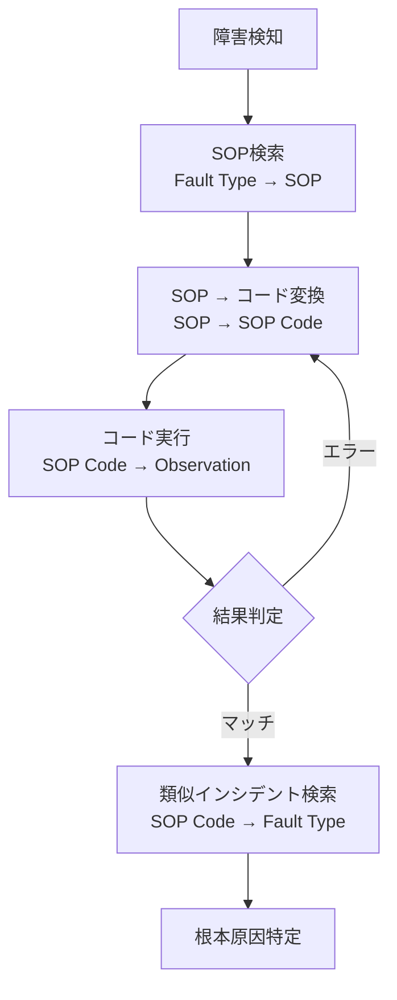

本記事は [Flow-of-Action: SOP Enhanced LLM-Based Multi-Agent System for Root Cause Analysis](https://arxiv.org/abs/2502.08224)（Pei et al., 2025）の解説記事です。

## 論文概要（Abstract）

本論文は、マイクロサービスアーキテクチャにおける障害の根本原因分析（RCA）に、標準作業手順書（SOP）をLLMエージェントに統合したマルチエージェントシステム「Flow-of-Action」を提案した研究である。著者らは、従来のReActフレームワークではLLMの幻覚により無関係なアクションが実行される問題を指摘し、SOPによる制約を導入することでRCA精度をReActの35.50%から64.01%へ向上させたと報告している。

この記事は [Zenn記事: Microsoft Agent Frameworkで故障診断マルチエージェントを構築し診断精度を向上させる](https://zenn.dev/0h_n0/articles/c52d51ec4c11b9) の深掘りです。Zenn記事ではSOPベースのプロンプト設計を推奨しているが、その根拠となる本論文の手法と実験結果を詳細に解説する。

## 情報源

- **会議名**: WWW 2025（ACM Web Conference 2025）Industry Track
- **年**: 2025
- **URL**: [https://arxiv.org/abs/2502.08224](https://arxiv.org/abs/2502.08224)
- **著者**: Changhua Pei, Zexin Wang, Fengrui Liu, Zeyan Li, Yang Liu et al.（中国科学院、ByteDance、清華大学）
- **arXiv ID**: 2502.08224

## カンファレンス情報

**WWW（ACM Web Conference）について**: WWWはWeb技術とインターネットに関する主要国際会議であり、Industry Trackでは産業界での実践的研究が発表される。本論文はマイクロサービス運用における実問題を対象としており、Industry Trackとして採択された。

## 技術的詳細（Technical Details）

### 問題設定

マイクロサービスアーキテクチャでは、サービス間の依存関係が複雑であるため、障害発生時の根本原因特定が困難である。従来のRCA手法として、LLMベースのReActフレームワーク（Thought → Action → Observation のループ）が適用されているが、以下の2つの課題がある：

1. **LLMの幻覚**: 無関係なアクションを実行し、以降の推論に悪影響を与える
2. **観測データの複雑性**: メトリクス、トレース、ログの膨大なデータがエージェントの判断を圧倒する

### Flow-of-Action アーキテクチャ



### 4つの重要な状態遷移

著者らは、RCAプロセスを以下の4つの状態遷移として形式化している：

1. **Fault Type → SOP**: 障害情報と類似するSOPを埋め込み類似度により検索
2. **SOP → SOP Code**: テキスト形式のSOPを実行可能なコードに変換
3. **SOP Code → Observation**: コードを実行し、結果を取得（エラー時は再生成）
4. **SOP Code → Fault Type**: 実行結果から類似の過去インシデントを検索し、根本原因を特定

### マルチエージェント設計

5つの専門エージェントが協調する：

| エージェント | 役割 |
|-------------|------|
| **MainAgent** | RCAプロセス全体のオーケストレーション |
| **ActionAgent** | 実行可能なアクション候補を根拠付きで生成 |
| **ObAgent** | 観測データから異常タイプを識別 |
| **JudgeAgent** | 根本原因の特定が完了したかを判定 |
| **CodeAgent** | SOPに基づく実行可能コードの生成 |

### Action Set メカニズム

ReActが即座にアクションを選択するのに対し、Flow-of-Actionは「Thought → ActionSet → Action → Observation」のパラダイムを採用する。ActionAgentが複数のアクション候補を根拠付きで生成し、MainAgentがその中から最適なアクションを選択する。著者らによると、デフォルトのアクションセットサイズ5が精度と柔軟性のバランスに最適であったと報告されている。

### SOPの自動生成

人間が作成したSOPが存在しない障害タイプに対しては、LLMを用いてSOPを自動生成する機能を備える。これにより、SOPカバレッジの限界を緩和している。

## 実験結果（Results）

### 実験環境

**GoogleOnlineBoutique**: Kubernetes上で動作する9つのマイクロサービスで構成されるECサイトシミュレーション。ChaosMeshを用いて以下の9種類の障害を注入：CPU負荷、メモリ負荷、Pod障害、ネットワーク遅延/損失/分断/重複/破損、帯域制限。計90件のインシデントを生成。

### RCA精度の比較（論文Table 3より）

| 手法 | ベースモデル | LA (%) | TA (%) | 平均 (%) | APL |
|------|-----------|--------|--------|---------|-----|
| **Flow-of-Action** | GPT-4-Turbo | **70.89** | **57.12** | **64.01** | 15.10 |
| Flow-of-Action | GPT-3.5-Turbo | 54.22 | 53.89 | 54.06 | 18.83 |
| ReAct | GPT-4-Turbo | 47.67 | 23.33 | 35.50 | 10.76 |
| Reflexion | GPT-4-Turbo | 33.67 | 24.44 | 29.06 | 28.09 |
| CoT | GPT-4 | — | — | 32.61 | — |
| K8SGPT/HolmesGPT | — | — | — | 11.11 | — |

ここで、LA = Root Cause Location Accuracy、TA = Root Cause Type Accuracy、APL = Average Path Length（短いほど効率的）。

Flow-of-ActionはReActに対し、Location Accuracyで+23.22ポイント、Type Accuracyで+33.79ポイントの改善を示した。

### アブレーション実験（論文Table 4より）

| 構成 | LA (%) | TA (%) | 平均 (%) |
|------|--------|--------|---------|
| Full Flow-of-Action | 54.22 | 53.89 | 54.06 |
| w/o SOP Knowledge | 8.56 | 22.11 | 15.39 |
| w/o SOP Flow | 15.11 | 39.89 | 27.50 |
| w/o Action Set | 44.67 | 40.00 | 42.34 |
| w/o ActionAgent | 32.78 | 34.56 | 33.67 |
| w/o ObAgent | 40.11 | 28.67 | 34.39 |
| w/o JudgeAgent | 36.11 | 33.89 | 35.00 |

SOP Knowledgeを除去すると精度が15.39%まで低下しており、SOPの統合がシステムの中核であることが示されている。各エージェントの除去もそれぞれ精度低下を引き起こしており、マルチエージェント協調の有効性が確認された。

## 実装のポイント（Implementation）

本論文の知見を実装に適用する際の注意点：

- **SOP設計が性能を支配する**: アブレーション実験でSOP除去時に精度が85%低下しており、SOP品質が最重要。産業設備の保全SOPをLLMに適した形式で構造化する工程が必要
- **アクションセットサイズの調整**: デフォルトの5が推奨されるが、障害タイプの複雑度に応じて調整する。過大なサイズはノイズを増やし、過小なサイズは選択肢を制限する
- **コード生成の反復**: SOP → コード変換でエラーが発生した場合に再生成するループを実装する。著者らのシステムでは最大3回のリトライを設定
- **Zenn記事との対応**: Zenn記事のSOPベースプロンプト設計（診断手順→判定基準→出力フォーマットの3要素）は、本論文のSOP → SOP Code変換の簡易版として解釈できる

## Production Deployment Guide

### AWS実装パターン（コスト最適化重視）

Flow-of-ActionのマルチエージェントRCAシステムをAWS上に実装する場合の構成を示す。コスト試算は2026年3月時点のAWS ap-northeast-1料金に基づく概算値である。

| 規模 | 月間インシデント | 推奨構成 | 月額コスト | 主要サービス |
|------|----------------|---------|-----------|------------|
| **Small** | ~100 | Serverless | $80-200 | Lambda + Bedrock + DynamoDB |
| **Medium** | ~1,000 | Hybrid | $500-1,200 | ECS Fargate + Bedrock + ElastiCache |
| **Large** | 10,000+ | Container | $3,000-8,000 | EKS + Karpenter + Bedrock Batch |

**Small構成の詳細**（月額$80-200）:
- Lambda: 2GB RAM, 120秒タイムアウト（マルチエージェント実行に十分）
- Bedrock: Claude 3.5 Haiku（5エージェント×平均3ターン/インシデント）
- DynamoDB: SOPデータベース + インシデント履歴
- S3: SOP知識ベースのストレージ

**コスト削減テクニック**:
- Bedrock Prompt Caching: SOPテンプレートの固定部分をキャッシュ（30-90%削減）
- Bedrock Batch API: 非リアルタイムRCA分析で50%割引
- Lambda Power Tuning: メモリサイズ最適化でコスト効率向上

### Terraformインフラコード

```hcl
resource "aws_iam_role" "rca_lambda" {
  name = "rca-flow-of-action-role"
  assume_role_policy = jsonencode({
    Version = "2012-10-17"
    Statement = [{
      Action = "sts:AssumeRole"
      Effect = "Allow"
      Principal = { Service = "lambda.amazonaws.com" }
    }]
  })
}

resource "aws_iam_role_policy" "bedrock_multi_agent" {
  role = aws_iam_role.rca_lambda.id
  policy = jsonencode({
    Version = "2012-10-17"
    Statement = [{
      Effect   = "Allow"
      Action   = ["bedrock:InvokeModel", "bedrock:InvokeModelWithResponseStream"]
      Resource = "arn:aws:bedrock:ap-northeast-1::foundation-model/anthropic.claude-*"
    }]
  })
}

resource "aws_lambda_function" "rca_orchestrator" {
  filename      = "rca_lambda.zip"
  function_name = "rca-flow-of-action"
  role          = aws_iam_role.rca_lambda.arn
  handler       = "index.handler"
  runtime       = "python3.12"
  timeout       = 120
  memory_size   = 2048

  environment {
    variables = {
      BEDROCK_MODEL_ID = "anthropic.claude-3-5-haiku-20241022-v1:0"
      SOP_TABLE        = aws_dynamodb_table.sop_knowledge.name
      INCIDENT_TABLE   = aws_dynamodb_table.incident_history.name
      ACTION_SET_SIZE  = "5"
    }
  }
}

resource "aws_dynamodb_table" "sop_knowledge" {
  name         = "rca-sop-knowledge"
  billing_mode = "PAY_PER_REQUEST"
  hash_key     = "sop_id"

  attribute {
    name = "sop_id"
    type = "S"
  }
}

resource "aws_dynamodb_table" "incident_history" {
  name         = "rca-incident-history"
  billing_mode = "PAY_PER_REQUEST"
  hash_key     = "incident_id"
  range_key    = "timestamp"

  attribute {
    name = "incident_id"
    type = "S"
  }
  attribute {
    name = "timestamp"
    type = "S"
  }

  ttl {
    attribute_name = "expire_at"
    enabled        = true
  }
}
```

### セキュリティベストプラクティス

- IAMロール: Bedrock InvokeModelのみ許可（最小権限）
- DynamoDB: KMS暗号化有効、VPCエンドポイント経由アクセス
- Lambda: VPC内配置、セキュリティグループで最小限ポート開放
- SOPデータ: 機密性の高い運用手順を含む場合はSecretsManager併用

### 運用・監視設定

```sql
-- CloudWatch Logs Insights: RCA精度モニタリング
fields @timestamp, incident_id, rca_result, path_length, agents_used
| stats avg(path_length) as avg_path,
        count(*) as total_incidents,
        sum(case when rca_result = 'resolved' then 1 else 0 end) as resolved
  by bin(1d)
```

### コスト最適化チェックリスト

- [ ] Bedrock Prompt Caching: SOPテンプレート固定部分をキャッシュ
- [ ] Bedrock Batch API: 非リアルタイムRCA分析で50%割引
- [ ] Lambda Power Tuning: メモリサイズ最適化
- [ ] DynamoDB TTL: 古いインシデント履歴の自動削除
- [ ] AWS Budgets: 月額予算設定（80%で警告）
- [ ] CloudWatch: APL（Average Path Length）のスパイク検知
- [ ] モデル選択: 小規模インシデントはHaiku、複雑なものはSonnet

## 実運用への応用（Practical Applications）

本論文の知見をMicrosoft Agent FrameworkのGroupChatパターンに適用する場合：

- **SOPの構造化**: Zenn記事の「診断手順→判定基準→出力フォーマット」の3要素設計は、Flow-of-ActionのSOP → SOP Code変換の産業設備版として機能する
- **マルチエージェント分担**: Flow-of-Actionの5エージェント構成（Main/Action/Ob/Judge/Code）は、Zenn記事の4エージェント構成（前処理/診断×3/統合）と類似したオーケストレーションパターン
- **アクションセットの活用**: 故障診断でも、診断エージェントが複数の診断仮説を提示し、統合エージェントが最適な仮説を選択するパターンが有効

ただし、本論文の実験環境はKubernetes上のマイクロサービス（ソフトウェア障害）であり、Zenn記事のHVAC設備（物理的故障）とはドメインが異なる。SOPの構造化手法は共通だが、診断対象の違いに応じたカスタマイズが必要である。

## 関連研究（Related Work）

- **ReAct**（Yao et al., 2023）: Thought-Action-Observationの反復推論。本論文はReActの幻覚問題をSOPで解決する拡張として位置づけられる
- **Reflexion**（Shinn et al., 2023）: 過去の失敗からの反省的学習。本論文の実験ではReActより低い29.06%の精度を示した
- **Exploring LLM-based Frameworks for Fault Diagnosis**（Lee et al., 2025）: HVAC故障診断でのLLMアーキテクチャ比較。本論文とは対象ドメインが異なるが、マルチエージェントの有効性を支持する知見が共通する

## まとめと今後の展望

Flow-of-Actionは、SOPをLLMエージェントに統合することでRCA精度を大幅に改善した研究である。SOP Knowledgeの統合がシステム性能の中核であり、マルチエージェント協調がさらに精度を向上させることが実験的に示された。今後の課題として、SOP自動生成の品質向上、より複雑なマイクロサービスアーキテクチャへの適用、リアルタイムRCAのレイテンシ最適化が挙げられる。

## 参考文献

- **Conference URL**: [https://dl.acm.org/doi/10.1145/3701716.3715225](https://dl.acm.org/doi/10.1145/3701716.3715225)
- **arXiv**: [https://arxiv.org/abs/2502.08224](https://arxiv.org/abs/2502.08224)
- **Related Zenn article**: [https://zenn.dev/0h_n0/articles/c52d51ec4c11b9](https://zenn.dev/0h_n0/articles/c52d51ec4c11b9)
