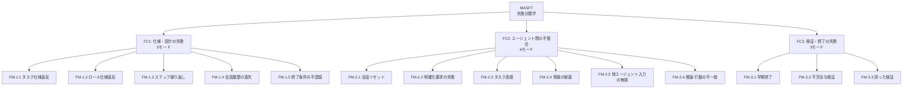

本記事は [Why Do Multi-Agent LLM Systems Fail?](https://arxiv.org/abs/2503.13657)（Cemri et al., 2025）の解説記事です。

## 論文概要（Abstract）

本論文は、マルチエージェントLLMシステム（MAS）がなぜ失敗するのかを初めて体系的に分析した研究である。著者らは5つの主要MASフレームワーク（MetaGPT, ChatDev, HyperAgent, AppWorld, AG2）で150以上のタスクを6名の専門アノテータが分析し、14の失敗モードを3つのカテゴリに分類した失敗分類学（MASFT: Multi-Agent System Failure Taxonomy）を提案している。プロンプト改善やトポロジー変更といった介入策は限定的な効果にとどまり、著者らは「組織設計の理解なしにMASの信頼性は向上しない」と主張している。

この記事は [Zenn記事: Microsoft Agent Frameworkで故障診断マルチエージェントを構築し診断精度を向上させる](https://zenn.dev/0h_n0/articles/c52d51ec4c11b9) の深掘りです。Zenn記事でGroupChatオーケストレーションによるマルチエージェント故障診断を構築する際に、本論文が指摘する失敗モードへの対策を事前に組み込むことが重要である。

## 情報源

- **arXiv ID**: 2503.13657
- **URL**: [https://arxiv.org/abs/2503.13657](https://arxiv.org/abs/2503.13657)
- **著者**: Mert Cemri, Melissa Z. Pan, Shuyi Yang et al.（UC Berkeley, Stanford, Michigan）
- **発表年**: 2025
- **分野**: cs.AI, cs.MA
- **コード**: [https://github.com/multi-agent-systems-failure-taxonomy/MASFT](https://github.com/multi-agent-systems-failure-taxonomy/MASFT)

## 背景と動機（Background & Motivation）

マルチエージェントLLMシステムへの期待は高いが、実際には単一エージェントと比較して性能向上が限定的であるケースが多い。しかし、なぜMASが失敗するのかについての体系的な分析はこれまで存在しなかった。著者らは、「成功するシステムはすべて似ているが、失敗するシステムにはそれぞれ固有の問題がある」（Berkeley, 2025のパラフレーズ）という洞察から、失敗モードの分類学を構築することで、MAS設計の改善指針を提供することを目的としている。

## 主要な貢献（Key Contributions）

- **14の失敗モードを3カテゴリに体系化**: Grounded Theory手法で150以上の会話トレースを分析し、実証的に失敗分類学を構築
- **LLM-as-a-judge評価パイプライン**: o1モデルによるfew-shot評価で94%の精度とCohen's Kappa 0.77を達成するスケーラブルな評価手法
- **介入策の限定的効果を実証**: プロンプト改善やトポロジー変更は一貫した改善をもたらさないことを実験的に確認
- **組織設計の観点からの分析**: 高信頼性組織（HRO）の原則との対応関係を明らかにした

## 技術的詳細（Technical Details）

### 3カテゴリ・14失敗モードの分類学



### カテゴリ1: 仕様・システム設計の失敗（FC1）

- **FM-1.1（タスク仕様違反）**: エージェントが明示された制約に違反する。例：出力フォーマットの無視
- **FM-1.2（ロール仕様違反）**: エージェントが定義された役割を逸脱する。例：診断エージェントが修理計画まで策定する
- **FM-1.3（ステップ繰り返し）**: 完了したステップを不必要に反復する
- **FM-1.4（会話履歴の喪失）**: コンテキストウィンドウの制約により過去の情報が失われる
- **FM-1.5（終了条件の不認識）**: タスク完了の条件を認識できない

### カテゴリ2: エージェント間の不整合（FC2）

- **FM-2.1（会話リセット）**: 理由なく会話が最初からやり直される
- **FM-2.2（明確化要求の失敗）**: 必要な情報を他エージェントに問い合わせない
- **FM-2.3（タスク逸脱）**: 意図した目的から外れる
- **FM-2.4（情報の秘匿）**: 重要な情報を共有しない
- **FM-2.5（他エージェント入力の無視）**: 他のエージェントの推奨を無視する
- **FM-2.6（推論-行動の不一致）**: 推論と実際のアクションが矛盾する

### カテゴリ3: タスク検証・終了の失敗（FC3）

- **FM-3.1（早期終了）**: 目的達成前に処理を終了する
- **FM-3.2（不完全な検証）**: 結果の適切な検証を省略する
- **FM-3.3（誤った検証）**: 不十分な検証で誤った結果を承認する

### 失敗の連鎖

著者らは相関行列分析により、失敗モードが孤立して発生するのではなく、**連鎖的に影響し合う**ことを明らかにした。例えば、FM-1.2（ロール違反）がFM-2.3（タスク逸脱）を引き起こし、最終的にFM-3.1（早期終了）に至るパターンが観察されている。

## 実験結果（Results）

### 分析対象フレームワーク

| システム | アーキテクチャ | 対象タスク |
|---------|-------------|----------|
| MetaGPT | アセンブリライン | ソフトウェア開発 |
| ChatDev | 階層的ワークフロー | ソフトウェア開発 |
| HyperAgent | 階層的ワークフロー | 専門エージェント協調 |
| AppWorld | スター型トポロジー | マルチサービスツール呼び出し |
| AG2 (AutoGen) | 柔軟な会話パターン | 数学問題・汎用タスク |

### 介入策の効果（論文Table 4より）

**AG2 MathChat（GSM-Plusデータセット）**:

| 構成 | GPT-4 (%) | GPT-4o (%) |
|------|-----------|------------|
| ベースライン | 84.75 ± 1.94 | 84.25 ± 1.86 |
| プロンプト改善 | 89.75 ± 1.44 | 89.00 ± 1.38 |
| トポロジー変更 | 85.50 ± 1.18 | 88.83 ± 1.51 |

GPT-4oではプロンプト改善が統計的に有意（p=0.03）であったが、GPT-4では有意でなかった（p=0.4）。

**ChatDev（ProgramDev + HumanEval）**:

| 構成 | ProgramDev (%) | HumanEval (%) |
|------|---------------|--------------|
| ベースライン | 25.0 | 89.6 |
| プロンプト改善 | 34.4 | 90.3 |
| トポロジー変更 | 40.6 | 91.5 |

ProgramDevで14ポイントの改善が見られたが、著者らは「実世界デプロイメントには不十分」と評価している。

### アノテーション品質

- 3名の専門アノテータによるCohen's Kappa: 0.88（高い一致度）
- LLM-as-a-judge（o1モデル）: 94%の精度、Cohen's Kappa 0.77

## 実装のポイント（Implementation）

本論文の知見をMicrosoft Agent Framework故障診断システムに適用する際の対策：

### FC1対策: 仕様の明確化

```python
# FM-1.2（ロール違反）への対策: 明示的なロール制約
ROLE_CONSTRAINT = """
あなたは冷媒漏れの診断のみを担当します。
以下は禁止事項です:
- 他の故障タイプ（コンプレッサー、フィルタ）の診断
- 修理計画の策定
- 保全スケジュールの提案
出力は必ず指定のJSONフォーマットで返してください。
"""
```

### FC2対策: エージェント間通信の構造化

```python
# FM-2.5（入力無視）への対策: 構造化メッセージ形式
MESSAGE_FORMAT = """
## 前エージェントの診断結果（必ず参照すること）
{previous_agent_result}

## あなたのタスク
上記の結果を踏まえた上で、{your_fault_type}について診断してください。
前エージェントの結果と矛盾する場合は、矛盾点を明示してください。
"""
```

### FC3対策: 検証メカニズム

```python
# FM-3.2（不完全な検証）への対策: 統合エージェントでのクロス検証
VERIFICATION_PROMPT = """
以下の3つの診断結果を検証してください:
1. 冷媒漏れ: {result_1}
2. コンプレッサー: {result_2}
3. フィルタ: {result_3}

検証項目:
- [ ] 各エージェントが指定フォーマットで回答しているか
- [ ] 矛盾する診断結果がないか
- [ ] 確信度が閾値（0.3）以上か
- [ ] 根拠がセンサーデータに基づいているか
"""
```

## 実運用への応用（Practical Applications）

本論文の知見をZenn記事の故障診断マルチエージェントシステムに適用する際の重要な指針：

- **GroupChatの終了条件を厳密に設定**: FM-1.5対策として、`termination_condition`にメッセージ数上限とタイムアウトの両方を設定する。Zenn記事の`sum(1 for m in msgs if m.role == "assistant") >= 5`は適切な例
- **ロール制約を明示的に記述**: FM-1.2対策として、各診断エージェントのプロンプトに「担当外の故障タイプは診断しない」旨を明記する
- **統合エージェントでクロス検証**: FM-3.2対策として、統合判定エージェントが各診断エージェントの出力フォーマットと根拠を検証する
- **スライディングウィンドウの活用**: FM-1.4対策として、会話履歴を直近N件に制限し、古い情報の喪失による判断ミスを防止する

著者らの「組織設計の理解が必要」という主張は、故障診断システムにおいても重要である。各エージェントの権限範囲、通信プロトコル、検証責任を事前に設計することが、信頼性の高いシステム構築の前提となる。

## 関連研究（Related Work）

- **AutoGen**（Wu et al., 2023）: 本論文でAG2として分析対象。GroupChatパターンにおける失敗モードが詳細に分析されている
- **MetaGPT**（Hong et al., 2023）: SOP駆動型マルチエージェント。アセンブリラインアーキテクチャ固有の失敗パターンが報告されている
- **Flow-of-Action**（Pei et al., 2025）: SOP統合によるRCA。本論文の知見はFlow-of-ActionのSOPアプローチが失敗モード軽減に有効であることを間接的に支持している

## まとめと今後の展望

本論文は、マルチエージェントLLMシステムの失敗を初めて体系的に分類した研究である。14の失敗モードが3カテゴリに整理され、プロンプト改善やトポロジー変更だけでは信頼性向上が不十分であることが実証された。著者らは、標準化された通信プロトコル、強化学習によるfine-tuning、確率的信頼度指標、メモリ・状態管理システムの導入を長期的な対策として提案している。故障診断マルチエージェントの実運用においては、本論文の失敗分類学を設計段階から考慮することが推奨される。

## 参考文献

- **arXiv**: [https://arxiv.org/abs/2503.13657](https://arxiv.org/abs/2503.13657)
- **Code**: [https://github.com/multi-agent-systems-failure-taxonomy/MASFT](https://github.com/multi-agent-systems-failure-taxonomy/MASFT)
- **Related Zenn article**: [https://zenn.dev/0h_n0/articles/c52d51ec4c11b9](https://zenn.dev/0h_n0/articles/c52d51ec4c11b9)
