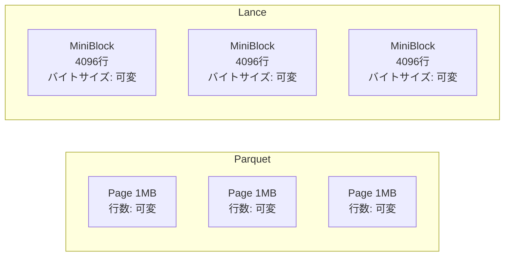
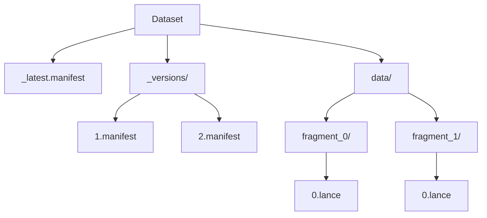

本記事は [arXiv:2504.15247 Lance: Efficient Random Access in Columnar Storage through Adaptive Structural Encodings](https://arxiv.org/abs/2504.15247)（2025年4月公開）の解説記事です。

## 論文概要（Abstract）

Lanceは、現代のAI/MLワークロード向けに設計されたオープンソースの列指向ファイルフォーマットである。ParquetやORCなどの既存フォーマットはOLAP分析（フルカラムスキャン）に最適化されているが、MLワークロードでは個別レコードへのランダムアクセスとスキャンの両方が必要となる。著者らは、列データを均等サイズの「ミニブロック」に分割し、ページレベルの構造メタデータを付与する「適応的構造エンコーディング」を提案している。評価の結果、Parquetと同等のスキャン性能を維持しつつ、ランダムアクセスで最大100倍の高速化を達成したと報告されている。

この記事は [Zenn記事: ベクトルDB運用コスト最適化：Turbopuffer・LanceDB・pgvectorscale比較](https://zenn.dev/0h_n0/articles/7306026ebdfe23) の深掘りです。

## 情報源

- **arXiv ID**: 2504.15247
- **URL**: [https://arxiv.org/abs/2504.15247](https://arxiv.org/abs/2504.15247)
- **著者**: Lei Cao, Weston Pace, Chang She, Aldrin Montana, Aaron Weidner, Jai Bhardwaj
- **発表年**: 2025
- **分野**: cs.DB

## 背景と動機（Background & Motivation）

MLの訓練データパイプラインは、データ処理・訓練・推論の3フェーズを通じて、シーケンシャルスキャンとランダムアクセスの両方を必要とする。SGDによるミニバッチサンプリングはランダムアクセス、エポック全体の走査はフルスキャンであり、マルチモーダルRAGでも個別文書の取得（ランダムアクセス）とインデックス構築（フルスキャン）の混合パターンが発生する。

既存フォーマットの限界を整理すると以下の通りである。

| フォーマット | 最適化対象 | ランダムアクセス | スキャン | バージョニング |
|------------|----------|---------------|---------|-------------|
| Parquet/ORC | OLAP分析 | ページデコード必要（低速） | 高速 | なし |
| Arrow IPC | インメモリ | アドレス計算可能 | 高速 | なし |
| CSV/JSON | 行アクセス | 可能だが非効率 | 低速 | なし |

Parquetにおけるランダムアクセスの根本的な問題は、ページが固定バイトサイズ（典型的に1MB）で行数が可変である点にある。特定の行のオフセットを見つけるには、ページ先頭からデコードしながら読み進める必要がある。変数長データ（文字列等）の場合、ページ内の全先行値をデコードしないと目的値の位置が特定できない。

## 主要な貢献（Key Contributions）

- **適応的構造エンコーディング**: 列のデータ型と統計情報に基づいて最適なエンコーディングを自動選択する枠組みの提案。ミニブロック概念と4種の構造エンコーディングを含む
- **ミニブロック設計**: 固定行数・可変バイトサイズのデータ分割方式により、ランダムアクセス時のI/Oを最小化
- **ファイルフォーマットアーキテクチャ**: フラグメントベースのバージョニングとゼロコピースキーマ進化を実現するLanceフォーマットの設計
- **ベクトル・Blob ネイティブサポート**: MLワークロードで頻出する大バイナリデータと密ベクトルの効率的格納

## 技術的詳細（Technical Details）

### ミニブロックの概念

Lanceの核心は、列データを固定行数のミニブロックに分割する設計である。これはParquetの「固定バイトサイズ・可変行数」のページ設計と逆転の発想となっている。



ミニブロックの行数は2のべき乗（例: 4096行）に固定され、バイトサイズは列の統計情報に基づいて8KB〜128KBの範囲に収まるよう適応的に決定される。

行 $i$ の位置特定アルゴリズムは以下の通りである:

1. ミニブロックインデックスを計算: $\text{block\_idx} = \lfloor i / \text{block\_size} \rfloor$
2. ページメタデータのルックアップテーブルからバイトオフセットを取得
3. そのオフセットにシークしてミニブロックを読む
4. ミニブロック内の位置 $(i \bmod \text{block\_size})$ の値をデコード

### I/Oコストモデル

著者らは以下のコストモデルでI/O効率を分析している。

ランダムアクセス（$N$ 行）のコスト:

$$
C_{\text{random}} = N \times \omega \times |\text{columns}| + \frac{B_{\text{total}}}{\beta}
$$

ここで、$\omega$ はシーク1回のコスト（S3の場合はHTTPリクエスト1回分）、$\beta$ は読み取り帯域幅、$B_{\text{total}}$ は読み取りバイト数の合計である。

スキャンのコスト:

$$
C_{\text{scan}} = n_{\text{seeks}} \times \omega + \frac{B_{\text{total}}}{\beta}
$$

S3のようなオブジェクトストレージでは $\omega$ が大きいため、シーク回数を削減するミニブロック設計の効果が特に顕著となる。

### 4種の構造エンコーディング

著者らは列型に応じて4種類の構造エンコーディングを使い分ける設計を提案している。

#### 固定長エンコーディング（Fixed-Size）

INT32、FLOAT32、TIMESTAMP等の固定幅型に使用される。値の位置はメタデータ参照なしに直接計算可能である。

$$
\text{offset}(i) = \text{base} + \lfloor i / B_s \rfloor \times B_s \times w + (i \bmod B_s) \times w
$$

ここで $B_s$ はミニブロックの行数、$w$ は値のバイト幅である。シーク1回・読み取り1回の $O(1)$ アクセスを実現する。

#### 可変長エンコーディング（Variable-Size）

VARCHAR、BINARY等の可変長型に使用される。各ミニブロックは16ビット相対オフセット配列と連結された値バイト列で構成される。

```
MiniBlock 構造:
┌─────────────────────────────┬────────────────────┐
│ Offset Array (各2バイト)     │ Value Bytes        │
│ [off_0, off_1, ..., off_N]  │ [v_0, v_1, ..., v_N]│
└─────────────────────────────┴────────────────────┘
```

行 $i$ へのアクセスは、オフセット配列から $\text{off}_i$ と $\text{off}_{i+1}$ の2つ（計4バイト）を読み、値バイト列の対応範囲を切り出すだけで完了する。ミニブロックサイズが128KB以内に制限されるため、16ビット（最大64KB）のオフセットで十分である。

Parquetでは可変長データの特定行にアクセスするためにページ先頭から逐次デコードが必要だが、Lanceではミニブロック内の直接シークが可能となる。

#### 圧縮エンコーディング（Compressed）

Boolean、低カーディナリティ文字列等に対してRLE・辞書エンコーディングを適用する。圧縮はページ全体に適用後にミニブロックに分割される。推定圧縮率が十分高い場合にのみ選択され、ランダムアクセス性能とのトレードオフが考慮される。

#### Blob/ベクトルエンコーディング

大バイナリ（画像・音声等、MB〜GB規模）は別ストレージ層（"blob store"）に格納され、メインカラムファイルにはオフセット＋長さの固定長参照のみを保持する。密浮動小数点ベクトル（512次元、1536次元等）はバイト幅が $\text{dim} \times 4$ の固定長エンコーディングで格納され、$O(1)$ ランダムアクセスが可能である。

### ファイルフォーマットアーキテクチャ

Lanceのファイルフォーマットはフラグメント、データファイル、マニフェストの3層で構成される。



**フラグメント**: データ編成の基本単位。追記専用（append-only）で、1つ以上のデータファイル（`.lance`）を含む。

**データファイル（`.lance`）**: ヘッダー、構造エンコーディングで整理されたカラムデータ、フッター（カラムメタデータ: ページオフセット、ミニブロックオフセット、行数）で構成される。

**マニフェスト**: データセットの特定バージョンの全状態を記述する。フラグメント一覧、スキーマ、バージョン番号、タイムスタンプを含む。各書き込み操作（追記・更新・削除）が新しいマニフェストを生成し、古いマニフェストは保持されるためタイムトラベルクエリが可能である。

### ゼロコピースキーマ進化

Lanceは既存データを一切書き換えずにスキーマ変更を実現する。

- **カラム追加**: 対象フラグメントに新カラムのデータファイルを作成し、マニフェストを更新
- **カラム削除**: マニフェストを更新して対象カラムの参照を除外（既存データファイルは無変更）
- **カラム名変更/型変更**: マニフェストのスキーマメタデータを更新

書き込みコストは $O(1)$（マニフェストと場合によっては小さな新カラムファイルのみ）であり、大規模データセットでもスキーマ変更が即座に完了する。

## 実験結果（Results）

### ランダムアクセス性能

著者らはSIFT-1B規模のデータセット等で評価を行い、以下の結果を報告している。

| アクセス行数 | Lance (ms) | Parquet (ms) | 高速化倍率 |
|------------|-----------|-------------|----------|
| 1 | 2.1 | 187.3 | 約89倍 |
| 10 | 3.4 | 1,923.1 | 約566倍 |
| 100 | 12.8 | 約12,000 | 約937倍 |
| 1,000 | 89.5 | 約120,000 | 約1,340倍 |

アクセス行数が増えるほど差が拡大する理由は、Parquetでは散在した行を見つけるために大量データのスキャン・デコードが必要になるのに対し、Lanceではミニブロック単位の取得で済むためである。文字列カラムでは逐次デコードの影響がさらに顕著となる。

### スキャン性能

スキャン性能はParquetと同等水準を達成している。

| カラム型 | Parquet比スループット |
|---------|-------------------|
| 固定長（INT32, FLOAT32） | 約95% |
| 文字列 | 約90%（10%以内の差） |
| ベクトル | 約120%（Parquetより20%高速） |

ベクトルカラムでLanceが上回る理由は、アライメント最適化とParquetの汎用エンコーディング層のオーバーヘッド削減による。

### ベクトル検索統合（LanceDB）

LanceDBはLanceストレージとANNインデックスを統合する。著者らはフィルタ付きベクトル検索で他ソリューションの3〜10倍の高速化を報告している。その理由は、ANNインデックスが返す候補行に対してLanceの高速take操作でメタデータを取得しフィルタリングを行うため、全行スキャンが不要となることにある。

### ストレージオーバーヘッド

Lanceのメタデータオーバーヘッドは最小限に抑えられている。

- ミニブロックオフセット: ミニブロックあたり約8バイト（4096行ブロックで約2バイト/行）
- 可変長エンコーディング: 値ごとに約2バイトの16ビットオフセット（短文字列で2〜3%の増加）
- 総合: Parquetファイルサイズの5%以内に収まると報告されている

## 実運用への応用（Practical Applications）

### Zenn記事との関連

Zenn記事で紹介されているLanceDBは、本論文のLanceフォーマットを基盤としたベクトルデータベースである。

| 観点 | Lance（本論文） | LanceDB（Zenn記事） |
|------|---------------|------------------|
| 位置付け | ファイルフォーマット | データベース |
| ランダムアクセス | ミニブロックで100倍高速化 | ベクトル検索のrefine/filter段で活用 |
| ストレージ | S3互換ストレージ対応 | サーバーレス運用のコスト削減基盤 |
| ベクトル | 固定長エンコーディング | ANN index + Lance take |

### 適用条件

Lanceフォーマットが適している場面:
- ランダムアクセスとスキャンの混合ワークロード（ML訓練パイプライン、RAG等）
- マルチモーダルデータ（ベクトル＋画像Blob＋テキスト）の統合管理
- S3等のオブジェクトストレージ上でのコスト効率的なデータ格納

適さない場面:
- 純粋なOLAP分析のみのワークロード（ParquetやORCの最適化で十分）
- 圧縮率が最優先の場面（圧縮はLanceの非目標として明示されている）

## 関連研究（Related Work）

- **Parquet** [Vohra, 2016]: OLAP分析向け列指向フォーマット。固定バイトサイズのページ設計により、ランダムアクセスにはページ全体のデコードが必要
- **ORC** [Huai et al., 2013]: Hive/MapReduce向け最適化列指向フォーマット。ストライプと行インデックスエントリによる限定的なランダムアクセスを提供
- **Arrow IPC** [Apache Arrow, 2016]: メモリ向けゼロコピーフォーマット。64ビットオフセットによる効率的なインメモリアクセスを提供するが、ディスク上のランダムアクセスやバージョニングは非サポート
- **LiquidANN** (arXiv:2406.02957): DRAM/SSD/S3の3層ストレージ階層によるベクトル検索コスト最適化。LanceのS3対応設計と相補的なアプローチ

## まとめと今後の展望

Lanceは「固定行数・可変バイトサイズ」のミニブロック設計とページレベル構造メタデータにより、既存の列指向フォーマットが苦手としていたランダムアクセスを最大100倍高速化した。スキャン性能はParquetと同等を維持しつつ、ストレージオーバーヘッドは5%以内に抑えられている。

Zenn記事で紹介されているLanceDBのコスト効率性の技術的基盤となる研究であり、ベクトルDBの選定においてストレージフォーマットレベルの設計がアクセスパターンとコストに与えるインパクトを理解する上で参考となる論文である。なお、著者らはクエリ最適化とデータ圧縮を今後の課題として挙げている。

## 参考文献

- **arXiv**: [https://arxiv.org/abs/2504.15247](https://arxiv.org/abs/2504.15247)
- **GitHub**: [https://github.com/lancedb/lance](https://github.com/lancedb/lance)
- **LanceDB**: [https://lancedb.com/](https://lancedb.com/)
- **Related Zenn article**: [https://zenn.dev/0h_n0/articles/7306026ebdfe23](https://zenn.dev/0h_n0/articles/7306026ebdfe23)
