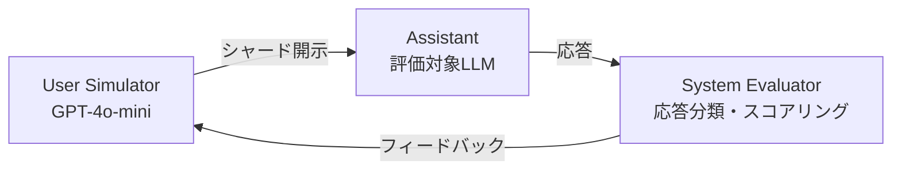

本記事は [arXiv:2505.06120](https://arxiv.org/abs/2505.06120)（Laban et al., 2025）の解説記事です。

## 論文概要（Abstract）

LLMを本番チャットボットに組み込む際、シングルターンでは高精度でもマルチターン会話では性能が大幅に劣化する。著者らは15モデル・600指示・27万以上のシミュレーション会話を用いて、マルチターン環境でのLLM性能を体系的に評価した。その結果、最先端モデルでもマルチターン時に平均39%の性能低下が確認された。この問題はモデルの能力不足だけでなく、信頼性の低下（unreliability）が主因であると著者らは報告している。

この記事は [Zenn記事: LLM会話スレッド管理の本番設計 Redis・PostgreSQL・3大APIパターン比較](https://zenn.dev/0h_n0/articles/d741db8cb57195) の深掘りです。

## 情報源

- **arXiv ID**: 2505.06120
- **URL**: [https://arxiv.org/abs/2505.06120](https://arxiv.org/abs/2505.06120)
- **著者**: Philippe Laban, Hiroaki Hayashi, Yingbo Zhou, Jennifer Neville（Salesforce Research）
- **発表年**: 2025
- **分野**: cs.CL, cs.HC

## 背景と動機（Background & Motivation）

LLMベースのチャットボットやエージェントは、実運用では複数ターンにわたる対話を処理する必要がある。しかし、既存のベンチマーク（HumanEval, GSM8K等）の多くはシングルターンの評価に限定されており、マルチターン環境での性能劣化について体系的な検証が不足していた。

著者らはこの問題を「情報の段階的開示」として定式化した。完全に仕様化されたシングルターン指示を複数のシャード（部分情報）に分割し、ターンごとに1つずつ開示するシミュレーションフレームワークを構築している。これにより、同一タスクでのシングルターンとマルチターンの性能差を制御実験として測定可能にした。

Zenn記事で解説したOpenAI Responses APIの`previous_response_id`やConversations APIの会話チェーンは、まさにこのマルチターン環境を前提とした機能であり、本論文の知見は会話管理アーキテクチャの設計判断に直結する。

## 主要な貢献（Key Contributions）

- **貢献1**: シングルターン指示をマルチターンシミュレーションに変換する「シャーディング」手法の提案と、27万以上のシミュレーション会話による大規模評価
- **貢献2**: マルチターン性能を測定する3つの指標（平均性能 $\bar{P}$、適性 $A^{90}$、信頼性欠如 $U_{10}^{90}$）の定義
- **貢献3**: 性能劣化の根本原因として「早期回答試行」「回答肥大化」「エッジ情報偏重」「冗長応答」の4パターンの特定

## 技術的詳細（Technical Details）

### 実験フレームワーク

著者らが構築したシミュレーションフレームワークは3つのコンポーネントから成る。



**シミュレーション5条件**:

| 条件 | ターン数 | 情報提示方法 | 目的 |
|------|---------|------------|------|
| **Full** | 1ターン | 完全な指示（ベースライン） | 上限性能の測定 |
| **Concat** | 1ターン | シャードを結合して提示 | 分割による表現変化の影響測定 |
| **Sharded** | マルチターン | ターンごとに1シャード | マルチターン性能の測定 |
| **Recap** | マルチターン | Sharded＋最終要約 | 要約による回復効果の測定 |
| **Snowball** | マルチターン | 各ターンで累積要約 | ターンレベル要約の効果測定 |

### 評価指標の定義

著者らは各指示に対してN回のシミュレーションを実行し、以下の3指標を計算している。

$$
\bar{P} = \frac{1}{N} \sum_{i=1}^{N} s_i
$$

ここで $s_i$ は $i$ 回目のシミュレーションのスコア（0-100）。

$$
A^{90} = \text{percentile}_{90}(\{s_1, s_2, \ldots, s_N\})
$$

適性（Aptitude）は90パーセンタイルスコアで、モデルの最良ケース性能を表す。

$$
U_{10}^{90} = A^{90} - \text{percentile}_{10}(\{s_1, s_2, \ldots, s_N\})
$$

信頼性欠如（Unreliability）は90パーセンタイルと10パーセンタイルの差で、性能のばらつきを定量化する。

### アルゴリズム: シャーディング変換

```python
def shard_instruction(
    original: str,
    n_shards: int = 4,
) -> list[str]:
    """完全指示をn個のシャードに分割する

    Args:
        original: 完全に仕様化された1ターン指示
        n_shards: 分割数（論文では2-8で実験）

    Returns:
        シャードのリスト（段階的に情報を開示）
    """
    # GPT-4oで分割を提案 → 人間が検証
    shards = llm_propose_shards(original, n_shards)
    validated = human_validate(shards)
    return validated
```

### 6つのベンチマークタスク

論文では以下の6タスク・計600指示で評価を実施している。

1. **Code**: Python関数生成（HumanEval, LiveCodeBench）
2. **Database**: Text-to-SQL（Spider）
3. **Actions**: API関数呼び出し（Berkeley Function Calling Leaderboard）
4. **Math**: 文章題（GSM8K）
5. **Data-to-Text**: テーブルデータからの文生成（ToTTo）
6. **Summary**: 複数文書要約（Summary of a Haystack）

### 実験規模

論文の実験は以下のスケールで実施されている。

- **15モデル**: OpenAI（GPT-4o-mini, GPT-4o, o3, GPT-4.1）、Anthropic（Claude 3 Haiku, Claude 3.7 Sonnet）、Google（Gemini 2.5 Flash, Gemini 2.5 Pro）、Meta（Llama3.1-8B, Llama3.3-70B, Llama 4 Scout）、その他（OLMo-2-13B, Phi-4, DeepSeek-R1, Command-A）
- **600指示**: 6タスク×各90-120指示
- **5シミュレーション条件** × **10回繰り返し**: 合計27万以上のシミュレーション会話
- **実験コスト**: 約$5,000 USD

### 応答戦略の分類

著者らはAssistantの各ターンの応答を7つの戦略に分類している。clarification（明確化要求）、refusal（拒否）、hedging（条件付き回答）、interrogation（質問返し）、discussion（議論）、missing（無応答）、answer attempt（回答試行）。マルチターンの劣化は、初期ターンでのanswer attempt（早期回答試行）の頻度が高いモデルほど顕著であると報告されている。

## 実験結果（Results）

### 主要結果（論文Table 1より）

| モデル | Full | Sharded | Sharded/Full比 |
|--------|------|---------|---------------|
| Llama3.1-8B | 47.0 | 19.5 | 62.5% |
| GPT-4o-mini | 77.4 | 43.2 | 56.2% |
| Claude 3.7 Sonnet | 88.3 | 54.6 | 65.9% |
| GPT-4.1 | 92.0 | 57.0 | 61.8% |
| Gemini 2.5 Pro | 95.2 | 61.5 | 64.5% |

著者らによると、全15モデルで一貫して35-40%の性能低下が観測されている。Concat条件（シャードを結合して1ターンで提示）ではFull性能の95%を維持しており、情報の欠落ではなくマルチターンの対話形式そのものが劣化の原因であることが示されている。

### 適性 vs 信頼性の乖離

論文の重要な発見として、シングルターンでは適性と信頼性が正の相関を示す（高性能モデルほど安定）のに対し、マルチターンでは全モデルが同程度に不安定になることが報告されている。

- **適性の低下**: 平均 -16%（比較的軽微）
- **信頼性欠如の増加**: 平均 +112%（深刻）

著者らはこれを「マルチターン環境では、モデルの洗練度に関わらず全モデルが同程度の高い不安定性を示す」と結論づけている。

### 緩和策の効果（論文Table 2より）

| アプローチ | GPT-4o-mini | GPT-4o |
|-----------|------------|--------|
| Full（上限） | 86.8 | 93.0 |
| Sharded | 50.4 | 59.1 |
| Recap（最終要約） | 66.5 | 76.6 |
| Snowball（各ターン要約） | 61.8 | 65.3 |

RecapとSnowballはいずれも15-20%の改善を示しているが、Full性能には遠く及ばないと著者らは報告している。

### 温度パラメータの影響（論文Table 3より）

マルチターン環境では温度を0に設定しても信頼性欠如が約30ポイント残存しており、シングルターンのように温度調整では解決できないことが示されている。

## 性能劣化の根本原因

著者らは4つの根本原因パターンを特定している。

1. **早期回答試行（Premature Answer Attempts）**: LLMは初期ターンで不完全な情報から仮定を置いて回答を試みる傾向がある。この早期回答に以降のターンで過度に依存することで性能が劣化する

2. **回答肥大化（Answer Bloat）**: 後続ターンで以前の回答を膨張させ、ユーザー要件と自身の過去出力を混同する

3. **エッジ情報偏重（Over-adjustment to Edge Information）**: 会話の最初と最後のターンの情報を過度に重視し、中間ターンの文脈が失われる（loss-of-middle-turns現象）

4. **冗長応答（Verbose Responses）**: 推論モデル（o3, DeepSeek-R1）は応答が33%長くなり、不必要な仮定を含むことで問題を悪化させる

## 実装のポイント（Implementation）

### 本番会話管理への示唆

この論文の知見を本番システムに適用する場合、以下の実装パターンが考えられる。

```python
from dataclasses import dataclass


@dataclass
class ConversationConfig:
    """マルチターン劣化を考慮した会話設定"""

    max_turns_before_recap: int = 5
    enable_snowball_summary: bool = True
    max_context_tokens: int = 8000


def build_context_with_recap(
    messages: list[dict],
    config: ConversationConfig,
) -> list[dict]:
    """定期的な要約挿入でマルチターン劣化を緩和する

    Args:
        messages: 会話履歴
        config: 会話設定

    Returns:
        要約を挿入した最適化済みメッセージリスト
    """
    if len(messages) <= config.max_turns_before_recap:
        return messages

    # 論文のRecap戦略: 古いメッセージを要約し直近を保持
    old_messages = messages[:-config.max_turns_before_recap]
    recent_messages = messages[-config.max_turns_before_recap:]

    summary = summarize_conversation(old_messages)
    return [
        {"role": "system", "content": f"会話要約:\n{summary}"},
        *recent_messages,
    ]
```

**制約・注意点**: 著者らはRecap戦略でも15-20%の改善に留まると報告しており、完全な解決策ではない。本番システムでは、重要なタスクではマルチターンの会話を定期的にリセットし、蓄積した情報を構造化して再提示するアプローチが推奨される。

## 実運用への応用（Practical Applications）

Zenn記事で解説したRedis + PostgreSQLのハイブリッドアーキテクチャにおいて、本論文の知見は以下のように適用できる。

**会話セッション設計**: マルチターンの劣化が5ターン目から始まることを考慮し、RedisのセッションTTLをターン数ベースで制御する（例: 30ターンで自動要約＋新セッション開始）。

**Compaction戦略の選択**: 論文のRecap（最終要約）とSnowball（各ターン要約）の比較結果から、Recapのほうがコスト効率が高い（Snowballは逆にSnowball分の追加コストに見合う改善が得られない）。Zenn記事のスライディングウィンドウ＋LLM要約のハイブリッド戦略は、この知見に合致している。

**APIパターン選択**: OpenAIの`previous_response_id`はサーバー側で全履歴を保持するため、マルチターン劣化の緩和機能は提供されない。クライアント側で要約・圧縮を行う手動管理パターンのほうが、劣化対策の柔軟性が高い。

## 関連研究（Related Work）

- **MultiChallenge**（Ahuja et al., 2025）: マルチターン会話の4カテゴリの課題に焦点を当てた評価ベンチマーク。本論文と相補的に利用可能
- **MT-Eval**（Kwan et al., 2024）: マルチターン対話の指示追従能力を評価するベンチマーク
- **Lost in the Middle**（Liu et al., 2024, TACL）: 長いコンテキストの中間部分で情報が失われる現象を報告。本論文のloss-of-middle-turns現象と関連

## まとめと今後の展望

著者らは、マルチターン会話でLLMの性能が平均39%低下し、信頼性欠如が112%増加するという深刻な問題を27万以上のシミュレーションで実証した。RecapやSnowballなどの緩和策は部分的な改善（15-20%）に留まり、LLM本体のマルチターン対応の改善が必要であると結論づけている。本番の会話管理システムを設計する際は、マルチターン劣化を前提としたCompaction戦略・セッション管理の実装が不可欠である。

## 参考文献

- **arXiv**: [https://arxiv.org/abs/2505.06120](https://arxiv.org/abs/2505.06120)
- **Related Zenn article**: [https://zenn.dev/0h_n0/articles/d741db8cb57195](https://zenn.dev/0h_n0/articles/d741db8cb57195)

---

:::message
本記事はAI（Claude Code）により自動生成されました。論文の内容を正確に伝えることを目的としていますが、解釈に誤りがある可能性があります。原論文もあわせてご確認ください。
:::
