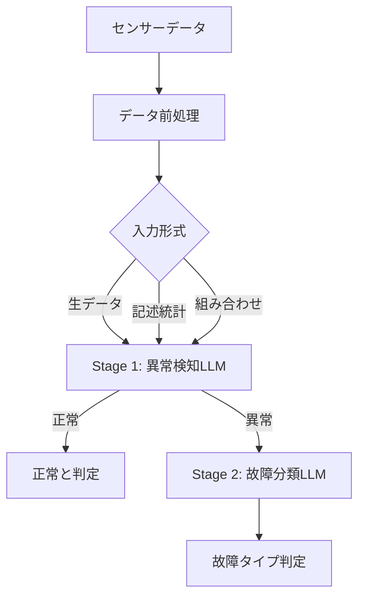

本記事は [Exploring LLM-based Frameworks for Fault Diagnosis](https://arxiv.org/abs/2509.23113)（Lee et al., 2025）の解説記事です。

## 論文概要（Abstract）

本論文は、産業設備（HVACシステム）の故障診断にLLMを適用し、システムアーキテクチャ（集中型 vs 分散型）、データ入力形式（生データ vs 記述統計）、コンテキストウィンドウサイズが診断精度に与える影響を体系的に評価した研究である。著者らは、記述統計に変換した入力が生データより診断精度を改善し、分散型（マルチLLM）アーキテクチャが集中型よりRecallで優位であったと報告している。一方、継続学習では故障バイアスの蓄積が確認され、LLMの産業適用における課題も明らかにされた。

この記事は [Zenn記事: Microsoft Agent Frameworkで故障診断マルチエージェントを構築し診断精度を向上させる](https://zenn.dev/0h_n0/articles/c52d51ec4c11b9) の深掘りです。Zenn記事で参照されている精度数値やアーキテクチャ比較の根拠となる論文を詳細に解説する。

## 情報源

- **arXiv ID**: 2509.23113
- **URL**: [https://arxiv.org/abs/2509.23113](https://arxiv.org/abs/2509.23113)
- **著者**: Xian Yeow Lee, Lasitha Vidyaratne, Ahmed Farahat, Chetan Gupta（Hitachi America Ltd., R&D）
- **発表年**: 2025（PHM学会）
- **分野**: cs.AI, cs.LG
- **コード**: [https://github.com/xylhal/PHM_LLMFaultDiagnosis](https://github.com/xylhal/PHM_LLMFaultDiagnosis)

## 背景と動機（Background & Motivation）

産業設備の故障診断は、従来ルールベースの統計手法やCNNベースの異常検知で行われてきた。しかし、これらの手法はセンサー構成や故障パターンが変化するたびにルールやモデルの再設計が必要であり、新規故障タイプへの対応に時間がかかるという課題がある。

LLMは自然言語理解能力を持つため、センサーデータの「意味」を解釈し、故障の根本原因を推論できる可能性がある。著者らは、LLMが故障診断においてルールベース手法と同等以上の性能を達成できるか、また最適な入力形式やシステム構成は何かを明らかにすることを目的として本研究を実施した。

## 主要な貢献（Key Contributions）

著者らが主張する主要な貢献は以下の3点である：

- **データ表現の体系的比較**: 生の時系列データ、記述統計、およびその組み合わせの3種類の入力形式がLLMの診断精度に与える影響を定量的に評価
- **アーキテクチャ比較**: 単一LLM（集中型）とマルチLLM（分散型）のアーキテクチャを同一条件で比較し、分散型のRecall優位性を実証
- **継続学習の限界の明示**: LLMに過去の診断結果をフィードバックする継続学習実験で、故障予測バイアスの蓄積を確認

## 技術的詳細（Technical Details）

### HVACシミュレーション環境

著者らは9つのセンサー（室内温度、外気温度、給気温度、還気温度、吸入圧力、吐出圧力、コンプレッサー電力、冷却出力、風量）を持つHVACシステムのシミュレータを構築した。室内温度の時間発展は以下の熱力学モデルに従う（論文Section 3より）：

$$
T_{in}(t+1) = T_{in}(t) + \alpha(T_{amb}(t) - T_{in}(t)) - \beta Q_{cool}(t)
$$

ここで、
- $T_{in}(t)$: 時刻 $t$ の室内温度
- $T_{amb}(t)$: 時刻 $t$ の外気温度
- $Q_{cool}(t)$: 時刻 $t$ の冷却出力
- $\alpha$: 外気との熱交換係数
- $\beta$: 冷却効率係数

### 故障モデル

3種類の故障を注入するシミュレーションが設計された：

| 故障タイプ | 冷却出力 | 吸入圧力 | コンプレッサー電力 | 風量 |
|-----------|---------|---------|-----------------|------|
| 冷媒漏れ | -50% | -30% | +20% | 変化なし |
| コンプレッサー故障 | -90% | 変化なし | -70% | 変化なし |
| フィルタ詰まり | 変化なし | 変化なし | 変化なし | -40% |

### 2段階LLMシステム



- **Stage 1（異常検知）**: センサーデータから異常の有無を二値分類
- **Stage 2（故障分類）**: 異常と判定されたデータに対し、故障タイプを分類

### 記述統計への変換

著者らは、生の時系列データをmin、max、mean、std、median、25パーセンタイル、75パーセンタイル、トレンド（増加/減少/安定）の記述統計に変換してLLMに入力する手法を採用した。この変換により、LLMが「平均値の異常な上昇」や「標準偏差の拡大」といったパターンを言語的に解釈できるようになる。

### 集中型 vs 分散型アーキテクチャ

- **集中型（Single-LLM）**: 1つのLLMプロンプトに全故障タイプの判定基準を記述
- **分散型（Multi-LLM）**: 故障タイプごとに専用のLLMプロンプトを用意し、各LLMが担当する故障のみを判定

## 実験結果（Results）

### 異常検知性能（論文Table 1より）

GPT-4.1-nanoと記述統計の組み合わせが最も高い性能を示した：

| 手法 | Precision | Recall | F1スコア | Accuracy |
|------|-----------|--------|---------|----------|
| GPT-4.1-nano（記述統計） | 0.73 | 0.99 | 0.84 | 0.73 |
| GPT-4o（記述統計） | 0.73 | 0.99 | 0.84 | 0.73 |
| 統計ベースライン | 0.73 | 1.00 | 0.85 | 0.73 |

著者らは、LLMが記述統計を用いた場合にルールベース手法と同等の性能を達成したが、Accuracyではわずかに下回ったと報告している。

### コンテキストウィンドウサイズの影響（論文Table 2より）

| ウィンドウ | Precision | Recall | F1スコア | Accuracy |
|-----------|-----------|--------|---------|----------|
| 24時間 | 0.69 | 0.99 | 0.82 | 0.69 |
| **36時間** | **0.73** | **0.99** | **0.84** | **0.73** |
| 48時間 | 0.72 | 1.00 | 0.84 | 0.72 |

36時間が最適とされた理由として、著者らは「故障の進行パターンを捉えるのに十分な長さでありながら、トークン消費を抑制できる」と説明している。

### 故障分類性能（論文Table 3より）

| アーキテクチャ | モデル | Precision | Recall | F1スコア |
|--------------|--------|-----------|--------|---------|
| 分散型（Multi-LLM） | GPT-4o | 0.48 | **0.94** | 0.59 |
| 集中型（Single-LLM） | GPT-4o | 0.49 | 0.76 | 0.58 |
| 分散型（Multi-LLM） | GPT-4.1-nano | 0.29 | **0.96** | 0.43 |
| 集中型（Single-LLM） | GPT-4.1-nano | 0.37 | 0.36 | 0.36 |

分散型アーキテクチャはRecallで集中型を大幅に上回った（GPT-4oで0.94 vs 0.76）。故障診断において見逃し（False Negative）の最小化が安全面で重要であるため、この特性は実運用上の利点となる。一方、Precisionは集中型よりやや低く、False Positiveの増加がトレードオフとして存在する。

### 継続学習の結果

著者らは過去の診断結果をLLMにフィードバックする継続学習実験を行ったが、多くの構成で**故障予測バイアスの蓄積**が確認された。具体的には、正常期間であっても「故障あり」と判定する傾向が定着し、サイクル4（正常期間）ではほとんどの構成で正解率がほぼ0に低下したと報告されている。著者らは「ほとんどのLLMは効果的な継続学習を示さない」と結論づけている。

## 実装のポイント（Implementation）

本論文のコードは[GitHub](https://github.com/xylhal/PHM_LLMFaultDiagnosis)で公開されている。実装時の注意点を以下に整理する：

- **記述統計の計算**: NumPyで時系列データから統計量を算出し、テキスト形式に変換する。Zenn記事の`compute_sensor_stats`関数はこの手法に基づいている
- **プロンプト設計**: 各故障タイプの判定基準を数値閾値で明示する。曖昧な表現は幻覚の原因となる
- **分散型のプロンプト分離**: 故障タイプごとに独立したプロンプトを設計し、各LLMが担当する故障のみに集中する
- **ウィンドウサイズ**: 36時間を推奨。センサー数×サンプリング間隔に応じてトークン消費量を事前に見積もる

## Production Deployment Guide

### AWS実装パターン（コスト最適化重視）

本論文の2段階LLMシステムをAWS上に実装する場合のトラフィック量別構成を示す。コスト試算は2026年3月時点のAWS ap-northeast-1（東京）リージョン料金に基づく概算値であり、実際のコストはトラフィックパターンにより変動する。最新料金は[AWS料金計算ツール](https://calculator.aws/)で確認されたい。

| 規模 | 月間リクエスト | 推奨構成 | 月額コスト | 主要サービス |
|------|--------------|---------|-----------|------------|
| **Small** | ~3,000 (100/日) | Serverless | $50-150 | Lambda + Bedrock + DynamoDB |
| **Medium** | ~30,000 (1,000/日) | Hybrid | $300-800 | Lambda + ECS Fargate + ElastiCache |
| **Large** | 300,000+ (10,000/日) | Container | $2,000-5,000 | EKS + Karpenter + EC2 Spot |

**Small構成の詳細**（月額$50-150）:
- Lambda: 1GB RAM, 60秒タイムアウト（$20/月）
- Bedrock: Claude 3.5 Haiku, Prompt Caching有効（$80/月）
- DynamoDB: On-Demand（$10/月）
- CloudWatch: 基本監視（$5/月）

**コスト削減テクニック**:
- Spot Instances使用で最大90%削減（EKS + Karpenter）
- Bedrock Batch API使用で50%削減（非リアルタイム処理向け）
- Prompt Caching有効化で30-90%削減（SOPプロンプトの固定部分）

### Terraformインフラコード

**Small構成（Serverless）: Lambda + Bedrock + DynamoDB**

```hcl
module "vpc" {
  source  = "terraform-aws-modules/vpc/aws"
  version = "~> 5.0"

  name = "fault-diagnosis-vpc"
  cidr = "10.0.0.0/16"
  azs  = ["ap-northeast-1a", "ap-northeast-1c"]
  private_subnets = ["10.0.1.0/24", "10.0.2.0/24"]

  enable_nat_gateway   = false
  enable_dns_hostnames = true
}

resource "aws_iam_role" "lambda_bedrock" {
  name = "fault-diagnosis-lambda-role"
  assume_role_policy = jsonencode({
    Version = "2012-10-17"
    Statement = [{
      Action = "sts:AssumeRole"
      Effect = "Allow"
      Principal = { Service = "lambda.amazonaws.com" }
    }]
  })
}

resource "aws_iam_role_policy" "bedrock_invoke" {
  role = aws_iam_role.lambda_bedrock.id
  policy = jsonencode({
    Version = "2012-10-17"
    Statement = [{
      Effect   = "Allow"
      Action   = ["bedrock:InvokeModel", "bedrock:InvokeModelWithResponseStream"]
      Resource = "arn:aws:bedrock:ap-northeast-1::foundation-model/anthropic.claude-3-5-haiku*"
    }]
  })
}

resource "aws_lambda_function" "fault_diagnosis" {
  filename      = "lambda.zip"
  function_name = "fault-diagnosis-handler"
  role          = aws_iam_role.lambda_bedrock.arn
  handler       = "index.handler"
  runtime       = "python3.12"
  timeout       = 60
  memory_size   = 1024

  environment {
    variables = {
      BEDROCK_MODEL_ID    = "anthropic.claude-3-5-haiku-20241022-v1:0"
      DYNAMODB_TABLE      = aws_dynamodb_table.sensor_cache.name
      CONTEXT_WINDOW_HOURS = "36"
    }
  }
}

resource "aws_dynamodb_table" "sensor_cache" {
  name         = "fault-diagnosis-sensor-cache"
  billing_mode = "PAY_PER_REQUEST"
  hash_key     = "sensor_hash"

  attribute {
    name = "sensor_hash"
    type = "S"
  }

  ttl {
    attribute_name = "expire_at"
    enabled        = true
  }
}
```

### セキュリティベストプラクティス

- IAMロール: 最小権限の原則（Bedrock InvokeModelのみ許可）
- ネットワーク: Lambda VPC内配置、パブリックサブネット不使用
- シークレット: AWS Secrets Manager使用、環境変数へのハードコード禁止
- 暗号化: DynamoDB/S3はKMS暗号化、転送中はTLS 1.2以上

### 運用・監視設定

```sql
-- CloudWatch Logs Insights: 診断精度モニタリング
fields @timestamp, fault_type, confidence, diagnosis_result
| stats avg(confidence) as avg_confidence,
        count(*) as total_diagnoses
  by fault_type, bin(1h)
| filter avg_confidence < 0.5
```

```python
import boto3

cloudwatch = boto3.client('cloudwatch')

cloudwatch.put_metric_alarm(
    AlarmName='fault-diagnosis-false-positive-rate',
    ComparisonOperator='GreaterThanThreshold',
    EvaluationPeriods=1,
    MetricName='FalsePositiveRate',
    Namespace='FaultDiagnosis/Custom',
    Period=3600,
    Statistic='Average',
    Threshold=0.3,
    AlarmDescription='False Positive率が30%を超過（継続学習バイアスの可能性）'
)
```

### コスト最適化チェックリスト

- [ ] ~100 req/日 → Lambda + Bedrock (Serverless) - $50-150/月
- [ ] ~1000 req/日 → ECS Fargate + Bedrock (Hybrid) - $300-800/月
- [ ] 10000+ req/日 → EKS + Spot Instances (Container) - $2,000-5,000/月
- [ ] Spot Instances優先（最大90%削減）
- [ ] Bedrock Batch API（50%割引、非リアルタイム処理）
- [ ] Prompt Caching有効化（SOPプロンプト固定部分）
- [ ] 記述統計変換でトークン数削減（生データ比50-80%削減）
- [ ] AWS Budgets: 月額予算設定（80%で警告）
- [ ] CloudWatch: False Positive率のスパイク検知
- [ ] Cost Anomaly Detection: 自動異常検知

## 実運用への応用（Practical Applications）

本論文の知見をMicrosoft Agent FrameworkのGroupChatパターンに適用する場合、以下の設計指針が導かれる：

- **分散型アーキテクチャを採用**: Zenn記事で実装した故障タイプ別エージェント構成は、本論文のRecall 0.94の結果により裏付けられる
- **記述統計への変換を必須とする**: 生データ入力はLLMの統計的推論能力の限界により精度が低下する
- **36時間ウィンドウを基準とする**: ただし、センサー数とサンプリング間隔に応じたチューニングが必要
- **継続学習は慎重に**: 故障バイアスの蓄積を防ぐため、スライディングウィンドウや定期キャリブレーションを併用する

ただし、本論文のベンチマークはHVACシミュレーション環境（9センサー、3故障タイプ）であり、実際の産業設備ではセンサー数やノイズレベルが異なるため、直接的な精度の外挿には注意が必要である。

## 関連研究（Related Work）

- **FD-LLM**（Qaid et al., 2024）: 振動データの時系列をFFTやstatistical featuresに変換してLLMをfine-tuningする手法。本論文とはデータ表現のアプローチが共通するが、FD-LLMはfine-tuningベース、本論文はin-context learningベースという違いがある
- **Flow-of-Action**（Pei et al., 2025）: SOPをLLMエージェントに統合してRCA精度を向上させた研究。本論文のSOPベースプロンプト設計と関連する
- **Toward Autonomous LLM-Based AI Agents for Predictive Maintenance**（MDPI, 2025）: LLMエージェントによる予知保全の包括的サーベイ。本論文は実証的評価として位置づけられる

## まとめと今後の展望

本論文は、HVACシステムの故障診断においてLLMの適用可能性を体系的に評価した研究である。記述統計への変換と分散型アーキテクチャの組み合わせが有効である一方、ルールベース手法との性能差は小さく、計算コストとの兼ね合いが実運用での判断ポイントとなる。継続学習の課題は未解決であり、今後はハイブリッドシステム（ルールベース＋LLM）やドメイン特化fine-tuningの検討が必要である。

## 参考文献

- **arXiv**: [https://arxiv.org/abs/2509.23113](https://arxiv.org/abs/2509.23113)
- **Code**: [https://github.com/xylhal/PHM_LLMFaultDiagnosis](https://github.com/xylhal/PHM_LLMFaultDiagnosis)
- **Related Zenn article**: [https://zenn.dev/0h_n0/articles/c52d51ec4c11b9](https://zenn.dev/0h_n0/articles/c52d51ec4c11b9)
