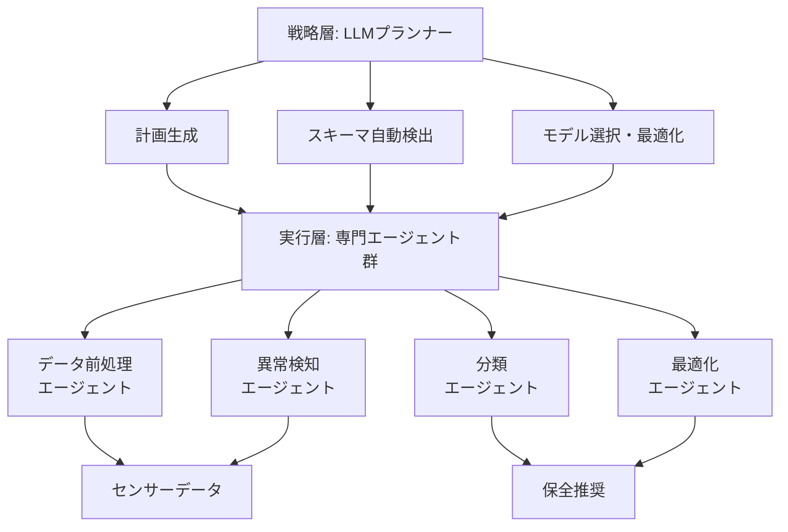

本記事は [Hybrid Agentic AI and Multi-Agent Systems in Smart Manufacturing](https://arxiv.org/abs/2511.18258)（Farahani et al., 2025）の解説記事です。

## 論文概要（Abstract）

本論文は、LLMベースのAgentic AI（戦略的推論・計画能力）と従来型マルチエージェントシステム（分散協調・リアルタイム処理能力）を融合するハイブリッドフレームワークを提案し、スマート製造における処方的保全（Prescriptive Maintenance: RxM）への適用を示した研究である。著者らは、LLMプランナーエージェントがワークフローを統括し、エッジレベルの専門エージェントがリアルタイムの異常検知やセンサーデータ処理を担当する階層型アーキテクチャにより、解釈可能性、スケーラビリティ、適応性を両立させたと報告している。

この記事は [Zenn記事: Microsoft Agent Frameworkで故障診断マルチエージェントを構築し診断精度を向上させる](https://zenn.dev/0h_n0/articles/c52d51ec4c11b9) の深掘りです。Zenn記事ではGroupChatによるマルチエージェント協調を扱っているが、本論文はその上流に位置する「なぜハイブリッド構成が必要か」という設計思想を提供する。

## 情報源

- **arXiv ID**: 2511.18258
- **URL**: [https://arxiv.org/abs/2511.18258](https://arxiv.org/abs/2511.18258)
- **著者**: Mojtaba A. Farahani, Md Irfan Khan, Thorsten Wuest（West Virginia University）
- **発表年**: 2025
- **分野**: cs.AI, cs.MA

## 背景と動機（Background & Motivation）

スマート製造（Smart Manufacturing Systems: SMS）では、設備の故障を予測するだけでなく、最適な保全アクションを推奨する**処方的保全（RxM）**が求められている。従来型のマルチエージェントシステム（MAS）はリアルタイムの分散協調に優れるが、複雑な推論や計画立案が困難であった。一方、LLMベースのAgentic AIは高度な推論能力を持つが、リアルタイム性やエッジでの動作に課題がある。

著者らは、この2つのアプローチを融合するハイブリッドフレームワークにより、戦略的推論とリアルタイム実行の両方を満たすシステムが構築可能であると主張している。

## 主要な貢献（Key Contributions）

著者らが主張する主要な貢献は以下の通りである：

- **ハイブリッドアーキテクチャの提案**: LLMプランナーエージェント（戦略層）と従来型専門エージェント（実行層）を階層的に組み合わせるフレームワーク
- **処方的保全への適用**: 単なる故障検知・診断を超えて、最適な保全アクションの推奨まで含む統合的な保全ワークフロー
- **産業データセットでの概念実証**: 2つの製造業データセットでProof of Conceptを実施し、有効性を確認

## 技術的詳細（Technical Details）

### ハイブリッドアーキテクチャの構成



### 層の役割分担

| 層 | 担当 | 技術 | 応答時間 |
|---|------|------|---------|
| **戦略層** | ワークフロー計画、スキーマ検出、モデル選択 | LLM（GPT-4等） | 秒〜分 |
| **実行層** | データ前処理、異常検知、分類、最適化 | 従来型ML/ルールベース | ミリ秒〜秒 |

### 処方的保全（RxM）のワークフロー

従来の保全パラダイムとの比較：

| パラダイム | 質問 | 技術 |
|-----------|------|------|
| 事後保全 | 何が壊れたか？ | ルールベース |
| 予防保全 | いつ壊れそうか？ | 統計モデル |
| 予知保全（PdM） | どのくらいの確率で壊れるか？ | ML/DL |
| **処方的保全（RxM）** | **何をすべきか？** | **ハイブリッドAI** |

RxMは単なる故障予測を超えて、コスト、安全性、生産スケジュールを考慮した最適な保全アクションを推奨する。LLMの推論能力は、この「何をすべきか」の判断に適している。

### LLMプランナーの機能

LLMプランナーエージェントは以下の3つの機能を担う：

1. **スキーマ自動検出**: 入力データの構造を自動的に解析し、適切な前処理パイプラインを構成する
2. **適応的パイプライン構築**: データの特性に基づいて、異常検知→分類→最適化のパイプラインを動的に構築する
3. **モデル性能最適化**: 実行層のMLモデルのハイパーパラメータを調整し、適応的な知能を実現する

### 従来型MASとの統合

実行層の各エージェントは、JADE（Java Agent DEvelopment Framework）やOPC-UA等の産業標準プロトコルで通信し、エッジデバイス上でリアルタイム処理を行う。LLMプランナーはクラウド側で稼働し、戦略的判断を数秒〜数分のレイテンシで提供する。

$$
T_{response} = T_{edge} + T_{plan}
$$

ここで、
- $T_{edge}$: エッジエージェントの応答時間（ミリ秒オーダー）
- $T_{plan}$: LLMプランナーの計画生成時間（秒〜分オーダー）
- $T_{response}$: システム全体の応答時間

リアルタイム性が要求される異常検知は $T_{edge}$ のみで完結し、保全計画の策定のみ $T_{plan}$ を要するアーキテクチャとなっている。

## 実験結果（Results）

著者らは2つの産業製造データセットでProof of Conceptを実施した。

### 概念実証の結果

- **スキーマ自動検出**: 入力データの構造を正確に識別し、適切な前処理パイプラインを自動構成
- **適応的パイプライン**: データ特性に応じてモデル選択と前処理を動的に調整
- **解釈可能性**: LLMプランナーが各判断の根拠を自然言語で説明可能

著者らは、定量的なベンチマーク結果（精度、F1スコア等）を詳細には報告しておらず、「改善されたロバスト性、スケーラビリティ、説明可能性」を定性的に主張している。本論文はアーキテクチャ提案が主眼であり、大規模な定量評価は今後の課題として位置づけられている。

### Zenn記事の故障診断システムとの対比

| 観点 | 本論文のハイブリッド構成 | Zenn記事のGroupChat構成 |
|------|---------------------|---------------------|
| 戦略層 | LLMプランナー（クラウド） | オーケストレータエージェント |
| 実行層 | 従来型MLエージェント（エッジ） | LLM診断エージェント×3 |
| リアルタイム性 | エッジで確保 | 全体がLLM依存 |
| 保全推奨 | RxMまで対応 | 診断のみ |
| コスト | エッジ処理でLLMコスト削減 | 全推論がLLM API呼び出し |

## 実装のポイント（Implementation）

本論文のハイブリッド構成を実装する際の注意点：

- **層の分離**: リアルタイム処理（異常検知）はエッジのルールベース/MLモデルで、戦略的判断（保全計画）はLLMで行う。全処理をLLMに依存するとコストとレイテンシの問題が生じる
- **フォールバック機構**: LLMプランナーがダウンした場合も、エッジエージェントが独立して異常検知を継続できる設計が必要
- **Zenn記事への適用**: GroupChatの前処理エージェントをルールベースに置き換え、診断エージェントのみLLMを使用するハイブリッド構成が検討可能

## Production Deployment Guide

### AWS実装パターン（コスト最適化重視）

ハイブリッドアーキテクチャ（エッジ＋クラウド）をAWS上に実装する場合の構成を示す。コスト試算は2026年3月時点のAWS ap-northeast-1料金に基づく概算値である。

| 規模 | 月間診断回数 | 推奨構成 | 月額コスト | 主要サービス |
|------|------------|---------|-----------|------------|
| **Small** | ~3,000 | Serverless+IoT | $100-250 | Lambda + IoT Core + Bedrock + DynamoDB |
| **Medium** | ~30,000 | Hybrid | $500-1,500 | IoT Greengrass + ECS Fargate + Bedrock |
| **Large** | 300,000+ | Container+Edge | $3,000-10,000 | IoT Greengrass + EKS + SageMaker Edge |

**Small構成の詳細**（月額$100-250）:
- AWS IoT Core: センサーデータ収集（$15/月）
- Lambda: エッジ異常検知のフォールバック（$20/月）
- Bedrock: LLMプランナー、Claude 3.5 Haiku（$100/月）
- DynamoDB: 保全履歴・SOPストレージ（$15/月）

**Large構成の詳細**（月額$3,000-10,000）:
- IoT Greengrass: エッジデバイス上でのML推論（$0/月、デバイスコスト別途）
- EKS: LLMプランナーのコンテナオーケストレーション（$72/月 + ノード費用）
- SageMaker Edge: エッジMLモデルのデプロイ・管理（$500/月）
- Bedrock Batch: 保全計画の非リアルタイム生成（$2,000/月）

**コスト削減テクニック**:
- エッジ処理で95%のリクエストを完結（LLM呼び出し削減）
- Bedrock Prompt Caching: SOPテンプレートのキャッシュ
- IoT Greengrassでのローカル推論: クラウドへのデータ転送削減

### Terraformインフラコード

```hcl
resource "aws_iot_thing" "sensor_gateway" {
  name = "hvac-sensor-gateway"

  attributes = {
    environment = "production"
    location    = "factory-floor-1"
  }
}

resource "aws_iot_topic_rule" "sensor_to_lambda" {
  name        = "hvac_sensor_anomaly"
  sql         = "SELECT * FROM 'sensors/+/readings' WHERE anomaly_score > 0.8"
  sql_version = "2016-03-23"
  enabled     = true

  lambda {
    function_arn = aws_lambda_function.edge_anomaly.arn
  }
}

resource "aws_lambda_function" "edge_anomaly" {
  filename      = "edge_anomaly.zip"
  function_name = "edge-anomaly-detector"
  role          = aws_iam_role.edge_lambda.arn
  handler       = "index.handler"
  runtime       = "python3.12"
  timeout       = 10
  memory_size   = 512

  environment {
    variables = {
      THRESHOLD_TEMPERATURE = "45.0"
      THRESHOLD_PRESSURE    = "2.0"
      BEDROCK_MODEL_ID      = "anthropic.claude-3-5-haiku-20241022-v1:0"
      PLANNER_ENDPOINT      = aws_lambda_function.llm_planner.function_name
    }
  }
}

resource "aws_lambda_function" "llm_planner" {
  filename      = "llm_planner.zip"
  function_name = "llm-maintenance-planner"
  role          = aws_iam_role.planner_lambda.arn
  handler       = "index.handler"
  runtime       = "python3.12"
  timeout       = 120
  memory_size   = 2048

  environment {
    variables = {
      BEDROCK_MODEL_ID = "anthropic.claude-3-5-haiku-20241022-v1:0"
      SOP_TABLE        = aws_dynamodb_table.maintenance_sop.name
    }
  }
}

resource "aws_dynamodb_table" "maintenance_sop" {
  name         = "maintenance-sop-knowledge"
  billing_mode = "PAY_PER_REQUEST"
  hash_key     = "equipment_type"
  range_key    = "fault_type"

  attribute {
    name = "equipment_type"
    type = "S"
  }
  attribute {
    name = "fault_type"
    type = "S"
  }
}
```

### セキュリティベストプラクティス

- IoT Core: X.509証明書によるデバイス認証、TLS 1.2必須
- Lambda: VPC内配置、IoT Core / Bedrock のみアクセス許可
- DynamoDB: KMS暗号化、VPCエンドポイント経由
- エッジデバイス: ファームウェア署名検証、セキュアブート

### 運用・監視設定

```sql
-- CloudWatch Logs Insights: エッジ vs クラウド処理比率
fields @timestamp, processing_layer, response_time_ms
| stats count(*) as total,
        sum(case when processing_layer = 'edge' then 1 else 0 end) as edge_count,
        avg(response_time_ms) as avg_latency
  by bin(1h)
```

### コスト最適化チェックリスト

- [ ] エッジ処理比率: 95%以上のリクエストをエッジで完結
- [ ] IoT Greengrass: ローカルML推論でクラウド転送削減
- [ ] Bedrock Prompt Caching: SOPテンプレートの固定部分をキャッシュ
- [ ] Bedrock Batch API: 非リアルタイムの保全計画生成で50%割引
- [ ] Lambda Power Tuning: エッジ異常検知のメモリ最適化
- [ ] DynamoDB TTL: 古い保全履歴の自動削除（90日）
- [ ] AWS Budgets: 月額予算設定（80%で警告）
- [ ] Cost Anomaly Detection: LLM使用量スパイク検知

## 実運用への応用（Practical Applications）

本論文のハイブリッド構成は、Zenn記事の故障診断システムを本番環境に展開する際の設計指針として有用である：

- **段階的な導入**: まずエッジのルールベース異常検知を導入し、次にLLMプランナーを追加する。全体をLLM依存にするリスクを回避できる
- **コスト効率**: LLMは保全計画の策定（低頻度・高価値）にのみ使用し、異常検知（高頻度・低コスト）はエッジ処理で行う
- **可用性**: LLMプランナーがダウンしてもエッジ処理で最低限の監視を継続できる

ただし、本論文は概念実証段階であり、大規模な定量評価は未実施である。具体的な精度やコスト削減効果については、自社環境での検証が必要である。

## 関連研究（Related Work）

- **Exploring LLM-based Frameworks for Fault Diagnosis**（Lee et al., 2025）: 全処理をLLMで行うアプローチ。本論文はエッジ処理との分離を提案する点で差別化
- **Flow-of-Action**（Pei et al., 2025）: SOP統合による精度向上。本論文のLLMプランナーにSOPを統合することでさらなる改善が期待される
- **Digital Twin + Multi-Agent**（各種, 2024-2025）: デジタルツインとMASの統合による予知保全。本論文のハイブリッド構成と相補的なアプローチ

## まとめと今後の展望

本論文は、LLMベースのAgentic AIと従来型MASを融合するハイブリッドフレームワークを提案し、処方的保全への適用可能性を示した。戦略層（LLM）と実行層（従来型ML）の分離により、リアルタイム性とコスト効率を両立する設計が可能となる。今後の課題として、大規模な定量評価、リアルタイム性の厳密な保証、複数製造ラインへのスケーリングが挙げられる。

## 参考文献

- **arXiv**: [https://arxiv.org/abs/2511.18258](https://arxiv.org/abs/2511.18258)
- **Related Zenn article**: [https://zenn.dev/0h_n0/articles/c52d51ec4c11b9](https://zenn.dev/0h_n0/articles/c52d51ec4c11b9)
