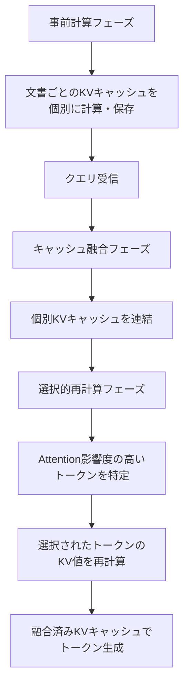

本記事は [CacheBlend: Fast Large Language Model Serving for RAG with Cached Knowledge Fusion](https://arxiv.org/abs/2405.14366) の解説記事です。

## 論文概要（Abstract）

CacheBlendは、RAG（Retrieval-Augmented Generation）システムにおけるLLM推論の高速化手法である。従来のRAGでは、検索された複数の文書をクエリとともにLLMに送信するたびにフルPrefill（全トークンのAttention計算）が必要であり、TTFT（Time To First Token）が大きくなる問題があった。CacheBlendは検索文書のKVキャッシュを事前計算・保存し、クエリ時に「選択的トークン再計算」で融合することで、著者らによればTTFTを最大69%削減しつつ精度を維持する。

この記事は [Zenn記事: Gemini 2.0 Flash×コンテキストキャッシュで社内検索のコストとレイテンシを削減する実装手法](https://zenn.dev/0h_n0/articles/81e707a2ab8751) の深掘りです。

## 情報源

- **arXiv ID**: 2405.14366
- **URL**: [https://arxiv.org/abs/2405.14366](https://arxiv.org/abs/2405.14366)
- **著者**: Jiayi Yao, Hanchen Li, Yuhan Liu et al.
- **発表年**: 2024
- **分野**: cs.CL, cs.LG

## 背景と動機（Background & Motivation）

RAGシステムでは、ユーザークエリに関連する文書をベクトルデータベースから検索し、クエリとともにLLMのコンテキストに含める。典型的な4文書RAG設定では、検索された文書のトークン数は数千～数万に達する。

標準的なLLM推論では、入力トークンすべてに対してPrefill（KVキャッシュの計算）を行い、その後Auto-Regressiveにトークンを生成する。Prefillの計算量は入力トークン数 $n$ に対して $O(n^2 \cdot d)$（$d$ はモデルの隠れ次元数）であり、長い入力ほどTTFTが増大する。

RAGの特性として、**同じ文書が異なるクエリで繰り返し参照される**ことが多い。例えば社内FAQ検索では、就業規則やマニュアルは多くのクエリで共通して検索される。この反復性を活用し、文書のKVキャッシュを再利用できれば、Prefill計算を大幅に削減できる。

しかし単純なKVキャッシュの連結では精度が低下する。これは、個別に計算されたKVキャッシュにはクロスドキュメントのAttention情報が含まれていないためである。CacheBlendはこの課題に対して「選択的トークン再計算」というアプローチで解決を図る。

## 主要な貢献（Key Contributions）

著者らが主張する主要な貢献は以下の通りである：

- **選択的トークン再計算**: 事前計算されたKVキャッシュを融合する際、全トークンではなくAttention影響度の高いトークンのみを再計算する手法を提案
- **TTFT最大69%削減**: 4文書RAG設定で、フルPrefillと比較してTTFTを最大69%削減したと報告（論文Table 1より）
- **精度維持**: PopQA、TriviaQA、MedQA、ASQAの4ベンチマークで、フルPrefillと統計的に有意差のない精度を維持したと報告
- **vLLM統合**: 広く利用されているLLMサービングフレームワークvLLMとの統合を実現し、スループットを2.2倍に向上

## 技術的詳細（Technical Details）

### CacheBlendの動作原理

CacheBlendの処理は以下の3段階で構成される。



### 数学的定式化

標準的なTransformerのSelf-Attention計算を考える。入力系列 $X = [x_1, ..., x_n]$ に対して：

$$
\text{Attention}(Q, K, V) = \text{softmax}\left(\frac{QK^\top}{\sqrt{d_k}}\right) V
$$

RAGで複数文書 $D_1, D_2, ..., D_m$ をクエリ $q$ と結合する場合、入力は $X = [D_1; D_2; ...; D_m; q]$ となる。フルPrefillではこの全体に対してAttention計算を行う。

CacheBlendでは、各文書 $D_i$ のKVキャッシュ $(K_i, V_i)$ を事前に個別計算・保存する。クエリ時には：

1. 保存済みKVキャッシュを連結: $K_{\text{concat}} = [K_1; K_2; ...; K_m; K_q]$
2. 連結KVキャッシュでAttentionスコアを近似計算
3. **Attention影響度**に基づいて再計算対象トークンを選択

Attention影響度は以下のように定義される：

$$
\text{Impact}(i) = \sum_{j \neq \text{doc}(i)} \alpha_{j,i}
$$

ここで、$\alpha_{j,i}$ はトークン $j$ がトークン $i$ に対して持つAttention重みの推定値、$\text{doc}(i)$ はトークン $i$ が属する文書を示す。Impactが高いトークンは、他の文書のトークンからの注目度が高く、クロスドキュメント相互作用に重要であるため、KV値の再計算が必要となる。

### 再計算比率のトレードオフ

再計算するトークンの比率 $r$（0 < $r$ < 1）はレイテンシと精度のトレードオフを制御するハイパーパラメータである：

$$
\text{再計算トークン数} = r \times \sum_{i=1}^{m} |D_i|
$$

著者らの実験では、$r = 0.05 \sim 0.15$（5-15%）の範囲で精度を維持しつつ大幅なレイテンシ削減が得られると報告されている（論文Figure 5より）。

```python
# CacheBlendの選択的再計算の概念実装
import torch
import torch.nn.functional as F
from dataclasses import dataclass


@dataclass
class CachedKV:
    """事前計算されたKVキャッシュ"""
    key: torch.Tensor    # (num_layers, seq_len, d_k)
    value: torch.Tensor  # (num_layers, seq_len, d_v)
    doc_id: str


def select_tokens_for_recompute(
    cached_kvs: list[CachedKV],
    query_kv: CachedKV,
    recompute_ratio: float = 0.1,
) -> list[int]:
    """再計算対象トークンの選択

    クロスドキュメントAttention影響度に基づいて、
    再計算が必要なトークンのインデックスを返す。

    Args:
        cached_kvs: 各文書の事前計算済みKVキャッシュ
        query_kv: クエリのKVキャッシュ
        recompute_ratio: 再計算するトークンの比率

    Returns:
        再計算対象トークンのインデックスリスト
    """
    # 全KVキャッシュを連結
    all_keys = torch.cat(
        [kv.key for kv in cached_kvs] + [query_kv.key], dim=1
    )

    # 最終層のAttentionスコアを近似計算
    last_layer_key = all_keys[-1]  # (total_len, d_k)
    query_key = query_kv.key[-1]  # (q_len, d_k)

    # クエリトークンから各キャッシュトークンへのAttention重み
    scores = torch.matmul(
        query_key, last_layer_key.transpose(-2, -1)
    ) / (last_layer_key.shape[-1] ** 0.5)
    attn_weights = F.softmax(scores, dim=-1)  # (q_len, total_len)

    # 各キャッシュトークンの影響度（クエリからの注目度合計）
    impact = attn_weights.sum(dim=0)  # (total_len,)

    # クエリトークン自体は除外
    doc_token_count = sum(kv.key.shape[1] for kv in cached_kvs)
    doc_impact = impact[:doc_token_count]

    # 上位r%のトークンを再計算対象として選択
    num_recompute = max(1, int(doc_token_count * recompute_ratio))
    _, top_indices = torch.topk(doc_impact, num_recompute)

    return top_indices.tolist()
```

## 実験結果（Results）

著者らが報告する主要な実験結果（論文Table 1, Figure 4より）：

**TTFT削減率**（4文書RAG設定）:

| 設定 | フルPrefill | CacheBlend (r=0.1) | 削減率 |
|------|-----------|-------------------|--------|
| PopQA (4doc) | 1.0x | 0.31x | 69% |
| TriviaQA (4doc) | 1.0x | 0.35x | 65% |
| MedQA (4doc) | 1.0x | 0.38x | 62% |
| ASQA (4doc) | 1.0x | 0.33x | 67% |

**精度比較**（論文Table 2より）：

| データセット | フルPrefill | CacheBlend (r=0.1) | 差分 |
|-------------|-----------|-------------------|------|
| PopQA (EM) | 56.2% | 55.8% | -0.4% |
| TriviaQA (EM) | 68.1% | 67.9% | -0.2% |
| MedQA (Acc) | 59.3% | 58.7% | -0.6% |
| ASQA (F1) | 33.5% | 33.2% | -0.3% |

著者らは、すべてのデータセットでCacheBlendとフルPrefillの精度差は統計的に有意ではないと報告している。

**スループット改善**: vLLM上での実装において、スループットが2.2倍に向上したと報告されている（論文Section 5.4より）。

## 実装のポイント（Implementation）

### vLLMとの統合

CacheBlendはvLLMのPagedAttention機構と統合されている。著者らはGitHub（`https://github.com/YaoJiayi/CacheBlend`）でコードを公開している。実装上の注意点：

1. **KVキャッシュの事前計算**: 文書をバッチ処理し、各文書のKVキャッシュをストレージに保存する。文書数 × モデル層数 × 系列長 × 隠れ次元数のストレージが必要
2. **再計算比率の調整**: $r = 0.1$（10%）が多くのタスクで安定するが、ドメイン固有のRAGでは検証が必要
3. **文書順序の制約**: 文書の順序や組み合わせが変わるとキャッシュの再利用効率が低下する。社内FAQ検索のように文書セットが比較的固定されるユースケースで効果が大きい

### Zenn記事のコンテキストキャッシュとの関連

Zenn記事で紹介されているVertex AIの明示的コンテキストキャッシュは、アプリケーションレベルのキャッシュ機構である。CacheBlendはモデルの推論エンジンレベルでのKVキャッシュ最適化であり、両者は異なるレイヤーで動作する。

| 観点 | Vertex AI コンテキストキャッシュ | CacheBlend |
|------|-------------------------------|------------|
| レイヤー | アプリケーション（API） | 推論エンジン（vLLM） |
| 粒度 | プロンプト全体 | 文書単位のKVキャッシュ |
| 再利用条件 | 完全一致するプレフィックス | 文書単位で任意の組み合わせ |
| 精度影響 | なし（完全キャッシュ） | 微小な精度低下の可能性 |
| 実装難度 | 低（API呼び出し） | 高（推論エンジンの改修） |

## Production Deployment Guide

### AWS実装パターン（コスト最適化重視）

CacheBlendを本番環境にデプロイする場合、vLLMベースの推論サーバーをコンテナで運用する構成が基本となる。

**トラフィック量別の推奨構成**:

| 規模 | 月間リクエスト | 推奨構成 | 月額コスト目安 | 主要サービス |
|------|--------------|---------|--------------|------------|
| **Small** | ~3,000 (100/日) | Single GPU | $800-1,500 | EC2 g5.xlarge + S3 + CloudWatch |
| **Medium** | ~30,000 (1,000/日) | Multi-GPU | $3,000-6,000 | ECS Fargate GPU + ElastiCache + S3 |
| **Large** | 300,000+ (10,000/日) | GPU Cluster | $10,000-25,000 | EKS + Karpenter + g5 Spot + S3 |

**Small構成の詳細**（月額$800-1,500）:
- **EC2 g5.xlarge**: NVIDIA A10G GPU 1台、24GB VRAM（$700/月 On-Demand）
- **S3**: KVキャッシュストレージ、文書1万件で約50GB（$2/月）
- **CloudWatch**: GPU使用率・推論レイテンシ監視（$10/月）
- **EBS**: gp3 100GB、vLLMモデル保存用（$8/月）

**コスト削減テクニック**:
- EC2 Spot Instances（g5.xlarge）で最大70%削減（中断時はOn-Demandにフォールバック）
- KVキャッシュをS3に保存し、推論時にメモリにロード（EBSコスト削減）
- CacheBlend自体がPrefill計算を69%削減するため、同じGPUでより多くのリクエストを処理可能

**コスト試算の注意事項**:
- 上記は2026年3月時点のAWS ap-northeast-1（東京）リージョン料金に基づく概算値です
- GPU インスタンスの料金はリージョンと可用性により変動します
- 最新料金は [AWS料金計算ツール](https://calculator.aws/) で確認してください

### Terraformインフラコード

**Small構成: EC2 g5.xlarge + vLLM + CacheBlend**

```hcl
# --- VPC ---
module "vpc" {
  source  = "terraform-aws-modules/vpc/aws"
  version = "~> 5.0"

  name = "cacheblend-vpc"
  cidr = "10.0.0.0/16"
  azs  = ["ap-northeast-1a"]
  private_subnets = ["10.0.1.0/24"]
  public_subnets  = ["10.0.100.0/24"]

  enable_nat_gateway = true
  single_nat_gateway = true  # コスト削減
}

# --- EC2 GPU インスタンス ---
resource "aws_instance" "vllm_server" {
  ami           = "ami-xxxxxxxxx"  # Deep Learning AMI (Ubuntu)
  instance_type = "g5.xlarge"      # A10G GPU, 24GB VRAM

  subnet_id                   = module.vpc.private_subnets[0]
  vpc_security_group_ids      = [aws_security_group.vllm_sg.id]
  iam_instance_profile        = aws_iam_instance_profile.vllm.name
  associate_public_ip_address = false

  root_block_device {
    volume_size = 100
    volume_type = "gp3"
    encrypted   = true
  }

  user_data = <<-EOF
    #!/bin/bash
    pip install vllm torch
    # CacheBlendのセットアップ
    git clone https://github.com/YaoJiayi/CacheBlend.git
    cd CacheBlend && pip install -e .
  EOF

  tags = {
    Name = "vllm-cacheblend-server"
  }
}

# --- S3（KVキャッシュストレージ） ---
resource "aws_s3_bucket" "kv_cache" {
  bucket = "cacheblend-kv-cache-store"
}

resource "aws_s3_bucket_server_side_encryption_configuration" "kv_cache" {
  bucket = aws_s3_bucket.kv_cache.id
  rule {
    apply_server_side_encryption_by_default {
      sse_algorithm = "aws:kms"
    }
  }
}

# --- セキュリティグループ ---
resource "aws_security_group" "vllm_sg" {
  name   = "vllm-cacheblend-sg"
  vpc_id = module.vpc.vpc_id

  ingress {
    from_port   = 8000
    to_port     = 8000
    protocol    = "tcp"
    cidr_blocks = [module.vpc.vpc_cidr_block]  # VPC内部のみ
  }

  egress {
    from_port   = 0
    to_port     = 0
    protocol    = "-1"
    cidr_blocks = ["0.0.0.0/0"]
  }
}

# --- CloudWatchアラーム ---
resource "aws_cloudwatch_metric_alarm" "gpu_utilization" {
  alarm_name          = "cacheblend-gpu-high"
  comparison_operator = "GreaterThanThreshold"
  evaluation_periods  = 2
  metric_name         = "GPUUtilization"
  namespace           = "Custom/vLLM"
  period              = 300
  statistic           = "Average"
  threshold           = 90
  alarm_description   = "GPU使用率90%超過（スケールアウト検討）"
}
```

### セキュリティベストプラクティス

- **ネットワーク**: vLLMサーバーはプライベートサブネットに配置、ALB経由でのみアクセス
- **IAM**: S3（KVキャッシュ）への読み取り権限のみ付与
- **暗号化**: S3はKMS暗号化、EBSも暗号化有効
- **KVキャッシュ**: 社内文書のKVキャッシュには機密情報が含まれる可能性があるため、S3バケットポリシーで厳格にアクセス制御

### コスト最適化チェックリスト

- [ ] ~100 req/日 → EC2 g5.xlarge（Single GPU）$800-1,500/月
- [ ] ~1000 req/日 → ECS Fargate GPU（Multi-GPU）$3,000-6,000/月
- [ ] 10000+ req/日 → EKS + Karpenter + Spot（GPU Cluster）$10,000-25,000/月
- [ ] EC2 Spot Instances（g5）で最大70%削減
- [ ] CacheBlend再計算比率を0.1に設定（69%のPrefill計算削減）
- [ ] S3 Intelligent-TieringでKVキャッシュストレージコスト最適化
- [ ] KVキャッシュの事前計算をバッチ処理（夜間実行でSpotコスト活用）
- [ ] CloudWatch GPUメトリクスで過剰プロビジョニング検出

## 実運用への応用（Practical Applications）

CacheBlendは、Zenn記事で紹介されている社内検索システムの推論エンジン層での最適化として適用可能である：

1. **FAQ文書のKVキャッシュ事前計算**: 社内FAQ（就業規則、マニュアル等）のKVキャッシュを事前計算し、クエリ時のPrefill計算を削減
2. **Vertex AIコンテキストキャッシュとの併用**: APIレベルのキャッシュ（Vertex AI）とエンジンレベルのキャッシュ（CacheBlend）の2層キャッシュ構成
3. **セルフホスト環境での適用**: Geminiの代わりにオープンソースLLM（Llama 3等）をvLLMで運用する場合に直接適用可能

ただし、CacheBlendはvLLM依存であり、Vertex AI（Gemini）のマネージドAPIでは利用できない点に注意が必要である。セルフホスト環境でのRAGシステムに最も適している。

## 関連研究（Related Work）

- **Prompt Cache（Gim et al., 2024）**: プロンプトのモジュール単位でAttention状態を再利用する手法。CacheBlendと異なり、プロンプト構造の事前定義が必要
- **vLLM PagedAttention（Kwon et al., 2023）**: KVキャッシュをページ単位で管理し、メモリ効率を向上させる手法。CacheBlendはPagedAttention上に構築されている
- **KIVI（Liu et al., 2024）**: KVキャッシュの2bit量子化によるメモリ削減手法。CacheBlendと直交する最適化であり、併用が可能

## まとめと今後の展望

CacheBlendは、RAGシステムにおけるKVキャッシュ再利用の実践的手法として、TTFTを最大69%削減しつつ精度を維持することを著者らは実証した。社内文書検索のような反復的な文書参照パターンを持つユースケースで特に効果が大きい。

今後の研究方向としては、文書の動的な追加・削除に対応するキャッシュ管理、マルチモーダル入力（画像・動画）のKVキャッシュ再利用、量子化との併用による更なるメモリ効率の改善が考えられる。

## 参考文献

- **arXiv**: [https://arxiv.org/abs/2405.14366](https://arxiv.org/abs/2405.14366)
- **GitHub**: [https://github.com/YaoJiayi/CacheBlend](https://github.com/YaoJiayi/CacheBlend)
- **Related Zenn article**: [https://zenn.dev/0h_n0/articles/81e707a2ab8751](https://zenn.dev/0h_n0/articles/81e707a2ab8751)
- **vLLM**: [https://github.com/vllm-project/vllm](https://github.com/vllm-project/vllm)

---

:::message
この記事はAI（Claude Code）により自動生成されました。論文の内容を正確に伝えることを心がけていますが、解釈の誤りがある可能性があります。正確な情報は原論文をご確認ください。
:::
