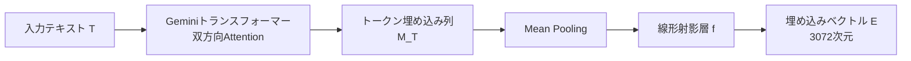

本記事は [Gemini Embedding: Generalizable Embeddings from Gemini](https://arxiv.org/abs/2503.07891) の解説記事です。

## 論文概要（Abstract）

Gemini Embeddingは、GoogleのGemini LLMを基盤とした汎用テキスト埋め込みモデルである。250以上の言語とコードを含む多様なテキストに対して、分類・類似度計算・クラスタリング・ランキング・検索タスクをカバーする高品質な埋め込みを生成する。著者らによると、MMTEB（Massive Multilingual Text Embedding Benchmark）の多言語・英語・コードの全ベンチマークにおいて、従来のSOTA（State-of-the-Art）モデルを上回る性能を達成した。

この記事は [Zenn記事: Gemini 2.0 Flash×コンテキストキャッシュで社内検索のコストとレイテンシを削減する実装手法](https://zenn.dev/0h_n0/articles/81e707a2ab8751) の深掘りです。Zenn記事ではVertex AI Search Groundingによる検索精度向上を紹介しているが、Gemini Embeddingはその検索パイプラインの中核となる埋め込みモデルである。

## 情報源

- **arXiv ID**: 2503.07891
- **URL**: [https://arxiv.org/abs/2503.07891](https://arxiv.org/abs/2503.07891)
- **著者**: Jinhyuk Lee, Feiyang Chen, Sahil Dua et al.（計47名）
- **発表年**: 2025
- **分野**: cs.CL, cs.IR, cs.LG

## 背景と動機（Background & Motivation）

テキスト埋め込みモデルは、RAGシステムにおける検索の品質を左右する基盤技術である。理想的な埋め込みモデルは、以下の要件を満たす必要がある：

1. **タスク汎用性**: 検索だけでなく、分類・クラスタリング・類似度計算にも使える
2. **言語汎用性**: 英語だけでなく、日本語を含む多言語に対応
3. **ドメイン汎用性**: 自然言語テキストだけでなく、コードも適切に埋め込める

従来の埋め込みモデル（text-embedding-3-large、E5、Gecko等）は、これらの要件の一部に特化する傾向があり、単一モデルで全タスク・全言語・コードを高品質にカバーすることは困難であった。Gemini Embeddingは、Gemini LLMの多言語・コード理解能力を埋め込み空間に転移することで、この課題に対処する。

## 主要な貢献（Key Contributions）

著者らが主張する主要な貢献は以下の通りである：

- **MMTEB全ベンチマークでSOTA**: 多言語（Task Mean 68.32）、英語（Task Mean 73.30）、コード（Mean All 74.66）の全カテゴリで従来モデルを上回ったと報告
- **2段階学習パイプライン**: Pre-finetuning（大規模ウェブコーパス）→ Fine-tuning（タスク特化データ）→ Model Soup（チェックポイント平均化）の3フェーズ学習
- **合成データによる品質向上**: Gemini自身を使ったデータ生成・フィルタリングにより、学習データの品質を改善
- **MRL（Matryoshka Representation Learning）対応**: 3,072次元の埋め込みを768次元や1,536次元に切り詰めても性能を維持

## 技術的詳細（Technical Details）

### アーキテクチャ

Gemini Embeddingは以下の構成でテキストを埋め込みベクトルに変換する：



数式で表すと：

$$
\mathbf{E} = f\left(\frac{1}{|T|} \sum_{i=1}^{|T|} \mathbf{M}(T)_i\right)
$$

ここで、
- $T$: 入力テキスト（トークン列）
- $\mathbf{M}(T)$: Geminiトランスフォーマーの出力（双方向Attention）
- $|T|$: トークン数
- $f(\cdot)$: 線形射影層（ランダム初期化、3,072次元に射影）
- $\mathbf{E}$: 最終的な埋め込みベクトル

**重要な設計判断**: 通常のGemini（因果的Attention、左→右のみ）ではなく、**双方向Attention**を使用している。これにより、テキスト全体の文脈を考慮した埋め込みが生成される。Geminiの事前学習済みパラメータで初期化し、双方向Attentionに拡張するアプローチを採用している。

### MRL（Matryoshka Representation Learning）

3,072次元の埋め込みベクトルの先頭768次元や1,536次元のみを使用しても性能が大きく低下しない。これはMRL（Matryoshka Representation Learning）と呼ばれる手法で、学習時に複数の次元数で損失を計算することで実現される：

$$
\mathcal{L}_{\text{MRL}} = \sum_{d \in \{768, 1536, 3072\}} \mathcal{L}_{\text{NCE}}(\mathbf{E}[:d])
$$

ここで、$\mathbf{E}[:d]$ はベクトルの先頭 $d$ 次元を切り詰めたもの、$\mathcal{L}_{\text{NCE}}$ はNoise Contrastive Estimation損失である。

### 学習方法

#### 損失関数

Noise Contrastive Estimation（NCE）損失を使用する。学習サンプルは（クエリ $q_i$、正例 $p_i^+$、ハードネガティブ $p_i^-$）の三つ組で構成される：

$$
\mathcal{L}_{\text{NCE}} = -\log \frac{\exp(\text{sim}(q_i, p_i^+) / \tau)}{\exp(\text{sim}(q_i, p_i^+) / \tau) + \sum_{j} \exp(\text{sim}(q_i, p_j^-) / \tau)}
$$

ここで、$\text{sim}(\cdot, \cdot)$ はコサイン類似度、$\tau$ は温度パラメータ、$p_j^-$ はハードネガティブおよびバッチ内ネガティブである。

著者らの知見として、**同一タワーのネガティブ（same-tower negatives）を除外**することで性能が向上したと報告されている。

#### 2段階学習パイプライン

```python
# 学習パイプラインの概念的な擬似コード
from dataclasses import dataclass


@dataclass
class TrainingConfig:
    """2段階学習の設定"""
    # Stage 1: Pre-finetuning
    prefinetuning_batch_size: int = 16384  # 大バッチ
    prefinetuning_data: str = "web_corpus"  # (title, passage)ペア
    prefinetuning_hard_negatives: bool = False  # ハードネガティブなし

    # Stage 2: Fine-tuning
    finetuning_batch_size: int = 1024  # 小バッチ
    finetuning_data: str = "task_specific"  # (query, target, hard_neg)
    finetuning_single_dataset_per_batch: bool = True

    # Stage 3: Model Soup
    model_soup_checkpoints: int = 5  # 平均化するチェックポイント数


def train_gemini_embedding(config: TrainingConfig) -> None:
    """Gemini Embeddingの2段階学習

    Stage 1 (Pre-finetuning):
        - 数十億規模のウェブコーパスから(title, passage)ペアで学習
        - バッチ内ネガティブのみ使用（ハードネガティブなし）
        - 大バッチサイズ（16384）で学習

    Stage 2 (Fine-tuning):
        - タスク特化データセットで学習
        - (query, target, hard_negative)の三つ組
        - 各バッチは単一データセットから構成
        - 小バッチサイズ（<1024）

    Stage 3 (Model Soup):
        - 複数のFine-tuningチェックポイントのパラメータを平均化
        - 汎化性能の向上
    """
    pass  # 概念的な説明のための擬似コード
```

### 合成データ生成とフィルタリング

著者らは、Gemini自身を使って学習データの品質を改善する手法を採用している。

1. **合成クエリ生成**: 文書からFew-Shotプロンプティングでクエリを自動生成
2. **品質フィルタリング**: Geminiを自動評価器として使用し、低品質な正例・負例を除去
3. **ハードネガティブマイニング**: 2つのプロンプティング戦略（段階的分類、クエリ尤度）をReciprocal Rank Fusionで統合

著者らの報告によると、Ablation実験で合成分類データの追加により+17.6の改善、MIRACLデータセットのフィルタリングにより+3.9の改善が得られたとしている（論文Table 7より）。

## 実験結果（Results）

著者らが報告する主要ベンチマーク結果（論文Table 1, 2, 3より）：

### MMTEB（多言語）ベンチマーク

| モデル | Task Mean | Type Mean | 分類 | クラスタリング | 検索 |
|--------|-----------|-----------|------|-------------|------|
| **Gemini Embedding** | **68.32** | **59.64** | **71.84** | **54.99** | **67.71** |
| gte-Qwen2-7B | 62.51 | 56.00 | 66.05 | 50.75 | 58.14 |
| multilingual-e5-large | 63.23 | 53.72 | 63.39 | 43.36 | 56.49 |
| Gecko (text-embedding-004) | 62.13 | 55.35 | 67.04 | 48.37 | 55.74 |

### MTEB（英語v2）ベンチマーク

| モデル | Task Mean | Type Mean |
|--------|-----------|-----------|
| **Gemini Embedding** | **73.30** | **67.67** |
| gte-Qwen2-7B | 70.72 | 65.83 |
| Gecko | 69.53 | 63.87 |

### MTEB（コード）ベンチマーク

| モデル | Mean All |
|--------|----------|
| **Gemini Embedding** | **74.66** |
| Gecko | 63.30 |
| text-embedding-3-large | 58.95 |
| gte-Qwen2-7B | 56.41 |

### クロスリンガル検索

| ベンチマーク | Gemini Embedding | 次点モデル |
|-------------|-----------------|-----------|
| XOR-Retrieve (Recall@5kt) | **90.42** | 84.33 |
| XTREME-UP (MRR@10) | **64.33** | 54.23 |

**注意**: 上記の数値は著者らが論文内で報告したものである。

### Ablation Study

著者らの報告するAblation結果（論文Table 6, 7より）：

| 学習段階 | MTEB(Multilingual) Task Mean |
|---------|------------------------------|
| Pre-finetuningのみ | 48.89 |
| + Fine-tuning | 65.72 |
| + 合成データ | 67.41 |
| + Model Soup | **68.32** |

著者らは「タスクの多様性は言語の多様性よりも重要」と結論づけている。英語のみのFine-tuningでも、XTREME-UPにおいて従来モデルを+10.1 MRR@10上回ったと報告されている。

## 実装のポイント（Implementation）

### API利用

Gemini EmbeddingはGoogle AI Studio / Vertex AI経由でAPIアクセスが可能である。

```python
# Gemini Embedding APIの使用例
from google import genai


def get_embeddings(
    texts: list[str],
    task_type: str = "RETRIEVAL_DOCUMENT",
    output_dimensionality: int = 3072,
) -> list[list[float]]:
    """Gemini Embedding APIでテキストの埋め込みを取得

    Args:
        texts: 埋め込みを取得するテキストのリスト
        task_type: タスクタイプ
            - RETRIEVAL_DOCUMENT: 検索対象文書
            - RETRIEVAL_QUERY: 検索クエリ
            - CLASSIFICATION: 分類
            - CLUSTERING: クラスタリング
            - SEMANTIC_SIMILARITY: 意味的類似度
        output_dimensionality: 出力次元数（768, 1536, 3072）

    Returns:
        埋め込みベクトルのリスト
    """
    client = genai.Client()

    result = client.models.embed_content(
        model="models/gemini-embedding-exp-03-07",
        contents=texts,
        config={
            "task_type": task_type,
            "output_dimensionality": output_dimensionality,
        },
    )

    return [embedding.values for embedding in result.embeddings]


# 使用例: RAGパイプラインでの文書インデックス作成
documents = [
    "就業規則第5条: 有給休暇は年間20日付与される。",
    "経費精算は月末締め、翌月15日払いとする。",
]

doc_embeddings = get_embeddings(
    documents,
    task_type="RETRIEVAL_DOCUMENT",
    output_dimensionality=768,  # コスト削減のため768次元
)

# クエリの埋め込み
query_embedding = get_embeddings(
    ["有給休暇は何日もらえますか？"],
    task_type="RETRIEVAL_QUERY",
    output_dimensionality=768,
)[0]
```

### 次元数の選択指針

MRLにより、用途に応じて次元数を選択できる。著者らの実験に基づく指針：

| 次元数 | メモリ使用量（100万文書） | 推奨用途 |
|--------|--------------------------|---------|
| 768 | 約3GB | コスト重視、大量文書 |
| 1,536 | 約6GB | バランス型 |
| 3,072 | 約12GB | 精度重視、少量文書 |

### Zenn記事との連携

Zenn記事ではVertex AI Search Groundingを使用してGeminiの回答精度を向上させている。Gemini EmbeddingはVertex AI Searchの内部で使用される埋め込みモデルの候補であり、以下のように連携する：

1. **文書インデックス**: 社内文書をGemini Embeddingで埋め込み、Vertex AI Searchのデータストアに格納
2. **クエリ検索**: ユーザークエリをGemini Embeddingで埋め込み、ベクトル検索で関連文書を取得
3. **Grounding**: 検索された文書をGemini 2.0 Flashのコンテキストに含め、回答を生成

## 実運用への応用（Practical Applications）

1. **多言語社内検索**: 250以上の言語に対応するため、グローバル企業の多言語ナレッジベースに適用可能。日本語と英語の混在文書も単一モデルで処理できる
2. **コード検索**: コードベンチマークでもSOTAであるため、社内コードベースの検索にも活用可能
3. **MRLによるコスト最適化**: 768次元で運用すればメモリコストを1/4に抑えつつ、検索精度は十分に維持できる

## 関連研究（Related Work）

- **text-embedding-3-large（OpenAI, 2024）**: OpenAIの埋め込みモデル。英語では高品質だが多言語性能は限定的。Gemini Embeddingは全カテゴリで上回ったと著者らは報告
- **E5-mistral-7b（Wang et al., 2024）**: LLMベースの埋め込みモデル。Gemini Embeddingと同様にLLMから埋め込みを構築するアプローチだが、モデルサイズと多言語性能で差がある
- **Gecko / text-embedding-004（Google, 2024）**: Gemini Embeddingの前世代にあたるGoogleの埋め込みモデル。Gemini Embeddingはこれを大幅に上回る性能を示している

## まとめと今後の展望

Gemini Embeddingは、Gemini LLMの能力を埋め込み空間に転移することで、多言語・英語・コードの全ベンチマークでSOTAを達成したと著者らは報告している。2段階学習パイプライン、合成データ生成、Model Soupといった学習テクニックの組み合わせが高い汎化性能に寄与している。

Zenn記事で紹介されているVertex AI Search Groundingの検索精度は、使用される埋め込みモデルの品質に大きく依存する。Gemini Embeddingの登場により、検索パイプライン全体の精度向上が期待される。

## 参考文献

- **arXiv**: [https://arxiv.org/abs/2503.07891](https://arxiv.org/abs/2503.07891)
- **API**: [https://ai.google.dev/gemini-api/docs/embeddings](https://ai.google.dev/gemini-api/docs/embeddings)
- **Related Zenn article**: [https://zenn.dev/0h_n0/articles/81e707a2ab8751](https://zenn.dev/0h_n0/articles/81e707a2ab8751)
- **MMTEB**: [https://huggingface.co/spaces/mteb/leaderboard](https://huggingface.co/spaces/mteb/leaderboard)

---

:::message
この記事はAI（Claude Code）により自動生成されました。論文の内容を正確に伝えることを心がけていますが、解釈の誤りがある可能性があります。正確な情報は原論文をご確認ください。
:::
