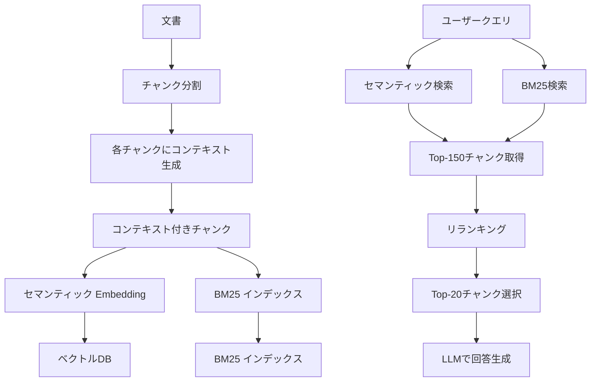

本記事は [Introducing Contextual Retrieval](https://www.anthropic.com/news/contextual-retrieval) の解説記事です。

## ブログ概要（Summary）

Anthropicは2024年9月、RAGシステムの検索精度を向上させる**Contextual Retrieval**手法を発表した。従来のRAGでは、文書をチャンクに分割する際にコンテキスト（どの文書の、どの部分に位置するか）が失われ、検索精度が低下する問題があった。Contextual Retrievalは各チャンクにLLMで生成したコンテキスト情報を付与し、セマンティック検索とBM25を組み合わせることで、Anthropicの報告によれば検索失敗率を最大67%削減する。

この記事は [Zenn記事: Gemini 2.0 Flash×コンテキストキャッシュで社内検索のコストとレイテンシを削減する実装手法](https://zenn.dev/0h_n0/articles/81e707a2ab8751) の深掘りです。

## 情報源

- **種別**: 企業テックブログ
- **URL**: [https://www.anthropic.com/news/contextual-retrieval](https://www.anthropic.com/news/contextual-retrieval)
- **組織**: Anthropic
- **著者**: Daniel Ford
- **発表日**: 2024年9月19日

## 技術的背景（Technical Background）

### RAGにおけるチャンキングの問題

RAGシステムでは、大量の文書をベクトルデータベースに格納するために、文書を小さなチャンク（通常500-1000トークン）に分割する。この分割時に**コンテキスト情報が失われる**問題がある。

Anthropicのブログでは以下の例が示されている：

> 元の文書: 「ACME社の2023年Q2決算報告書」の中のチャンク
> **コンテキストなしのチャンク**: "The company's revenue grew by 3% over the previous quarter."
> **問題**: どの会社の、いつの、どの四半期のデータなのかが不明

このコンテキスト喪失は、セマンティック検索（Embedding）でもBM25（キーワード検索）でも問題になる。ユーザーが「ACME社の2023年Q2の売上成長率は？」と質問した場合、上記のチャンクは関連性が高いにもかかわらず、「ACME」「2023」「Q2」といったキーワードが含まれていないため検索にヒットしにくい。

### Zenn記事との関連

Zenn記事では、Gemini 2.0 Flashの1Mトークンコンテキストウィンドウを活用して「全文書をコンテキストに含める」戦略を紹介している。しかし、社内Wikiが数千ページある場合には依然としてRAGによる事前検索が必要であり、その検索精度を向上させるContextual Retrievalは直接的に補完する技術である。

## 実装アーキテクチャ（Architecture）

### Contextual Retrievalのパイプライン



### コンテキスト生成の実装

Anthropicの手法では、各チャンクに対してLLMを使用して50-100トークンのコンテキスト情報を生成する。

```python
# contextual_retrieval.py
from anthropic import Anthropic


CONTEXT_PROMPT = """<document>
{whole_document}
</document>
上記の文書全体の中で、以下のチャンクが位置する文脈を簡潔に説明してください。
50-100トークンで、このチャンクが文書のどの部分に位置し、
何について述べているかのコンテキストを付与してください。

<chunk>
{chunk_text}
</chunk>
"""


def generate_context(
    client: Anthropic,
    whole_document: str,
    chunk_text: str,
    model: str = "claude-3-haiku-20240307",
) -> str:
    """チャンクにコンテキスト情報を付与する

    Args:
        client: Anthropic APIクライアント
        whole_document: チャンクが属する文書の全文
        chunk_text: コンテキストを付与するチャンク
        model: 使用するモデル（コスト効率のためHaiku推奨）

    Returns:
        コンテキスト付きチャンクテキスト
    """
    response = client.messages.create(
        model=model,
        max_tokens=200,
        messages=[{
            "role": "user",
            "content": CONTEXT_PROMPT.format(
                whole_document=whole_document,
                chunk_text=chunk_text,
            ),
        }],
    )

    context = response.content[0].text
    return f"{context}\n\n{chunk_text}"


def process_document_chunks(
    client: Anthropic,
    document: str,
    chunks: list[str],
) -> list[str]:
    """文書の全チャンクにコンテキストを付与する

    Args:
        client: Anthropic APIクライアント
        document: 文書の全文
        chunks: チャンクのリスト

    Returns:
        コンテキスト付きチャンクのリスト
    """
    contextualized_chunks = []
    for chunk in chunks:
        ctx_chunk = generate_context(client, document, chunk)
        contextualized_chunks.append(ctx_chunk)
    return contextualized_chunks
```

### コンテキスト生成の具体例

Anthropicのブログで示されている変換例：

**変換前（コンテキストなし）**:
```
The company's revenue grew by 3% over the previous quarter.
```

**変換後（コンテキスト付き）**:
```
This chunk is from an SEC filing on ACME corp's performance in Q2 2023;
the previous quarter's revenue was $314 million.

The company's revenue grew by 3% over the previous quarter.
```

このコンテキスト付与により、「ACME」「Q2 2023」「$314 million」というキーワードが追加され、セマンティック検索でもBM25検索でもヒット率が向上する。

## パフォーマンス最適化（Performance）

### ベンチマーク結果

Anthropicが報告するベンチマーク結果（ブログ記事より）。評価指標は検索失敗率（1 - recall@20、低いほど良い）：

| 構成 | 検索失敗率 | ベースラインからの改善 |
|------|-----------|---------------------|
| ベースライン（Embedding のみ） | 5.7% | — |
| Contextual Embeddings のみ | 3.7% | 35%削減 |
| Contextual Embeddings + BM25 | 2.9% | 49%削減 |
| Contextual Embeddings + BM25 + リランキング | 1.9% | **67%削減** |

**最良のEmbeddingモデル**: Anthropicの評価では、GeminiとVoyageのEmbeddingモデルが最も高い性能を示したと報告されている。

### コスト効率

Anthropicの報告によると、プロンプトキャッシュを使用した場合のコンテキスト生成コストは、**100万文書トークンあたり$1.02**（Claude 3 Haiku使用時）である。

$$
\text{コスト} = \frac{N_{\text{chunks}} \times (N_{\text{doc}} + N_{\text{chunk}}) \times P_{\text{cached}}}{10^6}
$$

ここで、
- $N_{\text{chunks}}$: チャンク数
- $N_{\text{doc}}$: 文書全体のトークン数
- $N_{\text{chunk}}$: 各チャンクのトークン数
- $P_{\text{cached}}$: キャッシュ済み入力のトークン単価

同一文書の複数チャンクを処理する際、文書全体のテキストをプロンプトキャッシュに格納することで、2回目以降のチャンク処理ではキャッシュ済みトークンの割引料金が適用される。

### Hybrid Search（セマンティック + BM25）の実装

```python
# hybrid_search.py
from dataclasses import dataclass


@dataclass
class SearchResult:
    """検索結果"""
    chunk_id: str
    text: str
    score: float
    source: str  # "semantic" or "bm25"


def hybrid_search(
    query: str,
    vector_db,
    bm25_index,
    top_k: int = 150,
    semantic_weight: float = 0.6,
    bm25_weight: float = 0.4,
) -> list[SearchResult]:
    """セマンティック検索とBM25のハイブリッド検索

    Args:
        query: 検索クエリ
        vector_db: ベクトルデータベースクライアント
        bm25_index: BM25インデックス
        top_k: 取得するチャンク数
        semantic_weight: セマンティック検索の重み
        bm25_weight: BM25検索の重み

    Returns:
        スコア順にソートされた検索結果リスト
    """
    # セマンティック検索
    semantic_results = vector_db.search(query, top_k=top_k)

    # BM25検索
    bm25_results = bm25_index.search(query, top_k=top_k)

    # スコアの正規化と統合
    all_chunks: dict[str, float] = {}

    # セマンティックスコアの正規化（min-max）
    if semantic_results:
        s_scores = [r.score for r in semantic_results]
        s_min, s_max = min(s_scores), max(s_scores)
        s_range = s_max - s_min if s_max != s_min else 1.0

        for r in semantic_results:
            normalized = (r.score - s_min) / s_range
            all_chunks[r.chunk_id] = (
                all_chunks.get(r.chunk_id, 0)
                + normalized * semantic_weight
            )

    # BM25スコアの正規化
    if bm25_results:
        b_scores = [r.score for r in bm25_results]
        b_min, b_max = min(b_scores), max(b_scores)
        b_range = b_max - b_min if b_max != b_min else 1.0

        for r in bm25_results:
            normalized = (r.score - b_min) / b_range
            all_chunks[r.chunk_id] = (
                all_chunks.get(r.chunk_id, 0)
                + normalized * bm25_weight
            )

    # スコア順にソート
    sorted_chunks = sorted(
        all_chunks.items(), key=lambda x: x[1], reverse=True
    )

    return [
        SearchResult(
            chunk_id=cid,
            text="",  # 実際にはDBから取得
            score=score,
            source="hybrid",
        )
        for cid, score in sorted_chunks[:top_k]
    ]
```

### リランキングの統合

Anthropicの報告によると、初期検索でTop-150チャンクを取得し、リランキングでTop-20に絞り込むパイプラインが最良の結果を示した。

```python
# reranking.py
def rerank_chunks(
    query: str,
    chunks: list[SearchResult],
    reranker,
    top_k: int = 20,
) -> list[SearchResult]:
    """チャンクをリランキングする

    Args:
        query: 検索クエリ
        chunks: 初期検索結果（Top-150程度）
        reranker: リランキングモデル（Cohere等）
        top_k: 最終的に返すチャンク数

    Returns:
        リランキング後のTop-Kチャンク
    """
    # リランカーで全チャンクを並列スコアリング
    rerank_results = reranker.rerank(
        query=query,
        documents=[c.text for c in chunks],
        top_n=top_k,
    )

    return [
        SearchResult(
            chunk_id=chunks[r.index].chunk_id,
            text=r.document,
            score=r.relevance_score,
            source="reranked",
        )
        for r in rerank_results
    ]
```

**トレードオフ**: リランキングは精度を向上させるが、レイテンシとコストが追加される。Anthropicの報告によると、150チャンクのリランキングには追加のAPI呼び出しが必要であり、レイテンシへの影響を考慮する必要がある。

## 運用での学び（Production Lessons）

Anthropicのブログから得られる運用上の知見：

1. **チャンクサイズの最適化**: チャンクのサイズ、境界、オーバーラップは性能に影響する。ドメインごとの検証が必要
2. **Top-20が最適**: Top-5やTop-10よりもTop-20チャンクをLLMに渡す方が回答品質が高いと報告されている
3. **ドメイン特化プロンプト**: コンテキスト生成プロンプトをドメインに特化させることで、汎用プロンプトよりも性能が向上する
4. **検索と生成の分離評価**: 検索精度と回答生成品質は別々に評価すべきである。検索が改善しても生成品質が必ず向上するとは限らない

## 学術研究との関連（Academic Connection）

- **RAG原論文（Lewis et al., 2020）**: RAGの基本概念を提案したMeta AI の研究。Contextual Retrievalはこの枠組みの「Retrieval」部分を改善する
- **HyDE（Gao et al., 2022）**: 仮説的な文書を生成してから検索する手法。Contextual Retrievalと異なりクエリ側の拡張
- **Self-RAG（Asai et al., 2024）**: 検索の必要性を自己判断するRAG。Contextual Retrievalの検索精度向上と組み合わせ可能

## まとめと実践への示唆

Contextual Retrievalは、RAGの検索精度をシンプルかつ効果的に改善する手法である。Anthropicの報告によれば、コンテキスト付きEmbedding + BM25 + リランキングの組み合わせで検索失敗率を67%削減できる。

Zenn記事で紹介されているVertex AI Search Groundingは検索精度向上のためのマネージドサービスであるが、セルフホスト環境やカスタムRAGパイプラインを構築する場合には、Contextual Retrievalの考え方を適用することで同等以上の検索精度を実現できる可能性がある。

## 参考文献

- **Blog URL**: [https://www.anthropic.com/news/contextual-retrieval](https://www.anthropic.com/news/contextual-retrieval)
- **Related Zenn article**: [https://zenn.dev/0h_n0/articles/81e707a2ab8751](https://zenn.dev/0h_n0/articles/81e707a2ab8751)
- **RAG原論文（Lewis et al.）**: [https://arxiv.org/abs/2005.11401](https://arxiv.org/abs/2005.11401)
- **HyDE（Gao et al.）**: [https://arxiv.org/abs/2212.10496](https://arxiv.org/abs/2212.10496)

---

:::message
この記事はAI（Claude Code）により自動生成されました。ブログの内容を正確に伝えることを心がけていますが、解釈の誤りがある可能性があります。正確な情報は原記事をご確認ください。
:::
