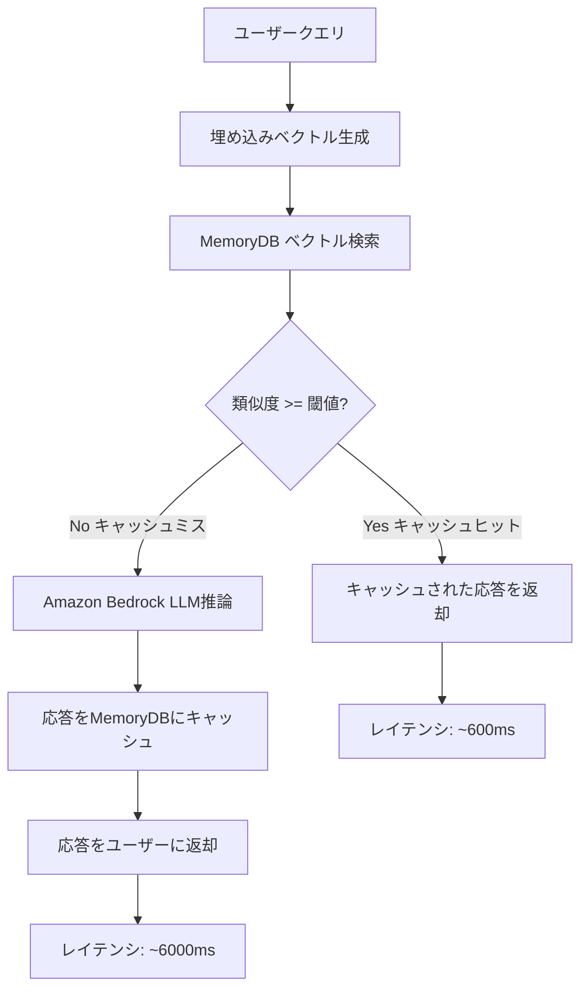

本記事は [AWS公式ブログ: Improve speed and reduce cost for generative AI workloads with a persistent semantic cache in Amazon MemoryDB](https://aws.amazon.com/blogs/database/improve-speed-and-reduce-cost-for-generative-ai-workloads-with-a-persistent-semantic-cache-in-amazon-memorydb/)（2024年公開）の解説記事です。

## ブログ概要（Summary）

AWSはAmazon MemoryDBのベクトル検索機能（2024年7月導入）を活用した永続的セマンティックキャッシュの構築手法を公式ブログで紹介している。ブログでは、Amazon Bedrockと組み合わせることで、LLM推論コストを最大86%削減し、レイテンシを最大88%改善できると報告されている。セマンティックキャッシュは、過去のクエリとベクトル的に類似した新規クエリに対してキャッシュされた応答を返すことで、不要なLLM呼び出しを回避する手法である。

この記事は [Zenn記事: ベクトルDB運用コスト最適化：Turbopuffer・LanceDB・pgvectorscale比較](https://zenn.dev/0h_n0/articles/7306026ebdfe23) の深掘りです。

## 情報源

- **種別**: 企業テックブログ（AWS公式）
- **URL**: [https://aws.amazon.com/blogs/database/improve-speed-and-reduce-cost-for-generative-ai-workloads-with-a-persistent-semantic-cache-in-amazon-memorydb/](https://aws.amazon.com/blogs/database/improve-speed-and-reduce-cost-for-generative-ai-workloads-with-a-persistent-semantic-cache-in-amazon-memorydb/)
- **組織**: Amazon Web Services (Database Team)
- **発表日**: 2024年（MemoryDBベクトル検索GA後）

## 技術的背景（Technical Background）

### なぜセマンティックキャッシュが必要か

生成AIアプリケーションでは、LLMの推論呼び出しがコストとレイテンシの主要なボトルネックになる。従来のキャッシュ（完全一致キャッシュ）では、同じクエリ文字列が来た場合のみヒットするが、自然言語クエリでは表現が異なっても意味が同じケースが多い。

AWSのブログによると、企業のLLMクエリの31%がセマンティックに類似した過去のリクエストと一致するという分析結果がある。AIエージェントの場合、1つのユーザーリクエストに対して5-15回のLLM呼び出しが発生するため、セマンティックキャッシュの効果はさらに大きくなる。

### Amazon MemoryDBの位置づけ

MemoryDBはRedis互換のインメモリデータベースで、マイクロ秒の読み取りレイテンシと低一桁ミリ秒の書き込みレイテンシを提供する。2024年7月にベクトル検索機能が追加され、95%以上のリコール率で最速のベクトル検索パフォーマンスを提供するとAWSは報告している。従来のRedisベースのキャッシュとは異なり、MemoryDBはMulti-AZレプリケーションによる耐久性を持つため、「永続的」セマンティックキャッシュとして機能する。

## 実装アーキテクチャ（Architecture）

### セマンティックキャッシュのフロー

AWSブログで説明されているアーキテクチャは以下の通りである。



### ベクトル類似度の判定

セマンティックキャッシュの核心は、新規クエリのベクトルと過去のクエリのベクトルの類似度を計算し、閾値以上であればキャッシュヒットとする部分である。

$$
\text{similarity}(\mathbf{q}_{\text{new}}, \mathbf{q}_{\text{cached}}) = \frac{\mathbf{q}_{\text{new}} \cdot \mathbf{q}_{\text{cached}}}{|\mathbf{q}_{\text{new}}| \cdot |\mathbf{q}_{\text{cached}}|}
$$

ここで、
- $\mathbf{q}_{\text{new}}$: 新規クエリの埋め込みベクトル
- $\mathbf{q}_{\text{cached}}$: キャッシュされたクエリの埋め込みベクトル
- 類似度が閾値$\tau$（典型的には0.90-0.98）以上ならキャッシュヒット

### 実装例

AWSブログの内容を基にした実装パターンを以下に示す。

```python
import json
import hashlib
from typing import Any

import boto3
import numpy as np
import redis


class AWSSemanticCache:
    """Amazon MemoryDB + Bedrock によるセマンティックキャッシュ"""

    def __init__(
        self,
        memorydb_host: str,
        memorydb_port: int = 6379,
        similarity_threshold: float = 0.95,
        ttl_seconds: int = 3600,
        embedding_model_id: str = "amazon.titan-embed-text-v2:0",
        llm_model_id: str = "anthropic.claude-3-5-haiku-20241022-v1:0",
    ):
        self._redis = redis.Redis(
            host=memorydb_host,
            port=memorydb_port,
            ssl=True,
            decode_responses=False,
        )
        self._bedrock = boto3.client("bedrock-runtime")
        self._threshold = similarity_threshold
        self._ttl = ttl_seconds
        self._embedding_model = embedding_model_id
        self._llm_model = llm_model_id

        # ベクトルインデックスの作成（初回のみ）
        self._ensure_index()

    def _ensure_index(self) -> None:
        """MemoryDBのベクトルインデックスを作成"""
        try:
            self._redis.execute_command(
                "FT.CREATE", "cache_idx",
                "ON", "HASH",
                "PREFIX", "1", "cache:",
                "SCHEMA",
                "query_vector", "VECTOR", "HNSW", "6",
                "TYPE", "FLOAT32",
                "DIM", "1024",
                "DISTANCE_METRIC", "COSINE",
                "query_text", "TEXT",
                "response", "TEXT",
            )
        except redis.ResponseError:
            pass  # インデックスが既に存在する場合

    def _get_embedding(self, text: str) -> list[float]:
        """Bedrock Titan Embeddingsでベクトル生成"""
        response = self._bedrock.invoke_model(
            modelId=self._embedding_model,
            body=json.dumps({"inputText": text}),
        )
        result = json.loads(response["body"].read())
        return result["embedding"]

    def _generate_response(self, query: str) -> str:
        """Bedrock LLMで応答生成"""
        response = self._bedrock.invoke_model(
            modelId=self._llm_model,
            body=json.dumps({
                "anthropic_version": "bedrock-2023-05-31",
                "max_tokens": 1024,
                "messages": [{"role": "user", "content": query}],
            }),
        )
        result = json.loads(response["body"].read())
        return result["content"][0]["text"]

    def query(self, user_query: str) -> dict[str, Any]:
        """セマンティックキャッシュ付きクエリ"""
        # 1. クエリをベクトル化
        query_vector = self._get_embedding(user_query)
        vector_bytes = np.array(
            query_vector, dtype=np.float32
        ).tobytes()

        # 2. MemoryDBでベクトル検索（KNN）
        results = self._redis.execute_command(
            "FT.SEARCH", "cache_idx",
            f"*=>[KNN 1 @query_vector $vec AS score]",
            "PARAMS", "2", "vec", vector_bytes,
            "RETURN", "3", "query_text", "response", "score",
            "DIALECT", "2",
        )

        # 3. 類似度チェック
        if results and len(results) > 1:
            score = float(results[2][5])
            similarity = 1.0 - score  # COSINE distanceからsimilarityへ変換
            if similarity >= self._threshold:
                return {
                    "response": results[2][3].decode(),
                    "cache_hit": True,
                    "similarity": similarity,
                }

        # 4. キャッシュミス → LLM推論
        response = self._generate_response(user_query)

        # 5. キャッシュに格納
        cache_key = f"cache:{hashlib.sha256(user_query.encode()).hexdigest()[:16]}"
        self._redis.hset(
            cache_key,
            mapping={
                "query_text": user_query,
                "query_vector": vector_bytes,
                "response": response,
            },
        )
        self._redis.expire(cache_key, self._ttl)

        return {
            "response": response,
            "cache_hit": False,
            "similarity": 0.0,
        }
```

## パフォーマンス最適化（Performance）

### 実測値（AWSブログの報告による）

| 指標 | キャッシュミス | キャッシュヒット | 改善率 |
|------|-------------|--------------|--------|
| レイテンシ | 6,000ms (6秒) | 600ms (0.6秒) | 10倍 |
| LLM推論コスト | 100% | 0% | 100%削減/ヒット |
| 埋め込みコスト | 発生 | 発生 | 変化なし |

### キャッシュヒット率とコスト削減の関係

AWSブログでは、キャッシュヒット率とコスト削減率の関係について以下の数値が報告されている:

- **25%ヒット率**: 最大23%のコスト削減
- **高ヒット率シナリオ**: 最大86%のLLM推論コスト削減

```python
def estimate_cost_savings(
    monthly_queries: int,
    cache_hit_rate: float,
    cost_per_llm_call: float,
    cost_per_embedding: float,
    memorydb_monthly_cost: float,
) -> dict[str, float]:
    """キャッシュヒット率に基づくコスト削減の試算

    Args:
        monthly_queries: 月間クエリ数
        cache_hit_rate: キャッシュヒット率（0.0-1.0）
        cost_per_llm_call: LLM呼び出し1回のコスト
        cost_per_embedding: 埋め込み生成1回のコスト
        memorydb_monthly_cost: MemoryDB月額コスト

    Returns:
        コスト比較の辞書
    """
    # キャッシュなしのコスト
    no_cache_cost = monthly_queries * (
        cost_per_llm_call + cost_per_embedding
    )

    # キャッシュありのコスト
    cache_misses = monthly_queries * (1 - cache_hit_rate)
    cache_hits = monthly_queries * cache_hit_rate
    with_cache_cost = (
        cache_misses * (cost_per_llm_call + cost_per_embedding)
        + monthly_queries * cost_per_embedding  # 全クエリで埋め込み生成
        + memorydb_monthly_cost
    )

    savings = no_cache_cost - with_cache_cost
    savings_pct = (savings / no_cache_cost) * 100

    return {
        "without_cache": no_cache_cost,
        "with_cache": with_cache_cost,
        "savings": savings,
        "savings_percent": savings_pct,
    }


# 試算例
result = estimate_cost_savings(
    monthly_queries=1_000_000,
    cache_hit_rate=0.50,
    cost_per_llm_call=0.003,       # Claude 3.5 Haiku概算
    cost_per_embedding=0.0001,      # Titan Embeddings概算
    memorydb_monthly_cost=200,      # db.r7g.large
)
for k, v in result.items():
    print(f"{k}: ${v:,.2f}" if isinstance(v, float) else f"{k}: {v}")
```

## 運用での学び（Production Lessons）

### 閾値チューニングの重要性

セマンティックキャッシュの品質は類似度閾値の設定に大きく依存する。AWSブログおよび関連資料から得られるガイドラインは以下の通りである。

| 閾値 | ヒット率 | 精度リスク | 推奨ユースケース |
|------|---------|----------|----------------|
| 0.98+ | 低い | 最小 | 事実検索、金融データ |
| 0.95 | 中 | 低 | 一般的なQ&A、カスタマーサポート |
| 0.90 | 高い | 中 | 創造的タスク、ドラフト生成 |
| 0.85以下 | 非常に高い | 高い | 非推奨（不正確な応答リスク） |

### TTL（有効期限）の設計

キャッシュの有効期限は、情報の鮮度要件に応じて設定する:
- **短期** (300-900秒): リアルタイムデータを参照するRAGアプリケーション
- **中期** (1-24時間): 一般的なナレッジベースQ&A
- **長期** (1-7日): 静的なFAQ、マニュアル参照

### マルチテナント環境での考慮事項

Zenn記事のマルチテナント設計パターンと組み合わせる場合、テナントIDをキャッシュキーのプレフィックスに含めることで、テナント間のキャッシュ汚染を防ぐ必要がある。

```python
# テナント分離されたキャッシュキー
cache_key = f"cache:{tenant_id}:{query_hash}"
```

## 学術研究との関連（Academic Connection）

### セマンティックキャッシュの研究基盤

- **GPTCache (Zilliz, 2023)**: オープンソースのセマンティックキャッシュフレームワーク。MemoryDBブログのアプローチはGPTCacheの設計パターンに基づいている
- **Cache Saver (OpenReview, 2024)**: モジュラーなキャッシュフレームワークで、キャッシュの品質評価メトリクスを提案
- **Efficient RAG with Tiered Caching (arXiv:2401.07248)**: RAGパイプライン向けの階層型キャッシュ。ホットベクトルをDRAMに、コールドベクトルをSSD/オブジェクトストレージに配置

### AIエージェント時代の意義

Zenn記事で引用されている「AIエージェントは人間ユーザーの10倍のクエリを生成する」という予測に対して、セマンティックキャッシュは直接的な対策となる。エージェントが発行するクエリの多くは類似パターンの繰り返しであり、キャッシュヒット率が高くなりやすい。

## Production Deployment Guide

### AWS実装パターン（コスト最適化重視）

セマンティックキャッシュを含むRAGパイプラインのAWS構成を示す。

**トラフィック量別の推奨構成**:

| 規模 | 月間リクエスト | 推奨構成 | 月額コスト | 主要サービス |
|------|--------------|---------|-----------|------------|
| **Small** | ~3,000 (100/日) | Serverless | $100-250 | Lambda + Bedrock + ElastiCache Serverless |
| **Medium** | ~30,000 (1,000/日) | Hybrid | $500-1,200 | ECS Fargate + MemoryDB + Bedrock |
| **Large** | 300,000+ (10,000/日) | Container | $3,000-7,000 | EKS + MemoryDB Cluster + Bedrock Batch |

**コスト試算の注意事項**:
- 上記は2026年3月時点のAWS ap-northeast-1（東京）リージョン料金に基づく概算値です
- 実際のコストはトラフィックパターン、リージョン、バースト使用量により変動します
- 最新料金は [AWS料金計算ツール](https://calculator.aws/) で確認してください

### Terraformインフラコード

**Small構成 (Serverless): Lambda + ElastiCache Serverless**

```hcl
module "vpc" {
  source  = "terraform-aws-modules/vpc/aws"
  version = "~> 5.0"

  name = "semantic-cache-vpc"
  cidr = "10.0.0.0/16"
  azs  = ["ap-northeast-1a", "ap-northeast-1c"]
  private_subnets = ["10.0.1.0/24", "10.0.2.0/24"]

  enable_nat_gateway   = false
  enable_dns_hostnames = true
}

resource "aws_elasticache_serverless_cache" "semantic_cache" {
  engine = "valkey"
  name   = "semantic-cache"

  cache_usage_limits {
    data_storage {
      maximum = 5
      unit    = "GB"
    }
    ecpu_per_second {
      maximum = 5000
    }
  }

  security_group_ids = [aws_security_group.cache_sg.id]
  subnet_ids         = module.vpc.private_subnets
}

resource "aws_security_group" "cache_sg" {
  name_prefix = "semantic-cache-"
  vpc_id      = module.vpc.vpc_id

  ingress {
    from_port   = 6379
    to_port     = 6379
    protocol    = "tcp"
    cidr_blocks = module.vpc.private_subnets_cidr_blocks
  }
}

resource "aws_lambda_function" "rag_handler" {
  filename      = "lambda.zip"
  function_name = "rag-semantic-cache-handler"
  role          = aws_iam_role.lambda_role.arn
  handler       = "index.handler"
  runtime       = "python3.12"
  timeout       = 120
  memory_size   = 1024

  vpc_config {
    subnet_ids         = module.vpc.private_subnets
    security_group_ids = [aws_security_group.lambda_sg.id]
  }

  environment {
    variables = {
      CACHE_ENDPOINT        = aws_elasticache_serverless_cache.semantic_cache.endpoint[0].address
      SIMILARITY_THRESHOLD  = "0.95"
      CACHE_TTL_SECONDS     = "3600"
      BEDROCK_MODEL_ID      = "anthropic.claude-3-5-haiku-20241022-v1:0"
      EMBEDDING_MODEL_ID    = "amazon.titan-embed-text-v2:0"
    }
  }
}
```

### セキュリティベストプラクティス

1. **ネットワーク**: MemoryDB/ElastiCacheはVPCプライベートサブネット内に配置
2. **暗号化**: 転送中（TLS 1.2+）および保管中（KMS）の暗号化を有効化
3. **認証**: MemoryDBのACL（アクセス制御リスト）でアクセスを制限
4. **PII保護**: キャッシュに格納する応答からPII（個人情報）を除去するフィルタを実装

### 運用・監視設定

```python
import boto3

cloudwatch = boto3.client('cloudwatch')

# キャッシュヒット率の監視
cloudwatch.put_metric_alarm(
    AlarmName='semantic-cache-hit-rate-low',
    ComparisonOperator='LessThanThreshold',
    EvaluationPeriods=3,
    MetricName='CacheHitRate',
    Namespace='SemanticCache',
    Period=300,
    Statistic='Average',
    Threshold=20.0,
    AlarmDescription='セマンティックキャッシュヒット率が20%未満（閾値調整を検討）'
)

# MemoryDBメモリ使用率の監視
cloudwatch.put_metric_alarm(
    AlarmName='memorydb-memory-usage-high',
    ComparisonOperator='GreaterThanThreshold',
    EvaluationPeriods=2,
    MetricName='DatabaseMemoryUsagePercentage',
    Namespace='AWS/MemoryDB',
    Period=300,
    Statistic='Average',
    Threshold=80.0,
    AlarmDescription='MemoryDBメモリ使用率80%超過（スケールアップ検討）'
)
```

### コスト最適化チェックリスト

- [ ] 類似度閾値の適切な設定（0.90-0.98の範囲で調整）
- [ ] TTLの最適化（データ鮮度 vs ヒット率のバランス）
- [ ] テナント別キャッシュキーの分離
- [ ] ElastiCache Serverlessの活用（低トラフィック時）
- [ ] Bedrock Batch APIの活用（非リアルタイム処理）
- [ ] キャッシュヒット率のモニタリングとアラート設定
- [ ] AWS Budgets設定（月額予算80%で警告）
- [ ] PII除去フィルタの実装

## まとめと実践への示唆

AWSのセマンティックキャッシュブログは、Zenn記事で紹介されているセマンティックキャッシュの概念を、AWSのマネージドサービスを使って具体的に実装する方法を示したものである。ブログでは、キャッシュヒット時のレイテンシが600ms（LLM推論の6秒から10倍改善）、LLM推論コストの最大86%削減が可能であると報告されている。

Zenn記事のセマンティックキャッシュ実装例（Redis + NumPy）に対して、本ブログはMemoryDBの永続性とベクトル検索機能を活用した本番グレードの実装パターンを提供しており、特にマルチAZレプリケーションによるキャッシュの耐久性が差別化ポイントである。

## 参考文献

- **Blog URL**: [Improve speed and reduce cost for generative AI workloads with a persistent semantic cache in Amazon MemoryDB](https://aws.amazon.com/blogs/database/improve-speed-and-reduce-cost-for-generative-ai-workloads-with-a-persistent-semantic-cache-in-amazon-memorydb/)
- **ElastiCache Semantic Cache Blog**: [Lower cost and latency for AI using Amazon ElastiCache](https://aws.amazon.com/blogs/database/lower-cost-and-latency-for-ai-using-amazon-elasticache-as-a-semantic-cache-with-amazon-bedrock/)
- **re:Invent 2024 DAT329**: [Optimize gen AI apps with durable semantic caching in Amazon MemoryDB](https://d1.awsstatic.com/onedam/marketing-channels/website/aws/en_US/events/approved/reinvent-2025/reinvent/2024/slides/dat/DAT329_Optimize-gen-AI-apps-with-durable-semantic-caching-in-Amazon-MemoryDB.pdf)
- **Related Zenn article**: [https://zenn.dev/0h_n0/articles/7306026ebdfe23](https://zenn.dev/0h_n0/articles/7306026ebdfe23)
