本記事は [JetBrains Research Blog: Cutting Through the Noise: Smarter Context Management for LLM-Powered Agents](https://blog.jetbrains.com/research/2025/12/efficient-context-management/)（Fraser & Lindenbauer, NeurIPS 2025 Workshop）の解説記事です。

## ブログ概要（Summary）

LLMエージェントのコンテキストはターンを重ねるごとに肥大化し、コストと性能の両面で問題を引き起こす。JetBrains Researchは、SWE-bench Verified（500インスタンス）を用いて**Observation Masking**と**LLM Summarization**の2つのコンテキスト管理戦略を体系的に比較し、シンプルなObservation Maskingが「総合効率と信頼性」で優れることを報告している。両手法とも50%以上のコスト削減を達成したが、LLM要約は意図しないトラジェクトリの延長を引き起こすリスクがあると指摘されている。

この記事は [Zenn記事: LLM会話スレッド管理の本番設計 Redis・PostgreSQL・3大APIパターン比較](https://zenn.dev/0h_n0/articles/d741db8cb57195) の深掘りです。

## 情報源

- **種別**: 企業テックブログ / NeurIPS 2025 Workshop (Deep Learning 4 Code) 論文
- **URL**: [https://blog.jetbrains.com/research/2025/12/efficient-context-management/](https://blog.jetbrains.com/research/2025/12/efficient-context-management/)
- **組織**: JetBrains Research
- **著者**: Katie Fraser (JetBrains Research), Tobias Lindenbauer (TUM)
- **発表**: NeurIPS 2025 Workshop on Deep Learning 4 Code（2025年12月6日、サンディエゴ）

## 技術的背景（Technical Background）

LLMエージェントは各ステップで推論（reasoning）、アクション（action）、観察（observation）の3つのコンポーネントを生成する。これらが累積的にコンテキストに追加されるため、ターン数が増えるとコンテキストが急速に肥大化する。

ブログでは「エージェントは生成した全出力をメモとしてコンテキストに追加し、巨大で高コストなメモリログを作成する」と問題を指摘している。コンテキストウィンドウの上限に達するだけでなく、不要な情報がLLMの判断を妨げる。

この問題は、Zenn記事で解説した会話履歴の肥大化問題と本質的に同じである。Zenn記事ではスライディングウィンドウ、LLM要約、トークンバジェット制御の3戦略を紹介したが、本ブログではこのうちObservation Masking（スライディングウィンドウの変形）とLLM Summarization（LLM要約）を実験的に比較している。

## 実装アーキテクチャ（Architecture）

### 2つのコンテキスト管理戦略

```mermaid
flowchart TD
    subgraph Raw["Raw Agent（ベースライン）"]
        R1[Turn 1: Reasoning + Action + Observation]
        R2[Turn 2: Reasoning + Action + Observation]
        R3[Turn N: Reasoning + Action + Observation]
        R1 --> R2 --> R3
    end

    subgraph Masking["Observation Masking"]
        M1[Turn 1: Reasoning + Action + MASKED]
        M2[Turn 2: Reasoning + Action + MASKED]
        M3[Turn N: Reasoning + Action + Observation]
        M1 --> M2 --> M3
    end

    subgraph Summary["LLM Summarization"]
        S1[Summary of Turns 1-21]
        S2[Turn 22: Full]
        S3[Turn N: Full]
        S1 --> S2 --> S3
    end
```



### Observation Masking

環境からの観察（Observation）のみをマスクし、推論とアクションの履歴は完全に保持する方式。SWE-agentの実装に基づいている。

**仕組み**: ローリングウィンドウで直近のNターンの観察のみ保持し、それより古い観察をプレースホルダーに置換する。

**設定**: 最適ウィンドウサイズは**10ターン**（ブログの実験結果に基づく）

**特徴**:
- 推論・アクション履歴が完全に残るため、エージェントは「何をしたか」を常に把握できる
- 古い「何が見えたか」（ファイル内容、コマンド出力等）のみが失われる
- 追加のLLM呼び出しが不要で、コスト効率が高い

**制約**: ターン数が無限に増加すると、推論＋アクション履歴だけでもコンテキストが肥大化する。理論的には無限スケーリングに対応できない。

### LLM Summarization

対話履歴全体をLLMで要約し、直近のターンは完全に保持する方式。OpenHandsの実装に基づいている。

**仕組み**: 21ターンごとに要約を生成し、直近10ターンは非圧縮で保持する。

**特徴**:
- 理論的には無限のターン数に対応可能（要約は定サイズ）
- 推論・アクション・観察すべてを圧縮するため、情報の網羅性が高い

**制約**:
- 要約生成にLLM呼び出しが必要（追加コスト）
- 要約が「停止すべきシグナル」を平滑化してしまうリスクがある

## パフォーマンス最適化（Performance）

### コスト削減効果

ブログでは両手法とも**50%以上**のコスト削減を報告している。

- **Observation Masking**: Qwen3-Coder 480Bで平均52%のコスト削減
- **LLM Summarization**: 同程度のコスト削減だが、要約生成コスト（インスタンスあたり最大7%）が追加で発生

### 解決率への影響

Observation Maskingはベースラインに対して+2.6%の解決率改善を示している。5つのテスト設定のうち4つで、Observation Maskingのほうがコスト効率が高く、かつ性能も良好であったとブログは報告している。

### トラジェクトリ延長問題

LLM Summarizationの重要な副作用として、**トラジェクトリの延長**が報告されている。

- **Gemini 2.5 Flash**: 要約ありで平均ラン長が15%延長（52ターン vs ベースライン）
- **Qwen3-Coder 480B**: 13-15%のトラジェクトリ延長

ブログではこの原因を「要約がエージェントの停止シグナルを平滑化（smooth over）してしまい、最適な停止ポイントを過ぎても処理を継続する」ためと分析している。Zenn記事のLLM要約圧縮戦略を採用する際も、この副作用に注意が必要である。

### プロンプトキャッシュとの相互作用

ブログではLLM要約の重要な制約として、**プロンプトキャッシュの再利用性が低下する**点を指摘している。要約が挿入されると以前のキャッシュが無効化されるため、Zenn記事で解説したAnthropicのprompt cachingやOpenAIの自動キャッシュの効果が減少する。

## 運用での学び（Production Lessons）

### 実験で使用したモデル

| モデル | パラメータ数 | 種別 |
|--------|-----------|------|
| **Qwen3** | 32B | オープンウェイト |
| **Gemini 2.5 Flash** | 480B | プロプライエタリ |

### 「シンプルさが勝つ」という知見

ブログの最も重要な結論は「Simplicity often takes the prize for total efficiency and reliability（シンプルさが総合効率と信頼性でしばしば勝つ）」である。

高度なLLM要約よりもシンプルなObservation Maskingのほうが:
- コストが低い（追加LLM呼び出しなし）
- 信頼性が高い（停止シグナルの平滑化なし）
- 実装が容易（ウィンドウサイズの設定のみ）

### ハイブリッド戦略の提案

ブログではObservation Maskingを主軸とし、選択的にLLM要約を組み合わせる**ハイブリッド戦略**を提案している。

- **Observation Masking**: デフォルトのコンテキスト管理として使用
- **LLM Summarization**: Maskingだけでは対応できない極端に長いセッションのみ補助的に使用

この提案は、Zenn記事で解説した「スライディングウィンドウ（基本）+ LLM要約（長期対話）」の併用戦略と一致しており、実験的な裏付けを提供している。

## Zenn記事のCompaction戦略との対応

| Zenn記事の戦略 | 本ブログの戦略 | 効果 |
|--------------|-------------|------|
| スライディングウィンドウ | Observation Masking | コスト52%削減、解決率+2.6% |
| LLM要約圧縮 | LLM Summarization | コスト50%削減、ただしトラジェクトリ15%延長 |
| トークンバジェット制御 | （直接対応なし） | — |

Zenn記事のスライディングウィンドウ戦略は「直近N件のメッセージのみ保持」としているが、本ブログの知見に基づけば、**観察（出力結果）のみをマスクし、推論とアクションは保持する**ほうが情報損失が少なく効果的であることが示されている。

## 本番会話管理への実装示唆

### ウィンドウサイズの選定ガイドライン

ブログの実験結果に基づくと、Observation Maskingの最適ウィンドウサイズは10ターンであった。ただし、これはSWE-benchのソフトウェアエンジニアリングタスクに最適化された値であり、会話管理では以下のように調整が必要である。

```python
from dataclasses import dataclass


@dataclass
class ObservationMaskingConfig:
    """Observation Masking設定（ユースケース別推奨値）"""

    # カスタマーサポート: 短い会話、最近の文脈が重要
    customer_support_window: int = 5

    # コーディングアシスタント: 中程度、コード出力の参照が必要
    coding_assistant_window: int = 10

    # プロジェクト管理エージェント: 長期文脈が重要
    project_management_window: int = 20


def apply_observation_masking(
    messages: list[dict],
    window_size: int = 10,
) -> list[dict]:
    """Observation Maskingの実装例

    Args:
        messages: 会話履歴（role, content, type を含む）
        window_size: 直近何ターンの観察を保持するか

    Returns:
        マスク適用済みメッセージリスト
    """
    result = []
    # ターンのインデックスを逆順で計算
    turn_count = sum(1 for m in messages if m.get("type") == "observation")

    obs_index = 0
    for msg in messages:
        if msg.get("type") == "observation":
            obs_index += 1
            if obs_index <= turn_count - window_size:
                # 古い観察をマスク
                result.append({
                    "role": msg["role"],
                    "content": "[観察結果は省略されました]",
                    "type": "observation",
                })
                continue
        result.append(msg)

    return result
```

### コスト効率の定量比較

ブログの実験データに基づく、各戦略のコスト効率の整理:

| 戦略 | コスト削減 | 解決率変化 | 追加LLM呼び出し | プロンプトキャッシュ互換性 |
|------|----------|-----------|---------------|----------------------|
| ベースライン | 0% | 基準 | なし | 高い |
| Observation Masking | -52% | +2.6% | なし | 高い（履歴が安定） |
| LLM Summarization | -50% | ±0% | あり（コストの7%） | 低い（要約で無効化） |
| ハイブリッド | -50%以上 | +1-2% | 最小限 | 中程度 |

Zenn記事で解説したAnthropicのprompt caching（キャッシュヒット時90%コスト削減）を活用する場合、Observation Maskingのほうがキャッシュヒット率を維持しやすいため、実質的なコスト削減効果はさらに大きくなる。

## 学術研究との関連（Academic Connection）

- **SWE-bench**（Jimenez et al., 2024, ICLR 2024）: ソフトウェアエンジニアリングタスクのベンチマーク。本ブログの評価基盤
- **ReAct**（Yao et al., 2023, ICLR 2023）: 推論＋行動のフレームワーク。本ブログの実験で使用されるエージェントスキャフォールド
- **CodeAct**（Wang et al., 2024）: コード実行ベースのエージェントアクション。ReActの拡張としてベースラインに使用

## まとめと実践への示唆

JetBrains Researchは、SWE-bench Verifiedでの体系的な実験を通じて、Observation MaskingがLLM Summarizationよりも「総合効率と信頼性」で優れることを報告した。両手法とも50%以上のコスト削減を達成するが、LLM要約にはトラジェクトリ延長やプロンプトキャッシュ無効化の副作用がある。Zenn記事のCompaction戦略を本番実装する際は、まずObservation Masking（スライディングウィンドウの変形）を基本とし、必要に応じてLLM要約を補助的に使用するハイブリッドアプローチが推奨される。

## 参考文献

- **Blog URL**: [https://blog.jetbrains.com/research/2025/12/efficient-context-management/](https://blog.jetbrains.com/research/2025/12/efficient-context-management/)
- **NeurIPS 2025 Workshop**: Deep Learning 4 Code (December 6, 2025, San Diego)
- **Related Zenn article**: [https://zenn.dev/0h_n0/articles/d741db8cb57195](https://zenn.dev/0h_n0/articles/d741db8cb57195)

---

:::message
本記事はAI（Claude Code）により自動生成されました。内容の正確性については公式ブログもあわせてご確認ください。
:::
