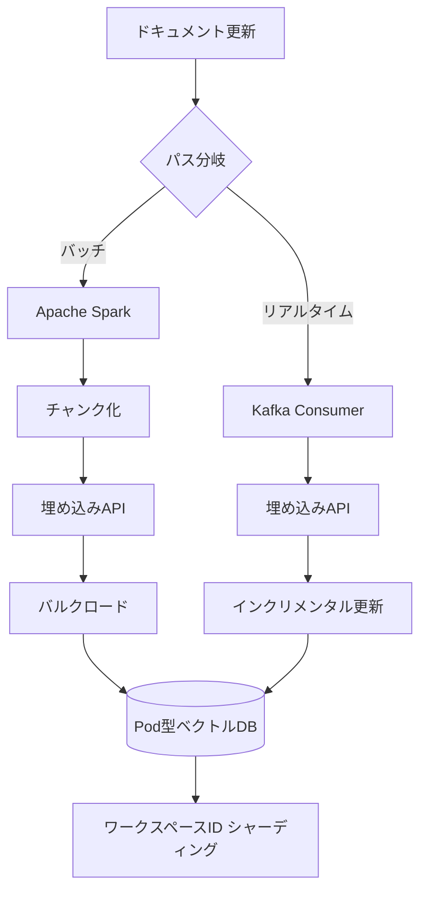
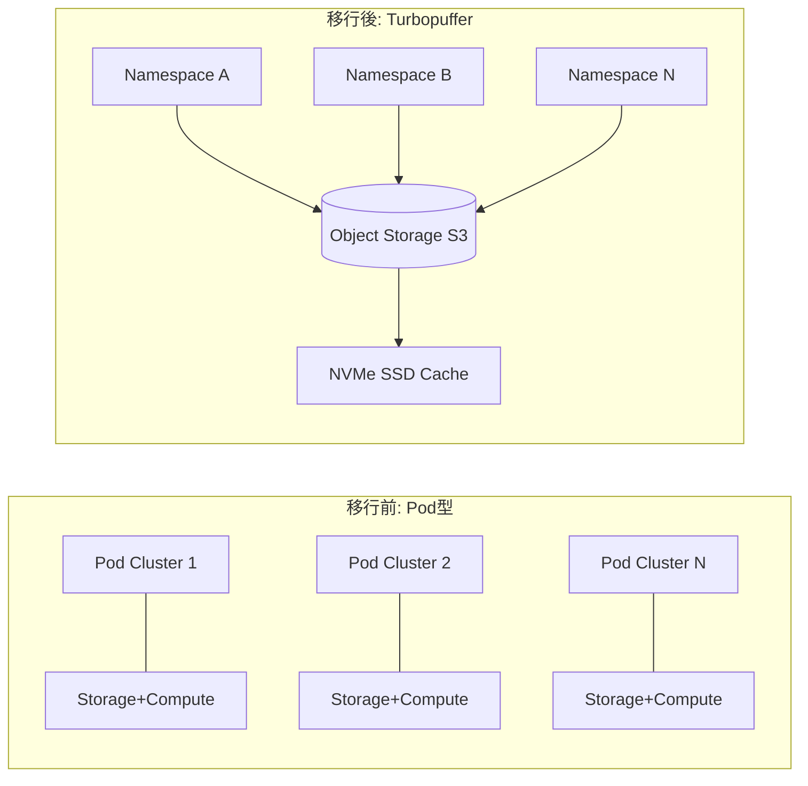
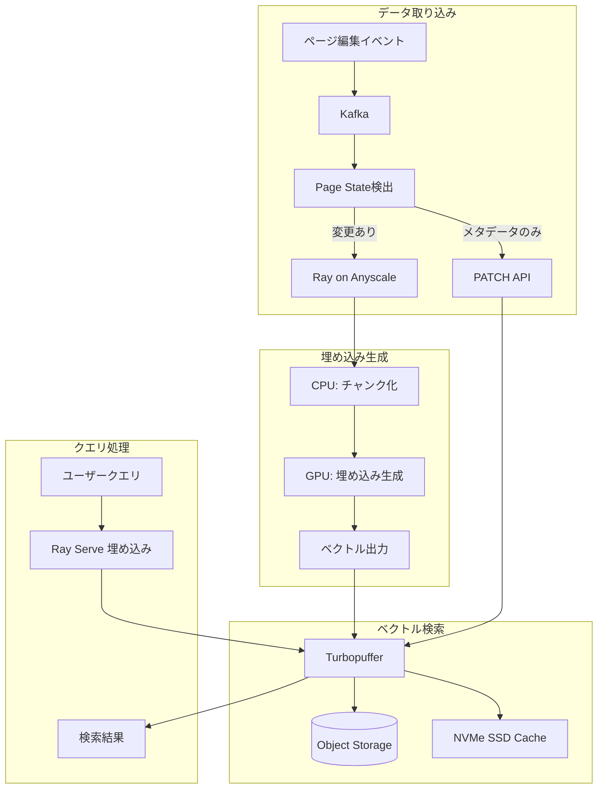

本記事は [Notion公式ブログ: Two years of vector search at Notion: 10x scale, 1/10th cost](https://www.notion.com/blog/two-years-of-vector-search-at-notion)（2026年2月19日公開）の解説記事です。

## ブログ概要（Summary）

Notionは2023年11月のNotion AI Q&Aローンチ以降、ベクトル検索基盤を10倍にスケールしながらインフラコストを90%以上削減したと報告している。この2年間で、Pod型アーキテクチャからサーバーレス移行、Turbopufferへの全面移行、Page Stateキャッシュ、Ray/Anyscaleによる埋め込み生成パイプラインの刷新という4つのフェーズを経て段階的に最適化を実施した。数百万ワークスペースの待機リストを解消し、検索エンジンコストの60%削減、埋め込みインフラコストの90%以上削減を達成したとされる。

この記事は [Zenn記事: ベクトルDB運用コスト最適化：Turbopuffer・LanceDB・pgvectorscale比較](https://zenn.dev/0h_n0/articles/7306026ebdfe23) の深掘りです。

## 情報源

- **種別**: 企業テックブログ
- **URL**: [https://www.notion.com/blog/two-years-of-vector-search-at-notion](https://www.notion.com/blog/two-years-of-vector-search-at-notion)
- **組織**: Notion（インフラチーム）
- **著者**: Preeti Gondi, Mickey Liu, Nathan Louie, Calder Lund, Jacob Sager
- **発表日**: 2026年2月19日

## 技術的背景（Technical Background）

Notionはワークスペース内のドキュメント、データベース、Slack連携、Google Drive連携など多様なコンテンツに対してセマンティック検索を提供している。ユーザーの自然言語クエリに対して、キーワードマッチングではなく意味的に近いコンテンツを返す必要がある。これはRAG（Retrieval-Augmented Generation）パイプラインの基盤として機能しており、ベクトル埋め込みを用いた類似度検索が中核技術である。

2023年11月のNotion AI Q&Aローンチ時には、数百万ワークスペースの待機リストが存在し、急激なスケーリングが求められた。同時に、Pod型アーキテクチャ（ストレージとコンピュートが結合）の制約により、コスト効率が大きな課題となっていた。

## 初期アーキテクチャ（2023年11月ローンチ時）

### デュアルパス・インデキシングパイプライン

Notionのブログによれば、ローンチ時のアーキテクチャは2つのパスで構成されていた。

**オフラインパス**: Apache Sparkバッチジョブが既存ドキュメントをチャンク化し、埋め込みAPIで変換し、ベクトルDBにバルクロードする処理を担当していた。

**オンラインパス**: Kafkaコンシューマがリアルタイムのページ編集を処理し、サブ分単位のレイテンシで埋め込みを更新していた。

**シャーディング戦略**: ワークスペースIDをパーティショニングキーとし、レンジベースのルーティングで適切なインデックスにクエリを振り分けるマルチテナント設計が採用されていた。



### Pod型アーキテクチャの課題

ブログによると、Pod型クラスタではストレージとコンピュートが結合しており、インデックスが容量上限に近づくと新しい「世代（Generation）」をプロビジョニングする必要があった。これはリシャーディングによるダウンタイムを避けるための選択だったが、運用の複雑さとコスト増大を招いていた。

## コスト最適化の4つのフェーズ

### フェーズ1: サーバーレス移行（2024年5月）

ブログでは、2024年5月にPod型アーキテクチャからサーバーレスアーキテクチャへ移行したと報告されている。ストレージとコンピュートを分離し、アップタイムベースの課金から使用量ベースの課金へ切り替えた。

**定量的成果**（ブログの記述による）:
- ピーク使用量からの**50%コスト削減**
- **年間数百万ドル規模**の節約
- ストレージ容量制約の解消

### フェーズ2: Turbopuffer移行（2024年5月〜2025年1月）

Notionのブログによると、2024年5月にTurbopufferの評価を開始し、2024年後半に全ワークロード（数十億ベクトルオブジェクト）の移行を完了した。

**Turbopufferを選択した理由**（ブログの記述による）:
- オブジェクトストレージベースでコスト効率が高い
- マネージドおよびBYOC（Bring Your Own Cloud）デプロイメントをサポート
- 名前空間（Namespace）ベースのアーキテクチャにより、従来のシャーディング設計が不要になった
- ベクトルオブジェクトのバルク変更をサポート

**定量的成果**（ブログの記述による）:
- 検索エンジンコスト**60%削減**
- AWS EMRコンピュートコスト**35%削減**
- p50クエリレイテンシ: 70-100ms → **50-70ms**に改善

**移行アプローチ**: 新しい埋め込みモデルへのアップグレードと同時に全コーパスの再インデキシングを実施し、世代ごとの段階的カットオーバーで検証しながら移行したとされている。



### フェーズ3: Page Stateプロジェクト（2025年7月）

ブログによると、すべてのページ編集に対して埋め込みを再生成するのではなく、テキストの実質的な変更があった場合のみ再埋め込みを行う最適化を導入した。

**技術的実装**:
- **xxHash 64ビット**によるテキストおよびメタデータのハッシュ計算
- **DynamoDB**にページごとのスパン状態（テキストハッシュ、メタデータハッシュ）を永続化
- テキストが変更されていない場合、埋め込みをスキップし、メタデータのみPATCHコマンドで更新

```python
# ブログで説明されているPage State検出のコンセプト（筆者による再構成）
from dataclasses import dataclass
import xxhash


@dataclass
class SpanState:
    """ページ内の各スパン（チャンク）の状態"""
    text_hash: int      # xxHash64(テキスト内容)
    metadata_hash: int   # xxHash64(メタデータ)


def detect_change(
    current_text: str,
    current_metadata: dict,
    stored_state: SpanState,
) -> str:
    """変更タイプを判定"""
    text_hash = xxhash.xxh64(current_text).intdigest()
    meta_hash = xxhash.xxh64(str(current_metadata)).intdigest()

    if text_hash != stored_state.text_hash:
        return "FULL_REINDEX"       # テキスト変更 → 埋め込み再生成
    elif meta_hash != stored_state.metadata_hash:
        return "METADATA_PATCH"      # メタデータのみ変更 → PATCH
    else:
        return "NO_CHANGE"           # 変更なし → スキップ
```

**定量的成果**（ブログの記述による）:
- データ量**70%削減**
- 埋め込みAPIコストと書き込みコストの大幅な節約

### フェーズ4: Ray/Anyscale移行（2025年7月〜）

ブログによると、埋め込み生成パイプラインをApache SparkベースからRay（Anyscale管理）へ移行した。

**従来の問題点**:
1. **二重コンピュート**: Sparkの前処理（チャンク化等）と埋め込みAPI呼び出しが別々のコストとして発生
2. **エンドポイント信頼性**: サードパーティ埋め込みAPIの安定性に依存
3. **パイプライン非効率**: S3経由の多段ハンドオフ

**Rayの利点**:
- CPU処理（チャンク化、Page State検出）とGPU処理（埋め込み生成）を同一ノードでパイプライン化
- オープンソース埋め込みモデルの自己ホスティングによるAPI依存の排除
- モデルの即時アップグレードが可能

**定量的成果の予測**（ブログの記述による）:
- インフラコスト**90%以上削減**（初期結果に基づく予測値）

## 実装アーキテクチャ（Architecture）

### 最終的なシステム構成

ブログの内容を基に、最終的なアーキテクチャを以下に整理する。



### スケーリング戦略

ブログから読み取れるスケーリングの特徴:

- **Turbopufferの名前空間**: 各ワークスペースが独立した名前空間として管理される。Notionは100万以上の名前空間で10億以上のベクトルを運用しているとされる
- **ホット/コールド分離**: アクティブなワークスペースの名前空間はNVMe SSDキャッシュにロードされ、非アクティブなものはオブジェクトストレージにフェードアウトする
- **水平スケーリング**: Turbopufferのサーバーレスアーキテクチャにより、クエリ量に応じた自動スケーリングが可能

## パフォーマンス最適化（Performance）

### 実測値（ブログの記述による）

| 指標 | 移行前 | 移行後 |
|------|--------|--------|
| p50クエリレイテンシ | 70-100ms | 50-70ms |
| ストレージコスト | $2+/GB（Pod型） | $0.02/GB（オブジェクトストレージ） |
| オンボーディング速度 | 1x | 600x |
| アクティブワークスペース | 1x | 15x |

### チューニング手法

1. **埋め込みモデルのアップグレード**: 移行時に新しいモデルに切り替え、精度向上
2. **Page State検出**: xxHash64による高速な変更検出で不要な埋め込み再計算を回避
3. **CPU/GPUパイプライン化**: Ray上でチャンク化とGPU推論を同一ノードでパイプライン化し、I/Oオーバーヘッドを削減

## 運用での学び（Production Lessons）

### コスト最適化のタイムライン

ブログで報告されている各フェーズのコスト削減効果を時系列で整理する。

| フェーズ | 時期 | コスト削減率 | 削減対象 |
|---------|------|-----------|---------|
| サーバーレス移行 | 2024年5月 | 50% | ベクトルDB全体 |
| Turbopuffer移行 | 2024年後半 | 60% | 検索エンジン |
| Page State | 2025年7月 | 70%（データ量） | 埋め込み・書き込み |
| Ray/Anyscale | 2025年7月〜 | 90%+（予測） | 埋め込みインフラ全体 |

### 段階的移行のベストプラクティス

ブログから読み取れる重要な教訓:

1. **段階的カットオーバー**: 世代ごとに移行と検証を繰り返し、一括移行のリスクを回避した
2. **埋め込みモデルのアップグレードと同時実行**: インフラ移行と品質向上を同時に達成し、移行の正当化を容易にした
3. **変更検出の導入**: 全データの再処理ではなく、差分のみを処理することでパイプラインコストを大幅に削減した
4. **自己ホスティングへの段階的移行**: まずマネージドAPIを使用し、スケールに応じて自己ホスティングに移行することでリスクを管理した

### 障害対応の教訓

ブログでは明示的な障害事例は報告されていないが、以下のアーキテクチャ上の改善が障害リスクの軽減に寄与したと推察される:

- **サードパーティ埋め込みAPI依存の排除**: APIの安定性に依存しなくなった
- **オブジェクトストレージの耐久性**: S3/GCSの99.999999999%耐久性による障害リスクの低減
- **名前空間分離**: 1つのワークスペースの問題が他に影響しないアイソレーション

## 学術研究との関連（Academic Connection）

Notionのアプローチは以下の研究テーマと密接に関連している:

- **Tiered Storage for Vector Search**: LiquidANN（arXiv:2406.02957）が提案するDRAM/SSD/オブジェクトストレージの3層アーキテクチャは、Turbopufferの設計思想と一致する
- **Multi-tenant Vector Indexing**: Curator（arXiv:2401.07119）が提案する共有グラフ＋テナント別キャッシュの設計は、Notionの名前空間ベースアーキテクチャと関連する
- **Semantic Caching**: AIエージェント時代のクエリ負荷増大に対するキャッシュ戦略は、Notionが直面した課題と同じ文脈にある

## Production Deployment Guide

### AWS実装パターン（コスト最適化重視）

Notionのアーキテクチャを参考に、同様のベクトル検索基盤をAWSで構築する場合の推奨構成を示す。

**トラフィック量別の推奨構成**:

| 規模 | 月間リクエスト | 推奨構成 | 月額コスト | 主要サービス |
|------|--------------|---------|-----------|------------|
| **Small** | ~3,000 (100/日) | Serverless | $80-200 | Lambda + Bedrock + DynamoDB |
| **Medium** | ~30,000 (1,000/日) | Hybrid | $400-1,000 | ECS Fargate + ElastiCache + S3 |
| **Large** | 300,000+ (10,000/日) | Container | $2,500-6,000 | EKS + Karpenter + EC2 Spot + S3 |

**コスト試算の注意事項**:
- 上記は2026年3月時点のAWS ap-northeast-1（東京）リージョン料金に基づく概算値です
- 実際のコストはトラフィックパターン、リージョン、バースト使用量により変動します
- 最新料金は [AWS料金計算ツール](https://calculator.aws/) で確認してください

**Small構成の詳細** (月額$80-200):
- **Lambda**: 1GB RAM, 30秒タイムアウト ($25/月)
- **Bedrock**: Claude 3.5 Haiku, Prompt Caching有効 ($100/月)
- **DynamoDB**: On-Demand、Page State管理 ($15/月)
- **S3**: ベクトルストレージ ($5/月)
- **CloudWatch**: 基本監視 ($5/月)

**コスト削減テクニック**:
- Spot Instances使用で最大90%削減（EKS + Karpenter）
- Reserved Instances購入で最大72%削減（1年コミット）
- Bedrock Batch API使用で50%削減
- Prompt Caching有効化で30-90%削減
- Page State検出による不要な埋め込み再計算の回避

### Terraformインフラコード

**Small構成 (Serverless): Lambda + DynamoDB + S3**

```hcl
module "vpc" {
  source  = "terraform-aws-modules/vpc/aws"
  version = "~> 5.0"

  name = "vector-search-vpc"
  cidr = "10.0.0.0/16"
  azs  = ["ap-northeast-1a", "ap-northeast-1c"]
  private_subnets = ["10.0.1.0/24", "10.0.2.0/24"]

  enable_nat_gateway   = false
  enable_dns_hostnames = true
}

resource "aws_iam_role" "lambda_role" {
  name = "vector-search-lambda-role"

  assume_role_policy = jsonencode({
    Version = "2012-10-17"
    Statement = [{
      Action    = "sts:AssumeRole"
      Effect    = "Allow"
      Principal = { Service = "lambda.amazonaws.com" }
    }]
  })
}

resource "aws_iam_role_policy" "bedrock_invoke" {
  role = aws_iam_role.lambda_role.id
  policy = jsonencode({
    Version = "2012-10-17"
    Statement = [{
      Effect   = "Allow"
      Action   = ["bedrock:InvokeModel", "bedrock:InvokeModelWithResponseStream"]
      Resource = "arn:aws:bedrock:ap-northeast-1::foundation-model/anthropic.claude-3-5-haiku*"
    }]
  })
}

resource "aws_dynamodb_table" "page_state" {
  name         = "page-state-cache"
  billing_mode = "PAY_PER_REQUEST"
  hash_key     = "page_id"
  range_key    = "span_index"

  attribute {
    name = "page_id"
    type = "S"
  }
  attribute {
    name = "span_index"
    type = "N"
  }

  ttl {
    attribute_name = "expire_at"
    enabled        = true
  }
}

resource "aws_lambda_function" "vector_search" {
  filename      = "lambda.zip"
  function_name = "vector-search-handler"
  role          = aws_iam_role.lambda_role.arn
  handler       = "index.handler"
  runtime       = "python3.12"
  timeout       = 60
  memory_size   = 1024

  environment {
    variables = {
      DYNAMODB_TABLE = aws_dynamodb_table.page_state.name
      S3_BUCKET      = aws_s3_bucket.vectors.id
    }
  }
}

resource "aws_s3_bucket" "vectors" {
  bucket = "vector-search-storage"
}

resource "aws_s3_bucket_server_side_encryption_configuration" "vectors" {
  bucket = aws_s3_bucket.vectors.id
  rule {
    apply_server_side_encryption_by_default {
      sse_algorithm = "aws:kms"
    }
  }
}
```

### セキュリティベストプラクティス

1. **IAMロール**: 最小権限の原則（PoLP）
2. **暗号化**: S3/DynamoDB全てKMS暗号化
3. **ネットワーク**: VPC内配置、パブリックアクセス最小化
4. **シークレット管理**: Secrets Manager使用

### 運用・監視設定

```python
import boto3

cloudwatch = boto3.client('cloudwatch')

# Page State キャッシュヒット率の監視
cloudwatch.put_metric_alarm(
    AlarmName='page-state-cache-miss-rate',
    ComparisonOperator='GreaterThanThreshold',
    EvaluationPeriods=2,
    MetricName='CacheMissRate',
    Namespace='VectorSearch/PageState',
    Period=300,
    Statistic='Average',
    Threshold=50.0,
    AlarmDescription='Page Stateキャッシュミス率が50%を超過'
)
```

### コスト最適化チェックリスト

- [ ] Page State検出による不要な埋め込み再計算の回避
- [ ] オブジェクトストレージへのコールドデータ移行
- [ ] 名前空間ベースのマルチテナント分離
- [ ] 埋め込みモデルの自己ホスティング検討
- [ ] CPU/GPUパイプライン化（Ray等）の導入検討
- [ ] Spot Instances活用（GPU推論ワーカー）
- [ ] AWS Budgets設定（月額予算80%で警告）
- [ ] CloudWatch異常検知有効化

## まとめと実践への示唆

Notionの事例は、ベクトルDB運用コスト最適化においていくつかの重要な教訓を示している。第一に、ストレージアーキテクチャの選択（Pod型 → オブジェクトストレージ型）がコストに対して最も大きなインパクトを持つことが確認された。第二に、不要な処理の回避（Page State検出）が継続的なコスト削減に有効であることが示された。第三に、段階的な移行アプローチ（一括ではなく世代ごとのカットオーバー）がリスク管理の観点から有効であることが実証された。

これらの知見は、Zenn記事で紹介したTurbopufferのアーキテクチャ特性（オブジェクトストレージベース、名前空間分離）の実プロダクション環境での有効性を裏付けるものである。

## 参考文献

- **Blog URL**: [Two years of vector search at Notion: 10x scale, 1/10th cost](https://www.notion.com/blog/two-years-of-vector-search-at-notion)
- **Turbopuffer Architecture**: [https://turbopuffer.com/docs/architecture](https://turbopuffer.com/docs/architecture)
- **Cursor + Turbopuffer Case Study**: [https://turbopuffer.com/customers/cursor](https://turbopuffer.com/customers/cursor)
- **Related Zenn article**: [https://zenn.dev/0h_n0/articles/7306026ebdfe23](https://zenn.dev/0h_n0/articles/7306026ebdfe23)
